# 镕升师兄的后花园

> 来源：[https://yx58hiie4ol.feishu.cn/docx/NE6Udyg7MolO9WxPGkecjbGvnwg](https://yx58hiie4ol.feishu.cn/docx/NE6Udyg7MolO9WxPGkecjbGvnwg)

### 一、自我介绍

分享成长路途的心得感悟--

大家好，我是镕升师兄，见字如面。我们或是线上素未谋面的朋友、或是线下相识已久的老友。无论如何，我们在这里遇见，亦是缘分。温一壶老酒，等你来听。

1.  在这个快节奏的社会中，做一个长久的生意。

1.  做私域的，从业8年，主做TO C业务；副业是个律师。

1.  万粉私域母盘，连续三年产值8位数，巅峰1600+。

1.  私域是一个行业利润的放大器，唯有精细化运营，方能长久经营。

## 【分享创业的心路历程：从百万到归零，再到千万创收，我用了八年】（一）闲聊一下我赚第一个百万经历吧，那年我19岁

朋友是生财航海家，上周一起聚会时。他问我，为什么不把你这么丰富的创业履历分享出来呢？于是作为初入生财的新人，我写出这篇文章。

大家好，我是镕升师兄，我们多是线上素未谋面的朋友，见字如面。创业八年，有过年少得志的轻狂之刻、也有过流落街头的难酬之时，无论如何，我们都是前行途中的共行者。

闲话少说，为了方便大家阅读，下文同时也放入了飞书链接：

#### 【1】一定要认清自己，学会审时度势。

认清自己，往往是最难的。

16年高中毕业，父母问我：你那些书本、笔记，都卖废纸吧？当得知大概全部的书本、笔记仅能卖几十元的时候，我脑中在思考：如果我把这些笔记卖给高一、高二的学生呢？

说干就干，我第一时间联系了所有我们八线小县城的学霸们，以5-10元一本的价格回收。初始没有本金，我就承诺他们，我给你们的价格一定比卖废纸的高很多，卖出后统一结算。

全校第一的精华笔记，我就拿到复印店里复印后，一本多卖；佼佼者的笔记，我就以孤本来卖高价。售卖价格从30元到200元不等，一周时间，到手大概有2000多元的利润。

卖完笔记后，我随即联系了所有学霸，问他们的暑假动向。当得知大部分学霸们，都要在家考驾照时，我找到他们，问：一周来我这里两个半天的时间，给学弟、学妹们上课，一个月总共占用你们4天的时间，完事后给你们每人800元，干不干？

连上我在内，我总共招来了11位学霸们当老师，取名“向日葵自习室”（其实是含有辅导性质的）。回想起来，当时我辅导班的那个合伙人，现在已经是清华大学的博士了。

当时正逢高考暑假，家人出去避暑，家里有一处空闲的居民楼。我把卖书的2000多利润，全部印刷成传单，去高中刷楼地推。

我当时的slogan：1.小班制辅导，10人之内一个班级；2.只有学生，才最了解学生。

学生收费500元/位（同期市场价格大概在800--1200），最后自习室招了36多个学生，发完工资后，和现清华博士高材生合伙人，一人分了7000多的利润，美滋滋的过完了高考暑假。

（下面附点图）

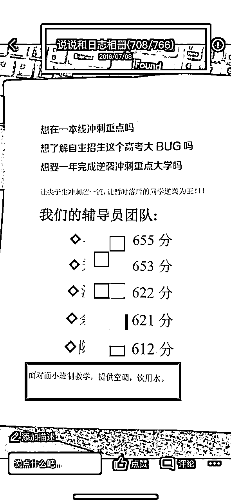

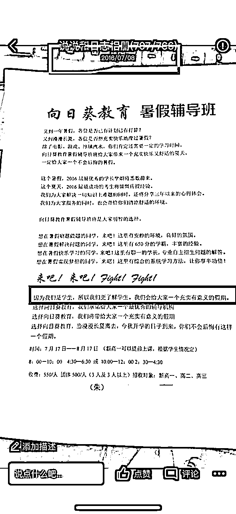

（上图是辅导班的宣传单页，日期2016年7月8日）

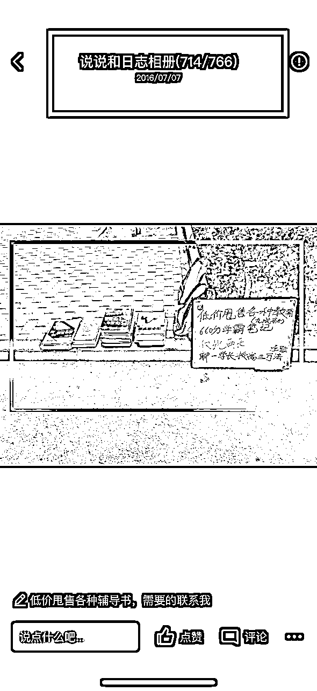

（上图是卖辅导书的记录，应该是辅导书的库存了，日期2016年7月7日）

#### 【2】找到自己热爱的行业，然后深挖下去。

商机，可能就是一句话的启发。

高考暑假赚了第一桶金后，父亲让我上缴全部利润所得，我没听他的。

于是他气哄哄地跟我说：不缴就不给你打生活费了。

我怼回去：不打就不打，我自己赚。

于是带着7000巨款，来到了大学军训场。站军姿的时候，每天都在寻思，不能就这么吃老本吧？忒需要干点什么。

成功的把自己从白皮晒成黑皮后，暑假自习室的“学霸老师”问我：“我舍友在卖鞋，家里有鞋厂，你要不要做代理？”

没错，就是莆田。当时非常流行科比、杜兰特、詹姆斯的篮球鞋，作为热爱篮球的穷哥们，一双鞋子甚至都要赶超我母亲一个月的工资了，专柜货是买不起的。

那时候微商盛行，大学里面都用QQ，我也做了一回Q商，也就是现在的私域雏形了。

推广方式，当时在大学宿舍地推，进去后一顿吆喝，其实大学鞋贩子不少，产品要有差异化呀，怎么弄？我就说老弟是大学刚创业，自己宿舍里就有现货，老哥几个下课后，可以去宿舍玩。

随后开始了第一波私域生意，当时零售做的还可以，但是产品的品质不行，三天两头的开胶、售后，后面就卖了一段时间就不卖莆田了。

当时给我的教训：商业信誉一定比眼前的利润更重要，客户就这么多，圈子就那么大，坏了名声，生意难做。

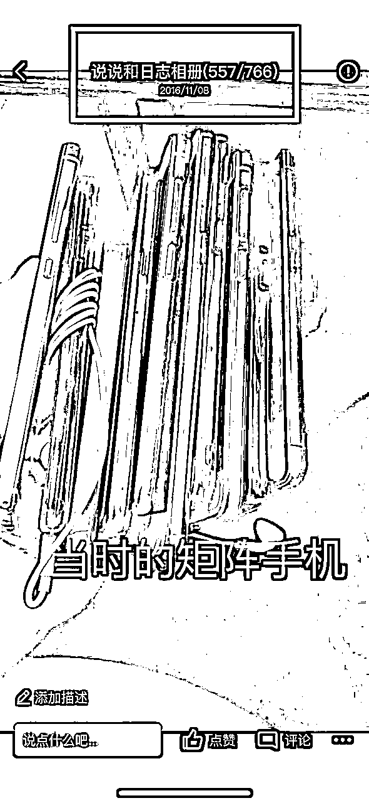

（上图是矩阵手机，其实没那么多客户，就是多弄几个手机给客户看，装X用的）

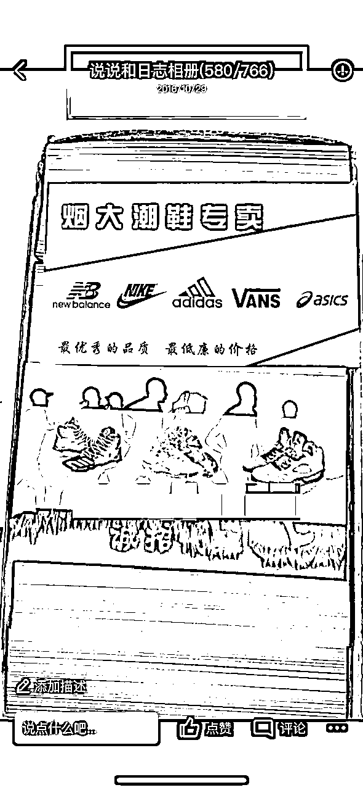

（上图为当时卖鞋的宣传卡片）

#### 【3】要做一个长期积累的商业，做一件一厘米宽度、一万米深度的事情。

起步后，其实创业就很轻松了，17年寒假回来，一个月便能有1万多的收入了，好点的时候能到2万。温饱问题得以解决，后续就在思考如何谋发展了。

既然卖FAKE口碑不行，那么不如转战正品？何来正品渠道呢？

不知大家曾记否，17、18年时，AJ1的禁穿、TOP3、椰子系列的冰蓝、白斑马陆续上线，鞋佬们开始正式的排队抢鞋之旅。

看了看手里的本金，能囤的货不多，于是联系国外同学、圈子同行、也开始陆续原价或者加价囤鞋子。

后边也有在卖奥特莱斯折扣、原单衣服、鞋子等，当时转战私域圈子了已经。

如此积累正向反馈了，慢慢积累口碑，也尝试过淘宝店，无论如何都把客户引流到私域上成交，然后在2018年，我大二下学期、大三上学期的那一年，就完成了百万的创收。

次年买了人生第一辆奥迪，A4L。

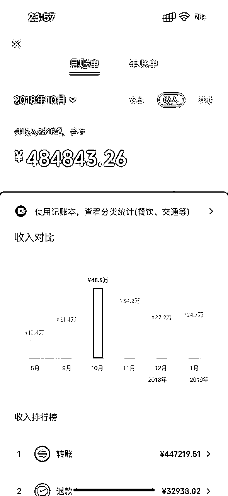

（贴个大图，都已经毕业了4年了，回想起大学创业的时光起来，还是挺感慨的）

不知不觉码字码了一个多小时，这会儿都凌晨12点了，时间过去太久了，有好多细节都忘记了。

只记得最初产品反馈不好，我就挨个去跟客户道歉，哪怕厂家不退货我也给他们退，然后慢慢挖掘好的产品。

从零到百期间也尝试过淘宝平台、也做过无货源电商，甚至自己搭建过校园外卖团队（当时想在学校里建立一个自己的信息服务平台，外卖触达的群众最多）。

其实回想下来，试错也真是蛮多的，当时18、19岁，精力也旺盛，每天也不用睡太多觉。白天就干活，晚上就去喝酒、消遣，也是蛮快乐的。

当时也没有想着组建团队，就是我和女朋友（现在的老婆、孩子她妈）两个人，她拍照、上图，我做运营。

细想下来，以我现在的认知，术的层面，可能也不能再更加丰富、完美一步了。

创业就是阶段性的正向反馈，当逐步拿到正向反馈以后，心中的价值感和自信，也是慢慢上升的，选择大于努力。

如果给自己的20岁前打个标签，其实我认为还是太顺利了，以至于后面吃了巨大的亏。

用运气赚来的钱，也会凭自己的认知亏出去。

所以后面从20岁上学开奥迪，到亏进去了几十万身无分文、流落街头，那段时光是自己最难忘的日子，这段压抑、自我怀疑的日子大概经历了小一年。

如果有人看，就点点赞吧，毕竟作为一个新人，还是想要在生财有术这个平台持续更新的~

这篇文章写得更多的是流水账，没有太多的思考，毕竟红利期不做细。

爱大家，拜拜~ 过几天有空再更新

## （二）从开奥迪上课，到身无分文。时运不济、命途多舛，聊聊失败的那些经历。

人在走运时，感觉个人能力无限强大；人在失意时，总是在抱怨自己生不逢时。

成功时看个人能力，失意时吐槽时机不公，以目前的认知来看，这完全是反了。但放在自己尚未毕业，迅速拿到结果、又迅速衰落的过程，再回首看，还是年轻。

如果现在一个商业朋友问，你为什么会做成这样，那回复肯定是运气好~

也确实，创业的路上，我的运气好像爆棚，至今也是。希望我把这份好运，也传递给屏幕前的你！

### 【1】人是环境的产物，商业环境是时代的产物

其实这句话，就是我当时失败的最大原因。在大学生创业的那个圈子中，能杀出来的本身就少之又少了，而能杀出到百万利润的，更是寥寥无几。

在当时大学生创业的那个环境中，没有持续的向上社交，或者说有意识的在向上社交，但是没有这么一个环境。

回想当时的状态就是，执行力和钱到位了，但是认知没有跟上。拿运气赚的钱，最终总是会因为个人认知亏出去的。

（具体原因如下）：

2019年，拿着赚来的第一桶金，去投资了一家泛娱乐的自媒体公司。当时抖音平台泛娱乐直播板块刚刚开启，属于是风口行业。

当时投资的那家传媒公司，本身是刚成立的公司，有2个比我年长5-6岁的大哥在一线干运营、还有2个40岁的投资方给他们注资。

我喊着我的合伙人加入，我们负责在大学校园招聘艺人，工作模型就是招聘--艺人运营--直播打赏变现，因为板块刚兴起。只要是情商高、长相尚可的大学生姑娘，平均每个月直播流水大几万不成问题，多的一个主播，一个月小几十也是正常现象。

一句话总结：狼多肉少。

这么好的一个行业，怎么会亏？

对我个人来说，一个字：贪。

对公司层面来说，财务模型混乱。

一念嗔心起，百万障门开。我和我的合伙人，3个月时间招聘了40多个艺人，平均每个月流水能达到50W左右，毛利50%。

艺人入场后，又拓张场地、又是管理混乱。尤其是我们投资后，合伙人换了保时捷，我和俩合伙人每个月拿个2K的基本工资，而且对未来无限憧憬。

这个项目也就干了半年，就叫停了。合伙人太多，人心不齐，财务模型及其混乱，公司账务和个人账务严重混同。

2000平的场地连着租赁加装修，浪费严重，艺人本身是大学生，流失又及其严重。不管是再好的项目，在不行的人面前，都承接不住。

心态浮躁，也是失败的核心原因之一。

### 【2】做生意不能靠赌，而是测试。

泛娱乐传媒公司失利后，学长找到我要一起投资一家酒吧。

好处是：酒吧在大学城还不错的位置，200平的场地，能摆10几套桌椅。挑高足够高，还能搭建二楼。

坏处是：酒吧是毛坯房，甚至连水泥地都没有的毛坯房。连着租金、加上装修、加上买音响设备和进酒，要30多W。

继上个话题，有部分朋友都劝我，你要有个实体门店，光靠互联网不行的。最起码老板来找你，需要有个店面项目在。所以还是说，人是环境的产物。

19年开的酒吧，20年发生口罩事件了。学长后面也就不管店铺，去考公务员了。

嗯，这次失败给我的教训就是，不要再投资任何的实体生意。这是时代更迭的产物。

有人问，未来实体的出路是哪儿?就像上个世纪的大哥大一样，出路在哪儿？

商业环境是时代的产物，我们不要逆着商业环境去做事。仅此。

### 【3】聚焦在一件事中，长久耕耘。

以上两笔重资金投入，并且自己的时间、精力都严重被消耗后，我发现了一个道理：

做好一件事，坚持十年，比一年同时做几件事都重要。

校园时期的我认为，一个人牛逼，在于这个人全方位都很牛逼。但如今我认为，一个人的热情、精力都是有限的，他想在一个地方有建树，已经很难了，更别说精力分散做多件事了。

如果现在一个年轻人告诉你，他在同时做多件事，且都还不错，那么这个人要么是二代来体验生活的，要么距离嗝屁就只是时间问题了。

所以口罩年及以后，我在极力想把自己聚焦在一件事上。多学点技能、多点认知。

于是我考了法考、从事了律师，律师实习期间，我也不断跟自己说，我做律师只是一个媒介，最后还是要回归商业的。

所以兜兜转转一大圈，又干回了私域中。不过这次不是服装项目了，而是大健康。

项目和项目，真的是只有对比。

服装项目，供应链不稳定、出货周期时间冗长、售后率存在、项目周期较短。

大健康项目，供应链稳定，客户买了后复购率高、客单价高，且真的不存在售后。如果存在售后，那就是客户买错产品了，需要换一款。

复购率80%以上，也是足够大家长久的复购了。

## （三）创业三次，失败两次。复盘下失败时候的心态，以及东山再起的勇气和经历。

（三）创业三次，失败两次。复盘下失败时候的心态，以及东山再起的勇气和经历。

上篇文章得到了很多朋友的点赞，我很开心，也有继续创作下去的动力了。

还有一些朋友说上篇文章，感觉还没有开始就结束了，我也是以上帝视角，客观复盘自己的动作错误。这篇文章，我就再更多加入一些自己内心的主观情绪描述、加一些图片等细节，增加下真实感。

现在是2024年6月21日20时46分，码完这篇长文，估计要到凌晨了，镕升老弟提前在此，感谢大家的观看了~

如果大家感觉有用，还劳烦点个赞，也是老弟继续更新下去的动力

（附两张22年和23年创收截图）

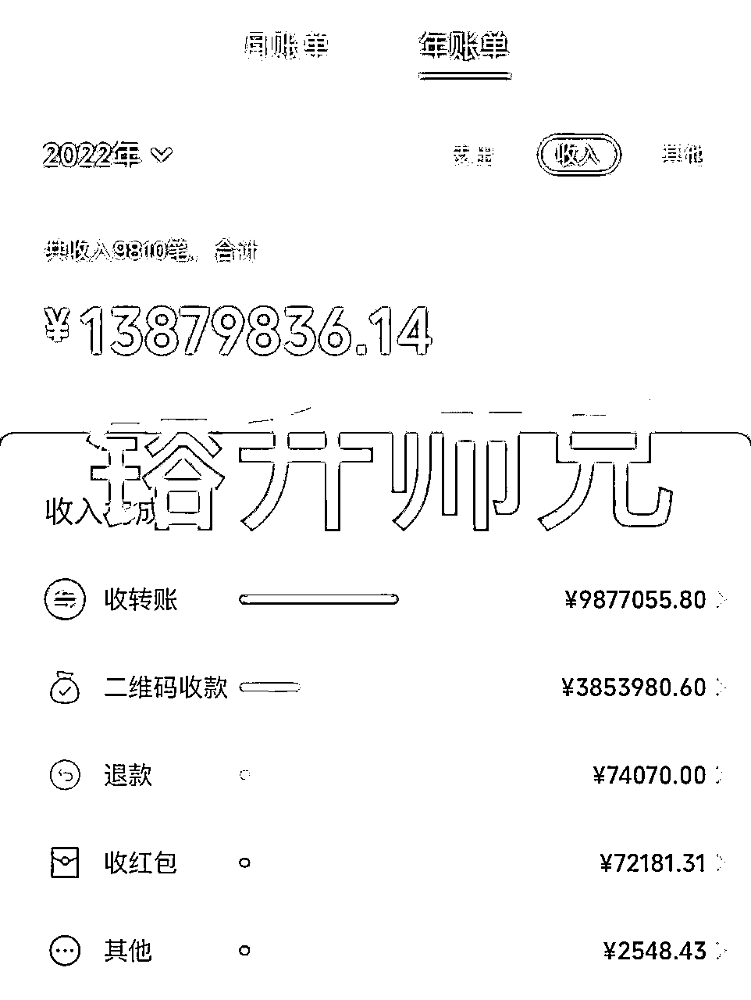

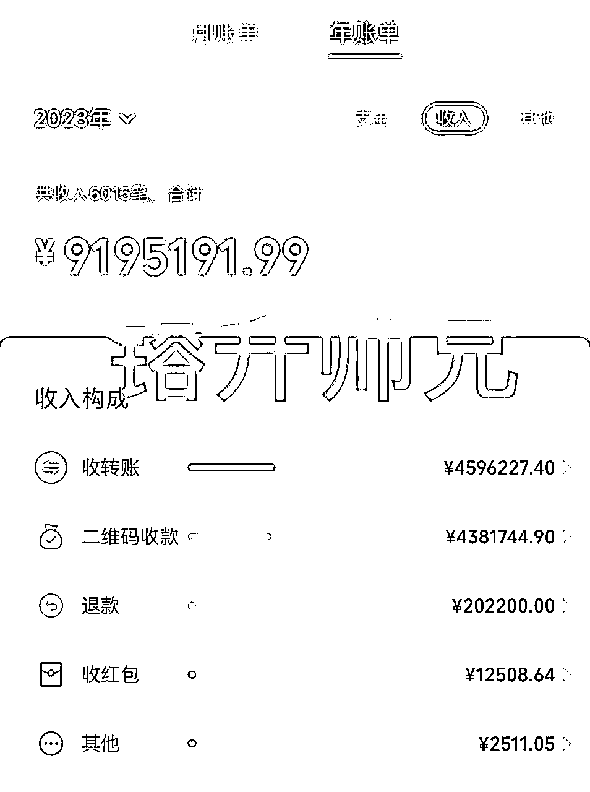

### 【1】对失败的反思

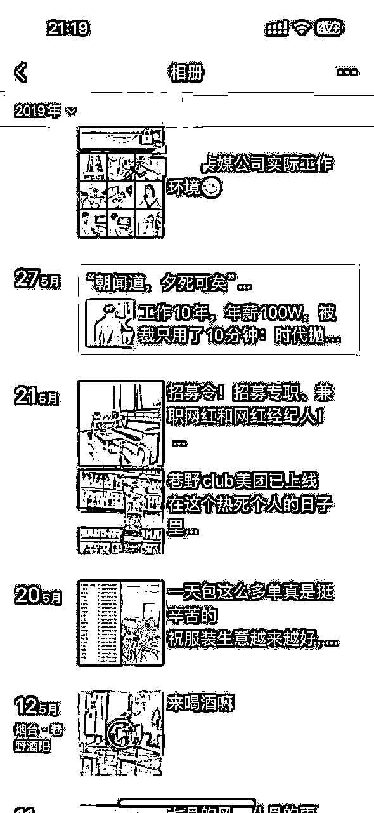

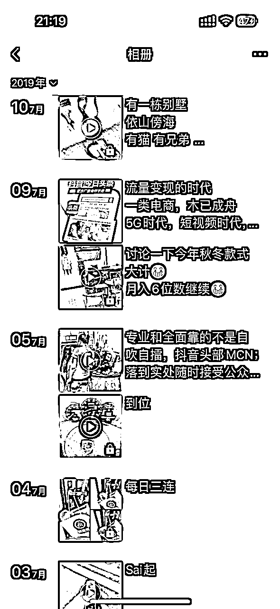

这是我2019年时候发的朋友圈，当时正值大学时大三、大四，其实看一下朋友圈发的还是很错乱无序的，包含了酒吧、泛娱乐的传媒公司、还有服装。

因为当时又投资酒吧、又投资传媒公司，还做着服装生意。

而且当时自己极度膨胀，不是发保时捷、就是别墅靠海的。

对于我的大学时光，我感觉足够算高光时刻了。大家都还在讨论能否毕业的时候，我已经开了好几个公司了；大家还在考虑过年能否抢到票的时候，我已经开着奥迪回家了。

人是什么时候开始飘的？就是在自己无比好的时候，他会以为自己能一直这样好，于是开始社交、开始喝酒。

慢慢地脱离了业务一线，等回头发现不好的时候，即使花了很大的力气也未必能起来。

只有一个风口抓住，再等下一个风口才有足够的资金、跟随你的兄弟也才会有足够的资金陪伴到下一个风口，或者下一个项目。

对于当时的心态，失败是必然。再加上20年口罩事件，无疑是压死骆驼的最后一根稻草。对于失败的原因，我总结如下：

1.不聚焦，业务体态太多。

没有考察市场就贸然入场。就比如酒吧，自己完全不懂，纯是因为自己想有个社交的场所，跟有意向合作的老板说这个地方是我开的。说白了就是单纯为了一个面子。

2.生意讲究天时、地利、人和。

如果按张琦老师的思路，就是天地人网。19年的时候，抖音泛娱乐直播板块刚打开，无疑是一个风口行业，并且快速拿到结果了（第3个月，当月就拿到了25W的利润，上文有提到）。

天网正确、地网正确，但是差就差在人网里面。找到一个靠谱的合伙人，难度不亚于找到一个结婚、长久走下去的配偶。

3.心态浮躁。

当时拉了很多愿意跟着我的同学和商业朋友组建团队，但是这种浮躁是从上而下的。小型企业，老板是业务核心，当业务模型还都不成熟时，我带着团队天天出去喝大酒、唱歌、蹦迪，大家都没有耐性冲到一线踏实干业务了。

4.缺乏预见性。

现在我每天都在努力发展第二业务曲线，也就是PLAN B。

我时常在想，如果哪天目前的业务体态崩塌了，跟着我的弟兄们去哪里吃饭？如果再碰到类似口罩事件一样的黑天鹅事件，我自己要怎么果腹？

对当时的自己来讲，就单纯的认为运势会无限好。丝毫都不会考虑是否要提升学业、继续读研，或者考公考编，为自己的下限提供一个保障。

所以在2020年，也是自己大学毕业的一年，我整个人其实是浑浑噩噩的。口罩元年，所有业务基本瞬间崩塌，一下把赚到的钱全部挥霍一空。

沮丧、失意、怀疑、自暴自弃这些情绪是陆续涌上心头的，但是我很自信，我有信心再做起来。

于是口罩元年，我又从广西、浙江、山东省内等地喊来了很多兄弟，没有基础工资，在烟台这个城市，大家一起干服装，而且只干私域的服装！

我想看自己聚焦在这个行业，能不能长久发展。

这一年团队最多的时候，有10多个小伙伴。

我们做的是服装的供应链，重资本投资出货、然后卖现货，当时私域、淘宝、拼多多都在做，为了压缩成本，我们就把价格卷到极致。

服装最大的痛点，就是售后率太高。

更何况我们是重资本投入，把全部的费用都压到供应链上。这又是一个自己不熟悉的环节，面料、辅料、织布、拉链、卡扣、内胆、吊牌等知识全部现学。

这一年，好在团队平进平出，最后一盘算利润，大家赚了一仓库货。

算到自己身上，没赚到啥钱，然后就把团队解散了。

服装这个生意做不下去了，那要去做什么呢？

### 【2】走运走运，走着走着，运势就来了。

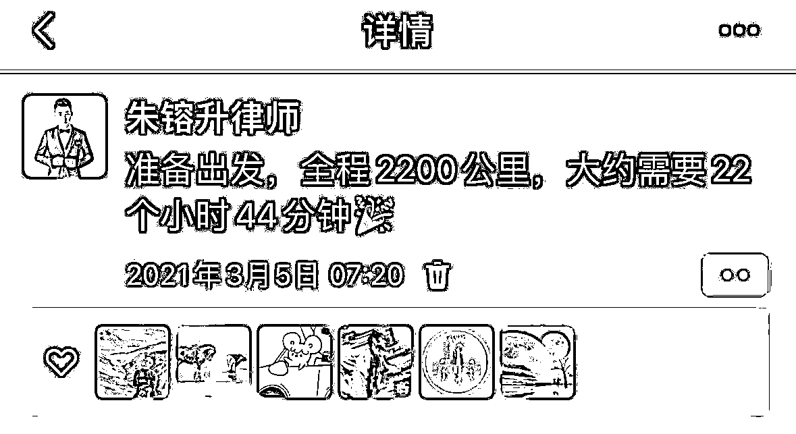

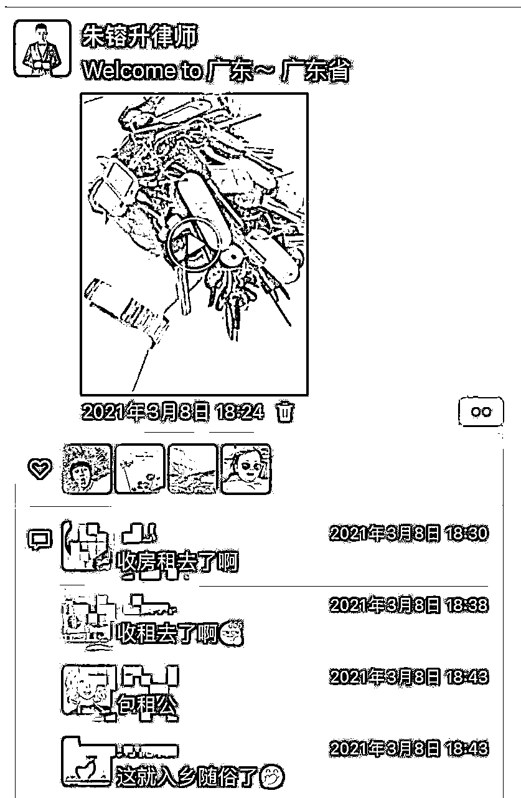

服装干不下去了，那要干什么呢？

答案是不知道。不知道就出去，反正已经大学毕业了。

我问我老婆（彼时的女朋友），愿不愿意跟我出去广漂？

我老婆：走！

（至今我非常感谢我老婆，我的所有天马行空和不切实际的想法，她都陪我走过来了。如果没有她，我可能在那种高压状态下，会抑郁吧。）

收走就走！叫了辆货拉拉，把烟台的服装尾货、货架等资产，全部拉回农村老家的院子里。

我和我老婆，又带了一个硕士大哥（20年最后加入我团队的大哥），我们三个人开车直接从烟台杀到了广州，2200公里，开了两天一夜的车。

到了广州，接待我的朋友也是漂了多年的老广了，直接把我带到他的服装档口，周边找了个城中村安顿下来。

在广州白云区石井服装市场，我们寻摸了一圈，这尾货价格便宜到我们难想象，真的是论斤称。

再干什么？干服装！

又是三个月时间，又是干抖音电商直播（当时抖音店播刚兴起没有多久），又是踏在风口上！

（当时抖爸爸还不会隐藏客户的手机号，我们就把成交的客户全部加到私域上，然后做复购，最近这些客户还有在持续下单的）

运气好吗？真好，每次都能踩在风口上？

运气真的好吗？硕士大哥快30岁了，跟他当时的未婚妻天天吵架，异地恋干事业，这个问题无解。

我当时跟老大哥说，哥，咱们再坚持坚持，再干上1-2年，咱就回去。

爱情陪伴和事业成长，就像鱼和熊掌一样，不可兼得。

抱起砖头，就无法抱你；放下砖头，就无法养你。

21年3月我们去的广州，21年6月，我们一天发600多票，电商利润稳定、私域利润稳定的情况下，老大哥决定回归家庭了，虽然不理解，但我表示尊重。

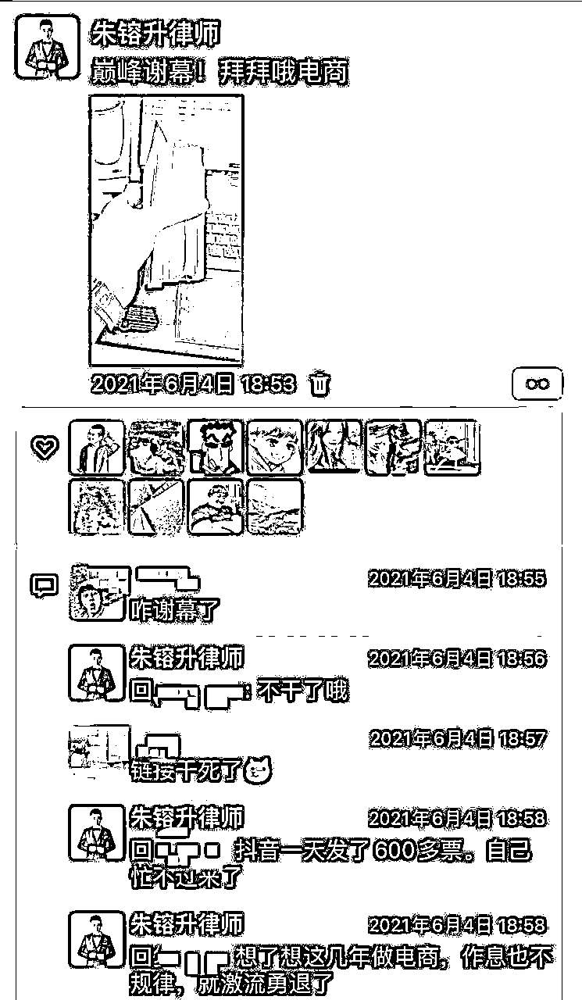

至今我和老大哥关系依然很好，每次我到烟台来见一些商业朋友，我都喊着老大哥一起。老大哥也每次都给我发消息，我们现在仍然保持着很紧密的联系频率。

我记得有次，老大哥晚上跟我打电话，说如果当时我们再坚持坚持，或许会不一样呢？

我笑了笑，我说哥，我现在也是俩孩的父亲了，其实以前我挺不理解一件事，为什么趁着年轻不多奋斗事业？

自从自己结了婚、当了爹以后，我发现人民日报有句话说的是真TM的对：

人一生要有两份责任，一份是社会家庭、一份是家庭责任。

日出时我们要拥抱事业，我们要投身于社会中，在事业上付出，追求我们的社会责任。

日落时我们要回归家庭，我们要与爱人相拥，回归我们的家庭责任。

当时我虽然不理解，但尊重；如今我理解，也尊重。

跟老大哥挂了电话我也在想，如果当时，真的再坚持一下，可能会更好吧？

世界上的一切成功，不过是选择一个对的方向，时间与耐力的产物而已，我至今坚信。

这次是真的不干服装了，那再去干什么呢？

### 【3】3个月通过法考，我把浮躁的心沉下来了。

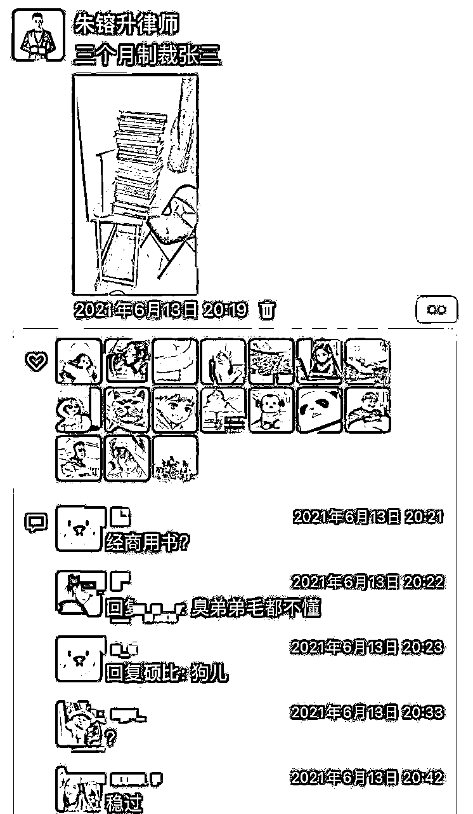

21年6月4日，带着三个月的积蓄，再想干什么项目呢？

老婆劝我，你本身是学法学专业的，为啥不试着过个法考呢？最少没什么坏处。

我一想，是这样啊。

然后随机上网去查询法考报名时间，6月9号截止报名、9月份考试。

于是去拍形象照、买书、报名。

21年6月13日，雄心壮志发圈：三个月制裁法外狂徒张三！

在此特别感谢罗翔老师，我的刑法是全称听他的课下来的，如果不是罗翔老师的幽默风趣，可能这个备考的过程中会很无趣。

本身基础就弱，大学时期忙于做生意都没怎么去上过课，那就努力呗。

没想到，备考法考的时候，真正把心沉下来了。

总书记说：每个优秀的人，都有一段沉默的时光。那段时光，是付出了很多努力，却得不到结果的日子，我们把它叫做扎根。

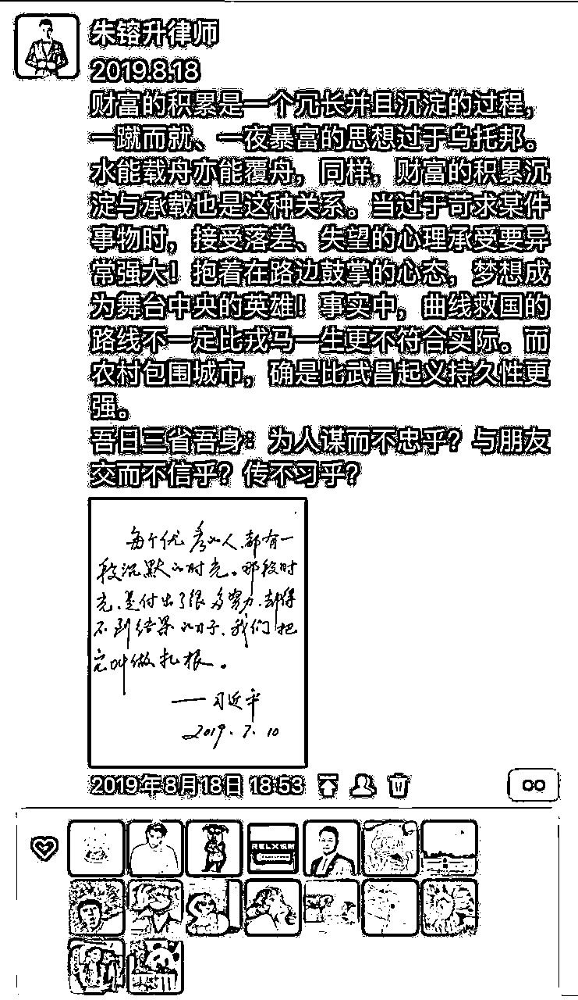

写到这里，截一个19年大学时期发的朋友圈吧，我想我真正的沉淀和扎根，是在21年的广州，那个满是蟑螂、北向没有阳光的城中村的小屋子中。

备考其实并不痛苦，我认为我的学习能力还可以。不能说过目不忘，但是跟着书本听一遍课，我就能记个7788了，剩下的时间就刷刷题、打打游戏。

（备考期间还把英雄联盟从青铜打到了铂金段）

但是学习毕竟是枯燥的，但是认识到，哇，还有这么多有趣的知识。嗯，能为自己以后再从商，提供到不少帮助。

于是就在一个又一个的张三粪坑案、张三杀人案、张三假币嫖娼案中，度过了人生非常愉快的几个月的时间。

当时所有人都认为我考不上，包括我老婆，毕竟对一个天天打游戏、还时不时开车去趟珠江新城看看广州塔，甚至因为违反广州限行开四停四规则被扣了驾照的12分的人来说，好像通过考试才是最大的不可能。

感谢司法部爸爸给我抬进线，当时我还乐观地跟我老婆分享，我能超线20分（实际超了10多分吧）。毕竟对于及格性的考试，而非选拔性的考试，过线就可，哥们大学四年是最擅长了。

再放个小插曲，当时还在广州认识了一个做抖音内容极其牛X的老大哥，他后来还去了大、小杨哥那里做了编导。

公司的小伙伴也极其优秀，抖音上人均单视频千万播放量，努努力播放量就过亿了，且全是自然流。

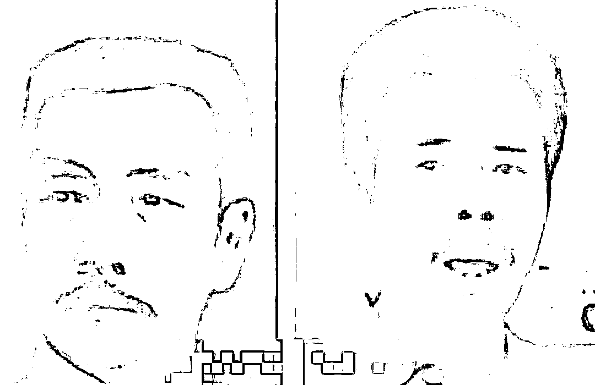

不知大家最近有没有刷到过收破烂的儿子、和爱吃槟榔的爸爸。

这就是我们曾经一起工作过的小伙伴做出的账号，半年做了150万粉丝，刚才去抖音截图的时候一看，不到1年的时间做了300多万粉丝。

像这种风格的账号，我们当时在广州的团队，做了大大小小几十个吧。后面团队解散后，大家也都去做自己的账号了，并且全部都成为现象级的IP。

也就是那时候在我心里种下的种子，其实万事都不难，有一个好的创业环境、有一群有干劲的小伙伴，是多么幸福的一件事情。

所以在我上篇文章中，我说，人是环境的产物。现在我想再加一句，商业环境是时代的产物。

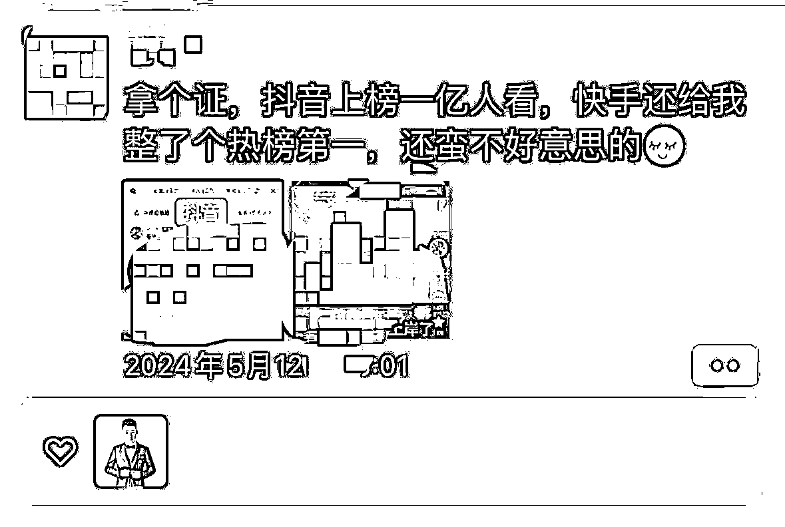

这是当时广州公司的boss，自己做的IP账号。

死磕内容、研究爆点！向他致敬！

他当时最影响我的一句话是：我要把公司的小伙伴都发展成合伙人。

参哥说过一句话：认真分钱，一起走十年。

这种发自内心地认可，影响我至今，并且我也会把我做人做事的方式贯彻到底。

法考过后，喜上加喜，老婆怀孕了，还是双胞胎。

然后迅速订婚、结婚，结束了我们在广州广漂的生活。

现在在山东，仍然怀念在广州的生活。那种从商环境、氛围，我是要再回去的。

广深两地，镕升老弟对你们有执念啊！

### 【4】是金子，到哪里都会发光。

婚后回到山东，一方面从事着律师实习的工作、一方面干着私域老客户服装的生意。

实习律师，到手2000工资，属实是压榨的厉害。

但哥们是打不死的小强，穷则思、思则变、变则通、通则达。

大学创业时候的朋友，这个时候已经有很多跑出来的了，很多人也都在喊我，要不要一起再创业，无论如何都已经跑通0-1了，只能放量即可。

这些人中，有百人公司的老板、也有小而美团队（3-5个人公司）一年几千万的老板了，更有一些投资者。

说心底话，一开始我都没应允，全部推辞了。我在想，我在从事的律师实习的工作，虽然不赚钱，但是凭我的努力，也会成为一个小富即安、维护公平和正义的一方小律师。

但是要不说我运气好呢？有时候你想躺平摆烂，生活它不允许啊……

21年年底，我拿着我创业的最后一点积蓄、把家里掏空，我爸又把亲戚朋友借了一圈，全款买了套婚房。

当时房子都TM封顶了，谁能想到封顶的房子会烂尾啊！然后房子爆出消息，烂尾了。

得，哥们本来想躺平一下的，结果躺了还没有一年，又要奋斗了。

于是又联系了一圈商业朋友，看看有没有愿意收留我的。最起码一个月工资比2000高就行。

应该是基于我的颜值，我的前合伙人，给我抛出了橄榄枝。

基础工资给我涨了10倍，另外加项目分红。

于是就有了开始的那两张截图，他在前端搞流量、我在后端做销转。

也就是我的母盘，大健康行业。

干大健康之前，我的想法：这玩意不就是坑害中老年人的么，保证没有副作用。

干大健康后，建议全国推广！

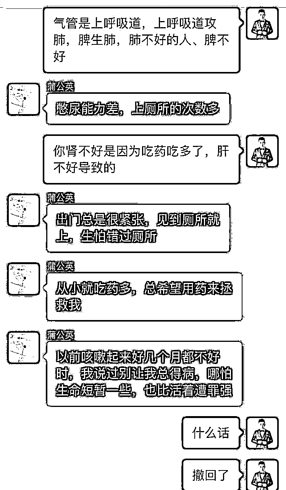

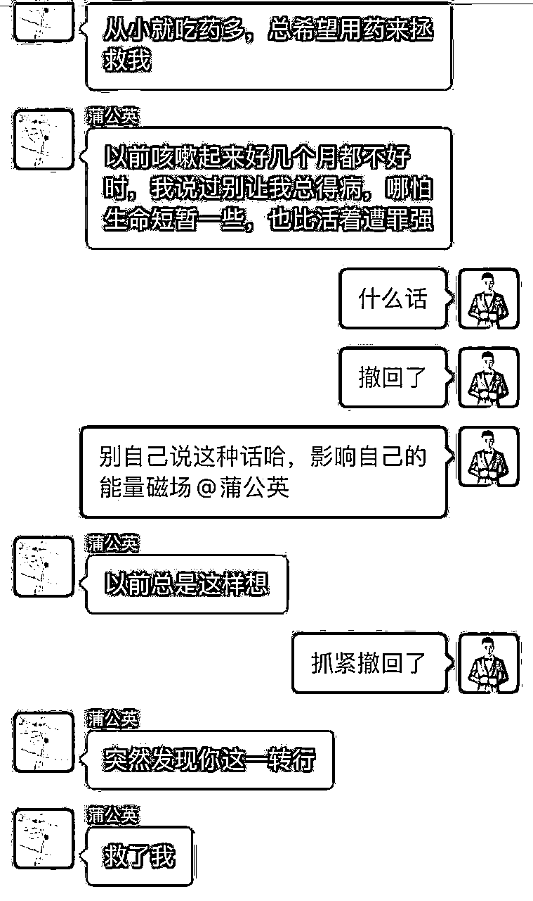

（如图是我的家庭群中，我母亲和我的对话，我母亲从小身体就弱，一到换季的时候就感冒、咳嗽，吹不了一点风。家里的药物更是数不胜数）

可能我妈妈表述的是基于她立场的感受，但是我不希望她说这种话，祝天下所有的妈妈都长命百岁！身体健康！万事如意！

祝天下所有的爸爸也是！

（不招商、不加盟！大健康的产品卖的是跨境的一些保健品和药食同源的产品，某宝都可以买的到！）

然后我又在私域干起了大健康行业，网络销售么，而且干的还不错。

起势靠流量、终局供应链、结果靠品牌！

所以在上篇文章的开始，我说我的运气好到爆，也希望我把我的这份好运，传递给屏幕前的你们。

以前做服装的时候，一年流水最多的时候也能到8位数，但是那是靠批发、TO B，做供应链利润薄的厉害。

但是做大健康后，这个行业对人有帮助，客单价也不低、利润回报率也不低，同样是八位数，利润比差好几倍。

品牌--营销--供应链--生产制造这四块，最赚钱的肯定是品牌，有溢价在，这个不多说了。既然品牌我们干不了，那我们就干什么？干营销，营销的利润板块是最大的。

所以再回想，2020年口罩元年的时候，我为什么那年10几个人的团队不赚钱，因为干的事是供应链，而不是最大利润板块的事。

对于这件事，我非常认同参哥的一点就是，其实80%的利润，是由10%的动作产出的。对于大健康赛道我们盈利，那就是供应链强的前提下，不断做流量、做销转，客户每次都有复购，而我们每次都会链接新的SKU。

客户体感好，很多慢性疾病问题得到解决了，老客户在裂变、新客户在加入，所以私域更多产出的是睡后收入。

当一个项目业务体态足够优秀，而且你能帮助到更多人的时候，那么财富，只是结果。

从商业角度来剖析大健康这个赛道：

一、市场份额足够大，这是一个万亿级别的市场。

二、产品客单价足够高，只要你给客户解决了需求，有钱人都是怕死的。

三、基于客单价高的基础上，利润率足够高。

四、客户体感好，裂变属性足够强。往往我们在跟一个人调理的过程中，最后客户的一家人、亲戚朋友都来了。

五、富人的钱还是好赚。我们每年消费5-10W的客户，有100多个将近200个，这些客户给我们提供的利润，支撑了我们业务体态的80%以上。

我的初心，我能帮助我妈妈改善慢性疾病的问题，那我也想帮助全天下的妈妈，解决健康问题。

像我们这代人，20岁的时候，便出现了脂肪肝、三高等问题，社会太发达了，富贵病、富贵包，都是因为富贵才出现的。

而现在的人口老龄化也日趋加深，健康问题和亚健康状态，是大家都需要解决的问题。

商业周期，就像人生一样，我们生下来的终点便是死亡，那么商业周期也是有时效定论在的。我历经过很多次失败，这次我想抓住这个商业周期，来做一份事业，真正对他人有帮助的事业！

我的梦想，也是想成立一个大健康的品牌，真正对他人有所帮助。

生财的大佬很多，如果您是在做大健康行业供应链的，如果您认可镕升老弟的想法，那老弟想您给个机会，我会在大健康这个行业内深耕。

对于暂时可能遇到坎坷的哥哥、姐姐们，镕升老弟有句话想送上：

伸手摘星，即便一无所获，你也不会满手污泥，朝着最好的方向去做，念着最真诚的心愿，无论此刻多难，都能挺过去。

花还会再开，春天也一定会再来，你要做的就是，静静等待这一时刻的到来。

### 【5】写在这篇文章的最后，说点心里话。

以上三篇文章，更多的写的是流水账，学生时期比较多，因为学生时期的日子比较滋润，毕业后到如今成家，其实面临的压力是不小的。

文中我尽量用诙谐的语言、和主观反思来考量我的过去，以及我对商业的理解，其实也就是想，给大家传递一些积极向上的思想。

如果屏幕前的你也遇到困难了，不要借网贷！不要靠赌！

财富是对认知的补偿，不是对勤奋的奖赏！

穷者顺势而为，富者因势利导。

我也曾经历过无数失眠的时光，也曾抱怨过命运为何对我不公？

但是无论你如何想，明天的太阳也会正常升起，所以在乐观和自信当中，你选择只能是更加相信自己！

在此跟我老婆说声感谢，感谢她陪伴我度过了懵懂无知的年少时光，感谢她陪我走南闯北四处流浪，也感谢她为我生育了两个宝宝。

一定多听听老婆的意见，尤其是膨胀的时候。

爱妻者风生水起，亏妻者百财不入。

后续我会在生财有术平台，分享一些流量、私域运营的知识，如果大家感谢有用，那就给老弟点个赞吧。

虽然我们素未谋面，但我希望我的文字，能够温暖到你。

又码字到凌晨12点多了，这种流水账风格似的文章，我自己都看不下去，感谢各位看官能看到这里，给您鞠躬了！