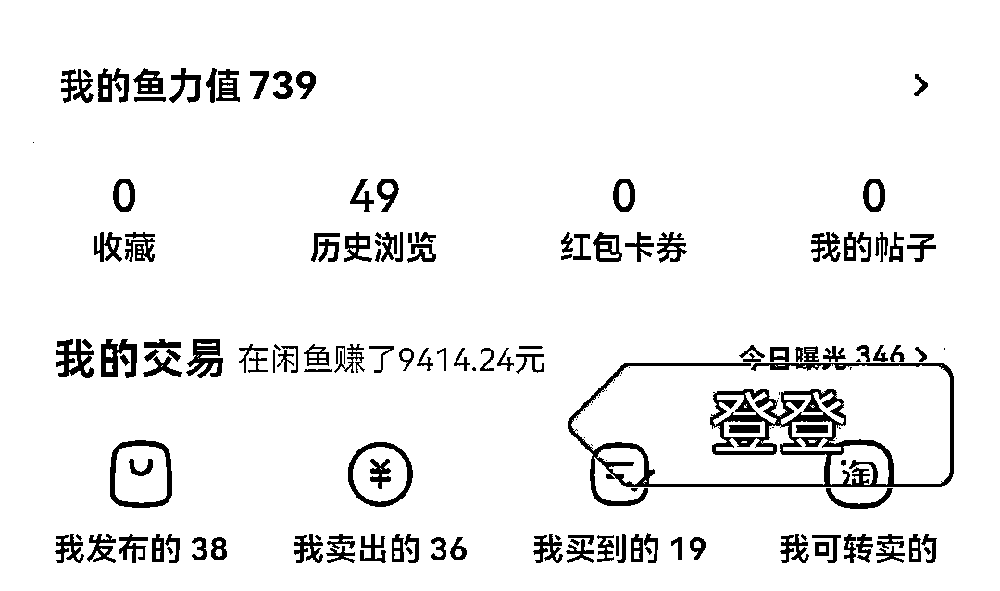
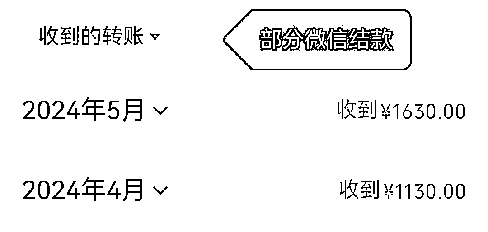

# 生财新人半年赚回5倍门票，AI代写2个月1.4W，0报课也能做，分享我的经验之谈和心路历程

> 来源：[https://zfp3rk26eg.feishu.cn/docx/FxyLdsscOooQTgxvj8PcEMdjnVe](https://zfp3rk26eg.feishu.cn/docx/FxyLdsscOooQTgxvj8PcEMdjnVe)

大家好，我叫登登，一个23年12月底加入生财的新人。

加入生财后，通过AI代写这个项目，我用了两个月多时间做到了1.4W的收入，赚回了5倍门票。

这个成绩和圈友们比起来不值一提，但还是希望能给迟迟无法踏出第一步的小伙伴一些经验之谈。

AI代写的门槛非常低，有手机、电脑就行，至于担心自己的写作能力，完全可以交给AI，使用简单的提示词和技巧就能得到一份不错的文章。

所以，如果你是一个还没有找到赛道的新人，也不知道自己有什么突出的技能，那么完全可以用这个项目来锻炼自己搞钱的手感。

在文章正式开始之前，我想感谢几个人：

感谢《搞钱女孩》播客主播雪姨和小辉带我进入生财，打开新世界的大门；

感谢公众号爆文航海教练兔子鱼鼓励我将这次经历分享出来，还超级用心地帮我修改；

感谢AI代写TOP级大佬掩体和许多圈友无私的分享，让我有机会接触这个项目，搞到第一桶金；

另外还要感谢超级厉害的小鹅，她的分享让我在刚进入生财就获得了很多力量和勇气。

# 一、和“生财有术”相遇

我是在去年12月底加入的生财，在此之前我已经辞职五个月，在家一边焦虑一边找人生发展新的方向。

我的成长经历几乎和“搞钱”没有关系，从来没有得到过工作之外的金钱。

新手村的我没有任何商业嗅觉和商业思维，我必须学习搞钱这个技能。

我开始留意网上能刷到的和搞钱相关的信息，也不停和朋友聊到"搞钱"这个词。

大数据听到了我的声音，让我遇到了《搞钱女孩》这档播客，也是我第一次知道“生财有术”这个神秘的社群。

雪姨说生财像一个大学，这也是我的感觉。

在这所“大学”里，搞钱是所有人的目标。

精华帖是教材，风向标是平时作业，航海是选修课，圈友们亦师亦友，你遇到的任何问题都能在这里找到答案。

你需要做的就是找到适合自己的那条路，踏上去。

# 二、第一桶金

很惭愧地说，刚加入生财的两三个月，我没有搞到钱。

这段时间我坚持看帖子、找项目，主要是门槛不高、自己也能尝试的项目。

圈友@掩体发的帖子就是其中一个，这个挣到100W的大佬非常详细地分享了如何当写手、如何交付、如何开店铺，感兴趣的朋友可以前往掩体主页查看。

当时看完以后大概了解了闲鱼店铺怎么做，立马修改个人资料、上架商品，建立起咸鱼店铺。

终于让我抓住了一个机会。

在正式经营自己的咸鱼店铺之前，我在某boss平台认识了一个给写手派单的中介，平时他给我的大部分是几十块、一百的小单。

由于我参加过ChatGPT的航海，自己平时也有练习，经常AI写稿，一般的演讲稿、公众号、工作总结之类的文章不在话下，这里也非常建议新人小伙伴积极参加航海，开挂级免费培训它真的很香！

三月中旬他给我一个降重单子，要得很急，但是价格很高。

一共差不多写了四个小时，这单最后给了1500.

有了第一次的成功，我开始认真经营闲鱼店铺。

# 三、闲鱼店铺经营+小红书截流

我一边在闲鱼上架商品，每天擦亮、做任务，店铺开始没有流量，所以要从小红书引流。

引流的方法很简单，第一步，搜索关键词找到爆款笔记，在评论区以素人引流的方式暗示自己能降重，大概给十来个笔记留言，也在自己的主页发了两篇笔记。很快就有人私信询问能否接单，第二步就是转化到私域。随便聊两句，问一问稿件质量、字数、时间要求，就可以引流到微信了。

这里提醒一下大家，直接以文字或者图片的形式发微信号都会被屏蔽，我的方法是把微信号拆开，用藏头编故事的方式发出去，成功引流。

引流到微信后，聊到下单阶段，直接给客户发闲鱼商品链接，因为交易走闲鱼，所以大多数客户比较放心，这样增加了商品的销量，也能带动曝光量的增加。

通过这种方式，我从小红书引流了不少客户，这些客户后来有重复下单的，也有介绍新客户的。

加上我那段时间坚持领金币、擦亮，开始有人从闲鱼咨询下单，正好是毕业季，降重的单子很多，所以我虽然接单比较佛系，但还是在两个多月赚到1.4W。

# 四、给同样是新人的建议

## 1.学会链接他人

新人遇到卡点不要自己死磕，学会链接很重要，亦仁大佬都说了，你遇到的99%的问题都能找到人解决。

就算你是一个纯i人，也一定要去链接别人！

真诚交流，一定要尊重对方的时间，该发红包发红包，星球里发过怎么链接的帖子，非常有帮助，推荐新人朋友看看。

## 2.没有慧根，但要会跟

这里的“会跟”我有两种理解。

一是跟着人家选项目。

咱们新人啥都不会，想要快速成长，就要找到一个学习的对象，拆解项目，学习人家怎么做。

星球这么多项目，把精华帖、航海手册、风向标翻烂，总有一个你能做的。

二是跟着人家一起干。

比如我做的的AI代写，有很多圈友做得风生水起，如果能和他们一起做，一定会有更多的机会，这也是我下一步的计划，众人拾柴火焰高嘛。

最后，感谢看到这里的你，希望这个帖子能帮助到和我一样的新人圈友们，祝早日赚回门票钱！