# 零基础如何用好AI来爬取数据

> 来源：[https://ktnwm6ohjn.feishu.cn/docx/GM3wdFmtBoL8MfxN9aqcLkv4nob](https://ktnwm6ohjn.feishu.cn/docx/GM3wdFmtBoL8MfxN9aqcLkv4nob)

# 前言

之前在一个AI编程实战群我看到有不少圈友尝试让AI写个程序跑个爬虫总是遇到各种报错问题。详细查看了下，大部分都是没找到定位到元素的问题。

而我作为当时参与的志愿者，就顺带做了个分享，也就是这篇稿子。

我认为用好AI，是可以边学习Python语法边去实践爬虫和RPA的。这篇文章不会提及Python相关安装问题，默认已安装。

# 需求分析

首先，建议使用Claude 或 GPT4/4o ，目前提问代码相关的问题，我个人觉得 Claude 效果是最好的。

接下来以爬虫B站视频标题来举例说明。

我们想要去爬一个网站数据，首先要了解这个网站，B站可以不用登录简单浏览。

如果我们想爬取B站AI相关视频前100条内容，那要如何做呢？

我们把PY程序想象为人就行了，我们自己看100数据是不是一直刷？B站的话，还需要翻页。

人：刷B站，点击翻页。PY程序：看代码，点击翻页。

其实是一样的，只是PY程序看的是代码而已，它看的速度也比我们快多了。

# 实战演示

接下来我以无Python编程基础的方式演示一下如何爬取100条B站标题数据：

## 第一步 打开B站搜索AI

## 第二步 打开开发者模式

右键检查或打开F12，找到最左侧的这个选择元素的按钮（元素检查器），点击一下。然后鼠标移动到第一个视频的标题部分会有绿色背景显示，点击一下。这样我们就看到了相关的源码。有用过八爪鱼或后裔采集器的话，会感觉到这个步骤是类似的。所以也是说，无论用RPA/采集器其实底层原理都是一样的，编写selenium的代码可以理解为就是那个底层技术。

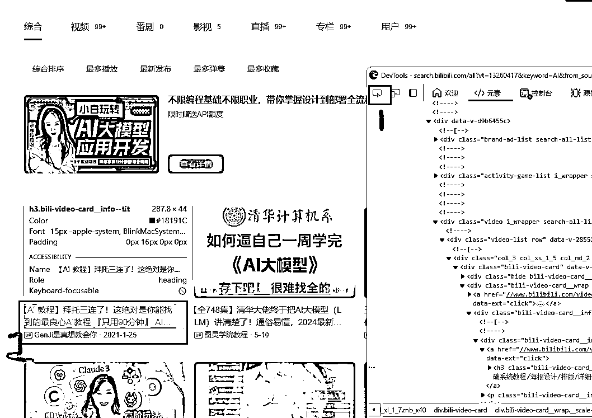

## 第三步 复制源码

复制元素代码，红框中这里我选择上面那个div进行复制？为什么？你看左边背景显示为视频列表部分，说明视频列表的数据都在这一块代码里面，我们复制这块代码就可以了。当然如果你复制整个页面代码也是可以的。(这里把代码直接截图也是可以的，待会发给GPT，只要把这部分代码截取下来就可以了。)

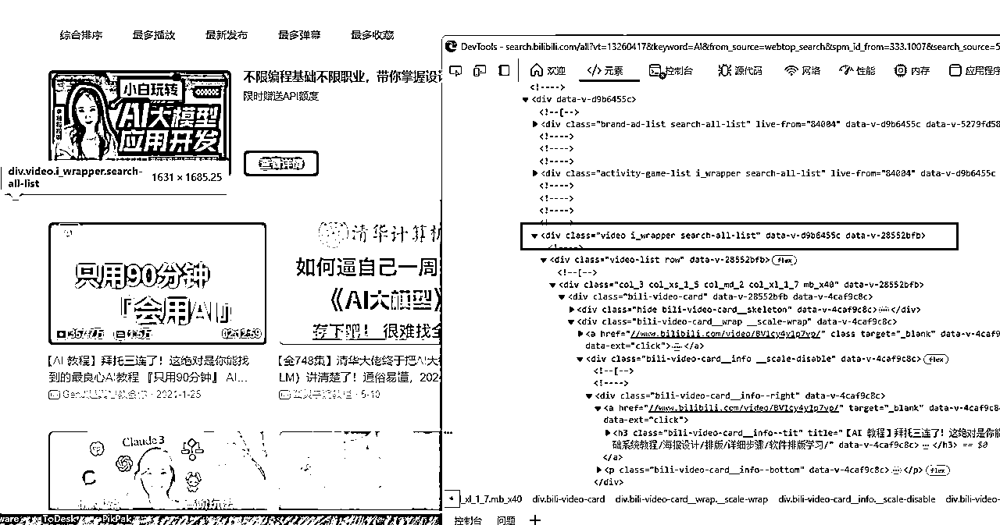

复制的方法：右键代码，复制，复制元素。

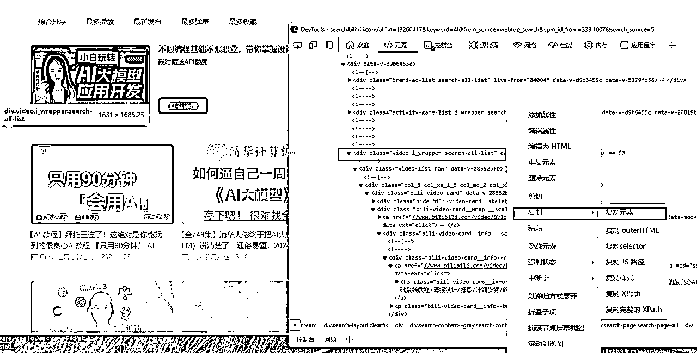

## 第四步 保存源码文件

把复制后的代码新建一个文本文件保存，修改下后缀为html (如果不会修改也没关系)。

这里为什么不能直接发给GPT？其实是因为代码太大了，直接发发不了。

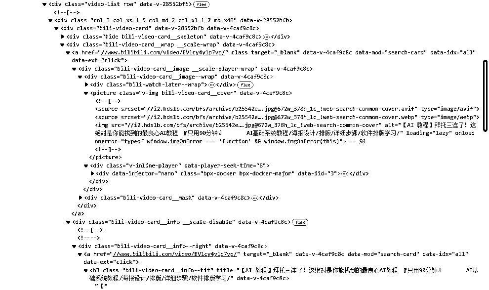

## 第五步 提问找GPT写代码

把文件或截图发给GPT并提问。我这里使用的是GPT4，GPT4o也可以。

提问其实提示词不需要多么高大上，不一定非得用模板，重点是把你的需求说清楚，每次提的需求尽量简单，而GPT4就是你的个人24小时工作的码农，你要他写的代码用得上，重要的是自己的需求表达没问题。而且，一次没表达清楚，可以反复沟通需求。

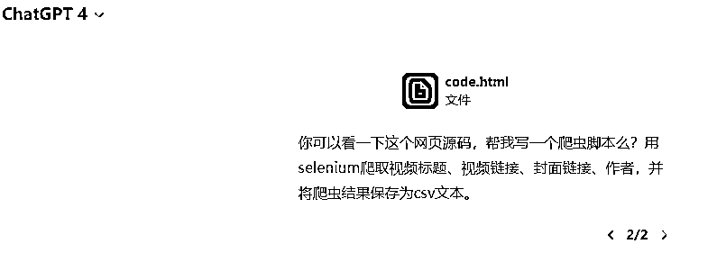

我这里用的提示词就比较简单，重点说清楚使用selenium，(默认python3代码所以没说)，爬取视频标题、视频链接、封面链接、作者，保存为csv文本。

如果回复是英文，不要紧，跟GPT说回复中文即可。

然后在浏览器地址栏记录一下自己要爬取的B站链接：

https://search.bilibili.com/all?vt=13260417&keyword=AI&from_source=webtop_search&spm_id_from=344.1008&search_source=3

后面的一些参数其实可以不需要，删除即可：

https://search.bilibili.com/all?vt=13260417&keyword=AI

## 第六步 根据GPT回复理解代码

以下是回复。这里要注意GPT除了代码以外告诉你的信息。

比如这里GPT说了：首先，确保您已安装 Selenium 和 pandas 库，以及下载了 Chrome WebDriver。

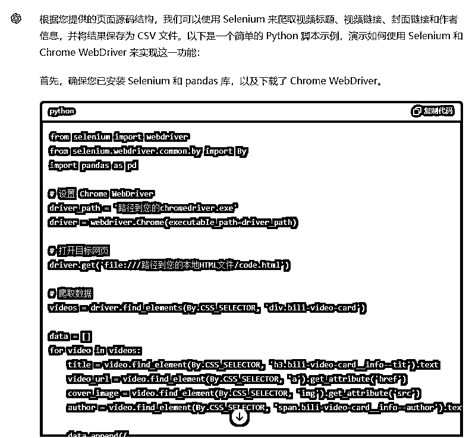

如果有任何疑问，直接提问。包括代码中不懂的地方，没写注释的地方，都要让码农GPT补上，保证自己能看懂。一定要确保你的下属GPT没有摸鱼，没有糊弄你的需求。不然，如果你完全不懂，那很可能你自己就被下属糊弄了。

比如上图代码它给我的是打开本地HTML，我不知道能不能发在线链接，直接提问。

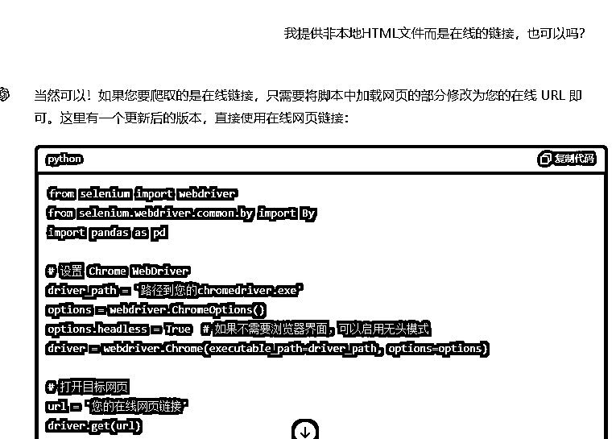

通过GPT的回复，这里我就知道了，代码中直接改为在线链接就行了。

## 第七步 测试代码并解决BUG

然后我把driver_path和url修改下，就可以跑一下测试了。

我们测试跑一下，出现了错误。遇到错误怎么办呢？当然是复制给GPT，它会告诉我们原因。这里除了解决报错以外，更重要的是学习了解这个错误是什么问题，这个过程就是通过实战学习编程的方式。那么下次，自己就不会问这类问题，与GPT码农的对话也会更高效。

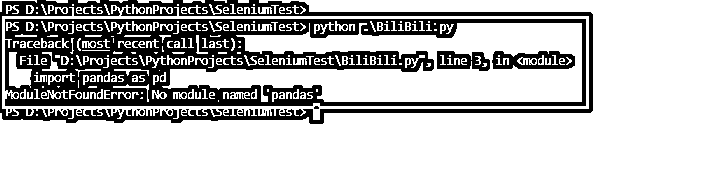

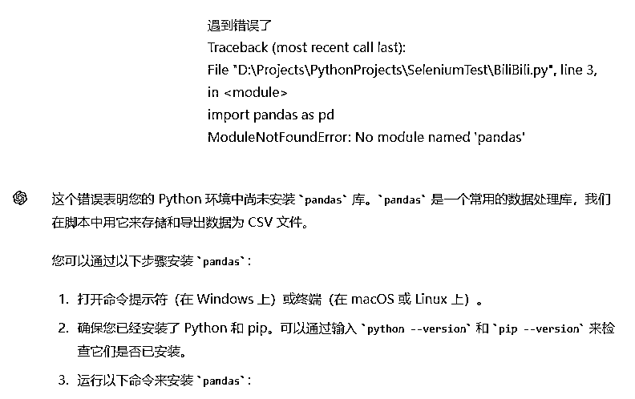

嗯，上图中GPT解释的很清楚了，就是没有安装pandas库，这个GPT其实一开始就提示我了，我没留意。

## 第八步 运行成功并迭代代码

然后我们再次运行代码，看到生成了CSV数据文件，运行成功！

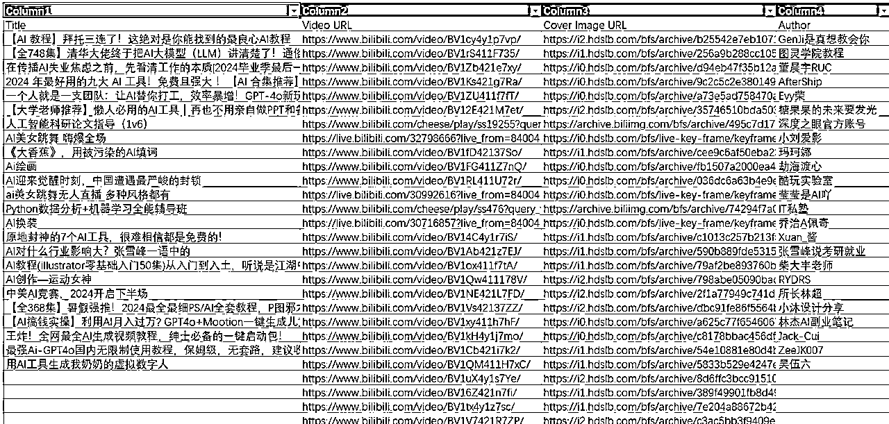

当然这里并没有爬取到100条数据，只爬取了第一页的数据，爬取100条还会需要翻页，需要继续向GPT提问完善这个爬虫代码。

另外你可能会注意到一个问题，最后几个链接没有爬取到标题，为什么呢？这种问题就需要定位了，限于篇幅这里就不展开了。

那运行成功之后呢？当然是继续向GPT提需求，继续优化迭代代码。

AI编程就是这样，不断向GPT提小需求，运行，测试，成功！然后继续提一个新的小需求，这样不断迭代，就可以写出一个功能强大的程序。

后面的代码迭代过程就放在了总结AI编程技巧中了，实战演示就不继续展开了。对话数据请查看附件。

## 小TIP

运行成功后保存的CSV数据。要查看CSV数据如果使用的是Excel，直接打开可能显示中文乱码，需要先新建，然后找到数据 - 从文本/CSV 导入。

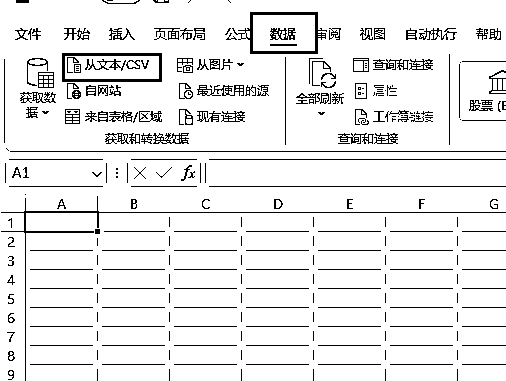

这里弹框后自动识别了UTF-8编码，并且显示正常，点击加载即可。

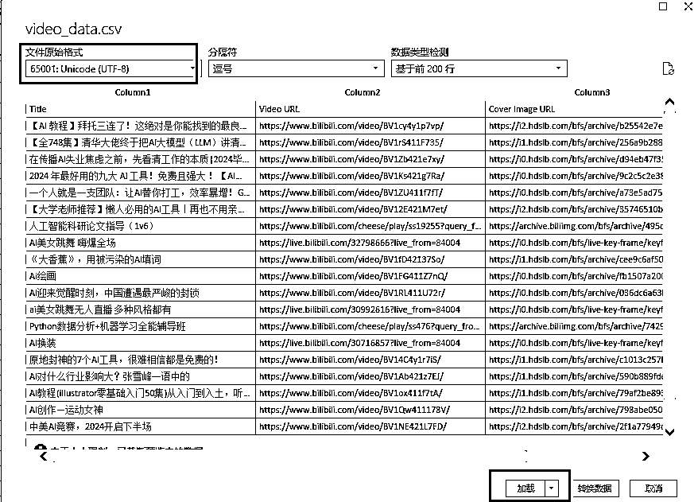

# 总结AI编程技巧

## 01 提出的需求简单、准确，表达清楚

提问简单点也没关系，表达清楚就行。一个需求跑通了，可以继续提下一个需求，不断完善代码。

### 案例 能爬数据，提问支持翻页爬数据

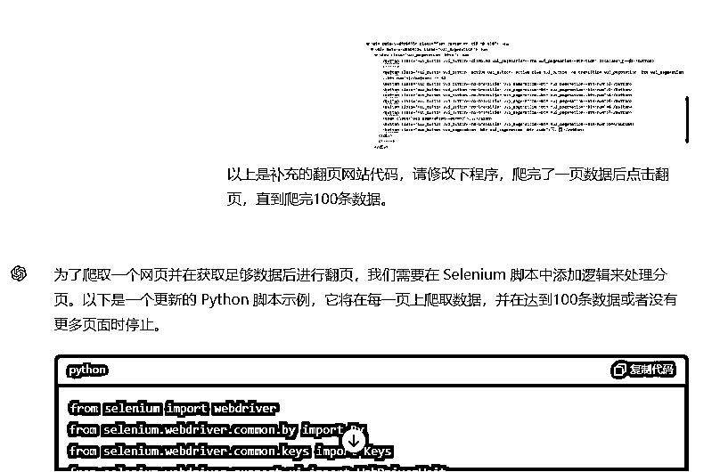

提问GPT，让它完善代码，然后自己测试即可。

## 02 学会理解代码，标记注释，打印信息

这里理解代码不一定需要每句代码每个变量含义都搞懂，但至少需要理解大概是什么作用，如果不理解，可以让GPT把每句代码都写上中文注释。

另外打印信息也很重要，特别是遇到错误的时候，而编程遇到错误是很常见的。所以让GPT尽可能打印信息会很有帮助。

### 案例 新加的翻页需求，补充打印日志

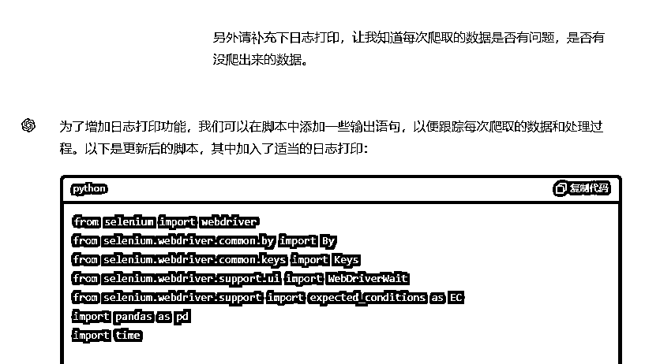

## 03 解决BUG，从日志打印，从需求描述中解决

### 案例 找不到翻页按钮

把翻页代码图片发给了GPT，但是程序运行打印的日志提示无法找到或点击下一页按钮。这个打印日志也是刚才让GPT加上去的。

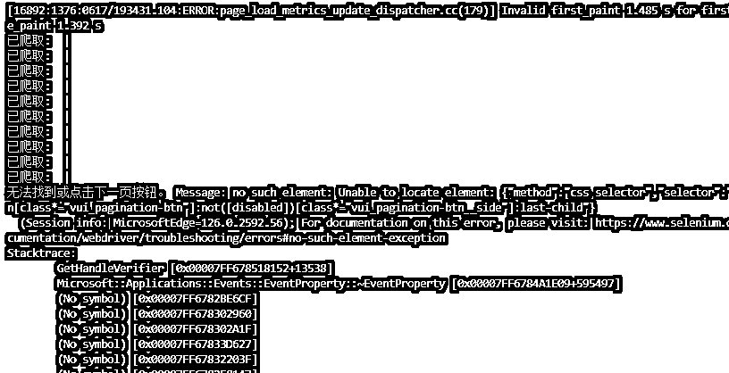

这个问题显然不是报错问题，而是RPA当中没有找到按钮的问题，所以我的思路是从需求的角度进一步描述。

尝试一：怀疑是没有滚动页面导致找不到翻页按钮

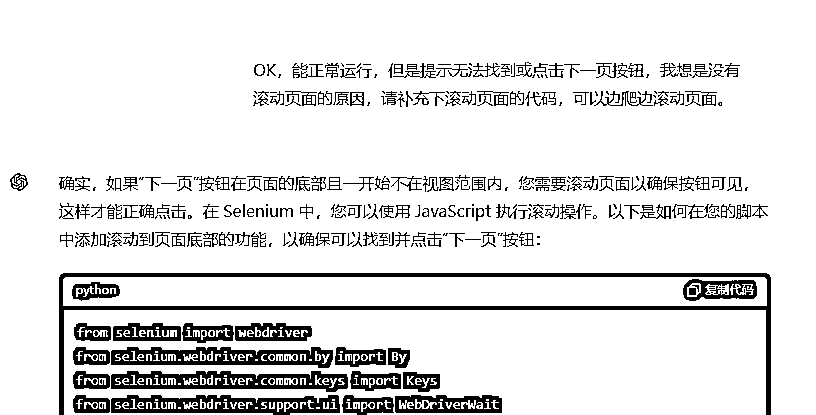

尝试二：怀疑翻页元素没有找到

第一次尝试的结果运行仍然没有找到翻页按钮，所以我怀疑可能是翻页元素没有找对？我又把翻页部分的源码截图发给了GPT。

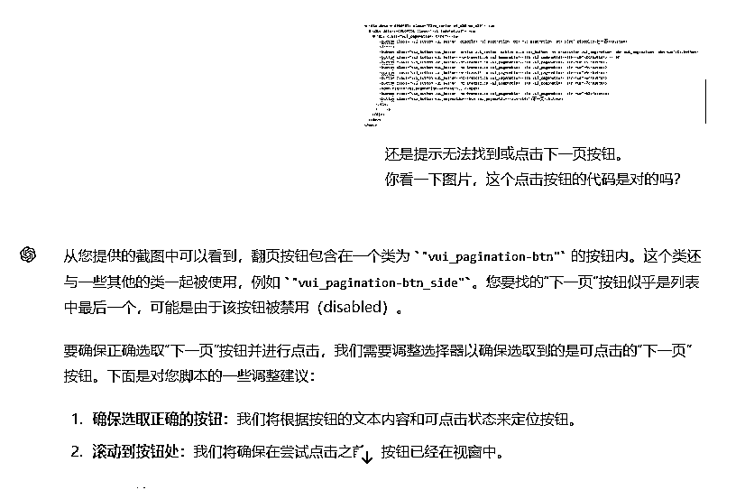

尝试三：问题可能是我自己没有描述清楚

第二次尝试结果还是不行，仍然没有找到翻页按钮。这时候我再次看到日志打印和GPT回复都是说无法找到下一页按钮。我恍然大悟，这其实是我描述错误，让GPT理解为有一个叫“下一页”的按钮，所以去找但是没找到。

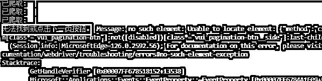

我突然想到B站的翻页按钮显示的不是1，2，3，4，5这些页码吗？哪有下一页按钮？所以再次修改描述，最后跑成功了！

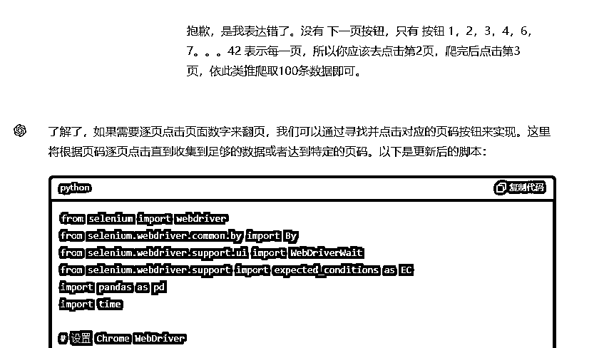

当然，这里后面发现B站其实是有下一页按钮的，只是这里没有定位出问题。（但是没有关系，我们现在的首要目的是让程序实现我们的需求。）

## 04 理解源码逻辑，人工找到BUG

如果出现BUG，用了以上办法不断尝试跟GPT聊天许久都卡在一个BUG上，始终无法解决。那就只能自己从源码上找问题。

当然，读源码仍然是结合GPT来阅读，但可以每次只发给GPT一个独立的小模块，这样理解源码找BUG更轻松，必要的地方一定要加上打印。

最后实在还是不行，就找有经验的程序员帮忙看一下吧，很多程序员都很乐意帮忙定位问题。

# 关于爬虫数据

有的圈友可能更想爬取的是播放量、点赞量、回复数等这些运营的重要数据。关于这些数据需要进入B站详情页才看得到，会稍微麻烦一些，可以自行尝试。

另外说明一点，个人爬虫数据量小基本也没啥问题，不过还是需要注意下，这里有个违法违规案例汇总：

https://github.com/HiddenStrawberry/Crawler_Illegal_Cases_In_China

如果有大量运营数据的需要，建议直接选择数据平台。

其实一般情况下，你想爬xx数据，程序员的思路是怎么样呢？是先去找找Github有没有开源代码，有没有人尝试过同样的事情。如果有，自己把代码下下来，跑一下试试，能跑就直接用，不符合自己需求的地方可以稍微改改。一般不会什么代码都自己从零开始写，除非需求特别简单。而这个事情，你只要入门了AI编程基础，也可以去运行开源代码了。

AI编程能用的地方不仅是是爬虫，比如尝试像RPA软件一样自动化控制也是可以的，本质和影刀原理是一样的。而且编程GPT更擅长，用AI+编程的方式操作软件不一定比使用RPA更难，也可能更简单又高效，这取决于你对GPT码农的了解程度。你了解它给它需求就好了，有个24小时不停歇的程序员，这不爽吗。

那么最后，相信你对于学习AI编程的作用也有了自己的答案。

# 附件

## 与GPT对话

需要下载下来才能查看

## 100条B站爬虫数据

PS：每页都有几条数据没有抓到标题，由于时间关系，暂时没有去排查问题了。另外这个贴主要也是从零基础的角度借助AI写代码，以学习为主，所以没有涉及需要用到编程经验定位BUG的方法。