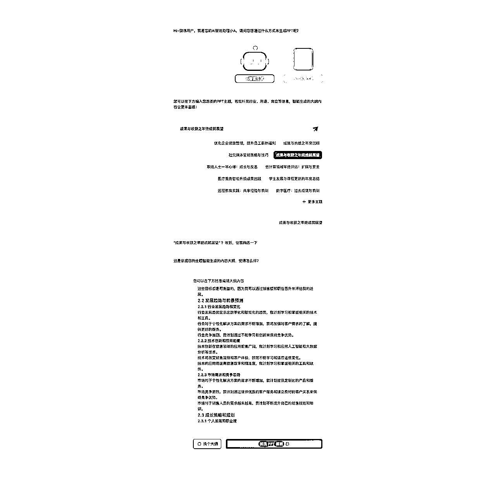
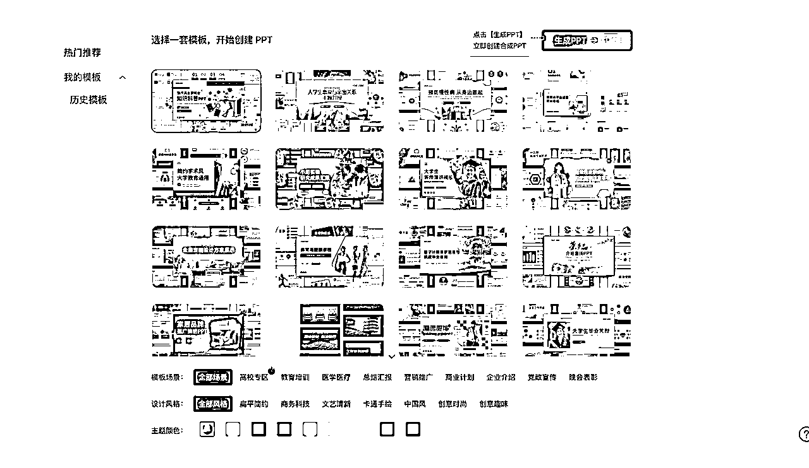
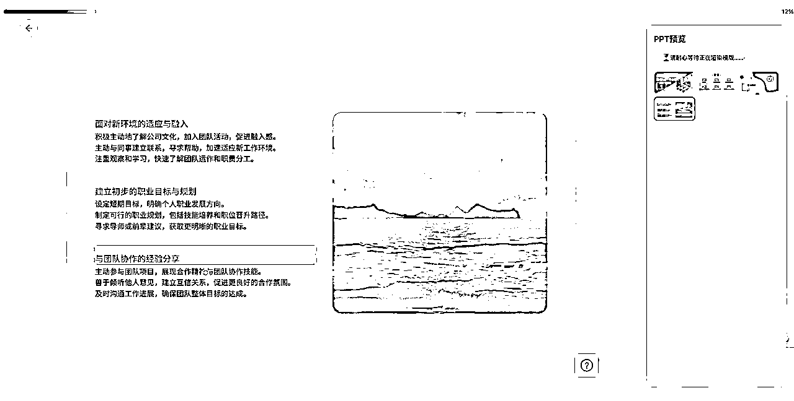
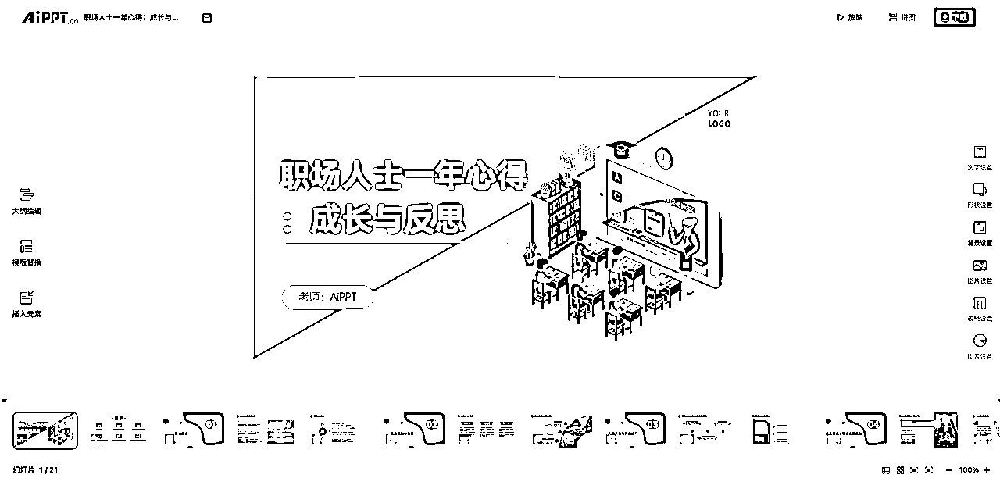
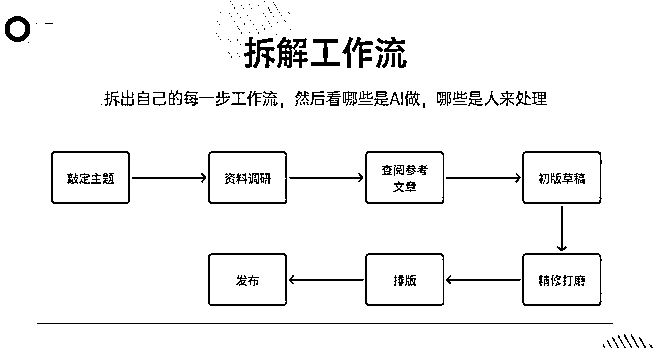

# 智谱Z沙龙活动后，我对AI工具应用和商业化的3点思考总结

> 来源：[https://t16jzwqrzjx.feishu.cn/docx/Gh7LdwJkpotSMLxTsZoc9MkXnjh](https://t16jzwqrzjx.feishu.cn/docx/Gh7LdwJkpotSMLxTsZoc9MkXnjh)

# 前言

上上周六去参加智谱的Z沙龙11期活动，听各位大佬们分享了一下AI工具赚钱的各种思路，AI PPT的老板Guest分享了AI PPT的商业化过程，让我对AI商业化这个事情有了更深的思考，本来想上周动笔写完这篇文章，但是因为自己总是拖延导致这个周末才动笔。

不过这周总结了自己这一段时间对AI实践的思考，结合商业化能够看的更深一点：

本文主要包含以下内容：

1.  产品不是规划出来的，是演化出来的

1.  AI生态位：帮助人解决某个环节的问题，而不是取代人

1.  流量的获客细节要做深，一个一个细节决定成败

# 一、AI PPT产品介绍

输入主题，AI一键生成PPT。

这就是AI PPT产品所提供的能力，帮助你快速搞定一个还不错的PPT模板，方便你的PPT制作过程。

AI生成大纲

挑选模板

根据大纲和模板生成PPT

根据AI生成的PPT进行细节调整

做一个还不错的PPT只需要4步，对比之前做PPT来说真的方便了太多。

但这样的PPT质量高吗？要看你需要的场景，有的场景下不合适、有的场景下很合适。

这是AI PPT最核心的能力，它还有其它各种模板库和编辑的能力，但这些并不足以很打动用户，核心让它火起来的是+AI，没有AI这款产品可能就没有出头之日了。

# 二、产品不是规划出来的，是演化出来的

AI PPT并不是一开始就跑的很顺，然后有了AI之后风驰电掣大杀四方的产品。

它实际上刚开始跑的平平过，并不是那种出色的王牌产品。

究其原因，它和稿定设计做PPT没有任何的区别，同时模板库也没稿定设计、创可贴丰富，用户有什么理由选择这款产品去进行付费呢？

工具是用来节省用户时间的，那它和其它的PPT工具相比，其实没啥太多的优势，甚至从内容模板的角度来看它是被其它产品拉开的。

那这个产品放在22年底的时间来看，是一个能够跑到几千万营收的一个产品吗？

不能，这个产品在商业化上的痛点不够。

它只是即时设计的一款二级产品而已。

那他们是坚定要做AI功能，一定要做一款AI爆款的PPT工具火起来的吗？

也不是，是全线产品+AI化，然后发现PPT工具+AI之后体验真不错，产品一步步演化成了一个非常赚钱的一级产品：AI PPT。

结合这个点再看看各种现在我们手机里的王炸产品，它们真的一开始就是设计成王炸产品的吗？

是各家厂商决定我们要做一款上亿用户级别的产品，然后这个事情就能按照人的思路跑出来了吗？

实际上它们都是在各种机缘巧合下演化出来的。

为什么是这些公司演化出来这些产品，远比这个产品为什么能做成爆品更值得关注。

那AI PPT这家公司做对了什么？

瞄准自己的生态位做了很多偏设计类的产品，对各种细节去做到极致的深，及时的拥抱了+AI。

一套好的做事情的方法，听起来好像跟字节的APP工厂逻辑有点像。

这里边给我感触比较大的一点是，真的要切换到灯式思维了，你只需要清晰自己的目标，然后把自己做事情的方法论建立一个好的反馈优化机制，然后就是不断去试错不断去践行。

尽最大可能做好自己应该做的事情，坦然接受结果的成败，多给自己一点等待正反馈的时间。

很多事情都是急不得的，如果AI PPT这个产品在22年疯狂追求ROI，疯狂要求一个月几百万营收，可能现在这款AI PPT产品也就不复存在了。

# 三、AI生态位：帮助人解决某个环节的问题，而不是取代人

AI PPT在这一点上想的非常清楚，它就是帮助那些做不了多少次PPT的用户、又不是需要特别精美质量、又想节省时间精力的用户来完成PPT的制作。

它不需要去和WPS去竞争谁的PPT模板更精美，它只需要去吃好PPT市场中层的用户就好了。

如果它想取代WPS、office，那这个产品它也做不成功，AI的能力其实还是有所缺失的，同时前两者的模板库先发优势也让AI PPT追上的可能性非常之低。

如果说它想完全替代人，做一个高质量的PPT，那这个产品也是没戏的，AI根本就替代不了人。

但换个思路，我只去满足一小部分用户的一部分问题呢？

比如说让他们快速拥有一个基于自己选题的PPT模板，然后再他们再自己去做文案细节的调整。

帮助用户解决PPT模板的问题，减轻用户在PPT制作某一个环节所花费的精力。

这个需求AI能够实现吗？

当然能实现，AI能够理解选题，然后根据prompt调试生成PPT大纲和文字，然后配合已有的PPT模板库，一个高质量的PPT模板只需要1分钟就可以搞出来。

用户只需要后续将PPT的各种文字做调整就行了，不用再在模板中痛苦了。

AI不取代人，AI只帮助人解决某个环节的问题。

我最近在公司大量进行了AI实践的应用，发现AI在应用上最核心的问题莫过于：

人和AI如何各司其职，整体workflow的拆解是核心

AI来了，人们总是想着AI可以替代人，可以解决一切问题，但是从最容易被AI替代的客服角色来看。

客服AI能取代客服吗？取代不了，但是能当客服助手，可以代替传统的搜索逻辑，更加高效的给人提供客服知识库的内容。

客服AI助手帮助人解决过去资料找不到的问题，让人之前能够解决用户的问题从10个提升到20个，那用户体验的核心是什么呢？

还是人。

人的态度、人的主观能动性、人愿不愿意做好这个事情，团队的价值观。

AI是做加法，而不是取代人的，在未来1-3年AI也绝没有完全取代人的可能性。

团队的宣传是AI来帮助我们解决问题，我们一起帮助用户创造更好的体验，帮助公司获取更大的收益，+AI来产生更大的价值。

拆解整体的workflow，把AI镶嵌进去，之前做不好的，有了AI能做了，整体效率提升了，业务可以往前跑的更快了。

而不是AI可以替代everyone，不可能的，任何事情都要遵循发展规律，循序渐进。

# 四、流量的获客细节要做深，一个一个细节决定成败

这块我在过去涉猎的其实不太深，所以对我来说整体还是比较拓展眼界的。

Guest老板跟我们说，一个产品的名字起的不好，转化率可能会差上一倍，一个能够跑通的商业模型可能因为名字问题就彻底跑不通了。

比如说SEO，如果你的名字能够覆盖你的竞品的一些词组，那你的竞品的各种SEO流量都会带给你流量加持，如果你起一个吊炸天但是没什么用的名字，那你能够通过SEO蹭到的流量可就少了很多。

可画的SEO做的就很深，它们的PPT模板和检索quary做强匹配，直接通过SEO然后landing到PPT页面，流量直接从谷歌搜索入口落地到可画，它们所有的PPT都去做了这个事情。

细节，细节，细节，还是细节。

那些看起来其实没那么重要的事情，最后会深深影响产品的结果。

最近在做AI产品上继续去拾起来之前的思路，去看用户对产品的反馈，一条一条的翻记录。

比如说我们其实觉得黏土AI很火，那这个能力推给用户，它尝鲜后会觉得不错吧。

结果它看到黏土AI之后觉得我们做的有点丑，反而可能带来了不好的体验。

为什么会这样？

宣传海报给的是一个酷炫高阈值的黏土AI风，而不是一个沙雕黏土风。

但如果我看数据的反馈是什么呢？

用户的诉求还不错啊，他们用的挺开心的，但实际上他们50%以上觉得做的有点丑都吐槽了。

继续去不断深挖吧，去尽可能的把核心细节点都关注到，或许一两个点没什么影响，但最终凑一起会影响整个产品的最终结果。

# 总结

写完这篇文章，感觉对AI的整理思考和实践又捋顺了很多，我自己觉得我的逻辑可能是这样的：

践行后交流，交流后复盘，复盘后输出。

四个环节缺一不可，没有践行理解没法听懂大家在交流过程中讲的到底是什么意思，为什么0prompt是趋势，按道理讲自己写提示词做PPT不挺好的吗？

但真实的小白用户就是0 prompt需求，而不是自己费个半天劲去写提示词。

之后争取能够倒逼自己一周写一篇文章吧，希望生产效率能够提一提。