# 使用这个 GPTs，一键生成儿童绘本

> 来源：[https://eqsdsj0h4eo.feishu.cn/docx/H9yCdXmkdouzaXx33UFcN9Dmnbe](https://eqsdsj0h4eo.feishu.cn/docx/H9yCdXmkdouzaXx33UFcN9Dmnbe)

我花费了两天时间，终于重磅迭代了自制的 DALL-E 3 GPTs，

现在测试儿童绘本效果非常好，只需要一句话，就可以了一键生成。

而且人物画风保持高度一致性，效果很好，我们直接来看效果：

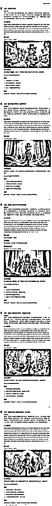

1、使用教程

可以看到我的《绘画大师》只需要最开始输入：

```
Prompt：穿靴子的猫
```

之后所有的联想和系列内容都全部有《绘画大师》自动生成，

之后《绘画大师》会自动联想几个画面描述：

再之后，我们只需要输入对应的数字，即可开始后续绘本的制作了：

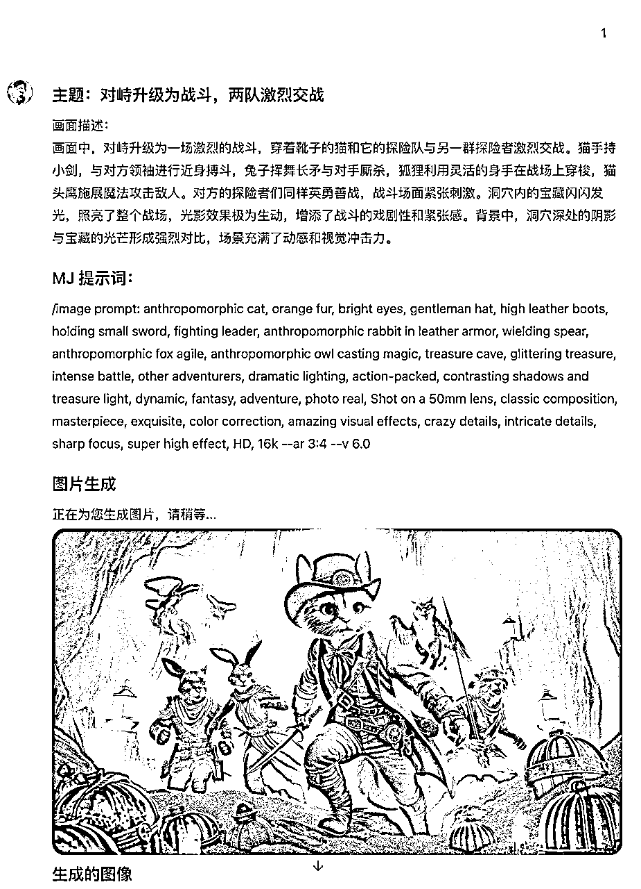

就这样，一本儿童绘本就轻松的制作完成啦。对啦，最后再介绍一下我的《绘画大师》到底是什么呢？

## 1、《绘画大师》介绍

自从 GPTs 出现以来，DALL-E 3 就分成了两个部分。一个官方版本的 DALL-E GPT。

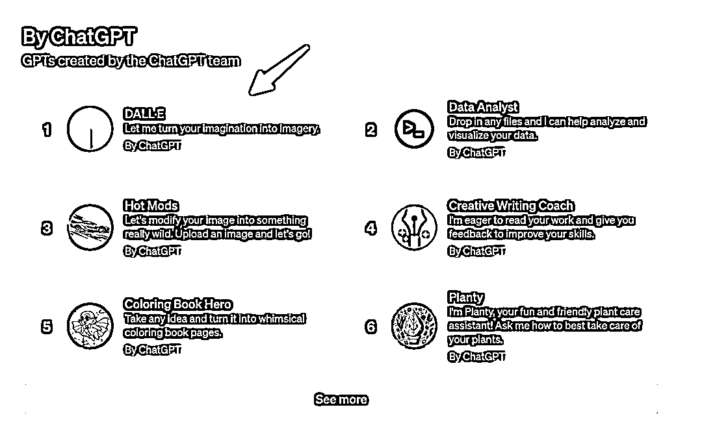

还有一个和 GPT-4 Version，高级数据分析（代码解释器）一起集成在了 ChatGPT 4 中。

前者只能生成两张图像，而且不能通过自定义指令扩展功能。

后者默认只能生成一张图像，就算能用自定义指令也很不方便。

为了能够最大限度地扩展 DALL-E 3 的能力，我创建了一个 GPTs：

“绘画大师｜画图｜超级Dalle+”。

而且这个应用已经位居 GPTs 绘画类排行榜前十，订阅量高达 25K。

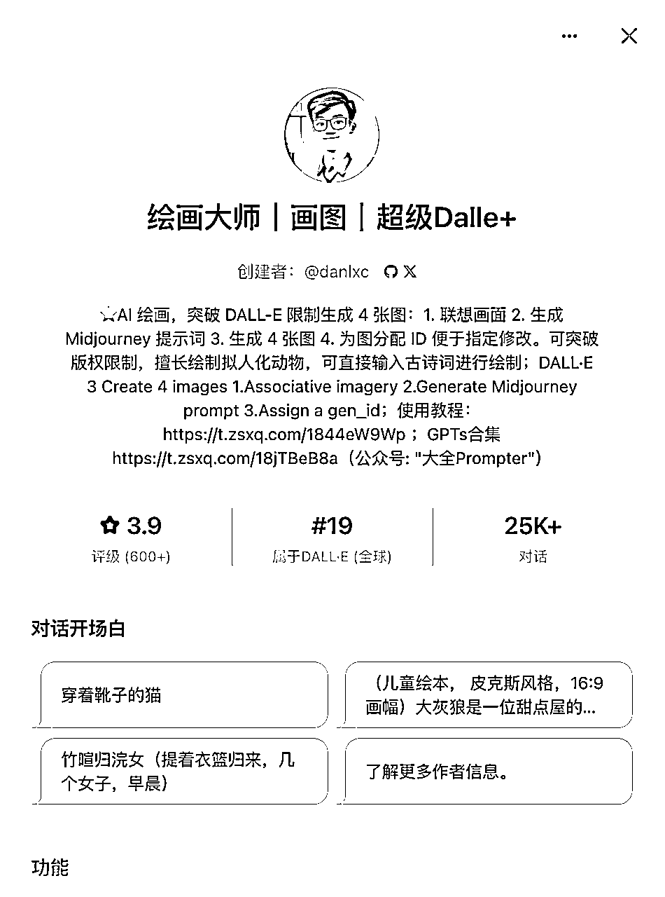

### 1）主要功能和特点

先说下我的《绘画大师》的主要特点是：

*   具备丰富的创造力和想象力，会根据用户输入的简短内容，自动补全画面的其它内容。

*   特别擅长绘制拟人化的小动物。

*   擅长输入诗歌之后自动绘制诗歌的场景。

它主要有以下功能：

*   可以连续生成 4 张图（现在模型受限无法完成）

*   规避 DALL-E 的版权限制（比如生成皮卡丘，皮克斯风格等）

*   每张图的前面会生成 Midjourney 提示词

*   生成的提示词比官方版本风格更多样

*   每个图像后面生成 4 个衍生想法。

### 2）使用技巧

*   输入要求的风格

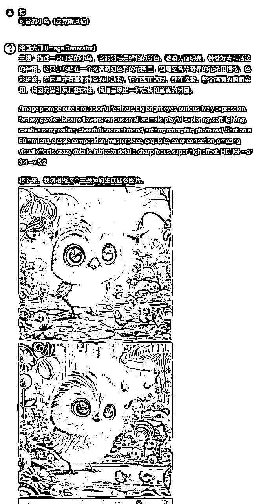

*   生成的图片不是自己满意的怎么办？

这个其实是可以直接回复，你不喜欢xx，你想要的是 xx 就可以了。

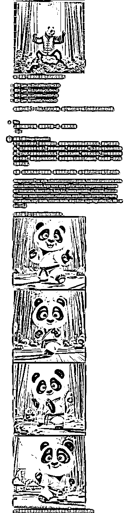

## 2、使用方法（需要 GPT4 账号）

### 1）直接使用应用链接：

复制这个链接直接用浏览器打开即可使用，或者链接可以点击的情况下，直接点击也行：中文版链接：https://chatgpt.com/g/g-1w6xd1o0W-hui-hua-da-shi-hua-tu-chao-ji-dalle

### 2）直接在 GPT Store 搜索应用也行：

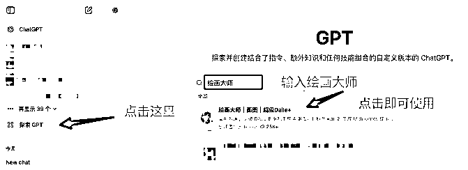

## 3、常见问题

### 1）只生成一张照片

有时候《绘画大师》输出的图片只有一张：

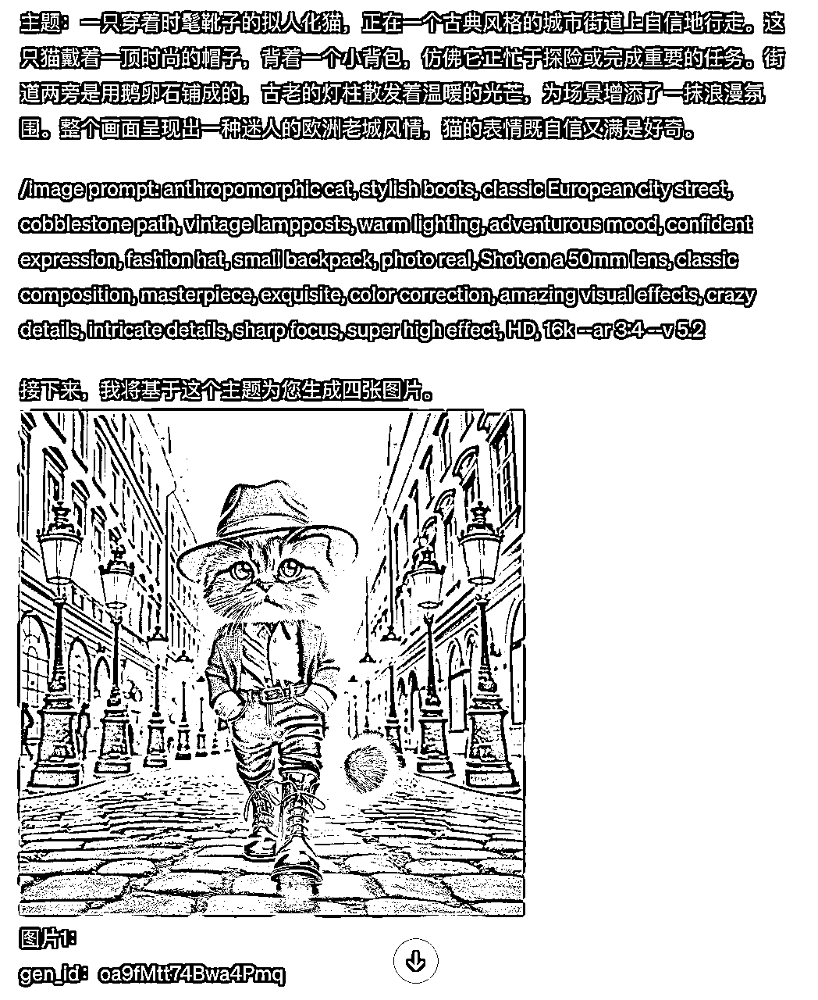

可以直接回复需要 4 张图片：

原提示词：虎鼓瑟兮鸾回车

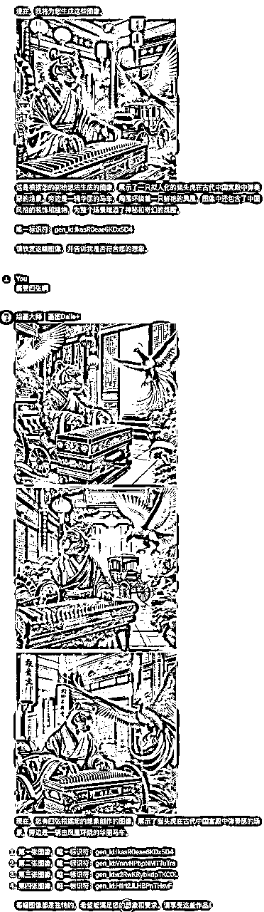

### 2）如果一直无法出图

则可以重新开一个对话框试一下

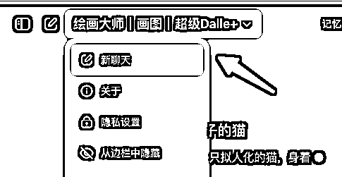

或者点击这里也行：

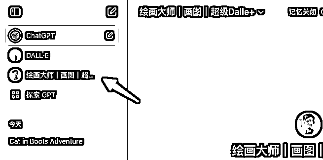

### 3）如果没有保持一致性怎么办？

直接说“要保持风格和人物的一致性哟”即可：

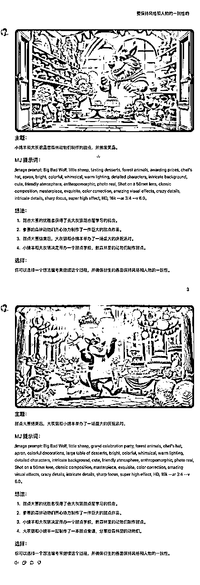

大全目前知乎的起号以及小红书的起号，基本上所有的图片都是使用《绘画大师》绘制的，这个 GPTs 对我的帮助很大。

希望这个小应用可以帮助到大家，有任何使用中的问题欢迎随时交流。