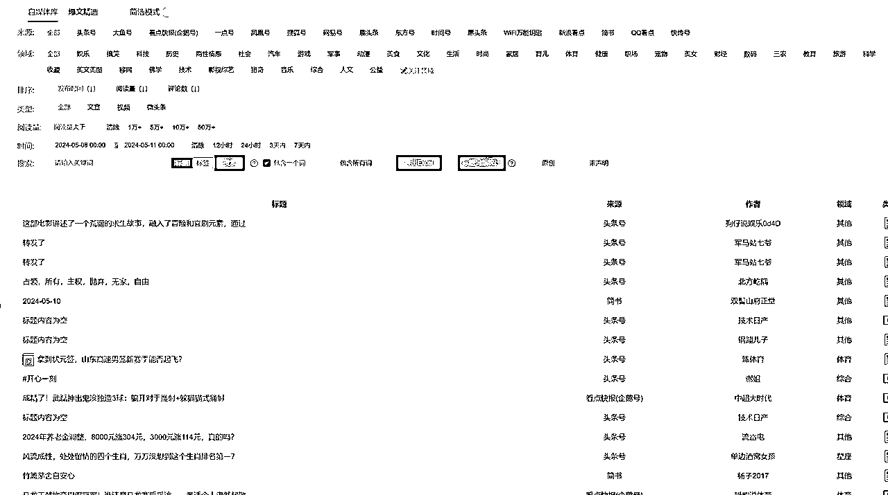

# 公众号爆文年入100w，超详细从0-10分享，万字长文。

> 来源：[https://maoge17888.feishu.cn/docx/HMNzdVbsmosNb9xJ8eqcbmxHnNg](https://maoge17888.feishu.cn/docx/HMNzdVbsmosNb9xJ8eqcbmxHnNg)

# 一、写在前面

各位圈友好，我是去年4月加入到生财这个宝藏星球的，今年3月份又加入了航海家，继续绑定生财，因为看见，所以相信。

这一年我真正实现了从0到1，从1到10的蜕变。从无意中看到一条公众号爆文的风向标到赚到1w，直到现在累计运营公众号1000+，2月份实现了月营收20w+，3月份流量较差月营收10w+。

当时刚做爆文这个项目，看到亦仁说这个项目年入100w的大有人在，还在想，如果是我就好了，没想到仅仅1年，就可以实现这个梦想。

接下来，我将详细分享下我是如何实现从0到1，从1到10的，包含公众号爆文这个项目的现状。

# 二、公众号爆文现状

为了节省大家的时间，特意把项目现状放在前面。

我是去年5月开始尝试做公众号爆文的，当时确实也算是好时机，比较容易入池(即账号进入流量池获得系统推荐)，不到一个月的时间就拿到了正反馈，这也为深耕公众号这个赛道奠定了基础。

每个周期，都会有相对比较好做赛道，比如去年7月出现的文案鸡汤文，8月出现的城市往事文，10月出现的职场体质文，12月出现的职场薪资类文，今年2月份的情感故事等等。

这个赛道在当时的周期内，很容易获取流量，在这期间动辄一个号每天阅读都是几十万，在某数据排行榜上，前面充斥着大量新注册的小号，而过了这个周期，就很难再获取流量了，哪怕当时很火的话题，想要再获取大的流量，已经变的困难。

今年3月过后，可以明显感受到公众号修改了推荐的算法，导致的结果是，新号相对来说入池时间更短了，即可能短短一周内就入池开始爆发，另外一个结果就是存货周期明显缩短，之前的账号随难入池，但是存活周期相对较长，经常可以持续一个月，4月5月仅仅只有2-5天的生命周期。而且这个期间很多做矩阵的都放弃了。

不过现在流量已经慢慢回升了，又看到了很多爆款小号，不下牌桌，总有机会。

因此如果想要多拿收益，可以在存活周期内多发文章，以数量来取胜。

总结：

目前公众号存活周期短，可以采取多发文章策略来对抗。

另外每个周期内比较好做的赛道不一样，建议选择当前周期内比较好做的赛道。

# 三、快速从0到1

## 3.1 公众号的基本认识

公众号本质上也是信息平台，只不过相对短视频来说，载体是文字，创作内容会更加的简单，内容仍然是非常重要的。

去年公众号经过几次改版后，已经越来越“公域”了。公域性质的转化，也意味着有更多的展现机会，可以获取更大的流量、这也是为什么去年爆文项目会这么火，这么多人拿到结果，更多是顺势而为。

公众号的变现方式有很多，比如付费文章，赞赏，流量主广告，接商业广告等，另外非常重要的一点是公众号可以无缝导流私域，这是别的平台所无法相比的。

由于公众号爆文这个项目，收益来源其实就是流量主广告，因此这里重点来讨论这个变现方式。

所谓流量主广告是公众号的一个功能，当你的粉丝满足500粉丝（100粉丝只能开挂商品不能挂广告），可以开通公众号底部广告（即文章底部广告）和公众号文中广告（即文章中插入广告）。

公众号爆文项目的收益，就是来自这2个功能，其中文章底部的广告，只要你开通了这个功能，你的所有文章，包括开通之前发表的文章，也会自动在底部展现广告。文中广告是必须在发表文章文章的时候，选择了插入广告功能，才会展现，也就是说你开通之前发表的文章是无法在文中插入广告的。

所以为了提高收益，这2个功能是开通越早越好，建议发几篇文章后直接maifen开通。

总结：

公众号越来越“公域”了，存在着更大的机会。

公众号的变现方式比较多，包括付费文章，赞赏，流量主，商业广告等，流量主是最基本的变现方式。

开通流量主需要500粉丝，开通越早越好。

## 3.2 公众号爆文的流量来源

公众号的流量来源主要用三大渠道，分别是：

*   公众号消息（粉丝阅读）

*   看一看推荐

*   搜一搜

首先特别注意的是，这3个渠道都是独立的，并不是说你的文章通过搜一搜搜到了你的文章就会被系统推荐，也不是说你的文章搜不到，系统不会推荐。

### 3.2.1 公众号消息

公众号消息就是粉丝关注公众号以后，公众号每次发表文章（勾选群发通知）的时候，系统会推送给粉丝，当然新版的推送机制，如果你关注了一个公众号不经常看他的文章，系统就不会给你推送。这部分的阅读量主要靠粉丝粘性来决定的，简单的说就是你的文章越多粉丝喜欢，这个阅读量越高。

这个数据并不固定，特别是现在公众号的推流机制，如果你的文章粉丝喜欢的多，这个数据会好，这个数据和粉丝粘性挂钩，有的甚至可以达到30%以上。（这个流量来源对于我们新号来说，我们没有粉丝，完全可以忽略）

推送的渠道入口主要有2种：

#### 3.2.1.1 订阅号消息

这个就比较简单，你的粉丝在订阅号的那一栏会收到你的文章通知，当然，现在是如果不经常看或者不星标是不给推送的。

#### 3.2.1.2 看一看更新提醒

这个入口目前是新增的，至少之前没有发现，入口如图

### 3.2.2 看一看推荐

特别重要，我们做流量主的主要流量来源渠道就是这个。

推送的渠道入口主要有3个：

#### 3.2.2.1 订阅号消息列表-看一看

这个入口和上面关注后的账号入口是一致的，这里展现的效果一般都是大封面图 + 标题，或 小封面图 + 标题

#### 3.2.2.2 文章底部推荐

当你任意打开一篇文章后，在底部都会推荐3篇你感兴趣的文章或者同类型文章。这里就说明了一件事，公众号已经给用户打了标签，会精准推送。

这里的展现方式是 小封面 + 标题。

#### 3.2.2.3 发现页，看一看推荐

在微信发现页，点击看一看，可以进入到这个入口。

这里的展示方式有3种：

*   长封面 + 标题

*   方封面 + 标题

*   3张文章图 + 标题

通过上面的流量入口你会发现，这些入口展示的元素都包含标题，其次是封面，封面分为2种，1种是大封面，就是那个长图，也叫首图，1种是小封面，就是方图，也叫次图。

而且你还会发现，标题的空间占比，大部分时间是要远远高于封面图的，由于方图实在是太小了，展现的内容比较小，因此在同样的曝光的情况下，标题的重要性就不言而喻了，要让读者看到这个标题后，有想点击进来的冲动。

所以这里必须要明确一个点，公众号爆文这个项目，标题的重要性务必排在第一位，至于怎么判断一个标题是否合格，在航海手册里面已经写了，有几个点：金钱、数字、差异、悬念、民族、性暗示、死亡、暴力。尽可能在一个标题里面多揉进去几个点。

当然这种方法非常考验能力，必须多看，推荐另外一种方案，直接“抄”。公众号的标题是可以一模一样的，只要内容不一样就是Ok的，这里完全可以找一些爆款标题直接抄。

### 3.2.3 搜一搜 搜索流量

这个渠道就是，通过微信搜一搜来的流量。主要通过关键词来增加流量，更加适合做IP的或者是一些社会热点事情，或者做项目要引流的，对于单纯靠流量主收益的话，这个入口可以不用考虑。因此这里就不赘述了。

总结

公众号流量来源主要有3个模块，分别是粉丝阅读，看一看，搜一搜，公众号爆文这个项目的流量来源主要是看一看。

看一看又有3个主要的流量入口，每个入口推荐的主要内容都包含公众号标题，因此一个好的标题是你拿到更多流量的基础。

公众号的标题是可以重复的，可以去直接“抄”爆款标题。

## 3.3 如何获取爆款标题

寻找爆款标题是一件非常耗时间耗精力的事情，这里推荐我常用的3种方法。

### 3.3.1 对标账号找爆款

原理：通过找到大量的对标账号，查看他们近期的文章，找出有异常值的。然后记录下来。

这里为了方便，我做了一个Rpa程序，只用把对标账号放入到excel，程序会自动采集对应的文章以及阅读数据，保存到对应的文档中。为了便于排序，这里把阅读数量进行了数字化处理，可以快速排序。

优先推荐使用本方法来获取爆款。

感兴趣可以直接在这个文档找到下载地址：

### 3.3.2 次幂数据找爆款

次幂数据除了收费比较贵一点，其实这公众号这一块，还是有点用的，特别是可以快速了解到整个赛道的趋势。

点击这里的低粉爆文，可以快速找到近3个月的小号，以及一些数据比较好的文章。或者直接在热门文章中，按赛道来找，不过赛道分类不是很准，需要二次筛选下。

需要注意的是，这里的数据次幂不支持导出，可以写一个Rpa来获取，2行代码搞定。

### 3.3.3 易撰找爆款

易撰收录了很多自媒体平台的文章，包括头条，大鱼，搜狐等，但是就是没有公众号。

不过很多爆款都是相同，人性都是一样的，这里也是可以作为参考，不过需要注意的是，同一个标题，每个平台的容忍度是不一样的，可能这个平台爆款的标题，到另外一个平台就会判违规。

易撰就比较贴心，筛选完成后，可以一键导出。

很多人都觉得写文章是公众号最难的，其实做爆文这个项目，最难的是选题，选题才是这个项目的核心，就和电商选品一样，接下来我将和大家分享，我是如何靠一句提示词来直接生成一篇高仿文章的。

总结：

可以通过3种方法来快速获取爆款话题，分别是通过对标账号找爆款，通过次幂数据找爆款，通过易撰找爆款。

推荐使用通过对标账号找爆款。

## 3.4 如何选择爆款赛道

每个周期，都会有相对比较好做赛道，比如去年7月出现的文案鸡汤文，8月出现的城市往事文，10月出现的职场体质文，12月出现的职场薪资类文，今年2月份的情感故事等等。

还有就是一些小概率事件，对某个赛道的影响，比如去年河北恶劣天气，影响很大，长时间一直都是洪水，大家都非常关系。这个时候天气预报这个赛道，就突然起来了，也有圈友每天发文都是10w+，其中有一个号硬是吃了3个月的红利。比如去年十一黄金周，有人发高速视频的文章，也吸引了大量的阅读，篇篇10万+。这些事件都会对赛道的流量造成影响，如果敏锐一点，及早发现，及早布局，一定会取得不错的结果。

大部分时候，我们都困在了信息茧房中，你所看到的热门赛道，你所认为的热门赛道，往往只是你认为而已。

那么如何来判断一个赛道究竟好不好起呢？除了和同行沟通互相分享数据外，还有另外一种方法，虽然不是很准，但是也可以大概来判断这个赛道的趋势。

这就是利用次幂数据的公众号排行功能。

首先切换到不同的领域，粗略看下总阅读，从这个数据来看职场的流量是明显下滑了，1个月前我看职场的，排行前10的总阅读都是超过100万的。（这里注意下，超过10w阅读后，次幂实际上无法计算真实的数据，只能按照10w阅读来计算）。

重点看2个参数：

1.这个赛道近期的总阅读情况，前50名，大概有多少阅读。

2.这个赛道近期的排名是否经常发生变化，里面有多少小号。

如果你分析后发现一个赛道的流量很大，而且排行榜里面有一些近3个月注册的小号，小号数量占比越高，说明这个赛道目前越好起，不要犹豫，直接找对标就可以开干了。；

## 3.5 无需调教，一句提示词生成1篇文章

工欲善其事必先利其器，从AI发布后，我体验对比过很多模型，包括：chatgpt3.5，chatgpt4.0，new bing，claude1，claude2，claude3，gemini以及国内的文心一言，讯飞星火，kimi等。

最后得出的结论，在创作中文文章这方面，claude的表现最好，从去年7月份claude2发布后，我就一直在用claude了，之前用的chatgpt4，今年claude又发布了claude3，其中包含3个模型，claude3-oups，claude3-sonnet，claude3-Haiku，其中claude3-opus的表现最好，其次是claude2，claude3-sonnet。

这里说一下我对AI的理解，一定不要把AI错误的认为只是一个机器人一样，他是真的有“大脑”的，AI的原理，本身就是模仿大脑的神级结构来创造的，所以他是真的有一定的思考能力学习能力理解能力的，你更应该把他当成你的移动助理一样，随时随地帮你解决问题。

这里简单讲下我是如何发现Ai的学习能力以及后续使用思路，主要是帮助新人更好的理解AI，老手可以略过。

去年在使用chatgpt3.5创作文章的时候，我一直想让模仿我的风格来创作文章，为了方便AI更好的理解我的风格，我把我的文章投喂给AI，然后让AI来总结风格，和大多数人使用一样，这里把风格特点记录下来，然后再让AI去根据大纲来创作文章。

这个时候我发现，即便不断强调重复我的风格，AI依然可能完全不按照我的风格去写，即便已经明确告知了，为了验证AI是否遗忘了我的风格，我再次提问发现AI依然记得风格特点，而且回答也按照了风格来写了。但是结果却是不尽人意，问题究竟出在哪里？

无意之中，我投喂了一篇散文，是一篇爱情小说，写的很好，很优美的文章，然后没有让AI去学习风格，而且直接让他根据这篇文章，再创作一篇类似风格的文章，当文章出来的那一刻，我惊呆了，这个风格太相似了！一样优美的文字，一样散文风格。

到这里我突然发现，只是空洞的给出风格特点让AI去创作，AI每次理解的点可能都不一样，就像你给朋友去描述一幅画，不管你多么形象，描述的多么准确，在他的脑海里，肯定和你想想不一样的，最好的是办法是，你描述的同时把画也给他看，这样才能更好的理解并且模仿。

所以在后来的创作文章中，我几乎都会投喂范文再加上一些风格总结来创作文章，这样写出来的文章可以说是超级“逼真”。下面是写出来的一些文章，大家可以看下，这是最新的claude3-opus模型写的，一次性成功，没有经过任何修改。，

话不多说，直接来给大家说下是如何创作的，这里需要注意的是，虽然每个模型都可以写出来文章，但是一个好的模型，明显出文质量要更好。

首先找到你想要的文章的风格，这里不局限于什么大号小号，只要是写的质量比较高就是OK的，下载3-5篇，然后把这几篇文章合并到一个文档里面，可以是pdf，word，txt。

接着你把这些文章，投喂给AI，让AI来分析风格，当然了，如果你对风格比较了解的话，这一步可以省略，这一步主要是为了获取风格特点，帮助AI更好的理解我们的要求。

比如这里下载了一个圈友的公众号文章（这个号已经不行了，但是文风是可以的），然后让AI分析了特点，自己再进行补充，这里时候得到了提示词 + 范文。

范文：

提示词：

1.语言通俗易懂,,避免使用艰深的词汇,语言直白流畅。没有过多专业术语,符合公众号平台的语言风格。运用大量积极正面且朴实的词汇,如“幸福”“成功”“美满”“富贵”“有福”“吉祥”等,让文章充满正能量。

2.借助大量生动形象的比喻和例子,如“福报”,“龙年大吉”等来制造趣味性,增强文章的可读性。

3.引言部分通常会先交代生肖的文化意义或性格特点,起到渲染氛围、引起读者兴趣的作用。

4.正文部分会具体描写这个生肖在不同人生阶段的表现,如事业、财富、感情、子女、晚年等,通过细致的描写增加文章的细节感和趣味性。

5.结尾部分会对全文进行概括和总结,强调这个生肖的人在最后都会得到幸福的人生,增强正能量。

6.结尾添加一些祝福语或励志的语句,使文章主题反复强调,也可增强读者的阅读体验。

7.文章融合中国传统文化的元素,如生肖文化、谚语、祝福语等,让文章的语言更具特色。

8.话题围绕生肖和命理展开,具有浓厚的中国传统文化符号

接下来就是整理下，合成一个能用的提示词。

这是我的几篇文章，请你学习我的风格，模仿我来创作文章。

1.语言通俗易懂,,避免使用艰深的词汇,语言直白流畅。没有过多专业术语,符合公众号平台的语言风格。运用大量积极正面且朴实的词汇,如“幸福”“成功”“美满”“富贵”“有福”“吉祥”等,让文章充满正能量。

2.借助大量生动形象的比喻和例子,如“福报”,“龙年大吉”等来制造趣味性,增强文章的可读性。

3.引言部分通常会先交代生肖的文化意义或性格特点,起到渲染氛围、引起读者兴趣的作用。

4.正文部分会具体描写这个生肖在不同人生阶段的表现,如事业、财富、感情、子女、晚年等,通过细致的描写增加文章的细节感和趣味性。

5.结尾部分会对全文进行概括和总结,强调这个生肖的人在最后都会得到幸福的人生,增强正能量。

6.结尾添加一些祝福语或励志的语句,使文章主题反复强调,也可增强读者的阅读体验。

7.文章融合中国传统文化的元素,如生肖文化、谚语、祝福语等,让文章的语言更具特色。

8.话题围绕生肖和命理展开,具有浓厚的中国传统文化符号

围绕话题：XXXXXXXXX这里就是你要写的文章的标题XXXXXXXXXXX

下面是实测结果。

左侧是使用claude3-oups写的，右侧是claude2写的，一模一样的提示词，大多数情况下，都是claude3-opus更胜一筹。

也就是说，使用这个方法，选择一个好的模型，在一定程度上可以增加提示词的容错率，即便是不是很好的提示词很专业的提示词，也能有不错的表现效果。

很多新人不会用AI，最大的难点就是不会写提示词，使用这个方法，完全可以避免这个问题，而且不需要你一直调教，只用一个标题即可创作1篇文章，而且这是原创，并不是洗稿，不用担心原创违规的问题。

最重要的是，使用这个方法，一句提示词创作1篇文章，可以大大提高生产文章的效率，结合Rpa，一天轻松创作几百篇文章。

总结：

对于AI一定要把他当成一个“人”来使用，而不是简单的机器人。

目前claude3-opus在中文创作中表现更好。

AI具有很强的学习能力，提供范文可以帮助AI更好的理解提示词，创作出更加逼真的文章。

至此按照这个方法，坚持去创作，坚持去发文，相信很快就可以完成从0到1。

公众号这个项目有AI加入后，门槛已经变得很低了，也是普通人相对来说离钱最近的项目了。

接下来就是如何进行放大，赚取更多收益。

# 四、快速放大获取收益

想要放大收益，无非就是想办法多搞号，多去发。下面会详细介绍放大过程存在的问题，解决各项的问题。

## 4.1 账号批量注册

第一要解决的就是账号问题，由于一个人只能注册1个公众号，那么想要多搞账号就需要从别的地方出发，有以下几个方法。

1.找亲戚朋友进行注册，注册后绑定你的微信为运营者，然后由你运营。

2.注册营业执照来注册公众号，其中个体户可以注册2个，企业最多可以注册50个，绑定微信作为管理员的时候，个体户注册的，仍然无法突破一个微信作为5个管理员，但是企业可以突破这个限制。

3.特殊渠道直接花钱解决，有账号找回风险，这里不再详说。

这里说一下，起号率：个人号>企业号，因此尽可能多搞点个人号。

注册账号时需要大量的邮箱，这里推荐使用2925无限邮箱，注册1个，即可等于无限个邮箱。这样子可以解决我们注册公众号的邮箱问题。关于这一点，我之前分享的精华帖中也有详细的使用介绍。

关于营业执照，可以直接在淘宝搜索营业执照，个体户的大概20-50块钱就可以办理一张，具体看地区，我办理的海南，主打的就是便宜，方便注销。也可以在支付宝上搜云上公司，最低9.9注册一个公司。考虑到公司成本还要代理记账，注销也麻烦，整体的成本会比个体号高，所以这里如果没有公司执照，可以先注册个体户执照来使用。

另外就是微信要多，最好还是不同人SM的，只要这样才能绑定多个公众号，微信这个就需要找亲戚朋友解决了。注册微信可以直接用月租很便宜的卡，一般淘宝上可以找到月租19元，200G左右流量。如果没有流量需求的话，可以直接用8元卡，电信的app上可以申请。

要登录这么多微信，设备也是问题，这里推荐使用摩托罗拉的手机，官方支持直接多开6个微信，测试没有封号。

需要注意的是，注册公众号不要在同一时间段同一个IP下批量注册，另外就是公司和个体户注册的第二个号会提示让认证，可以直接用跳过方法，在设置里面绑定法人跳过认证（不懂得可以看上个精华帖），省下300块钱。（如果是公司号，为了以后能注册到50个号，就不要跳过认证了，必须去认证下）

经过这样一番操作，你搞点执照，注册点微信，搞定20个公众号是没有问题的，这样可以初步解决账号的问题。

总结：

想要放大，多账号操作是最基本的，有3种方法可以获取账号。

1.找亲戚朋友注册，你来运营

2.利用营业执照进行注册

3.特殊渠道花钱解决

注册时邮箱问题可以用无限邮箱解决，手机号可以找低月租卡解决，设备问题可以用摩托罗拉的多开功能解决。

需要注意的是，注册不要同一时间同一IP注册。尽量分散。

## 4.2 环境隔离

这坑我踩了很久，去年10月的时候，我已经隐隐约约感觉到了，在同一个IP下，后来注册的账号很难起，由于当时起号确实有的号甚至一个月都是0阅读，后来我又和一个同行聊，他们说公众号不检测IP，一个IP只要不超过20个号就没有问题，于是我又觉得，可能是赛道的原因，继续换赛道去发了。

直到12月份，实在是起不来，当时已经开始做公众号分成业务了，后台的起号率可以达到60%，但是自己这边的账号是根本起不来。文章又都是一样的质量，赛道也是我来选择的，我觉得这肯定是哪里的问题，想来想去还是环境的问题。

之前我这边的方案是，利用谷歌浏览器的多用户功能，每个用户只登录1个公众号，但是这些公众号本质上是一台电脑，1个IP，也许问题就出在这里。

于是，我想办法来解决问题，利用之前做抖音小红书的经验，我分析下，无非就是设备环境和网络IP。最差的选择就是，每个微信都独立环境独立IP，每个公众号独立环境独立IP，之所以没有考虑同一个微信绑定几个公众号的问题，是由于分成计划的那部分人，也有一个微信绑定运营多个公众号的，但是仍然能起来，说明这个不在影响范围内。

接着就是想办法解决环境问题，一番搜索学习，最终决定的方案是指纹浏览器 + 静态IP。这里为什么没选便宜的动态IP，主要是考虑到动态IP具有非常强的不确定性，而且很多IP可能都是被污染过的，为了长远考虑不如静态IP更加的稳定。

在国内某代理网站一个静态IP一个月就要三四十块钱，账号多了确实很肉疼，我把这个思路分享在群里，没多久一个小伙伴就在B站找到了利用天翼云搭建静态IP的教程，算下来一个IP的成本每个月只有3-5块钱，这真的是雪中送炭，一下子成本就降下来了。

说干就干，很快就测试成功，经过环境分离后，确实提高了账号的起号率，于是后续我们运营账号的就按照这个方案来执行了，从账号注册的那一刻就确定了环境，后续账号只能在这个环境使用，直到账号死亡那一刻。

这里我用的指纹浏览器是hubstudio，每天有20次免费打开环境机会，多的话就需要开会员，一个月99。

### 4.2.1 谁需要静态IP

如果你只有1-3个号，你可以直接关闭教程了。本操作建议账号数量在3个以上再考虑进行操作。

### 4.2.2 静态IP的获取

#### 方案一：直接购买静态IP

网址：https://static.jghttp.com/staticstate/

进入后，直接找到静态IP购买即可

#### 方案二：搭建静态IP

可以看到，上面的购买方案，一个IP一个月的费用就要36，当10个号的时候，一个月的费用就要360，成本是很高的

详细的搭建视频教程

【24年最新IP搭建教程，来自B站】

开通天翼云终身折扣，可以去咸鱼搜天翼云折扣，0.1元即可搞定。

总结：

环境隔离是做矩阵的基本，公众号也开始对IP进行检测。

推荐使用指纹浏览器 + 静态IP的方案来解决问题。

指纹浏览器很多，我用的hubstudio，可以免费20个环境。

## 4.3 文章产出

其实内容产出，在AI出现后，已经是这个项目最简单的问题了，无非就是考虑2个点：

质量

成本

质量这个问题，前文上有讲到，主要是靠选择一个好的AI模型，比如想要生产一篇80分的文章，你如果用100分的AI模型，你可能只需要80分的提示词，但是如果你使用了80的模型，就需要100分的提示词，而且提示词这个东西，就算你写的再好，AI每次理解的点，都可能不一样。因此优先应该选择好的模型。

经过测试，claude表现一直比较好，因此我们选择的是claude。

成本问题，一般批量写，有2种，1种是直接对接api，另外一种是直接使用rpa来操作。

由于api的成本一直较高，而且当时我们使用claude2的时候，还没有相关的api接口。于是就一直使用的rpa来解决批量操作的问题

最开始我们利用claude2每天有一定免费对话额度的特点，在一个电脑注册大量claude账号，然后rpa程序会自动打开每个账号进行写作文章进行保存。不过这种方案在9月的时候经过一次大封杀，导致损失惨重，不得不再次注册大量的账号，直到10月的时候，claude加强了检测，很多账号存活周期都很短，不得不另寻出路，最后经过测试，使用了国外的一个集合AI的平台poe，poe里面有claude的各个版本，而且成本很低。后续我们一直沿用了poe来解决文章产出的问题。

至此，利用rpa程序可以实现批量创作，单机一天轻松产出500篇文章，而且成本不到20元。

总结：

利用rpa操作可以解决内容批量产出的问题。

poe的成本算下来要比使用官方的更加划算。

到这里，可以单人实现批量放大，但是这个还是很容易达到上限，主要有几点。

1.获取账号的数量，这个模式可以获取几十个账号，想要获取100个就有难度了，想要几百个就更难了。

2.运营账号的数量，正常发文都是需要审稿排版，通常比较浪费人力。单人每天搞50个号，已经是很难了。

同时也有优点

1.对数据把控更清晰，由于账号都是自己运营的，可以有针对的对某些账号进行特殊运营。

2.不用担心结算的问题，都是绑定可控的收款账号。

据我了解，个人运营公众号矩阵，大部分都是采用的这种方案。也是比较简单，容易控制的。跑通项目后可以立即去执行操作的。

接下来给大家分享下另外一种放大的方案，可以突破这个方式的瓶颈，让收益再上一个台阶，那就是分成计划。

这里为什么没有做产文 + 发文一体的rpa，主要是考虑，AI生成内容的不确定性，特别是涉及一些社会事件中，可能存在不实信息，一旦文章爆发，可能带来未知的风险，而且这些号有的是亲戚朋友的。尽可能安全稳定，减少不必要的风险。

最近账号存活周期短，导致项目整体下滑，也有一些做矩阵的开始放弃想要转型，也有一些朋友说公众号爆文这个项目算是嘎了。

正如盗坤所说：“悲观者往往正确，但是我选择乐观前行。”

我深知，相比短视频，图文创作更适合我。

公众号爆文的流量是下滑了，但是公众号的整体流量并没有下滑，依然有很多人从公众号实现年入7位数。

仍然有一些账号能够跨过三五天的生命周期，这究竟是巧合还是有什么其他原因，仍然是值得去研究思考。

公众号未来的趋势，一定是卷质量，卷价值，做私域。破局之道也许就在私域。

而且，公众号是离私域最近的平台，任何流量全靠公域，都有这么一天，不如提早布局私域。

公众号要做很好，很深，其实难度要比短视频更难，文字的深度往往是很难用语言来表达出来的，那些深耕了多年的大V，为什么一篇文章就能付费用户达到1w+，主要还是文章有深度，现阶段这个差距，是很难通过AI来抹平。

接下来，我仍然会继续深耕公众号。《小米创业思考》中讲到，要想成功就要保持专注，把一件事做到极致，找到行业最优解。

人生没有白走的路，每一步都算数，你现在所做的事情，看似毫无成效甚至是消磨时光，终将在未来的某一天反馈回来。

持续深耕，届时，再来与诸君畅谈。

# 五、写在最后

去年加入生财是我做的最正确的一件事，这一年，是我这几年中成长最快的一年。

我学到了很多，也认识了很多朋友，这一年我开始做IP，开始接触到自媒体，我甚至在想，如果几年前，我选择的不是软件开发，而是自媒体会不会有不一样的结果？如果我早一点加入生财，会不会不一样？

前几天在航海家群里，好几个圈友都说曾经是看的盗版的生财，说来惭愧，之前我也是看的盗版的生财，我错误以为盗版生财也是生财，后来才发现，原来这是2个不一样的生财。

真正能做成一件事是很难，除了信息外，更重要的是人，和一群同频的人更能拿到结果。

看盗版永远都只是观众，永远是那么孤独，永远在看别人表演，其实，你也可以成为自己的主角。

现在回想起来，并不是我多厉害，而是顺势而为，恰好在对的时间选择了适合自己的项目。

排版工具下载：https://www.123pan.com/s/KtY7Vv-ZKSzv.html

采集标题数据工具下载：