# 万字分享心理小白裸辞9个月，变现20W的辛酸史

> 来源：[https://fqq9yxxwwp.feishu.cn/docx/IjuDdQ5meofB6Jx5QhAcTtQVnOb](https://fqq9yxxwwp.feishu.cn/docx/IjuDdQ5meofB6Jx5QhAcTtQVnOb)

## 一.介绍自己

大家好，我是小檀。

我是从2023年9月辞职，踏上心理咨询事业之路。

2023年12月在MBTI赛道做小红书职场IP挣到第一笔5W+。

2024年1月转型天赋解读教练，依靠“提升心力咨询"+"天赋陪伴实战”两架马车，找到变现新定位

2024年2月-4月，遭遇家中亲人去世变故，但是依旧迅速调整心态，活出心理人该有的自信与勇气。

并且在这段期间启动了自己的高客单私教产品，

左手“扶持有基础心理爱好者实现变现”，

右手“带领内心有卡点障碍的人成长，找到自我”。

2024年截至至今，经营这份沉甸甸，厚重价值感的事业，累计变现20W+，

今天就给大家详细拆解我9个月的“辛”路历程，

希望帮助生财有术同样做心理赛道的朋友们能够有所收获！

关于我更多的资料，可以移步：

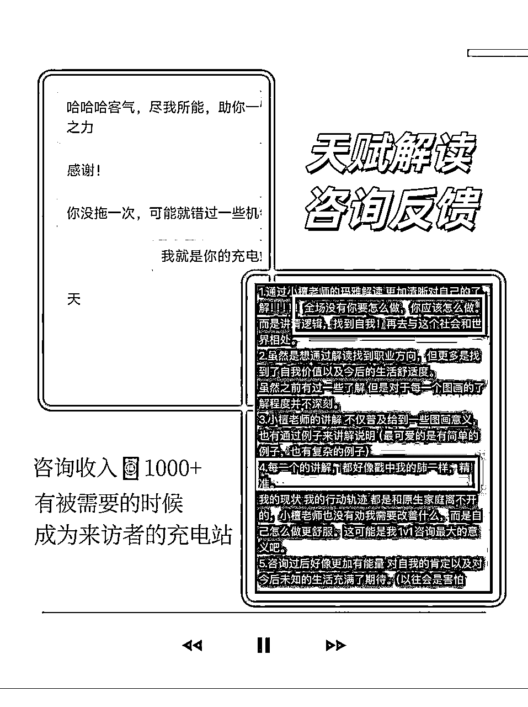

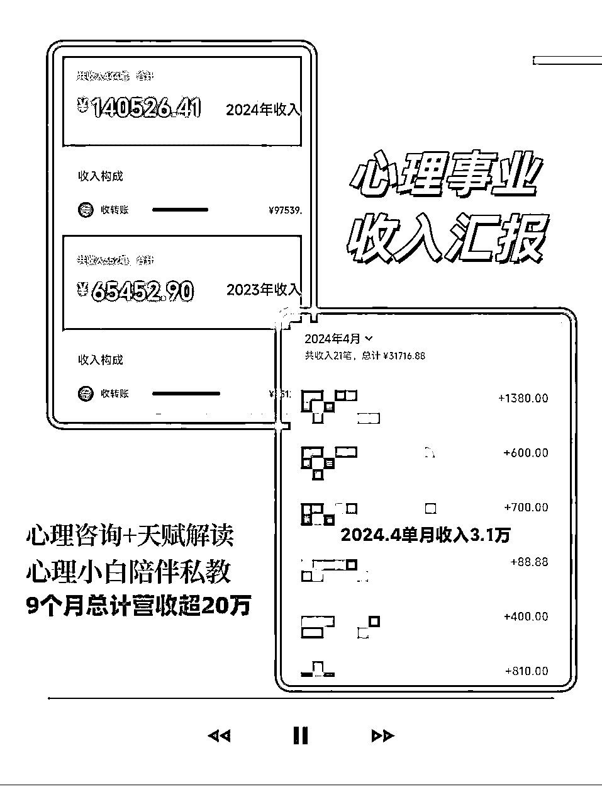

部分私教与客户反馈，内心里面暖暖的

## 二.分享目录

### 心理小白入行必看：新手考心理咨询师证祛魅

### 有心理基础却不知道怎么变现：你的定位还不够深入人心

### 一直卡在0-1的心理副业人：我是如何对抗苦难提升心力

### 突破1-10的心理副业人：靠天赋做事变现累计20W

## 三.心理小白入行必看：新手考心理咨询师证祛魅

从大学毕业以来，一直都对心理咨询充满向往，平时书柜里塞满了心理学的著作。

一直在网络上搜寻关于心理咨询的信息，想找一条普通人也能执业的路径。

但现实要至少3年时间全日制大学学习+20W起步的理论派系课程训练，

让我直接断了这块念想，哼哧哼哧在主业上刨土挖食，把这个“高贵”的梦想束之高阁。

直到2023年4月，我找到了生财有术的心理导师鱼了了

一场1小时的咨询下来，瞬间击破限制我行动的“心理假象”。

例如“新手小白常会犯错的行动误区：先考心理咨询师证，才能开始做咨询”

鱼老师的回答：真正入行需要的是咨询技能，咨询效果，而非一纸证书。

市场上大多数的证书，学习的是心理学基础，到做咨询还有很长的距离。

目前心理咨询师的困境：

1.来访客户少（对咨询有偏见，病耻感，导致大需求，小市场）

2.昂贵培训费和缺少规范（单心理流派动辄几万，还有个人体验+督导费。证书是证明学习经历，让自己心安）

3.互联网模式扩大慢（很多人卡在没有个案上，缺乏咨询/疗愈技能）

看起来好像每条都是困难，走起来很艰难。

这也说明了我们自己要在心理风口下稳住自己的基础盘，

学会一个真实可靠的技能很关键。

同时我们每个技能都可以跟心理做组合，例如“心理+绘画”，“心理+运动”，“心理+写作”等

这样就更能让空泛的“心理理论”有落地实践的抓手，

我们设计产品模式，让来访者们的感知更强，同时也快速获益得到改变。

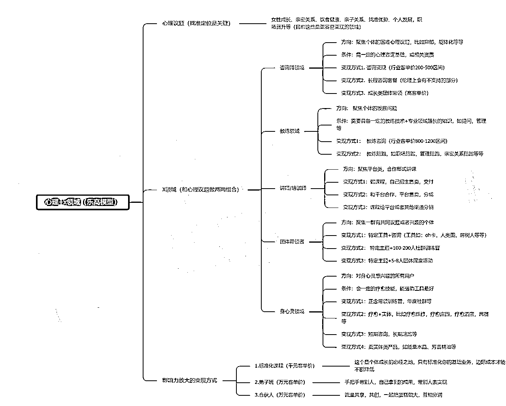

更多心理+领域的产品变现模式，希望对大家有所启发

## 四.有心理基础却不知道怎么变现：你的定位还不够深入人心

破除了考证与心理学考研执念后，我重新点燃起做心理事业的热情。

2023年5月，在生财有术的心理导师鱼了了私教陪伴下，我正式开启了我的副业之旅。

心理小白在0-1阶段，会发现产品需求很多，可以切入的方面很广。

例如“情绪管理”，“原生家庭”，“亲密关系”等等，但是缺少发力点。

那么在开头，我就要找到我最擅长的技能点，帮助用户解决问题。

这里的就谈到了定位（我会什么）—初始流量（我能给谁提供服务）

我要如何找到自己的前100个铁杆粉丝，让我副业顺利启动？

分享鱼了了老师的定位表格与“铁粉模型”（辨识度，专业度，连接度，价值度）找到答案

### 1.个人情况做全方位的定位思考

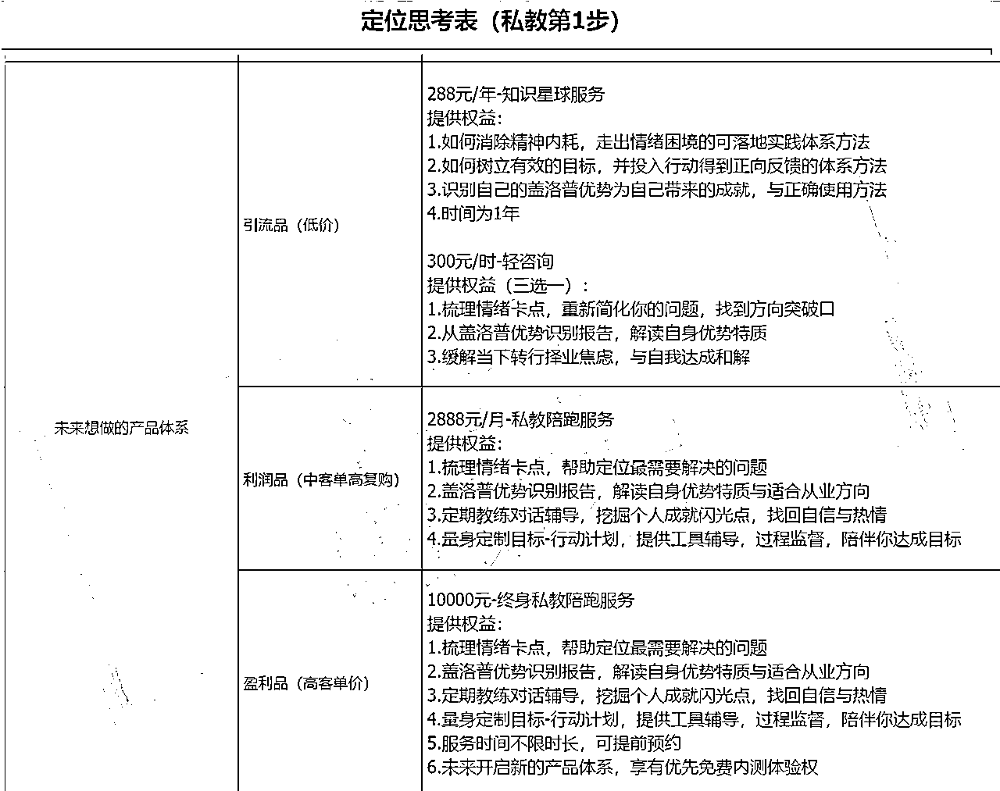

这个板块是帮我从过去找到擅长技能与能提供的服务。

一句话总结定位：你可以为哪些人身上的哪些痛点，提供一套完整的解决方案。

举例：为30岁+有转行/择业焦虑的职场人，

提供元2888/月陪跑教练服务，帮助他们消除精神内耗，

走出情绪困境，采取积极正向的行动，找到自己的下一份工作。

结合我以前做过盖洛普优势认证教练的经验，

切入优势理论来帮助我的客户找到自己优势天赋所在。

这里要说明的是：定位并非定终身，是可以灵活改变的，

随着发展阶段和掌握的技能成熟而进行调整。

有些新手就认定了一个方向，做到不撞南墙不回头，容易耗尽心力与时间。

见过不少讲定位理论的课程，但是很多定位却浮于表面，

只从专业技能出发，而鲜少看到是从底层价值观来做分析。

这第一步不玩虚的，从而让后面每一步都走得很踏实。

### 2.IP人设打造细节，提升IP辨识度

这个板块主打辨识度：让粉丝记住我，

提到某个标签，第一个想到的就是我。

那段时间，MBTI在小红书上特别火爆。

我起步就选择这个赛道来作为我的起始流量。

拿“INFJ+优势教练暖男”作为自己的标签，

用暖黄色的形象照来强化第一印象。

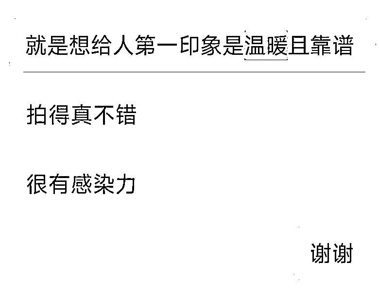

从客户反馈上来看，形象照跟标签的匹配度已经起到了影响作用~

### 3.小红书打造SOP，提升IP专业度

从MBTI赛道作为我的流量来源，

我的小红书内容输出就是以”INFJ+优势天赋“作为垂直输出。

因为我自己就是INFJ，所以我特别能懂INFJ，

并且帮助INFJ成为更好的“倡导者”。

这里就是要把内容做到足够垂直，才能让粉丝认可我。

推荐大家多多练习以下行动来锻炼自己的专业基本功。

*   写作（例如让INFJ恢复能量的100篇日记）

*   发朋友圈（例如让INFJ看一眼就挪不动道的美景）

*   分享持续性的里程碑事件（例如100件成就日记，汇报学员喜事）

*   多链接陌生社交展现自己（在社群圈子里面多写复盘，参加线下活动）

持续提供价值输出，潜在铁粉就会默默关注我，等到产品发售时，就会有人报名。

### 4.朋友圈和1V1深度私聊，提升连接度和价值度

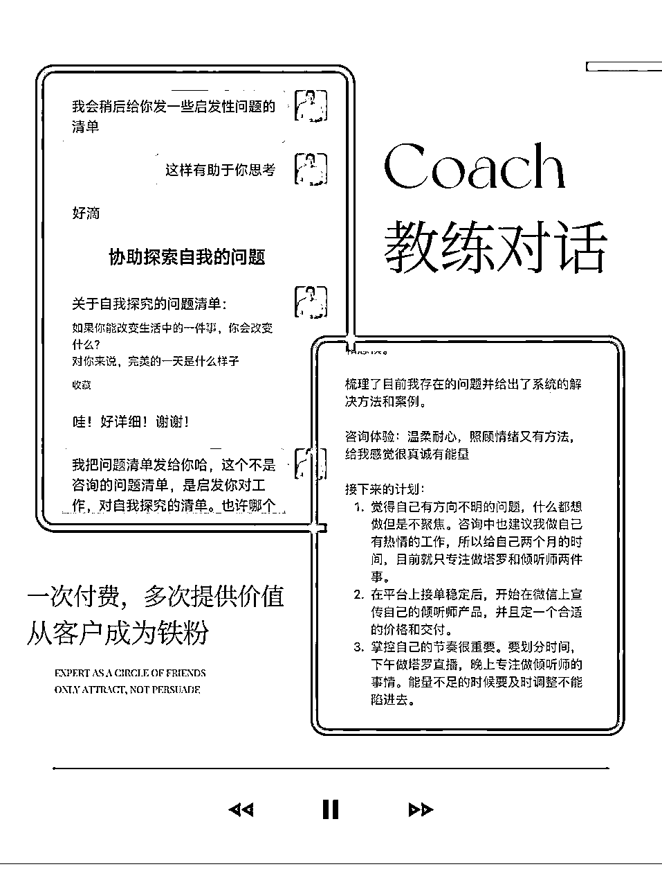

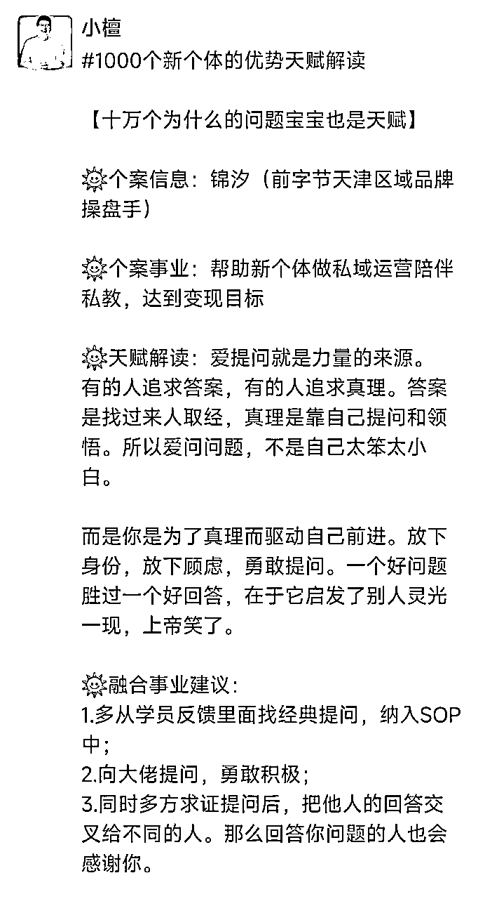

我的教练风格是偏向于为用户负责到底，所以我会特别关注付费用户的行动情况。

会经常进行1V1交流，线下聚会，并且成就用户（帮助解决问题，拿到成果）

每次沟通的时候，会根据用户的问题来评估是否会有咨询后的加餐环节。

先给予价值，或多或少都会回收用户的答谢红包或者预约下一次对话的可能。

同时朋友圈也经常以用户视角出发“我希望看到这条圈的人，能收获什么？”

并且给正在改变的人，提供肯定与支持，营造持续“被看见的力量”是用户非常需要的。

总体来说，不玩虚的定位+铁粉模型的实战。

让我的开局犹如开挂一般，非常顺利地吃到第一波流量红利。

具体小红书账号的实操与私域变现的全流程，大家可以移步参阅：

## 五.一直卡在0-1的心理副业人：我是如何对抗苦难提升心力

### 艰难的3个月医院陪床经历

在我的心理事业正如火如荼地发展时，突然收到消息让我整个人跌入冰窖。

我妈说：我爸爸肺癌扩散，再次住院了，而且这次比以前更严重😱。

从2024年2月-4月期间，我和家里人轮流在医院病床陪着，

一边是听着医生说着“😫冷酷的现实有多么绝望”，

一边是换个语境给家里人传达“问题虽严重，但还有希望😃”。

那段时间对我的心力和体力都是极大的考验，

因为我爸爸会半夜会咳痰，呼吸不顺畅需要人端水送药，

我们在特护病房里面放了两张床，留了三个人，

轮流睡3个小时就起来换班守着爸爸。

当时我的状态很糟糕，就连主动私信的咨询业务都无心安排。

但是内心有个声音，还是在劝我“找点事做，分散注意力”，

在这个期间，我向生财有术的心理导师鱼了了求助做心理情绪援助。

我才慢慢地能恢复一点行动力，在医院找个角落搭建我的工作台。

坐累了就出门走走，还发现了一个很有趣的细节，

窗户上贴的一张友情提醒，读完后感觉是一个乐观的人做的善意提醒呢，

这让我在肿瘤科的病房里面，除了唉声叹气外，还有乐趣的慰藉。

这是我在医院期间搭建的工作台 这是我在冰冷的医院发现有趣的一面

在这段期间，我是见缝插针式输入与输出，

坚持参加社群活动，补充我在这个阶段缺乏的板块。

跟进我的私教学员进度，在夜深人静的时候，在医院晾衣间里做咨询。

最后，我做了一个阶段总结，勇敢地做群分享，

唯一的目的：借我的经历，去点亮更多的人，希望帮助他们走过这个至暗时刻。

具体分享内容，可以移步→

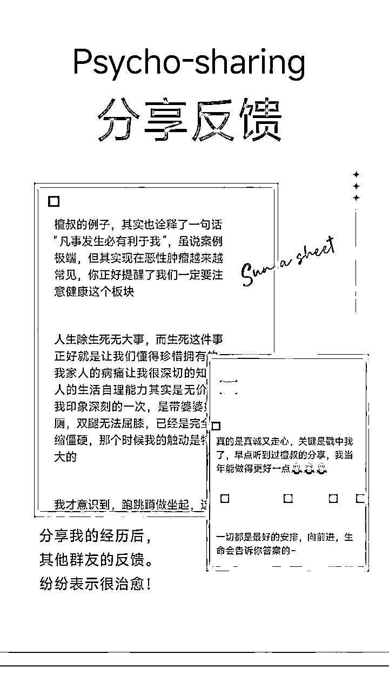

分享结束后，我收到了很多群友的积极反馈。

从他们的文字里面，我能回收很多肯定的力量，

这也证明了我做的都是积极正向有意义的！

同时还有群友主动邀请合作授权，把我的分享编入《心理危机干预手册》。

用于青少年的心理分享，帮助到更多的人，我当时一整个人都被鼓舞到，暖暖的！

这一系列的举措让我拥有强大的心力，能够与病魔继续斗争下去。

### 2.接纳父亲离世，我用结果证明我可以的

4月23日，父亲好像是有感知一样，在吃完早餐后，躺在床上就走了。

我当时内心还没有太多的感伤，更多的是释怀，一直压在胸口的石头落地了。

葬礼在3天后举行，我成为了家里顶梁柱，在长辈的指导下，跑了很多地方办流程。

每当一个窗口问我为何而来，我都会一次一次回应“我爸爸去世了”。

也许其他人会有刺痛感，但是我却没有，而是把它看作是一件稀松平常的事情。

它发生了，那么就静静地体验就是（要不是有前面3个月的心力支撑，可能在这刻，我会逃避与崩溃）

在处理整个后事的过程，我会保持一个思想动作”回顾一件事，就放下一件事“，

我在这个期间，就发了三条朋友圈，不带任何的“遗憾”，“愧疚”，“懊悔”的负面情绪，

就是在向那些美好的过去道别，并且接纳这个事实。

活着的人还要继续勇敢地生活下去。

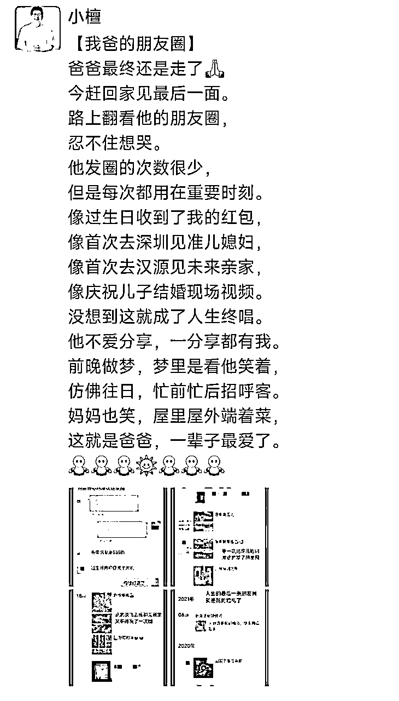

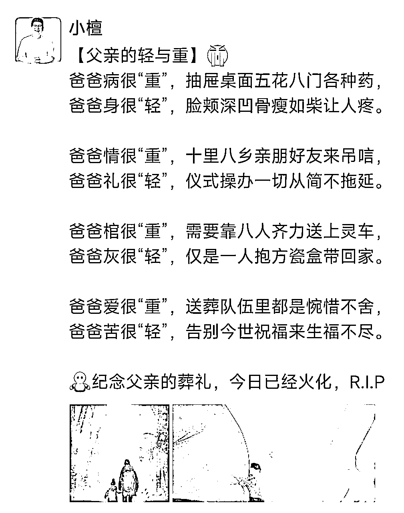

在葬礼结束后，我在老家待了一个月。

一边陪伴我的母亲，继续维持我的心理事业发展。

也许是大家收到了我的正能量感召，帮助我在5月初就拿下不俗的成绩。

当时我就立马对外释放这些信号，把这种喜悦对外公布的时候，

也就激发我要继续坚持我现在做的，因为它切身实际地滋养了我，也改变了我。

那些愿意为我付费的人，也是看中了我身上的价值观，所以义无反顾地选择我。

这里就给心理小白们做个示范：那些选中你的人，绝对不是你的营销多么棒，

成交手段多么高超，而是你的价值观与他们契合，受你吸引而来。

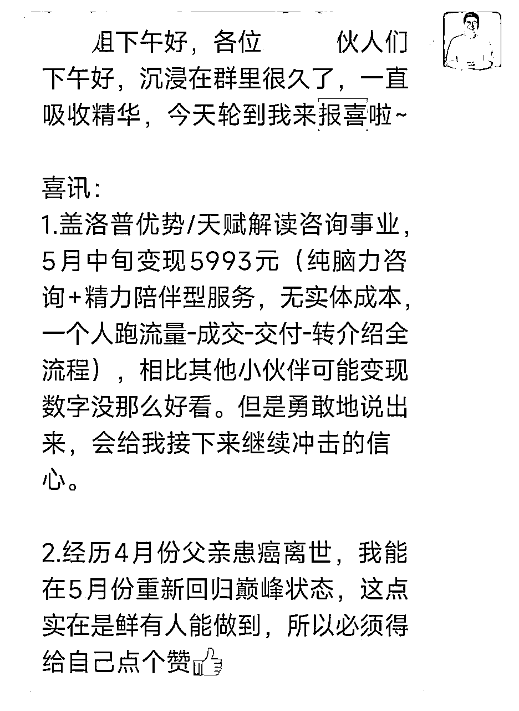

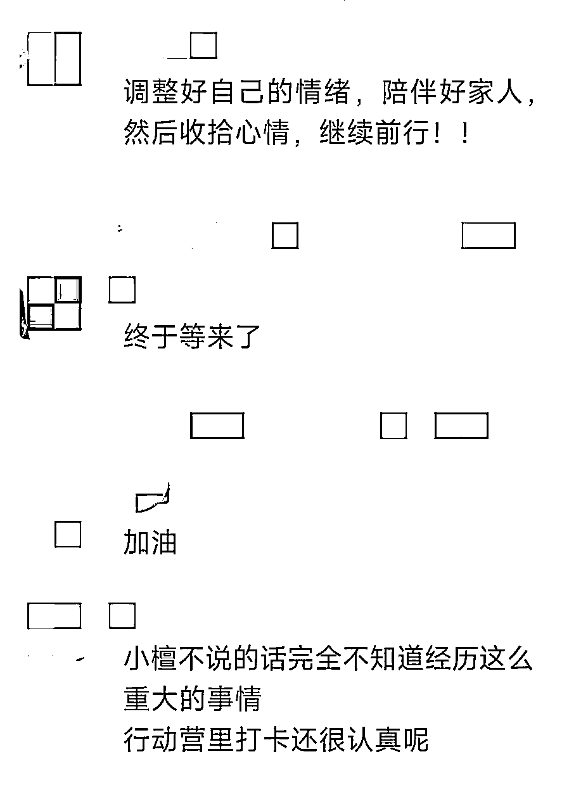

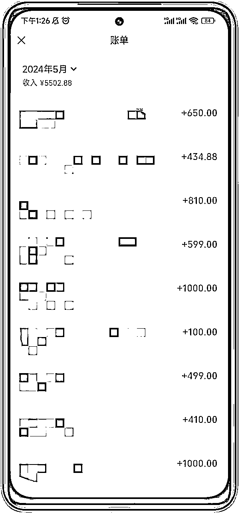

在社群内报喜的截图和5月收款截图

## 六.突破1-10的心理副业人：靠天赋做事变现累计20W

### 1.学习新工具重定位破转化难题，私域成交信任力强

在2024年1月，一直做MBTI赛道后，我的受众群体问题越发明显：

1.私信的群体年轻化，支付能力弱，无力承担我的咨询费用。

2.用MBTI切入盖洛普优势测评，会卡在第一步400+付费测评。

3.一开始给不到价值时，会拉长建立信任感的周期。

经历一段时间后，后面做咨询的流量开始下滑，成交遇到了瓶颈。

我在这个期间短暂地学习一些身心灵的技能（颂钵催眠，曼陀罗绘画），

但是市场反馈的效果不如人意，并不能很好地解决我眼前的问题。

直到我遇到另一个工具“玛雅天赋”（后面简称为天赋解读）

天赋解读这个工具很好地解决我眼前的尴尬局面：

1.跳过付费环节，仅用基础信息（出生年月日），就能获得优势天赋信息。

2.拿到优势天赋信息后，可以按需提供，按阶段推进转化步骤。

3.在前期成本降低后，我的受众群体得到扩大，成交机会增多。

在沉浸式学习“天赋解读”的2个月期间，

我慢慢地感受到这个工具的底层逻辑和盖洛普优势理论是有相通（具备科学性），

这个工具对于我就不再陌生，我完全可以实现1+1＞2的效果。

让喜欢盖洛普优势测评与天赋测评都各取所需，

我还能把两者的经验进行融合，缩短我学习的过程，投身实战。

这次我的演练场就是私域，从社群里面开始挖掘我的潜在客户。

先从私域里面积累客户口碑素材，然后再去公域进行放大。

我的定位则从辅导职场人变成辅导做自媒体副业的人，

用优势天赋放大他们的自我成长结果/变现成果。

分享我做分享的截图和抛出的福利。

以亲身经历来抛出干货，

结尾用资料和体验咨询作为转化钩子。

引流过程特别顺畅，平均一场分享能够带来2K—3K的转化，

特别注意的是：首先跟群主搞好关系，并且给对方做次体验。

然后有成交后，要舍得给群主分红包收入（我是分25%-50%），

这个分享动作让你不成为孤岛，你给别人好处，别人下次也想到你。

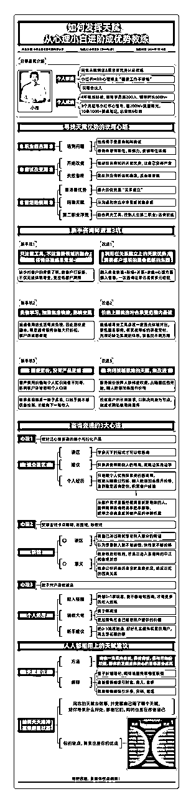

社群分享截图+社群分享干货导图

以此模式，循环往复来锻炼我的变现力与解读专业度。

加上我自己做小红书的成功引流经验，

我能够根据不同人的天赋组合+自媒体副业类型，

提出切身实际的解决方案，被学员评价我说得针见血，直戳心窝。

会有群友私信我“一直借别人的场域成交，会不会引起反感”

这里得申明：一昧地索取才会让人生厌，想要获得，就要先付出。

利用我的专业（心理援助，天赋+商业融合分享）给群里人做纯干货分享。

主动帮群主把场子搞热，这个间接在场域里面提供自己的影响力输出。

一来二去讲得多了，会有一些用户非常强烈地希望跟我学习这个“天赋解读”工具，

想靠这个达成了解自己+助人利他+副业变现的目标。

这就启发到我，开始要钻研自己的高客单的私教产品了。

### 2.只做1V1的强关系跟进，试水高客单产品效果凸显

2024年4月中旬，我向心理导师鱼了了请教，以我的现状要如何设计我的高客单产品？

在1个小时深度对话下，我完善了产品模型信息，逐步清晰我的私教价值点：

1.我会帮助客户拓宽做天赋解读时的开发客群思路。

2.我可以教客户如何从维护关系层面做高客单成交。

3.我会指导客户如何搭建符合天赋发挥自己的产品体系。

4.我会关注客户阶段性小成就给予肯定与关注的情绪价值。

分享我的高客单产品模型的信息：

其中最重要的部分——产品痛点梳理。这个部分写的越多，感受越痛，越有成交的机会。

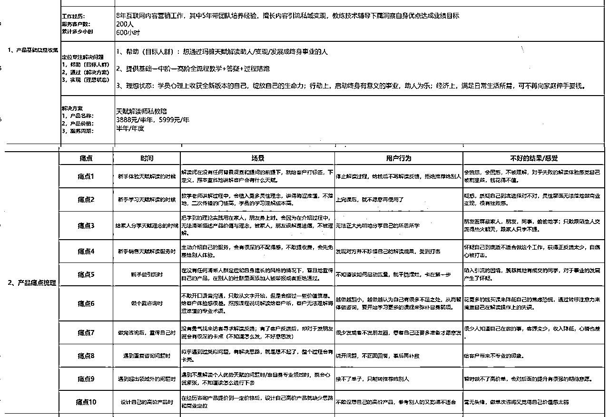

最后我梳理出我的产品权益表

当我把这些梳理足够清晰后，我对自己成交能力就足够自信。

我重新调整我的单次咨询服务权益：

1次付费=1次咨询+1个月陪伴（提供行动计划+见证成就）

让我的学员从关注外界向关注自我转变，

自己能够一点一点成长（从赚小钱，坚持写日记，坚持练习技能...）

远比羡慕别人的优秀而带来焦虑感，会更加珍贵！

当我的学员对我说：“当你的私教学员还蛮有安全感。”，我知道我的理念奏效了！

在推出高客单私教后，我做中价咨询（799元）转高价私教（3888元/半年）特别顺畅，

前面1个月陪伴期累点，苦点没关系，只要学员有收获，

有体验到成就，一定会回过头来感谢你。

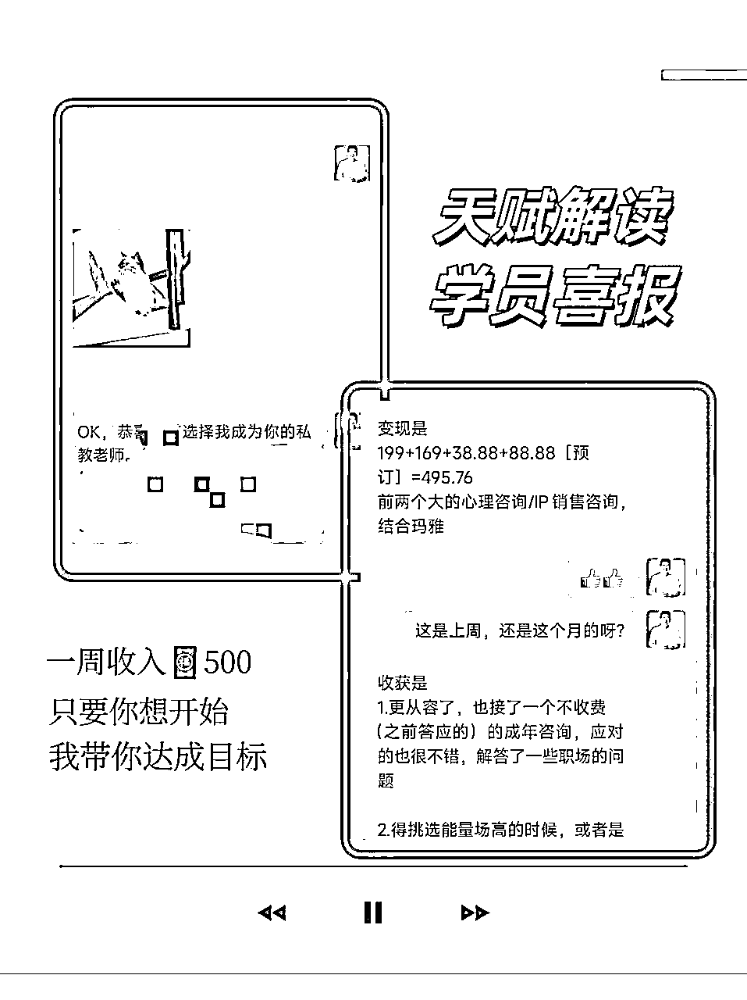

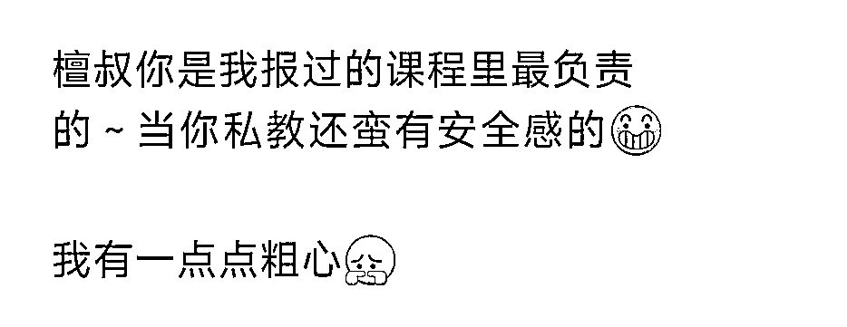

## 七.结语

以上就是我9个月以来的心理事业总结复盘，

看完是否有让你灵光一闪，收获满满呢？

最后特别感谢我的妻子，在我的而立之年，全力支持我辞职放手一搏，

在没有养育亲子的压力下，能够做自己喜欢热爱的事业。

别看我在文章里面“岁月静好”，是有她在替我负重前行。

所以我拿到的结果，第一时间都是向她报喜，

把收入悉数转给她，让她感受到我的喜悦。

其次是我的父母，在医院期间，他们是最在乎我的感受。

一方面需要我，另一方面担忧我。所以很多时候，

他们在尽自己最大的能力限度独自应对生活难题，

自己能顶一时是一时，不到关键时刻不向我开口。

我做现在的事业初衷有一部分原因就是：

能够给我的父母带来更多的安全感与体验世界的风景。

即便父亲已经不在了，那我更要带我母亲去更大的世界走走。

然后是生财有术的心理导师@鱼了了

她支持我起步，看着我拿到成果，

在我情绪最崩溃的时候提供心理援助，

在我放大事业结果时教我设计高客单产品。

很多心理IP会遇到的难题，

都是她在教我怎么用最小成本少走弯路。

很少人像她那样，舍得把自己学到的，毫无保留地分享给学生。

这也是影响我专注1V1，不做圈子的原因：

把精力放在人的改变上，而非圈子链接上，会减轻很大的焦虑感。

她润物无声地助人模式，跟我特别同频。

现在有幸成为她未来的事业伙伴之一，让我特别高兴能与她一起搞事情！

最后就感谢亦仁搭建的生财有术的场域，跟着有结果的人一起成长犹如坐上火箭一般！

还有我的学员们，有他们鼎力支持后，我才能不断迭代更新自己，朝着我想要的地方前进。

未来我会继续天赋解读事业上深耕，发展起自己的团队，带着大家一起实现左手利他，右手变现的丰盛人生。