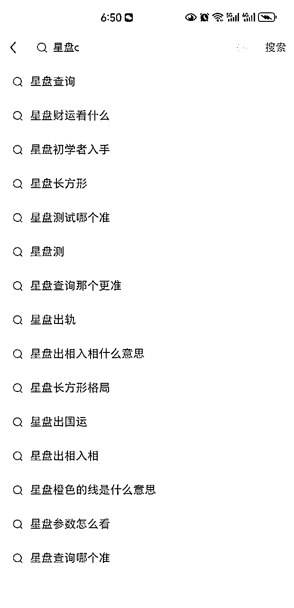
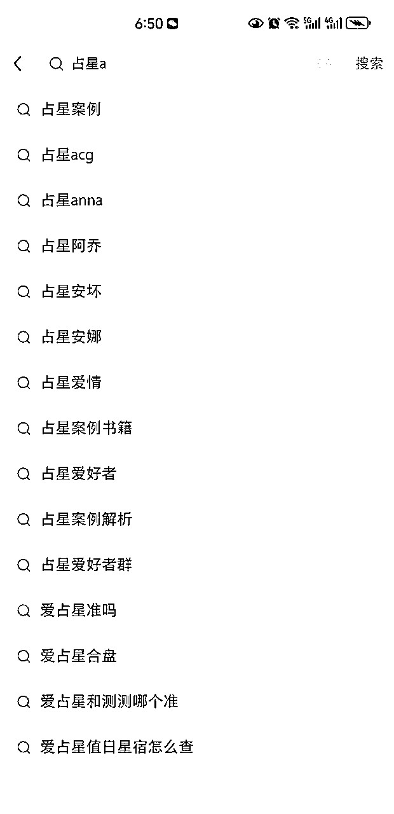
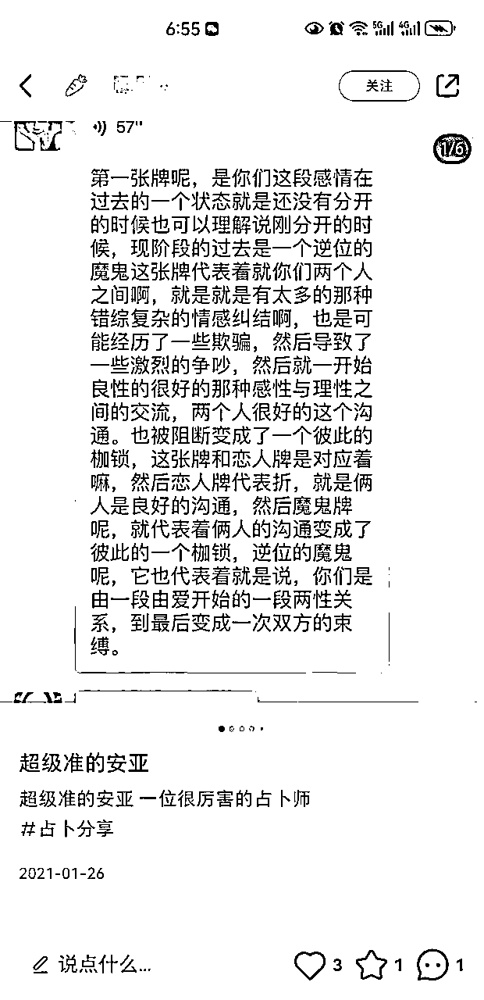
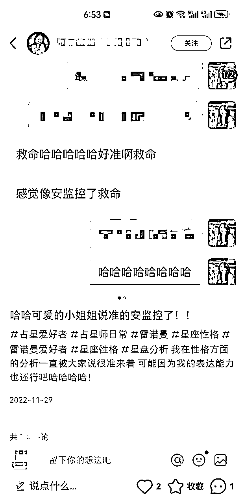
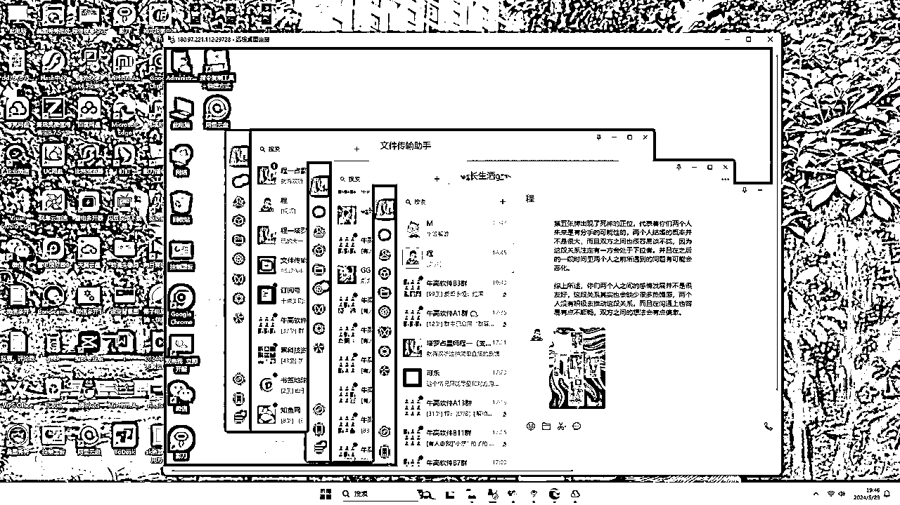

# 小红书seo全自动引流5000人，一年躺赚40万

> 来源：[https://ew7z4sb2te.feishu.cn/docx/Ir9YdXug0o1yOkxdiZGc1NIznTP](https://ew7z4sb2te.feishu.cn/docx/Ir9YdXug0o1yOkxdiZGc1NIznTP)

大家好，我是牛高。

今天分享一下我做小红书国学seo，一年躺赚40万的经历。

首先说明一下，国学这个项目有一些灰色，其实是不太建议大家去做的，这篇文章旨在揭秘和分享，我接下来分享的引流方法应该适用于其他很多行业。

我做的是小国学，主要是塔罗占卜和星盘占星。

简单的说就是给人占卜或者算命，一般算感情、婚姻、事业、分手复合、学业等，客单价在150-500之间。我没有做二转升单，也没有卖一些水晶手链或者法事什么的，第1个原因麻烦，第2个客单价高了以后也会有一些风险。

另外我的所有流程都是全自动的，包括前端的铺笔记引流以及后端的交付。

下面我来详细说一下，我到底是怎么做的？

## 一，前端引流

我知道现在小红书上有一些大佬在打国学粉，包括一些截流或者废号流的方式，虽然带来的收益是很不错的，比我可能高了n倍，但是这些方式第1个是要有团队，第2个对于设备、ip以及账号要求都很高，不搞个几十上百台手机都弄不了，而且流程比较繁琐，平台打压的也比较严重。我是单人作战，就不适合这些方式了。

那么我到底是怎么做小红书seo的呢？

简单的说，我主要是通过铺词，然后素人代发笔记的形式，

通过搜相关的关键词，比如占卜、占星、星盘、婚姻、财运等关键词，再加上字母，就可以延伸出很多不同的下拉词。

这些下拉词我们给他整理下来，加入到我们的笔记当中。这样到时候我们把笔记发出去之后，只要这条笔记正常被收录了，意向客户就可以通过这些关键词来搜到我们的笔记，进而加到我们的微信。

当然，我们也可以去5118这个网站上挖掘更多更细的行业长尾词。

相关笔记怎么写呢？

从客户反馈的角度来写，简单的说就是托，说占卜师怎么怎么样准，怎么怎么样灵验。

这种笔记很好写，一般就是一个标题，然后内容用一两句话就行了，这方面的可以交给gpt来写。

配图就更简单了，做一些假的聊天记录，截图一下即可。如果会rpa，可以准备好背景图和相关文字，用rpa全自动做出就可以了，或者请一个兼职让他帮你做好也行。

看到这里可能有些懂行的朋友就会问了，这种笔记容易爆吗，会违规吗？

首先，我走的路线是用seo的方式去铺量，主要让精准客户搜索到我们，不需要笔记有多么爆，就算笔记只有几个点赞或者没有点赞，只要他被收录了，就算是一两百的阅读，也很有可能会有人通过这条笔记添加我们。

其次，确实可能违规，现在各个平台对于国学的打击都比较重，虽然这种方法我虽然是2022年做的，但是现在依旧很有效。

因为我采用的是多号博概率的方法，发出去10条笔记，有1、2条存活被收录了，那么目的其实就达到了，我这里采用的是素人代发的方式。

找一些兼职，你准备好文字和图片之后，让兼职在他们自己的小红书账号上给你发布，发一条3元。

按照上面说的方法，我这里整理了大概有几百个长尾词，每个长尾词其实不用铺太多，有个一两篇笔记被收录就可以了。如果太多反而会显得假。

怎么样导流到微信呢？

我一般是预先花几天打造一个大号，发一些占卜占星相关的笔记，刷个几百粉丝。

然后兼职发的笔记，在笔记和评论区都艾特我的这个大号，大号置顶一个笔记，笔记上直接放微信号就可以了。

做seo引流的一个好处就是把长尾词用笔记铺一遍之后，就几乎不用管了。偶尔检查一下，如果平台把你的某个长尾词下的笔记掉收录了或者删掉了，那就补发一条就行。

所以我其实只花了半个月左右的时间，去把我整理的词铺发了2遍笔记，剩下的就不用花什么时间引流了。

## 二，后端变现

这种通过seo引流来的国学粉到微信之后，其实是很精准很好变现的。

因为他们都是有需求的，他们是通过主动搜索加来的，所以成交的比例挺高的，我这边基本上成交率大概在30-40%。

后端在微信朋友圈发一些塔罗牌占卜和占星相关的内容，打造一下就行了。

这里我为什么说是可以全自动的，因为上面说的前端的引流，制作笔记我用了一个兼职配合rpa帮我做，代发笔记也是兼职他们自己去发布，

后端变现我直接对接了两个塔罗占卜师，然后呢，我是开了一个云电脑，在淘宝可以直接买100块钱一个月，然后把微信登录电脑版，占卜师在他那边可以直接把我的服务器打开，在微信电脑版上通过好友、回复消息以及引导成交，我连销售的工资都省掉了。

这一年引流的好友大概有5000人左右，然后占卜和看盘的客单价一般是150到500之间。除去分给占卜师以及其他一些杂七杂八的费用，我的净利润有40万。

虽然不算多，和很多做国学年入几百上千万的大佬比不了，但是几乎全自动，啥也不用操心，完全是躺赚。

现在我也不做这个国学赛道了，确实有点灰色，我还是想做绿色长期的赛道。但是这个seo的玩法我感觉其他很多行业，尤其是客单价高一点的行业都是可以做的，赚点小钱还是很轻松。