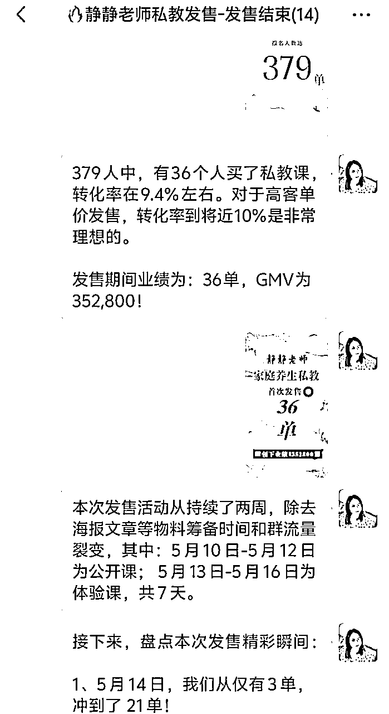
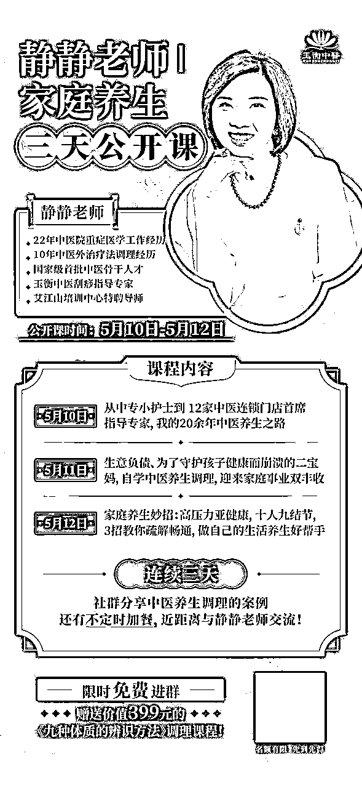
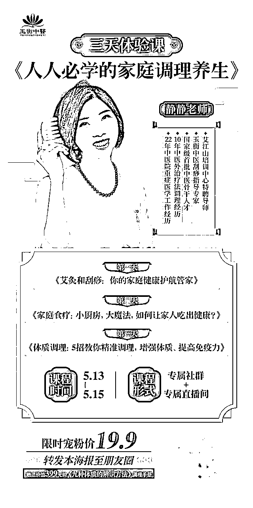
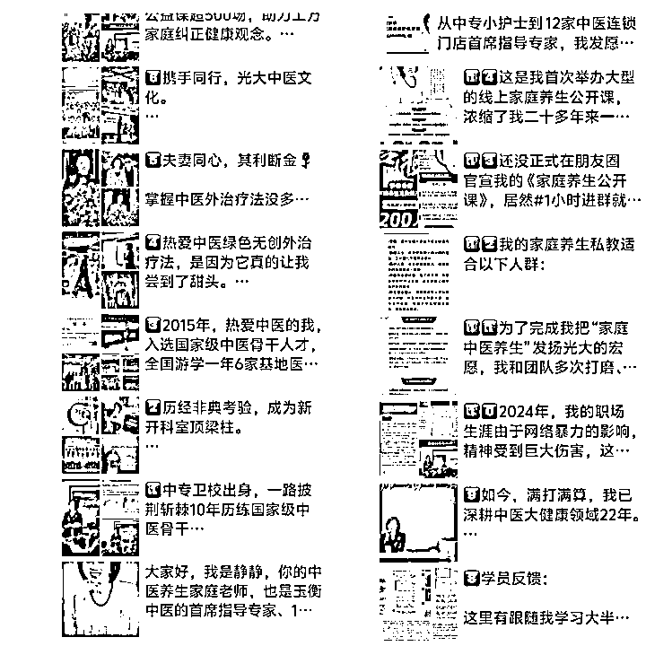
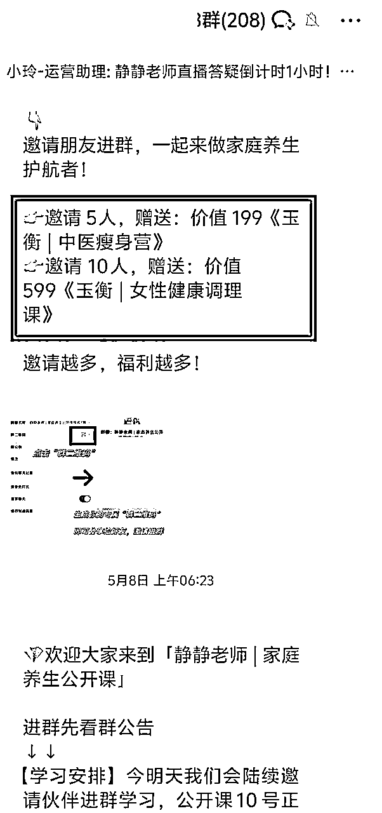
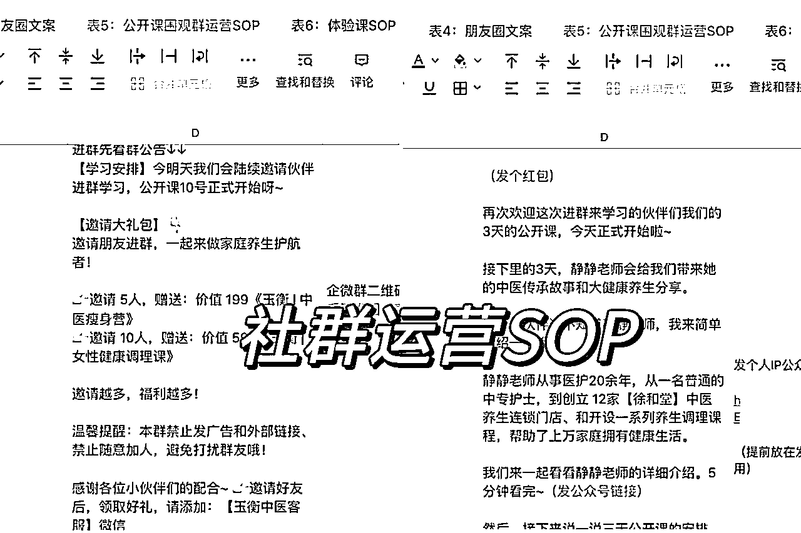

# 《操盘发售中医大健康年度私教，5天营收35万业绩，超详细保姆级发售流程》

> 来源：[https://jl8s0cicqa.feishu.cn/docx/ItQLdTrhHowJM4xGoQCcjbyZnQe](https://jl8s0cicqa.feishu.cn/docx/ItQLdTrhHowJM4xGoQCcjbyZnQe)

大家好！见帖欢喜，我是大西，专注在私域变现、IP私域发售操盘。

去年11月尝试帮圈子里的 IP做低转高发售，从19.9的产品嫁接到4980的产品，并卖出20份；今年2月参与AI破局俱乐部社群拉新，帮助战队冲上第四名，创造33万业绩。

今年3月中，我开始正式从“社群运营”顺利转型到“私域发售操盘”，在半年时间里累计业绩达到了100万。目前积累的私域发售案例有：小红书海外旅游、AI 电商、时间管理课、优势天赋私教、中医大健康。

五月中旬，我帮助一个中医养生大健康 IP做了一次9800私教产品的发售，5天卖了36个私教。这场发售累计流量2000人，有379个人买了19.9的体验课，转化率18.95%；379人中，有36个人买了私教课，转化率为9.4%左右。

对于高客单价发售，转化率到将近 10%是非常理想的，客户对这个发售结果也挺满意。

本文将结合我在本次产品发售期间，从0开始做发售，拉新免费围观群流量2000，转化379人到19.9的体验课、再转化36个人到9800的私教的全流程。

这次发售的营销、转化策略对于未来要发售高客单价知识付费产品的IP有参考性和启发。

# 一、为什么建议IP要做私域发售？

在开始分享以前，先来思考一个问题：为什么IP推出新产品，一定要做社群发售？有人或许会问，群发私聊告知、朋友圈官宣、直播通知、发公众号... 这些渠道不可以吗？这些方法也奏效，但是每个形式都单一，无法形成链条式的流量聚集效应，再通过设计转化路径，批量成交。

以下是我总结的IP私域发售产品的目的：

*   一对多，减少沟通，降本增效，批量发售

*   密集触达，强化锚定，利于IP影响力传播

*   快速激活静默流量，能突破业务增长瓶颈

*   流量难获取，快速高效撬动流量，转化变现

流量时代，效率至上，能够批量成交实现业务增长，多赚十倍、几十倍，那肯定是效率最高的了。

其次，产品发售的意义对于IP来说有“长尾”效应，总结起来，就是“九字箴言”：成本低、见效快、可复用。

*   成本低：流程设计简洁，运营周期较短，无需长期维护，群维护成本较低

要批量激活潜在的流量，就要拉围观快闪群，通过免费进群学习、领取福利的方式，吸引更多尚未激活流量。而快闪群的好处是，只服务于短期的发售目标，运营成本低，不需要用内容、人员长期维护。

*   见效快：快速聚焦一批潜在客户，集中批量成交，易营造稀缺感和紧迫感，激起用户从众心理

私域发售都会采用一系列的营销转化策略，快速聚焦用户。比如，进快闪群参与裂变邀约，额外赠送福利、优惠券领取、涨价倒计时等等，激起用户的“害怕损失心理”，吸引他们参与转化环节。

*   可复用：大多数IP、行业都可以用，整体流程简洁易操作，可反复使用

私域发售会有一套完整的SOP，包含前期宣传预热（公众号、朋友圈、社群、视频号等），发售后的SOP可以沉淀到自己的私域留存链路了，下次备用。因为对于很多IP来说，发售不仅仅只有一次，当公域流量积累到一定阶段，就要批量去运营转化，否则这些流量长期放在私域不激活也会浪费。

# 二、从行业情况去分析

首先，在做私域发售时，我们会对一个产品的行业赛道、产品类型、商业模式等，都做一个基本的分析，可以预计大致的发售效果。

大健康行业是目前私域里天花板最高的行业之一，人口老龄化、银发经济兴起、人对健康养生的孜孜追求，都在昭示着这个行业的繁荣。

我在和IP初次沟通时已经知道她的个人标签：前三甲中医院护士长、线下连锁中医门店的创始人和首席指导、大健康养生品牌团队长.....这些IP的光环和背书很强大，非常能够说好IP故事，有助于发售。

# 三、超详细的发售流程

那么，我们先来看看一般做免费围观群的发售活动路径：

前期准备：确定发售品 - 敲定活动方案 - 提前物料准备

售前预热：朋友圈剧本铺垫 -活动引流 - 邀约进群

正式发售：产品介绍-优惠福利公布-群接龙-倒计时逼单

售后追销：宣布结构-福利发放-用户反馈-群解散-沉淀私域

## 3.1 前期准备

这是IP第一次做高客单价知识付费产品的发售，我们初次沟通时，她还没确定产品，于是提前了一个月帮助她确认发售的产品 —— 做一个养生健康的合伙人/私教。在经过三次向商业顾问咨询后，最后IP确定了要发售一个价格为 9800的家庭养生年度私教。

### 3.1.1 确定发售品

筹备产品的过程中，我在对产品设计、权益、价值都给了建议。知识付费市场经过多番沉淀，付费用户接受的信息太庞杂，也没有足够的耐心自学和摸索，因此从产品发售的受欢迎程度，私教、合伙人比低价社群、标准录播课好卖。

定制化大于标准化，情绪价值大于实用价值。用户需要的是老师能手把手带领从0到1，而不是自己摸索到1；用户需要的是陪伴、见证再到正反馈的情绪价值，是感受到IP身上拥有我向往的生活。

所以与其说我们在发售产品，我们也在发售一种理想的生活状态，让用户觉得：购买了，我也能构建美好的生活。

### 3.1.2 敲定活动方案

一次大型的社群发售，最少要提前两个月策划，因为前期要确定发售方案、流量盘点、筹备物料等工作。因此我和IP 在打磨产品海报和个人发售信，也花费了两周的时间。

IP 要发售的是一个近万元的高客单价产品，用户的信任度、粉丝粘性要非常强才有助于转化。因此在设计活动方案时，还是确定了“社群发售” + “直播发售”，相互联动，加速转化。

这个IP由于是线下连锁中医门店的创始人和首席指导、大健康养生品牌团队长，过去几年在线下举办过累计几千人次的公益讲座、线上通过做养生直播和授课也沉淀了几千人次的流量。这些基础流量加起来近一万，虽然团队没有系统地做私域运营，但可以通过做免费公开课，再次激活。

中医养生赛道的变现天花板很高，人群主要是30岁-50岁人群，而且以女性群体为主，具有较高的消费力，因此在设计路径时我们的目标就是围绕这些人群。

IP的粉丝量大、粘性强，只是团队长期以来不懂营销和运营转化，更没有做过社群发售。我就先通过初步的电话，从产品选品、产品定价来给她建议，由于要发售的中医养生私教是9800元的高客单价品，泛流量的转化率不会很高。

因此我给IP设计的发售流程是：先做3天免费公开课、发售19.9的3天私教体验课、最后在体验课的精细化运营中转化高客单价。

从流量的筛选漏斗，先把静默流量启动、再把免费公开课流量激活，转化到19.9元的三天体验课，最后在体验课里转化到9800的高客单价。

总结起来，大致的发售路径就是：三天免费公开课 - 三天深度体验课 - 转化到高客单价

经过之前的发售操盘，我发现，高客单价发售需要经过流量的两次筛选和转化，才有机会发售出高客单价。然而不是所有品类都适合做体验课。

目前来看，适合发售体验课的赛道有：心理学、身心灵疗愈、中医大健康、减脂、目标精力管理等等需要调动用户体验感和收获感的赛道。

用户通过和IP的深度接触，增加转化触点（公众号、社群、朋友圈、私聊等），从而加强对IP的信任感和对产品的好感，才有几率转化成交。

### 3.1.3 提前物料准备

（1）产品海报

我会帮着IP修改产品海报，前后大致花了两周最终敲定了发售的产品海报。一般产品海报要包含这些元素：

*   大标题

*   次标题（口号、宗旨、产品的补充卖点）

*   IP个人介绍

*   适合人群/痛点场景展示）

*   课程特色/安排/内容介绍

*   课程权益

*   交付方式

*   额外福利/惊喜

*   价格（原价+现价）

*   阶梯涨价说明/特别优惠说明

（2）个人IP发售文

接下来，在发售前两周，要做【个人IP发售文】。为什么要做个人IP的发售文？

任何干货、道理，都不如一个好故事给人印象深刻。罗振宇、雷军、刘润等大佬们，每年都会安排一场跨年演讲，以故事的形式加深大家印象，达到持续传播，放大影响力的目的。

IP的个人故事更能快速积累信任，拉近与用户之间的距离，能让用户快速了解你的成长经历，了解你是谁、取得了什么成绩、有什么业务、能提供什么服务？最重要的是，通过故事，更能记住你的价值，及你独有的特别之处。

总而言之，一个好的个人故事，能够助你快速建立用户信任度，进而积累个人IP势能，提升影响力，高效获取精准流量，提高转化率。

(3) 公开课主题和体验课主题海报

这次发售用的是免费快闪群和低价付费体验课，因此需要2张海报。

公开课海报非常重要，它是吸引一切流量的前置筛选。一般公开课海报，会包含IP在几天内的分享，吸引人进群。

海报内容是：标题、导师介绍、公开课内容分享、进群福利、二维码等。要做到清晰明白告诉别人，扫码进群你能学习和收获什么。

体验课主题海报则是进阶的筛选，体验课分享的内容会更加细化、专业、交付感比免费公开课要强。因此在设计它的时候也要做好区分，从内容形式和主题上都有所不同。

这两张海报设计完，就可以进入宣传预热阶段了。

这次发售我让IP把19.9体验课的海报放在个人IP发售文的公众号文章里，等于是提前宣发预热，吸引潜在的用户付费。

测试出来的效果很不错，我们的免费公开课还未启动，就已经收到了超过100个体验课的付费订单，为后续的高转化奠定了基础。

## 3.2 售前预热

售前预热包括：公众号文章预热 - 朋友圈剧本铺垫 -活动引流 - 邀约进群

### 3.2.1 公众号IP文预热

IP做产品发售，要学会用故事来包装自己，放大身份特征，用真实的经历去说服用户，利用你的身份、年龄、职业、经历等标签来塑造人设。

我和IP花了两周时间来打磨这篇文章，一开始找人就写好了个人IP文，但是如果要达到发售的跌宕起伏、丰富人物，还需要再修改。

我就找了一个一篇同行业的公众号文章，拆解它的脉络和结构，把IP的文章大改了一遍，加上团队前后修修改改有4、5遍。把产品的卖点与IP卖点，融入到个人成长经历里，用故事的形式讲出来。

一个好的个人IP发售文，一定是符合“靶心人公式”，即：目标→阻碍→努力→结果→意外→转弯→结局。

这就好像【好莱坞式英雄】拯救之旅 ——底层/挫折 - 遇到转机 - 做出改变 - 迎来变化 - 再遇挫折 - 越战越勇 - 迎来成功。

好的故事=强的信任度=高变现。任何干货和道理，都不如一个好故事给人印象深刻。

好的个人IP发售文，能让潜在的用户快速了解的你成长经历，了解你是谁、有怎么的故事、取得什么成绩、能提供什么服务、有什么愿景和目标。最重要的是，能通过个人IP的故事，记住你的价值和独特之处。

这对于发售转化来说，无疑是强大的影响力杠杆。

那么个人IP文最好什么时候发？建议在免费公开快闪群正式启动的前2-3天，有一些战线长的发售还会放在快闪群启动的一周以前。

由于这次发售我们采取的长线发售策略，而且还提前把体验课的定价、海报和交付内容都做好了，因此就提前了7天发到公众号，测试有多少人会购买19.9的体验课。

没想到最后效果很好，在免费公开课开始前，19.9体验课已经卖出去100+单。

所以提前做好发售文的预热，能让用户有一种“参与其中”的感觉，而且人设文写得很真诚、体验课价格偏低，用户的决策成本就低，更加愿意支持。

### 3.2.2 朋友圈剧本铺垫

IP想做产品发售，一定要有足够的流量基础和用户信任度，而朋友圈一直都是培养信任度和粘性很好的场域，所以朋友圈的铺垫是很重要的，要让用户能参与到整个产品的创造过程以及发售过程中。

当产品在公开渠道进行铺垫时，会让用户有一种参与感，好像自己身在其中，见证一个事件，他们就会更加愿意购买这个产品，信任度也能更高。

就好像电影宣发，前期会通过主角们在社交媒体互动，暗戳戳地表示接下来会有“大动作”，不断吸引粉丝的注意力，调动情绪，拉高期待值。

在这期间，可以高频发圈，增加曝光量，具体发朋友圈的频率：

预售期，每天至少2~3条产品相关；发售期，每天至少5条以上朋友圈。

发售活动期间不用很担心刷屏，本来这就是一次发售营销大事件，等到发售结束时，再批量删除即可。

而且在发朋友圈过程中，可以增加与用户的互动，增强大家的参与感，最好能引导点赞，比如，可以在朋友圈文案里加上：感兴趣的点赞、扣1，一定要下达指令。用户都需要指令才能去参与，也能提前做一波目标用户筛选，这个步骤不能省略。

那朋友圈发售的铺垫，该发哪些内容呢? 我尝试总结了四个阶段的发朋友圈：

*   预热期：制造悬念、拉高期待、留下钩子、吸引福利

*   裂变期：免费福利、薅羊毛紧张感、进群领福利

*   发售期：刷屏报喜、恭喜抢占名额、秀学员成绩、涨价倒计时刺激

*   追销期：不断制造紧张、倒计时刺激

如果个人经历非常丰富，也可以用朋友圈故事来串联，做成一个系列，这样的好处是：更加丰富IP的形象，让用户从全方面了解你，加强信任度。

朋友圈发售预热的这个时间不能太早，一般提前3~5天即可，当时我们说提前了一周左右，其实过早了。

而且养生大健康的知识付费产品，就不能以变现赚钱的角度切入，因此在朋友圈铺垫时，我们更加注重的是IP形象和故事的打造，塑造一个专业有干货、温暖真诚的中医指导老师的形象，这也符合IP本身的性格特质。

大健康养生的人群和副业搞钱的不一样，他们对营销类的信息接受还是较少，前期我们就像尽量多用真诚和干货先吸引进群。

### 3.2.3 社群预热铺垫

除了朋友圈的铺垫，社群也是需要做好铺垫，这里针对于有自己社群的小伙伴，或者团队成员有专属社群的小伙伴。这次找我发售的IP手上有一批过去在视频号直播引流的用户，之前尝试过运营也无法激活，因此我让他们把那批流量当做初始流量，能转化多少就转化多少。

在这里也提醒一下：不是所有的社群都能被高效激活的，但是设计好福利诱饵，总能激活一部分流量。

而且老社群中的成员都会是新项目的第一批种子用户，足够捧场，且对IP本人有足够信任度。

这次发售是IP的第一次私教产品发售，很多用户都不了解，但对于IP是非常信任的，也参加过IP团队其他的中医养生课程，因此在社群上也能撬动一定的初始流量。

在准备这个项目期间去社群中铺垫，想要一次就铺垫到位是不可能的。就像朋友圈铺垫也是要多次发布才能让更多的人注意到我在做这件事，放到社群当中也是一样的。

## 3.3 活动引流

### 3.3.1 盘点现有流量资源

任何发售都要先谋定而后动，确定了发售方案后，就要进入关键的流量盘点，计算转化率，设置目标，才能结果倒推行动路径。

在开会沟通时我就和IP团队盘点流量，包括线下门店导流的数据、线上的流量（沉淀在微信人数、公众号流量等），当然，会有重合的流量，但是不碍于整体转化。

另外，如果IP在一些高质量的付费圈子/社群里，还可以邀请主理人（可以统称为KOL，他们具有一定的影响力，有利于转化）助力去推流量。这里要注意的是，找KOL推流量前要明确好如果成交后，销售佣金分成。

### 3.3.2 确定福利赠品

我统一把任何发售的免费引流称为“大型领鸡蛋”活动。就好比在线下举办活动，地推扫码关注APP或者会员注册，主办方都会用福利刺激来吸引人免费到店领取礼物。

有福利，才能吸引围观群众来参与，而且福利越大，越能刺激用户来参与。

在讨论免费公开课的福利时，我们设定了三种福利：

1.  进群即送的福利品

进群即赠送，就能吸引别人扫码进群领礼物。这种福利品最好是PDF、文档、网盘、录制好的课程等，简化沟通流程，进群后用户添加客服助理即可领取。

千万不要选择那些需要兑换流程的福利，比如实体礼物，这样会和用户沟通填写地址，大大增加运营成本。

1.  参与裂变邀约别人进群的福利品

想要吸引更多人进群，就要设计裂变的机制。有一种非常好用且典型的社群裂变方式—— 赠送更超值的礼物。

这个福利一定要比进群赠送的礼物还要超值，让用户进群后有一种“游戏冲关”的畅快感，就好像玩游戏捡金币，闯到第一关能领取奖励，第二关、第三关的奖励更丰富。

如果进群赠送的是PDF资料，那么裂变邀约就可以赠送课程类、工具包等福利品。

福利品确认以后，可以把名字更改成和公开课主题相关的吸睛主题。比如我们这次公开课的【邀请大礼包】就设置了:

邀请 5人，赠送：价值199元《中医瘦身营》

邀请 10人，赠送：价值599元《女性健康调理课》

这些课程如果单个购买都需要成本，一般用户看到课程会觉得有超值的感觉。对于大健康感兴趣的人来说，本身就有需求，而且用户对IP的课程比较了解，能清楚其中的价值。因此在群裂变的两天里，这2份福利品让很多用户都自发参与邀请人进群。

## 3.4 邀约进群

这次发售免费的基础流量，用的是免费快闪群。很多IP会用个人微信拉新，这样操作很快，也不需要企业注册等流程。但如果如果有企业微信建群，安全性就相对高，能承接住大批量的流量，而且企微满200人可以自动出新群，也会方便很多。

在社群运营期间，企微还可以自动发送进群公告，节省了运营的人力。

邀约进群前，团队要准备好充足的物料和流程：

### 3.4.1 详细的社群运营SOP

一场发售里绝对不可以缺的就是完备的SOP，IP团队想要减少培训、不断私聊的沟通成本，最可靠的工具就是把全流程SOP做好，要细致到每一天、每个时间段的运营环节、物料支持和人员分配。

我在操盘时也会提前让团队运营协助做好，整体把关统筹，而且随时要修改。一份完备的SOP 能让团队快速执行，及时修正和调整。

### 3.4.2 社群气氛激活

邀约进群以后，要有以下的引导动作：

*   公布围观群的目的和分享内容，让用户保持期待

*   引导用户进群后添加助理或者客服，领礼物

*   欢迎其他人参与裂变，邀请更多人，兑换礼物

建议邀约进群不要太早，一般在正式运营快闪群的前 2~3天邀请人进群，好处是，能让更多用户邀请好友进群。他们领取进群礼物后，如果想要升级到更多福利，就可以邀请其他人进群。

这个裂变周期设置在2-3天比较好，而且有一些IP还会邀请社群里一些知名的KOL来助力推流量，留充足的时间给他们去拉人

总而言之，关于宣传预热，就是让用户尽可能的参与到发售环节中来，有助于提高后续的批量成交率。整体的发售宣传预热铺垫，可以总结为：

*   通过宣导让大家对产品有一个基础的认知，把这件事深深种在用户心里。

*   多增加互动，多曝光产品打造的过程，做了哪些准备，提高用户的期望值。

最终目的是：从我们主观推销产品，反而变成了用户渴望去了解产品、得到福利，调动积极性，避免让用户对营销产生抗拒心理，从而提升后续的成交率。

## 3.5 “低转高”的正式发售

“低转高”的正式发售包括：体验课学习-社群和直播发售-优惠福利公布-群报喜-倒计时逼单

由于发售的产品是近万元的高客单价年度私教，在产品的发售环节，我们进行了较长的设计。3天免费围观群筛选了379个19.9的付费学员进入“深度体验课”。

关于深度体验课的设计，一定要比免费公开课更加有收获。免费公开课我们的设计是关于中医养生的大致分享：

第一天是IP老师的分享、第二天是优秀学员的分享、第三天是具体的养生妙招。从人设故事、学员证言、具体的干货，先把公开课的期待值拉高。

公开课期间，每天的内容分享也要让用户觉得超值，在分享内容的质量和频率提高，多次发售操盘测试我设计了每天中午是图文分享，晚上是直播间答疑。

这样的好处是：

*   有些用户是全职宝妈、有主业，一般也没时间看群，那图文分享能让用户在社群里爬楼学习；

*   到了晚上8点左右，他们相对轻松，能拿手机学习，那么直播就能增加信任度，圈粉。

免费公开课的第一天开始，IP在直播里要开始预热做了一个家庭养生私教产品，19.9可以购买三天的体验课。

社群运营中，我们也会在每天的预告里增加19.9体验课的介绍，强调这是免费公开课的升级版，如果在公开课里和老师学习的收获很大，想继续学习就可以报名体验课。

经过3天的公开课不断给体验课种草，通过转化的话术、报喜海报等，最终吸引了370人陆续报名三天体验课，为我们后续转化9800的年度私教奠定了精准的流量基础。

### 3.5.1 体验课学习

关于三天体验课的课程设计，就要比公开课含金量更高，而这个中医养生IP老师非常专业，我们一起敲定了体验课的课程目录：

第一课《刮痧艾灸，做健康护航管家》

第二课《家庭食疗: 小厨房,大魔法,如何让家人吃出健康?》

第三课《体质调理:5招教你精准调理，增强体质、提高免疫力》

这三个课程都非常刚需，是热爱养生、中医人群都会感兴趣的话题，调理的针对性也很强。课程是提前在小鹅通里录制好的课程，报名体验营的人进群学习后即可开通。

在免费公开课以前，用的是免费流量裂变；但是加入了体验课，就不需要任何的外部流量，只需要拉高付费用户的体验感。

接下来重点说一下三天体验课“低转高”的发售流程，这里的正式发售流程包括：进群课程学习 - 直播答疑 - 产品介绍- 优惠福利公布 - 群报喜 - 倒计时逼单

进群第一天学习，要创造给用户不一样的惊喜感和仪式感，就好像报班上课，我们会有课程大纲、同学破冰介绍、老师自我介绍等等。

这个流程可以设计——课程开通、自我介绍、学员调查问卷、开营仪式。

体验课一拉群，就告知学员，进群可开通 3天体验课的课程，并让学员填写中医养生调查问卷。

调查问卷在产品发售里非常重要，它能帮助IP快速筛选一批精准的用户。哪怕调查问卷需要花费2-3分钟，但很多用户是不愿意填写的，而如果愿意填写的用户，就距离成交又近一步了。填完的用户，让助理导出名单，在产品正式发售时，逐个去私聊意愿。

而开营仪式会让用户有一种“被重视”的仪式感，就像以前上学时的开学第一课。

体验课除了有听课链接，还要设计打卡环节。

拉群的第一天就可以安排自我介绍，自我介绍模板（名字、城市、行业、希望在体验课收获），一方面让社群成员互相熟悉，另一方面，通过自我介绍里的关键词，我们可以锁定这个用户的付费意愿。

这次体验课，我设置了几个能增强课程体验和提升产品粘性的方法：

因为当客单价越高时，用户的决策成本越高。高客单产品在运营转化端要下更多的功夫，只有用户体验好了、产品权益和价值到位，他就会心动。

虽然体验课只有3天，也要提升作业打卡率、增加各种与学员的触点，力求后续能转化到私教。

在课程方面可以设置：每日课程打卡奖励、每日直播答疑

体验课的交付感提升，就要让用户参与进来。“作业打卡”就是让用户有参与感、获得感的形式，为了激励学员积极提交作业，我设置了打卡福利：

*   认真完成【3次】课程打卡，即可得到【全勤奖】，可以赠送200元的现金券，可用于购买IP老师799以上的课程产品。

*   认真完成【2次】课程打卡，即可得到【阳光奖】，赠送100元的现金券，可用于购买IP老师799以上的课程产品。

*   认真完成【1次】课程打卡，即可得到【参与奖】，赠送50元的现金券，可用于购买IP老师799以上的课程产品。

关于打卡福利，最好是实在的福利，比如现金券（用来抵扣知识付费产品）成本不算很高。而且打卡福利是不与发售的私教产品重合。

作业打卡福利能让学员有参与感，还有一种游戏冲关能获得奖励的成就感。这个环节设置在体验课就等同于“小型的训练营”中的打卡，当学员看到奖励，就有了努力完成作业的态度。

IP老师每天都能收到作业打卡的反馈，无形中就增强了学员对IP的信任度，为后续推出9800的年度私教埋下信任基础。

### 3.5.2 直播答疑，增加信任度

体验课三天每天的安排都是：中午社群图文，邀请优秀学员分享；晚上IP直播，在线答疑养生问题。

在社群发售里，直播间的运营和转化可以说是正式发售产品中最重要的环节。无论是录播课程、图文分享，学员都只能通过文字感受到IP，这种感受力远远不及声音、神态、表情等来得直观，所以在体验课中，IP要每天保持和学员在直播间里互动。

体验课期间，可以让社群运营每天早上都预告晚上的直播，早上预告、下午问题接龙、晚上直播。

直播答疑要注意做好以下的转化动作，提前收集的问题，在直播间里答疑时，要安排专门的社群运营人员在直播过程中概括总结内容，快速提炼成文字段落，并加上直播间的专属链接“尾巴”附在同步转述的文字后，转发在社群里。

这个步骤非常重要：一方面有些人来不及收看直播，可以后续通过社群爬楼快速掌握；另一方面能吸引快闪群围观学员，看到文字点击链接进入直播间。

在直播答疑过程中，发售产品的介绍和答疑的比例最好是1:1，甚至如果学员的反响热烈，可以把产品介绍增加。

比如我就会给IP设计在直播答疑时，任何问题都可以往产品上去延伸。中医养生有很多问题，每一个都有对应的场景化，因此在讲解过程中，IP会简单给出答案和建议，就好像线上问诊；而如果要更加深入的家庭养生调理方案，可以加入私教，解锁一个年度的中医调理问题，为私教学员做养生定制化方案。

总之，在直播答疑过程中，任何问题都可以往产品上去靠拢，当然还要考虑学员的感受，如果有学员提出多听听干货，可以暂停营销产品。

### 3.5.3 超值优惠福利公布

这里详细介绍“优惠福利”的公布，在体验课直播的第一天，我就设计了直播发售时会抢“0元代1000元”的【超级幸运王】折扣券，总共会发10张，限量抢购，仅此一次。

除此以外，还有常规的500元抵扣券、300元抵扣券，发售期3天，每天的优惠券呈递减，想要抢大额度的优惠券，就提前抢购。

“优惠福利”设置运营了两个：用户的厌恶损失心理和营销学里的“饥饿营销”。

人人都有厌恶损失心理，都不想错失最好的时机；然而我们发售的产品又是近万元的产品，就需要有一个刺激动作，吸引用户去触动这个开关 —— 这就是0元抵扣券的。我们不需要设置优惠券的价值，如果设置了，反而用户看到要付费，反而会犹豫。

而如果你告诉用户，不管如何，先把券领了，如果不满意了可以退，没有任何损失。用户这时候才能放心去领券。

饥饿营销就是营造一个限量的营销场景，我们要告诉用户，这个福利是限量、限时，逾期不候，制造稀缺感。

实操下来，第一天发售时，1000元的优惠券几秒就抢完了。宣布优惠福利时，运营人员要及时在系统后台导出抢券的名单人员，直播结束后由IP老师跟进私聊追销。这里要用到“成交不过夜”，今天成交的单子就立刻成交，不要拖着，免得丢单子。

假如产品发售期是三天，那第一天设置500~1000元3~5张 （要视产品价格而定），由于这张券是整场发售里份额最大的额，要和用户说明抢购的当晚必须兑换，否则就让给其他用户，无形之中也让大家有哄抢的效果。

第一天还可以设置300~500元 (20~30张），免得有些用户没抢到最大额的券而放弃抢券；第二天和第三天分别设置100~300 （30~50张），数量比前两天都多。

关于直播间和抢券，在发售期间会有“峰值效应”，也就是，用户可能会忘记中间IP老师讲了什么知识点和内容，他们只重视开头和结尾的感受。

因此在准备直播和发优惠券的节奏上，一定要刻意设计直播过程中的高潮（峰值）环节和结尾（终值）环节，这样才能给别人留下深刻的印象。

在一开头就要设计好互动、拉长停留，可以用：直播红包抽奖、实物礼品抽奖等方式，在开始直播的前15分钟锁住用户的注意力。

而在发优惠券时，在直播间和社群都要营造紧张刺激的哄抢氛围，IP用好直播间里的互动指令，比如发红包评论特定的口号、数字互动等等，尽可能调动用户在直播间的参与度。

在直播间发优惠券时，如果是1小时~1个半小时，IP发券节奏可以控制在3次~4次，每一次发券前都结合产品的干货内容延伸拓展，差不多在30分钟左右就发一次券，把氛围调动起来。

直播发售的第一天和第二天是领券最多的，争取把前两天的券数量多放一些。用户的注意力有限，有些人不会全程都在社群和直播间听分享，因此把发售动作前置，能减少用户流失。

### 3.5.4 跟进追销，乘势追击

在高客单价产品发售里，私聊追销是整场发售的重头戏。如果说前期的所有工作为了铺垫预热，拉高期待值，是IP一对多的分享，那么私聊追销就是IP、运营人员深入触达有意向的学员，了解他们的付费意愿。

发售阶段的私聊追销和日常公域引流的承接、私域转化不同，要更加直接开场。

我会帮着IP一起做私聊追销，在这里借鉴了梁靠谱的“黄金成交五步法”，即：建立联系-同步信息-挖掘需求-解决顾虑-达成成交。

不得不说，这个销售成交五步法在发售私聊时发挥了很大的作用，与意向学员私聊时，重点是挖掘需求和解决疑虑，毕竟对于高客单价产品，超值的权益和交付要让用户觉得物超所值。

私聊成交有一个关键节点，尽量不能过夜成交，如果用户说再考虑一下，我们要解决顾虑上多用“身份认同”、“情绪价值”、“描绘愿景”等方法。

很多用户在成交边缘犹豫不决，这时候需要IP老师给予强大的信心，理性上，要展示私教产品的超值权益和福利，而且发售的价格在公开其；感性上，给用户信心，加入私教，自己的生活会变得越来越好（身体调理、家庭关系、事业发展等）。

### 3.5.5 社群报喜，吸引注意

每加入一个新的学员就要立即制作学员专属的报名海报，再加上一句促单转化的话，吸引其他围观学员的注意力。人都是有从众心理，看到别人报名，尤其是熟悉的人报名，有可能也会心动。报喜环节能刺激围观群众加入，用户们看到一片报喜的红，也会下意识感觉到这个产品很受欢迎。

除了社群报喜，还要在发售期用好发售类型的朋友圈，浪潮式报喜。

最简单直接的朋友圈浪潮报喜形式就是发固定的朋友圈，比如：年度私教＋1、年度私教2、年度私教＋3.... 以此类推，形成报喜矩阵。这种朋友圈的构成就是：报喜标题+学员简短故事+产品卖点+下指令，非常简单有力。

人都是有好奇心的，即使没有进群围观，但也会被IP的朋友圈吸引，甚至会私聊。这一次发售时，还有一个微信用户是仅仅看了公众号和朋友圈，就1分钟内转账9800。

所以谨记：发售期任何一个有效的转化动作都不要浪费。

### 3.5.6 倒计时逼单，制造紧张

在发售期的最后一天，免费公开课围观群和付费体验群都可以进行倒计时逼单，宣告本次发售活动即将进入尾声，年度私教的价格将在发售期后涨价，再次激发围观用户加入。

在这里可以用一系列倒计时海报，用加大加粗的数字倒计时，10、8、6、4、2、1小时都是常用的倒计时数字，这样能形成一种紧张刺激的社群氛围。

### 3.5.7 发售后的收尾

一次完整的IP私域操盘还会包括收尾的工作：沉淀物料和SOP、福利发放、交付团队安排入营、收集用户反馈、结营仪式。

体验课最后一天，我安排了结营仪式：1、体验课成果汇报2、学习重点回顾 3、IP老师发言。无论是公开课还是体验课，有开营就会有结营，仪式感安排好，有些用户会觉得受到了重视，虽然他们没花钱就听了干货分享，但没准也会增加对IP和产品的好感，最终来成交。

# 四、结语

经过一系列的浪潮式预热、社群发售、直播间发售等设计，这一次发售的中医养生大健康年度私教，总共创下 36单，总业绩达35万元。

对于发售的业绩，IP团队表示非常满意，一方面这次大型的私域发售事件盘活了2000人次的流量，一方面这是IP团队首次推出高客单价的知识付费产品，也打开了另一条养生产品代理拓客的渠道。

以上的发售模型：免费公开课围观群引流 - 低价小客单价产品锁客 - 高粘性体验课低转高发售

这套发售模式非常适合高客单价的 IP用，像是天赋优势、心灵疗愈、大健康养生、理财投资等，有一个吸引人的抓手，慢慢引导用户参与到深度体验中，对于销转很有帮助。

如果你对于私域流量、IP产品发售也想交流，欢迎评论区见！