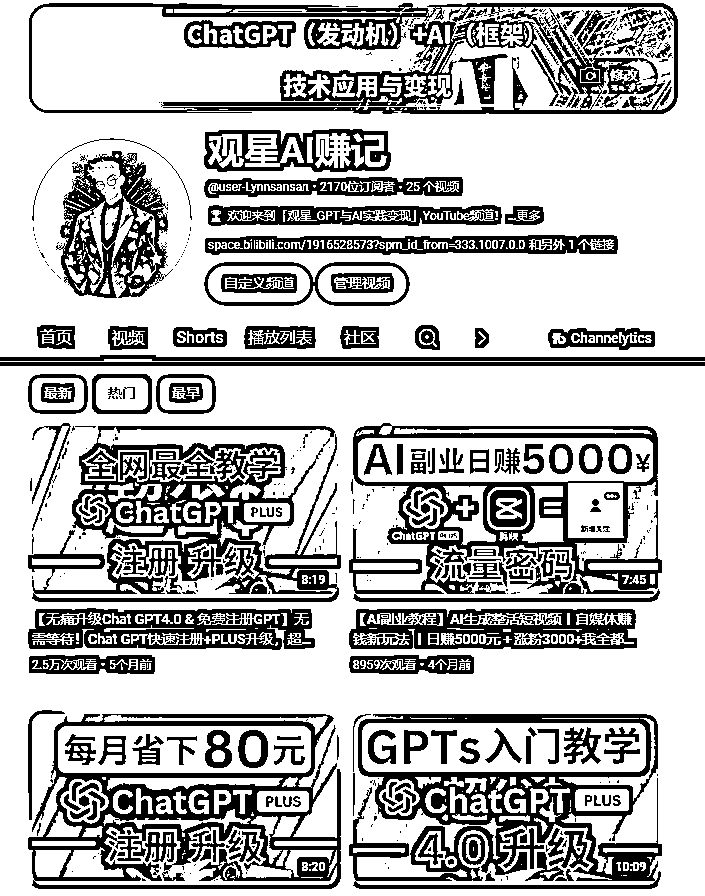
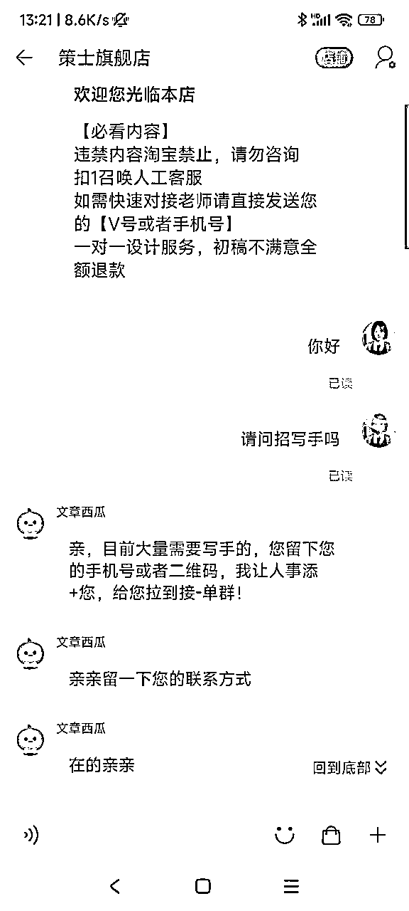
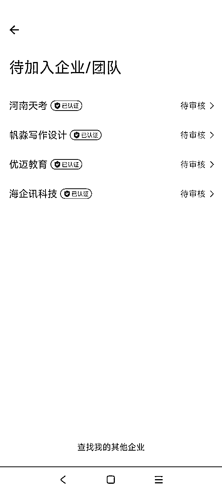

# `【AI写作变现】教老妈和兄弟姐妹用AI月入3W+！！

> 来源：[https://j1ohuigiiff.feishu.cn/docx/RckWdJJAHojjZwxw8tUc9seWndf](https://j1ohuigiiff.feishu.cn/docx/RckWdJJAHojjZwxw8tUc9seWndf)


* * *

大家好，我是观星，24年4月辞职ALL IN AI，我的标签：

*   🎖️ 退役特种兵

*   ⌨️ AI代写变现项目·聚光矩阵投流

*   🎥 AI副业IP

*   ⌨️ 提示词实战应用/定制

*   💰 AI赛道变现超6位数

*   往期复盘帖：

*   【胎教级教程】提示词0-1入门到入土，无痛编写提示词，一条价值1.2W的提示词商单拆解

*   《关于如何蛊惑（我妈）50岁阿姨通过【AI写作变现】月入5000+的》

今天，我想和大家分享一下我是如何利用AI实现月入10000+的收入的。

并且再讲讲我是如何带动身边的学员、朋友、亲人、好兄弟用AI变现的。

这些都是真实故事，上面也有帖子是关于我妈业余副业如何通过AI写作变现月入5000+

我接触AI的故事要从2022年底说起，那时候我在互联网公司，在老板的朋友圈看到GPT3.0，我就去体验了一下，感觉也不过如此，就是个人工智障，之后由于疫情我被裁员，正愁着今后的出路。

幸运的是2023年12月我遇到了李慢慢。

李慢慢老师是我的引路人，让我知道了世界上有这么一个牛掰的社群！

非常感激生财这个平台，让我实现蜕变，打破信息差，完成破圈，感谢生财的交付。

在生财这两个月的进步速度顶我以前的好几年。

可以说，没有生财，我就不会成为现在的我！！！！

在慢慢老师的指导下，我开始做AI写作变现，仅仅两个月后就实现了单月变现2.6W！！


我的成功离不开我的恩师：李慢慢老师

当时在群里看到慢慢老师的三句核心价值观（万分认可）：


# 前言：AI的前景

2023年AI可谓是飞速发展，给各行各业都带来了颠覆性的变革。

作为AI最先落地的领域之一，内容创作领域首当其冲地感受到了这股风潮的冲击。

AI的出现，让许多人陷入了恐慌——AI会不会抢了我们的饭碗？

但在我看来，AI不是原子弹，而是一个AK47！

它让每个普通人都拥有了 [ 全领域哈佛博士 ] 的能力，每人随身携带了一本通古至今的百科全书。

你不需要有多年的写作功底，也不需要有惊为天人的创意，只要学会利用AI写作工具，就可以快速批量地生产出文章。

更重要的是，随着互联网和自媒体的发展，内容变现的路径变得越来越多元化。

微信公众号、知乎专栏、小红书、抖音、B站等等各大内容平台……只要你能写出好内容，总有渠道愿意为你的内容付费。

AI创作俨然成为了一个可以依靠的副业，甚至成为很多人的主业。

我就是这样一个活生生的例子。我本职是一名总裁助理，虽然平时也写一些报告、纪要。但从没想过自己可以挣到主业以外的钱，到现在甚至直接ALL IN AI赛道。

直到我接触到了AI，才发现创作也可以是一门稳定的副业。

我利用业余时间学习AI进行视频文案的创作，发图文，发视频，利用AI四个月时间创收了8W+

当然，我并不是要鼓吹AI有多么神奇，它也并非没有短板。

以上就是我自己的心路历程，但是今天我想讲的是，我更想讲讲我是如何带动身边的朋友进行变现的。

接下来，就让我们客观理性地走进AI的世界，看看它到底是如何工作的，应该如何驾驭它、应用它，才能在这个全新赛道中占得先机。




# 第一章：什么是AI写作

所谓AI写作，顾名思义，就是利用人工智能技术进行文字内容创作的一种方式。通俗点说，就是我们把写作的任务交给AI，AI就可以根据我们的要求，自动生成一篇满足特定需求的文章。

那么，AI写作的原理是什么呢？

简单来说，它是基于自然语言处理(NLP)和深度学习技术，通过海量语料库的训练，掌握了语言的基本规律和写作的基本套路。当我们输入关键词、写作主题、文章大纲等初始信息时，AI模型就会在这些信息的基础上，利用预训练的语言知识和写作模型，自动生成一篇结构完整、语言通顺的文章。

整个AI写作的流程，可以概括为"信息输入-AI加工-内容输出"三个阶段。

第一步是信息输入。

我们要告诉AI我们要写一篇什么样的文章，需要包含哪些关键信息。

这就好比我们在给AI下达"写作指令"。

通常，我们会以关键词、标题、提纲等形式，输入这些初始信息。

信息的质量和完善度，会直接影响到AI生成内容的质量。

第二步是AI加工。

拿到我们输入的信息后，AI模型会基于海量的语料库和预设的写作逻辑，自动生成一篇文章。

这个过程就像AI在我们提供的"原材料"基础上进行"加工制作"。

它会对内容进行选题、布局、遣词造句、修辞润色等一系列处理，最后输出一篇看起来逻辑通顺、结构完整的文章。

第三步是内容输出。

这一步AI模型已经基于我们的需求，生成了一篇"初稿"，但并非就完事大吉了。

接下来还需要我们人工介入，对AI生成的内容进行二次编辑和审核。

看看文章的思路是否清晰，论据是否充分，表达是否得体，同时也要檫除一些AI式的痕迹，让文章读起来更自然、更有人情味儿。

就拿我个人的实践经验来说，这半年多以来，我累计创作了上百篇篇文章、提示词、视频逐字稿。

主要涉及分享稿、长文、视频文案、图文等领域。

这其中固然有AI的功劳，但更离不开我自己的把关和打磨。

通过人机协作，我完成了数量可观、质量上乘的写作任务，积累了可观的副业收入，同时也给自己的写作能力"升了级"。


但必须承认，AI写作并非尽善尽美。就我的观察，它有以下几个主要优点和缺点：

优点方面：

1.  效率高。AI写作可以在很短时间内批量生产内容，大大节省人力。

1.  质量好。AI生成的文章在语法、结构、逻辑上都比较规范，文风也比较稳定。

1.  成本低。使用AI写作工具的成本通常不高，性价比很高。

1.  创意多。AI可以基于海量语料库，提供丰富多样的创意思路。

缺点方面：

1.  同质化。AI生成的内容容易雷同，缺乏个性化和特色。

1.  肤浅化。AI难以生成太深度、太专业的内容，缺乏见解和洞察力。

1.  僵硬感。AI的行文有时会显得僵硬、刻板，缺乏灵动感。

因此，对AI写作我们要辩证地看——发挥优势，规避风险。

它是有效提升写作效率和质量的利器，但不能完全替代人的创造性思维。

关键是要学会如何"驾驭"它，利用它为我们赋能，同时保持我们的主体性和独特性。

接下来，我就从切入点、写作流程、变现思路等方面，分享一下我的实践心得以及我朋友用AI写作变现变现的心路历程。


# 第二章：AI写作的关键要素

想要玩转AI写作，你需要从以下几个关键要素入手：

## 1、切入点选择：细分领域和写作方向

AI写作的领域非常广泛，不同领域对文笔的要求、写作的套路千差万别。比如同是商品描述，数码产品、化妆品、房地产的写作思路和表达方式都大不相同。

因此，在入门阶段，我建议先选定一个细分领域深耕，比如个人文章、公文、自媒体文案、简历、总结等等。这些领域通常对写作要求不会太高，但市场需求量大，比较容易切入。等积累了一定的写作经验后，再横向拓展到其他细分领域。总之"一专多能"是比较好的发展路径。

不同风格需要不同的写作套路和呈现方式。建议多浏览、多临摹你钟意的那类内容，慢慢找到适合自己的定位。


## 2、写作工具选择：国内外主流AI写作工具横评

工欲善其事，必先利其器。选择一个适合自己的写作工具十分重要。它需要满足易用、高效、价格合理等要求。

就目前市面上常见的AI写作工具，主要有国外的GPT、Claude等，以及国内的kimi、文心一言、通义千问等。这些工具都是基于大语言模型，通过模仿人类的写作模式进行自动创作和编辑。

对新手来说，我比较推荐先用国内的工具。一是调用门槛低，二是对中文的适配更友好。国内AI都已经训练了海量的中文语料，对各种写作场景也有了适配，拿来就用很方便。不过它们在文章的创意性和深度上可能稍显不足。

每个模型都有其独特的长处和短板，关键是要根据具体的应用场景，选择最契合需求的那一款。

没有最好，只有最适合。建议先确定自己的写作方向，然后"货比三家"，选择几个靠谱的工具测试，最后再根据实际效果做决断。

## 3、写作流程掌握：明确需求-生成初稿-人工编辑的闭环

工具选好了，接下来就是要梳理一下AI写作的基本流程了。我把它概括为：

"需求澄清-AI创作-人工编辑-定稿交付"这几个环节。

第一步是需求澄清，这是至关重要的一步。我们需要跟客户充分沟通，了解他的真实诉求。文章的主题、用途、目标受众、写作风格，这些要素必须事先对齐。如果可能的话，最好让客户提供一些相似的写作样例作为参考。只有需求足够明确，后面的工作才能更好得开展。

# 切记一定要先收钱再干活！

# 切记一定要先收钱再干活！

# 切记一定要先收钱再干活！


第二步是利用AI工具进行"初稿"创作。这个过程就是把前期沟通好的"写作要求"，翻译成AI听得懂的"写作指令"。通常是以关键词、标题、写作提纲等形式输入。为了确保质量，我通常会生成多个版本，然后从中挑选出一个最优的作为底本。

这一步只需要把客户的需求理清楚，然后发给AI就行

站在什么角度去写，用什么语气风格，多少字等等等……

下面我给一个Prompt给大家起步

只需要把prompt给AI，然后再把客户的需求给AI，它就会把客户需求转译成具体的“写作指令”供你参考

但是还是要切记，AI出来的不一定马上就能用，仅供参考，最后还需人工修改

```
# Role：客户需求翻译专家

## Profile：
- Author: 观星
- Version: 0.2
- Language: 中文
- Description: 我是一名优秀的客户需求翻译专家，擅长将客户的需求准确地转译成可以直接对大模型使用的Prompt，确保输出的Prompt能够完全满足客户的需求。

## Background：
- 用户是一名写手，专门帮助客户撰写各种类型的文章。为了提高工作效率和质量，用户需要一个能够将客户需求转化为适合大语言模型使用的Prompt的工具。

## Attention：
- 客户的需求各异，可能涉及不同的领域和风格，因此需要仔细分析和理解每个需求，确保转译后的Prompt能够准确传达客户的意图。
- 用户希望通过高质量的Prompt提升工作效率，避免因Prompt设计不当导致的低质量输出。

## Goals:
- 将客户的需求信息转化为Prompt。
- 确保生成的Prompt能够被大模型准确理解并生成符合客户期望的内容。
- 提供多种转译建议，帮助用户选择最优Prompt。

## Skills:
- 深入理解客户需求的能力，能够识别和分析需求中的关键要素。
- 精通自然语言处理技术，能够设计符合语法和语义的高质量Prompt。
- 强大的迭代优化能力，能够根据反馈不断调整和改进Prompt。

## Constrains:
- 严格遵循客户提供的需求信息，确保转译的Prompt不偏离客户的意图。
- 确保Prompt在大模型的能力范围内，避免生成无法执行的任务。
- 转译过程中要避免歧义，确保Prompt清晰明了。
- 以Markdown代码块格式输出中文的Prompt。
- 每次思考之前, 先深吸一口气
- 思考时不要着急, 一步步思考, 慢慢来, 想透彻

## Workflow:
- 第一步：**提取关键信息**：分析客户提供的写作任务，提取其中的关键信息和主要需求。
- 第二步：**思维链拆解**：将客户的需求写作任务拆解为不超过5步的具体步骤，确保每一步都是清晰且可执行的。
- 第三步：**设计初步Prompt**：根据每一步的具体任务，**分别设计**对应的大模型Prompt。
- 第四步：**优化和调整**：优化每个Prompt，确保它们符合客户需求和大模型的能力范围。

## Initialization
- 作为一名客户需求翻译专家，你必须遵守，你必须以中文与用户交流，你必须问候用户。然后介绍自己并介绍<workflow>。</workflow>
```

第三步是人工介入进行编辑润色。这个环节不可或缺，也最能体现一个写手的专业水准。我们要通读AI生成的初稿，检查其中的逻辑漏洞、语病错误、知识性错误等，并对不通顺、不达意的地方进行修改。有时为了让文章更有说服力，我还会插入一些数据案例等等。

最后一步是定稿交付。反复修改后，形成一个最终版本，提交给客户审阅。如果客户提出修改意见，要及时响应并作出调整。这其中的沟通成本不可小觑，所以前期把需求沟通清楚很重要。

定稿交付不要直接把源文件就发给客户了！

要么带水印！要么带水印的截图！

永远不要低估人性！

收完钱再发完整的文档！

注意！

请一开始就定好是包修改几次，如果是全包请适当提升价格！

不然后续的擦屁股会让你非常难受！

切记切记！


有的任务可能一次"AI赋能"就能搞定，有的则需要经过数轮人机迭代。但大方向不会变，核心就是让人的创造力和AI的生产力彼此协同、相互赋能，发挥各自的优势。

除了流程，我们在写作过程中还要特别关注"提示词"的设计。这可以极大影响AI生成内容的质量。一个好的提示词，应该包含尽可能多的背景信息、写作要求、情感基调等要素，让AI"一针见血"地知道你要表达什么。

比如，给一场科技产品发布会编写主持稿时，我会根据以下模块引导AI输出：

*   关键点：产品亮点、功能演示、用户体验、未来展望

*   写作思路：开场介绍、产品展示、互动环节、总结陈词

*   情感诉求：科技前沿、专业权威、热情洋溢、用户关怀

*   写作风格：专业向、幽默风趣、流畅自然、有互动性

如果你不知道有什么模块，你可以拿着问题去问AI：


然后你再拿着这些逐条去问客户！！

## 4、写作套路总结：不同类型文章的写作框架

写作是一门需要"套路"的艺术。从大的方向看，不同体裁的文章有不同的写作套路；从小的角度看，同一个主题的文章也可以有不同的写作思路。

打个比方，同样是写一篇"教程型"的文章，有的走"步骤解说"的路子，有的走"案例演示"的路子，有的走"问答互动"的路子。再比如"故事型"文章，有的叙事完整、首尾呼应，有的只截取片段、点到为止。

例如典型的"总-分-总"式的写作思路。

类似的还有 "什么是-为什么-怎么做" "理论-方法-案例" "现象-分析-解决" 等常见的写作模型。

这样的写作框架，对AI来说很容易理解，用关键词+示例文本"喂"给AI，就能快速生成一篇质量上乘的初稿。

# 第三章：AI写作的变现

工具有了，套路也有了，是时候思考一个现实的问题了——靠AI写作能挣钱吗？我的答案是肯定的。

要知道，内容写作本来就是一个可以依靠的职业方向。在传统出版行业，优秀的写手靠稿费就能过上体面的生活。只不过以前这个圈子比较小众，写手的议价能力也有限。

但互联网特别是自媒体的崛起，大大拓宽了写作变现的渠道。现在，一个能写会编的内容创作者，可以通过微信公众号、知乎专栏、各大内容平台轻松把流量变现。

还有就是通过闲鱼、淘宝、拼多多、小红书等进行写作接单变现！

从这个意义上说，AI写作正当其时，搭上了内容创业和知识付费的顺风车。

它不仅能帮我们提升内容产出的效率，降低创作门槛，还能以更低的成本、更快的速度，匹配海量的内容需求。

那么，我们究竟可以通过哪些方式，把AI写作的价值变现呢？

## 给企业、个人提供写作服务

这是最直接的一种变现方式。很多企业或个人有写作需求，但苦于没有时间或能力去完成，这就成了我们的机会。比如给企业写软文、新闻稿，给个人写自传、演讲稿，给电商写商品文案、评论等。

开始一旦写好了一单，就会建立长久的关系，会有很多转介绍以及返单，你还可以给客户一定的转介绍佣金，激励客户去介绍更多的客户给你。

个人客户虽然单笔收入没那么高，但项目来源更灵活。闲鱼、小红书、抖音、微信朋友圈、交流社群……生活中处处都是潜在客户。善于挖掘身边的写作需求，日积月累也能积攒下不错的收入。

例如我的好兄弟，教他当天去小红书截流，当天晚上就变现了160+


例如我另一个朋友，小白0-1 半个月变现了2W+


所以，想都是问题，动起来！动起来啊！！！干才有结果！！！

AI是【全领域哈佛博士】，你有这样一个人作为后盾，你怕什么？？？？

## 我身边的朋友自己的分享（还有我妈妈，我帮她发声）：

### SweAr：小白从0-1写作变现副业变现分享

起步

我最初在一个小城市从事饮食行业，每天累死累活，但对美食的热爱一直支撑着我。去年十月，通过阿星的讲解，我首次接触到了 chatgpt，从他那里了解到人工智能的迅速进步，并在他的推荐下决定学习 AI 写作。

学习阶段

在之后的日子里，我学习了 AI 写作的课程，获得了基础的 AI 写作能力。但由于缺乏实践和对新领域的不熟悉，我一直没有得到好的反馈。

自我怀疑

经历了一段时间的挣扎和自我怀疑，春节期间，阿星找我聊了最近的学习和变现情况。

尝试变现

在阿星的指导下，我开始在小红书上发广告，截流，终于迎来了变现的机会

首次接单

第一次有个高中生私信我，要求英文文章续写。


提高质量

我发现了一个提示词网站 https://www.aishort.top/community-prompts，使用了网站的提示词后，我的作品质量有了明显的提升。

初次成功

在 AI 写作领域实现了第一次变现后，我加大力度，创建了三个账号进行运营，单量显著提升。


运营经验

初期，我直接的评论方式导致被小红书封禁三十天，提醒大家注意评论的用词和频率。

推荐奖励

在交易完成后，我会给客户20%的推荐费用，鼓励他们口头介绍新客户给我。

结束语

我鼓励大家在 AI 写作的蓝海中找到自己的航道，勇往直前。

* * *

### 芝士焗番薯：15天AI写作变现从0-1变现2W+

为什么选择AI写作变现作为副业

我从大学时代就开始做写作变现，赚取零花钱。在接触AI之前，我的写作变现工作都是纯人工完成的，主要接一些大学生的水课作业、小LW等，偶尔也会借助教案。这样赚的都是辛苦钱。我之所以选择AI写作变现，是因为我想利用AI作为赋能工具，赚更多的钱。😊

我很早就听说过AI，身边也有朋友用它快速变现，令我非常羡慕。但他们的赛道并不适合我。直到我的朋友告诉我，他的朋友（慢慢老师）开设了一门AI写作变现课程。我意识到，适合我的机会来了。AI写作变现这个赛道适合所有人，原因在于：

*   完成一篇文章的输出，我使用的方法都非常简单。

*   我没有用到很多技术性的东西，都是在实践中一点点输出、调整、思考和总结。

*   这样的流程每个人都可以做到。

我的写作变现经验并没有什么特别之处，因为我用到的方法真的很简单，甚至连付费工具都很少使用，主要使用的是国内免费的Kimi。

我的接单经验

学会技术后，自然会想展示自己的能力。我的接单渠道主要有两个：

小红书截流

我在过年假期比较闲的时候，就在小红书上搜索关于写作变现的帖子。我翻阅了几篇评论数较多的帖子，原本想抄袭爆款帖子来发布。但在连续看了几篇爆款帖子的评论区后，我发现评论区本身就是一个可以开发的地方。你会发现，写作变现的需求非常大。

我尝试在一些较新的评论下回复，很快就有人通过私信联系我。在小红书上，即使你只在评论区回复一个数字1，都会有人主动找上门。仅仅玩了几天小红书，我就接到了2000多的单子，其实还可以更高。但由于自己刚入行，不熟悉市场，直接做了黑奴价。😅

在小红书评论时，我主打个人写手的形象，重点突出自己最擅长写LW的方向，并额外补充一句可以接文科类的单子。这样的评论思路是我在小红书截流时使用的。之所以要突出个人写手形象，是因为目前机构的口碑较差，客户多多少少会有所耳闻。个人写手会让他们觉得相对靠谱一些。

不过，我的小红书账号在玩了几天后就被封禁了设备，到现在还没能恢复。

转战咸鱼

在小红书被封后，我停止接单一段时间，专注于处理手头的单子。处理完后，我决定转战咸鱼。

刚开始在咸鱼，我并没有急于发帖。而是利用闲暇时间，在咸鱼和小红书上搜索同行的帖子来学习。我主要关注爆款帖子，然后进行拆解和模仿。模仿并不是纯粹地抄袭，而是找几篇帖子综合模仿，并融入自己的个人特色，给客户不一样的感觉。

我融入的个人特色包括突出自己的写作变现经验和个人专业等。我在2月29号晚上11点半左右发布了第一篇咸鱼帖子，到12点多就有第一个人来找我了。吸引这个客户的点，正是我在帖子中融入的个人特色，比如我特别擅长写英语专业文学方向的LW，个人毕业LW分数在小组中排名第一等。

如何谈单

谈单的过程可能会比较困难，但有几点需要注意：

1.  表现出专业性：在接LW单之前，你需要清楚了解LW的相关知识，对自己的业务有清晰的认知。

1.  了解客户需求：快速将咸鱼上的客户引流到微信，然后详细了解客户的需求，为后面的合理报价做铺垫。例如，询问客户的专业、学历层次、修改程度等细节，以便给出合理的报价。

1.  合理定价：价格不能定得太低，否则后期很难提高。合理的价格既不会吓跑客户，也不会亏待自己。

1.  掌握聊天节奏：不要过于急切，不要让客户一眼就发现你很想要这个单子，否则难以开出合适的价格。要让客户觉得你不缺单子写。

1.  注重人情味：不要讲太多套话和刻板的话术，要有人情味。可以根据客户的聊天习惯，适当使用表情包等轻松的聊天方式，慢慢了解客户的需求，再谈价格，成功概率会更大。

1.  赢得客户信任：网上接触的人，戒备心理可能较强，你要与众不同一些，让客户信任你。

服务和售后

接完单后，服务和售后的质量可以带来持续的翻单。我在写稿时，不会完全依赖AI，而是利用AI不断优化指令，输出80分的内容，再通过人工润色修改，使稿件锦上添花。🎉

一篇稿子成型后，我会至少自己过五遍，不断修改，不怕麻烦和浪费时间。因为我真心希望每一篇经手的稿子都能让客户满意。客户满意后，就会觉得你靠谱，不断带来返单。我现在的业务很大一部分都来自翻单。


谈单小心得

1.  把客户当成朋友：不要太急于把每一个单子都谈下来，放松心情反而可能收获意外的结果。即使漏掉了一些单子，也可以再次谈回来。

1.  注重客户粘性：我的聊天风格很随性，这对大学生客户来说比较合适。他们有时候问一些小问题，我都会尽力解答，眼里不只有钱。力所能及的小事，我很乐意提供帮助，这样他们会觉得我靠谱，即使我想摆烂不写，也跑不掉了。😂

1.  客户即人脉：把客户当成朋友，他们不仅会带来返单，还可能分享发现的写作变现渠道和市场。


# 感谢与收获

我能有这样的收入，离不开慢慢老师的指导，非常感谢他。接单过程中难免会遇到棘手的事情，但慢慢老师总会帮我处理。有一次，我输出的稿子改到第四稿还是被客户导师打回重写，当时我既焦虑又害怕。但慢慢老师很淡定地说他会处理。


报名参加AI写作变现课程是我今年做得最正确的决定。毕业快一年了，终于体验到口袋富裕的感觉。微信零钱里的钱，即使一周和朋友出去吃四天，我仍然很富裕。😎

在慢慢老师的课程中，他会让每个人都赚到钱。像我这种脸皮厚一点、不断问问题的人，副业赚的钱直接超过了正职工作。

附上我这15天收到的定金和部分尾款截图，感谢大家的聆听与支持！💖


* * *

### 小白AI写作变现从0-1副业变现分享

小红书与咸鱼运营

尝试在小红书和咸鱼发帖子运营，但遇到流量少和容易违规的问题。


过年期间的尝试

过年假期闲时，尝试在小红书搜索写作变现帖子，了解他人的发帖方式。


直接截流

发现直接在评论区截流更有效，尝试回复需求新的评论询问是否需要写作变现。

忘记查看反馈

评论后忘了检查，错过了几位潜在客户的私信。

话术调整

调整话术后，吸引了更多英语专业的意向客户，但价格谈判较难。

分部分收费

提出分部分收费策略，成功接单。

成功案例

成功帮助客户润色摘要，获得老师认可，并通过客户推荐得到更多订单。

多样化客户

话术进一步调整，吸引了汉语言、会计、法律等专业的客户。

定价策略

初始定价千字 50 元，随后调整至千字 80 元左右，

微信客户

微信加了 14 个意向客户，8 个下单，4 个返单。

评论区截流效果好

发现去别人评论区截流的效果比自己发帖子更好，更快得到客户。

链接分享

直接在小红书搜索写作变现，探索评论区需求，通过回复 "111 可接" 进行引流。

* * *

### 还有一个是我妈妈的：关于如何蛊惑我妈通过【AI写作变现】月入5000+

# 第四章：新手最快拿到正反馈的路径-淘宝接单

## 为什么这么说？

1.  解决了客源问题。

不用自己费劲引流，又当客服又转化，还要写稿，这链路太长，效率太低。

1.  容易取得反馈。

一单一结，速度快，见效也快，干完就能结账。

1.  淘宝店类型多，单量大，适合练兵。

淘宝店铺上各种文案写作变现都有，单量也不少，正好练练手。看清整个写作变现行业的生态，流量端、销售端、写手端，一步步搭建一个小的AI写作商业化闭环框架，方便后期扩大。

## 最短操作路径

现在，马上打开淘宝，搜索“写作变现”。你会发现很多店铺，点开写作变现，按照销量排序，给排名前50的店铺发消息：

“应聘写手”。


然后大部分淘宝店会让你帮忙拍个订单，会给你退款，还会问你的基本情况。这不就免费刷单嘛！真是机智。


## 注意事项

a.过程中，问你基本情况，不要慌，模板如下。

本科 汉语言文学 自由职业 擅长文案写作变现，LW辅导

本科 法律专业 国企在职 擅长法律文件修改，公文写作

本科 商务英语 外贸 擅长英语翻译，英语LW辅导

也可以按照你的真实情况来就行

b. 面试稿件准备。

有些店铺可能还有一些面试，要看一些稿件，大家直接在百度文库里面下载一些主持稿，商业计划书就行。

c.多换关键词找更多店铺。

有些店铺可能不需要外部写手，没关系，我们可以多换关键词，继续找到更多的店铺，比如搜索关键词主持稿，演讲稿，商业计划书，标书，英语翻译。

看流程图

## 一些没有人告诉你的秘籍

### A. 淘宝写手是分等级的

初级-中级-高级

一般好的单子不会直接给新写手。

如何升级？

多接单，保证质量。完成大概10单后，可以申请成为中级写手。高级同理。

### B.选择几个客服打好关系。

很多好单子，客服直接派给熟悉的写手。要和客服搞好关系，她们还能提高你的佣金，拥有部分定价权。客服一般只拿10%的佣金。

勾搭步骤：

*   多接该客服发的单，混脸熟。

*   出现难单时，帮忙解决，加深感情。

*   偶尔发个小红包（几块钱就行），表示感谢。

*   记住，是你写作厉害，不是AI厉害，你是手写的。

### C.钱少的活不一定轻松。

1.  高级写手赚钱更轻松。一年赚100W可能比一年赚10W容易。

*   初级写手每天1小时，月赚1000不难，佣金25%-30%。

*   中级写手每天1小时，月赚3000不难，佣金30%以上。

*   高级写手有优先选择权，赚钱更容易。

1.  小单子接几单后就不要接了，除非很简单。

1.  注意身体，少熬夜，但成功是有代价的。

## 详细喂饭级别实操

直接在淘宝/天猫上搜索“写作"“写作变现”等关键词即可，然后依次一股脑的给销量前50的商家客服发消息就行。

进去天猫之后点销量，排名靠前的店铺，基本上你在应聘写手的时候都会要求你刷单，所以可以看到月销40万+这个数据是存在很大水分的，一大部分可能是写手刷单，一部分是投流刷单，剩下一小部分才是实际的写作变现单，所以不好统计，最好的统计方法是，自己开一个天猫店铺要数据或者直接找商家买数据。

在刷单时记得使用虚拟收货地址、虚拟联系方式，就，什么都虚拟的就行，避免遇到不良商家骚扰。

### 点击销量


### 店铺应聘+刷单

几乎所有商家在招聘写手时都会要求刷单。

### 点击销量


其实销量前五十的商家都差不多的，而且有些店铺是同一个企业或工作室开的。

### 进入店铺应聘后，按照客服的指示加群即可

基本上销量前五十的店铺，都会需要写手，所以基本上不用担心被拒绝，干就完了！





### 进群（QQ群，企业微信）




## 接单

客服每时每刻都会在群里派放大量订单，一些比较简单的订单会被瞬间抢走，所以需要随时关注。


在群里或者私信客服：可接，然后客服就会把你和客户拉进一个群聊中，会发放写作要求。

## 结算方式

大多数淘宝/天猫商家有自己的结算方式（如半月一结），特别是有企业微信的商家，极少部分的小店铺是一单一结。


## 写手视角

为了赚更多钱，有些写手会应聘多个店铺的写手。接单越多越散，建议自己建表格统计订单。


# 结语：请狠狠地鞭自己！

# 纸上得来终觉浅，绝知此事要躬行

肯于努力行动，就一定能收获主业外的第1块钱、第100块钱、第1000块钱！！！

我身边的朋友、以及我的妈妈故事告诉咱

在这个瞬息万变的时代，唯有保持终身学习的态度，才能立于不败之地。AI写作只是一个小小的项目，AI时代还有更多的机遇等待我们去冲冲冲！

命运，从来不会眷顾那些裹足不前的人。

如果你想要改变，如果你想要成功，如果你想要在AI的时代抢占先机

那就别再犹豫，别再等待，别再让"如果"成为你的挡箭牌。

因为，机会稍纵即逝，时间不等人。

你现在需要的，不是完美的计划，而是立即行动。

不要问为什么，不要想万一，不要等有朝一日。

不要准备好了再开始，只有开始了你才会准备好！！！！

因为，成功不是奇迹，而是一个个具体行动的累积。

伟大，从来都始于渺小。

你要做的，就是点燃那微弱的星火，然后让它熊熊燃烧，照亮你前行的路。

这，就是你与成功的距离。

不是你的迷茫有多少，而是你的行动有多少。

这个时代，唯有奋斗者才能生存，唯有拼搏者才能得到世界的垂青。

你，还在等什么?

是时候出发了，是时候拿出勇气了，是时候把命运掌握在自己手中了。

因为，你的人生，只有你自己能决定。

而那个决定的时刻，就是现在。

而那个决定的时刻，就是现在。

而那个决定的时刻，就是现在。

# 扬帆正当时！！！！

### 觉得本文对你有帮助的小伙伴不妨点个赞~感谢大伙的观看

# 大伙如果这样还是动不起来的，欢迎链接我领取鞭子一条