# 从单篇合作60元到3000元，做知乎实现小家电自由的实操经验分享

> 来源：[https://o0sapbae55.feishu.cn/docx/JzFzdJ7whofLvdx2MiZcNsbYnDe](https://o0sapbae55.feishu.cn/docx/JzFzdJ7whofLvdx2MiZcNsbYnDe)

大家好，我是陈知意，一个全网12W粉丝的全职自媒体人，深耕公众号、知乎、小红书平台。

我从2022年9月开始做知乎，23年的时候开始带学员做知乎变现，一开始只是带大家在知乎实现初级变现，也就是参与门槛很低的活动薅羊毛，做了个初级课程，学费百元，70%学员都赚回了学费，有几位勤奋的学员更是变现了2000多元。

今天我也会给大家分享这个活动的玩法，大家实操一下，门槛很低，收入几元到几十元不等，有些活动还能收到知乎平台的周边产品，我有学员参与这样的活动获得了甄嬛传的周边产品、荣耀手环、知乎各种礼盒等等。

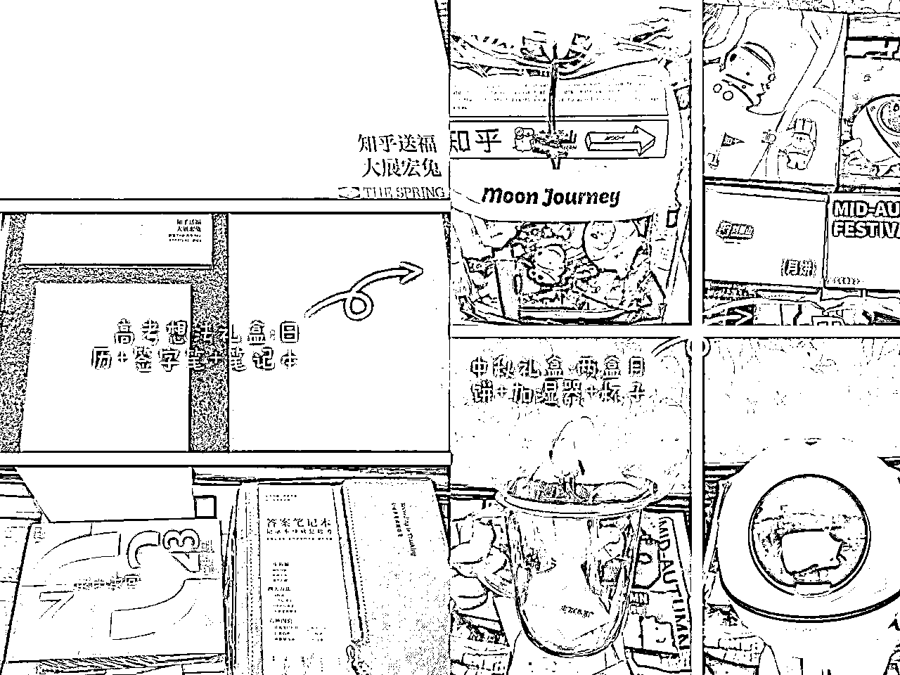

再后来有学员咨询能否跟我学深耕知乎，想做测评博主，于是我开设了知乎高阶变现营，截止到现在，我带的知乎学员总计超过100+，其中30多位学员参与知乎高阶变现营，目前已培养出十来个千粉博主。

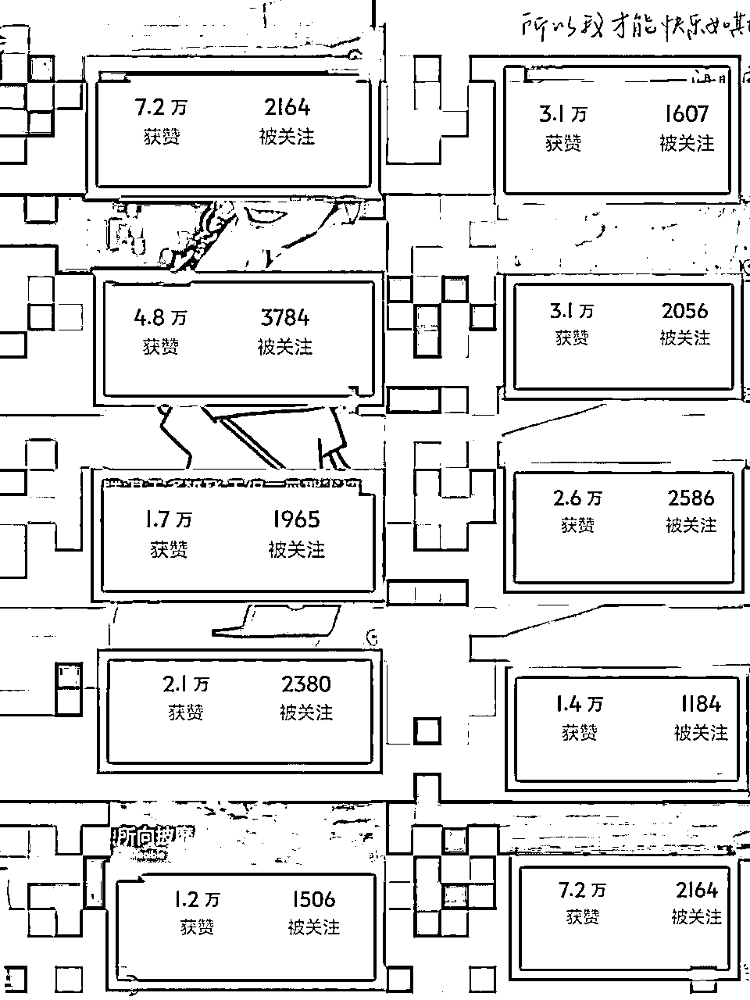

我自己目前知乎矩阵3W粉，收获的稿费+产品价值10W+。从我做知乎博主的实操角度出发，带给大家以下5个方面的分享：

一、知乎有哪些变现渠道

二、做知乎博主涨粉的三个方法

三、知乎有奖活动，答题赚到2500+

四、怎么写一篇种草文章

五、总结

全文6000+字，阅读大概10分钟~

# 一、知乎有哪些变现渠道

说起知乎平台，很多人会觉得，知乎一定需要很好的文笔才能来做，我不会写作，我做不来。

现在是短视频平台快速崛起的时代，知乎曾经是“日活2亿”的图文平台老祖，现在流量是不如从前的，为什么还要做知乎？

我接触知乎平台是在2022年9月，知乎平台是我做自媒体生涯中接触的第二个平台，也是我做自媒体月入过万非常重要的平台。

虽然现在有人唱衰知乎，但它在所有的自媒体平台中，依然是回报率比较高的一个平台。

我的学员一两千粉，接到了价值几百元甚至上千元的产品置换合作，对比其他平台，这个合作门槛的要求没有那么高。

这些是学员接的部分合作，知乎上的产品价值，至少百元起步，低于百元的非常少。

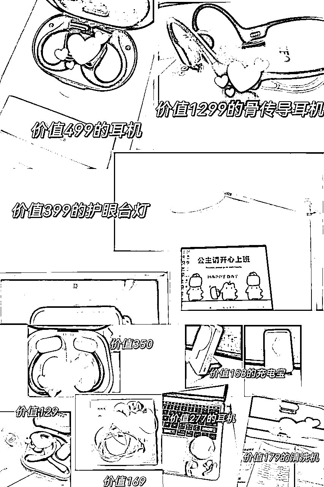

最近快618了，也有学员反馈接到了打包代发合作，1000元稿费，合计下来单篇稿费40元，只需要把对方提供的文案复制粘贴，发布在自己的账号上即可。

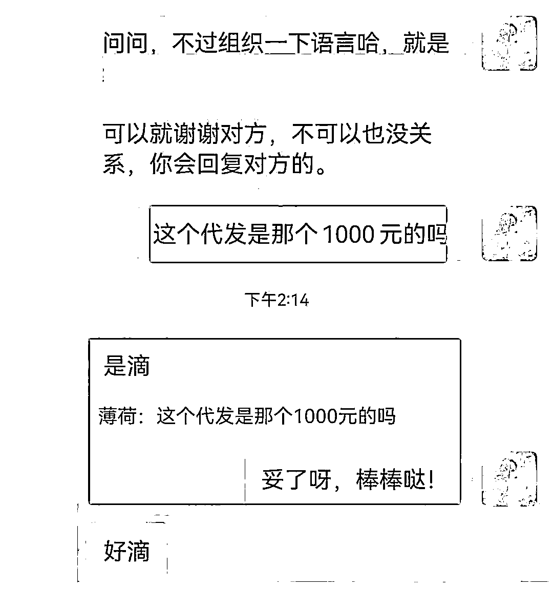

虽然稿费不高，但也确实没花什么力气，只是拥有这样一个千粉知乎账号，和合作的品牌方有联系，就有这样的机会。

我做知乎博主以来，稿费+产品已超过10W，合作过很多大小家电包括：4000多的云鲸洗扫一体机器人、将近3000块的贝氪人体工学椅、爱乐酷3D打印机、airx气熙取暖器、蓝宝破壁机、蓝宝冰雾扇、长帝烤箱、大宇内衣洗衣机、华为海雀摄像头、苏泊尔咖啡机、帅丰集成灶等等产品。

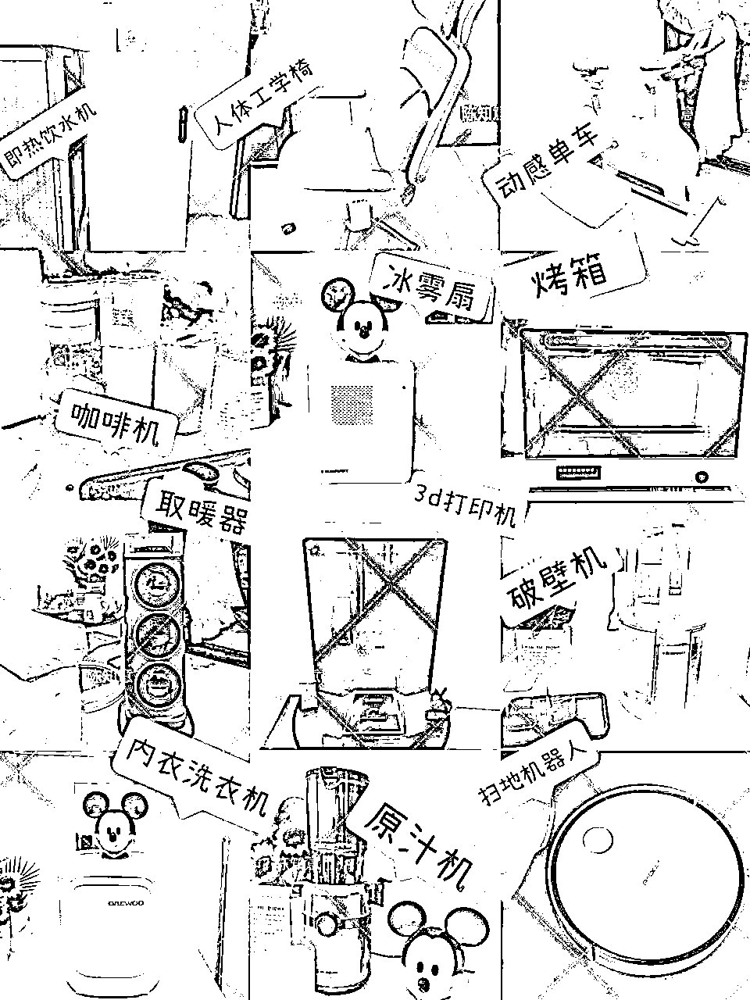

还有各式各样的耳机，价值从100多到一千多都有。

我家去年正好在进行软装，我合作的这些产品包揽了我家大部分家电，基本没怎么为买小家电花钱。

知乎平台的品牌方大多比较大方，合作的产品起步价都是一两百元，很多千元产品。这可不是万粉博主的专属，千粉学员就有不少变现的机会了。

我的千粉学员有变现4500+，接到26个合作，一天接到6个合作的高光时刻。

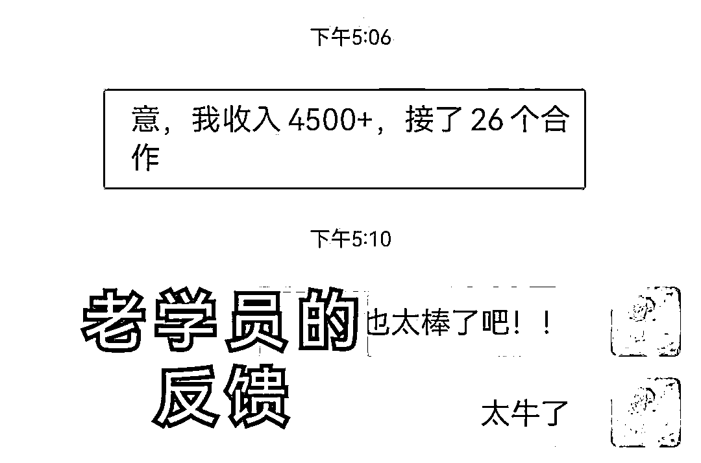

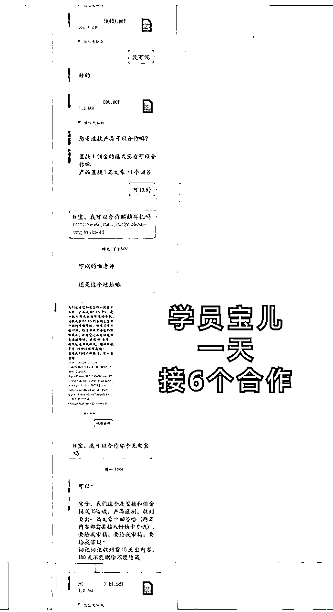

知乎平台的变现方式非常多，比如参加官方活动拿奖励、众测活动、品牌任务、招募任务、好物推荐、知+自选、复用任务、带课文案、盐选小说、赞赏和付费咨询、致知计划、接商单。

我做的主要是【参加官方活动拿奖励】、【品牌任务】、【复用任务】、以及【接商单】、【知乎好物】。

【参加官方活动拿奖励】这个在第三部分会讲，【知乎好物】的玩法会在第四部分说。

先说下【品牌任务】，它是指品牌方在知乎后台系统给你下单，加上联系方式后，品牌方把他们的稿件要求，也就是BF发给你，你按要求写实测/云测产品的稿件，写好后反馈给品牌方，确认没问题后发布在你的账号上即可。

这样的合作稿费价值比较高，之前我合作单篇最高报价1250，现在是3000了，目前也正有一个合作正在接洽中。

【复用任务】是指，品牌方看到你在知乎上发布的过往文章，觉得这篇文章写的不错，跟你沟通在你的文章中植入他的产品文案，按月或者按次支付费用。

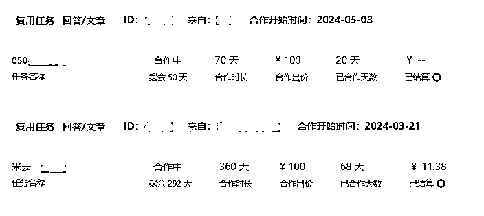

比如我这里就是按次支付，上面金额是100元，不过实际合作金额并不是100元，其他的金额都走私下微信或支付宝或云账户来支付了。

因为复用任务有一定的期限，比如我这个100元，合作期限是一年，就是按月支付，每月支付8元多，如果所有合作费都走平台，对博主来说是不友好的，所以大多数时候会采用这样的方法来合作。

【接商单】说白了，也就是不走知乎平台的合作，品牌方私下找你合作，私下给你支付费用。目前来说，这样做的品牌方还是比较多的。

在这里也坦诚说，有的品牌方合作是稿费形式，有的品牌方合作是赠送产品的形式，那么我们拿到产品写完稿子后可以挂闲鱼上卖掉，也能换成稿费。

我做知乎平台以来，它一直是带给我很大经济收入的平台，我全职做自媒体月入过万，至少有一半收入来源于它。

# 二、做知乎博主涨粉的三个方法

知乎平台的回报率还是比较高的，打造一个千粉账号后，就有机会接到基础的合作，当然，万粉合作大牌产品的机会会更多。

在知乎涨粉的方法很多，其实各个平台的涨粉逻辑，无非出于这三个方面：干货价值、情绪价值、时间价值。

这里举例3种

### 1、分享人生经验哲理

比如这样的人生道理的题目，很多人关注，浏览量也很高。

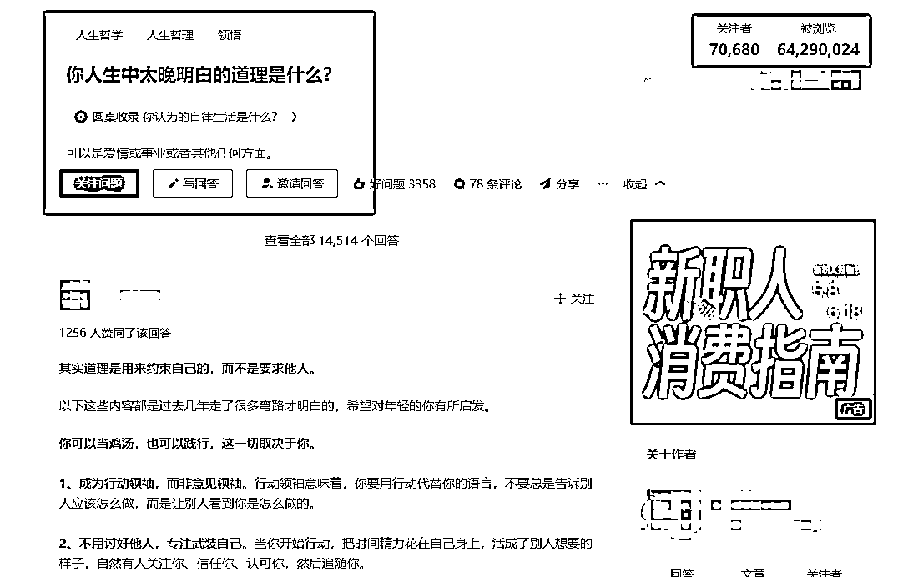

我们可以去其他平台整理一些人生哲理，来回答这个问题，文末注明：侵删致歉。

也可以平时收集一些名人名言的金句，比如罗翔老师、人民日报的金句，整合一下来回答这样的问题。

出高赞之后，你就能享受到一天涨粉大几百上千粉的快乐了。

切记：如果用AI创作，一定要注明是AI生成的，系统会查出来的。

### 2、追热榜，写娱乐明星或者时事

以电脑端为例，打开【创作中心】——【近期热点】还有【潜力问题】里面搜索自己可以回答的问题，一定要快，热榜的热度也不是一直有，所以发现是热榜上的问题尽快回答，才能获得更多流量。

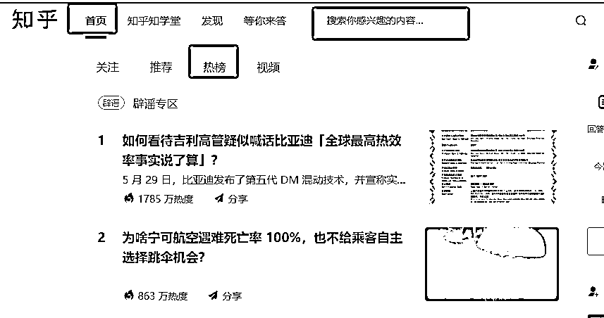

这时做好自己的人设，每篇回答下都带上自己的人设，更容易吸粉。

除了在热榜寻找话题，搜索框也是有热度的问题。具体方法：打开电脑知乎pc端，有一些问题滚动，这也是潜力热榜问题，这类型问题容易得到更多流量，也更容易曝光。

写这方面内容尽量不要太过带入个人情感色彩，避免有人看你观点太过激进招骂（只是提个醒，知乎的整体使用人群素质还是比较高的）

写娱乐明星或者时事方面的内容，在知乎获得的自然流量比较大。

这个方法能涨粉的原理在于： 提供了情绪价值。

### 3、非原创方法

比如说整理分享，在知乎上找到切题的内容，把你整理的内容发布上去，也能获得流量。一定要备注好：图文源自网络，侵删。避免侵权问题。

具体做法：在知乎/小红书上找一些句子/文案的题目，把你整理的内容发布上去，也能获得流量。一定要备注好：图文源自网络，侵删。避免侵权问题。

其实这个方法，在很多平台都是通用的，大家回想一下，看小红书的时候有没有看到这样的发疯语录？流量普遍都嘎嘎好。

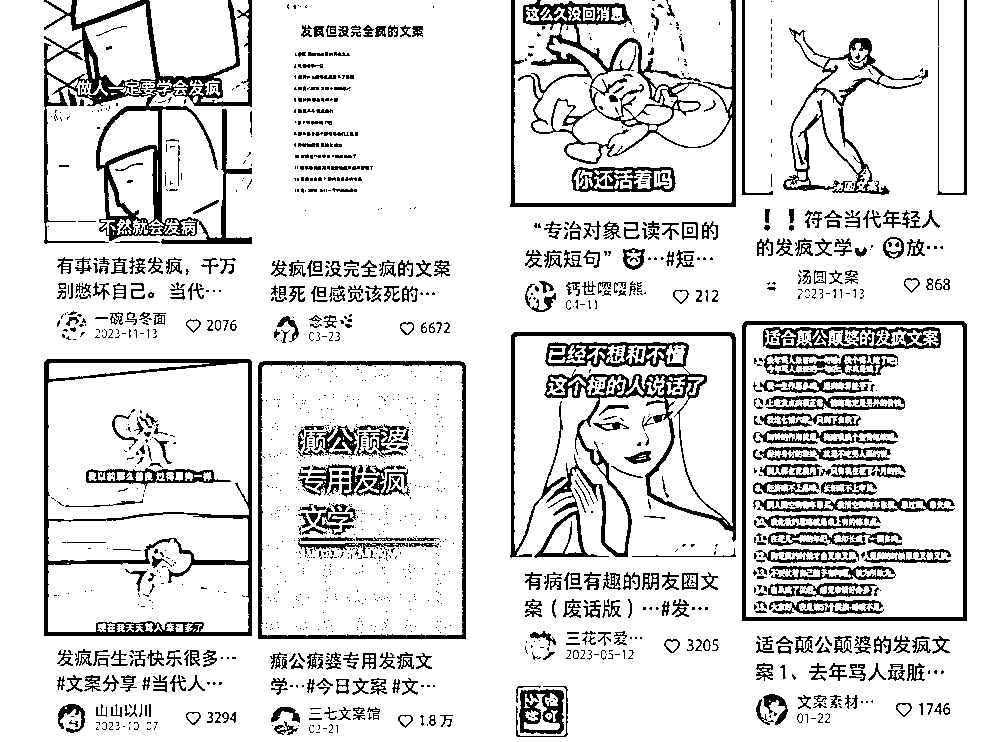

这个方法能涨粉的原理在于： 提供了情绪价值。

无论在哪个平台上，语录/文案，都是自带流量的内容方向。再发散思维一下，在小红书/抖音/快手/微博等平台，这个方法涨粉都是很有效的。前两年有很多人就是靠这个方法在抖音快手上吸粉几十万，上百万的。

最近我也在研究知乎其他的方法涨粉，自己也实验了，效果还不错，其实涨粉方法很多，找到适合自己的，去深耕总能出成绩，重点是要坚持。

# 三、知乎有奖活动，答题赚到2500+

这里给大家分享一下【参加官方活动拿奖励】具体玩法

做知乎，每天回答几道题，变现2500+。看看我们小伙伴获得的成绩~

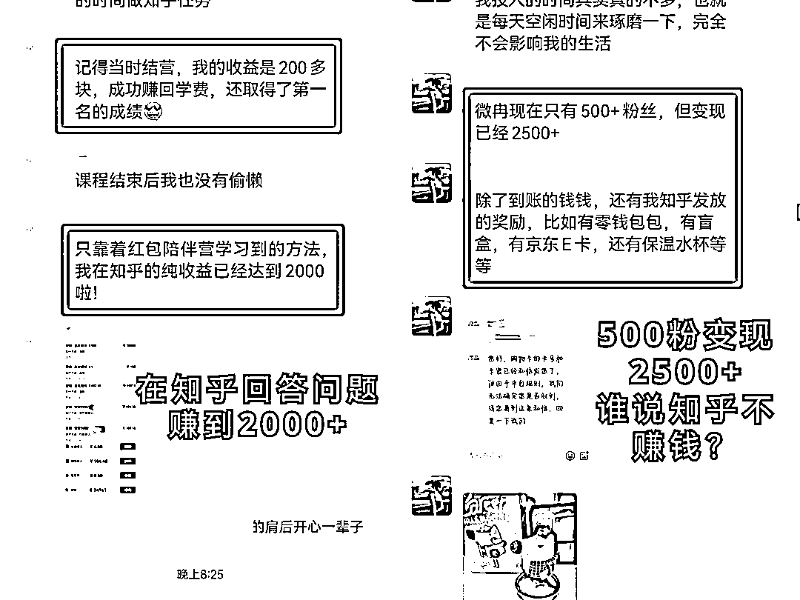

利用碎片化时间，一个月吃顿海底捞，喝几杯奶茶的钱还是能赚到的。

但并不是所有的题目都有奖励，当你参与知乎的有奖活动时，回答符合要求，就能拿到一定的奖金。

奖金金额从几元到100多元不等，我们有小伙伴一次活动赚到100元。

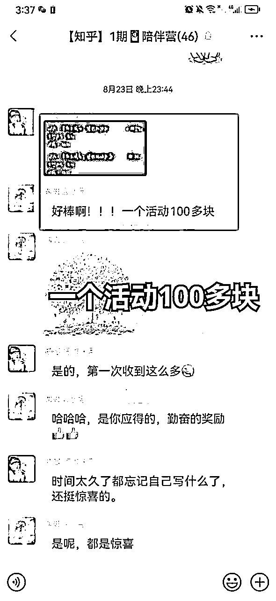

那具体要怎么做呢？

知乎有奖励的题目分为这两种形式，一种是这类型的

### 红包题

比如下图，有这个红包标识的，就是红包题。

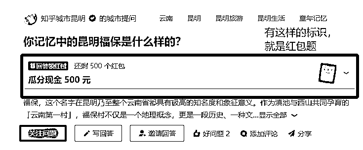

有的不是红包奖励，而是京东卡奖励，也很香。

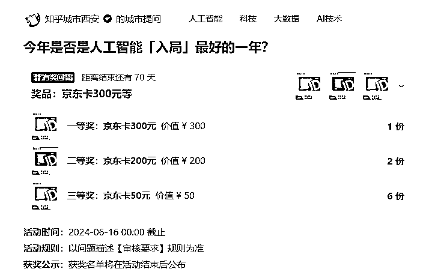

参加这类型活动，对文笔没有特别高的要求，只需要是原创的，符合它的字数和图片要求即可。

另一种是知乎的

### 有奖活动

比如下图：

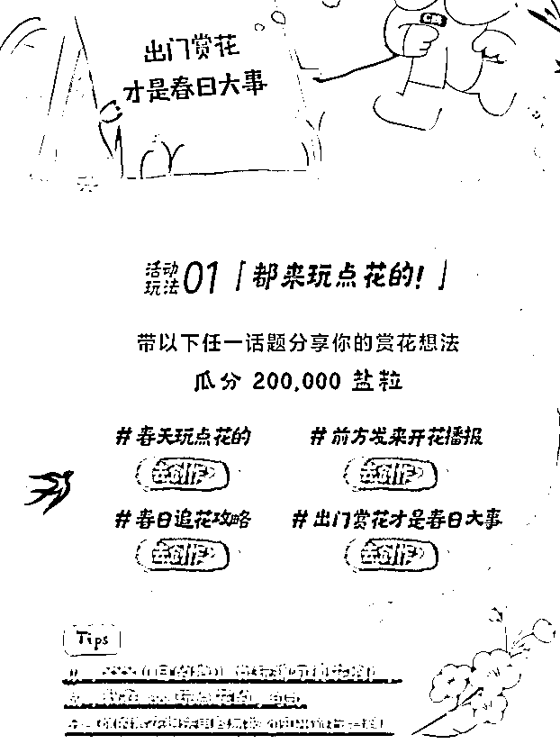

这是知乎旅行携手携程旅游做的活动，要求特别低，咱们普通人写30个字，配3张图，应该没啥问题。

符合要求即可参与瓜分200000盐粒，如果发布3条以上符合要求的的内容，还可以抽奖获得刘看山周边和超赞包等奖励。

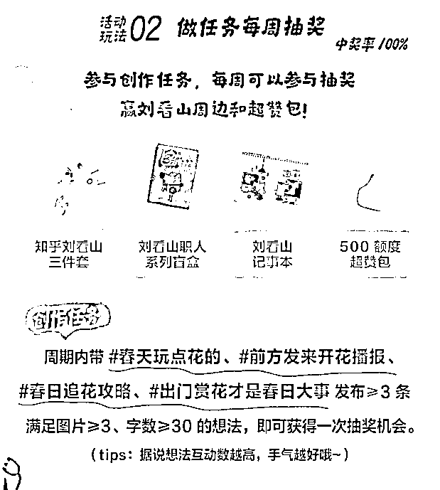

### 注意事项：

红包题先到先得，一定要抓紧时机早点回答。

各种发想法的活动很简单，门槛真的太低了。多参与，积少成多，也挺香的。

有的活动发的奖励是盐粒，100盐粒=1元钱，知乎的活动发奖励速度都挺慢的，做完活动耐心等待就行。

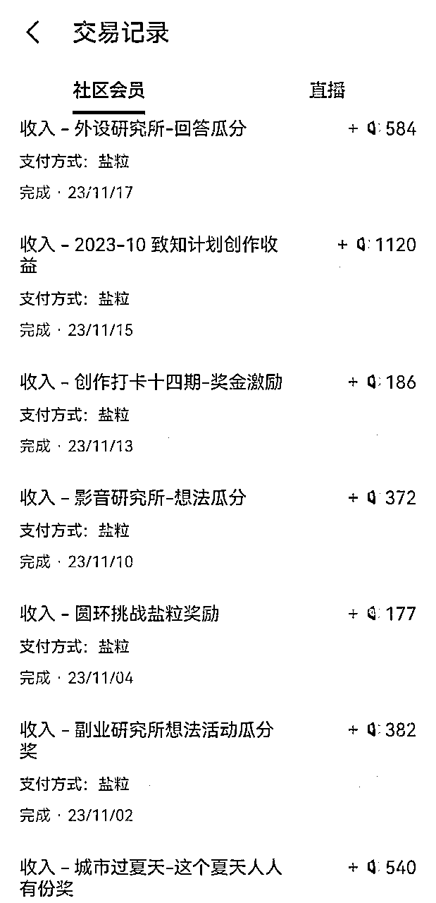

偶尔翻翻知乎钱包，能看到到账也挺不错的，是吧？

真的非常简单有没有？在知乎这类型的活动还有很多。

平时多关注【知乎数码】【知乎旅游】【知乎汽车】等官方账号，就能找到有奖问题啦！

回答这些题目，不需要很多的时间，利用碎片化时间，用手机就能完成，非常简单。

如果你喜欢写点东西，利用碎片化时间去知乎回答这些有奖题目，赚点零花是非常合适的。

# 四、怎么写一篇种草文章

这里来说说【知乎好物】的玩法，

### 什么是【知乎好物】

也就是在知乎上回答问题，用自己的表达方式，讲清楚一个产品的使用体验，给别人安利产品。

不知道大家在知乎平台，有没有看到这样的文章，里面挂了购物链接，有京东、淘宝、天猫、拼多多的。

以我的一篇文章为例，里面放了两个链接，这两个链接卡片我们就俗称“好物链接”。

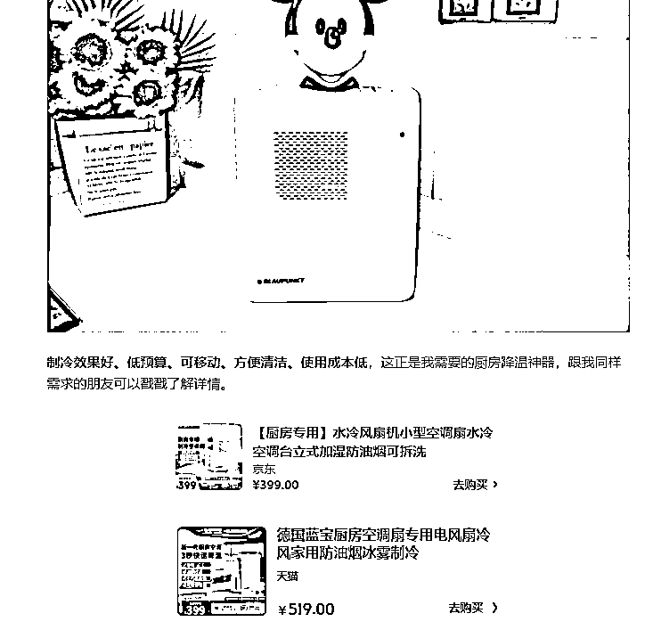

其实知乎账号的等级到3级就能申请好物权限，但3级能带货的产品都是知乎自营的，品类很少，很难出单。

但是到5级之后，就能带货淘宝、京东、拼多多这些平台的商品，相对容易出单。所以咱们这里只说5级好物。

### 知乎好物的申请条件如下：

只要满足以上几个条件，就可以去申请开通。

在平时写回答或文章时，写好物推荐的内容，有人看到你的内容，通过你植入的链接下单购物，你就可以获得佣金，这是【被动收入】。

哪怕这个文章你写了一年了，但只要有人看到，并且通过文中链接下单，你就一直有收益，这样算下来也挺香的。

比如我这里卖掉一个耳机或者一个洗衣机，佣金有一两百。

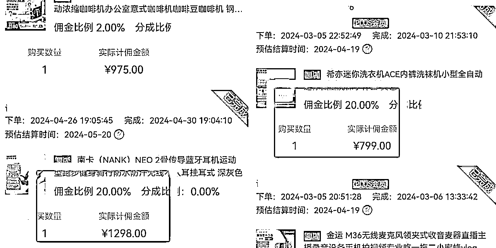

我这里的佣金比例是20%，也就是我的佣金=产品价值X20%。

但不是所有的产品佣金都这么高，因为上面的两个产品，是我和品牌方合作的，所以卖掉后佣金比例更高一些。

所以咱们有机会多和品牌方合作，这样出单后，也能提高我们的被动收入。

这就是在知乎平台的变现方式之一，我们叫做【知乎好物】的玩法。

虽然做知乎博主比不了做直播带货，但它也自有好处。大佬直播带货可能一两个小时的收入就很高了，但它是工作了才有收入，不工作就没收入，这是“主动收入”。

而在知乎上写文章，只要你的文章在，就有机会曝光，有人通过你的链接下单，你就能获得收益，属于“被动收入”。

试想一下，即使你暂停工作，收入仍然会持续进账。即使你在休息或做其他事情时，你仍然可能有收入，这感觉是不是很美妙？

我们平时多写一些知乎好物推荐的文章，被人看到并下单的几率就会很大，实现“躺赚”。

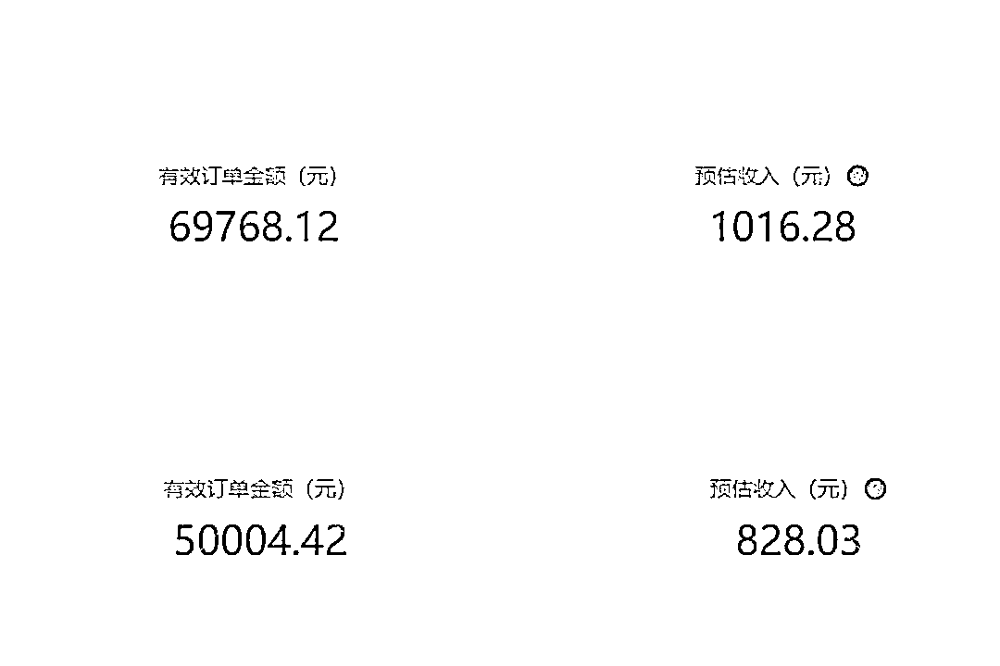

### 怎么写一篇种草文章

知乎对违禁词相对宽容，比如“最、唯一、非常、第一”等等极限词汇都是可以用的。

但要注意不要太过宣泄情绪，和人对线骂战 ，写种草文需要写出自己的使用体验，不能原模原样照搬产品参数，这样会被判定违规营销 。

如果是写护肤品之类的内容，“功效、祛痘”等文字要慎用。

1、去淘宝/京东查看商品详情，总结出来产品的几个卖点

举例卖点：这个商品适用于什么人群（工作繁忙的上班族）/什么场景（下班后懒得做家务）

如：扫地机器人用了之后，能帮我们把房子打扫的更快更干净/能让我解放双手......

这种大白话应该都能写出来吧......

2、结合买家评论，把详情页的产品卖点变得更真实一些

举例：你想描述这个商品能帮我们把房子打扫的更快更干净，那就看买家评论里关于打扫的真实体验分享。

评论说婆婆每天打扫卫生很累，家里有两个娃闹腾，再加上自己爱掉头发，机器人扫地不会被头发卡住，沙发死角也能打扫到。

把这样的场景描述运用在你的文章里，就是看起来很真实的体验的好物分享。

3、把买家评论转化成自己的使用感受

结合自己的人设，比如上面那个买家评论说自己婆婆怎么样的，你的真实人设是单身未婚，那就不要瞎说婆婆怎么样，而是说我比较爱熬夜，导致掉头发严重，机器人扫地不会被头发卡住，真的很喜欢。

而且我爱在沙发上吃零食，这个扫地机器人连沙发死角也能打扫到，真的很省事。

这样每个卖点做一点分享，每个卖点写一两百字是很轻松的。

一篇500字左右的好物推荐文章，就能轻松搞定啦！

写知乎文章，如果做成特别专业的号，就是大佬级别的，那需要很强的专业知识。

但做成普通人真实体验使用分享的号，是无需专业知识和专业术语的，大白话的表达就是最好的安利。

写完了文稿后，别忘记把“好物链接”放进去，一定切记，不要直接把链接复制粘贴到知乎上，这样是违规的！！！

具体添加好物链接的方法如下图：

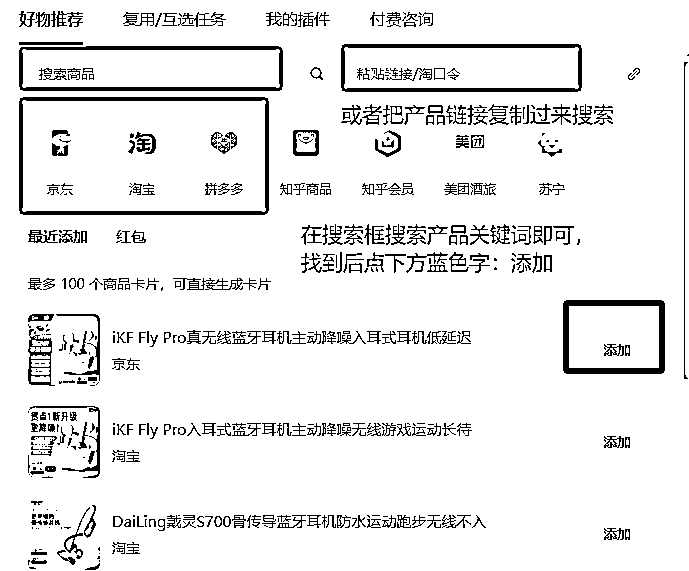

添加后转换成卡片的形式即可。

# 五、总结：

为什么同样是做知乎，收入差距会很大的呢？

我的看法，主要原因在于两个

### 1、赛道没选好

现在各个自媒体平台都在追求内容垂直，比如你做知乎的家电数码博主，那你的回答和文章，大部分都是家电数码的内容是最好的，这种账号商业价格比不垂直的高。

反之，你的回答和文章大部分是聊热点话题，两性关系，想接单子就很难，因为这个赛道本来就难变现，除非是赚“致知计划”的钱，但现在致知计划的米越来越少了，已经过了那个红利期。

我为什么选家电数码赛道呢？因为知乎的热门赛道包括：母婴、汽车、职场、教育、家电数码，其中家电数码的产品价格比较高，也比较快能见到正反馈（千粉就能接到合作）。

那咱们做之前就要把变现方式想好了，也就是赛道选好，这样才不会影响后续的变现。

去做任何一个自媒体变现之前，先弄清楚你的商业模式是什么，变现方式是什么，从入门到变现你需要做哪些事，这是顶顶要紧的。

关于知乎平台的多种变现方式，我在公众号里写过，感兴趣的伙伴可以自行查看一下。

### 2、粉丝量达不到合作的门槛

之前说了，知乎到达1000粉丝量就能接到合作，那是不是说百粉级别的博主完全接不到合作呢？

那倒也不是，我们来看看一单能有多少收入呢？

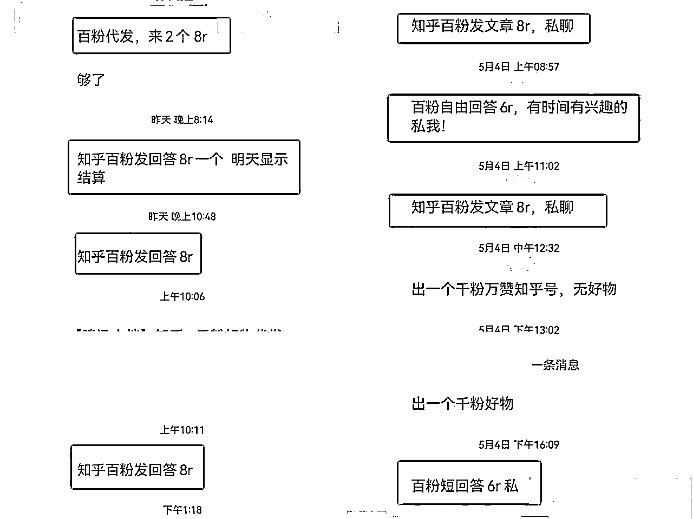

辛苦做账号，每次接广告变现不到两位数，我觉得不太值得。

目前知乎的行情普遍就是，百粉只有极个别的能接到百元以上的广告，而且有的文案是有违规风险的。

大部分的合作，都需要博主至少有千粉的粉丝基础。比较大品牌的品牌方，一般会找万粉以上的博主来合作。所以涨粉还是很重要的。

我印象特别深的一个我的学员，00后大学生，一开始可担心自己写不好文章了，因为从没有写好物推荐的经验。

后来跟我推荐的品牌方谈成合作了，跟那个品牌方合作了好几次。在学校收快递收不停，几百元的护眼台灯、几百元的耳机都用上了，她说要是自己买是舍不得买这么贵的台灯的，但是做了知乎之后，用过了不少数码产品的新品。

有的用不上挂在闲鱼上卖掉了换成稿费，拿来当生活费也挺不错的。这是我卖掉的部分产品。

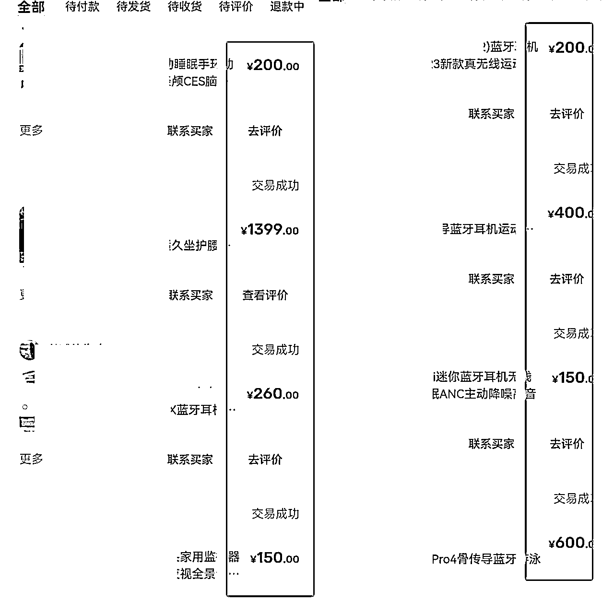

还有一个同学，是工作繁忙的上班族，每天只能趁下班后忙着更新，但由于精力有限，工作有时候还加班，她涨粉速度比别的同学慢一些，但知乎的长尾流量很好，她4个多月也到千粉了，现在也接上合作了。

有些朋友做知乎，看看一周两周没动静，就觉得这个平台不适合自己，就放弃了。

但其实，做知乎账号，相当于搭建了一个你的专属小店，只要你的店一直开着，就有机会持续的涨粉，持续的接合作，持续的变现的机会。

有句话说：靠山山倒，靠人人跑。靠谁都不如靠自己。

不如靠自己搭建知乎账号，做自己的长期饭票。

学到脑子里的，才是真正属于自己的，这也是我不断探索自媒体变现最大的感受。

2024想做副业，对于喜欢靠文字赚钱的伙伴，我依然推荐知乎，它的变现方式多样，对普通人来说还算友好。

其实关于知乎变现，这只是其中的一部分内容，但对于新手入场足够了，想要在知乎平台深耕的，建议早入局早吃肉。