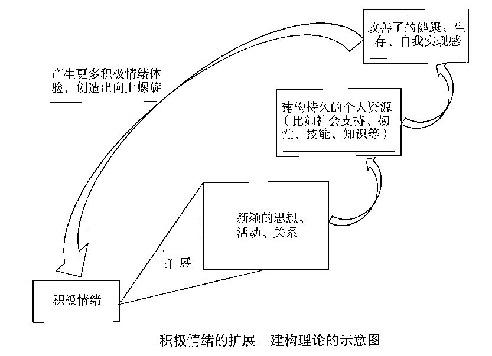

# 不确定时代如何发展自己

> 来源：[https://y4025updhp.feishu.cn/docx/KPX6dsug7ojRWcxEkCGcpvNMnch](https://y4025updhp.feishu.cn/docx/KPX6dsug7ojRWcxEkCGcpvNMnch)

大家好，我是个人优势发展教练玉勇，接下来，我希望带着大家打破个人发展的常规思维，发现自己的成功模式。

这几年，有好几个朋友跟我说要跳出企业，出去创业，然后说着说着就没了下文，陆续我也听到好几个自由职业多年的朋友，想要重返职场，他们都感受到了大环境越来越不确定。不知道你对自己接下来的发展有什么打算吗？

2020年以前，很多人都对从业环境发生变化，压力增加并没有太多感觉。毕竟中国经济高速增长有30多年，大家都会相信，只要够努力，总会有机会，生活也会越来越好。但这种信心在这几年明显在瓦解，被焦虑感所取代。

2020年到现在，身边越来越多的人都在谈论满意的工作，更难找了，钱更难挣了，竞争更激烈，各个领域都卷的非常厉害啊，你有没有感觉到，经常觉得工作很累，生活呢，好像也没什么意思，越来越看不懂接下来要怎么样去发展。

对于这一点未来学家卡西奥2016年就提出了他自己的看法，他用巴尼时代这一个词来强调，我们环境正在经历巨大的变迁。

那么什么是巴尼时代呢？

巴尼这个词是BANI这四个字母的谐音，分别是脆弱（Brittle）、焦虑（Anxious）、非线性（Nonlinear）、不可理解（Inconprehensible），下面分别解释这四个单词的含义。

脆弱：强大的错觉，易崩塌，我们习以为常的稳定系统忽然变得脆弱；就像行业的单一性，会由于其低变异性而非常容易受到影响。

焦虑：控制的错觉，它是信息的副作用，无助感，被压倒压制的感觉，就像来自媒体的大量新闻和“虚假信息”容易造成这一现象。

非线性：可预测的错觉，事件因果关系之间的脱节和不均衡；在事物发生的尺度和我们感知的尺度之间有巨大的差异，就像一场疫情大暴发，与因一时兴起吃野味的诱因之间有什么关系？

不可理解：知识的错觉，不可理解，试图找到答案变成徒劳，就像如今信息过量的后果，大数据和人工智能的介入。

卡西奥认为，在当前社会组织和个人事业都变得非常的脆弱，表面看起来运行良好，但是一旦危机出现，就非常容易崩溃，人们的焦虑感如同滚雪球般持续增长，而社会的复杂度越来越大，我们也很难用一个简单的线性逻辑因果来理解我们的处境。更加让人不安的是，旧有的知识经验好像越来越难预测，接下来会发生什么？

疫情这几年更加印证了这样的处境。2021年国家出台了双减政策，在这个政策之前，教会行业的很多公司还在规划未来，没想到下一个月就要遣散员工，上千万从业者受影响，他们不会想到接下来就马上要另谋出路，甚至老师去做主播，做销售、卖农产品，这些所有的情况在之前都没有想过的，政策一出，教培行业的两大巨头好未来和新东方也都面临巨大重创。好未来直接关停了它的k12业务，新东方也经历艰难转型，董宇辉横空出世，我想这个过程大家也都了解。

前些年的工作，一个职场新人在任何行业里面，他还比较容易找到一个清晰的定位，慢慢的从助理到主管，到经理，到总监，一路向上攀登职业阶梯，因为职业发展路径是稳定可预期的。

但是现如今的职场工作岗位变得没有明确的标准和固定的职责，你去看BOSS直聘上的JD说明，会发现和你未来要做的工作内容有很大的差异。多数的组织除了全职员工，还有大量的兼职外包项目合作和代理运营等等。工作也常常变成了从一个项目开始，以一个产品的交付结束的任务过程。

职业发展的方式，你会看到越来越个性化。到底要怎么发展自己？什么才是成功？都需要自己来定义。

有人选择自由职业，有人选择不断跨界，有人选择主副业平衡，当然也还有人依然希望能够一步步向上攀登，每个人都在积极的为自己创造满意的职业生涯。

你有没有发现，过去追求精准定位，在行动找到理想职业的这样的一种规划模式，如今，正在转向从行动中发现意义，持续调整定位的建构模式。

所谓建构模式，就是它的核心不再执着于单一的成就标准和选择的对错,而去关注每个选择和行动，会给自己带来的意义，借由这样的意义去慢慢的清晰自己的道路走向成功。这个过程就像艺术家创作一样，你先对自己要画什么，可能只是个懵懂的感觉，没关系，拿起画笔先画上几笔。那几笔涂鸦的画面可能就激发出新的灵感，等到一点一点展开你的画作，创作思路也会慢慢的变得清晰。回头看你的作品的时候，你就会发现最初和你现在想法已经有很多的变化，而且意义也更加丰富。

乔布斯在2005年的斯坦福演讲当中，生动的诠释了这样的建构模式。

他说，没有人可以未卜先知，只有回过头来看的时候，才能看清楚来龙去脉，当你把一颗颗珍珠穿成项链的时候，你才会发现之前所做的所有事情都是有意义的。

我想起我的一个好朋友阿杰，他就是生涯建构模式的践行者。阿杰用了八年的时间，从一个程序员，逐步成长为项目经理，最终成为了一名产品经理。他的职业道路充满了挑战和机遇，每一步都在不断拓宽自己的职业可能性。现如今，他在为未来成为独立的产品顾问做准备。他是怎么趟出这条路的呢？

最初在技术岗位上挣扎的时候，阿杰意识到自己想要更多地参与项目管理，展现自己的价值，但他不知道如何获得机会，也不确定这条路是否适合自己。他迈出了第一步，开始学习项目管理的知识，并寻找转型的方向。转型的初期，他没有经验，也没有机会，只好从一些门槛较低的项目管理任务做起。虽然这些任务比较容易上手，但对他的内在影响有限，职业发展空间也有限。

阿杰在这个过程中很快遇到了瓶颈。他开始感到迷茫，不断问自己，我到底在追求什么？在朋友的推荐下，阿杰开始学习更高层次的项目管理知识和技能。2018年，阿杰带着疑问走进了项目管理的课堂。在这个期间，他不断向导师请教问题，并分享自己的学习心得，这让他意识到，简单的项目管理不能满足自己的职业需求。他明白了自己期待通过项目管理发挥更大的影响力，带来内在的改变。

我注意到阿杰有一个明显的优势，他特别善于主动链接资源，展现自身所长，所以他总是能够赢得机会。我也是被他的积极上进感染，成为了朋友。后来，他在学习产品管理的过程中，阿杰用同样的影响力去结交新的朋友，链接到非常多的新机会。有一次，他在一次行业交流会上分享自己的产品开发理念，竟然引起了一位软件公司高管的注意。对方正好在寻找一位新的人才来补充团队。

有了积累的阿杰，这次凭借朋友的推荐拿到了机会。他把大部分精力都投在了创造机会，在组织内带领团队进行产品开发和管理。同时，业余时间他也去拿相关认证。这一路的发展并不是一帆风顺的，由于对新领域的工作资历尚浅，他在各个方面都面临挑战，这也让他非常消耗。为了找到更加适合的岗位，他不断换工作，这个时期让他异常痛苦。

好在，在这个过程中，阿杰凭借自己慢慢积累的项目管理经验和善于链接资源的优势，不断得到行业内同学的推荐，甚至是挖角，让他接触了越来越多的机会。这让他最终慢慢进入了一家互联网大厂，转到了产品管理岗位上。凭什么阿杰在频繁的变动中还能获得越来越好的机会？不仅仅是他善于链接资源，更重要的是他在转型过程中做到了很多人没有做到的事情，那就是在他喜欢的专业方向上下苦功，凸显出个人的竞争优势。

从2020年起，阿杰在产品管理领域不断实践。他问我，如何成为更有竞争力的产品经理，我告诉他：一定要多做用户研究，找到自己的独特性，让自己更深入市场，也更贴近用户。用户研究不像产品发布那样显而易见，很多人不愿意多做，但阿杰却做了大量的用户调研，写了数万字的用户体验报告，并接受了多次专业培训。这些积累成为了他的底气。入行第三年，他就战胜了几位资历更深的同行，成为了一家著名科技公司的签约产品经理，产品管理成为了他的第二职业。

后来，在从事产品开发工作时，尽管是新入行，各个方面都需要学习，但他始终把重心放在创造条件上，为团队带领产品开发实践，期待能直接影响产品和市场。每次产品发布前，他都会花大量时间准备，事后反复复盘，甚至请教导师。这种努力没有人强迫他去做，但他一直在做。这让他的单项能力异常突出，也被高层看在眼里。外人看到的是他频繁跳槽，不安稳，却看不到他背后每次都是带着自己的成绩离开的。

有一次，他诉说自己在推动产品创新过程中的无力和痛苦，我才知道他已经在推动公司高层的战略转型。我打趣地说：“恭喜你，你接触到了公司的核心，这是更大系统的烦恼了。”发展轨迹也上了轨道。2021年，他成为了公司产品总监，职业发展的速度加快了，对自己的职业生涯也有了更多选择权。

阿杰在公司内部争取各种尝试，参与疫情期间的变革调整，也接触到了更高层和核心的业务。他开始频繁被邀请去企业讲座和主持团队产品开发工作坊。业余时间，他还打磨出了自己的用户体验工作坊，支持在迷茫中的互联网人。

前不久，我看到阿杰，他说他正在做准备，等待合适的时机，就会出来做独立的产品顾问。尽管阿杰有很多自己的独特性，但在他身上，我也看到那些在不确定时期能够找到方向，一步步前进的人的共性特点。

第一个特点就是他们都跟随内在热情，先行动来扩展视野，再持续调整自己的定位。追随内在热情不是鸡汤，而是阿杰经历的行动、探索、反思和重新定位的生涯建构循环。

第二个特点是，他们都能在不断变化的环境中找到自己的稳定点，不断适应变化并从中找到新的机会。阿杰在从程序员到项目经理，再到产品经理的过程中，始终保持着学习和成长的心态。他在每一个职业阶段，都会积极寻找培训和认证机会，提升自己的专业技能和竞争力。

每个人其实都能隐隐约约感受到自己的内在热情指向哪里。但是我们常常因为挑战太大或者被别人打击过早地放弃它。你一定要先承认它，并且有耐心为它留足够的探索时间，职业探索就好像在黑暗当中，你拿着手电筒向前走。你只有走出三五步。才能够看清接下来的三五米会有什么样的可能，每一步其实都在解锁，下一步的方向和机会的。

有热情不行动或者行动中总是怀疑自己，你就很难让自己看到新的意义和机会。

成功与幸福的核心在于发挥你的优势，如果我们用一句话来总结建构式发展的策略，它的核心是什么？那就是追随内在热情看方向。发挥个人优势拿结果。

后面的文章呢，我们会引入优势识别器来帮你找到你的内在动力和热情，以及你的潜能。潜能帮你校准方向，建立起独特的个人优势。

最后在这一刻，我想留给大家一个从经历当中发现意义的练习，叫做人生线，你可以在自己的本子上画一条人生线。以下是每一步的详细说明和内容。

### 第一步：标记起点和第一份工作

1.  在一张白纸或者你的本子上画一条横线，从左到右贯穿整页，称为“人生线”。

1.  在人生线的最左边标记一个起点。

1.  在起点的上方，写下你第一份工作的岗位和入职时间。

### 第二步：标记每一份工作

1.  沿着人生线，从左到右，按照时间顺序标记出你的每一份工作。

1.  在每一份工作的上方，写下该岗位和入职时间。

### 第三步：反思每一份工作

1.  在线的下方，写下每份工作中，你所追求的是什么，或者是什么让你持续留在这份工作中。

### 第四步：定义你追寻的意义

1.  回顾你所有的工作经历，尝试用一句话定义你一直以来在追寻的意义是什么。

1.  例如：“我一直在致力于支持他人在职场和家庭成长和幸福。”

### 第五步：识别自己的优势

1.  回顾所有的工作经历，写下你看到了自己哪些优势。

1.  如果你一直在同一家组织，可以写下不同的岗位；如果你有业余时间一直在做的事情，也可以写在线上。

1.  反复思考和修改，直到你对第四步和第五步的内容充满认同。

1.  如果暂时无法完成这两步，可以先做优势测评，带着对自己前十大才干的理解，再来完成这个练习。

最后我想跟大家在一起做一个回顾小结。开始的时候，我们谈到我们正在进入脆弱焦虑，非线性又不可知的巴尼时代，这让我们意识到，个人发展模式也需要从精准定位再行动的规划模式，转向从行动中发现意义的建构模式。

在一个充满变数的时代，要一句话总结我们的建构策略，那就是跟随内在热情，看方向，发挥个人优势拿结果。

好，这就是今天的内容，谢谢大家。