# AI素描风育儿赛道， 短视频全新赛道书单号，起号全流程

> 来源：[https://ixy2s5ruvqf.feishu.cn/docx/LpNWdWuTOon0uixjTLVcp6fxnKd](https://ixy2s5ruvqf.feishu.cn/docx/LpNWdWuTOon0uixjTLVcp6fxnKd)

大家好，我是云天，今年是我加入圈子的第三年。前三年，跟着圈子的航海以及内部各位大佬的分享，我学习了很多，也让自己的营收翻番。

我比较喜欢研究新项目和黑科技等技术，去年分享了小和尚说话、AI风景、AI数字人深受广大小伙伴喜欢。今天在这里给圈子的各位小伙伴带来一个最近很火的短视频赛道的玩法——

素描风育儿号的起号实操教程

我社群的小伙伴很多都通过这套方法实现了3天千粉，7天万粉的战绩。

那么我们在讲课之前，先给大家展示一下这种视频是什么样的。

最近短视频经常会推送一些这样的的 账号，每个视频点赞都很高，画面也很细腻，吸引眼球，让人情不自禁就像多停留几秒钟。我们点进对方主页发现，整体来看下对方的视频架构，会发现视架构为：图片+配音=爆款视频

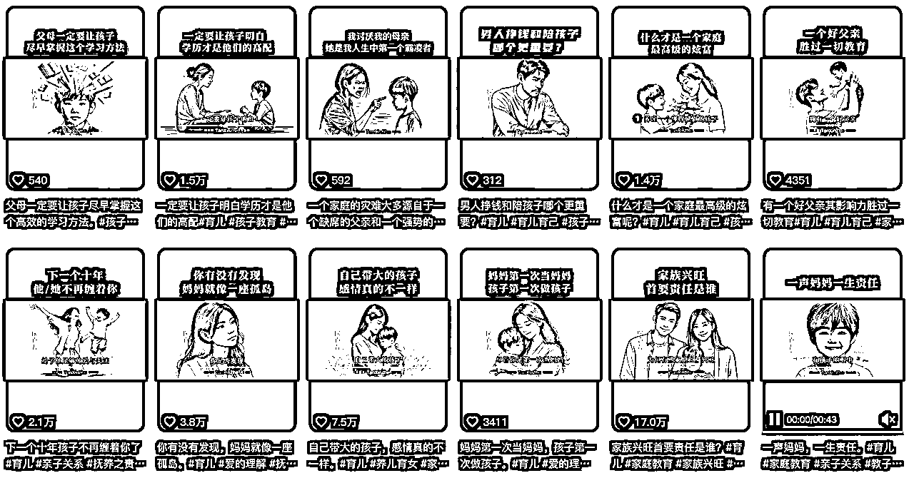

我将通过如下几个方面给大家进行详细讲解：

1、基础搭建

2、咒语参数关键词

3、文案的获取和洗稿技巧

4、AI作图技巧

5、视频制作全流程操作

* * *

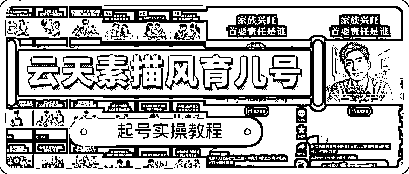

# 1、基础搭建

我们操作这个项目需要用到魔法，具体魔法你们可以自行去找，没有的话可以找我要，因为政策原因就不在这里推荐了。

链接 魔法后，打开网站：www.coze.com

这个网站3个小时有40次会话，制作图片时珍惜每一次机会，不是无限次的制作

如果3个小时没有超出40次，就可以无限制的出图，如果想大量制作图片，可以多申请几个账号。

目前相当于免费，如果后期收费再看政策。

## 1、注册

通过你的手机号注册

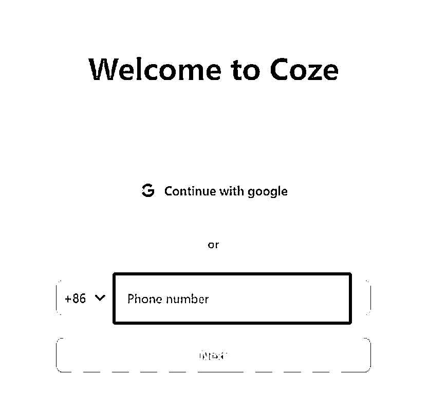

输入生日

输入英文名

## 2、创建机器人

点左上角创建机器人

按图提示选择后点confirm

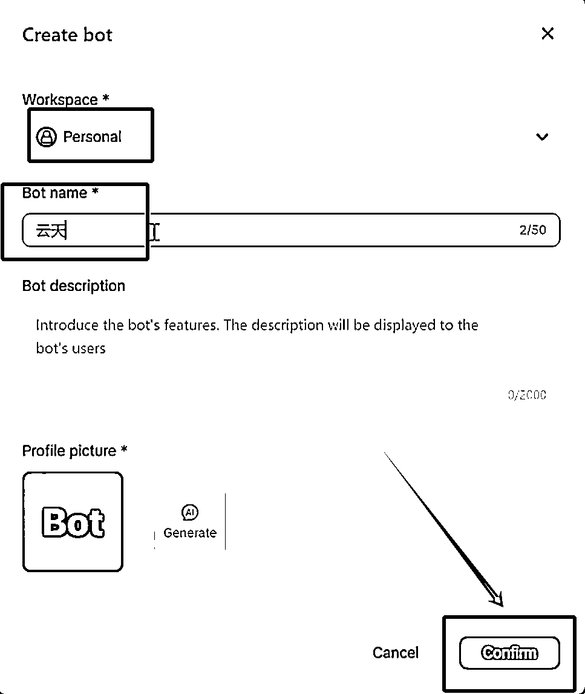

## 3、添加应用

进入界面后选择 Plugins，点+号

将GP4V和DALLE3分别添加到机器人里面

这样我们整个作图和文案的环境就搭建好了

## 4、测试效果

我们在输入框先随便输入一段文案，让机器人给我们出图看下效果

随机测试出图效果：

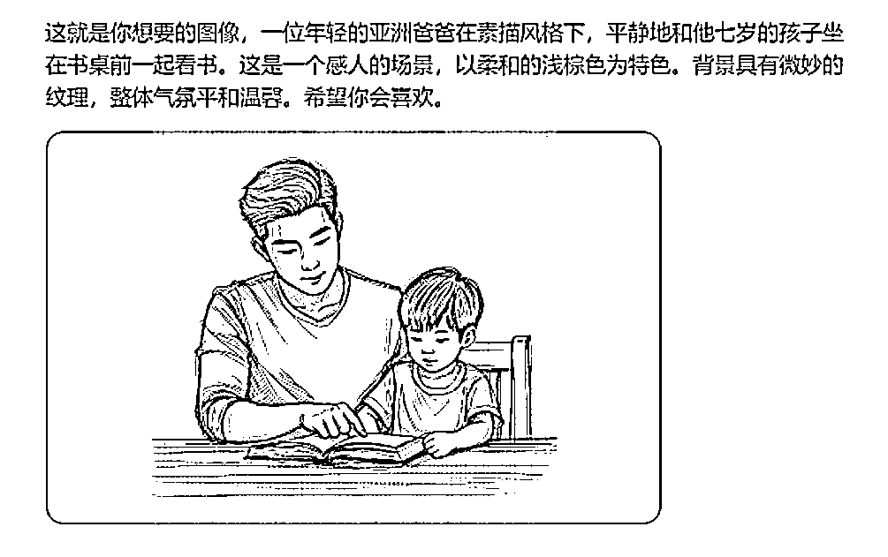

# 2、咒语参数关键词

## 咒语描述词参考

### 中文描述词：

素描风格，一位年轻的亚洲妈妈牵着她的三岁孩子，走在大树下，这是一个感人的场景，两人的表情都很平静，以柔和的浅棕色为特色。背景具有微妙的纹理，整体气氛平和温馨。16:9

### 英文描述词：

Sketching style, a young Asian mother holding her three-year-old child walking under a big tree, this is a touching scene, with both expressions calm and characterized by a soft light brown color. The background has subtle textures, and the overall atmosphere is peaceful and warm. 16: 9

## 4个关键词

仔细看：

主题关键词不能变：素描风格，亚洲人，浅棕色，比例16:9

就是说你任何一段描述语都必须要有这四个关键词，才能生成我们想要的图案。

## 关于人物描述：

这里举例给大家讲解

如果我们的文案是：“中年父亲面对面坐着妻子，他的表情显得有些忧郁，但他努力保持微笑。”

为了让机器人更好地识别我们的词，我们可以把父亲，改成男子，加上我们上面四个关键词，就变成了下面的文案：“素描风格，中年亚洲男子和妻子面对面坐着，他的表情显得有些忧郁，但他努力保持微笑。以柔和的浅棕色为特色。背景具有微妙的纹理。16:9”

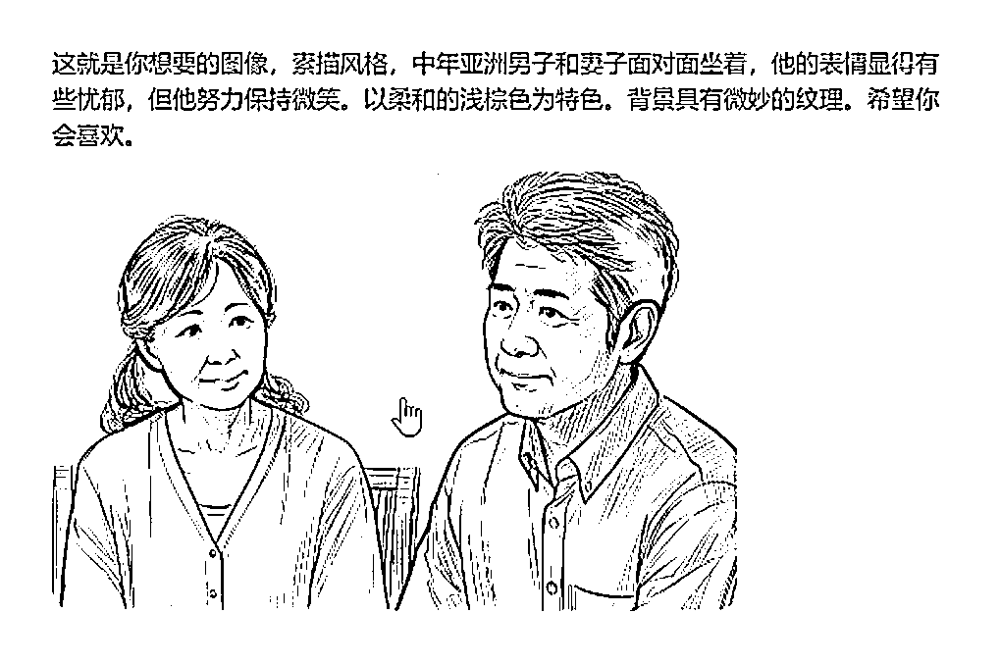

## 关于风格

图片风格有很多种，不用必须用我这个素描风格

①手绘风格

②水墨风格

③油画风格

④动漫风格

⑤铅笔素描

⑥丝印风格

越是不多见的风格，越容易出现爆款，所以不局限于素描风格。

# 3、文案的获取和洗稿技巧

我们做这个项目，一定不要想着去直接用别人的声音去做，因为现在的短视频平台都会查文案，文案如果相同很容易出问题。我们做就要做原创。

这个时候就会有很多人头疼了，我上学作文就没及格过，你让我写文案，不就是让我去撞墙吗。但是你要记得咱们得标题，AI素描风，也就是说，不仅仅是图片AI原创，文案也可以。

## 我们先讲如何找文案

抖音快手小红书都是文案的来源

这里以抖音平台举例，直接搜索家庭教育、育儿、孩子等话题，或者拿最近的热点话题——高考搜索，帅选出一周内点赞最多的一些视频

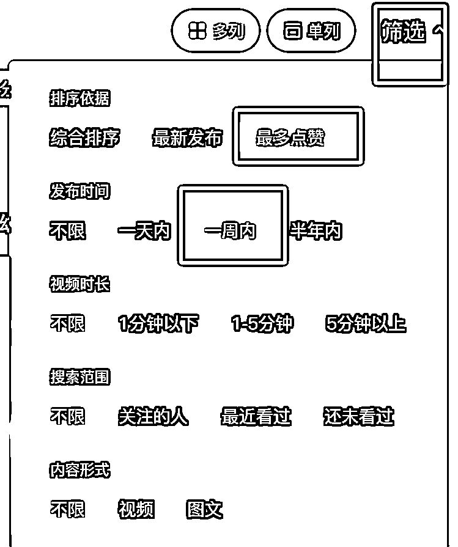

讲这些文案通过轻抖小程序复制出来文案

例如：

大多数爸爸的现状都是这样的，穿着普通且价格低廉的衣服，过着忙碌而压抑的生活，闭上眼难以入眠，睁开眼是琐碎复杂的生活琐事。人到中年，不敢向妻子倾诉苦楚，害怕他难过，不敢与孩子争执，害怕他叛逆，不敢向父母诉苦，害怕他们担心上对不起父母没有尽孝，下对不起孩子没有尽责。有时妻子的争吵更是让人心力交瘁。拼命工作却负债累累，拼命顾家却也没顾好，想哭却不敢哭，想拼却找不到出路。回顾过去，他们总是为他人着想，却无人理解自己，最终变成了连自己都讨厌的人。然而，即使在这样的生活压力下，爸爸们依然努力支撑家庭，他们为孩子的未来默默付出，为家庭的幸福不懈努力，每一个小小的坚持，都是他们对家庭的深沉爱意。既然你刷到了，就在下面为自己留一句我。是最棒的。

## 洗稿技巧（重点）

复制上方文案

再coze对话框先输入：“帮我修改一下文案：”

然后第二行输入上方的文案

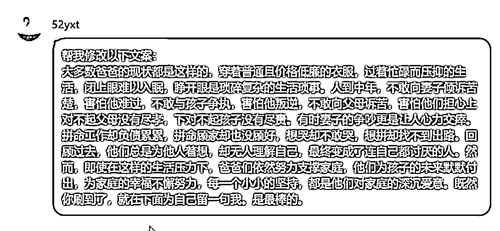

coze就给我们生成了一个新的文案：

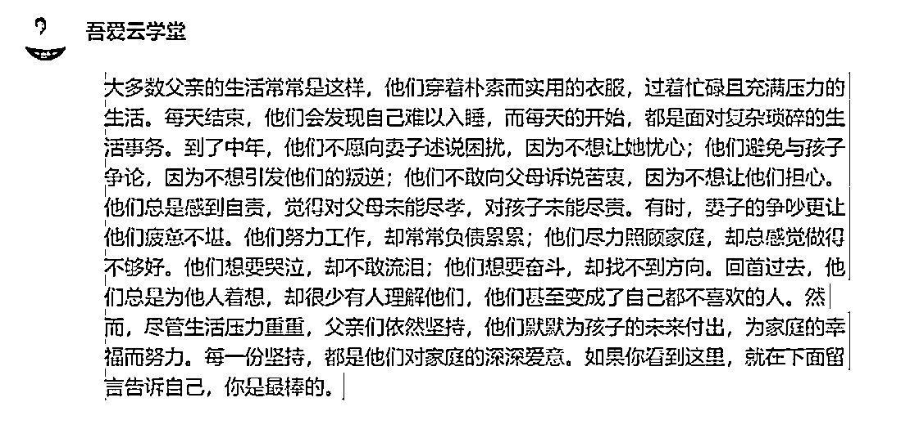

修改后的文案：

大多数父亲的生活常常是这样，他们穿着朴素而实用的衣服，过着忙碌且充满压力的生活。每天结束，他们会发现自己难以入睡，而每天的开始，都是面对复杂琐碎的生活事务。到了中年，他们不愿向妻子述说困扰，因为不想让她忧心;他们避免与孩子争论，因为不想引发他们的叛逆，他们不敢向父母诉说苦衷，因为不想让他们担心。他们总是感到自责，觉得对父母未能尽孝，对孩子未能尽责。有时，妻子的争吵更让他们疲惫不堪。他们努力工作，却常常负债累累;他们尽力照顾家庭，却总感觉做得不够好。他们想要哭泣，却不敢流泪;他们想要奋斗，却找不到方向。回首过去，他们总是为他人着想，却很少有人理解他们，他们甚至变成了自己都不喜欢的人。然而，尽管生活压力重重，父亲们依然坚持，他们默默为孩子的未来付出，为家庭的幸福而努力。每一份坚持，都是他们对家庭的深深爱意。如果你看到这里，就在下面留言告诉自己，你是最棒的。

# 4、AI作图技巧

那么我们如何快速作图呢？说到出图就需要快速的有作图文案，文案如果我们一句句去改。是很费劲的。那云天这里就给你说一个超级牛逼巨简单的方法，你用完之后，效率至少翻十倍。

## 我们现讲上面修改后的文案分句分段：

1.  大多数父亲的生活常常是这样，他们穿着朴素而实用的衣服，过着忙碌且充满压力的生活。

1.  每天结束，他们会发现自己难以入睡，而每天的开始，都是面对复杂琐碎的生活事务。

1.  到了中年，他们不愿向妻子述说困扰，因为不想让她忧心;

1.  他们避免与孩子争论，因为不想引发他们的叛逆，

1.  他们不敢向父母诉说苦衷，因为不想让他们担心。

1.  他们总是感到自责，觉得对父母未能尽孝，对孩子未能尽责。

1.  有时，妻子的争吵更让他们疲惫不堪。

1.  他们努力工作，却常常负债累累;

1.  他们尽力照顾家庭，却总感觉做得不够好。

1.  他们想要哭泣，却不敢流泪;

1.  他们想要奋斗，却找不到方向。

1.  回首过去，他们总是为他人着想，却很少有人理解他们，他们甚至变成了自己都不喜欢的人。

1.  然而，尽管生活压力重重，父亲们依然坚持，他们默默为孩子的未来付出，为家庭的幸福而努力。

1.  每一份坚持，都是他们对家庭的深深爱意。

1.  如果你看到这里，就在下面留言告诉自己，你是最棒的。

在coze对话框先输入：“请根据以下文案内容进行分析，帮我写出每句文案需要生成图片的描述词:”

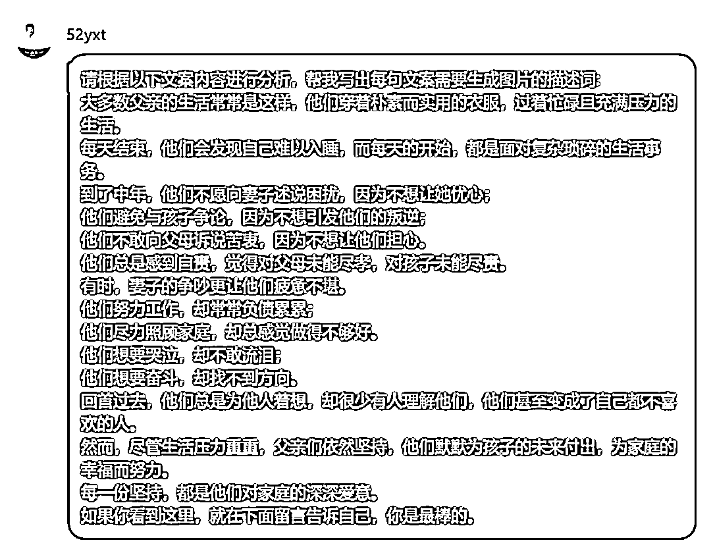

## 然后coze给我们生成了15段生成图片的描述语

前面是我们的文案——后面是生成的描述语

1.  "大多数父亲的生活常常是这样，他们穿着朴素而实用的衣服，过着忙碌且充满压力的生活。”- 一位穿着朴素的父亲在忙碌的工作场景中，面部表情显得有些疲惫和压力。

1.  "每天结束，他们会发现自己难以入睡，而每天的开始，都是面对复杂琐碎的生活事务。”- 一个父亲在夜晚辗转反侧，早晨起床后面对琐碎的家务和工作.

1.  "到了中年，他们不愿向妻子述说困扰，因为不想让她忧心”- 中年父亲面对面坐着妻子，他的表情显得有些忧郁，但他努力保持微笑。

1.  "他们避免与孩子争论，因为不想引发他们的叛逆”- 父亲和孩子在一起，他的表情显得有些无奈，但他尽量保持耐心。

1.  "他们不敢向父母诉说苦衷，因为不想让他们担心。”-一位父亲在父母面前，他的表情显得有些沉重，但他尽量展现出乐观的面貌。

1.  "他们总是感到自责，觉得对父母未能尽孝，对孩子未能尽责。".一位父亲独自坐在家中，他的眼神显得有些自责和内疚。

1.  “有时，妻子的争吵更让他们疲惫不堪。”-一位父亲坐在沙发上，他的表情显得有些疲惫，背景是他的妻子正在争吵。

1.  ”他们努力工作，却常常负债累累”- 一位父亲在办公室工作，他的表情显得有些焦虑，背景是堆积如山的账单。

1.  ”他们尽力照顾家庭，却总感觉做得不够好。”- 一位父亲在家中做家务，他的表情显得有些困惑和不安

1.  "他们想要哭泣，却不敢流泪”- 一位父亲独自坐在房间的角落，他的眼神显得有些哀伤，但他努力控制自己不让眼泪流下。

1.  ”他们想要奋斗，却找不到方向。”- 一位父亲站在十字路口，他的表情显得有些迷茫。

1.  “回首过去，他们总是为他人着想，却很少有人理解他们，他们甚至变成了自己都不喜欢的人。”-一位父亲看着镜子，他的反射显得有些忧郁和失落13.“然而，尽管生活压力重重，父亲们依然坚持，他们默默为孩子的未来付出，为家庭的幸福而努力。”.一位父亲在孩子的房间门口，他的眼神显得坚定和充满爱意。

1.  "然而，尽管生活压力重重，父亲们依然坚持，他们默默为孩子的未来付出，为家庭的幸福而努力。”-一位父亲在孩子的房间门口，他的眼神显得坚定和充满爱意。

1.  “每一份坚持，都是他们对家庭的深深爱意。”.一位父亲正在为家庭做事，他的眼神充满深深的爱意。

1.  "如果你看到这里，就在下面留言告诉自己，你是最棒的。".一位父亲正在看着手机，他的表情显得有些感动，背景是显示“你是最棒的”的手机屏幕。

只需要将每一句生成的描述语修改成我们的固定模板即可。

我们取其中一段给大家举例：

"大多数父亲的生活常常是这样，他们穿着朴素而实用的衣服，过着忙碌且充满压力的生活。”- 一位穿着朴素的父亲在忙碌的工作场景中，面部表情显得有些疲惫和压力。

我们把描述语单独拿出来：一位穿着朴素的父亲在忙碌的工作场景中，面部表情显得有些疲惫和压力。

记住四个关键词：素描风格，亚洲人，浅棕色，比例16:9

手动修改为：

素描风格，一位穿着朴素的亚洲男子在忙碌的工作场景中，面部表情显得有些疲惫和压力。以柔和的浅棕色为特色。背景具有微妙的纹理。16:9

我们将这段修改好的文案，发到coze上，让coze给我们生成这副画

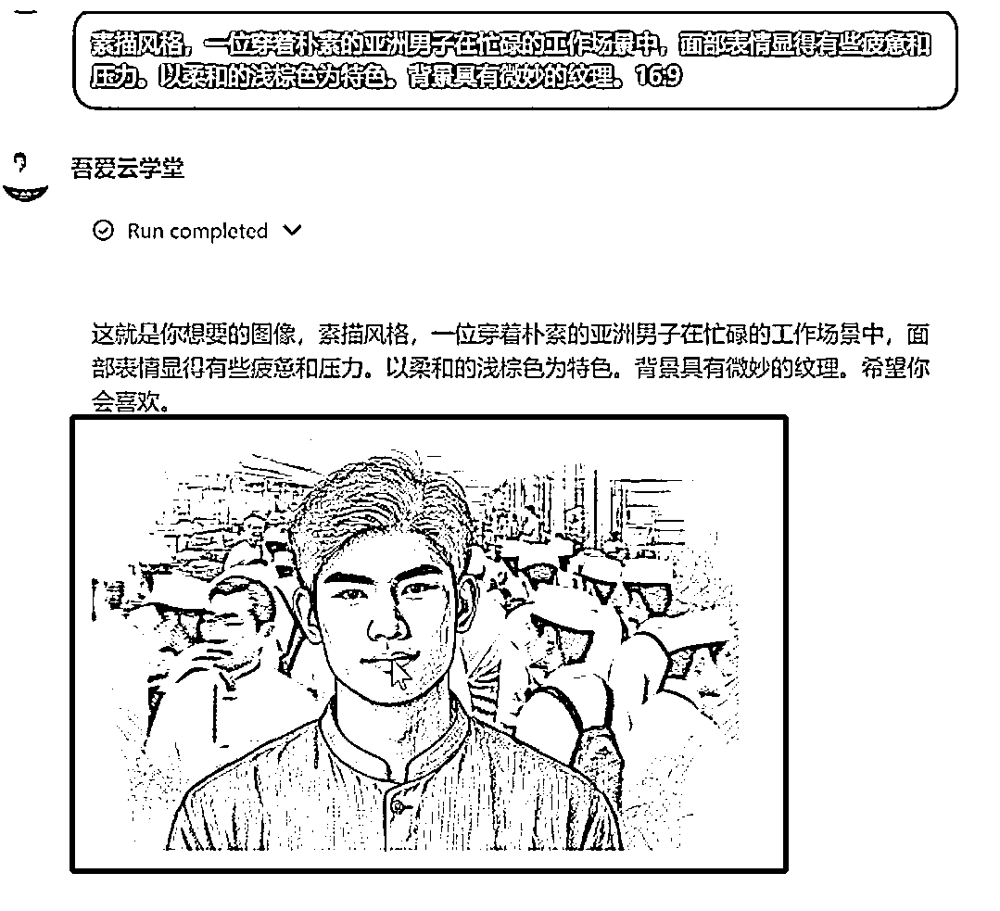

以上就是我们结合AI快速生成图片的技巧。

# 5、视频制作

## 一、配音：

这里推荐的大家使用魔音工坊，里面找魔宏声这个音频，复制进去获取配音即可

## 二、剪辑

### 1、使用剪映，导入我们最后我们根据文案得到的15张AI原创图片

### 2、导入配音、识别字幕

### 3、根据配音和字幕的位置调整图片时长

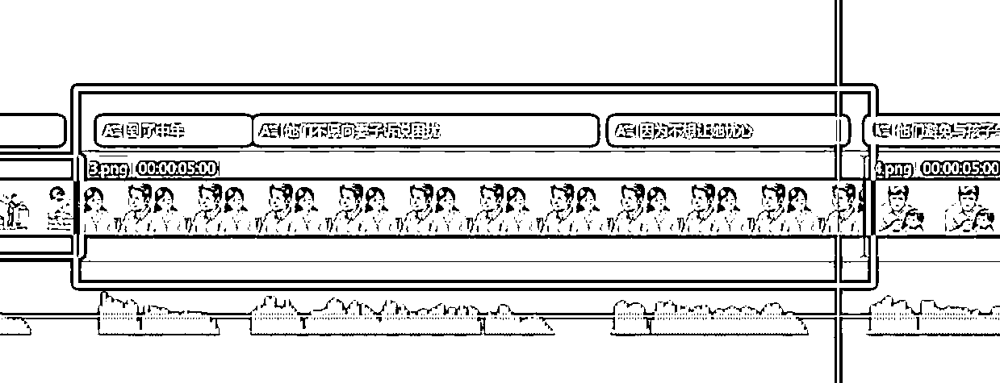

### 4、每幅图的开头结尾各增加一个关键帧，开头100%，结尾120%

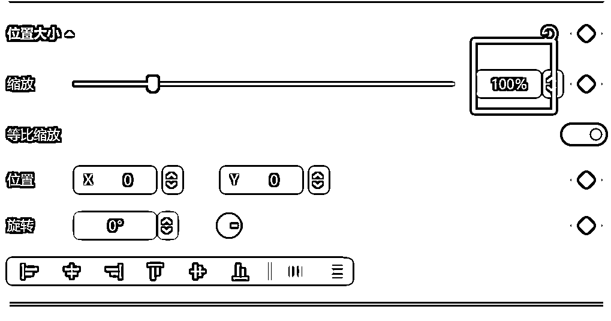

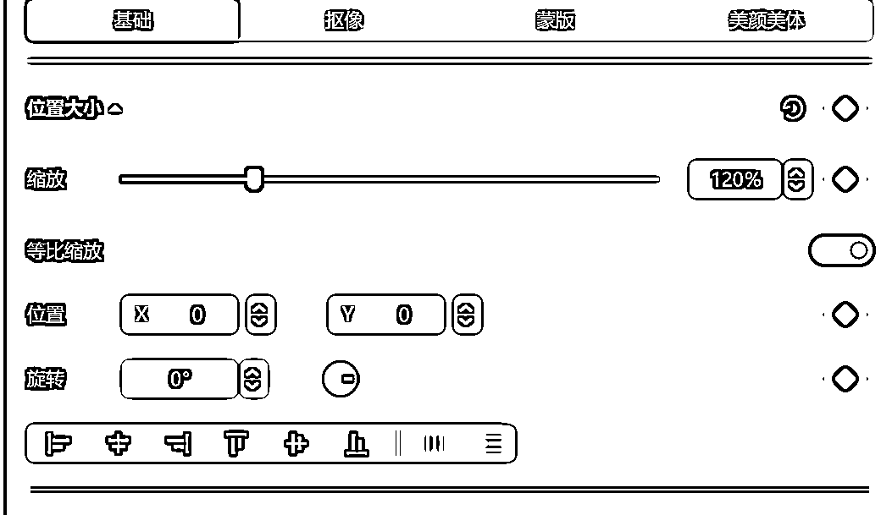

### 5、每两幅图中间增加转场，转场随机，没有固定要求

### 6、设置好字幕点导出

### 7、新建个草稿，导入我们刚才导出的视频。调整比例为9:16

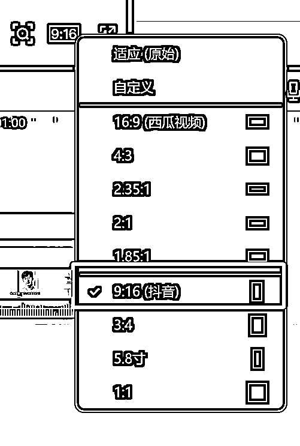

### 8、添加视频标题即可导出

### 9、查看成片：

# 写在最后：

好了，写这么多，如果你对我拆解的项目比较感兴趣，可以去实际操作下这个项目

因为目前短视频赛道这个流量还是挺大的，后期可以转带货、收徒、小红书商单广告等。

实操一遍之后你会发现，做起来真的很简单，外面有培训这个项目都要980，在这里你免费就能学习到。

也别让人家去割你韭菜，你看完我拆解的基本上可以去操作了，如果你有问题在找我交流哈！