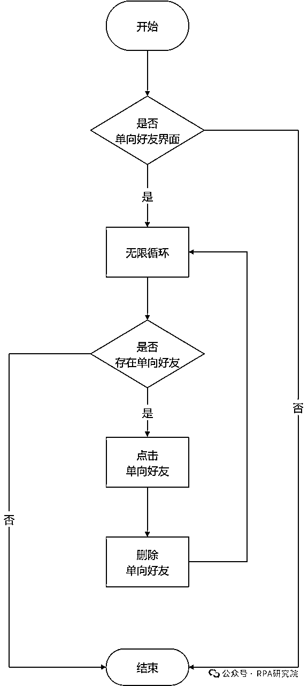
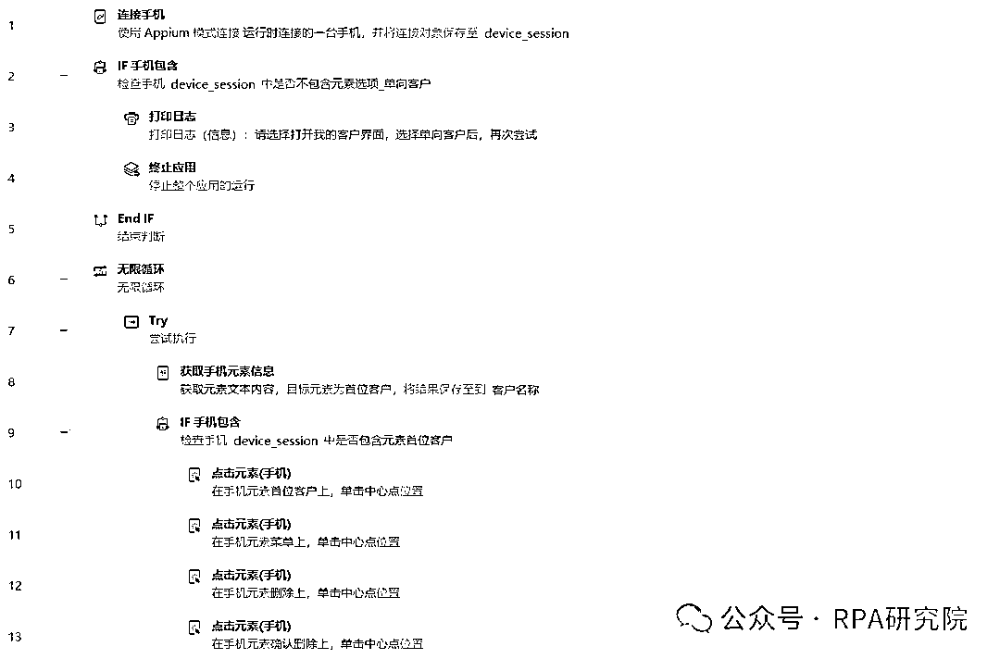
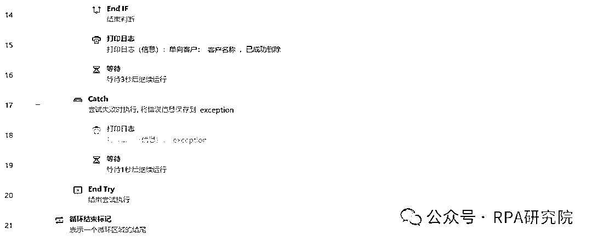

# 企微（企业微信）-批量自动删除单向好友RPA程序（实测稳定删除1500+好友，无任何异常）

> 来源：[https://x0gnb2e1yj.feishu.cn/docx/M6dedONLgogm7jxIaDbcSIJmnFg](https://x0gnb2e1yj.feishu.cn/docx/M6dedONLgogm7jxIaDbcSIJmnFg)

😁大家好，我是RPA研究院院长-商叁，随着企业微信在私域运营中的广泛应用，企业逐渐积累大量客户。但这些客户中可能存在大量的单向好友（即对方已经删除我们企业微信的账号，但企业微信账号中仍保留有对方的联系方式）。这不仅影响私域运营效益，而且企业微信的外部联系人规模收费模式进一步增加企业运营成本。

这次给大家带来一篇关于企微（企业微信）-批量自动删除单向好友的RPA流程设计。

仅需21条指令教你搭建一款自动删除单向好友RPA程序，让你解放双手，把更多的精力用在有意义的事情上。

# 🚀 程序介绍

企微（企业微信）批量自动删除单向好友RPA程序是一款针对企业微信用户设计开发的自动化工具。利用先进的RPA（Robotic Process Automation，机器人流程自动化）技术，帮助用户高效地管理企业微信好友关系，实现批量自动删除单向好友的功能。

# 🛠 业务流程图

# 📟 业务代码（影刀 RPA）

🥂RPA研究院院长-商叁，Base：广州

拥有12年经验的互联网老兵，目前在一家年产值8亿的电商公司担任RPA技术负责人。

主要职责包括领导并推动公司在抖音、快手、视频号、拼多多、唯品会等多领域的RPA业务程序开发。

欢迎对RPA技术感兴趣的朋友一起交流