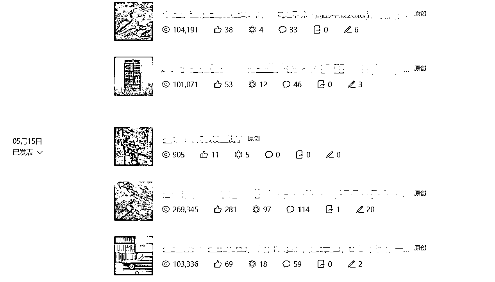
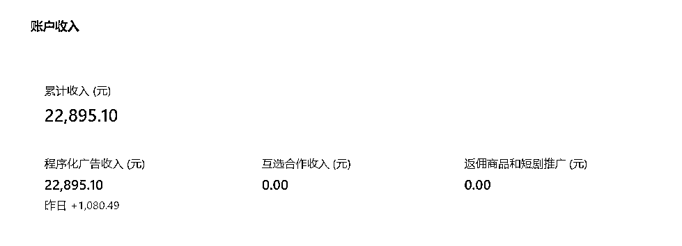
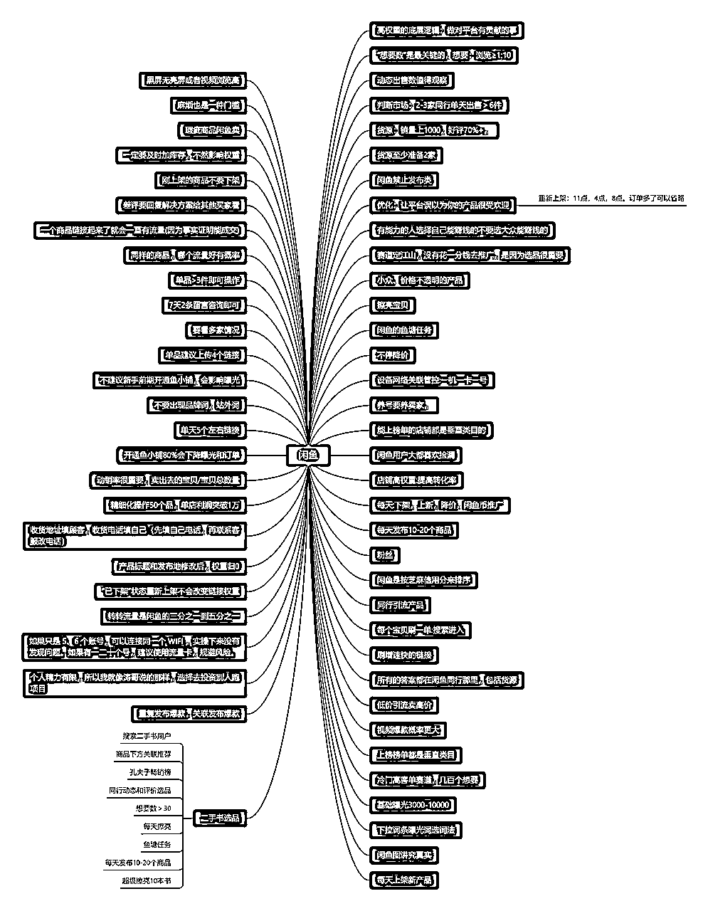
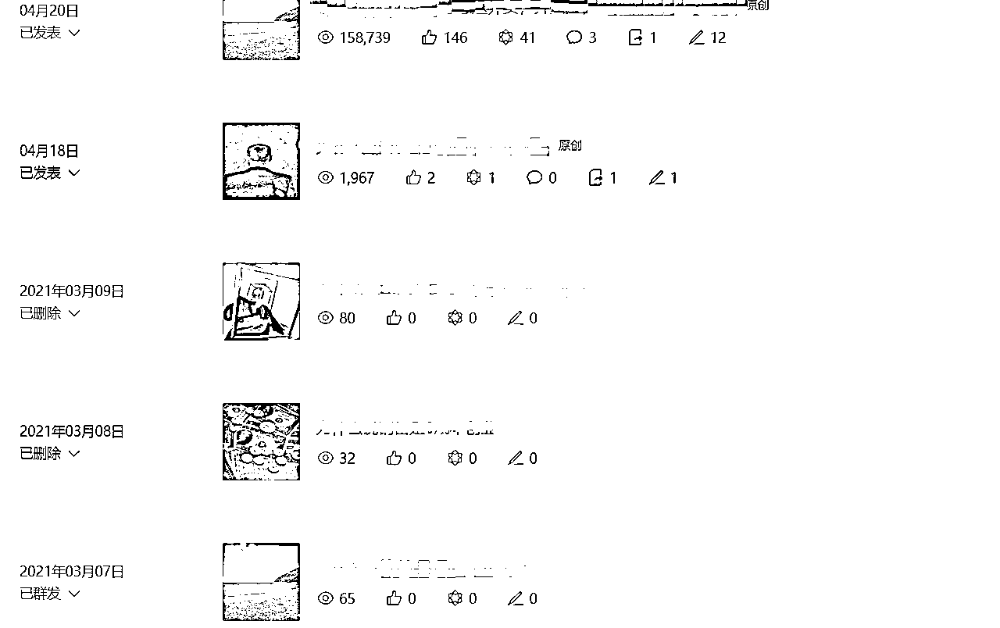

# 公众号爆文项目，50篇文章11篇10万+，一个月收入2.2万+

> 来源：[https://zqqtm0kx8fq.feishu.cn/docx/MOQfd05qDovQ7LxJQHZc3P0EnQd](https://zqqtm0kx8fq.feishu.cn/docx/MOQfd05qDovQ7LxJQHZc3P0EnQd)

# 一、成绩

大家好，我叫斌斌，2024年3.27加入生财，星球编号126384。通过阅读航海手册，4月底开始操作公众号爆文项目，一个月时间，一个号，统计了下从开始的50篇原创文章，11篇10万+，大量文章阅读是几万，每天大约花2小时写作，流量主广告收益单日最高1600+，一个月收入2.2万+，发文广告收益2000+。

有趣的是，我的号还被生财圈友发风向标且中标了。生财圈友真的是遍天下，网罗赚钱资讯，几万双眼睛时时刻刻在各个发财的角落盯着。号就不发出来了，有心的圈友自会发现。

在此，非常感谢摸鱼掌柜带我进入生财，并且在我写公众号期间以及本文的撰写提供了很多的指导和帮助。

加入生财之前，我尝试过很多副业，也付费了很多社群，包括现在一些抖音炽手可热的博主，但是都没拿到结果。不能说纯纯的韭菜，但至少性价比很低。

加入生财后，我才发现，原来项目是这么干的，航海手册可以手把手教的这么详细具体，一年二三十个项目航海，年费划分到每个项目也就一两百块，跟我之前一个项目就几千块还没结果比起来，太便宜太划算了。

加入了新人融入营，听了很多课，发现生财真是极致的利他，在真心实意的带着小白从0-1，从思维层面一点一点耐心的开始，我觉得改变小白穷思想的惯性，很难，是极其长期但是有价值的事，对社群运营者来说却性价比很低。但是生财愿意做这些，配享太庙，从根上在把小白往上拉。

# 二、我为什么选择公众号爆文

其实，我很后悔加入生财晚了10天，因为如果3.20号之前加入，就可以赶上3月份的航海了，通过航海加持，肯定成绩更好。

不过也没关系，加入生财后，我开始疯狂阅读生财帖子，两三天时间估计看了有几万字，但是内容太多了，看了几百篇帖子以后，我开始聚焦了，要想赚钱，必须做项目必须去干，那么我干什么？选择什么项目？

我先瞄准了航海手册，因为这里面的教程最详细。这是生财社群筛选出来，容易拿到结果的项目，并且同行圈友最多的板块，遇到卡点问题了方便请教链接。教练太重要了，不然一个点一卡几天几个月都不一定能解决，多少人做项目都卡在一两个问题解决不了就死了。

但是航海手册也有很多项目，我做什么了呢？做成项目的变量太多了，我要找确定性最高、最容易拿到结果的。太久没赚到钱，我太焦虑了，我一定要先赚到哪怕1块钱。

航海手册上似乎每个项目都可以赚钱，甚至赚大钱，但是我无感了，因为之前报名的太多割韭菜项目宣传的比这多多了，这些钱跟我有什么关系呢？我赚到自己口袋才是真的。

我准备自己看航海手册先实操起来，等到航海的时候再报名获取前沿的资讯和教练们的指导和加持。并且，先做变现类项目。

把所有的航海手册几乎都看了一遍以后，我瞄准了闲鱼二手书和公众号爆文。

因为我觉得闲鱼二手书并不需要太多的个人能力加持，需要的就是去行动，按照手册做就行了，是当下确定性变现最高的项目，然后我把生财中有关闲鱼和二手书的帖子翻了个遍，不管是普通帖还是精华帖，并且做了一些笔记，部分展示：

现在没时间精细化运营了，属于躺平式卖书的阶段，但是二手书项目每天仍然可以创造几十块的被动收入，只管发货，其他都不管，因为我写公众号文章要赚钱的多。

做公众号是因为我以前写过公众号，不过没流量断更三年多了，其实以前也只发过十篇文章，坚持纯原创，看不起那些模仿的，现在才发现多么可笑的观念，像呆板的穷书生。还是来张图对比下阅读量更直观点：

以前写销售信的时候，要学会研究产品、塑造价值、打造成交主张、设置价格标杆、支付条款、超级赠品等等一系列的东西。做公众号流量主几百个字随心所欲的写就搞定了，太简单了。于是，我的公众号日更之路就停不下来了，单号日入过千是家常便饭，于是我的目标变成了日入过万...

# 三、我如何找对标爆款的

*   航海手册的方向很好，我就是从中选择自己感兴趣的领域，紧紧围绕一些流量关键词去搜索和套娃式寻找：搜索+底部推荐。

*   只找10万+爆款进行模仿，代码算法是冰冷机械化的，一定时间内算法不会改变，那么之前的爆款就很有概率再爆，只找10万+爆款，原创都没有10万+，自己抄就更不可能了。

*   找20万+30万+甚至更爆的阅读量，越爆越好。但是阅读只能看到10万+，怎么办？看点赞，一般100点赞左右就有10万+了，如果大几百甚至几千点赞，那是爆款中的爆款，虎父无犬子，降维打击，更容易成功。注意是非ip类的，不然全是铁杆粉丝，点赞阅读的比例没有太多参考价值。

*   找你打的过的文章，去傻逼都能赚钱的行业，更容易赚钱。如果一篇10万+你觉得写的很烂，那你就干它。

*   对标的爆款越是新号，文章日期离当下越近，越容易复制成功。不同的时期时间，号的权重不同，市场的热点关注点不同，尽量减少不确定性。

# 四、我如何写的

*   写的过程中，我会想象一个听众就坐在我对面，然后我像是说给他听。千万不要有废话，最好是像短剧一样高潮迭起，调动读者的情绪。

*   万一用户不点标题，阅读就会为0，所以标题占据文章成功率的50%以上。一篇文章我可能花30多分钟写正文，但是会花5-10分钟写标题。我会让ai学习原标题进行写作，然后再次挑选组合出我认为最有吸引力的，ai的喂词训练手册可以看chatgpt航海手册进行学习。

*   修改标题时往热点和流量关键词上蹭，自行添加，没必要和原文的标题差不多，勾人眼球的关键词越多，用户点击的概率越大。

*   文章要么狠狠地提供情绪价值，要么有干货提供实实在在的认知或者资源价值，其他废话全部去掉，不然用户转身就走了。公众号是赛马机智，完读率低，打不过别的文章就死了，赛马机制是用读者阅读时的数据说话。不要废话，用词简洁短小震撼，像读小说一样停不下来。实在卡壳了就一两句话AI一波，优中择优。

*   不要修改对标爆款的骨骼，这是市场验证过的作品数据，比重新编个故事有效的多，多做确定性的事，减少原创的试错。

*   这个过程中涉及一个很重要的能力，优秀标题的判断力，得知道什么标题好什么标题不好，去收集10万+爆款标题并且抄写训练16遍以上，我一直有大量重复手抄爆款文案的习惯，可以说这是我的秘诀，会让爆款文案流淌在自己的指尖和血液里。

*   文章字数600-1000字，600一般可插1条文中广告，900可以插2条，但是文末广告收益一般是文中2倍左右。看不到最后就歇菜，所以我的文章很短，基本都是六七百字。每万文章阅读量大概就有50-100元收益。小技巧：如果你的文章到了600多字无法插一篇文中广告，或者说900多字无法插2篇？多分段，这可能是因为智能检测觉得插在哪都不合适，总不能插在一个段落中间吧，你手动多分段就能解决了。

*   以前我是用电脑写，这必须有整段的时间，平时还上班，我需要有更多时间写更多文章来放大，于是瞄准了坐飞机、等人等车之类的碎片化时间也能写，我就用手机便签写，体验感不是那么好，并且数据不方便同步。再后来，用飞书，有一种很爽的感觉，手机电脑随时同步随时写，经常坐飞机出差，我就把几篇多个微信收藏的爆款文章全部打开，离线参考写作在飞书上，两个小时直接干三四篇文章，落地后直接用电脑发出去。总而言之，我什么时候写文章？一有时间就写，我的卡点就是我的时间。

# 五、其他注意点

*   文章中不要留公众号名片、合集、图片等等一切可能吸引走客户注意力的东西，我们的目的就是曝光和点击流量主广告，其他都没必要。放一张图片用户就要手指多滑动半屏，没有意义，让用户做的动作越少越好。我的文章除了封面全是纯文字。

*   文末引导用户关注、“点赞”和“在看”，非常有利于文章的分发推广。例如点亮下方“在看”和“赞”，钱和爱一起流向你。本来可点可不点的这批人，为图个好彩头，可能也就点了，就给你的文章权重加持了。

*   写完之后预览读一遍，像是第一次看这篇文章一样，从纯陌生用户的视角，对磕磕绊绊、不舒服、不爽的部分全部删掉或者修改，一口气要能顺滑的直接读到底不带停顿的。

*   留言功能打开，对正面的或者能引起强烈议论的留言进行精选公开并且参与讨论，像刷抖音一样很多人喜欢看评论，高手在民间，也非常有利于底部广告的曝光点击。我有一篇文章40万+阅读，很重要的原因就是因为评论区大家在激烈讨论甚至争辩。一些负面或者违法违规的注意删除。

*   流量主的文中广告有很多类型可以勾选，不同类型的收益不同，我一般从我文章的受众、以及历史收益数据来分析，每个号的广告也是千人千面的，我有四个微信，我都会打开了看一看，推送什么样的广告，和我的文章受众是否匹配，点击概率高不高，例如电商直接卖货的这种我发现点击率就非常低，我自己看着就很不感兴趣没吸引力，后来我就把这个类目关掉了。

*   文案能力无法速成，批量ai全自动化赚钱的时代也已过去。可以用ai一两句一段一段测试，再用自己白话文缝缝补补，但是上面的方法是术，你能用别人也能用。文案内功本身才是更稳健长期主义才是核心竞争力，死磕修炼内功，才是永恒的护城河，没有项目能完全离开营销和文案。

# 六、我的规划

公众号爆文日入过千不难，但是日入过万很难，我觉得日入过万的机会在视频号，所以接下来几个月一方面我会死磕公众号爆文，另一方面我也会扎根在视频号带货，之前抖音拍口播视频有70万播放，我觉得我在视频号也有机会。

另外，深挖狂刷生财帖，不放过任何一点点有价值的内容。链接更多优秀的圈友，产生远远1+1>2的价值。

我个人自认为擅长营销流程优化和销售信写作，喜欢所有能赚钱的事，如果你有好项目、好想法，欢迎和我链接交流。我的v:bjsnhj