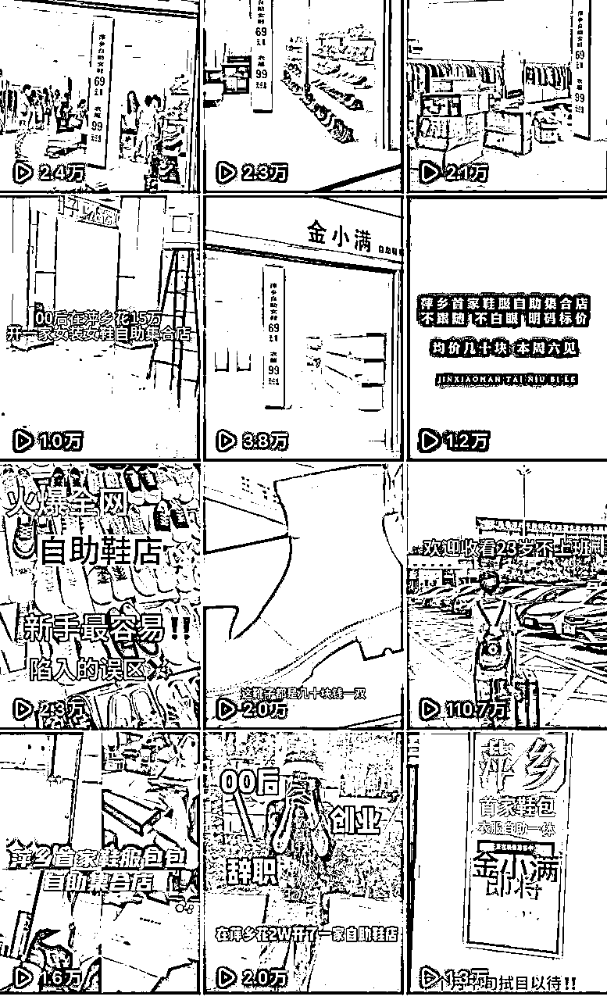
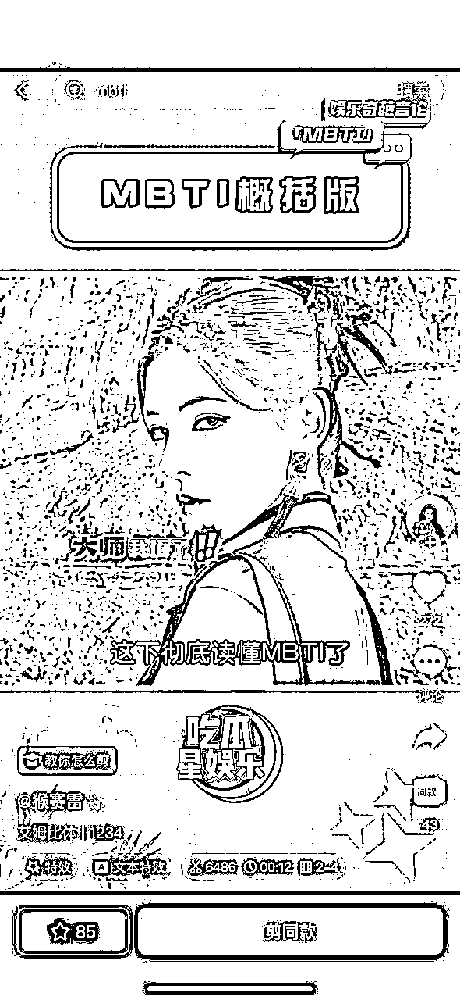

# 《0基础新手小白实体创业开自助鞋店，一年半变现七位数》

> 来源：[https://aiw9gwwc0n8.feishu.cn/docx/W3ZRdwJRGoT3DLx7px4cT9uCnUc](https://aiw9gwwc0n8.feishu.cn/docx/W3ZRdwJRGoT3DLx7px4cT9uCnUc)

大家好，我叫大眼，00后，实体创业一年半，连开三家自助鞋店，同城拓客10000+，全国学员300+门店。

22年的冬天在疫情最严重时选择了实体店，那会临近大学毕业，不想给别人打工，想着做点什么事情，于是发现了自助鞋店这个项目。可执行性很高，不需要什么成本，几万块钱就可以开店了。

在去年还加入了自助女装融入到自助鞋店里，开了自助鞋服集合店。

抖音当时的运营数据，条条破万，全部都是推给同城的，流量非常之大。

刚加入生财有术，是个新人圈友。看到了很多关于实体店以及做流量的精华帖，觉得非常有收获。所以也想来分享一下我的经验。

# 一、开店前的想法

## 1.1 创业历程

我是16岁时就开始创业了，幸运地撞上了一些小风口，16年-20年qq卖减肥产品爆火，赚到第一桶金六位数。

21年推出微信，加上那会qq对vs的限制封号很严格，于是转战微信又卖了美白、祛痘等等一系列产品，做到品牌百万最高级别。

22年临近大学毕业，也意识到vs正在走下坡路，不想给别人打工，于是想开实体店开始搜索各种资料，早餐店/餐饮店/奶茶店/甜品店等等加盟店类型，要么就是投资太高，要么就是市场饱和又或者盈利不显著，对于新手来说不友好，于是我突发奇想了“无人售货 自助鞋店”的项目。

## 1.2 开店思路分析

早餐店:感觉做早餐店的人很辛苦，每天都要早起，感觉自己吃不了这个苦，真的很佩服他们！我也不是很懂做面食一类，需要花大量的精力自学又或者还要教学费去学技术，如果找加盟店，几乎供应链都是半成品很难做到本地口味统一，整体投资成本偏高。

餐饮店:一方面可能我是女孩子确实对餐饮不熟悉也不感冒，可能也就火锅店受众群体大一点，但是据我当时所知，开一家火锅店都是大几十万，如果加上有知名度的肯定百万打底，而在22年是疫情最严重的时候，很少有人会拿大投资开店。

奶茶店：基本只能做品牌加盟，奶茶喝的就是一个品牌效应，如果找不三不四的基本上都会以倒闭告终，而且当地奶茶店其实算市场已经饱和了，比如蜜雪冰城在当地步行街好的点位都满了，就算有租金也是很贵，还要加上设备钱水电费人工费等等一系列，开支真的太大了，经营的好两年回款，经营的不好几个月就干不下去了，当时也搜索了很多资料，很多加盟商投入几十万进去亏钱的也很多，也是因为当时的大环境所造。

甜品店：如果光靠我爱吃甜品这一项就想要去开店是完全不成立的，需要审美，需要耐心，需要细心，对于我来说有点困难...

我在想，有什么是投资低，又轻松，回本收益快还不需要人工费并且新手容易上手的？就想到了自助鞋店。

## 1.3 实体店vs互联网项目

我觉得做实体店会比互联网项目更真实一点，站在客户的角度她们会更加容易建立信任，看的见摸的着，之后再成交。比如我卖鞋，鞋子质量好不好，舒不舒服，到店试穿直接就有答案了。有一个现实平台的纽带搭建联系。

我之前做微商也尝过甜头，但是到后期随着时代的发展趋势，对我而言引流越来越难，不管是精准的还是非精准的都有点吃力，基本上卖的产品都在吃老顾客的本，我知道再继续这样下去的话，可能会把仅剩的一些老顾客热情也都给耗光了，我意识到该转型了。

实体店比互联网项目相对包容性会更大一点，素人草根新手也容易上手。但是做互联网项目，是需要培养一定网感的，也要有认知思维，对我来说有点难。

比如餐饮做的好吃，就算不宣传，顾客也会帮你推荐和介绍，不知不觉就有更多顾客了。比如理发店/美甲店，价格合适，技术到位，也有很多人愿意买单。比如服装店/鞋店，性价比高，老板娘懂搭配，有一定的审美，也可以做出成绩。

很多人会觉得现在的大环境不好，实体店不好做，要是放在5年10年前就好了，可是好的环境之下也有做的差的，差环境之下也有脱颖而出的。

冥冥之中，让我觉得实体店是不会落寞的，反而会扎根出一群积极正能量的老板们，优胜劣汰。

流行是一个轮回，就像现在我们穿的勃肯鞋，洞洞鞋还是受热捧的北面，破洞裤等等其实早在10年20年前就在流行了，现在又重新被大家喜欢。

所以慢慢的，实体店也一定会迎来春天。

当然，不管是实体店还是互联网项目，我觉得首先是得热爱和喜欢，只有足够热爱，才会全力以赴，兴趣在哪里，心就在哪里~各有各的好处

# 二、自助鞋店优势

## 2.1 自助鞋店对比传统鞋店

1.没有人工费

传统鞋店如果老板自己不守在店里就是请人，请人的人工成本就上去了，自己守店会很累，所谓一句话“开店容易，守店难”。

我们是真正做到无人售货，自助选购的，店内不需要人，顾客自挑自选，自助买单，看中喜欢的直接打包带走，而我只需要在家里偶尔看看监控就躺着收钱了。

2.没有囤货压力

传统鞋店一个鞋子款式在展厅只能放一双，而鞋子又需要套码拿货，也就意味着一个款式仓库里需要囤4-5双鞋子甚至更多，那么100个款就需要拿500双鞋，资金投入大，压货风险大。

而我们自助鞋店，是卖多少货就补多少货，所有的货都在鞋架上，是没有库存压力的，卖完了在补货，就像我第一批货也就才拿了200多双鞋子，基本上一天就卖空了，而后继续补货，良性循环，资金也不会被限制。

3.款式新颖

传统鞋店，展厅仓库积压货品多，上货周期慢，而且一般是一个季度就上新一整个季节的鞋子，后期不会更新或者更新少。

接上一点，我们是卖多少补多少，所以款式更新很快，也非常新颖，并且我们可以根据店里的售卖情况和顾客需求去灵活上新款，自动匹配人的喜好，顾客也有新鲜感。

4.价格优势

传统鞋店一双鞋子少说也要上百的，像冬天的靴子都要卖到200多，对于顾客消费而言价格偏高。

我们自助鞋店明码标价，全场99元两双任选，一年四季都是如此，包括冬天的鞋子，在价格上占绝对的优势和性价比，并且我们也会保留售后，卖出去的鞋子断底断面包换新，不仅仅是便宜，服务也都很到位。

5.自助鞋店深受顾客群体喜爱

越来越多的人不喜欢逛线下实体店的一个主要原因除了价格贵，还有就是不喜欢有人跟随，大部分人应该都有这个困扰，走进一家店，老板或者员工就跟在后面盯着看着，浑身不自在，让顾客进去就想立马出来了。

我们简直是社恐人士的福音，因为店内没有人，也没有导购，无人售货，无人推销，顾客进来也不用担心这个问题，想怎么试就怎么试，哪怕待上半个小时一个小时也没人翻白眼，甚至不买都没关系！不管是年轻人还是中年人都很喜欢我们这种模式。

## 2.2 自助鞋店对比电商

那很多人会好奇，卖鞋的那么多，tb/pxx抖音各种电商都有，别人为什么要到我这里来买呢？

1.我们不跟电商比价格战，因为再便宜的东西还有更便宜的，我们玩的是一种新型的商业模式，顾客在我们这花两位数买的鞋子一定是远远超过她的本身价值的，质量对得起价格！而且我们很多合作的都是品牌鞋，独家货源，一般人根本拿不来。

2.实体店很多人都说不行了，不是实体不行，而是社会在进步时代在发展，是只做线下的生意有局限性，所以才要结合线上的资源同步进行，有实体店在，直接逛街去店里穿上就能把鞋买到手，才几十块钱看得到款式摸得到质量，换做这样的店铺谁不心动？在同样的tb上几十块钱的鞋子里实体店就可以买到，我们甚至比网购的性价比还要高，为什么还要去tb上多等待几天呢。

3.tb你能带动线下实体店的人来买东西吗？你能说服三四十岁甚至年龄更大的不想网购的人网购吗？实体店的开展就是扩大客源群体，如果说淘宝上只能做线上，那么实体店就是线上线下的结合更加吃香！

这只是我随手列举的3点，对比当下的实体创业，自助鞋店的好处真的太多太多了！

# 三、自助鞋店的投资sop

## 3.1 开店物料准备

1.房租

小县城创业房租1600，押金1000，房租一个月一交，接手上一个服装店主店铺转让费1.8w，都是已经装修好了的。

再来给大家看下我在其他地区的开店房租。

这是云南省曲靖市的店转让费20000，房租一年14000，平均每个月1167。

这是广东省揭阳市店

新商业街，还在开发中，房租一个月1800。

湖南省张家界市店铺

在镇里开的180平方店铺改造做集合店

房租一年不到两万

这是在四川省宜宾市区店铺

房租一个月3280，无转让费。

这是在广东省珠海市区店铺

房租4500，转让费23000

多po了几个地区的店铺房租给大家进行对比，可供参考。有县城的，市区的，镇里的，普遍县城or镇里开店的会多一点，房租更便宜，月租一两千就可以搞定，市区的话房租基本上都在3000+上下。

2.门头招牌

灯箱加上发光字体花费1600💰

灯箱写上“无人售货 自助鞋店”的明显样式，无论是对于路过的客群体，还是拍照发抖音都是很好的引流热门素材。

例如：你的鞋子怎么这么便宜等等，有些人摸着好质量还要问一句怎么这么便宜。

这时候你就可以回答，公司配货统一管理的，模式就是这样，所以这么便宜。

还价的时候也可以用上这句话，我们公司都要检查帐的，都是统一价格，给你少几块钱我们要扣押金的。

3.鞋架

装修必须要摆6个架子，多一个少一个都不行，35-40码，一个码数一个货架，按码数分区摆放，方便顾客自助购物，号码牌可以找当地广告公司做。

tb淘的半成品，买回来自己组装的，一个架子200多块，一共6个架子，花了不到2000块。

4.店内定制横幅/号码牌/广告牌

全场99元两双任选

我们有“鞋盒请自取"“购物袋请自取"“店内已装监控”的字样在店内提示，顾客只要进店就看得到。

以及号码牌，贴在相对应的架子上，由此一个鞋架一个码数，顾客去自己的号码牌挑鞋试鞋买鞋。

5.价格表定制

这个是一定需要的，在鞋架上贴上价格表以及无人售货的字样，每个架子上都要贴，起到强调作用！

6.首批开店货品

第一次补了8箱货，不到6000块，均价每双鞋子20多块钱，卖99两双有百分之50的利润。

这是店里刚铺好货的样子

p2是一天就被抢空的样子

我想到会火爆，没想到会如此火爆，一天直接卖掉200来双鞋，仅仅是线下客户，也让我感受到了实体的威力。

## 3.2 自助鞋店收益分析

我的总开销店铺落地也就才3万出头，三个月不到就已全部回本，开这家店符合了我所有对店铺的要求，轻松，没有人工费，回本快，新手容易上手。

房租1600

押金1000

转让费18000

(收银台，沙发，监控，镜子，空调都包含在转让费里)

招牌灯箱1600

鞋架1950

鞋子货品6000

定制购物袋245

定制广告牌180

总计30575

我的回本周期是3个月左右，我开的时候正好是11月份，临近过年，也是冬天的旺季。

房租一个月1600，电费一个月300，每天的固定成本加上水电费是64元。

根据我的店铺的话平均每天能够卖20双鞋左右，鞋子拿货价基本上在20多块，少数有30多块的，当时卖99元两双，控制的综合利润在百分之50，也就是一双鞋利润在24，一天差不多赚450-500之间，相当于每天卖3双鞋，就可以赚回本钱，因为是无人售货，所以没有人工费。

一个月除去损耗和房租水电费，纯利润在10000-11000。

一般店铺回本周期在3-6个月之间，但是具体情况具体分析，每家店的投入成本不同还有经营不同。

# 四、自助鞋店2.0版本，拼过同行，我做对了哪些事情

## 4.1 调整价格 客群转型

22年接触自助鞋店，99元两双打爆全网市场。

23年转型策划，改成69一双，129元两双。

品质升级，款式升级，质量升级。

比如在22年做99两双的时候，因为要确保百分之50的利润，所以价格基本上只能拿20多块钱的，价格选择有局限性，拿的品就容易出现售后和质量问题，款式很多好看的款式也拿不了，卖到后期很损信誉。

做实体店是要讲究口碑的，而且这份事业也是我一直要做下去的，在23年果断转型，主推69一双，129两双，看似是价格涨了，可是对顾客更有利了，鞋子的选择性更多，品质也会更好，我们可以合作更多的品牌鞋档口鞋，鞋子拿货价依旧控制在20多30多40多之间。就这样，营业额上升了，利润上升了，口碑越来越好。

## 4.2 市场理念/加入鞋服集合店

之前租的店铺太小了，已经容不下发展了，于是拿下100平店铺直接搞成全网首家自助鞋服店！

做实体店想要脱颖而出一个很关键的点

你的东西可以卖的很便宜，但是你的装修，你给人的感觉不能很廉价。

就比如地摊货为什么是地摊货，没有灯光，没有陈列，没有店铺，哪怕老板一件衣服一双鞋子就赚10块20块的利润，依旧会有顾客觉得贵了，因为在大家的潜意识里就觉得“地摊货就应该很便宜”。

但是我用最少的钱，装修出了最高级的效果，我卖69块钱的鞋子，几十块钱的衣服，我依旧卖出了高逼格，反而会给顾客一种反差感，装修这么好的店，竟然才卖几十块。

店铺还加上了自助衣服和包包，明码标价，顾客买鞋的同时也能买衣服，我店里的产品多了，顾客的成交率也更高了，选择性也更多了！（包包也是69元任选）

开的越久，老顾客和回头客越多，每天的营业额可以稳定在2000左右。

## 4.3 线上线下相结合

集合店流量数据/条条推流

每天都有很多线上的顾客加微信要买鞋，线下实体引流到店的也很多，真正做到线上线下同步，业绩翻倍。

# 五、实体店线上线下引流

## 5.1 抖音同城

1.  封面

突出“首家自助鞋店”“99元两双自助鞋店”标题

让别人都不需要点进你的作品仔细看，光看就知道你表达的意思，这样才会好奇，想要点进去，播放量就会提高。

1.  话题和文案内容

一定要带上“自助鞋店”“当地地名”的话题

自助鞋店是自带热度的，很多人都没听说过，带上这个话题的话会大大增列播放量，加上地名的话抖音推送都是给同城客户。

内容第一句话标明主题：xx首家自助鞋店，无人售货，自助选购，社恐人士放心冲。

这几个词，都是很关键的，虽简单粗糙，但很受用。

1.  音乐

一定要带动感dj的歌或者是抖音热歌榜升榜里的歌，很多抖音用户都会因为喜欢听这首歌而停留，然后看完了你的作品，于是就有了完播率，上热门的几率大大提升。

抖音选音乐不是你喜欢听什么，而是用户喜欢听什么。

1.  视频内容

视频要多样化，做不同类型的视频更加容易火。

1.  vlog/创业日记类

这种类型适合在1分钟以上的长视频，只要内容足够好，抖音的观众愿意看，也会推流。

把日常记录下来，做了什么干了什么都拍，最后合集在一起，不一定要一天内拍完的，因为有时候一天没有这么多素材，可以积累好几天的在一起，然后根据现有素材写文案，就跟写日记一样～

1.  采访新闻/娱乐类

这种还挺火的，是一种变相的安利店铺，容易上热门，也会给同城客户推流，可以直接搜索剪映模版“新闻采访”“娱乐采访”就会有很多模版出来

比如这种娱乐模版也可以直接利用起来，换成自己的视频素材和文案，也是一种新型宣传方式。

1.  探店类

以第三视角去给大家介绍店铺，既锁定了同城客户，又强调了位置，直接引流线上客户到店进行消费！

## 5.2 小红书同城

1.  定位

发作品带本地定位，会推送给同城的人。

话题也可以加上当地名字，这样别人在搜索的时候就有可能搜到你的店铺。

1.  封面

封面一定要突出，把自助鞋店或者99元/69元自助鞋店把标题打上去，因为我们在看小红书的话，就是推荐了一个页面，或者说别人他是搜索某个关键字之后，然后再点进去看的，封面不突出的话你这个封面就没有吸引力，别人也不会愿意点进去看。

如果要在封面图片上写字的话，我一般会用黄油相机里的文字，这样加上去好看又精致，容易吸引人。

1.  标题文案

小红书的界面只会显示标题第一句话，所以这句话要有猎奇心态了。

文案是对应封面的，所以封面也要选好。

比如我这条破百万浏览，引流了接近3000+流量。

看似简单的一句话其实我放了三个重要的点，第一个“小县城”锁定了下沉市场的人群，比起写“大城市”或者“市区”的字样，是不是小县城显得更平易近人一些，其次第二个“自助鞋店”这是很多人的只是盲区，听过自助衣服，自助售卖机，从来没有自助鞋店，所以单单这4个字我又圈了一大批人的兴趣点，紧接着第三句“太无语了 只剩下2双鞋”言外之意就是在表达一家开在小县城里的自助鞋店竟然这么火？？

换做是你，你看到这篇文章会不会点进来看呢？

所以标题要突出你的主旨，强调自助鞋店，让别人知道你在表达什么，在干一件什么事，并对这件事好奇，那么就愿意进来看了。

1.  话题

小红书是一个种草平台，一个需要搜索的平台，所以不管发什么都一定要带上相关话题，自助鞋店话题，同城话题，鞋子话题或者跟自身相关的特征等等，带的越多，被搜到的可能性才会越大！

## 5.3 线下引流

可以在店里做一个微信二维码广告牌，尺寸做大一点，写上加店主微信有优惠或者是有礼物送之类的，让顾客尝到一点甜头，加到微信里成为私域客户。

或者在朋友圈发鞋子照片视频还有走单视频

比如像我经常会在朋友圈发走单视频，一来是可以让顾客感受到我店里的生意好，因为做任何买卖都有聚众效应的，让别人感觉你买的人多，就有越多的人愿意找你。二来是可以让顾客看到款式，晒出单可以让顾客看到其他人在买些什么，也是在刺激消费。

还有上新的时候就会把店里的新款统统拍一遍，照片+视频的形式，让顾客刷朋友圈可以更直观，而且我也非常注重排版，我觉得朋友圈的排版一定是一目了然并且要让顾客感觉到舒服的，别人才会愿意看。

实体店店主也要学会经营朋友圈，发好朋友圈，不是单独的只做线下生意，线上的转化和引流同时重要！

退一万步来讲，只有微信有用户，有客流，以后不管私域卖什么都能够变现一波！

我会根据季节性来选择额外卖一些辅助产品，比如冬天会加入光腿神器，从11月份我就会开始宣传了，一直卖到过年，我朋友圈会着重宣传光腿神器，发信誉图发反馈，顾客到店可以直接试穿，直接带走，线上的顾客也可以下单发快递，都是进行变现的。

## 5.4 同步分发与矩阵

一定要多做几个账号，多平台分开发，微信视频号/抖音平台/小红书平台，矩阵发布，会有连带效应。

因为我们也不知道哪条视频会火或者上热门，矩阵发布就是会多一个机会，增加曝光度，不同平台发同作品不会被限流，有些虽然不一定爆，但只要视频质量好，都是有流量的，也有人进来稳定变现。

当然每个平台机制不同所以个别内容也会调整。比如除了同步视频以外，小红书我还会发图文相关内容，抖音两个账号，一个是创业日记进行线上引流，另外一个账号拍店铺内容同城引流，线上+线下同步进行，利益最大化。

开实体店就是我们的全职，所以只要有时间一定要多拍视频！多剪视频！多刷同行里拍的好的作品进行借鉴和创新变成自己的内容，愿意付出比别人多的执行力，才有比别人拿到更多的结果！

# 六、关于小白实体店创业的建议

## 6.1 资金投入

没钱不要实体创业！！！（指的是口袋里连几万块钱都没有的人 我是非常不提倡贷款or借钱创业的）

每天都会拒绝掉很多想要开店的人，不是所有人都适合的。

人的思想真的是一件很神奇的事情，状态决定了你的风水，如果你整个人的状态是非常好的，那么你近期的事情一定也都是非常顺的，如果你整个人每天都是很沮丧的或者很down，那你就会觉得好像什么事情都做不好。

没有钱的人大概率心态也不会太好，沉不下心来，容易急功近利，更别说创业了，小钱不想挣，大钱挣不上。

当然这肯定也分人，毕竟很多穷人也打了翻身仗/白手起家从0到有的，但我很明确的告诉你，不管大小金额的创业，只要你想创业，需要有足够的资金，有生意头脑，有才能，有执行力，有抗压能力，扪心自问 现在你具备了哪几点

创业都是需要一个过程的，所以，对于新手而言，想要低成本实体创业如果你对自助鞋店感兴趣，你可以从我这里“借力”让你少走弯路，降低风险成本，让你在创业这条路上走的更加平稳一些，可以给没有经验的你提供指导和帮助，可以快速落地，迅速占领市场，适合自己的才是最好的。

如果你的口袋里是有周转资金的，你又有创业的梦想开一家实体店，自助鞋店将会是你的不二之选，那你的底气也会更足。

## 6.2 线上获客

实体店是一定要做线上获客的，不管是美团还是小红书抖音，很多人都觉得短视频很难，但是线上获客才拥有更多竞争力。

比如我三次百万浏览，精准添加好友至少5000人。

大概单一条视频线上+线下可以变现10万，还有很多零零碎碎的没有统计。

话不多说直接上视频！微信被加爆 抖音被私信爆

还有大大小小的几十万作品播放就不截图了

其他的每个作品的播放量都是在五位数，做实体店一定要学会做流量！

现在开一家实体店不会做流量，相当于半倒闭，开头的文案，拍摄，思维等等都是有技巧和构思的。

流量为王的时代，掌握核心，选对项目，赚钱真的没有想象中那么难，当然本质是自身的悟性，思维 ，执行力。

告诉大家几个剪辑快速上手的小方法

1.下载剪映，搜索dj音乐，里面会有很多dj动感的音乐，带节奏感的音乐会更吸引大家，其次右上角还有个筛选，可以看自己拍了几段素材，筛选片段数量，这样推送的视频也是和自己拍的视频素材相对应的，直接一键成片非常简单。

2.自己找音乐卡点做视频，先导入一段喜欢的音乐，选择节拍自动踩点，音乐的节奏就自动生成，再把我们的视频素材直接往里加，根据小黄点找，这样每一个视频都能够卡在节奏上。

3.视频转场不要太复杂，用最基础的简单的就好，一般我就三个，硬切/叠化/闪黑。

硬切的意思就是不需要任何的转场，直接跳下一个画面，大部分我拍的vlog用的都是硬切，画面会更舒适。

叠化我一般是上一个镜头如果黑屏，下一个叠化入场就会更加自然。

闪黑可以用来做小视频10秒15秒的dj音乐，可以提高完播率。

花时间把一件事，做到极致，远胜于把一百件事，做得平庸。

## 6.3 心态和执行力

建议：一定不要等!

看过一句话:“人生不像做菜，不能等一切都准备好了才下锅。”很多事情在你完全准备好后，它就已经结束了。

不必等到准备好了再去做某件事，我们总是在等下次，等有时间，等以后，等那个自以为「最完美的时间」，如果非要等到做好所有的准备再开始，那么可能永远也开始不了。

先完成，再完美。与其考虑怎样把事情做完美，不如立刻开始去做，想多了全是问题，做多了都是答案，先完成，再完美，学会不要等，真的会少错过很多机会，不必等到完美之后才觉得自己具有价值。

最后最后最后～说几句

我也是新手跨入实体店这个行业，肯定还有很多需要学习的地方，也希望我提供的信息能够帮助到大家，感谢大家的耐心阅读，谢谢大家！！