# 小红书小白，如何高效像素模仿出40w➕播放的爆款

> 来源：[https://dqez6wornz.feishu.cn/docx/N1vNdl9w7o49U5xyGP4cYxy2nzb](https://dqez6wornz.feishu.cn/docx/N1vNdl9w7o49U5xyGP4cYxy2nzb)

# 成绩

我上个月做了模仿了一个爆款视频，一个月后就爆发了，一周跑出40万+播放，这是我人生中的目前第一个爆款

因为我过去的常规播放量基本300-500+左右，所以本次我觉得挺有参考意义，今天分享一下，作为一个小红书的小白是怎么去找爆款和模仿爆款，希望对小红书的新人有帮助！

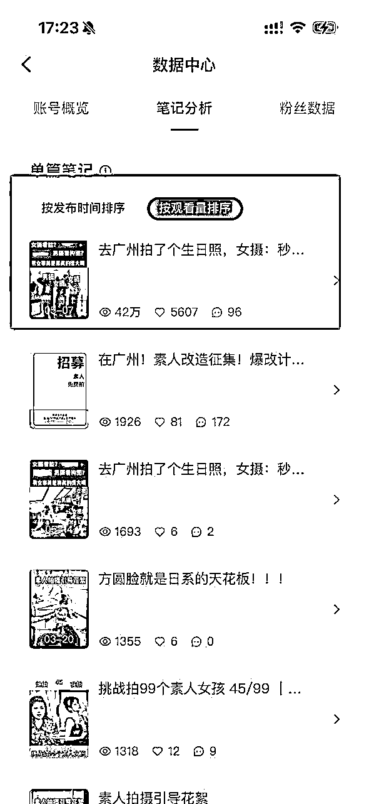

# 自我介绍

我是一个在广州的独立摄影师，目前没有自己工作室的，有合作的工作室，合作的意思用了才有消耗才有成本

引流获客，转化成交，摄影交付，目前是自己在做，当然重复性非专业的事情在外包（比如修图 化妆 助理 社群运营 ）

市场并不缺技术的人，缺的是把技术变现以及持续变现，以及如何持续高效高利润变现的人

所以我今年的想法是自己主要做前端引流，后续成交和交付的全部找专业的人合作，这样子才能更好的方放大，也能够更好地发挥自己的优势

接下来我分享一下我自己做的小红书经历，下面从4个部分介绍：

01为什么要像素及模仿爆款

023个地方找对标笔记

03如何高效对标爆款

04素人，做小红书的4大收获

# 01为什么要像素级模仿爆款

### 1-爆款是重复的

爆款＝70%的相似度×试错的频率

下面这些截图，基本都是爆款，除了数据之间的差异，其实其他的封面标题都差不太多

比如看设计师

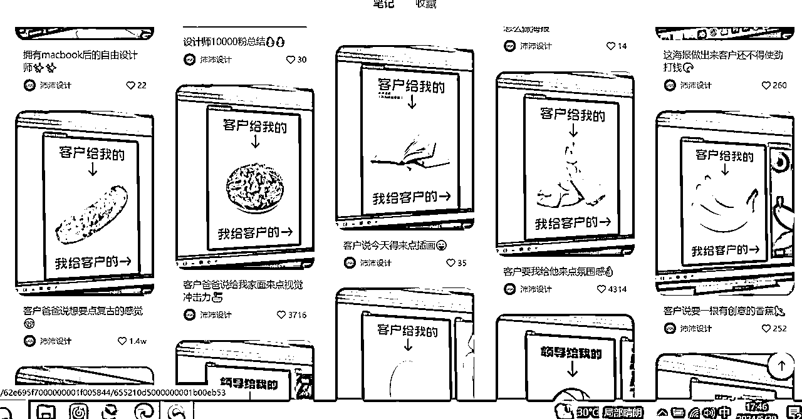

比如摄影的

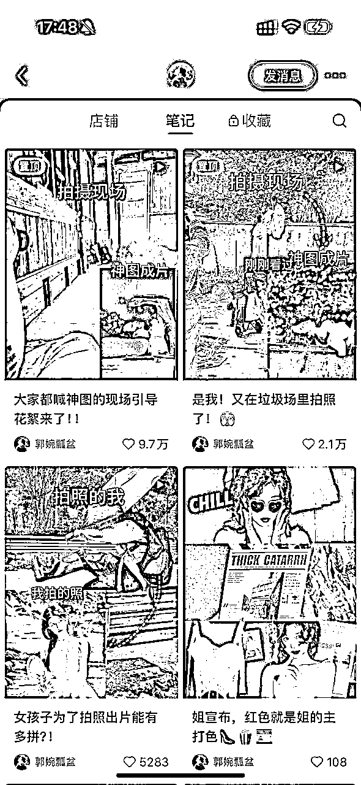

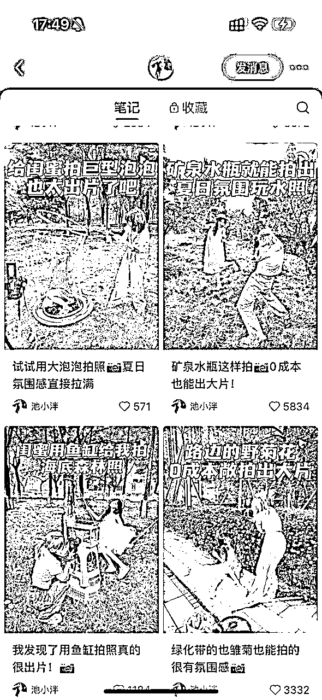

比如买衣服的

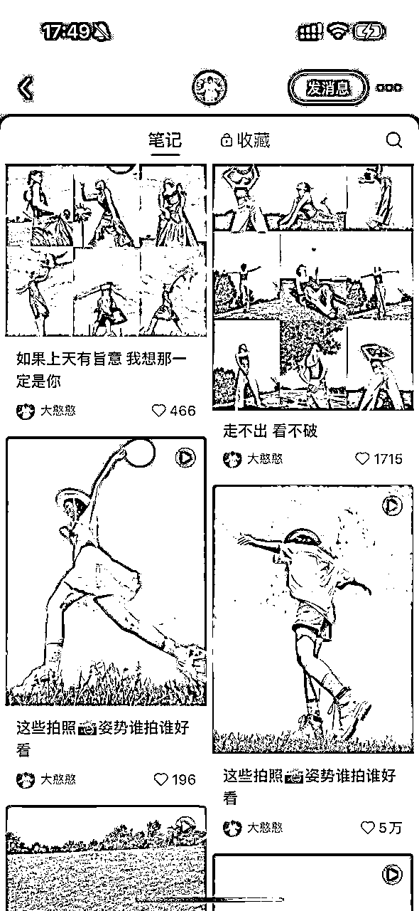

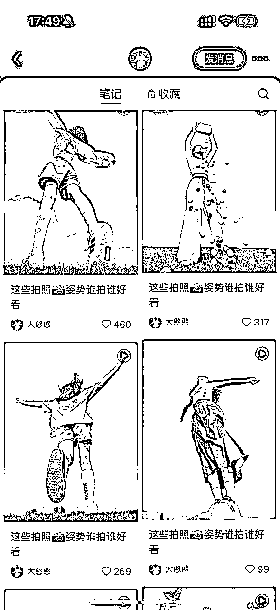

### 2-提高成功概率

如果自己的内容在一定的参考线上，这样才不容易出错

比如自己对标的是90分的内容，那自己做的可能不一定达到90分，但是能够起码保证刚好及格，那这种成功率就会比自己臆想的高很多

# 02在哪些地方找对标笔记

很多新手刚开始不知道怎么找对标，其实我也是一样经历，但是最近学习了一些自媒体的课程之后，以及看了梨云老师的小红书帖子分享慢慢就有了一些思路，分享一下我自己尝尝找对标的

总结有三个地方，分别是搜索框，对标帐号，数据分析

### 1-搜索框

比如说，我是摄影赛道，我要做的是个人写真的类目，但是只知道（摄影）两个关键词怎么开局？

输入摄影到检索框，下方会出现相方相对应的关键词可以让我们进行二次搜索，比如说(电影感)

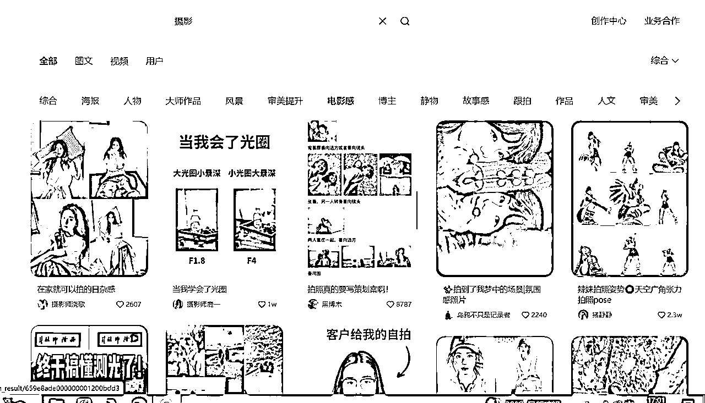

接着，我又用（电影感）关键词输入搜索框进行二次检索，同时也会出现相关的关键词，我们在取其中感兴趣的进行搜索就可以了

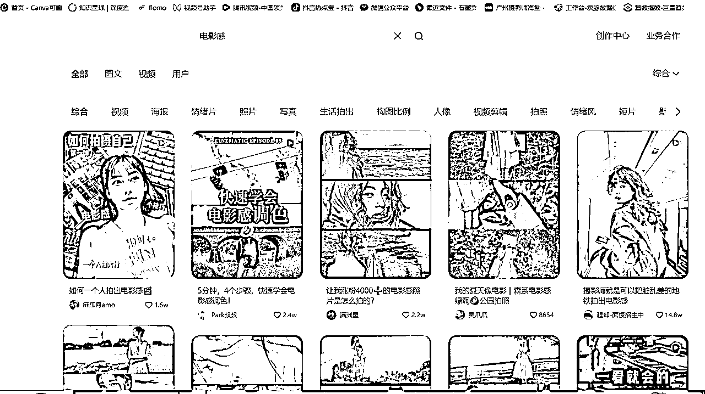

不停重复，就能够收集到摄影载到相关细分关键词的爆款笔记进行对标

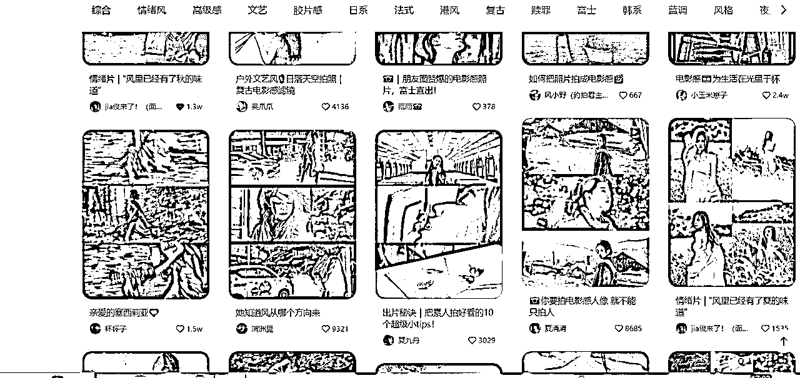

### 2-对标帐号

如果说你看到一个博主的的爆款笔记，爆了，可以点进他的主页。

如果说很多的爆款笔记，那就是你的天然选择库选题库

你可以围绕着对方的定位，他的赛道，输出方向，结合你自己的赛道，你自己的输出方向去看匹配度。

如果说他的选题跟你匹配度比较高，那你就值得你模仿一遍，如果说匹配度比较低，那你就要多次筛选，找出匹配度比较高的比较进行对标。

比如我的这个视频视频就是模仿的穿搭博主的，虽然行业不一样，但是人群相似，价值相似

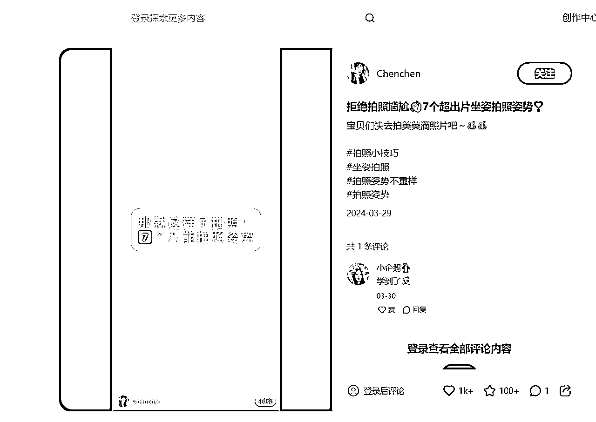

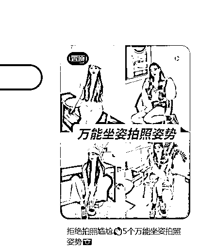

总之，同类账号同赛道账号，就是你天然的选择库

### 3-数据平台

比如说，这个灰豚数据的平台也可以去做筛选选题，不过要付费的，如果用的比较少的，可以去闲鱼买一些日卡 周卡什么的比较便宜

（我最近没开会员，所以就不展示如何搜索了，总之就是在笔记查找 热门内容，那里就搜索）

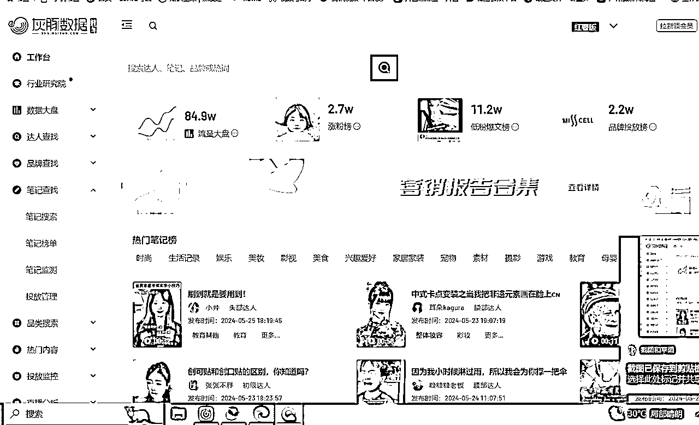

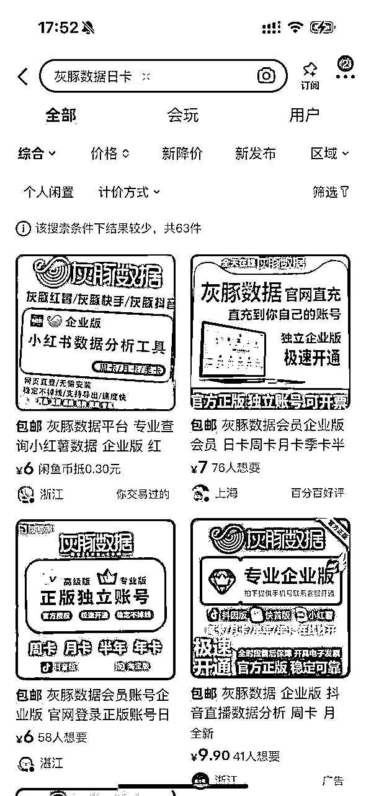

# 03如何高效对标爆款笔记

我觉得每个作为新人做小红书都有一个致命的思维，包括我自己过去一直都是，所以我做强直没有什么效果，直到最近思维开始变化了之后，小红书才有一些起色，接下来分享一下我的思维变化

### 第一，思维转变

开始意识到对标真的很重要！很多人入局小红书都有严重的处女情节，就是不愿意模仿，就是想想自己写，搞所谓的原创。

但是结果就是辛辛苦写的笔记几乎没有什么流量，所以原创和模仿真并不绝对的对立

所以不应该成为我们做小红书的绊脚石

就像是我们小时候学习写字，我们都知道有模仿的字帖，比如我刚开始接触摄影的时候，也是一比一的模仿照片来拍的，一比一模仿动作场景笑容

还有我学习画画也是一样

但是为什么长大以后，做事情不知道怎么就忘了这个思维，所以说对标思维真的真的很重要

所以在这个阶段的新人就是最主要的就是可以去学习小红书的运营，掌握他的底层规律，找爆款模仿，做多了，就慢慢理解他们其中的一些作用

### 第二，拆解爆款

要知道一个爆款的视频或者图文它的组成因素有哪些？

比如说视频的

一般由开头前3秒 ， 中间共鸣，结尾互动，BGM，还有标题➕封面➕标签➕留言➕钩子

我们可以按照这些框架去拆解，下面是我的拆解参考

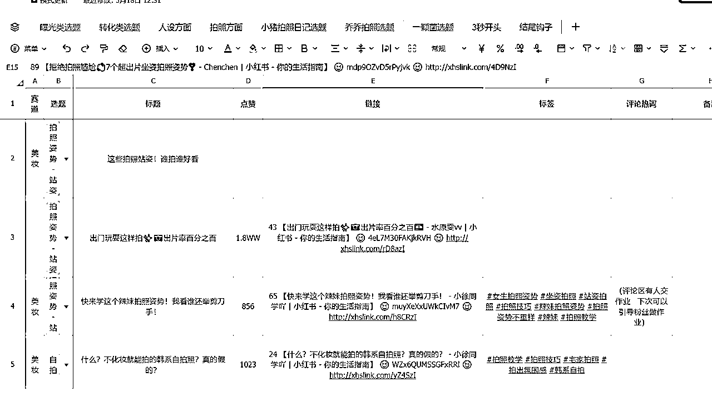

开头结构

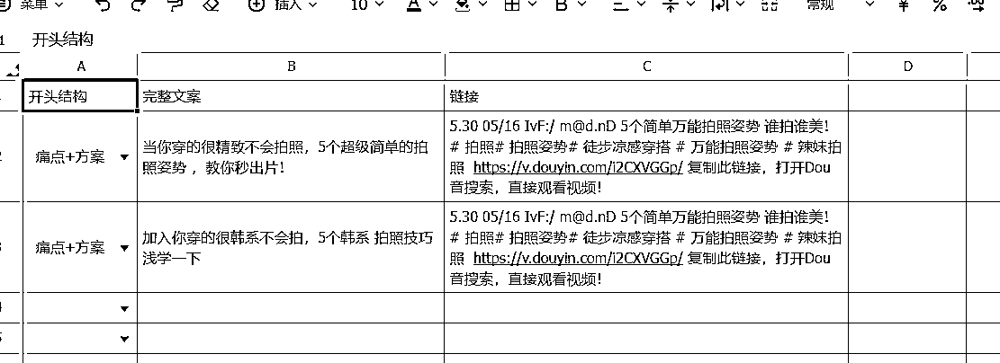

中间的节奏

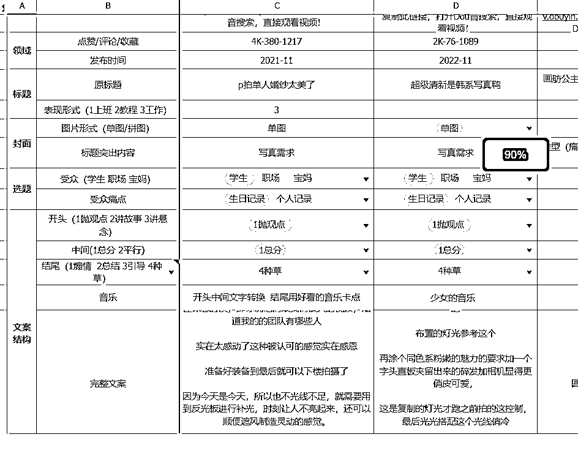

结尾钩子：

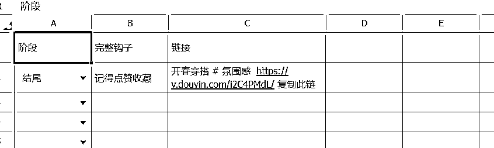

### 第三，1：1模仿

我的第一个40w爆款就是按照这个原视频创作的，没有一点改变，除了素材是我自己的，其他全一样

原视频：

【去新疆拍个婚纱照，女摄：秒懂！ 男摄：沉默…… - 新疆旅拍摄影师 | 小红书 - 你的生活指南】 😆 FHLqnQtVsJMwYS3 😆 http://xhslink.com/hI83LK

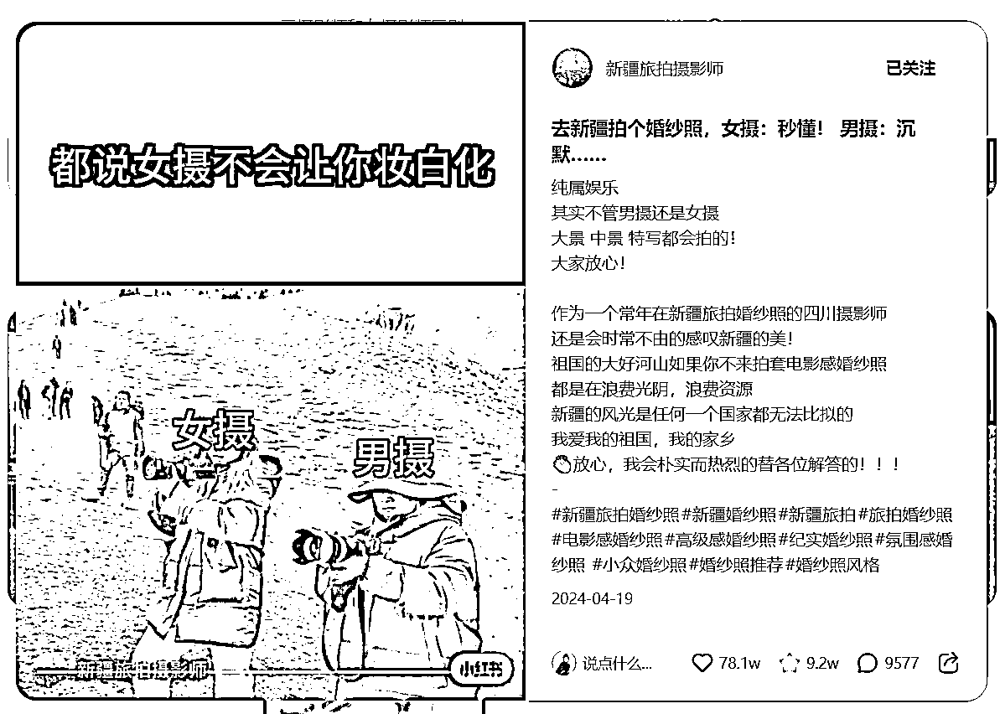

我的复刻视频：

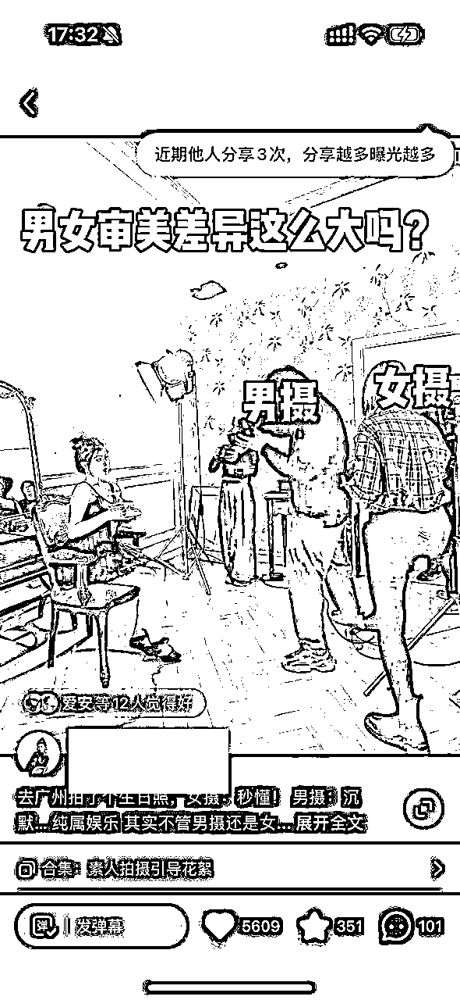

# 04素人，做小红书的4大收获

### 1，如果按照自己的想法做产品，只能最后卖给自己

我之前一直按照自己的想法做内容，从来没有考虑我的用户，市场，他们需要什么东西，所以我的数据不好，这是理所应当的

当我的思维转换过来之后，开始才才开始数据才有了好转

所以做内容的，首先一定要找到三方共赢的，首先用户需要，第二个平台需要，最后才是你需要的，要学会把自己的利益先滞后，这点真的真的挺重要的，如果总是想着自己的利益，那就很难把内容做好

如果总是想着自己的利益，那就很难把内容做好

### 2，成交，只是是冰山的一角

最近看到内容都习惯性的去思考这个他为什么吸引我？吸引的点是在哪呢？我为什么会点进去收藏？我为什么会被他成交？

这是我以前没有的思考维度……

有句话我还挺认可的

当你对自己越了解越多，揣摩的越多，你就越容易理解别人，最后这也更容易获得你想要的

### 3，时刻提醒自己不要低水平重复

我之前做内容，其实就是低水平的重复

我并不知道做内容，原来要一点点的去做优化

比如说我这个有了40万的爆款，那我有没有能力去复制他？

我知不知道他的爆款因子在哪里？

而不是说只是曝光一次，就没后续了，但是如果说想要持续的获得曝光，一定是基于对内容的深度理解和用用户喜好的了解深度，持续爆款的背后都是基于你时刻在优化，比如说优化你的文案，你的视觉垂，你的BGM，你的标题等综合因素

### 4，好心态决定了自己做自媒体能走多远

虽然要追求爆款，但是也不能一味地追求数据，因为如果说只是看数据的话，很容易陷入焦虑以及很难坚持，基本功 选题决定爆款的下限，运气 时机决定爆款的上限，爆款也是更多概率 运气

总之既要调整心态也要追求爆款，需要在两者之间去找一个平衡起码且热情的点，尽量不要让自己有太多的心理负担，这样才能走的更久，毕竟是媒体也是长跑的马拉松，持续性曝光比单次曝光更重要。