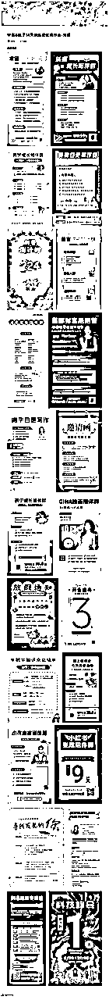
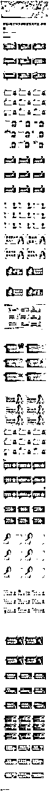
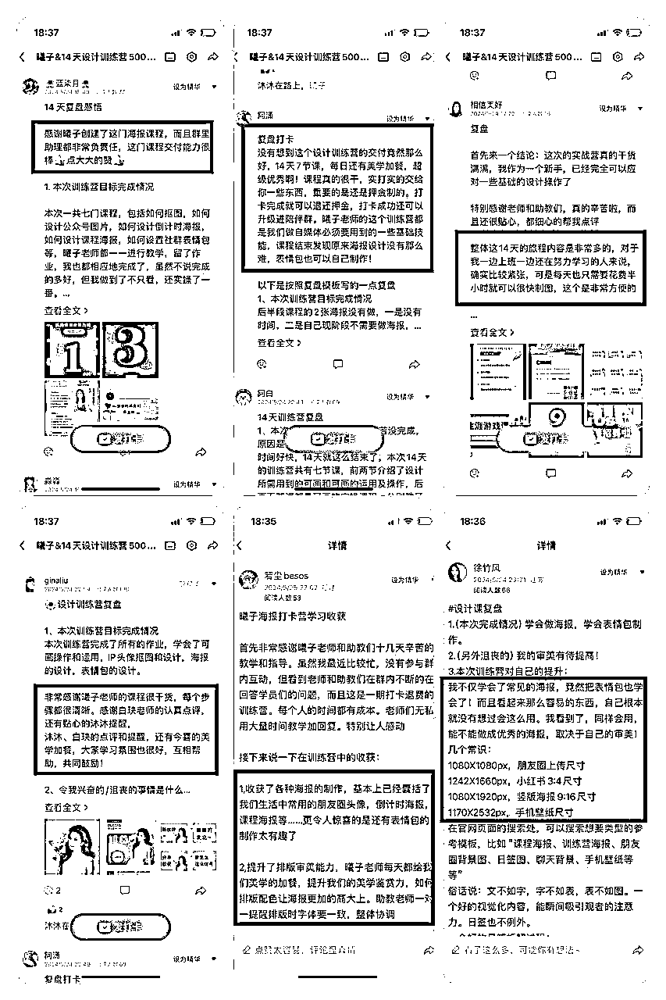
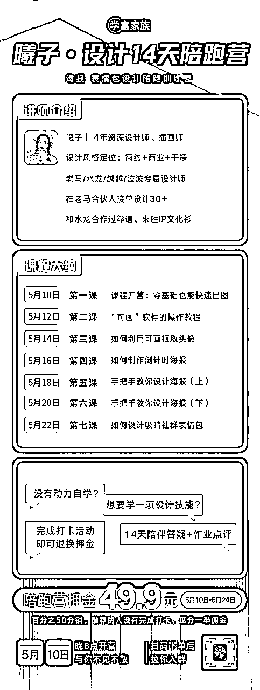
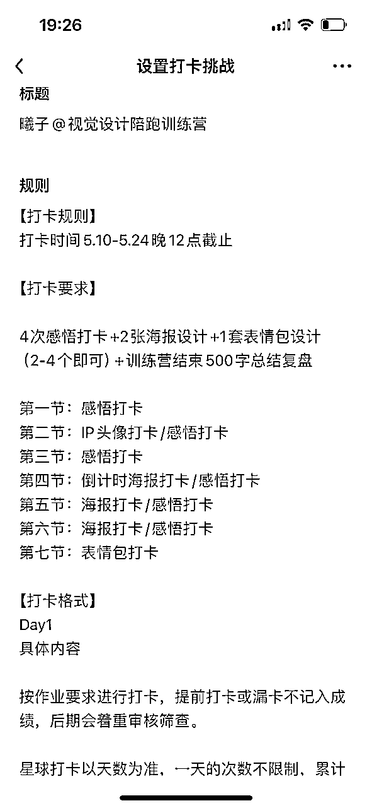

# 《新手初次举办14天设计训练营，带出了50+优秀设计作业，复盘好评率90%，曦子教你如何从0-1打造一门简单的训练营》

> 来源：[https://ys5n5rzrv4.feishu.cn/docx/N9SzdTUWmoDWvDxM7rScKn0qnrb](https://ys5n5rzrv4.feishu.cn/docx/N9SzdTUWmoDWvDxM7rScKn0qnrb)

大家好呀，我是曦子，4年资深设计师｜插画师。

自从上次应鱼丸的邀请，做了表情包的教程视频以后，被更多人看到，曦子利用了设计这项技能，帮助很多IP制作海报、表情包等衍生设计。

下方是表情包教程的链接：

知识星球 | 深度连接铁杆粉丝，运营高品质社群，知识变现的工具

在做了40+设计案例以后，水龙哥建议我去做训练营，帮助更多的自媒体IP解决美学苦恼。

因为说实话，对于自媒体IP来说，如果他们有自己的社群或其他知识付费产品，要么是自己做，要么还是请设计师来做。

请设计师来做，很多时候中小IP支付不起设计的费用，自己做又缺乏专业设计指导。

在深刻洞察到这个需求后，我知道自己能够帮助用户解决这个问题，所以，便行动起来，去策划一场设计训练营。

这也是我第一次举办一场活动，最终活动参与人数153人，3天的营业额达7634.7元，最后结营后，曦子还升了第三期4个季度私教，训练营累计赚了5000+。

训练营结束统计，有70%都认真打卡，退回了押金，训练营还产出了50多份优秀表情包作业+海报设计作业，我截取了部分优秀作业，详情见下图。

同时还积累的不错的口碑，训练营的复盘好评率达到了90%，以下是一些复盘反馈：

很感谢生财，让曦子的设计技能被更多人看到，也链接了很多优秀的自媒体同行，有些还有深度合作。

这里曦子主要和大家分享下，做设计训练营的完整sop，希望能够给大家带来一些启发。

# 一、开营前的宣传和策划

### 👉准备工作有哪些

#### 课程的内容策划大纲

1.  内容框架（总共有几节课，每节课分享的主题是什么）

课程内容规划：从软件基础-简单头像-海报设计-表情包设计，涵盖了大多数自媒体IP做私域的美学痛点。

课程设计思路：先带大家介绍规则，熟悉软件的基础操作，从最简单的海报开始熟练软件操作，进一步选择中度的海报设计带大家实操，刚开始怕大家觉得有难度，还提供了模版，然后继续加大海报的设计难度，最后再全面讲解表情包的设计，在表情包设计的部分，提供了电脑端和手机端以及视频的教程，算是非常全面了。

7节课程目录：

1、活动规则介绍

2、软件的基础操作

3、个人IP头像设计（中等）

4、倒计时海报设计（简单）

5、写作社群海报设计（简单）

6、陪伴社群海报设计（中上）

7、社群表情包的设计（中 ）

1.  每次分享的流程（@所有人+当日课程分享+课程回顾+当日作业）

#### 评估运营成本和设定押金

1.  小助理运营成本

1.  运营人员各自负责的板块（投注时间）

1.  拉群+统计+答疑+点评+用户沟通

1.  主理人的运营成本

1.  主理人需要策划整个活动流程

1.  主理人需要写课程内容

1.  主理人需要去不同的社群做分享吸引意向用户

1.  主理人需要设计海报

1.  主理人需要答疑

1.  主理人需要管理运营团队

1.  押金（需要有盈利）

1.  需要扣除的费用

1.  刨去小助理运营

1.  刨去主理人运营

1.  刨去推荐人分销佣金

1.  刨去打卡成功退回去的（假设在60%-80%）

1.  盈利来源

1.  自己推荐（打卡失败押金）

1.  他人推荐（打卡失败佣金）

1.  转化高客单（私教）

#### 训练营开营海报

1.  海报的整体风格

1.  统一品牌风格

1.  用可画或者ps制作海报

1.  海报的内容文案模块

1.  主理人介绍

1.  训练营课程大纲

1.  适合人群

1.  具体价格和福利

此次训练营的海报如图：

#### 朋友圈宣传文案

曦子14天设计训练营，前期主要是靠在龙哥的8个社群文章分享吸引了50+人完成冷启动，然后朋友的转介绍。

朋友圈主要围绕以下几个点去宣传，很快就来了几十个朋友报名。

1.  造势

1.  说产品牛逼的点

1.  说产品相关的牛逼的人

1.  说产品差异化的点

1.  说产品取得的成绩点

1.  预售

1.  露出一部分权益、把势能抬高

1.  结合不同场景、不同目标群体， 设置情景触发用户购买

1.  发售

1.  直播、公众号、视频号等运用公众平台

1.  涨价小技巧

1.  逆着人性让自己的产品更值钱

1.  卖爆了

1.  对不同的标签用户进行跟单

1.  释放付费用户的反馈和成功案例

#### 人员分工、找到自己的协助伙伴

1.  设计训练营分工

1.  社群模块（主答疑）

1.  设置社群群公告

1.  拉群（欢迎新人话术）

1.  解决#举手（答疑）

1.  整理社群内常见问题归档

1.  给完成打卡的伙伴打标签

1.  沟通用户纷争

1.  拉群退押金

1.  设计证书、颁发证书、组织话术

1.  星球（打卡）

1.  设置星球打卡规则公告

1.  每日点评10-20份作业打卡

1.  统计星球成功完成打卡作业名单

#### 提前拉群设置好群公告和星球规则

1.  群公告

1.  重要信息飞书文档

1.  训练营简介

1.  导师介绍：曦子

1.  运营人员介绍：沐沐/今喜/白玦/橘云

1.  学习方式：图文课程+技能实操+星球作业打卡

1.  社群规则

1.  修改下单昵称和星球昵称一致

1.  训练营的时间

1.  训练营课程安排和具体打卡规则

1.  训练营每节课的作业要求

1.  训练营的打卡格式

1.  训练营课程海报

1.  修改下单昵称和星球昵称统一

1.  如果不统一，会增加后期打卡完成的审核难度

1.  训练营课程分享形式

1.  （图文课程+技能实操+星球作业打卡）

1.  打卡格式和要求

DAY 1 xxxx

DAY 7 500字复盘

1.  温馨提示

1.  告诉大家要跟上学习的节奏，以及有问题及时在社群咨询

1.  星球规则

1.  标题

1.  打卡规则

1.  打卡时间

1.  打卡要求

1.  打卡格式

#### 准备社群分享稿、随时准备链接人脉做分享（获取流量）

1.  展示案例

1.  展示成就

1.  展示个人背书

1.  产品对于用户群体的重要性

1.  展示训练营海报

# 二、开营的社群运营和维护

### 🌟运营和维护的细节

1.  社群搭建：确定社群的定位、规则、架构等，创建良好的社群环境

1.  内容规划：制定社群分享的加餐主题、保持内容的丰富性和吸引力（小助理的每日加餐分享）

1.  一方面拆解自媒体IP常见的痛点（审美、配色、海报等）

1.  一方面分享优秀的作业在群内进行点评

1.  价值传递：明确并持续向成员传递社群的核心价值和独特卖点

1.  曦子的设计训练营核心卖点就是课程实操性强、交付实在

1.  成员管理：审核新成员，处理违规成员，维护良好的社群秩序

1.  一旦发现违规成员引流、引导关注的行为一次警告、二次踢出

1.  互动引导：鼓励成员之间积极互动交流，及时回复问题和反馈

1.  因为是押金制，所以学员必须完成实操海报作业打卡，鼓励大家发到群里，小助理耐心解答

1.  意见收集：可以利用复盘或社群接龙作为意见收集

1.  目前我认为复盘里添加对训练营的建议是很好的意见收集方式

1.  关系维护：认真回答认真做作业的学员的疑问

### 🌟作业点评的方式

1.  海报的作业

1.  从背景、标题、内容文案层级、价格设计、配色、等方面去点评

1.  感悟的作业

1.  夸夸对方做的努力

1.  夸夸对方取得的成绩

1.  鼓励对方可以做得更好

# 三、训练营所需的物料

### 文案物料

1.  开营前的宣传文案

1.  开营前让大家准备自我介绍的文案

1.  开营邀请入群的文案

1.  温馨提示用户打卡文案

1.  让大家提交复盘作业的文案

1.  统一拉成功退押金的伙伴的文案

1.  委婉告知未完成打卡，期待下一期参加圆满打卡的文案

1.  结营仪式+颁发证书文案

### 海报物料

1.  训练营课程介绍海报

1.  训练营课程内置的模板

1.  入营证书和结营证书

### 答疑文档

1.  搜集用户常问的问题，用飞书文档记录，以便用户查阅

# 四、训练营结营收尾

### 💛课程结束后何时结营以及解散群聊

1.  课程结束2天后结营，一周内解散群聊

*   课程结束后需要@大家保存群公告的重要课程文件

*   在结营时也分享一下自己的私教产品，最终在2天内招满了第3期私教（转化私教）

*   在结营期间，鼓励大家可以补差价入陪伴群（转化陪伴群）

### 🧡审核退押金的方式是什么

1.  根据课程的打卡要求来退押金

*   至少2张海报设计打卡+（2-4）个表情包打卡+4次感悟设计+1次500字复盘

### ❤️审核成功以后如何拉群

在课程分享结束后，小助理需要对打卡成功的人备注标签，根据标签进行拉群，由主理人给大家统一退

### 💜如何退押金、以及什么时候退、怎么退

*   通过打标签拉群的方式退押金

*   一般在训练营完全结束以后退押金，也就是在群正式解散以后，在结营期间，还是有不少用户会选择人陪伴群，那既不入曦子陪伴群又打卡失败的伙伴，需要和推荐的人瓜分押金。

### 💙如何发放证书、鼓励用户转发朋友圈

*   一般在课程结束和结营分享期间把证书制作完成

*   在结营分享后，颁发证书、鼓励用户转发朋友圈可以优惠参加下一期训练营，让用户行动，就得让用户获得一些好处

# 五、写在最后

以上是曦子操盘一个14天设计训练营举办流程完整sop，颗粒度非常细。

曦子之前从来没有做过训练营，第一次去做，扎扎实实积累了搞活动的能力。

之前龙哥说过一句话，我觉得很有道理：人生就是不断尝试和自我突破的过程。

相信下一次设计训练营的举办，曦子会做得更好，在此基础上，不断去迭代优化。

我是曦子，最懂私域的资深设计师。

希望我这个文档，多少能够帮到大家。