# 蝉妈妈-品牌商品数据采集与分析RPA程序（自动采集&分析蝉妈妈近7天内前10名品牌的商品数据）

> 来源：[https://x0gnb2e1yj.feishu.cn/docx/NMRfdTVUyoimtQx4aGjch5gjncd](https://x0gnb2e1yj.feishu.cn/docx/NMRfdTVUyoimtQx4aGjch5gjncd)

😁大家好，我是RPA研究院院长-商叁，这次给大家带来一篇关于蝉妈妈-品牌商品数据采集与分析的RPA流程设计。通过RPA技术实现自动化采集运营数据，店铺概况、取数日期、商品图片、商品链接、首次上架时间、最新到手价、历史最低价、销量、销售额、转化率等运营数据。帮助卖家跟踪头部品牌商品的销售情况和市场动态，为优化商品策略、提升销售业绩奠定坚实基础。

# 🚀 程序介绍

蝉妈妈-品牌商品数据采集与分析RPA程序是一款针对电商卖家设计开发的自动化数据分析工具。它利用先进的RPA（Robotic Process Automation，机器人流程自动化）技术，实现自动采集&分析蝉妈妈近7天内前10名品牌的商品数据，帮助卖家全面掌握市场动态和商品表现。

（Excel：结果展示，后续均为采集过程）

# 🎟 功能介绍

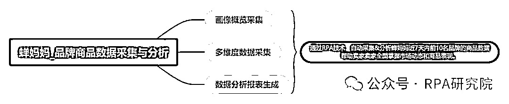

1.画像概览采集：通过自动化采集性别、年龄和地域消费者的购物需求和偏好等品牌画像数据。帮助卖家在商品设计、包装和营销策略上进行针对性调整，更好地满足消费者的需求，进一步提升市场竞争力。

2.多维度数据采集：通过自动化采集运营数据，店铺概况、取数日期、商品图片、商品链接、首次上架时间、最新到手价、历史最低价、销量、销售额、转化率等运营数据。帮助卖家跟踪TOP品牌商品的销售情况和市场动态，为优化商品策略、提升销售业绩奠定坚实基础。

3.数据分析报表生成：通过自动化整理和分析多个关键数据维度，如店铺概况、商品信息、销售数据、消费者画像等，帮助卖家自动生成一份详细的数据分析报表，帮助卖家快速理解数据背后的趋势和规律。

# 🛠 业务流程图

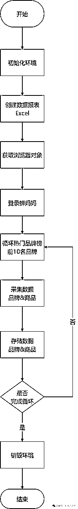

# 📟 业务代码（影刀 RPA）

主流程

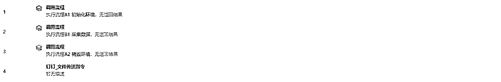

A1 初始化环境

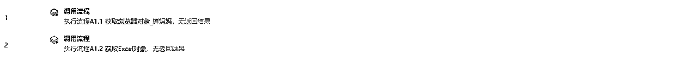

A1.1 获取浏览器对象_蝉妈妈

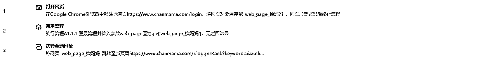

A1.1.1 登录流程

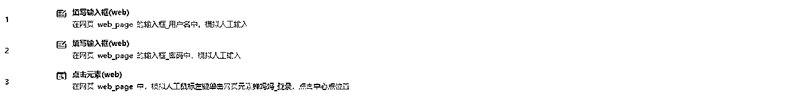

A1.2 获取Excel对象

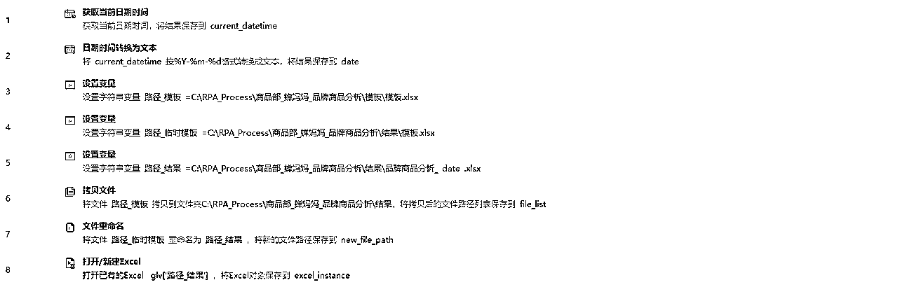

A2 销毁环境

B1 采集数据

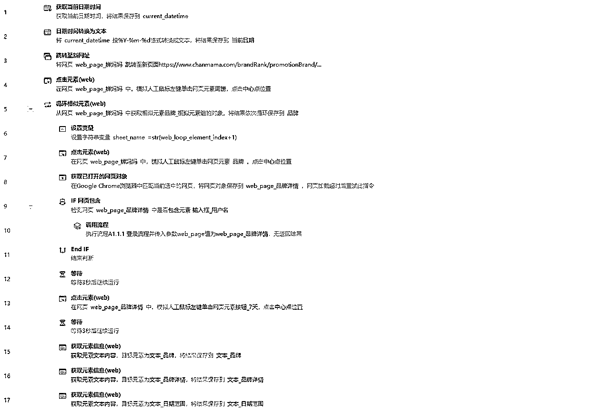

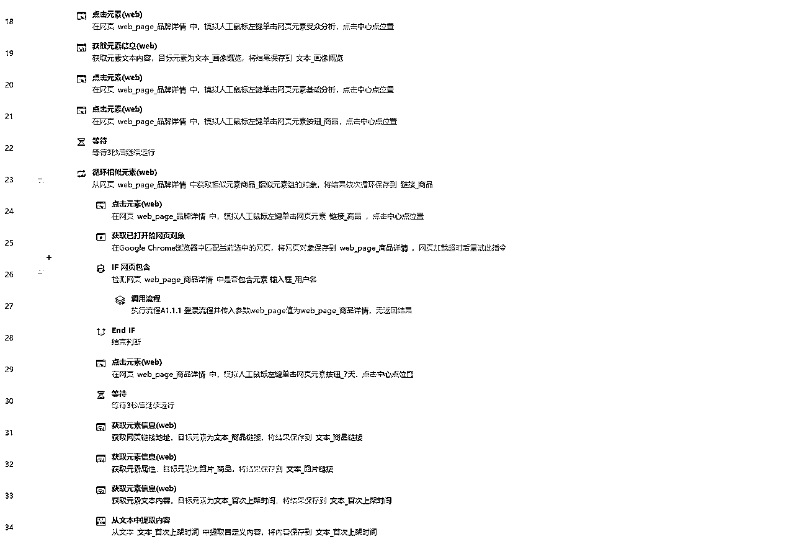

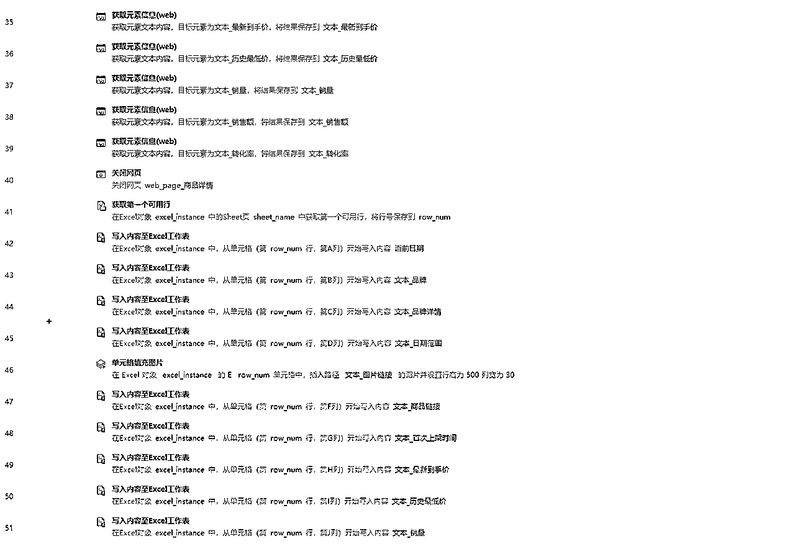

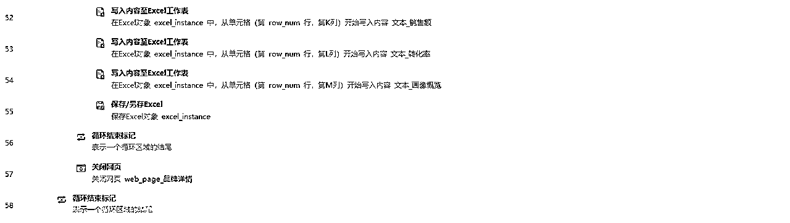

🥂RPA研究院院长-商叁，Base：广州

拥有12年经验的互联网老兵，目前在一家年产值8亿的电商公司担任RPA技术负责人。

主要职责包括领导并推动公司在抖音、快手、视频号、拼多多、唯品会等多领域的RPA业务程序开发。

欢迎对RPA技术感兴趣的朋友一起交流