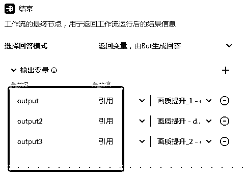

# 王炸更新！利用coze图像流搭建线上写真馆，月入过万不是梦！让你从清纯学生一秒变身黑丝女王！

> 来源：[https://szxb4qbve7.feishu.cn/docx/OCxydP0N8ojPj0xvCWKcyvSdn6c](https://szxb4qbve7.feishu.cn/docx/OCxydP0N8ojPj0xvCWKcyvSdn6c)

什么？即将毕业的你还在为拍写真集烦恼？

翻遍小红书各种AI写真收费都不低。

那你为何不自己搭建一个AI工具做个线上写真馆呢？

好吧，先来看个效果吧。

这是我的一个小姐姐照片

利用“完美写真馆”生成三种风格的照片

01 职业范

02 校园范

03 女王范

来看看我怎么做的吧

1 搭建图像流

分别建立3个风格的写真图像流

开始——多图融合——智能换脸——画质提升——结束

然后分别把3种参考图上传至多图融合。（这就是我们的写真模板）

2 举例说明

1）在图像流添加多图融合，并把开始节点相连接

2）按图所示添加参数，如果不懂怎么填可以用鼠标点击参数后面的感叹号

3）在image1 上传参考图（模板图）

4）继续添加智能换脸节点，参考图链接开始的图片，模板图链接多图融合的生成好的图片

5）然后添加画质提升节点，链接至智能换脸

6 ）最后链接至结束，添加输出的参数

3 按照这个流程制作3个图像流，然后再添加3个输出设置。

4 制作好3套模板的图像流，点击试运行测试一下，如果能跑通，最后点击发布即可。

5 创建一个“完美写真馆”bot，写出提示词，并把该图像流添加至bot

6 全部设置好了，点击发布就可以使用了

点击下面链接即可体验“完美写真馆”

https://www.coze.cn/s/ijePdwff/

大家如果对图像流感兴趣的可以评论，我会一一回复大家的。