# 行业/博主爆款笔记批量采集

> 来源：[https://aaywqwo0zxd.feishu.cn/docx/Z7n6dmJ11otc5ixuS2TcXFj2nzf](https://aaywqwo0zxd.feishu.cn/docx/Z7n6dmJ11otc5ixuS2TcXFj2nzf)

你好，我是智库老李！

插件下载地址：

https://wwbk.lanzouq.com/iDNt72nv81ij （试用版）

https://wwbk.lanzn.com/iuyxO2wgareh（自动版）

---

需要插件+Tin240421

---

注意：

1.  使用谷歌浏览器加载

1.  谷歌浏览器下载地址： https://www.google.cn/intl/zh-CN/chrome/

1.  解压的时候，里面会嵌套一个文件夹，加载不成功就是这个原因

1.  如果失效，请在给我评论留言，好用，也给我留个言

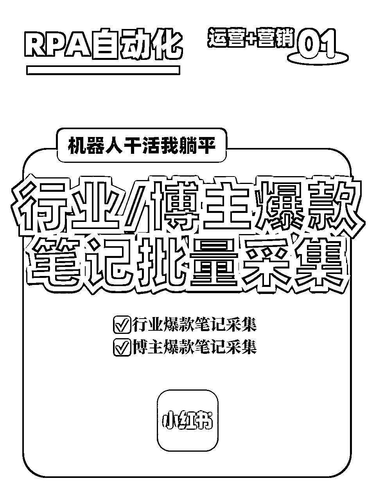

今天和大家给大家分享一款小红书【行业/博主爆款笔记采集插件】：烤红薯（试用版）

# ➡️主要功能

✅ 行业爆款笔记采集

✅ 博主爆款笔记采集

✅ 可采集数据如下

1.  标题

1.  笔记链接

1.  点赞数

1.  博主主页链接

1.  博主昵称

这2个功能，满足我们日常的选题采集和对标博主筛选，完全够用了！

当然，由于这个插件是刚做好的，应用市场无法下载，使用上如果你有问题，星球名片可以找我！

# ➡️安装教程

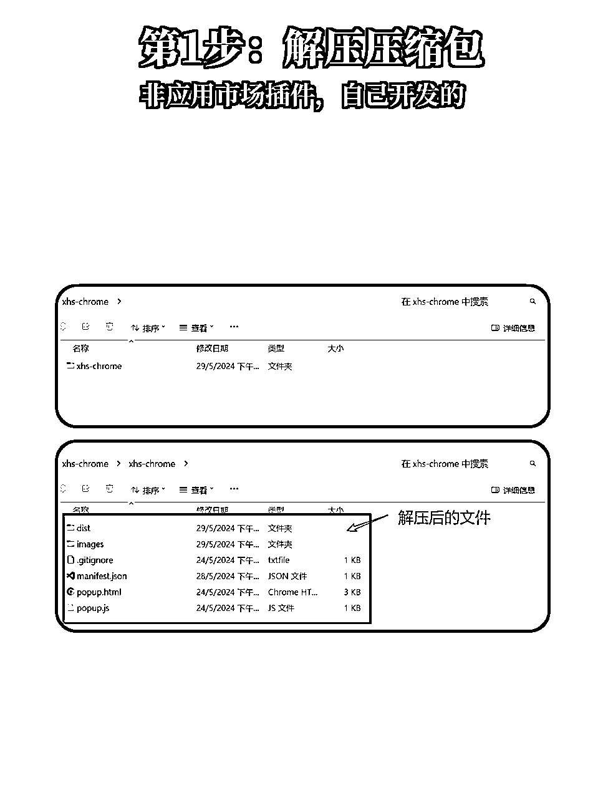

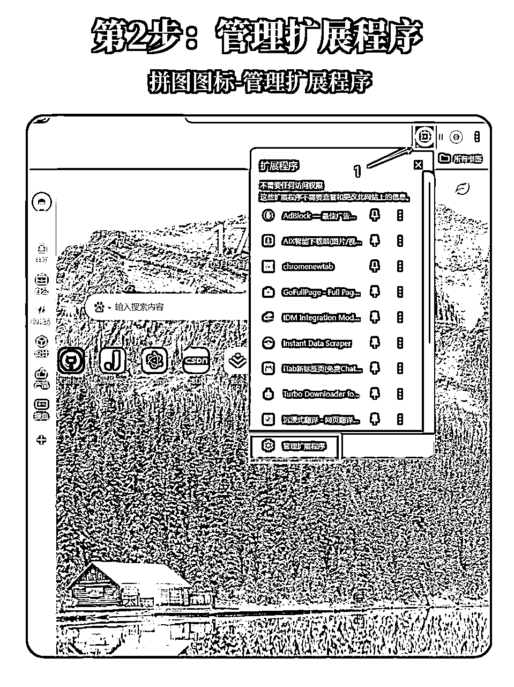

如果浏览器没有对应的图，biao，按找个方法找到管理扩展程序：

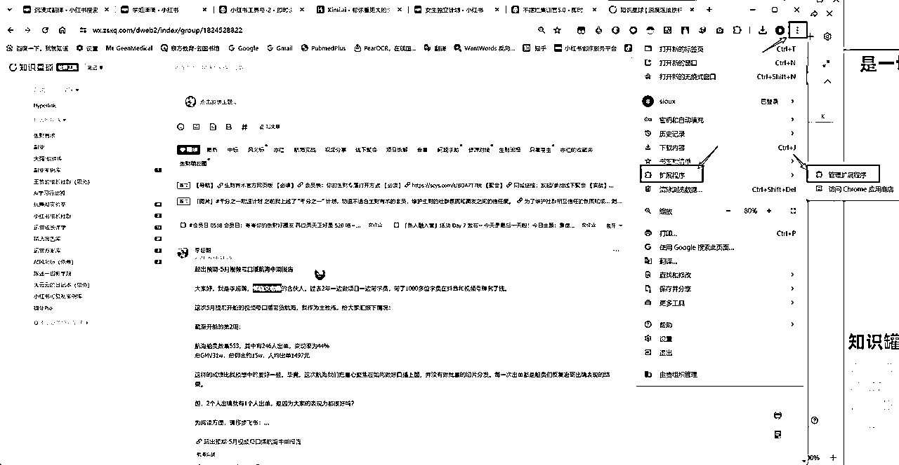

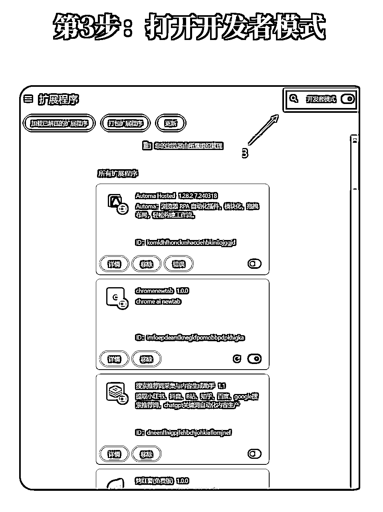

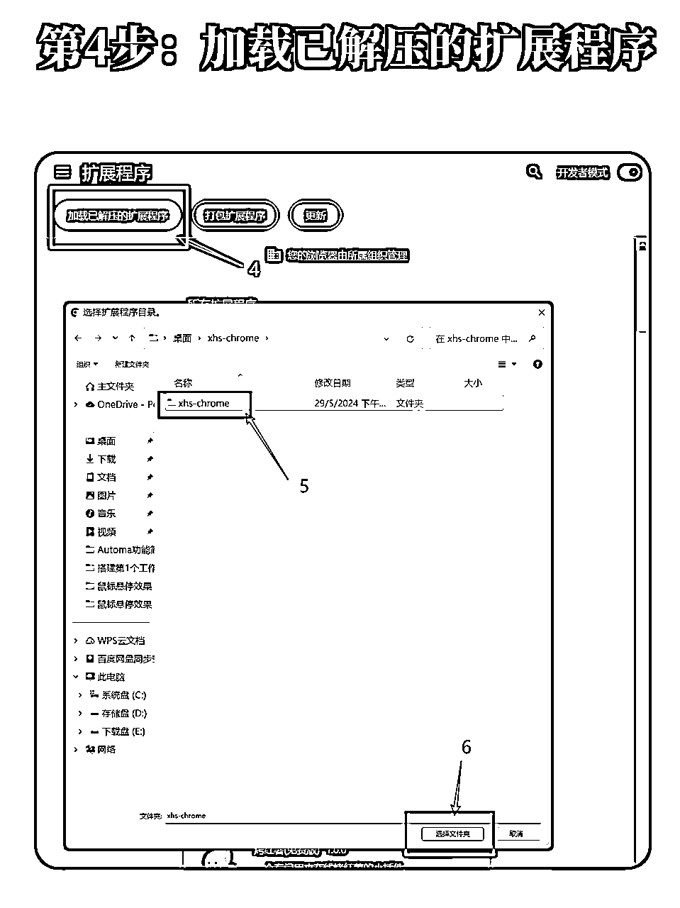

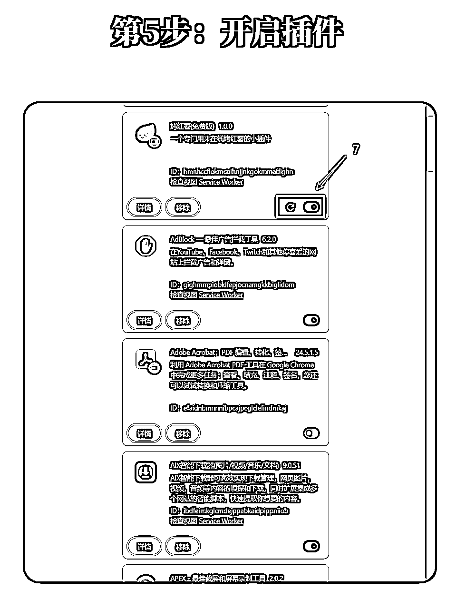

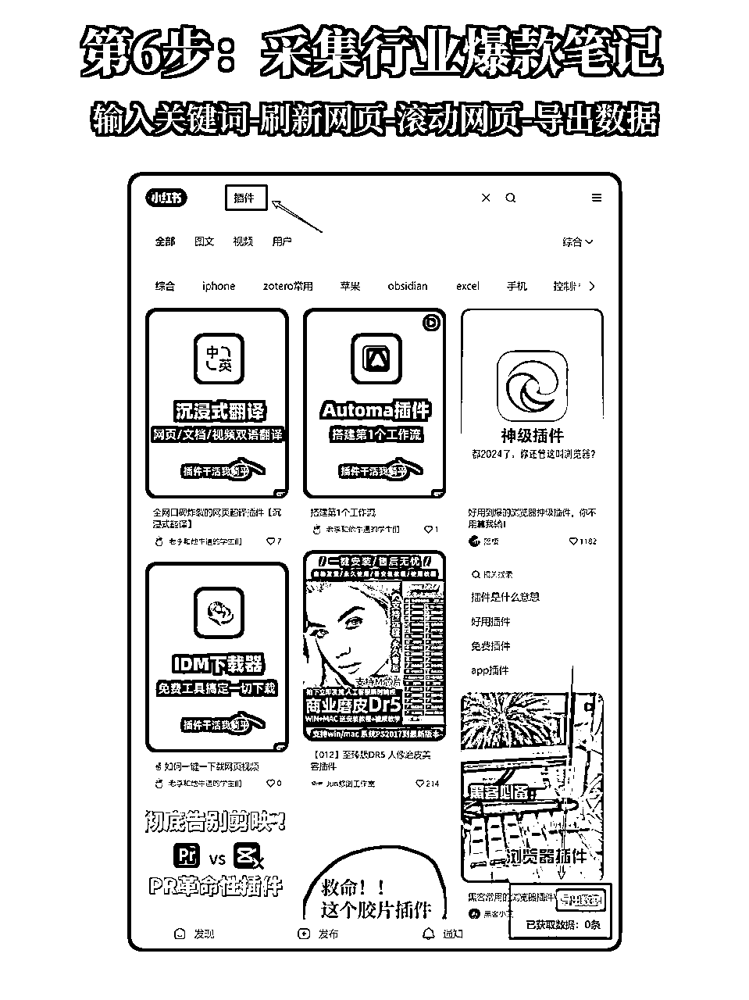

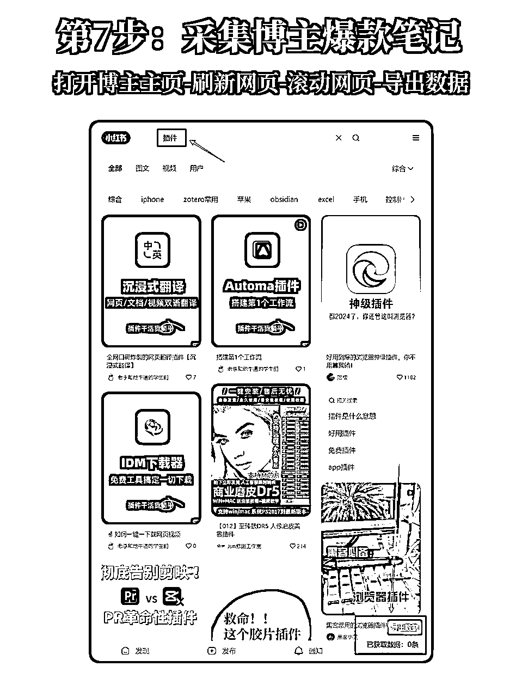

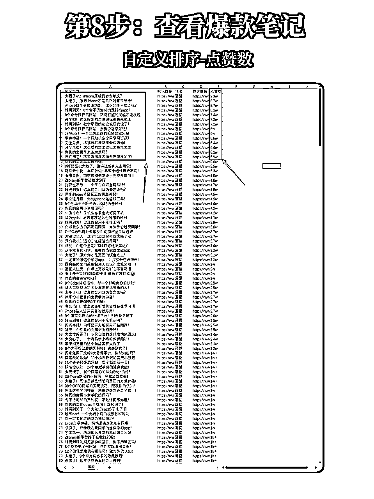

👉选对一个合适的工具，可以让我们少干半个月的活。

#行业笔记 #爆款选题 #博主笔记 #插件 #插件网站 #小红书数据 #浏览器插件 #插件安装 #RPA #rpa机器人 #神仙软件 #效率工具

# ➡️排序教程

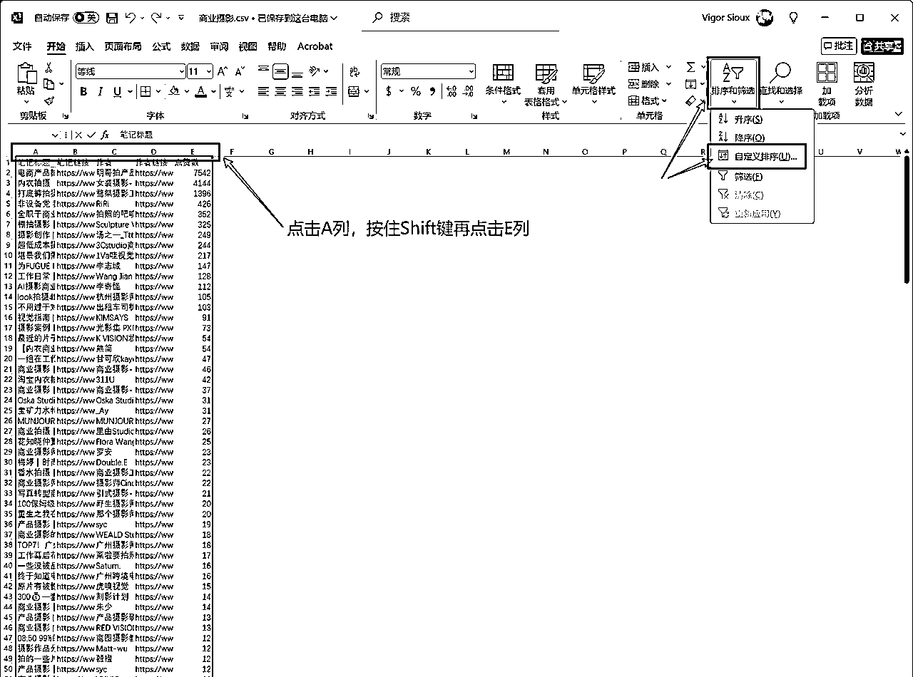

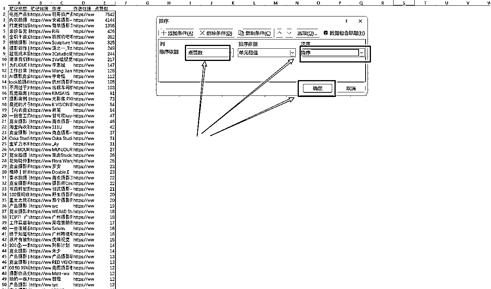

# ➡️常见问题

## 未能成功加载扩展程序？

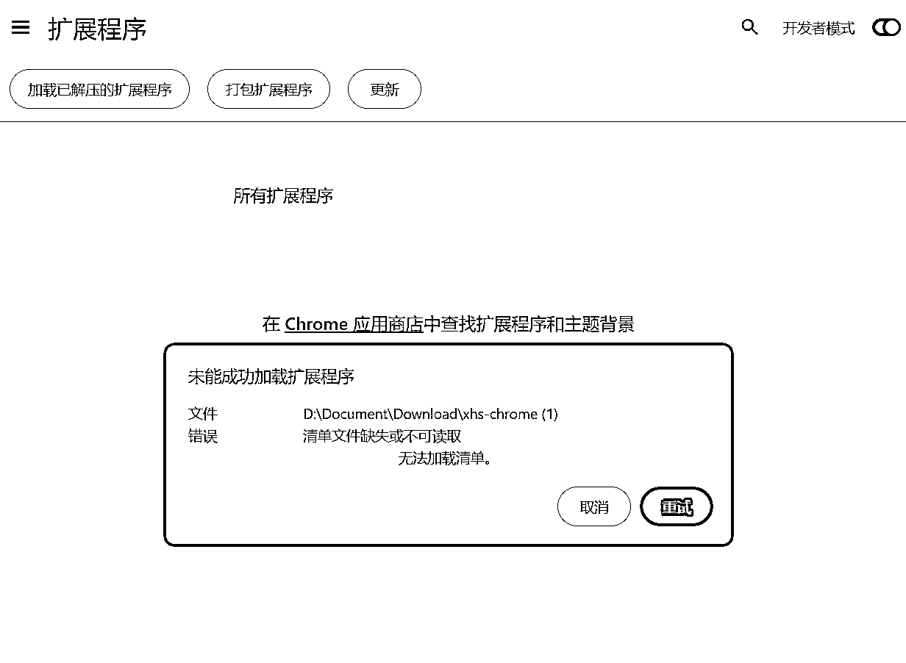

解压的时候，里面会嵌套一个文件夹，加载不成功就是这个原因，意思是XHS-chrome下面还有一个XHS-chrome文件夹，加载下一级的这个XHS-chrome文件夹即可

## 装好了，但滚动不抓取？

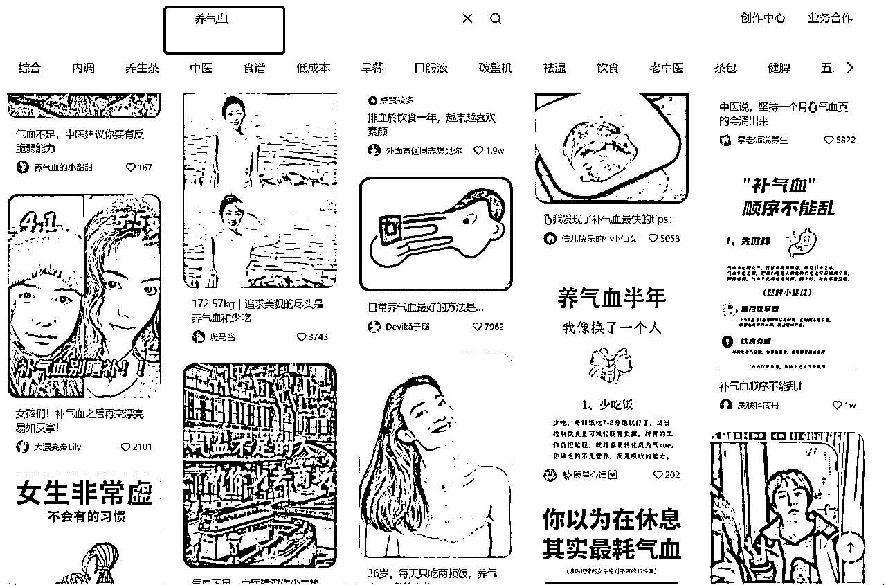

输入关键词以后，多刷新几次网页就出来了