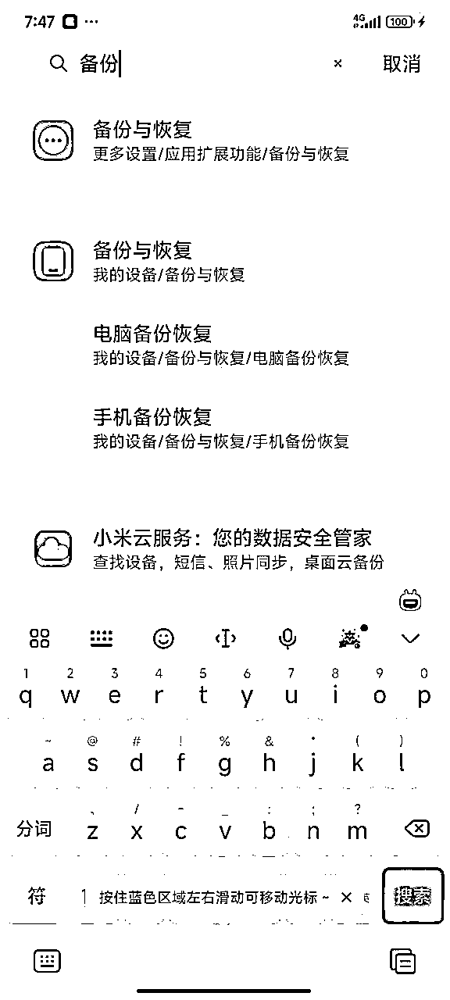
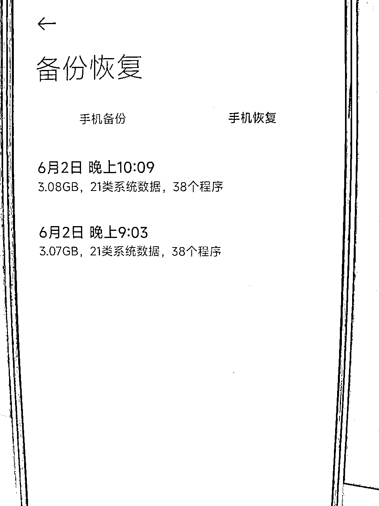

# 小红书账号如何备份

> 来源：[https://zwbfnc29pf1.feishu.cn/docx/Q0pRdjCLroQW2KxQgRicbZEhnSe](https://zwbfnc29pf1.feishu.cn/docx/Q0pRdjCLroQW2KxQgRicbZEhnSe)

# 什么是备份？

首先先给大家科普一下备份是什么意思，他的作用是什么

备份：是指将真机的数据存储到电脑上进行养号，等需要使用的时候再恢复下来的一个方法。

比如你刚登录上的一个新号，如果你想要打创业的内容，直接发那肯定是容易违规，这个时候，你把他备份到电脑里面，一个月后再恢复到手机里面来。

这样的话你这个号就是一个养了一个月的号了。它不会占用你的手机，不然如果所有号都在手机上面养的话人效特别低。

当然备份养号肯定没有真机养号好，但是胜在方便快捷。

# 小米手机如何完成一次备份？

## 一、小米手机备份到电脑

### 1.手机设置找到备份与恢复功能

### 2.选择手机备份恢复

### 3.点击立即备份

当然也可以单独选择小红书，只备份小红书软件

等待备份完成即可。

### 4.用数据线连接电脑

此时显示弹窗，选择文件传输。

（如果没弹窗的话，手机开发者模式里面将默认USB设置改成传输文件）

### 5.打开AllBackup文件夹

打开我的电脑，点开连接的手机，依次点开里面的MIUI---backup---AllBackup选项。

此时就会看到我们备份的文件（如下图）

### 6.将备份的文件夹复制到电脑里

（注意不要剪切，万一手机和电脑接触不良，文件就会缺失，不要图省事，老老实实的复制粘贴，后删除手机备份）

## 二、电脑恢复账号到小米手机

### 1.双清完成后的手机连接到电脑

### 2.打开AllBackup文件夹

打开我的电脑，点开连接的手机，依次点开里面的MIUI---backup---AllBackup选项。

### 3.将备份文件夹拖回AllBackup文件夹

（这里记得还是要复制粘贴，不要剪切，怕文件下载不完整，无法挽回）

#### 4.手机打开备份与恢复，选择手机恢复

### 5.点击到你要恢复的文件，恢复到手机即可

如上，便完成了一次小米手机的备份操作

# 苹果手机如何完成一次备份？

## 一、苹果手机备份账号到电脑

### 1.打开爱思助手，手机连接电脑

### 2.点击工具箱里面的备份与恢复

### 3.点击全备份设备

### 4.点击立即备份

也可以修改文件存储地址

## 二、电脑恢复账号到苹果手机

### 1.爱思助手连接手机

### 2.点击工具箱里面的备份与恢复

### 3.点击全恢复数据

### 4\. 勾选你要恢复的文件，然后点击全恢复

以上便是苹果手机备份与恢复的教程，切记要是同一机型。

# 备份玩法的一些注意事项

1.请务必备份一次，刷一次机，不要偷懒，很多朋友，备份好几个号才刷机一次，最后发内容的时候，卡播放量，卡播放量的，99%都是在做准备工作的时候偷了懒。

2.备份玩法现在已经没有曾经刚出来那么暴力了，现在普遍建议你备份15天以上。再去使用，越垃圾的手机备份的时间越需要久。

3.恢复出来的号，打出去发现没有过推广，可以重新再备份回去，这一次至少备份上一次的1倍时间。

4.苹果手机爱思助手备份的时候，请务必保证爱思助手是最新版，但凡不是最新版，可能就会出现，恢复出来的时候只有小红书软件，软件里没有号的情况。

5.备份之前建议把小红书设置里面的记住设备登陆信息关掉，可以部分程度上避免你掉号。因为很多号的种类都是只能接第一次码，比如拦截，比如地推。如果下号，自认倒霉，几块钱的号，不要总磨磨叽叽。

5.备份玩法不是万能的，有条件还是建议真机养号，我们团队现在就很多在用安卓手机的自动养号脚本，苹果手机也在用电脑的比特养号脚本。

最后希望这篇文章对大家有帮助，有任何疑问欢迎留言。