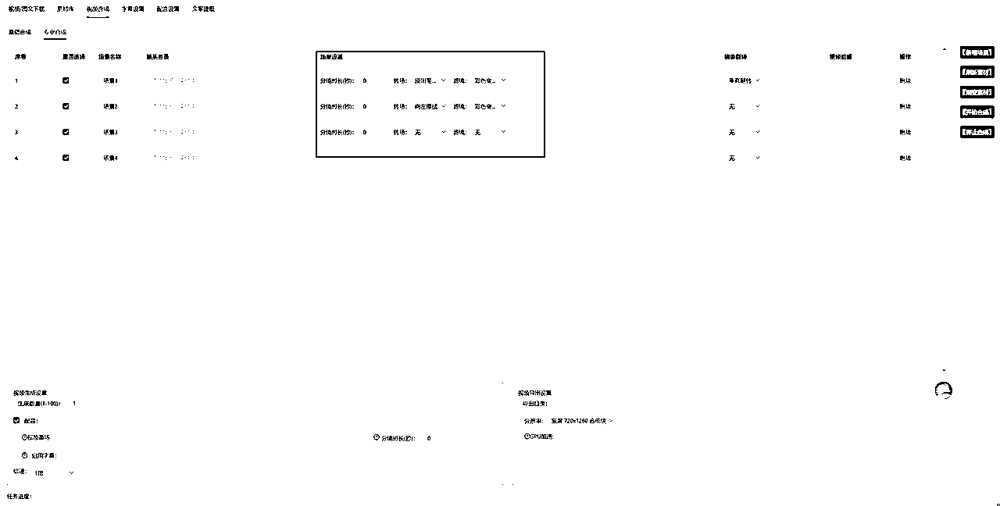
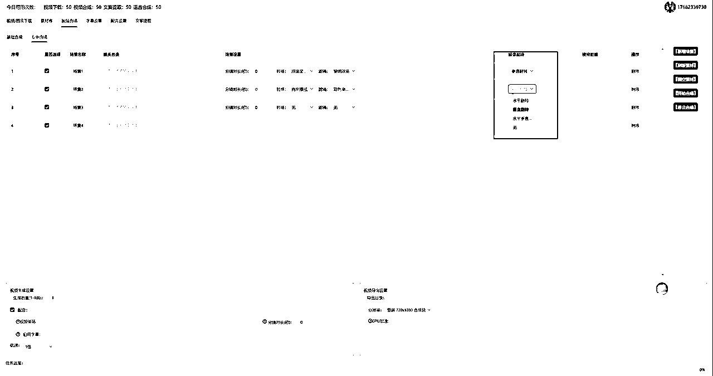
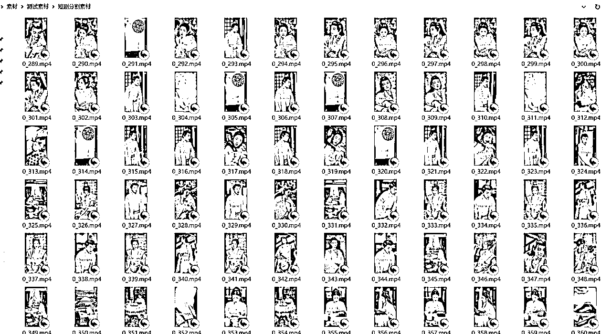

# 短剧批量混剪SOP，批量生产素材

> 来源：[https://ijarxpcwej.feishu.cn/docx/QhyidDnRMoenwBxxrmec61E3nFf](https://ijarxpcwej.feishu.cn/docx/QhyidDnRMoenwBxxrmec61E3nFf)

最近我们接了一个客户的定制需求，他们公司是做短剧运营的，他们是直接从短剧的版权方购买版权，然后授权给达人，当然他们自己也有在做短剧分发。客户爸爸找到我们想要定制一些适合短剧混剪的产品功能，虽然我们的软件并没有限制具体的使用场景，但是主要还是比较适合好物分享类的这种对音视频匹配要求不高的场景，而且也没考虑过去重的问题，我们认为混剪就是最高级的去重，只要你的素材足够丰富，去重就不是问题。

那针对短剧这种场景，问题就是这个短剧的素材就这么多，你又不能自己拍，很多人都用同一部剧的素材，肯定会导致重复度直线上升，所以我们需要考虑一些去重的功能，尽量增加生成视频的随机性。

首先，我们分析了一下短剧混剪的主流操作方法，根据我从抖音作品的观察来看，目前短剧混剪有两种主要的方式：

### 原片原声混剪

这种方法就比较简单粗暴，直接把原片按照场景分割成若干素材片段，然后再重新组合成一个新视频，可以利用剪映里的智能分镜拆分视频片段，然后合成新视频，这种方式的问题就是如何批量操作。

### 配音生成+视频混剪

这种方法其实就是视频解说了，就是我们可以先用 gpt 生成一个文案脚本，然后用配音软件生成一个配音解说，然后加上原剧的视频素材，就可以生成一条解说视频。这种视频主要听解说的，而且短剧本来就是剪辑好的一些比较吸引人的画面，所以混剪效果也比较不错。

针对目前我们Booms混剪软件已有的功能，我分别梳理了一下这两种混剪方式的SOP：

在此基础上，我们需要针对2个功能做优化，一是素材的处理，我们需要开发一个批量智能分镜的处理功能，需要为客户创建足够的素材库，可以针对一些三方素材做分镜处理，二是尽量增加合成视频的随机性，减少重复度，所以我们开发了：

### 一、智能分镜 功能

*   可以选择本地视频进行智能分镜，分镜文件保存本地之后，可作为二创素材使用

1.  点击素材目录，选择在线素材文件

1.  场景检测阈值越大，视频分割成的场景越少，场景识别阈值越小，视频分割成的场景越多，默认参数即可

### 二、专业合成

专业合成是在基础合成功能的基础上增加了针对每个场景的具体设置，可以提高视频合成的更加精准的控制。

#### 场景设置

可以具体对每个场景设置

*   分镜时长：控制每个场景的时长，单位秒

*   转场效果：当前场景和下个场景的转场效果，默认无转场效果，可以选择随机转场

*   滤镜：给当前场景增加滤镜效果

#### 镜像翻转

翻转当前场景视频，可以设置 水平翻转、垂直翻转、水平垂直翻转

那么我们的用户就可以通过我们的去水印下载功能，下载抖音的素材，或者版权方提供的素材，利用智能分镜批量做视频的分镜，然后批量合成。

这是抖音下载的素材智能分镜后的分镜视频，大概有500多个

然后，我们把这些分镜进行场景分类，就可以导入批量混剪了

## 三、下载地址：

官网： http://dis1.aimix.pro:82/index.html