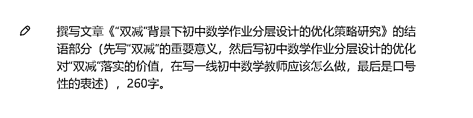
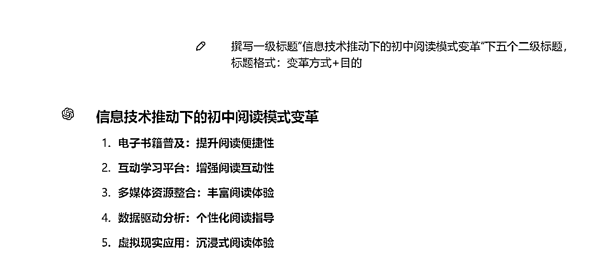

# 00后女生月入十万的AI写作实操案例分享（写作端 不含渠道）

> 来源：[https://lv9qj6hfr4z.feishu.cn/docx/QrELdRNJkobfqIxNgC9cnMuNnyh](https://lv9qj6hfr4z.feishu.cn/docx/QrELdRNJkobfqIxNgC9cnMuNnyh)

### 教育类型稿子提示词（6.9 加餐）

如果还沉浸在自己用文心一言写垃圾文的状态，赶紧跳出你的舒适区，目前最好的生产力工具是gpt4.0！

开始可能慢点、走点弯路，写了几篇后，一天割五六篇都是正常水平。

、

逻辑参考如下

这样就能写出来我们常看到有理论、有实践的基础教育论文。

策略类可以这样提示：写出……的策略，直接写出五个策略标题：标题格式：做法➕目的。

这样的标题，机器味道就没了

根据问题写策略的提示语，先写出策略的标题，然后围绕标题写内容。

### 期刊类稿子的写法（6.11加餐）

题目：提升小学数学兴趣的新路径——以阅读与数学融合为例

字数：3200字

第一步，机器出路径

第二步，分别写这五个路径。

第一个路径，机器给出内容。我们需要调整一下

第一个路径就搞定了，抄袭其他论文逻辑，依次把五个路径完成。

第二个路径出来了，但是我发现第一段阐述与第一个路径相似度太高，我就要调整一下阐述顺序。

第二个路径差不多了，需要调整一下语言

第三个路径

第三个路径还不错，调整一下语言就可以了

第四个路径看起来也还行

调整一下也差不多了

这个写的还行，但是不能都是国外的，我们就用国内的绘本

就用微信搜一搜里的案例直接给机器刷一遍

要求3200字符，还有摘要、前言、结语，所以要删掉一些内容

前言可以直接把别人的前言进行降重，也行

注意：期刊大纲（逻辑）不要机器写！

直接参考《课程、教材、教法》

用它的一级标题写二级标题

看这个，就是用一级标题写二级标题

……价值：写三个价值

……教学原则：写三个原则

……策略：写三个策略

……类型：写三个类型

避雷坑注意

这些通过 总结类的 都不要