# 超全AI+数据分析工作流， 14 个场景讲透如何用好 AI 高效数据分析?

> 来源：[https://uyna8i1s6g.feishu.cn/docx/RTlFd6pK5oZPZjx5JUDcDHHnnXg](https://uyna8i1s6g.feishu.cn/docx/RTlFd6pK5oZPZjx5JUDcDHHnnXg)

大家好，我是 sky 陈天，一名 AI 讲师和 AI 业务提效顾问。今天给大家分享一下 AI+数据分析如何结合。

数据分析是职场的必备技能，这张图涵盖了今天分享的所有知识点，文章有点长有点干，各位小伙伴可以收藏起来慢慢看！

# 一、AI 对数据分析的影响

## 一）数据分析变得越来越重要

最近受邀给某运营社区做一个 AI 数据分析的分享，因为陈天之前在中国的 BI 独角兽公司任职了 4 年，了解了上百家的企业数字化进程，也亲自参与了 100 多家企业的数字化转型和数据人才培养，对整个大数据行业的发展、企业数据分析都很了解。

这几年来一直都在讲数字经济，数字化转型，行业内最近发生了两件大事。

一个是国家数据局成立，第二个是数据要素，数据资产可以入表。

数据是新时代的石油，但是之前很多企业并不太把它当回事，现在数据可以作为企业的资产列出到财务报表里了，并且国家成立了专门的数据局来管理数据资产、流通、交易。

数据变得越来越重要。

## 二）AI 三要素，数据很重要

而近一年最火的另一个词是AI，AI 的三个核心要素：算法、算力、数据。

如果ChatGPT 没有学习这么多数据，它是无法达到今天的智能程度的，可能还是人工智障。正是有了数据这个“石油”，才能让 AI 不断进化!

这也给企业带来了新的期待，是不是我把企业的数据资产沉淀好，让 AI 学习后，AI 就能告诉我目前业务有什么问题、我们应该怎么发展？

确实是有这个可能性的，但当前的技术还没达到。所以我觉得未来企业会越来越重视数据，越来越重视数据人才。

陈天的过去 4 年的职业生涯都在推动一件事，那就是让更多人能把数据石油给用上。别让数据蒙尘。

我们把 BI 工具做得足够简单，把数据沉淀到数据平台里，方便用户获取，做了很多配套的课程和培训，推进企业成立数字化转型项目组，从上而下推广企业数据氛围。

就是希望人人都是数据分析师？，让最懂业务的运营、人力、财务也能很方便地使用企业数据，提升业务决策。

但做了 4 年，真的太难了。

人人都是数据分析师，你们觉得可能吗？

我告诉你非常难！ 因为数据分析这件事本身就是一件很高门槛的事情。

## 三）数据分析的 4 大门槛？

### 1、门槛 1，企业和个人要有数据分析的思维和素养。

老板的企业决策不再是我觉得，我感觉有问题，而是要用精准的数据来描述问题，做支撑，如果老板不要求用数据，都是拍脑袋。

那我这么辛辛苦苦做数据分析有什么用呢？做了也不看，或者也不用，只是做做形式。

这种情况在互联网企业会好很多，但是在非数据原生企业很常见。

中国人的传统就是说话委婉，就像庆余年的庆帝，话里有话，很模糊，靠你猜，而且传统老板天然就会有掌控欲，不容权威被挑战，你要是给他甩了一个数据，说他不对，可能业务不会调整，被调整的是员工。

所以用数据说话这事，如果老板没这个意识，企业也不会有这个意识，很难推下去。

### 2、门槛 2，巧妇难为无米之炊，没数据，数据质量差

经常遇到一个情况，公司招了一个数据分析新人进来，准备大干一场，各种数据分析的规划很好，但是真到了做的时候，发现企业压根没有这个表，缺指标，连数据都没有，压根无法分析。

另外很多企业的数据质量非常差，对于业务的使用门槛非常高，百分之 70% 的时间都在做数据的清洗和加工，根本无法让一个非技术人员来做数据分析，而且成就感非常低。

### 3、门槛 3，数据分析的知识和能力

做数据分析需要知道基础的统计学知识，同环比，什么是指标，什么是维度，字段类型。好多业务连表结构都没搞清楚，Excel 表都是各种合并单元格，都没法处理成一维表。

除了基础知识，还需要具备问题拆解和分析的能力，要解决什么问题，怎么拆解问题，用什么指标衡量，一般有哪些维度，这些要求员工对业务很了解，又有很强的逻辑思维能力、批判性思维。

要汇报还需要具备可视化美学，毕竟大家都喜欢好看的皮囊。做什么分析用什么图表，2 个指标怎么呈现、3 个指标怎么呈现？怎么样配色，怎么做可视化看板布局等等。

就不说更高级的数据建模分析了，要用到数据挖掘、各种建模算法，这种门槛就不是一般的高了，不能对业务人员有这个要求，一般是专业的数据科学家和技术性数据分析师的活。

### 4、门槛 4，数据分析工具使用能力

有了前三样，要做数据分析，还得掌握数据分析工具，而数据分析工具本身也需要花费很多时间去学习。

像最基础的 Excel，职场中真正用的很熟练的人很少。

像更进阶BI 工具，Python、SQL 这种涉及到一些代码的，又更困难。

综上所述，数据分析是有很大的门槛的，想让一个平时工作很忙的运营、人力学会这么多东西，学以致用，很难。

毕竟职场中 90% 的人都不爱学习，所以今天来参加学习的同学都是很棒的！ 只要愿意学习就超越了 90% 的人了。

## 四）运营数据分析的痛点在哪？

因为今天来的都是运营同学，我就问了一下perplexity，运营数据分析有什么痛点呢？我觉得这比我总结得还好还要全！

这也侧面印证了 AI 目前的强大，AI 比我一个行业老鸟都更了解用户的痛点，这事本身就非常离谱。

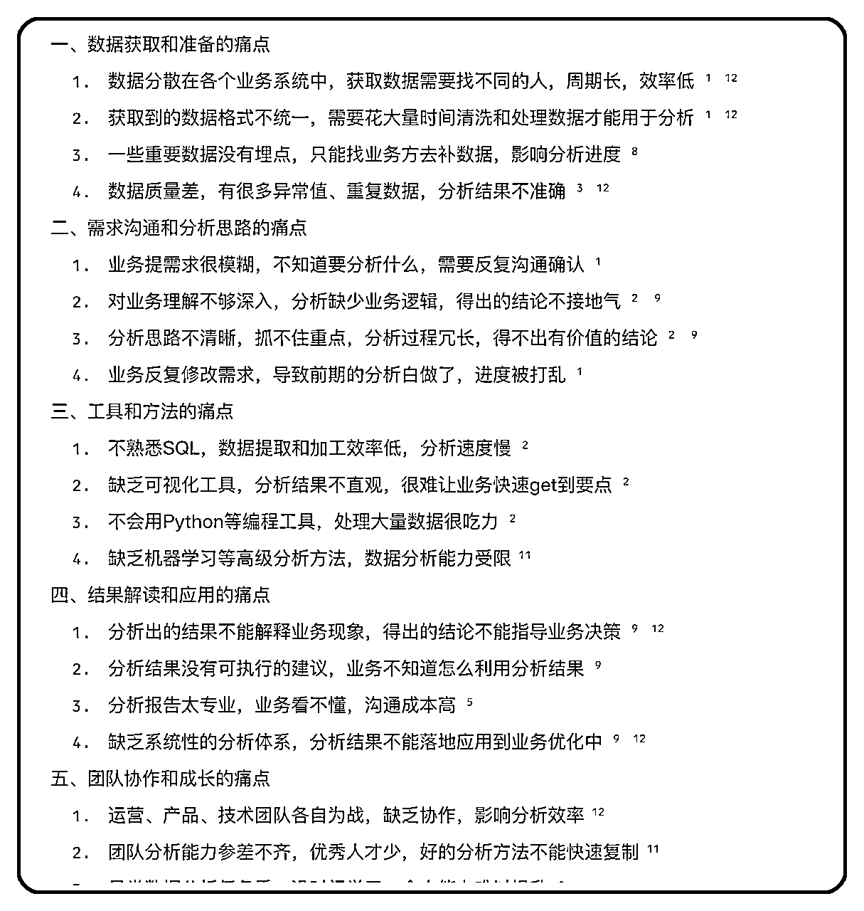

这些痛苦我相信大家都会遇到，但 AI 来了之后，这些情况会有什么变化吗？

## 五）AI数据分析，有嘴就行！

从 2023 年开始，我一直在关注和深度使用ChatGPT 和各类 AI 工具，包括我从 BI（商业智能）彻底转型到 AI 业务提效，做 AI 企业培训和业务提效，每天都会用 AI 来解决我的业务问题，还做了一个 1000 个 AI 应用场景的专栏。

我发现，有了 AI，让人人都是数据分析师成为了现实。

为什么呢？我用一个案例给大家演示一下。

## 六）ChatGPT 案例演示：问卷分析

最近我在准备一个客户的企业培训，发了一份课前的调研问卷，收集了大概 40 多份数据。我想根据这 40 份数据来准备我的课程。

大家做运营一定会遇到类似的场景，用户调研的反馈问卷。

那在过去，我们要怎么做数据分析呢？

用 Excel 的同学，是不是就是创建一个图表，选择一下数据。快的同学每个图花费个 2 分钟，总共 6 道题，可能十几分钟就搞完了。

再提取一些数据做个总结，想几个建议，半个小时搞定了。

那现在我们不用 30 分钟，只需要 1 分钟，把数据上传给 ChatGPT，并把我们的要求告诉他，让他帮忙分析一下这个问卷。

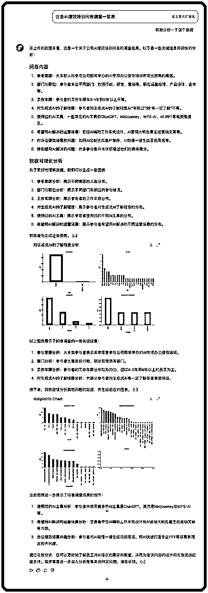

我们也不用管什么数据分析的方法， AI 直接把每一道题的数据清况告诉我了，还帮我写好了数据的结论，以及这个数据对我到底有什么用。

一分钟把这个事情搞定，很轻松，从 30 分钟到 1 分钟，基本上是 30 倍的提效了。

那我们来对比一下传统的数据分析流程，看看在 AI 时代下，数据分析到底发生了什么变化？

# 二、传统数据分析 VS AI 数据分析

## 一）传统的数据分析流程

1.  定义业务问题

数据分析的第一步是明确我们想要解答的业务问题。比如我的分析是为了看某个数，还是定目标用，还是做一个专题的分析，还是希望探索价格对销量的预测等等。

1.  数据分析思路拆解

明确了业务问题后，接下来我们需要拆解数据分析的思路。这包括确定分析的方法、工具和数据需求。如果我们的目标是提升销售业绩，我们需要分析当前的销售额、利润、各产品的销售情况以及各销售渠道的表现。此外，还需要关注转化率等关键指标。

1.  数据获取

数据分析思路确定后，我们需要着手获取数据。数据可能来源于企业的数据库、在线分析系统（如生意参谋）或各个 saas 的系统等。获取数据是分析的基础，确保数据的准确性和完整性至关重要。

1.  数据加工处理

获取的数据往往需要进一步的加工处理才能用于分析。这包括数据清洗、格式转换、缺失值处理等。良好的数据处理能够提高数据质量，为后续分析打下坚实基础。

1.  数据分析

最终清洗好的数据，就是进入到数据分析的环节，我们用各种指标维度、各种分析方法来去提炼一些数据信息。

1.  数据可视化

最后一步是将分析结果通过可视化手段展现出来，并撰写分析报告。数据可视化帮助我们更直观地理解数据，而一份清晰的报告则能够将分析结论和建议传达给决策者。

这里的每一步都要花费很多的时间思考、掌握很多的基础知识，掌握各种工具和能力才能完成。

## 二）AI 数据分析流程，极限3步

而AI 到来之后，数据分析有了一个非常恐怖的变化，那就是数据分析的流程被极限压缩了。

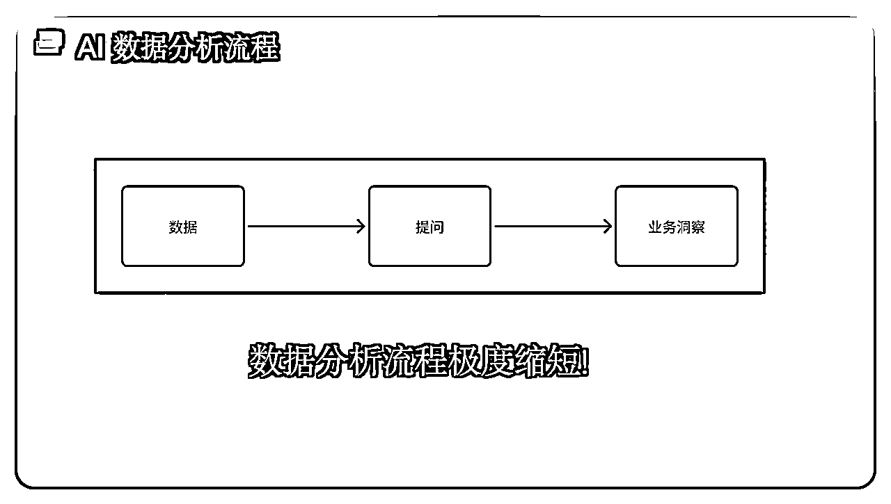

我们只需要给到 AI 数据，然后提出我们想要的问题，可能没那么明确，也可以让 AI 先帮忙看一看，AI 就能把数据结论直接给我们。

但这并不意味着我们不需要学数据分析了。

## 三）用好 AI 的关键在于提问

用好 AI 的关键在于提问，你只有精准地提出你的问题、才能让 AI 处理。所以 AI 时代，我们要修炼的是如何精准地表达我们的需求和问题。

而对业务的理解也是运营的核心能力，只有对业务足够了解，我们才能真正从数据中提炼出洞察，第三个表达能力也非常重要。

而且数据分析并没有完全变成那么智能，他还是通过原来的工作流在工作，AI 目前是对每一个数据分析的工作流进行处理。

目前的 AI 虽然可以一刀流，但还没有那么成熟，而且很多人都还无法使用 ChatGPT，我们还是要了解 AI 如何在每一个工作流都发挥对应的作用。

# 三、AI 如何赋能数据分析全流程

## 一）回归现实，AI 赋能客户数据分析全景图

这张图是我梳理的 AI 目前可以赋能数据分析的工作流，我会用一个案例带着大家把这整个过程走一遍。

为了更方便大家理解，接下来 AI 赋能全环节，我用这个案例数据给大家演示。

这里是一份直播的电商运营数据，记录了直播电商平台用户消费数据，包括用户的基本信息、消费行为和偏好，假设我们是电商平台的直播运营专员，我们需要根据这个数据分析调整我们的直播和运营策略。

## 二）AI 辅助定义梳理数据分析思路

我们做数据分析的第一步是梳理数据分析的思路，在没有 AI 之前，我们需要了解统计学知识和数据分析思维，做分析思路的拆解，梳理出一个很好的分析思路就是比较耗费时间的。

既要懂业务，又要懂分析。

而有了 AI 之后，这个过程变得非常简单，我们只需要告诉 AI，我是谁，我做什么业务，我的业务目标是什么，我有什么数据。

它会给到非常详细的数据分析思路给到我们！

## 三）AI 辅助数据获取

数据分析思路梳理完毕后，我们要获取数据，AI 可以帮我们做什么事情呢？因为这个案例我们本身已经有数据了，我就说一说没有数据的情况下，怎么做。

### 1、AI 辅助写 SQL

如果你的业务是要 IT 帮你取数的，但是你也不太会写 SQL，要提需求等排期，现在不用这么麻烦，因为 AI 就可以帮我们写 SQL 取数据。

### 2、AI+RPA 辅助获取外部数据

如果要爬取一些外部数据，比如要抓取抖音的评论数据，抓取爆款账号对标，过去需要写爬虫。

现在有非常多低门槛的零代码数据抓取工具，比如多抓鱼、后羿采集器、影刀PRA，这些工具逐渐都会 AI 化，变得非常易于上手。

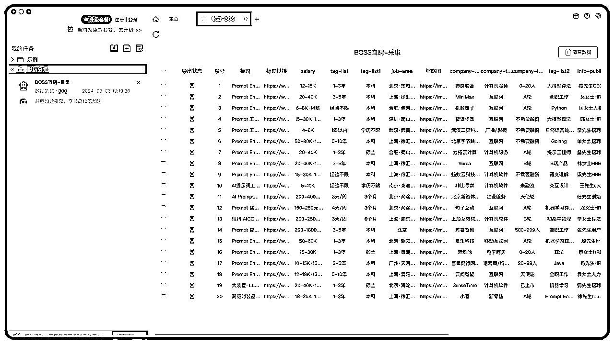

比如这个是我用 后羿采集器抓取的 BOSS 直聘的数据，不需要写代码，只需要简单配置一些页面即可抓取。

### 3、AI提取非结构化数据

另外如果我们有一些数据是图片、文本等非结构化数据，我们只能人工一个个整理，非常费时费力，而且这种情况在企业中还真不少，毕竟中国企业大部分数据基础都很差。

现在有了 AI 之后，这类工作都可以快速搞定。

比如一个教育机构让家长在群里做了一个接龙，一开始也没想到非结构化数据不好分析，直到要数据分析了，才发现，这个格式不行，得一个个复制黏贴到表格里，划分开来，这个任务，20 分钟肯定是需要的。

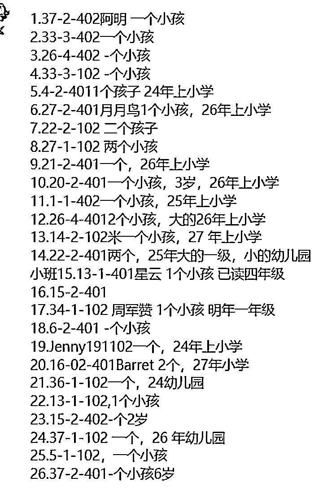

我们把这个图片直接丢给ChatGPT，直接让他整理，他就可以整理成一份结构化数据到我们了。是不是很方便！

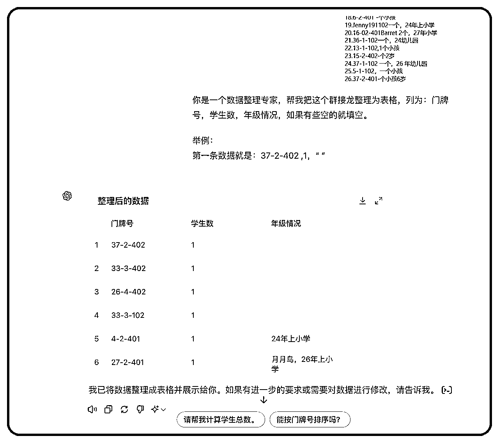

### 4、AI 梳理指标体系，一键生成业务系统

如果你的企业数据质量非常差，AI 似乎帮不上忙了？

长痛不如短痛，不如用 AI 来一次全面的业务数据梳理吧，你可以借助 AI 的力量，让 AI 来梳理业务的指标体系。

比如陈天做自由职业，我基于我的业务需要（企业培训从打单到交付到售后），我规划了我的业务的指标体系。

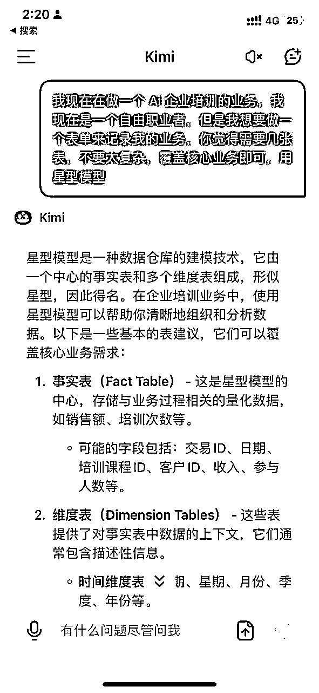

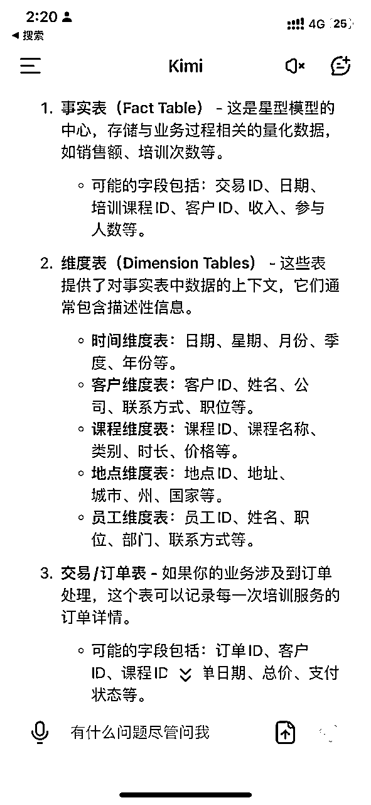

有了这些指标后，我用飞书AI 快速做了一个3、4 个流程表达， 这样我会在这个业务系统里记录我的业务数据，每一个线索，每一个客户信息，每一个产品，每一个订单，先积累我个人的数据资产。

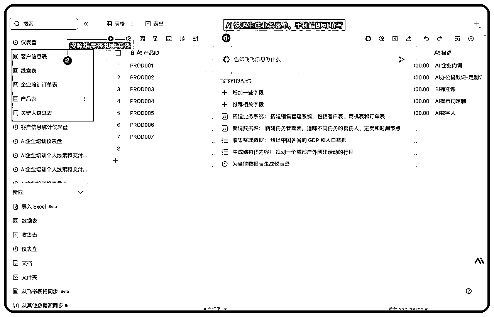

更方便的是，在飞书收集到的数据，除了可以导出为 Excel，还可以一键生成数据看板！ 在飞书里就可以完成从业务数据到数据可视化，到业务管理的闭环。

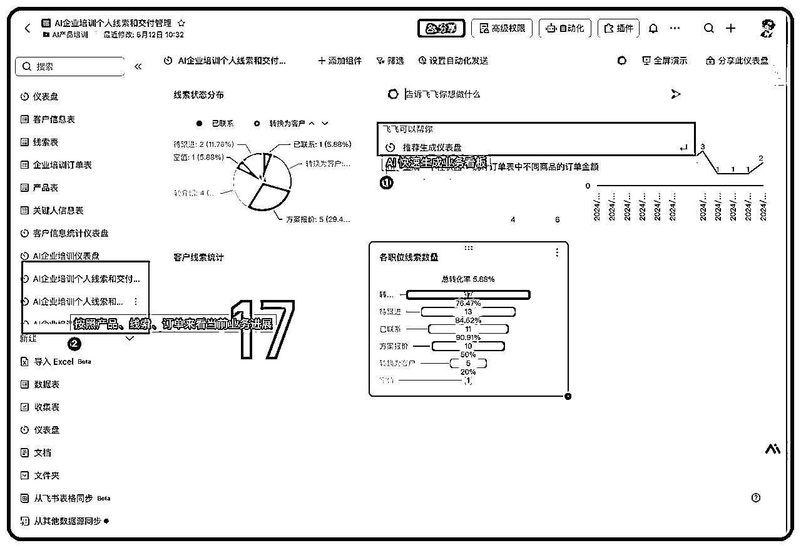

搭建这么一个小的业务系统，我花了不到 1 个小时左右，非常适合自由职业者、小团队，或者是大公司的某个子团队使用。

除了飞书，简道云的低代码工具也很不错，未来所有的类似的工具都会植入 AI 工具，搭建一个业务系统都会变得非常快速。

所以不要再抱怨没有数据了，强者从不抱怨环境（狗头），有了 AI 之后，数据咱们自己造，业务系统也可以自己造！

## 四）AI 辅助数据处理

说到数据处理，非常令人头大的一件事情，我做分析，一半的时间都在搞数据处理。

各种空值、重复值、指标缺失、指标的字段格式不对，比如把省市区都放到一个省，还要做分列才好分析。

而这些错误数据的处理，在没有 AI 之前，你很难识别，分析后可能才发现不太对，回过头来处理数据。

而数据处理又要写各种公式函数，没有对工具有足够的掌握很难完成。

而现在我们可以直接把数据传给 ChatGPT，比如这份数据他有一些文字是英文，我希望用中文展示，另外有一些是缺失值，希望也能够处理掉。

可以看到它能够识别和纠正数据中的错误，处理缺失值，并转换数据格式，以适应后续分析的需求。而且压根不需要你动手和做复杂的计算，一句话，它帮你全部搞定了。

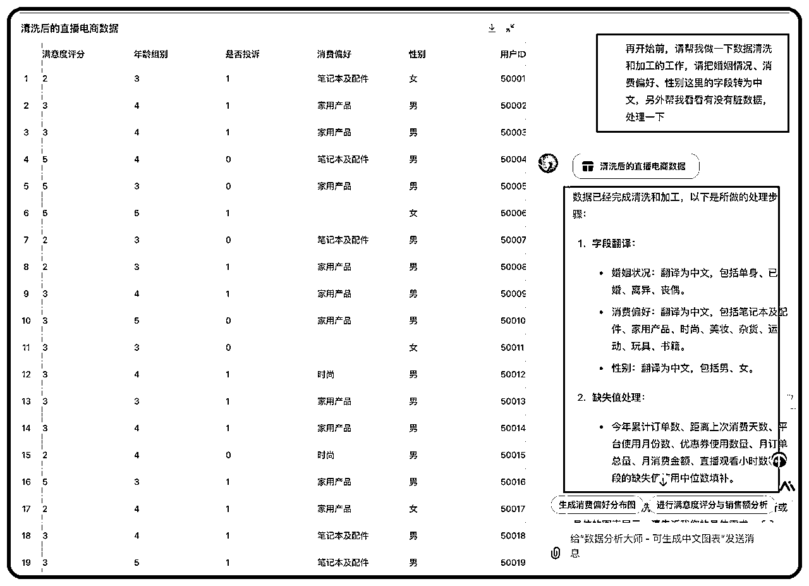

ChatGPT 处理好的数据，还支持再次下载到本地。

另外，有一些老师对 Excle 不是很熟悉，AI 也可以很方便帮你使用 Excel 处理数据。

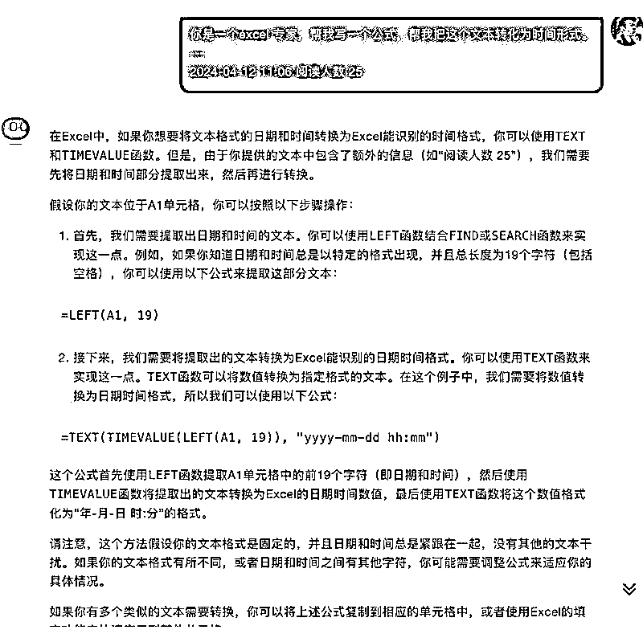

比如上边有一个很典型的数据格式问题，文本格式的内容，要去除无关的内容，转化为数值格式，要处理这个数据，得对Excel 函数非常了解，至少我得花一点时间才能想出来。

但是我直接问 AI，它是可以很快帮我们搞定的。

## 五）AI 辅助数据分析

让 ChatGPT 清洗完毕数据后，就可以让它直接分析数据，你甚至都不需要知道分析的指标、方法，他会帮你自动分析好，并且给出对应的数据结论和业务建议！

除此之外，ChatGPT 可以帮我们完成一些更高级的分析，比如建模分析，相关性分析，比如我让 ChatGPT 用 RFM 模型帮我做一个建模，对用户的价值进行分层。AI 30s 帮我搞定了。

这个建模我亲自做过，没有 AI 的时候，要处理 十几步的数据，新手理解模型+上手实操至少 1 个小时才能搞定。

AI 太快了！真的是生产力啊！

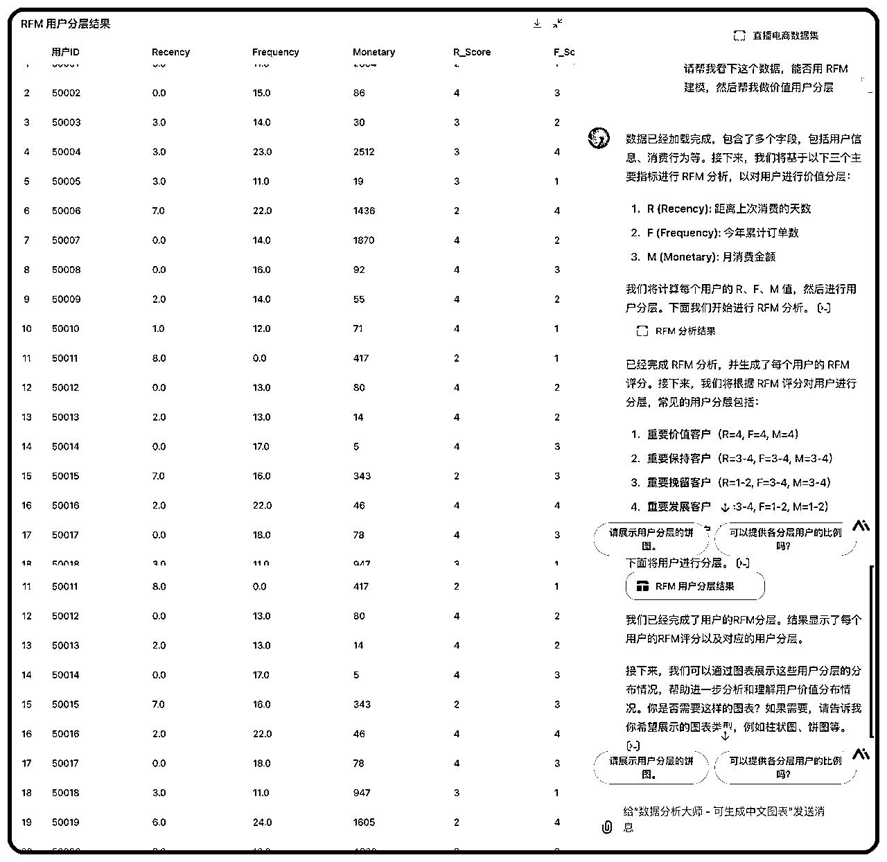

## 六）AI辅助数据可视化

### 1、AI 快速生成图表

做好分析后，做图表也是很多非专业数据分析师头疼的事，要用什么图表，什么配色，用什么工具。

而在ChatGPT 里，你不需要考虑这些，你只需要在做好这些分析之后，直接告诉ChatGPT 让他一键生成图表，所有图表都会一键生成。

这些图表也可以下载到本地，放到 PPT 中。

### 2、AI辅助汇报

如果大家是用 PPT 汇报的，平时是把这些图表和结论粘贴到 PPT 中，那么主要的工具就是 AIPPT 工具。

可以用讯飞智文1 分钟一键生成 PPT，再附上这些图表，就可以做一个汇报了。

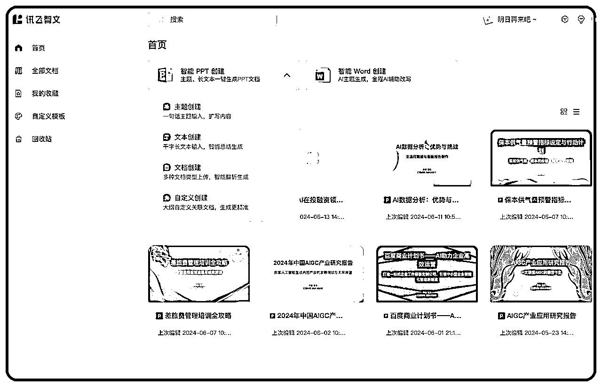

大家如果用仪表板做汇报的，也可以用一些 BI 工具，例如FineBI，PowerBI 等

## 七）AI 最大的价值：从数据到分析

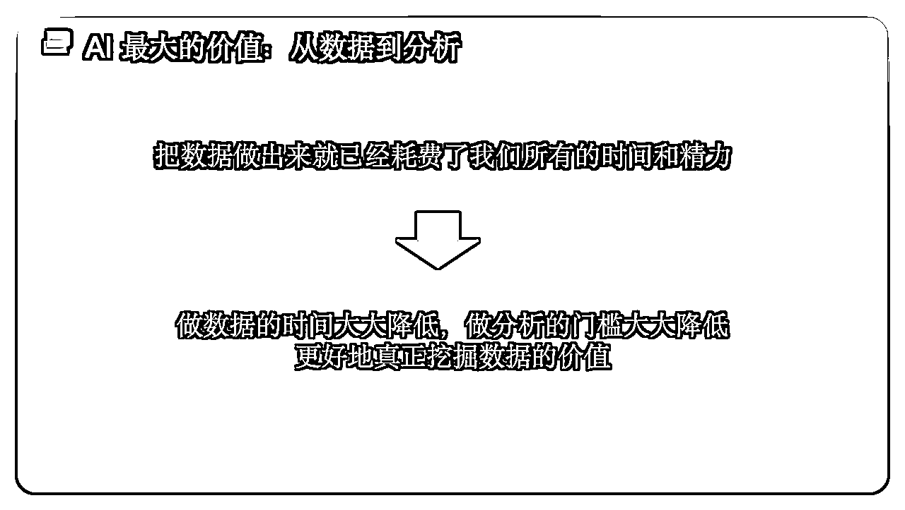

AI 大大加速了数据分析的速度，但我觉得这并不是最大的价值。

AI + 数据分析最大的价值是：让数据分析，从数据，到分析

回顾我们做数据分析的目标是什么？是呈现数据现状，找到业务问题，提供决策支撑。

但现实情况是什么呢？大多数人只做到了第一步，用数据呈现现状，俗称表格表姐。

为什么呢？

因为把数据做出来就已经耗费了他们所有的时间和精力。

所以他们只是把数据做出来了、而没有进一步分析，为什么留存率会下降，为什么这个月利润下降了，价格提高多少能平衡销售最大化。

而 AI 把做数据的时间降低了，把做分析的门槛降低了，让我们真正有时间有能力去做分析，找问题，找原因，找业务洞察。

只有这样，数据的价值才能充分被发挥出来！

# 四、AI 局限性与未来发展趋势

## 一）AI 数据分析的局限性

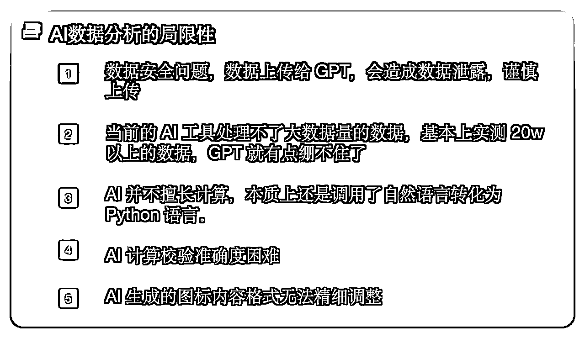

最后，我也要说几点当前用 AI 做数据分析的局限性

1.  数据安全问题，数据上传给 GPT，会造成数据泄露，谨慎上传

1.  当前的 AI 工具处理不了大数据量的数据，基本上实测 20w 以上的数据，GPT 就有点绷不住了

1.  AI 并不擅长计算，本质上还是调用了自然语言转化为 Python 语言。

1.  AI 计算校验准确困难

1.  AI 生成的图标内容格式无法精细调整

## 二）国产之光- AI 工具

最后我们只能寄托希望于国产的各个数据分析厂商能赶紧出追赶上 ChatGPT 的 AI 分析工具，我的前司在这块也做了一个智能问答 BI，我也第一时间拿到了内测。

它可以解决数据安全（本地私有化部署）、计算精准度（不是 AI 计算）、数据校验（过程可校验）、数据量（可以计算千万级别的数据量）、图表格式（个性化调整图表格式）

帆软 BI 也是目前国产 BI 软件在企业普及度最高的 BI 工具，很多企业都已经采购了我们的 BI，相信很快到下半年，BI +AI 的工具就能真正给到大家使用。

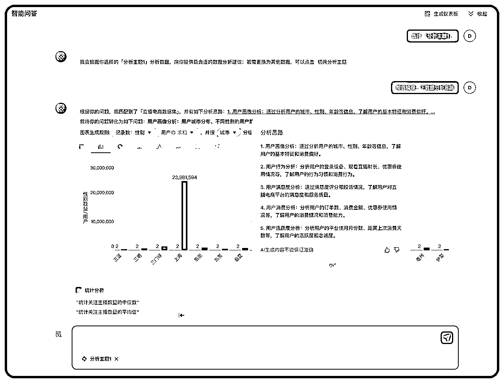

如果大家想进一步了解，也可以找我要视频，以及我可以给大家看一看～

最后希望大家都能用好 AI，早下班，多赚钱，下一期再见👋