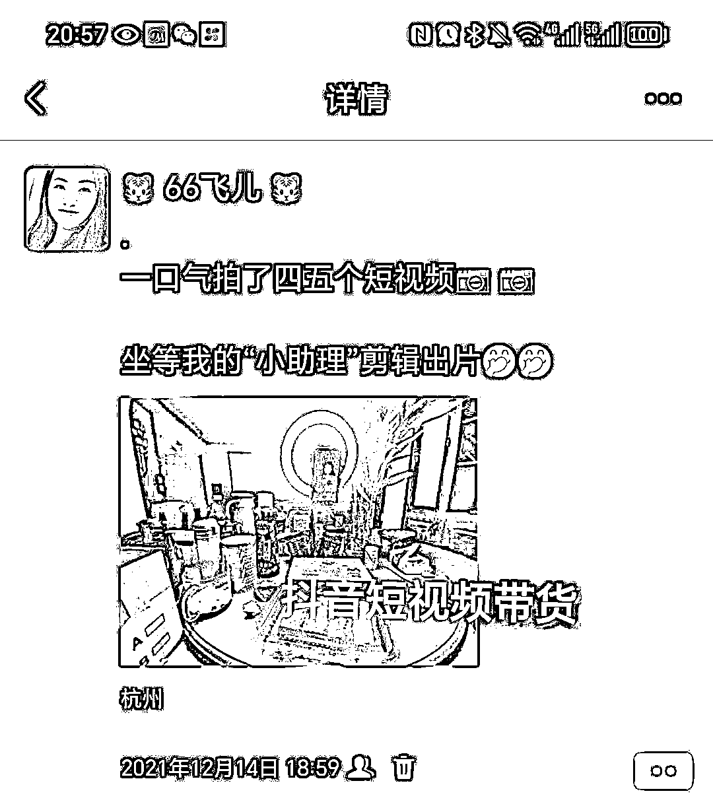

# 全职宝妈一人带娃做闲鱼虚拟项目“睡后收入”爆单经验分享（适合小白看）

> 来源：[https://ldj2whd7ls.feishu.cn/docx/RYD9d1iDMoXQZ6xGbvBc4ry4nUd](https://ldj2whd7ls.feishu.cn/docx/RYD9d1iDMoXQZ6xGbvBc4ry4nUd)

大家好，我是连续四年续费生财有术的“小老人”飞儿，想当初21年刚进生财的时候我是个小小白，那时候还没结婚生娃，现在娃都有了😂时间过得真的好快呀，这几年一直在生财“修炼”现在已经进阶成大白了😂

今天的分享欲来自于在生财待了多年的切身体会。在生财待久了，其实发现小白还是挺多的，有些项目小白做起来很吃力，很多项目做起来正反馈慢，就会有很多人半途而废。而闲鱼平台对小白很友好，简单容易上手，正反馈快！所以建议小白们真的可以拿闲鱼练练手，拿到正反馈了，路才能走得更长远！！

好了，闲话不多说，直入主题。

我之前在生财分享的全都是有关于闲鱼的，先附上之前分享过的帖子链接有兴趣的可以看看

2021.5.31分享的第一篇：

纯小白首次操作闲鱼电影票项目两天成交19单的无脑操作与分享（适合小白看）

https://t.zsxq.com/puVi7

2021.12.20分享的第二篇：

小白学习闲鱼爆品截流半个多月单店爆单最高日出45单最高日入纯利1000+分享整个过程（适合小白看）

https://t.zsxq.com/p7GRa

最近在一个圈友那学的是咸鱼虚拟的玩法，直接上收益图先看

截止6月10号晚上九点半的收益图如下

6月9号的收益图如下

6月8号的收益图如下：

鱼小铺后台近30天的收益：

你们看图上的订单数和成交金额就能发现虚拟资料的客单价都低，平均都在一两块，但好在配搭全自动发货系统，操作起来还是很湿滑的。

划重点：

我卖的就是PPT模板啊，短视频素材呀，合同模板呀等等这类的虚拟资料。标价都是平均在两块钱左右，拍了就直接发网盘链接，有人拍了就去淘宝上找货源发，基本上同样的资料，淘宝上都是卖一分一毛就好了。然后同款资料淘宝那边只要拍一份就可以重复发货了。已经出单过的链接在自动发货系统添加发货内容，后面出单后就全自动发货，是真正的一本万利了

我选品这块还是用了之前帖子里说的爆款截流的方式，所以起量就特别快。

这家店是靠我纯人工找品，选品，上品，一点点做起来的。前一个月基本没什么收入，都是在打基础。第一个月的下半个月慢慢的流量就起来了，后面爆单后就一发不可收拾了。我是因为老号重开所以起量慢，我后来测了用一个新号做第二天就开单，第二周就起量。做这个新店比较容易起量

现在我爆单的店铺每日曝光量如下图：

每天早上醒来就自动成交自动发货25单，睡后收入50+，打开闲鱼都是几十条已发货的信息。如下图：

刚做的时候我是怎么都没想到卖单价一两块钱的东西，单店单号一天收益能上300元，目前我这个店连续五天每天收益都是200+，都是纯利润。老实说我自己都有点震惊的😂😂

我一个人带娃，伺候娃吃喝拉撒，平时家里还要打扫卫生烧饭什么的，我就只利用我娃睡觉的时间，一天也就两三个小时，每天就有200+的收入，说实在的暂时还挺满意的了😂

像这样的项目真正的大佬都是看不上的，小白拿这个练练手，每天有个两三百的收入，也挺好了。而且这个店我每天投入的时间都是在我儿子睡觉的时间，一天加在一起也就2到4个小时的时间。就算每天投入四小时，一个月收入五六千，这个投产比对小白来讲也是很划得来的。

我朋友圈都有实时记录加入生财后我实操测试项目的心路历程，一直在副业这条道上坚持努力着，如下图：

我从结婚，备孕，生娃，带娃都没放弃过搞副业，每次都是挤出时间来测项目，实操学习。兜兜转转一圈回来感觉还是闲鱼最好做，之前没有继续做咸鱼，是因为要实物发货，爆单了之后每天就是去拼多多拍单发快递单号，只要爆单就忙的不可开交，发货后还会遇到这样那样的售后问题，一个人边带娃边做是真的很吃力，所以就中途暂停了。

现在这个虚拟资料就很好，解决了爆单后的发货问题，还有售后问题，因为发货都是全自动，不需要手动输快递单号，再加上客单价低，基本没有售后问题，就真的可以解放出很多时间精力让我好好带娃，又同时能经营好这个店铺每天有点收入。

现在我利用碎片化时间再开了一家闲鱼店，我安卓手机可以双开闲鱼操作起来也方便，我再探索下我的潜力，一个不好再起一家店爆单，那我真的就可以实现边带娃边月入过万了！！

因为这个项目很简单，我也没有列目录出来，就用大白话流水账的方式叙述出来了，我想懂的一看就懂了，不懂的也可以来找我交流，我们一起生财有术。加油冲冲冲！！！