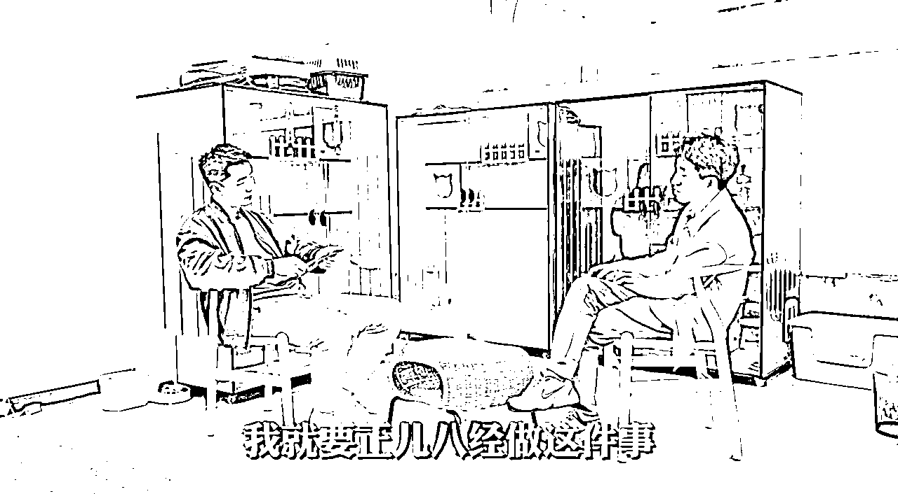
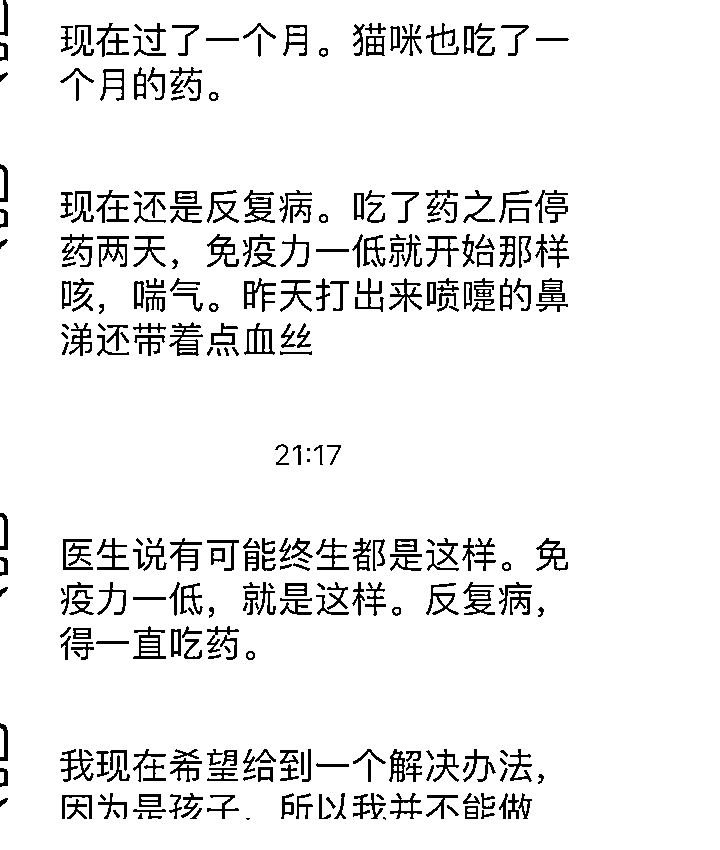
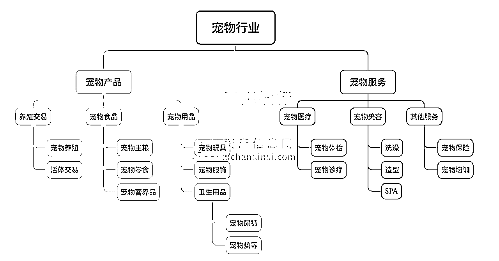
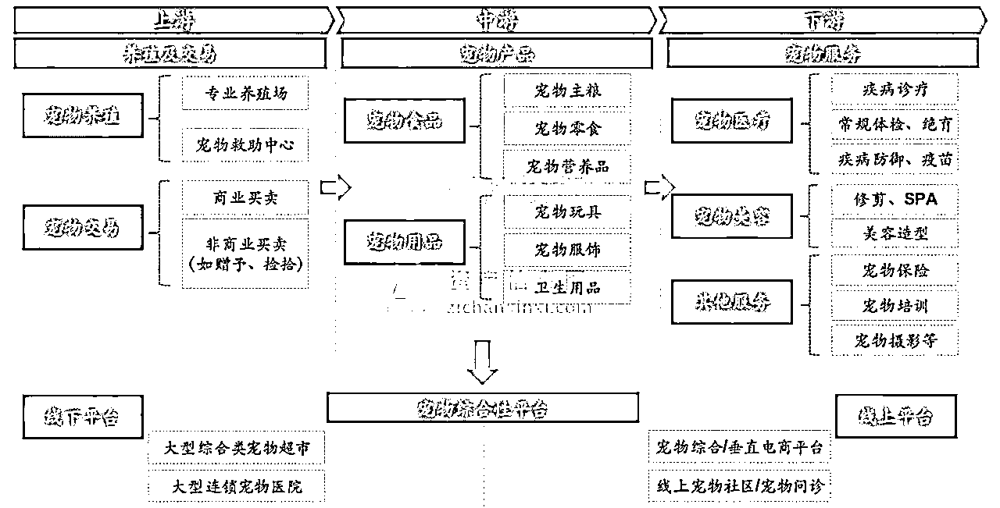
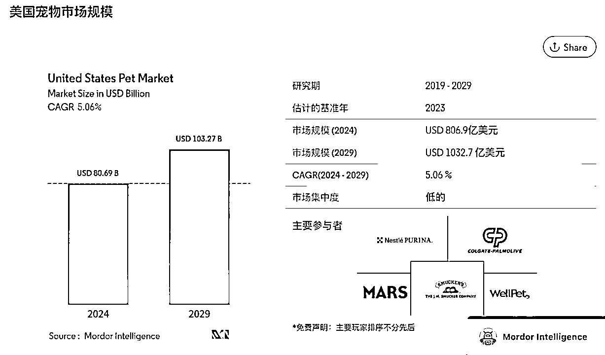

# 生财圈友，请你不要看宠物行业

> 来源：[https://tvmfl3sf7b.feishu.cn/docx/RgT8dpajlo8G0gxd0wucYFHDn7g](https://tvmfl3sf7b.feishu.cn/docx/RgT8dpajlo8G0gxd0wucYFHDn7g)

今天我不是以猫舍主理人的身份写这篇文章，而是以一位猫咪家长的身份，分享我对生财圈友和宠物行业的一些看法，特别是给那些关注宠物行业的生财圈友们。

#### 自我介绍

我是阿岳，一家猫舍的主理人。自2021年开始经营猫舍，到现在已经快4年了。这4年里，我亲身体会到了宠物行业的高速发展，也从中获得了不少经济利益。从一开始只有一只猫的小猫舍，到现在拥有接近200只品种猫的高端猫舍，我们的目标是成为全球顶级的华人猫舍。今年我们还接受了程前朋友圈的专访。也感谢生财的方法论，让我们猫舍取得了如此进步。

#### 为什么生财的人不要碰宠物行业？

##### 一、宠物行业的复杂性

在这接近4年的创业过程中，我看到了许多生财圈友在找项目、摸索项目和频繁换项目中徘徊。能专注在一个行业并持续赚钱的人相对较少。这并不是说他们急功近利，但确实难以找到合适的词来形容这部分群体。

宠物行业尤其复杂，因为它涉及到生命。很多人希望通过低价采购和高价销售来获取高毛利，但这种模式下，只会找到质量低劣的产品，最终只会导致大量病猫、残猫的出现，严重损害了客户体验和行业信誉。

##### 二、执行力与流量的矛盾

生财圈友的执行力和流量能力非常强，这也放大了上述问题。由于执行能力强，能够迅速触达用户，但由于供应链问题，导致低质产品的大量出现，客诉率高企。而宠物毕竟是生命，不能简单地用工业产品的退货率来衡量。

##### 三、内心是否真的爱宠物

我认识的一些宠物行业从业者，他们流量做得比我好，但私下里他们会坦言自己并不爱猫，只是把猫当作产品。这样的心态很难让他们在猫舍生意中赚到钱，反而需要依靠其他周边产品来补贴。这种情况让我认为，只有那些真正爱宠物的人，才能在这个行业里取得成功。

#### 正向建议：爱宠物的人可以尝试

如果你也是爱宠物的，并在寻找一些项目，我建议你把宠物行业中的某一个点放大，做成自己的生意，而不是短期暴利的项目。生意是长期且持续的，而项目是短期且暴利的。把宠物行业中的某个类目做成你的事业，会让你既感到幸福，又能够持续赚钱。

#### 市场趋势与机会

从我切身体验来看，宠物行业确实是一个很有前景的领域。疫情后，我注意到一些大博主在出国考察时，也开始关注宠物门店。不管是宠物临时性门店、装备型门店、医疗型门店还是其他形式的宠物服务，都能感受到全球市场的飞速发展。

#### 市场数据与发展前景

美国的宠物市场占有率高达86%，日本为70%，而中国只有20%。我们可以预计，未来20年，中国的宠物市场也会达到美国和日本的水平。每年的复合增长率将会非常可观，这里面蕴藏着大量的商机，不管是宠物活体、食品、衍生品、医疗、保险还是旅游等领域。

今天就写到这里。如果在生财圈里有喜欢宠物或者从事宠物事业的朋友，希望大家能互相链接、互相学习。

#### 总结

宠物行业虽然充满商机，但也充满挑战。只有真正爱宠物的人，才能在这个行业里找到长久的幸福和成功。而那些只想着快速赚钱的人，不妨三思而后行。

* * *

希望这篇文章能给你一些启发和帮助。如果有任何问题或想法，欢迎留言交流。