# 快递cps让我一年赚了100多万！！

> 来源：[https://ki37ay915ze.feishu.cn/docx/Z8XWd6vagooHsGxHBXYc4X6vnDf](https://ki37ay915ze.feishu.cn/docx/Z8XWd6vagooHsGxHBXYc4X6vnDf)

# 1、快递CPS

## 1.1 什么是快递CPS

就是用户通过我们的渠道线上寄快递来赚取差价，例如你的底价是5元，你在后台设置利润是1元，用户下单页面显示的就是6元，别看利润是小小的1元，寄快递的用户很有粘性，复购率高，尤其是一些刚开始做电商的商家，单量少，快递站点是不会给优惠价格的，我们就是把散户和小微企业汇聚在一起。

## 1.2 快递CPS的利润空间

开通账户后，就可以自己设置佣金价格。

我建议每单快递首重利润保证在8毛左右即可，不建议超过1元，续重的利润我建议设置在5毛-8毛之间，这样最终用户支付的金额，会低于在快递公司官方金额的2-3元（首重），如果货物重量越大，利润空间也就是越高。利润=首重利润+续重利润，例如一件货物是20KG，首重设置的利润是8毛，续重利润设置的是6毛，那么最终的利润是：1*0.8+19*0.6=12.2元。注：用户下单后，快递员取件称重将快递发出后，平台才进行扣费，也就是说快递发出后运单状态为（运输中）自己的后台才能看到结算佣金。超过30KG用户下单物流价格更低，但是佣金也很低！

本人从2022年12月5日正式启动快递项目，到今天2024年6月12日，一共赚了有100多W了，下面是我的后台数据，我一共2个账号。

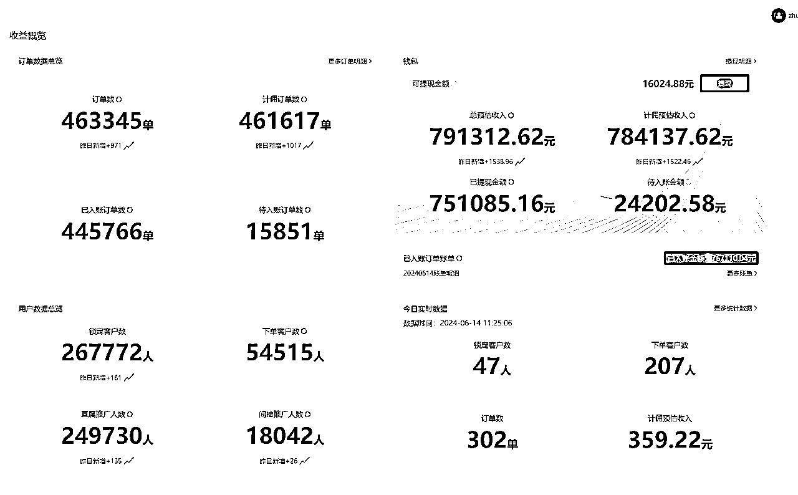

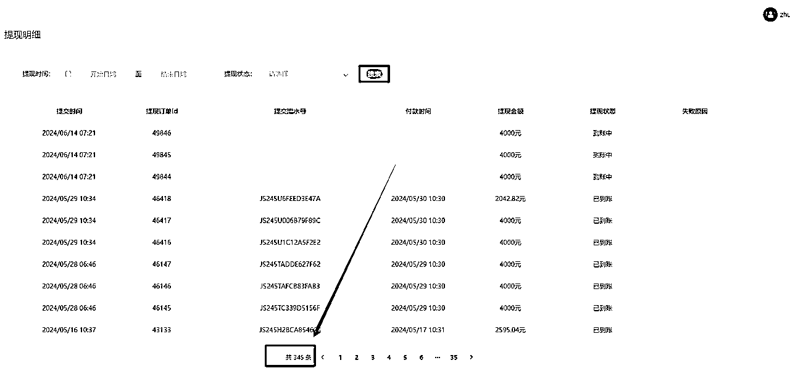

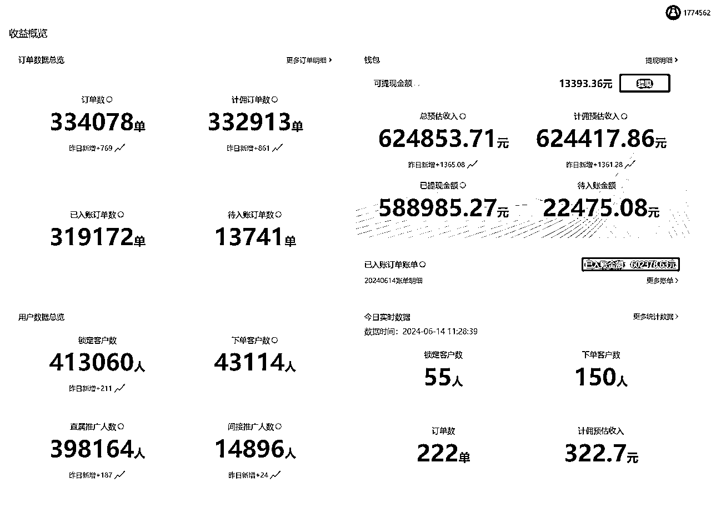

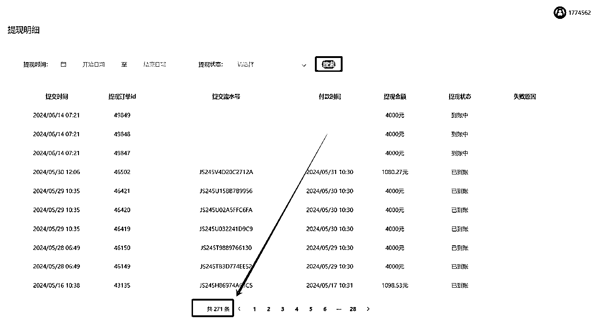

# 2 、如何开通后台及设置

## 2.1 开通代理

轻松易推，单单躺赚，自用也省钱！立即开启“捞金”模式，邀您加入成为快递达人>>> 点击此处免费注册代理 （点击左侧可自助申请）

# 着重说一下平台规则

锁粉机制（永久锁粉）

用户通过推广二维码进入小程序后，自动锁定成为粉丝，一但锁定后即成为永久粉丝，不管这个用户以后再通过其他人的推广二维码下单，佣金都在你这里结算！全国通用！

间接锁粉：当你的用户把小程序分享给他人使用，他人点击进入后自动成为你的粉丝，没有层级限制，用户无限分享，你无限锁定间接粉丝！

# 快递100品牌优势

1.  大品牌，有品牌效应，成单率高，能达到80％，复购率也高！

1.  无需自己对接用户售后，省心省力，专心推广即可。

1.  小件采用微信信用付，大件采用线下支付给快递员，获得返佣的模式，不担心超重不补的问题。

1.  可开发票，发票服务名称为‘快递服务费’，这是其他平台都没有的！

1.  个人提现没有手续费和税费，余额多少到手多少！

1.  最多可设置200个寄件页，可分渠道推广，可看单个渠道的数据，适合多渠道推广用户。

以下是快递平台用户下单小程序，大家可以进去看看功能

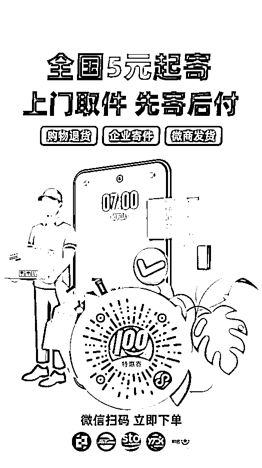

## 2.2 如何设置后台

### 2.2.1点击链接注册

轻松易推，单单躺赚，自用也省钱！立即开启“捞金”模式，邀您加入成为快递达人>>> 点击此处免费注册代理 （点击左侧可自助申请）http://ckd.im/bTk7BO（也可以复制左侧链接再微信或者浏览器中打开注册）

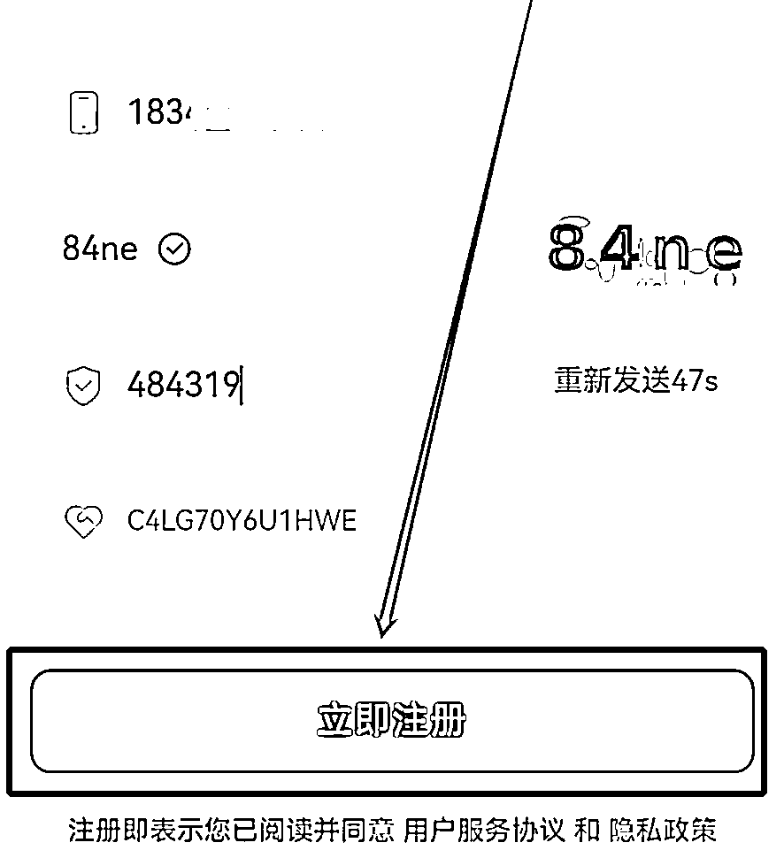

### 2.2.2注册后登录后台

注册后用注册的微信扫码登陆网站u.kuaidi100.com

### 2.2.3设置后台价格

后台价格建议按照下图设置

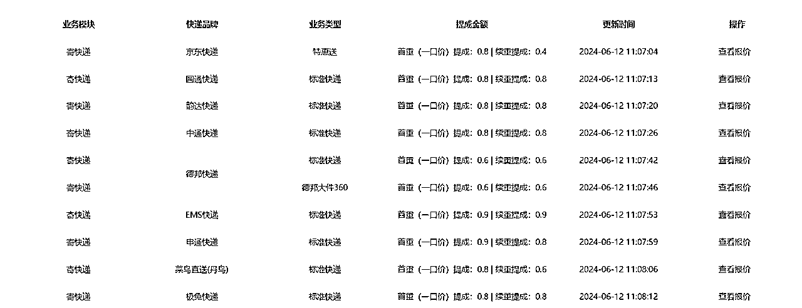

### 2.2.4生成对应的寄件页

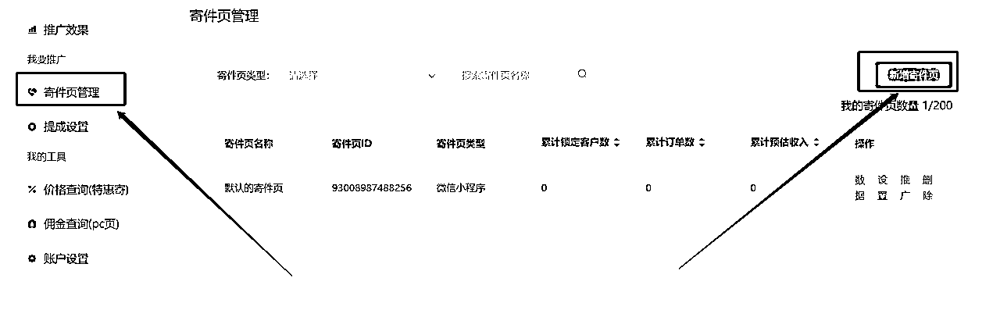

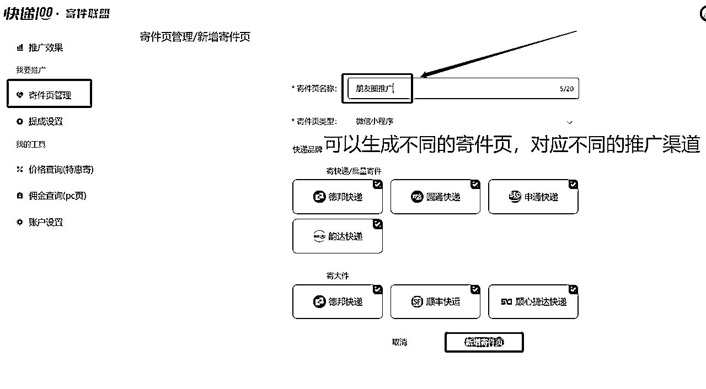

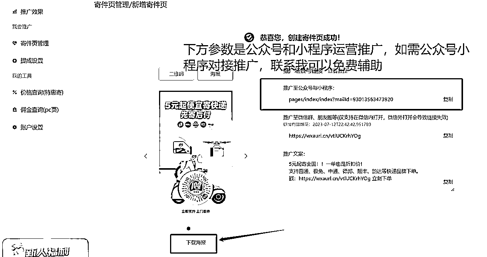

不同的推广渠道设置成不同的寄件页，这样渠道的推广数据就可以区分开，对应哪个渠道效果好，出单率高/复购率高，就可以着重推广！！

# 3 、如何推广赚钱（干货）

最最最最最重要的干货来了，代理也开通了，后台也设置好了，不知道怎么推广就是白费，下面讲一下我的推广经验。

我刚开始接触快递的时候也是特别迷茫，不知道如何推广，也自己试过好多方法，浪费了很多毛爷爷，例如：去百度贴吧各类快递公司的贴吧发帖，然后用机器人挂上VPS自动回复，时刻保证自己的帖子在第一的位置上，这就需要自己买的VPS、贴吧顶贴账号、顶贴软件，结果就是亏。下面我就讲一些无需任何成本的推广方式，亲测有效，月入几千到上万是没有问题的！

## 3.1 小红书平台玩法（核心玩法）

一、笔记发布

小红书发布笔记可以直接发布快递小程序的推广二维码，这样效果最直接，本人其中一个账号就是用这种方法。（小红书号：6767405918）你们可以按照我这个账号的方式进行发布笔记，笔记积累到20篇会有置顶功能，可以选择流量最大的一篇置顶一下。（不要第一天新注册的小红书账号，就马上去修改头像及简介，等两天再去修改即可，没事的时候多刷刷别人的笔记，对自己的账号都有帮助，不会被官方识别成异常账号）。此方法最暴力，我曾经一篇笔记爆了2000多点赞，上了1000多用户，当天利润1000+，如果感觉自己一个账号不够用，也可以使用多个手机多个账号发布，我自己就有15部手机，账号都是找不玩小红书的朋友要的，直接用他们手机号登录即可。这种营销笔记发出去会有很大几率被判定违规，笔记违规不要害怕，小红书咱们发布的程度是不封账号的！如果你运气不好，发出去就违规，你可以置顶一个带二维码的笔记，通过别人账号关注你，看看置顶笔记是否被隐藏，没被隐藏的话，其余笔记发正规的运费对比文案，或者其他正规的快递优惠文案，在文案评论区引导用户看你置顶笔记！

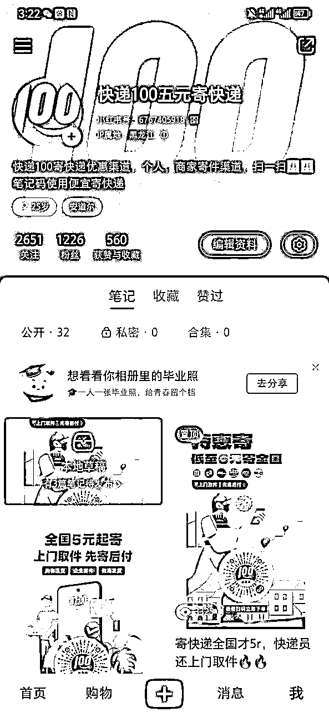

接下来说一下如何获取你认为比较好的小红书笔记文案及图片。

1.首先在别人小红书笔记里点击右上角分享按键—点击复制链接

2.然后在微信小程序里搜索（小红书文案提取）很多小程序都是看一段广告就可以使用，在文案提取小程序中点击粘贴，把链接粘贴上后，点击解析即可。

3.最后获取你想要的文案及图片。

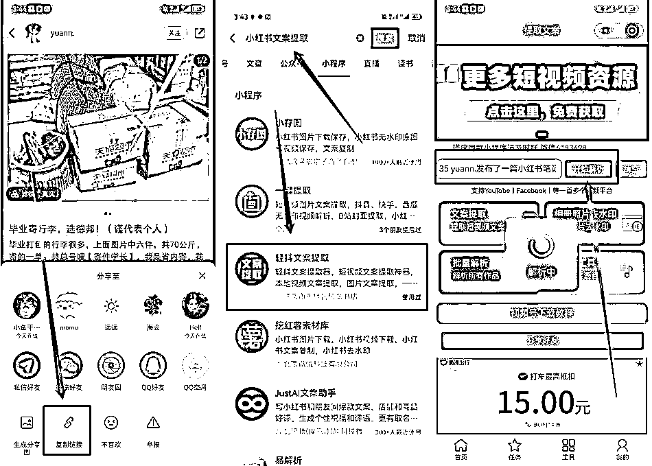

二、笔记评论区回复（此推广方式一定要把自己的账号资料完善，大家可以看看我的账号）

小红书有个规则就是当你主动搜索一个行业后，他会在主页的发现页不停的推送同行业的信息，例如你今天不停的搜索寄快递，你就会在发现页里看到很多寄快递的笔记。这个时候你就可以不停的刷新发现页即可，发现有寄快递需求的用户直接在笔记里留言，不建议留言太直接，会被系统自动隐藏。在用户的笔记评论后，在关注他，最后用另一个小红书账号搜索你评论用户的账号，通过账号搜索找到那篇笔记，核对自己评论的内容是否被隐藏！

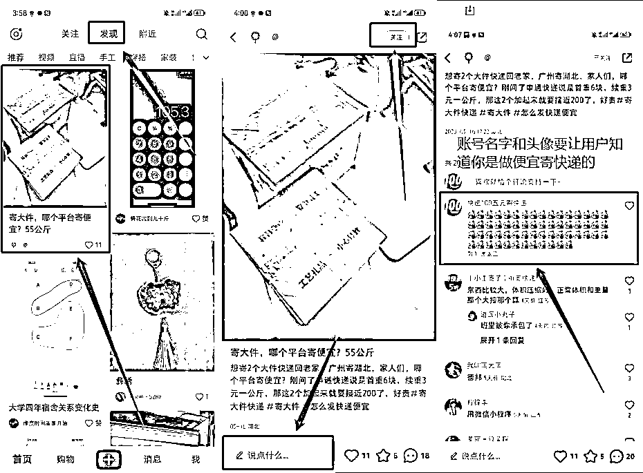

（自己评论完笔记一定要用其他账号核对下评论是否被屏蔽，例如我评论的一堆亲亲的表情，核实后没问题，你就可以一直评论了，不需要再进行核实了，但是每隔几天你还是要核实一下，因为小红书的规则一直在变化。）

上面说的是在关于寄快递的笔记处留言，其实可以按照这个方法给其他博主留言，例如做手工品博主的笔记下面留言，留表情或者对商品的评价都可以，因为你的名字和头像就能看出来你这里寄快递优惠，所以大部分用户都有到你的个人中心查看，不单单是手工品博主、闲置物品出售博主、电商博主、卖盲盒等等，只要是在小红书上销售物品的你都可以去评论，建议是留言加关注！如果有粉丝关注你了，我建议回关！（这里也是重点，我亲自测试过的，效果很不错！！）

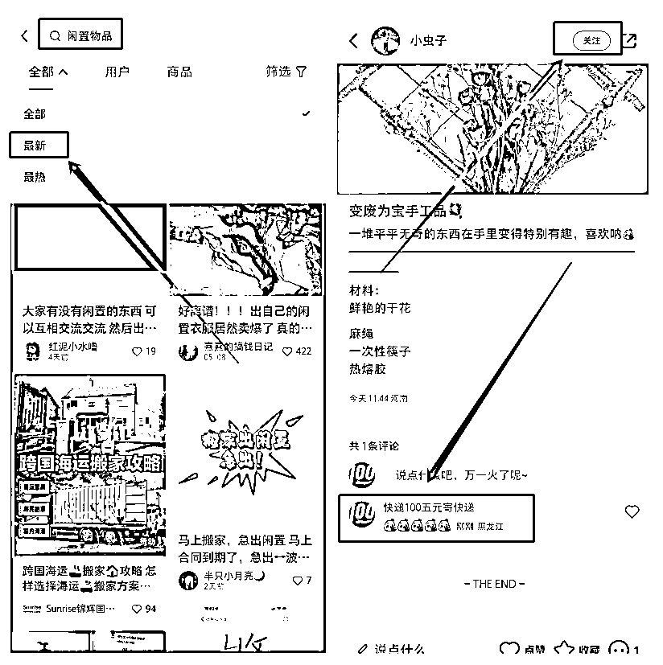

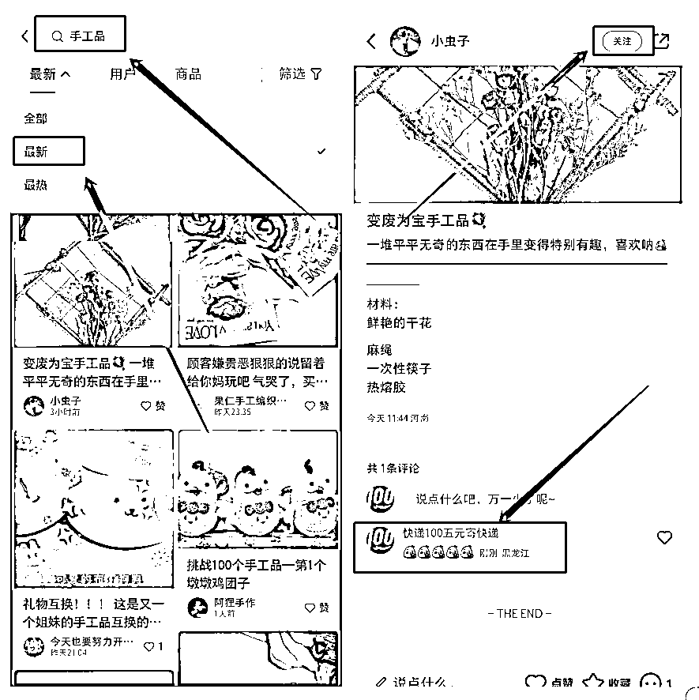

下面我再分享一个同行的方法，他也是用评论的方法，但是他会选择在用几个小号在他自己的评论下面进行互动。

我搜索了他小程序的数据，每天有100-300人用他的程序下单，每天利润应该在200元左右，他只用这一个方法就获取到这么多用户群体，所以方法还是有效的，就看你是否用心！！这种方法最省心，也最直接，效果也好。

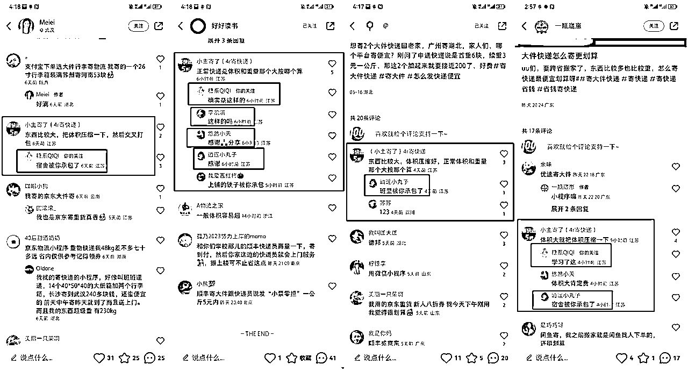

三、兼职代发布文案

可以招一些兼职发布的人，发布笔记给奖励，点赞收藏达到多少量给奖励，我自己招了50多兼职用户，下面分享我的兼职规则。

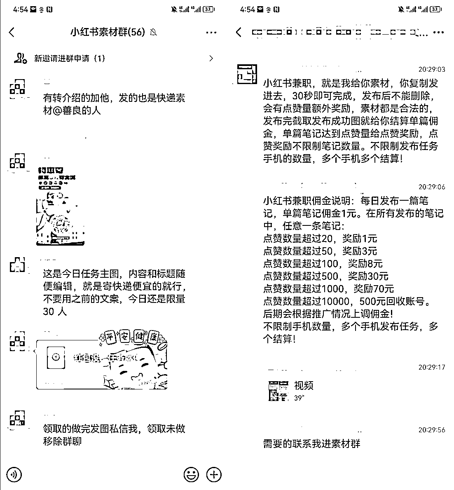

## 3.2 抖音、快手、视频号玩法

抖音、快手、视频号和小红书大致的玩法一致

一、发图文或者视频直推

二、评论区留言，多几个号互动

三、同行业账号粉丝截流

注：抖音、快手、对发布的内容较严格，被限制的几率会更大些，但是对留言评论限制不大，视频号没做太多的测试，想研究的可以自己测试！

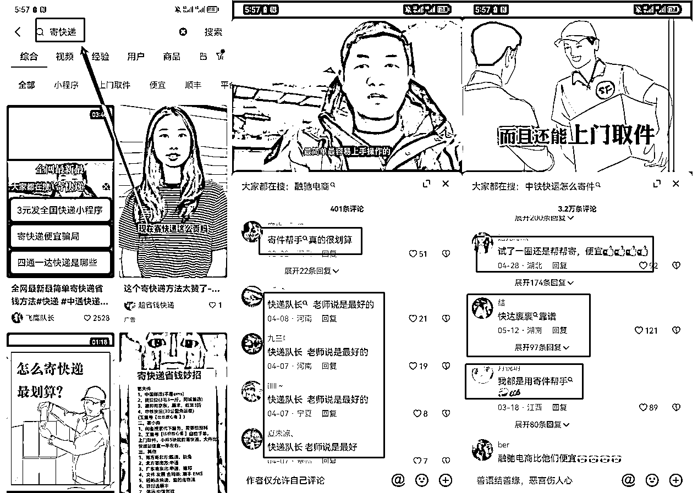

## 3.3 闲鱼推广（核心玩法）

主要推荐闲鱼，平台流量机制对新人较为友好，可以快速起量，同时可将闲鱼发布的商品内容同步至转转等其他平台引流（闲鱼推广就是嘎嘎卷，首重续重利润控制在2毛到3毛可以接到单，超过5毛用户就都跑了）

## 3.3.1、商品发布

①注册闲鱼账号，授权芝麻信用

②搜索“快递代发”复制内容/图片素材

-内容带上话题“#快递小哥优选"、“快递服务”、“#快递代寄”

③发布快递代发商品

-定价4.5元

-发货方式选择包邮

④选择商品地址：推荐选择一线城市或周边经济较好的地区

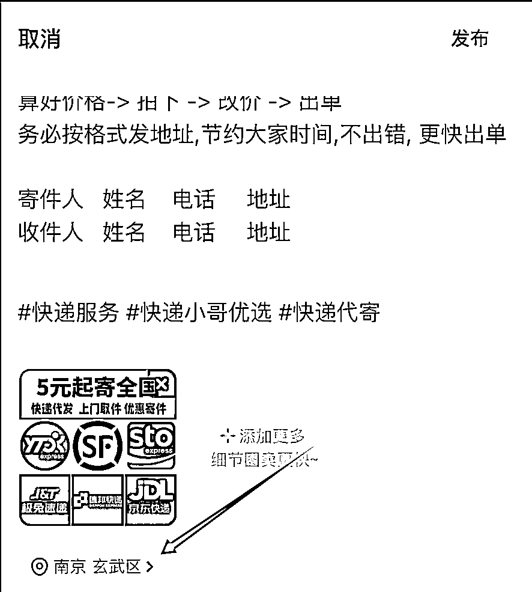

## 内容示例

申通圆通全国快递代下，首重6元起 直接告诉我哪里寄哪里? 多重 ? 轻但体积大的, 也要体积，我直接给你估价格。

有 申通 圆通 极兔 韵达 得邦 等等 ，价格不等

注意事项(价格便宜, 快递站利润极低)

1.  不接急件 不预约时段 不要催

2.下午3-4点前下单,基本当日取,否则次日

4.下单后1-15分钟发您订单号/快递电话/取件码

5.急可联系小哥,问几点有空,勿催,不要提闲鱼

6.超重请及时补费, 否则会退回, 运费不返!!!

下单流程

算好价格-> 拍下 -> 改价 -> 出单 务必按格式发地址,节约大家时间,不出错, 更快出单 寄件人 姓名 电话 地址 收件人 姓名 电话 地址

#快递服务 #快递小哥优选 #快递代寄

## 3.3.2、代发流程

## 准备工作

①自动回复设置

点击我的——右上角设置按钮——所有宝贝自动回复

亲亲，直接告诉我 哪里 寄 哪里? 多重 ? 体积大的，需要报体积，我计算价格～

下单我给你单号和快递员电话

默认发圆通快递！圆通！谢谢🙏

取件后麻烦！确认收货！🫡

②用微信扫描自己的专属推广二维码，进入快递100特惠寄

③价格设置：将代发和自助下单价格做一些区别，可将老客引流至自助下单，减少售后

-代发参考价格：圆通代发报价普通跨省一般首重为6.5元，续重3元，除偏远地区、上海北京福建等

-自助下单价格：圆通自助报价普通跨省一般首重为6.4元，续重2.9元，除偏远地区、上海北京福建等

④引流话术+下单二维码准备

亲，感谢您的支持，麻烦帮忙给个文字好评，后续工作较忙，有时候回复不及时，已经帮您生成了老客户优惠，可以用聊天软件自助下单

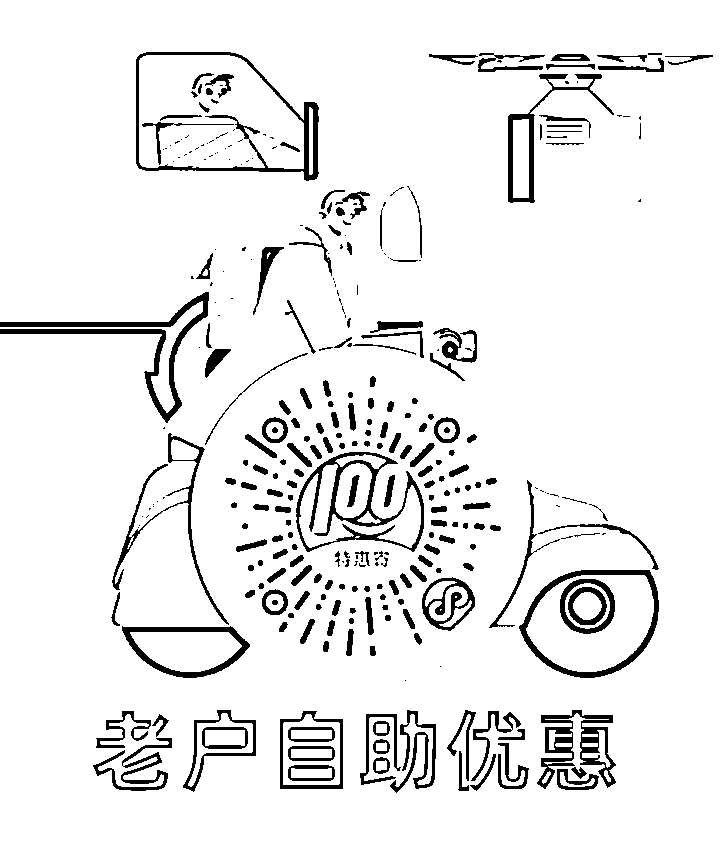

## 案例演示

广东深圳-江苏南通 2KG 体积20*40*30

Tips：

-快递公司计费重量向上取整，1.01kg按2kg计算

-实际重量和体积重量，哪个大取哪个值计费，体积重量=长*宽*高/8000

客户：你好

商家：

亲亲，直接告诉我 哪里 寄 哪里? 多重 ? 体积大的，需要报体积，我计算价格～

下单我给你单号和快递员电话

默认发圆通快递！圆通！谢谢🙏

取件后麻烦！确认收货！🫡

客户：广东深圳-江苏南通 2KG 体积20*40*30多少钱呢？

商家：（打开特惠寄，输入地址，查看报价）

实际重量2kg，体积重量3kg，快递公司按3KG算， 圆通首重6.5，续重3，一共12.5元

客户：好的。怎么拍

商家：拍下，我改价格（此时将商品价格改为实际收款价格即可）

客户：

寄件人：陈XX，165XXXX8945,广东省深圳市南山区高新南十二道金蝶软件园

收件人：张XX，196XXXX6541，江苏省南通市南通工业园B栋5楼

商家：单号YTXXXX65111，快递员电话169XXXX3652，麻烦主动联系快递员确认取件时间，谢谢

——————————————买家确认收货后——————————————

商家：

-操作评价客户

-亲，感谢您的支持，麻烦帮忙给个文字好评，后续工作较忙，有时候回复不及时，已经帮您生成了老客优惠，可以用聊天软件自助下单

（划重点：好评次数多，会增加账号权重，获取更多的平台推荐流量，获得100次好评，个人名字后将会获得“百次好评”图标，）

## 3.3.3、获取曝光技巧分享

## ①完成官方任务——领闲鱼币

领取的闲鱼币可用于推广商品，花费闲鱼币推广后，商品会获得更多的曝光

进入【我的】——领闲鱼币——赚经验，每天完成即可

也可以找我购买闲鱼币（10元一万）

## ②设置闲鱼币抵扣

与第①条在同一页面，设置5%闲鱼币抵扣，经营初期，开启闲鱼币抵扣会获得平台流量扶持

## ③每天擦亮商品

进入【我的】——我的发布——点击一键擦亮

建议在早高峰或者中午进行擦亮，每天9.30-12点期间，擦亮的效果等于发布新商品，会增加曝光

## ④定期发布商品

每天发布一条“快递代发”商品，定期更新可以获得更多流量

tips：可提前将商品编辑好，存入草稿箱，发布后可增加曝光

## ⑤关注圈子，定期签到并评论收藏

进入我的-我的圈子-关注圈子，可以关注一些圈子，后续鱼小铺开通后，发布商品时，可将商品同步至圈子，增长曝光

## ⑥商品降价

商品发布后第2-3天，可编辑降价，每次降价=擦亮商品，系统将会给浏览过此商品的用户推送通知

## ⑦编辑优化商品

定期更换商品附带的话题和定位，编辑优化内容也可以活动平台曝光

## ⑧尽快回复客户消息

平台会展示卖家消息回复的时效，及时回复客户，也能获得更多推荐流量

*其他平台操作思路与闲鱼一致

-完善账号信息

-将商品搬运至其他平台

-完成平台任务，获得曝光机会

最后还可以在闲鱼商品评论区留言

和小红书同理，在比较火的商品评论区留言，获取用户。

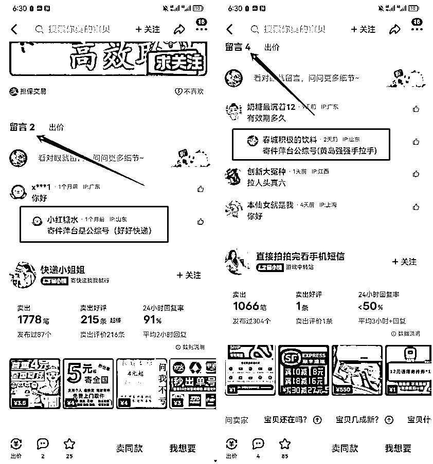

下面是闲鱼推广的效果，闲鱼推广粉丝精准，复购率高，1000多粉丝出单10000+单，利润15000+

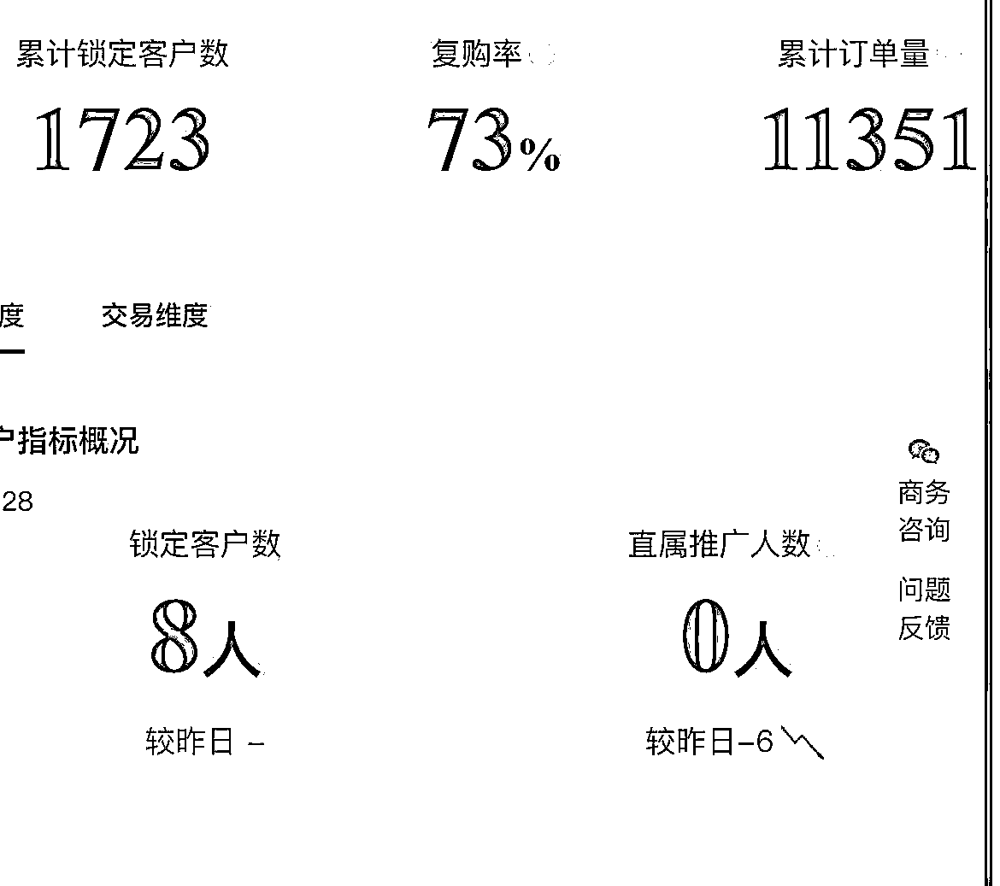

# 闲鱼快递代发攻略-准备工作

# 3.3.4、下载闲鱼APP

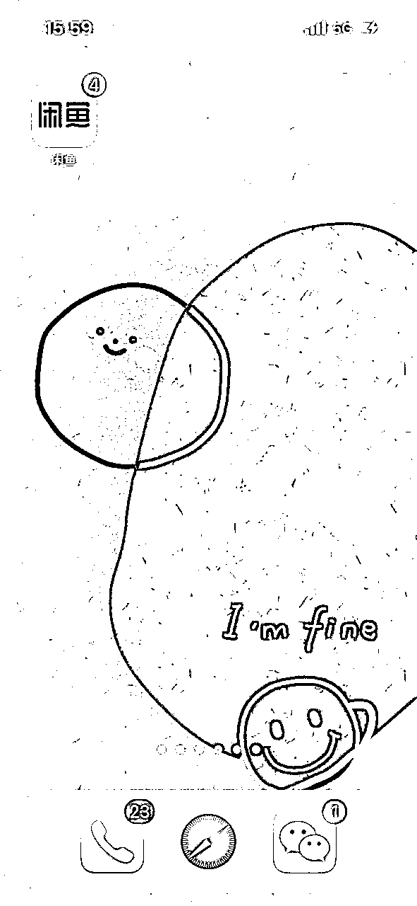

# 3.3.5、使用淘宝账号或支付宝账号登录

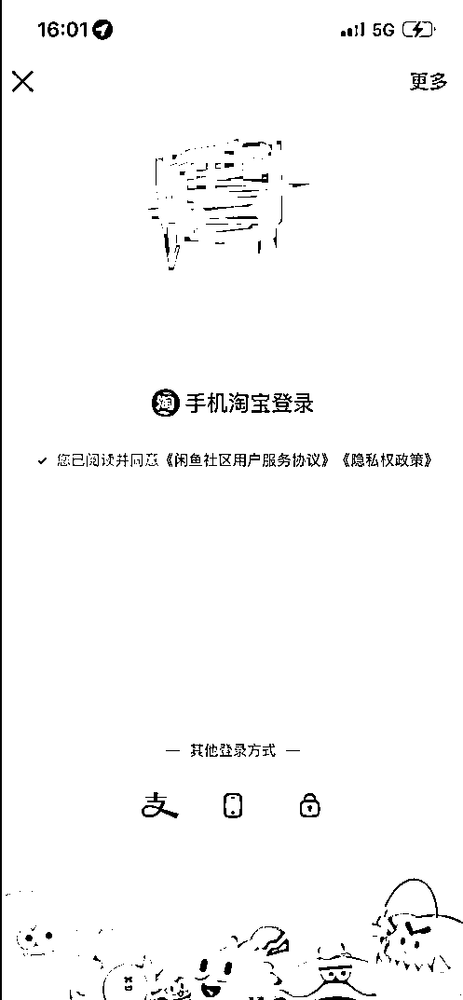

# 3.3.6、授权支付宝芝麻信用

## -打开闲鱼APP，点击个人中心右上角的【设置】

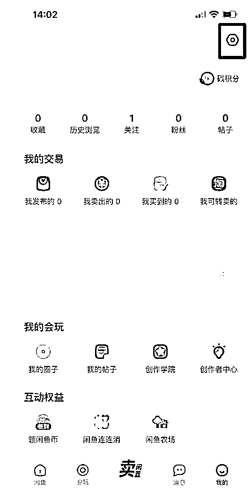

## -在列表中找到【个人资料设置】，点击打开

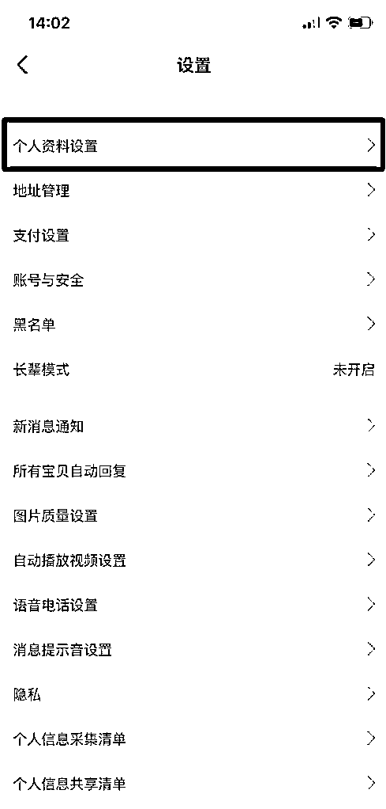

## -在列表中找到【芝麻信用授权】，点击右侧的【去授权】

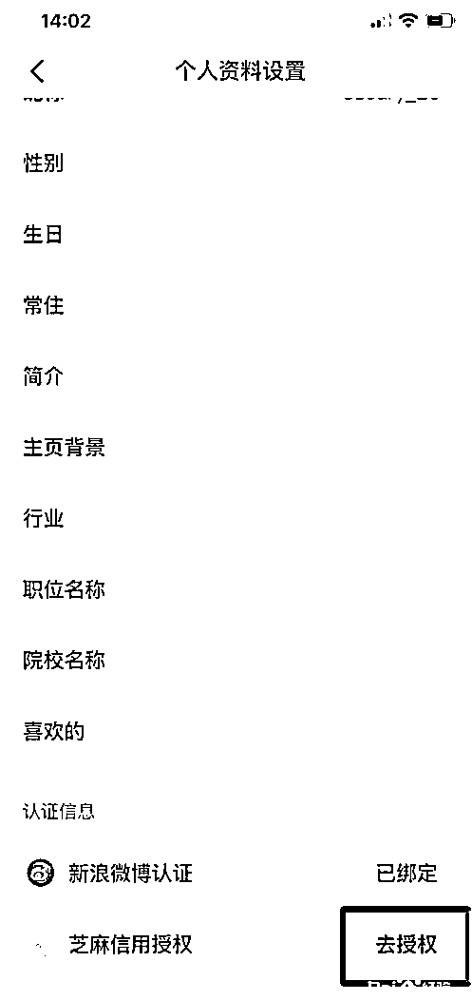

# 3.3.7、修改个人资料

## -设置名称

建议取名跟快递相关

## -设置个人简介

专业快递代发！秒出单号/回复快/支持自助下单，默认下圆通，另外因为单量大，粉丝和老客户有自助下单优惠。

## -设置喜欢的

随意选择

## -常驻地

随意选择

# 4.后续会不断更新推广方法

大家保存好链接，后续会不断更新推广方案、希望大家都可以年入百万，么么哒

以上推广方式都是纯自然流免费方式、有钱的可以选择付费投信息流！！！！！！