# f《全职妈妈做博主·关于我把50块钱的商单翻了260倍的4年实操经验》

> 来源：[https://c9q9vdwwvd.feishu.cn/docx/S7TKdf2BCo7JCjxgnkCc3z9Mnjg](https://c9q9vdwwvd.feishu.cn/docx/S7TKdf2BCo7JCjxgnkCc3z9Mnjg)

# 1.起号大坑‼️

我从0-1w粉，用了整整一年，

不是因为数据差（千赞小豹纹我出过很多

也不是因为更新慢（基本一周2-3更

而是

！！！

没有预留广告位。

2020年我儿子刚开始吃辅食，就顺手发了做辅食的过程，虽然我不会做饭！但辅食做起来很简单，所以起号还算顺利，没多久就有几篇2000赞的小豹纹。当时也没想着赚钱，纯碎是享受每天99+的成就感

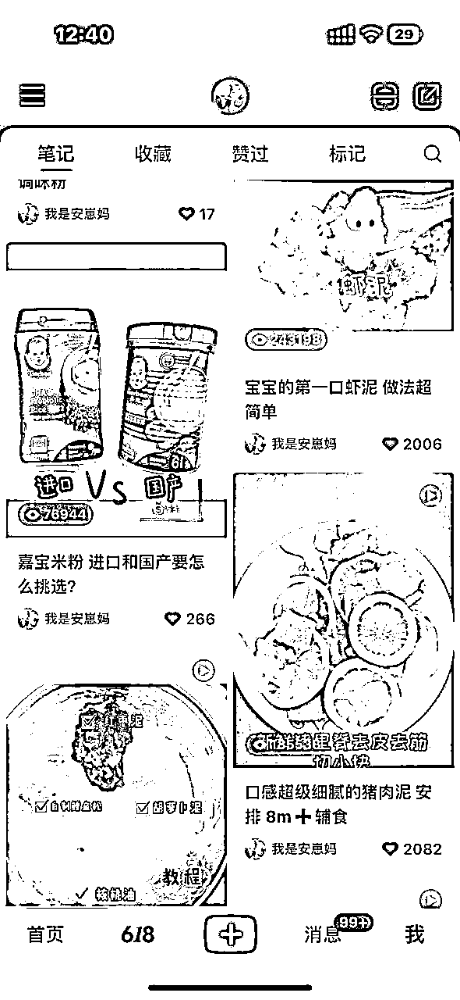

一直发了半年，到21年初，已经有5k左右的粉丝。我开始回顾自己接到的广告，就基本是辅食油，餐具，水杯，锅具这些。大部分是置换，稍微有钱的品牌会给稿费有50-200/条。一个月能接5.6条，一个月也才1000出头+吃不完的辅食油

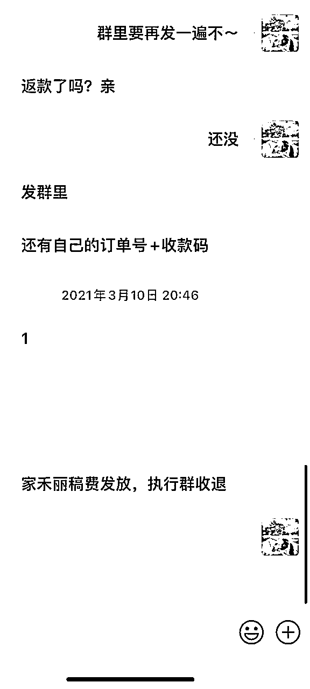

·

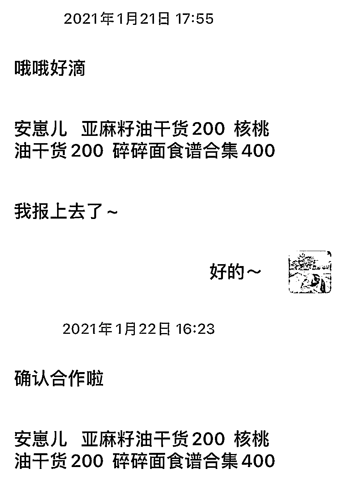

复盘一下，问题就出在，我的辅食笔记里，没有拍到人，没有拍到景。只有做饭的过程，甚至还是图文的！

可植入场景更有限了，

而品牌在选博主的时候。通常时候就是刷笔记的时候，刷到竞品或者同类产品的广告。再顺手点进去邀约博主

第一步就是筛选有没有合适露出的广告位，

比如学习桌的广，就需要在平常视频里露出学习环境

空气炸锅的广，就需要在平常视频里露出美食制作过程

探店的广，就需要在平常视频里露出出门逛的过程

乐高玩具的广，就要在平常视频里露出小孩子玩玩具的过程。

总之，想接什么广告，就去往它的场景靠近

而我的辅食号在第一步就被pass了。

-

同理，如果是单纯的做饭博主，如果只拍自己的手在不停的切菜。炒菜，再加上个做完的成品，那接到的广告也就只有一些食材锅具，

单纯的家居博主，如果只在拍自己家里的沙发，茶几，床，那接到的广告也只有置换居多的小家具

单纯的学习博主，如果只拍自己看过的书，写过的读后感，那接到的广告只有置换的书。

....

太局限了，不说商单的可选择性太少，关键是，没有人设，没有特点，涨粉也会很慢。豹纹的概率低

后来我开始拍视频了！一开始也没有露脸拍，《宝宝的第一口米粉冲泡指南》也小豹文了，1000赞～

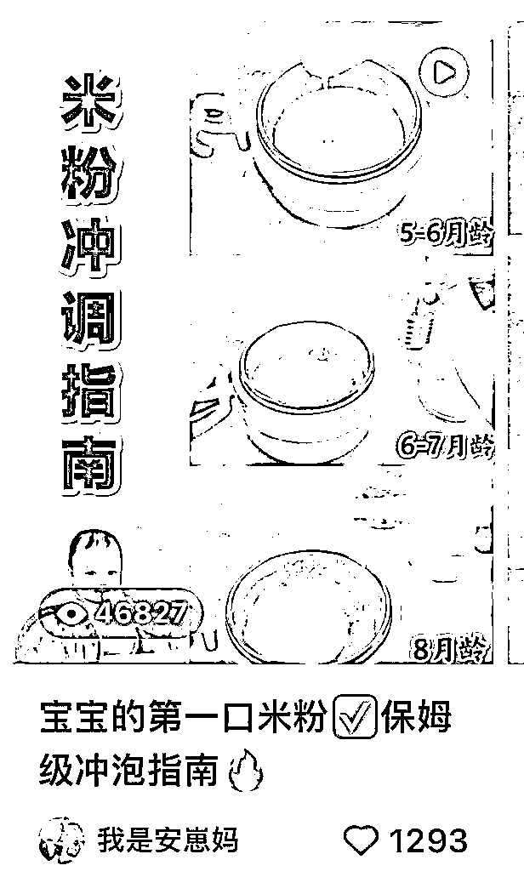

吃到视频的甜头后，我开始鼓起勇气露脸拍了～选的主题是1688童装店铺的合集，数据也都不错，还迎来了我的第一个视频广子，稿费涨到了500！

（那会小红书对软广的打击还没现在这么严，所以大部分广告都是不走官方报备的，也不会被判违规，现在不行了哈！广告最好都得走报备）

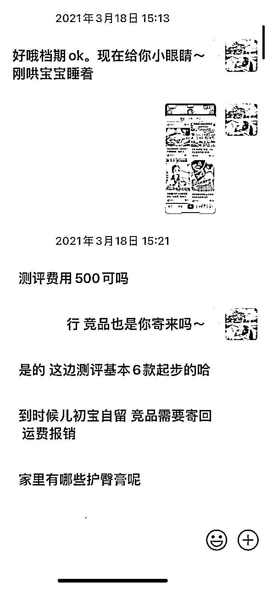

随着接到广告，我的视频内容就更加丰富了，《婴儿车测评》《选奶粉》《洗护产品测评》统统都是围绕着广告品本身去写的内容，

-

然后还出了《新生儿护理攻略》《哄睡神器》这2篇w赞大豹纹。

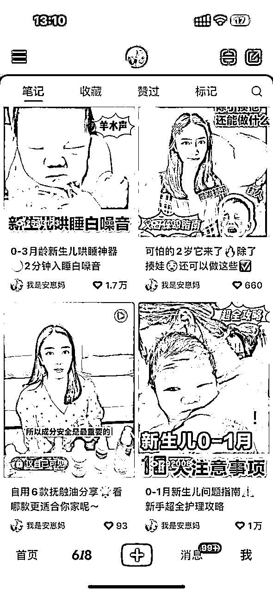

到5月的时候，就有1万粉丝了，开启了蒲公英接单，也接了第一单走小红书官方的报备广告，1200💰扣去平台税点10%。到手时1080。

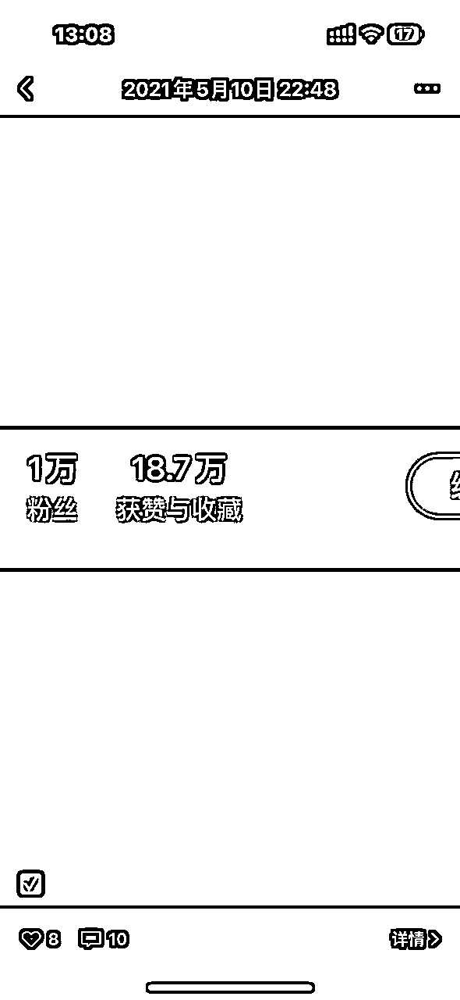

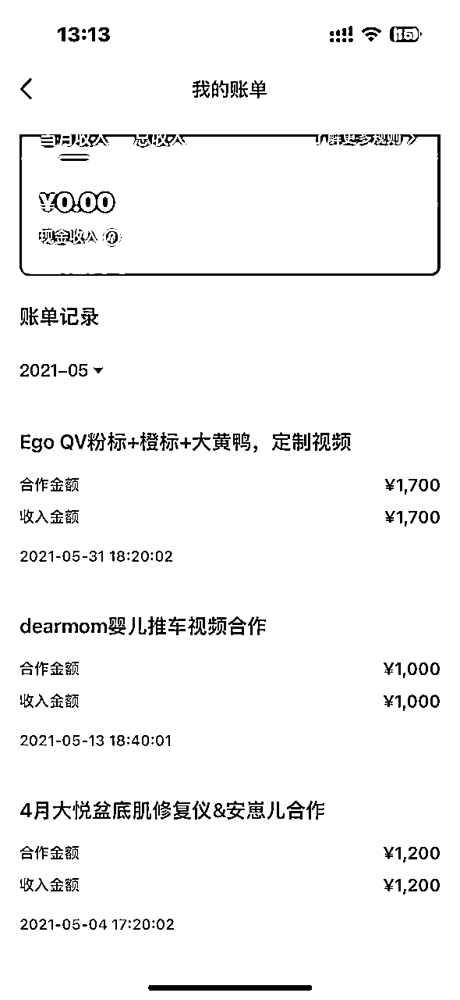

到这一步，我的广告位已经被彻底拉大了，任何关于母婴产品的广告我都可以接了！

·

* * *

# 2.拉高笔记数据

但凡是了解过博主变现模式的，都知道

接广告不难

难的是怎样维持数据⚠️

让自己持续的能接到广告⚠️

## 2.1内容形式

我把适合个人做的笔记类型分成这几类

干货：对专业性的要求高，难写，大多数品牌喜欢，因为干货难被人听懂，所以数据难掌控

硬广：对专业性没要求，好写，品牌喜欢，除非品牌砸钱投流，否则数据难掌控

软植入：对文案要求高，有一点难度，大多数品牌喜欢，数据好掌控，

合集：对文案要求不高，选品要求高，大多数品牌不喜欢，数据好掌控

测评：需要做的准备工作多，大多数品牌喜欢，数据起的慢，但通常不会差

·

每种我都测试过，但现在最常写的就是合集，干货软植入，测评类

因为在不额外砸钱投薯条的情况下，这几个是最好掌控数据的，就像我的数据是不是大起大伏，算是很稳的，至少也能在300赞+，所以只要报价不是太高，被品牌方选中的概率还是挺大的，

而和我同量级的博主，要么因为总是发硬广数据不好，要么总是发不报备的软广，被平台抓到判违规，所以这两年都在降价接单了，而我不光没降价，还从1000慢慢涨到了11500。

所以选好笔记类型对稳定笔记数据，也是很重要的

## 2.2打磨文案

用户喜欢的广告都是软到看不出广告的

（除非是自带流量的明星大v）

so！想要笔记数据好，就千万不能直接复制bf里面的卖点

文案没啥技巧，就跟写作文似的，多看范文，多学多练，

如果跟我一样，从小作文就流水账😅

那就去看100条w赞以上的广告，就是右下角带赞助标那种，0.75倍速看，

我自己用的笨方法就是每次看到别人写的好的句子，就会逐字逐句编辑在文案收集库里，这样下次自己写的时候可以直接拆解别人的文案，套用在自己要写的产品上。依葫芦画瓢嘛。

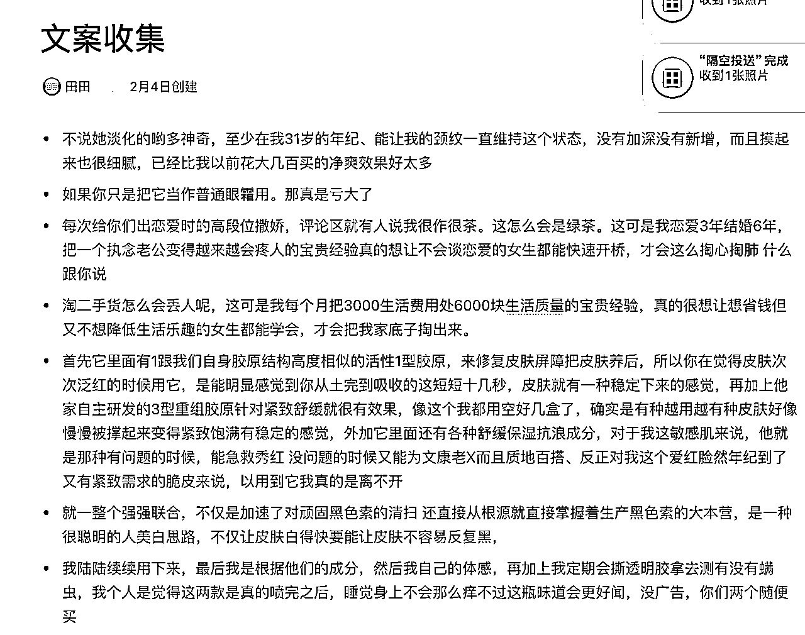

## 2.3关于拍摄剪辑

### 封面

在小红书，有个封面点击率的指标。用户期待的是点进去的内容

在抖音，是2s跳出率的指标，用户永远期待的都是下一条

所以小红书用户是很容易被封面吸引进去的，即使内容不咋地，也会多看几秒（毕竟，来都来了是吧～）

封面可以多拍几张，多换花字来测试流量

我去年年底那百万浏览量大豹纹的封面就是拍了几十张才选出来😅

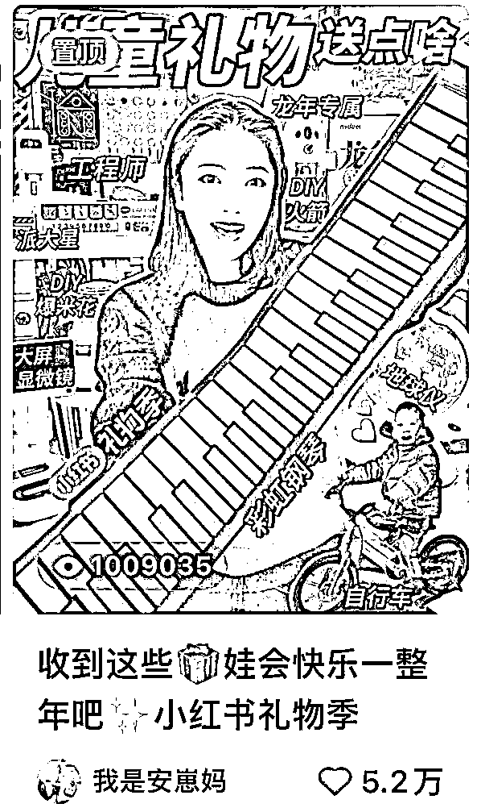

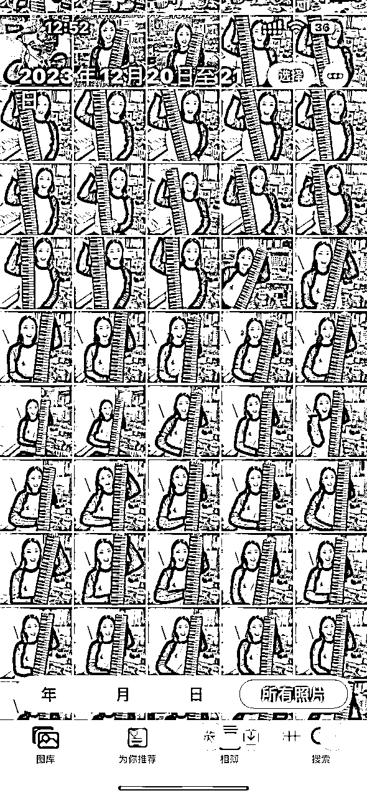

### 拍摄app

我之前一直是用美颜相机（原生模式）

虽然比经典模式要清晰很多，但还是会糊，尤其是光线不好的时候

现在用的是开拍，随手拍一张 你们看看对比～

明显比美颜相机要柔和些😅

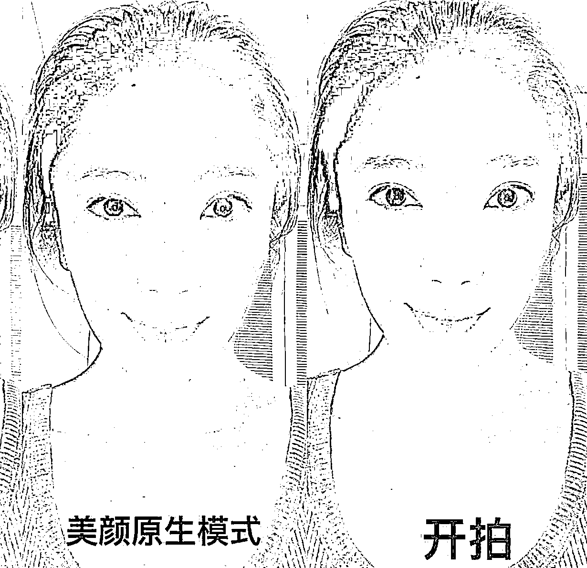

By the way ，不管是什么相机，剪辑的时候 都是可以再美颜美妆的～大胆露脸拍吧！美颜美妆拯救一切“不完美”~嘻嘻嘻😬

### 剪辑技巧

我是没有学过剪辑的。就跟着手机剪映教学的博主依葫芦画瓢试着练～

但是身边的博主朋友 都说我剪的很专业😛😛

但他们不知道...

🥲其实我所有视频的拍摄剪辑都是在手机上完成的。也找过好几个剪辑师，报价在1min100-150左右，价格不高，但是我实在不满意他们的样片，剪辑师这事儿就不了了之了。

直到上个月～才买了个电脑💻最近几片都是电脑剪的了🤪

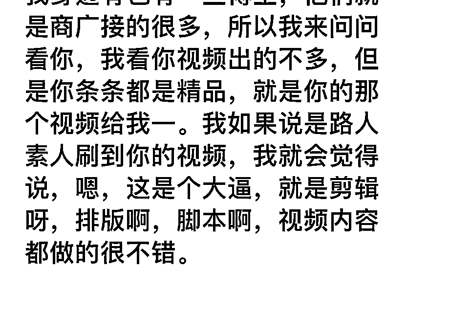

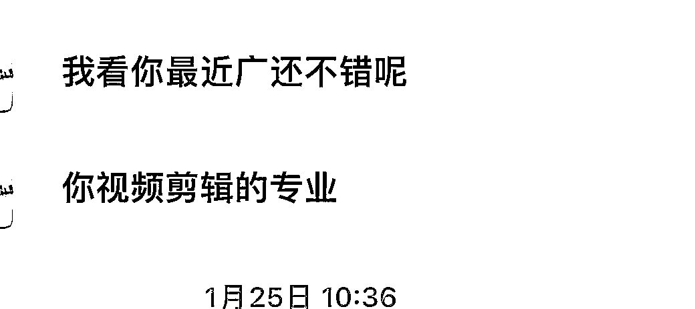

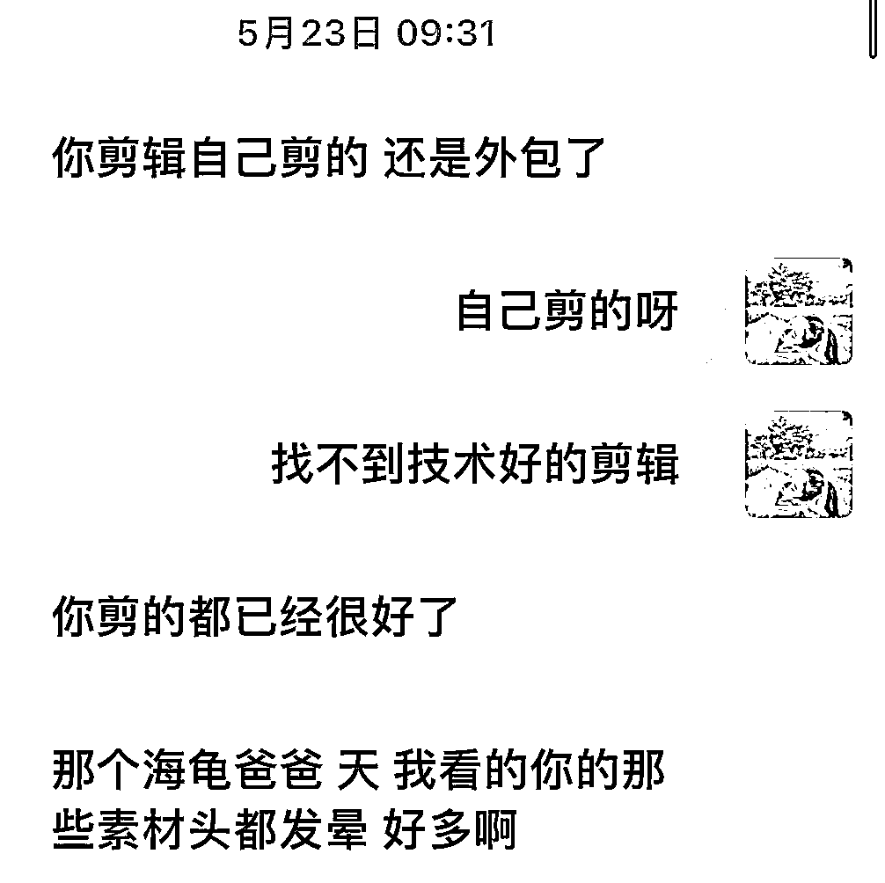

### 我的剪辑思路

先粗剪+美颜美妆（把不卡壳的口播剪出来）

再添加不口播的素材（画中画模式）

识别字幕（再确认好素材之后）

把重点字用花字标注

隔10s左右加个特效（蒙板/转场/表情包都可以）不然一直口播会让人没耐心看

加背景音（背景音音量建议调20左右，口播声音调200）

加音效（音效要多！尤其是以口播为主的视频，基本上3s内就要有个～能让平平的口播节奏变得灵动，可以配合花字或者手部动作的出现，加个合适的音效）

分享几个我常用的万能音效吧

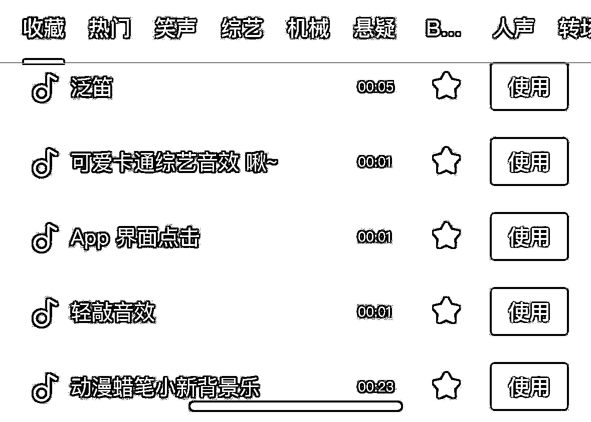

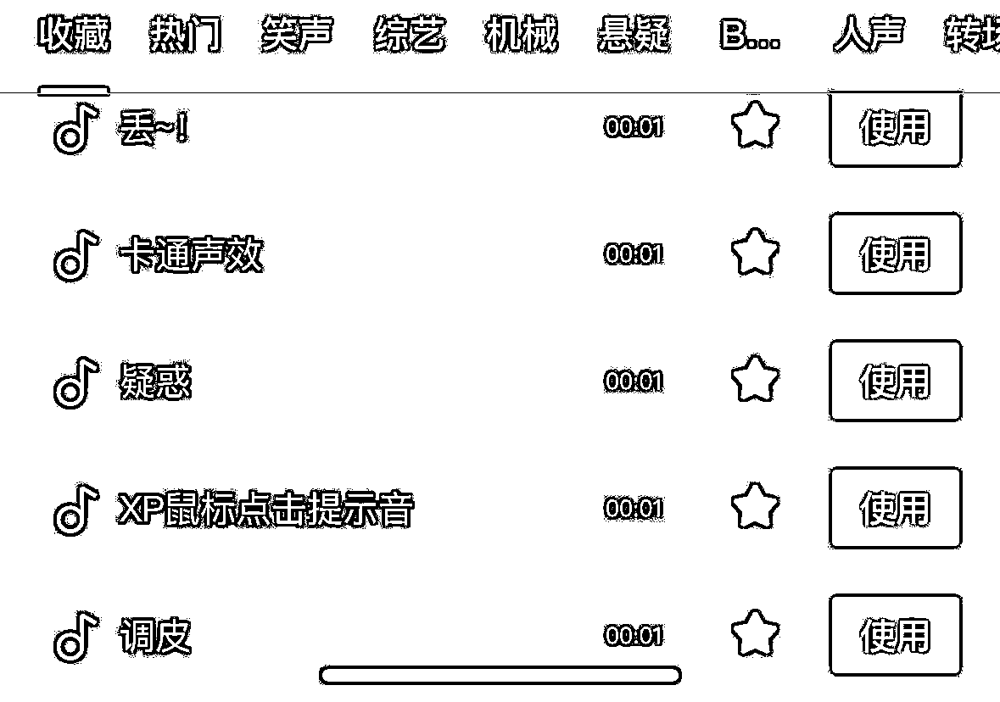

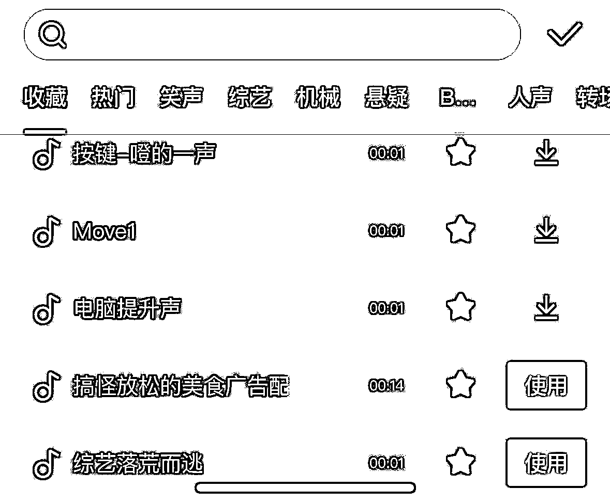

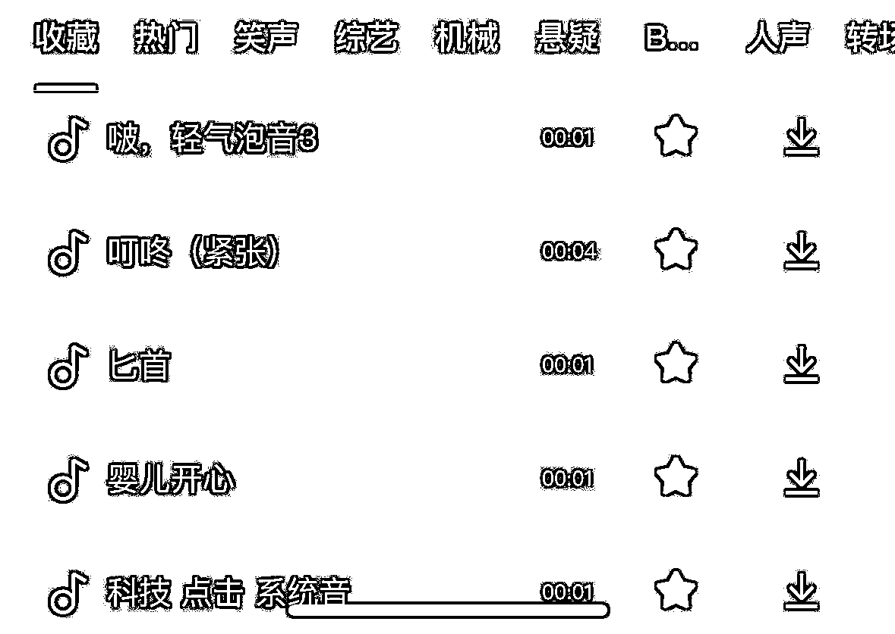

## 2.4多参加平台活动

我这里说的不是笔记灵感里的那些话题，它最多只能给你提供选题思路，并不能让笔记流量变好

要看的是“消息通知”-“活动通知”它里面经常会有

“恭喜你被618专属流量砸中了！”的活动，点进去后进到小红书的官方群聊，然后会在里面登记账号id，官方会给账号开白名单！

参加官方推的活动，只要笔记符合规定，基本就会有5w+流量曝光的扶持。

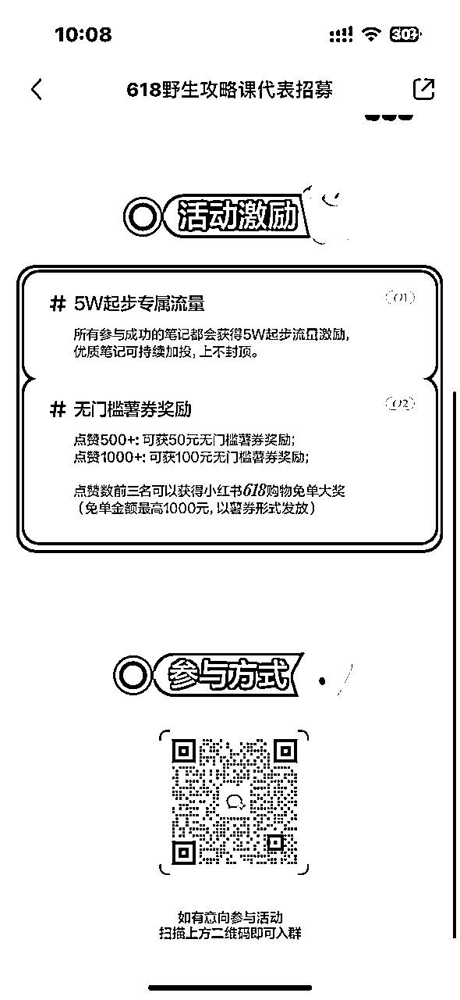

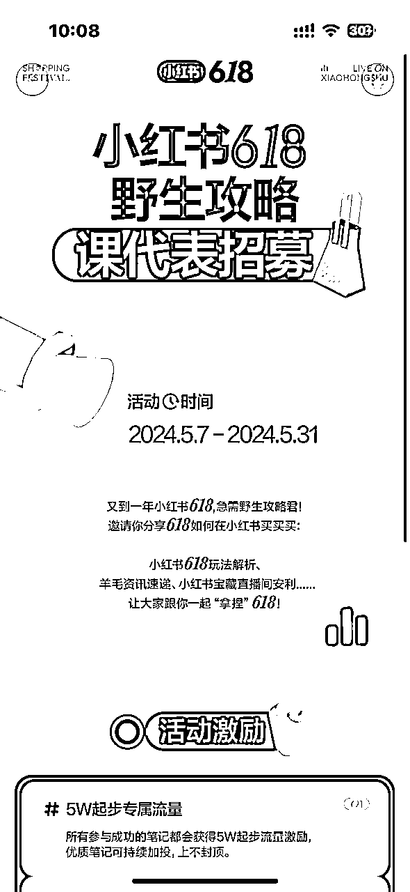

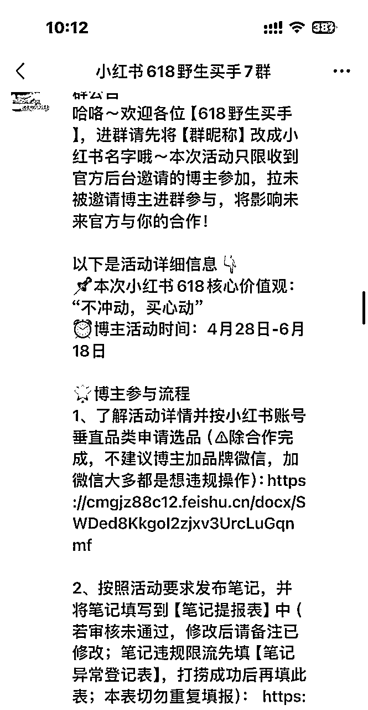

你们看我这篇笔记，刚发布的前2天基本没有流量，甚至还被判了广告贴，掉收录了，就是因为我参加了礼物季的活动，官方给我从小黑屋拉出来了～还给我涨了1000000+的浏览量！！

这条笔记，稿费七七八八加起来有7000，再碰上官方投流真的贼香～

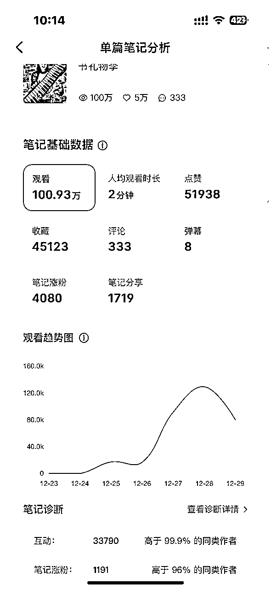

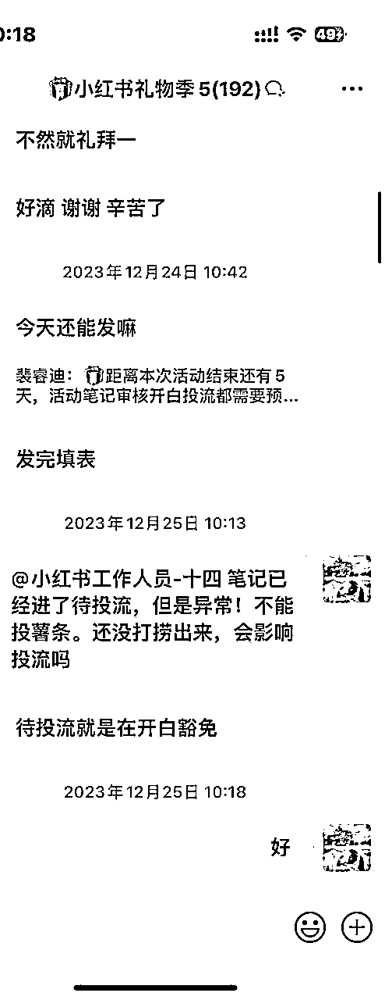

# 3.边接广告边涨粉

我的号10条里都9条都是广告。然而一点都没有影响我涨粉+变现。

一是因为我的笔记数据很好很稳～

二是因为我很挑，对广告很挑

## 可以接的广告

1.有预算投流的品牌（可提前和pr确认，或者去搜搜这个品已经发了的广告数据咋样）

投流是品牌方花钱给你的笔记投放的意思

很香！！很有可能会把原本数据不行的笔记，拉到千赞以上～

2.大品牌

比如说母婴类目的帮宝适，飞鹤

美妆护肤类目的欧莱雅，兰蔻

家居类目的美的，戴森、3m

...

大品牌是自带流量的，不仅会提高搜索流量的概率，而且还能让更多大品牌pr看见你

## 不要接的广告

接1条10000的广告比接10条1000的广告，可要香多了

像这些我都是直接pass的～

❌没几个店铺在卖的杂牌，小牌子

❌图文直发（伤害号易违规）

❌医药类（专业性太强）

❌不符合消费观的（十几块钱一瓶的婴儿水啥的。。。智商税）

❌差评多的（会让路人转黑）

⚠️日系品牌（没原因，就是不喜欢！！）

⚠️脚本已经写好了，但品牌方硬要修改里面提及的缺点的（这个看个人）

⚠️返点要求离谱的

（返点的意思是：报价的一部分需要返还给pr。比如我报价11500，返点20%，就需要返给pr11500*0.2=2300。）

只要报价合理，正常返点10-25%。撑死了这么多！除非是会送大额的产品，比如我一开始提到的6k+的学习桌。返28%我很愿意😬

只有那种很水的买来的号..他们会给30%-40%甚至是50%很高的返点....我们大大方方做内容的，宁缺毋滥😠

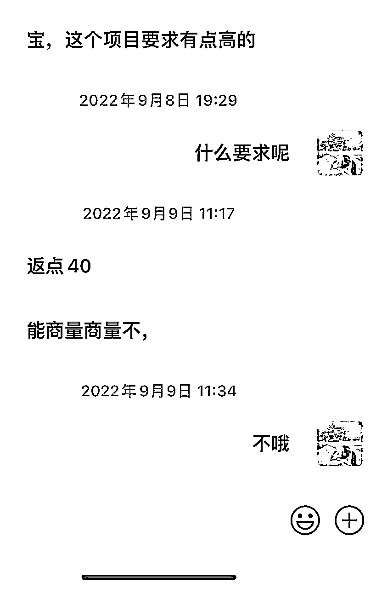

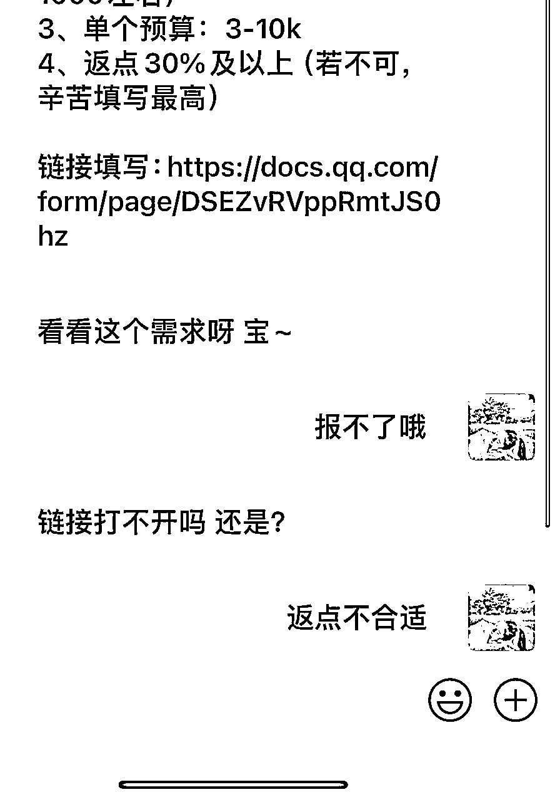

估计这几年，拒绝的广告都有7位数了（怪心疼的😅😅😅）

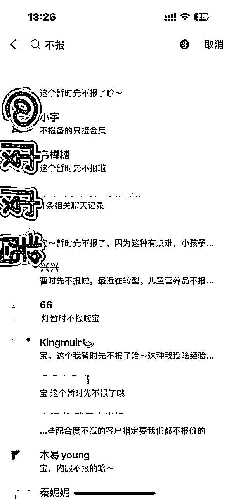

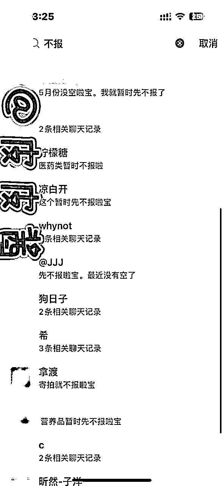

但没事！！毕竟我也不想做个只发广告的水号～把更多时间留给自己打磨脚本，只接自己真正觉得实用好用的产品，博主路才能走的更远，不是吗～

-

好啦！感谢你能看到这里，如果还有对小红书个人博主有什么交流问题～咱们评论区见呀