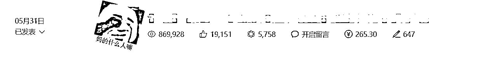

# 公众号坚持半年，分享我的成长和踩坑之路

> 来源：[https://uxem6iksdzz.feishu.cn/docx/PLaKdXycmoYiR3xD2RrciAQlnLf](https://uxem6iksdzz.feishu.cn/docx/PLaKdXycmoYiR3xD2RrciAQlnLf)

## 一、写在前面

大家好，我是大何，去年八月底加入的生财，目前状态是自由职业，主要做公众号流量主项目，写这个帖子，是要分享一下自己最近做公众号的心路历程，也是写在公众号爆文航海之前，给各位圈友打打气。

我是参加了去年12月公众号爆文航海的船员，之后3月份当了一期志愿者，这次6月航海，因为志愿者报名比较激烈，这次我再次成为一个船员，期待和一起在爆文航海中拿到好的结果。

生财上面关于如何做公众号爆文项目已经有了非常多的优秀的帖子了，和很多大佬相比，我这点成绩微不足道。

但在去年12月之前，我还是一个未入门的小白，通过近半年的摸索，从用AI赚到第一桶金，到账号断流，焦虑，手搓文章再次入池，两周变现了7k，累计变现1.5w，或许这段经历对你会有点帮助。

这里不得不感谢生财的航海教练兔子鱼和教练猫哥，他们是我在这个项目上的领路人，没有他们我可能还在闭门造车，或许早就放弃这个项目了。

本来我觉得我1.5w这点成绩实在不足为奇，但是兔子鱼教练鼓励我可以勇敢分享，给大家一些动力，也希望可以或多或少对本次航海的新人起到一些帮助。

## 二、做公众号爆文的经历

### 1.入门即是低谷

去年12月份，还记得当时航海介绍的主流的玩法还是找低粉爆款的文章，借助AI快速生成文章，保证一定原创性的前提下，通过保持日常更新，等待入池后获得流量主收益。

因为起步比较晚（错过了爆文项目最好做的红利期），12月爆文航海的时候我还只是一个什么都不懂的小白，航海之后我虽然还在继续做爆文项目，但是始终是没什么收益。

那时候我AI用的还不是很熟练，当时主要是用手搓文章，基本没什么收益，每天写的很痛苦，但是还是坚持不放弃，直到过年回老家了，索性断更了一段时间。

过完年之后回来，重新开始思考这个项目，把生财上所有的公众号爆文的帖子都看了一遍，同时向有结果的大佬付费学习请教。

在陆续解决了之前几个卡住我的点之后，时间来到了3月。突然陆续有账号入池了。

### 2.拿到收益

那段时间看着不断上涨的数据，每天都很兴奋，充满了干劲，但是还是当时对项目的经验和理解略微有些不足，对于入池的账号，内容更新量没有跟上去，如果是以现在的认识，可能可以把收益再放大一倍。

不过好景不长，三月下旬以来账号就没什么流量了，赚取的收益主要就是那一两周流量好的时候赚取到的，大概变现了6k左右。

这段时间能拿到收益，在我看来主要还是运气居多，选了流量大的常规赛道，情感，职场和律例，文章主要是AI生成，稍微排版润色后就发布了，坚持更新后，陆续有四个号有了流量，但是都不持久，最多的就推了一个多星期的流量就出池了。那时候以为账号入池了，应该继续搞更多的号来扩大收益，但是接下来的两个月，账号就再没有新号入池了。

总结的经验就是一句话：你不知道什么时候流量会来，但是流量来时，请一定要尽可能抓住机会，把你认知以内的能力转为你的钱。

### 3.账号断流

一直作公众号的小伙伴肯定知道，整个四月份和五月份，公众号很难做，很多人的账号都遭遇了流量断崖。可能前一天还是10w+的数据，到第二天起来就是个位数了。

我当时做的十个账号基本上都没有什么流量，我也不知道怎么我是怎么坚持下来的，我AI用的越来越熟练，产出的文章越来越好，但是账号流量却一直好不起来，说实话，挺打击人的，以前一天几千条消息的公众号信息交流群，变得一天只有几十上百条了，这也侧面说明了一些问题。

更让人感到迷茫的是，以前的很多起号经验都不管用了，什么文章阅读推荐比例，完读率，阅读率，这些指标好像都没有用了，账号阅读数据始终难以提升。

这段时间也冒出来一些人，号称有内部渠道，可以让账号重新获得推荐，不少人也被割了。其实被割的这些人，都不算是小白，之前流量好的时候，估计对这种骗子不屑一顾，但是当账号失去流量的时候，焦虑的心态影响了判断，病急乱投医，哪怕只有百分之一的概率也想试一试，结果不出意外就是被割了。

不过同时我也观察到，流量不会消失，只会转移，这个时期，会发现还是有一些小号还是能做起来，或许是排版比较精致，看起来比较悦目，或者是内容的观点比较独特，看起来是像手写的，没什么AI味，还有就是一些比较小众的赛道。

### 4.公众号改版

这段时间流量的极不稳定，我们理解为是公众号的推荐算法的改版，从逐步开放留言功能，到5月8号，微信公众号发布新版本，编辑后台大幅度改动。都证明了这一点。

比较重要的一点是在声明原创的时候，不再需要选择领域了。以前写文总是纠结该选什么领域，现在不用纠结了，

这这让我想到了头条号，不管是发什么类型的文章，都不需要选择分类，系统会自动分类。

之所以取消赛道选择的一个原因是，我觉得他给的那些赛道，根本不能包含所有的赛道。

所以，要想迅速崛起，那就去做小众的，独特的，给平台带来价值的内容。

在这之后，我觉得，有内容，有深度，能引起人们讨论的的文章，才能获得更多的流量。这也是我想法转变的开始。

## 三、转变思路，开始手搓

公众号赚钱容易吗？以前可能容易，以后或许没那么简单，想要长期赚钱，我觉得一定要在内容上下功夫。

在这个思路下，我开始重新在我的一个日更号上，每天花时间花心思，自己手搓一些有内容增量的文章。

关于手搓，其实我很早就开始尝试了，这次与其说开始手搓文章，不如说是转变思路，转别的写作领域。

这个号是我去年10月份就开始更新的一个日更号，当时主要是看到一句话，互联网时代，依旧是属于敢于发声者红利的时代。

我虽然不知道怎么样发声能被更多人听到，但是还是那句老话，完成比完美更重要。

这个号之前一直更新自己一路来的复盘，公众号运营技巧，偶尔发一点影评或者个人思考，一开始是打算往ip号方向发展的，但是这段时间发的内容都比较随意，更多地像是自己的碎碎念，每天想到写什么就写什么，文章的阅读数据也是惨不忍睹。

或许很多人都有和我一样的误区，就是觉得坚持下去，总有柳暗花明的一天，坚持就是胜利嘛。

但就像鲁迅先生说的：楼下一个男人病得要死，那间壁的一家唱着留声机；对面是弄孩子。楼上有两人狂笑；还有打牌声。河中的船上有女人哭着她死去的母亲。人类的悲欢并不相通，我只觉得他们吵闹。

把公众号当成朋友圈来发，其实很难真的把个人ip做起来。而且没有正反馈的坚持，往往也卡住大多数人。

我现在回过头来反思那时候的问题，就是一直呆着自己的舒适区里面写点内容来完成自己的日更，其实我觉得日更不是关键，关键还是在信息增量。

有点扯远了，说回我是怎么找到我写爆的领域的。

我是在5月20日的时候，刚好那天是情人节，加上那段时间很多的胖猫事件，我就有感而发写了一些自己的观点，然后第二天发现，平时只有一两百阅读的账号突然到了4千多。

这个时候，我觉得这个或许是一个异常值。

之前听大佬分享过异常值这个说法，就是抓住异常值，你能赚很多钱。于是我开始分享分析我的异常值。

我发现我之前有时候写过的热点类的文章阅读数据，都好过我知识分享类型的ip文，那这个异常值，我觉得或许就是写热点类的文章。

于是接着我开始摸索怎么写热点类的文章，在边写边摸索的过程中，我在24号写出了第一篇爆文。

然后觉得方向没错之后，我继续挖掘这个异常值，从5月20号开始，到6月4号，前后一共拿到了212万的阅读

大概流量主变现了6700元，还有零零散散的一些文章打赏，加起来大概有7k。

最值得吹的就是有一篇文章收获了将近两万个点赞，另外还有两篇50w+的文章。可惜后面被人举报了，文章限流了，这个后面踩坑经验总结说。

## 四、踩坑＆经验总结

### 1.踩坑：关于文章选题。

其实我在写作的过程中，最花时间的不是搓文章，而是找文章的选题。我花了比较多的时间去找合适写的选题，然后去找素材，然后自己去整理素材写文章。这种方法就是比较花时间，我那段时间就是一天只写一篇，再写第二篇就感觉写不出来了。

同时因为写的是热点类的，对于文章的写作尺度，需要自己好好把握住，我有几篇文章就是写的太情绪化，以至于网友激情发言把评论区封了。

### 2\. 踩坑：关于留言区的问题。

你写实时热点，特别是写带负面的社会新闻，留言区不要开自动精选，现在的网友的戾气很重，大环境不好，大家过得都不容易，看到一些负面的新闻，很容易就在你的评论区里面暴力输出，我上面那篇文章本来是开了留言的，但是就是评论区太负面了，被人举报强行关闭了，文章也就断流了一天，虽然第二天又恢复了一些流量。

根据我对一些对标大号的观察，他们很多人也都只放出了十几条左右的评论，或者干脆不开留言区，反正这个有利有弊，自己权衡。

### 3.踩坑：被人连续恶意举报，账号被限流。

这部分其实就是合规成本的问题了。当你文章数据好，被别人或者平台盯上是很自然的事情，我们要尽量去避免账号违规，这里分享一个我的踩坑经历。

写热点时评类的文章，难免会引用一些第三方信息来论证你的观点，但是要注意引用的比例。这个比例我咨询了官方客服工作人员，并没有明确说明是多少，但是根据我的踩雷经验，大概是要在10%以下的。

文章不火还好，文章火了，如果被人被人举报滥用原创，你的文章基本上就断流了，不会再有流量。

这个是我之前用AI写文章没有踩过的雷，以至于这两周手搓文章里面，有四篇被人投诉了滥用原创，违规理由都是是大篇幅整合引用第三方内容。

虽然我觉得我的文章引用的部分占我文章的篇幅是很少的一部分，但是一旦被人投诉，且平台审核认定了，你基本上只能自认倒霉了，这种情况申诉回来的概率极低，而且就算申诉回来，账号的流量也是回不来了。

咨询了官方那边，对于这种被人恶意举报的情况，怎么处理？他给的回答对于引用内容，是尽量用官方的引用格式，来避免纠纷。

所以如果是手搓文章，不要原文复制粘贴，或者你直接用截图来展示，或者用你自己的话话来重新表达，不然一旦被举报了，账号想要再起来就很难了。

所以，如果你对你的文章内容没有很大的原创把握，建议不要标原创，我原创掉了之后，其实还跑了两天流量，算了一下单价，好像单价也都差不多的。但是账号违规，导致现在流量再也回不到之前了。

### 4.经验：关于写作心态

我在写的过程中，有时候花了很大力气，自己觉得写的好的文章，但是写出来却是反响平平，这种时候是比较打击自信的，没有什么办法，就只能调整心态，继续写下一篇。

另外还有一个就是，不要为了蹭热点而蹭，你的文章最好还是垂直于一个细分领域去写，一定要想清楚自己的写作领域是什么，而不是什么热点都要去写，蹭流量。

### 5.经验：一鱼多吃

我在这个账号写出几篇爆款之后，收到了网易号运营号的邀请，去网易号发内容。

这里就是提供一个一鱼多吃的思路，像头条号，百家号，网易号，你的文章都可以同步过去，实现增加额外收益，这几个平台的收益虽然比不上公众号，但是对你来说，边际成本很低，有时候公众号文章发出来没什么数据，同步到其他平台反而有阅读数据，这个都说不准的。

### 6.经验：账号再次断流之后的小复盘

1.首先最重要的还是心态，做公众号经历过几次大起大落之后，对于账号再次断流，我其实没有那么沮丧了，因为我觉得如果能做好内容，早晚还能东山再起的。

2.其次，文章违规了，被删了，被禁原创了，被投诉了，也不要觉得是多么严重的事情，要注意，也不要太在意。只要不封号，都不算严重，就算封号，公众号已经产生的收益还是会打给你的。这个其实就是前面说到的合规成本联系起来，尽量不要做擦边的动作，有的内容，有的号能发不代表你能发。可以在后台看看违规的具体原因，被提醒了就好好反思问题，避免再次犯错。

3.如果有篇文章的数据非常好，你就要好好思考一下这个异常值了，可以深挖标题和内容，再写几篇，吸干流量红利，不建议直接不改动直接重发，短期可能没事，但是谁知道以后呢。

4.要建立自己的素材库，一份素材，素材的组合，去生产多份文章，从不同角度来写，

5.做有积累的事情，要思考现在的动作对自己有没有复利，AI始终是一个工具，但是写作能力是你自己的。当然，这里不是平台排斥AI生成的内容，AI是整个社会的发展趋势，不管是哪个内容平台，都会积极的去拥抱AI技术，你用AI来创作高质量的文章，平台肯定也是支持的。你要做的就是做出更好更优质的内容。

## 五、写在最后

最近公众号流量主项目不太好做，但是就像涛哥说的，身为一个普通人，为什么要去揣度一个平台级的机会。

几亿日活，就算下坡路，也不影响个体赚钱。别练着林黛玉的量，操着施瓦辛格的心。

亦仁老大也说过，平台红利会持续很久，现在只是玩法过时了，我们需要寻找新的玩法，更符合平台规则的玩法。

任何一个平台都是有野蛮生长的状态，慢慢就会进入平稳期，现在似乎还在调整之中，但是明显最近的流量是比四月份和五月份好多了，但是不管在哪个平台，好的内容始终是成功的关键。

说了这么多，总结一下我的观点，

一是要持续深耕，不断打磨自己的写作水平，以及研究读者心理。

写公众号不是写书，并不需要多牛逼的文笔，但需要情感，需要情绪，谁能在字里行间调动读者的情绪，谁就能胜。

马斯克说，所有行动力不足的原因，其实都来自于精确性不足。 对于我们生财大多数圈友来说，也是这个道理。大多数人赚钱，并不是创新，而是模仿。模仿的精确性，来源于深度拆解。

一个赚钱案例，你能拆解越深，你就越了解这个项目赚钱的细节，越了解细节，就越有信心，行动力就会跟上来。 不可否认，公众号背靠微信这个基本盘，肯定还是能够赚到钱的。

二是以更好的心态面对流量的起伏。成功的路上其实并不拥挤，因为能坚持下来的人很少。

你现在能看到的占豪、洞见、卢克文工作室等这样的头部，也是在经历了很多次失败，有了很多积累了才成功的。

以前是求快，现在得求慢。

罗翔老师有句话说得好，我们唯一确定的就是不确定的未来，你并不知道你明天会发生什么。

公众号也是一样，你永远也不知道你发的下一篇文章效果会是什么样的。

你不知道这些忙碌有没有意义，但有一点不可否认的是，你的生命中又多了一点光亮，有了一点希望。