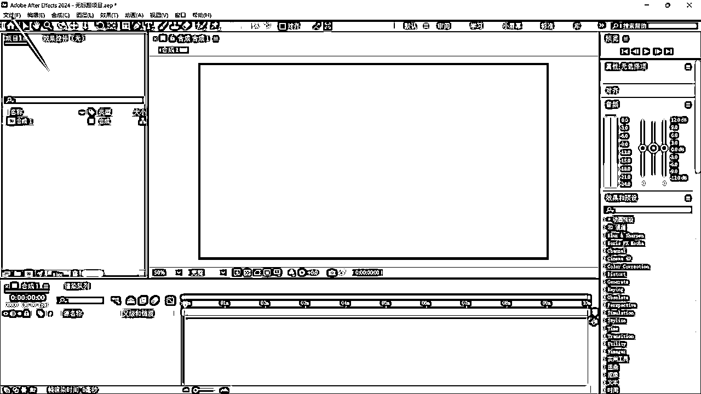
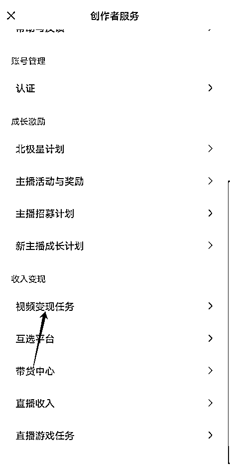

# 适合小白的自动化视频动画重绘去重方案，100%过原创（非AI重绘）

> 来源：[https://puojikpj98.feishu.cn/docx/SwPAdrelzo5Nhbx1KBvcoL4Wnbd](https://puojikpj98.feishu.cn/docx/SwPAdrelzo5Nhbx1KBvcoL4Wnbd)

# 一、写在前面

hi，各位好，我是大铭。

这篇文章是之前我分享的 的3.0升级版。

以前的去重操作已经跟不上目前平台的原创规定，很多时候通过混剪都会被判原创违规，所以开发了这种操作比较简单的重绘去重方案。

## 重绘效果：

# 二、项目介绍

## 1、适合人群

此项目适合不能自行产生内容，不想露脸，希望通过技术批量生产内容的素人或有能力做矩阵的老板们。

## 2、项目特点

操作简单：可以说一点门槛没有，简单来说就是抄作业，是个人有手都可以做，非常适合普通素人，而那些有能力自己做内容或IP的大佬就不要来竞争了。

占用时间：此项目可通过RPA进行自动化转绘。

变现方式：只要吸引大量观众，靠流量收益都可以得到很好的睡后收入，而且当粉丝量达到一定程度也可以通过视频带货，效果也是不错，当然也可以通过开课收学徒进行变现。

引流：可以通过视频钩子引流到私域进行二次销售。

## 3、适合平台

主收入：抖音、西瓜视频、今日头条、视频号

辅收入：大众点评、哔哩哔哩、百家号等

# 三、准备工作

## 1、内容定位

重绘比较适合一些有内容性的视频内容，所以可以以历史为主要赛道。而中老年人这个群体的一个特点是喜欢只听不看或少看

而要符合中老年人的内容其实有很多，其中包括：历史、英雄人物、健康解说、情感故事等

## 2、账号准备

手机卡：必须要一机一卡，用流量去操作，如果是刚注册的手机号码，通讯录里最好能存十个以上的联系人电话，这样不容易被判定为营销号，而且千万不要使用不正规的电话卡，如物联网卡，流量卡等等。

实名认证：注册账号后可以先不急着实名，等你视频有了收益需要提现后再进行实名。

昵称：如果你讲的是历史故事，那你就取 “**讲历史”，“**说历史”即可。如果你做的是其他内容，例如是动物世界，那就取 “**看动物”，“**萌宠”等，这个可以看看对标跟住模仿就行。

头像：用跟内容对应的头像，历史就用历史人物的卡通形象或影视图片

简介：这个也是可以参照对标来写，如“专注于三国时期的解说”就可以了

背景：背景图你可以找一些好看的国画做背景

## 3、对标账号选择

由于我们是通过混剪去重，我们在对标选择上要尽量选择同样通过混剪起号的账号。一般是用电视剧来进行剪辑的账号，有人会担心电视剧版权的问题，但这个其实不重要，因为我们找的对标，他都已经帮我测试过了，他能存在，那就证明这个视频里的电视剧在这个平台是可以用来来剪辑的。

## 4、所需软件

文字转语音工具：用于生成文案后文字转语音的工具，这种软件市面上有很多，包括剪映里也有这个功能，知识音色比较少，而我用的是文字语音转换大师，因为我以前花了98元买了终身会员，所以一直在用，而且这个平台还有很多转换功能，其中包括视频转文字，性价比挺高。

这里面也有很多音色可以选择，而且也可以另外付688元克隆自己的音色，但我觉得没这个必要。

视频转文字工具：大家可以用飞书妙计（免费的），也可以用上面的文字语言转换大师（需要会员）

AI平台：这个就不必多说了，大家都知道，就是用来做原创文案的，大家可以直接选择免费的文心一言、Kimi、360智脑等，有chatGPT那就更好，但都没太大关系。

剪映：剪辑视频，大家都懂

抖音：下载别人的视频进行二次剪辑

视频下载：我用的是亨亨猫，这个是需要付费的，但挺好用

AE、PR：用于视频的重绘

视频发布：用于一键同步所有平台，可以用“易媒助手”、“蚁小二”等，大家如何其他更好的软件也可以在评论区分享一下

# 四、详细实操过程

## 1、批量视频素材下载

打开抖音，搜索“历史”找到比较好的视频，点击他的主页，复制他的视频链接

打开哼哼猫去水印，将网址复制进”作者主页批量提取“项里，点击“主页批量提取”按钮，等识别视频出来后，记得点击下面“加载下一页”直到没有视频生成为止，然后就可以点击“仅下载视频”按钮进行下载了

当然作为视频素材我们要尽量多下载些，去多个对标账号里下载，上百上千也不为过，素材越多后面混剪时才能更好的去重。

但我建议大家可以去下载影视剧原版视频来做素材，这样剪辑后清晰度可以不用担心变差。

## 2、批量视频转文字

通过上面哼哼猫将对标视频下载好后，通过飞书妙计进行视频转文字，相信操作步骤大家都不陌生，我这边就不叙述了，不过飞书一次最多只能上传20个视频，这里大家可以编写RPA转换脚本，自动转换并保持到excel中，不然手工处理这么多视频，工作量也是很多的。（由于我是用文字语音转换大师进行转换的，所有并没有写飞书的脚本）

## 3、批量生成二创文案

通过上一步我们批量生成了对标文案并通过RPA存进excel里，然后我们就可以通过AI平台进行二次原创，这里也可以通过RPA进行操作（不是我不发脚本出来，而是脚本实在太长，而且我没有注释，看的很辛苦，懂得圈友可以自己编写，如果有不懂得也可以问我）

通过RPA在AI平台输入栏自动输入，我这里以kimi为例：

（1）”请你对以下文章进行改写，要求内容丰富有故事性，让人愿意读下去：“+excel里的文案

（2）请对以上内容做200字以内的简单介绍

（3）请根据范例将此标题改得更有吸引力，字数不少于20字，并给出五个标签，范例：“一口气看完大清第一女强人，慈溪太后的一生#历史#清朝历史#清朝历代帝王#清朝故事”

将生成的内容我们保存在excel中，当然一个原文案我们可以生成无数条二创的文案。

## 4、文案配音

将刚刚生成的文案复制到转换大师中，进行配音，选择自己喜欢的配音和设置就可以开始转换，当然批量转换也可以用RPA辅助。

## 5、视频转绘

我们首先打开AE或PR，因为以下内容以AE为例，点击新建项目

点击“新建合成”

根据需要转绘的原视频比例进行调节，高宽比例，时长等参数。

新建合成后，点击文件→导入→文件，选择你需要重绘的文件

导入成功后可以在项目栏看到刚刚导入的视频，将它拉到下面的合成窗口

如果原视频有字幕，将视频拉大，直到看不到字幕为止

在预设搜索中，搜索styleX的转绘插件，这个需要先自行下载插件，如果找不到的圈友也可以问我拿。

打开插件后，我们根据自己喜好对参数进行调节即可，当然单靠一个插件还不够，还需要AE自带的卡通插件

然后将我们新的配音放到合成里，并把原视频的音频选择去掉，那一个完全100%原创的视频就出来了。

我们通过CTRL+M快捷键进入渲染视频界面，将视频导出就可以了。

## 6、可通过RPA进行自动转绘

其实原理很简单，就是先保存一个参数和视频都已经设定好的AE项目，通过RPA不断的将视频替换再重新打开AE，通过控制快捷键来进行AE自动转绘。

贴一下影刀RPA流程，我自己写得有点繁琐，看不懂的可以问我

## 7、申请视频分成

字节三平台只要在其中一个平台申请即可

通过抖音搜索“中视频伙伴计划入口”，点击立即加入。

只需要达到加入条件并通过审核即可有视频收益。

微信视频号

## 8、中视频计划过审方法

多素材混剪，即在原视频基础上插入多条其他视频的内容，并通过手工最大幅度保证视频与文案的锲合度。

## 9、视频发布

就像上面介绍时说的，我们根据内容和视频收益选择好平台，使用一键多平台发布工具，进行视频发布。

目前市面上的发布软件如果需要用批量发布和定时发布功能都是需要付费，最多给你试用一下。而“蚁小二”在淘宝可以买到99元一年的会员，如果大家不想花钱，也可以自己写RPA，通过RPA进行批量和定时发布即可，我就是用RPA来控制的。

这边我用“易媒助手”做描述，打开软件后，上传剪辑好的视频，然后将我们刚刚用文心一言生成的标题、简介、标签都复制进去

选择需要发布的平台后，点击发布即可，你也可以根据客户群体日常高峰时间段选择定时发布

## 10、发布时段

我们分为三个时间段来发布，早中晚，根据中老年人的习惯，我们可以设置成早上6:00、12:00、18:00这三个时间短来发布。

## 11、审核违规处理

如遇到被判非原创或流量断崖式下降，后面作品我们暂时不要点击原创，并每天只发布一条纯原创作品，持续最少5天观察流量。怎样才算是纯原创作品：多素材混剪，并加上所有能加的去重手段，保证最大限度的原创。同时进行非原创发布，等后面视频流量稳定后，再重新进行点击原创。

## 12、矩阵化

普通矩阵：

普通矩阵就是拿自己的或家人朋友的身份证进行认证，这种矩阵虽然可操作账号有限，但是最有效也最可控的一种方式。

购买矩阵：

通过特殊渠道购买信息进行认证，这种就不都说，也不推荐，毕竟是不合规的操作。

合作矩阵：

可以通过自己批量生产视频，然后分发给合作者，由他们用自己的账号进行发布，而收益就通过协商进行分成。

# 五、总结

这次文章内容主要更新内容为通过AE插件进行视频重绘，大大的提升去重效果，大家只要坚持地每天剪辑发布视频，相信很快都可以拿到正反馈，如果有不明白的圈友也可以提问，我能解答的都会尽量解答。总之这是个非常低成本而且容易操作的项目，只需要每天跟着我的步骤重复操作即可。

也因为这个项目是需要不断重复的步骤，所以我强烈建议大家有能力都通过RPA来进行赋能，处理一两步需要手工外，其他都是可以自动完成的。

当然任何一个项目都有它的优势，也有它的劣势，这个项目的劣势就是非常简单，也咩啥成本，任何人都能做，前期收益肯定是不太乐观的，但我们只要坚持，熬到其他人都熬不过你，剩下你的时候，你就是这个赛道的赢家。

后面我还会继续分享更多的项目，希望与大家一起共同进步。