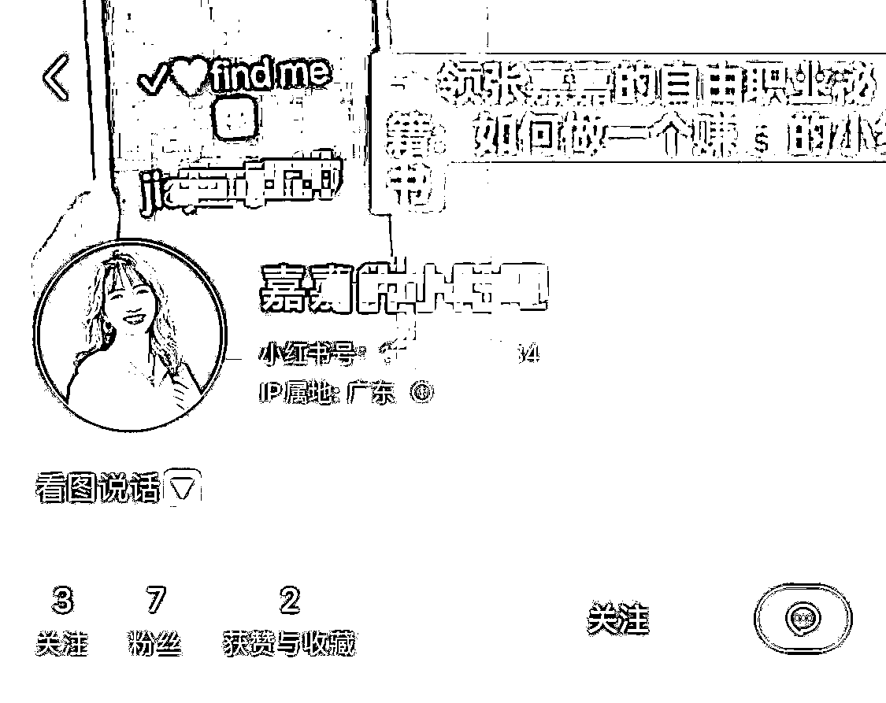

# 【分享】日引流100+，12个低风险小红书引流技巧

> 来源：[https://nuw023zscw.feishu.cn/docx/TAlVda9VtoHNPex6aF0cUNwwnub](https://nuw023zscw.feishu.cn/docx/TAlVda9VtoHNPex6aF0cUNwwnub)

大家好，我是张嘉嘉，目前是一个自媒体创业者，主要帮助职场人/个人创业者孵化可变现的自媒体IP。跑通过教育、情感、职场、企业管理、收纳整理等多个赛道的小红书流量变现闭环。

最近很多同行都说，包括我自己和带学员实操的过程中，也会发现小红书对于抓引流真的越来越严了。那么，到底小红书引流还能不能做，怎样做才能更安全？

今天给大家分享12个相对比较安全的小红书引流技巧。

目前风险最低的方法，就是小号配合主号。主号做内容做IP，小号负责放置联系方式，分散风险。

那么小号要怎么设置，主号要怎么配合呢，接下来我再一一给大家介绍：

# 一、小号分散风险

## 头像大法

只要不留vx等敏感字眼，就可以直接审核通过。简介再提示看头像，瞒天过海又很直接。

我看了一下，首页的举报是没有直接举报头像的选项的。所以只要不被系统检测出来，不被同行多次恶意举报，这个方法还是很安全的。

## 置顶笔记

小号发一篇带微信号的笔记，置顶。

标题写上“看图找我”/“聪明的宝宝都知道如何找到我”等等

## 背景图

背景图也是一个过审了之后，一般不会再审核的地方。

相对安全，也很直观。

## 小红书号

把小红书号改成微信号，这个也是很多人用的玩法。但是一般也是要配合私聊或者群聊提示他们看小红书号，不算太直观，说多了又容易违规。

# 二、主号负责搭台

## 简介埋被动引流路径

在简介里最后一行留下行动指引：合作/咨询/领资料@小号的昵称

这里提醒一下，在编辑简介的时候，要能有效地@出小号，要先打@，然后输入小号昵称的首字符，等弹出来后选择对应账号，不能全程自己手动输入，否则会@失败（这部分自己去实操就知道什么意思了）

还有，简介7天内只能修改3次。

## 收藏大法

收藏夹里收藏小号的引流笔记。秉承着不浪费任何一个广告位的原则。

## 建群

这里重点说说主号建群之后，小号要如何配合，在群内发什么内容才能更高效且低风险地把人引导到去看主业里留的微信号。小号在群内就作为发布引流消息的主要角色了，主号尽量不要去发相关消息。

### 1）改群名

把群名改成“领取xxx”

### 2）转发笔记

小号把引流笔记转发到群里。

不过有时候笔记转发多了，容易被系统发现，会被屏蔽。

### 3）改群昵称引导进主页

把小号的群昵称改为“进主页领xx”“戳我进主页”

### 4）发表情包

把写了微信联系方式的图片做成表情包，然后以表情包的方式发在群里。

### 5）分段发微信号

把微信号分成几段，再在下面引导组合搜索。

如果看不懂的，就等于是智商筛选了，非目标群体。

### 6）群打卡

这个是最近的新玩法，设置群打卡。

能增加和用户的互动，还能留引流的广告位。

# 三、心态篇

最后惯例讲讲心态。我一直觉得，道法决定你如何走第一步，但心法能决定你能走得多远。

1.  引流的技巧不是单一技能，融会贯通之后可以灵活应用，组合出招

1.  没有方法是一劳永逸的，平台规则在变，打法也得不断调整优化迭代

1.  平台规则一直在变严，就证明流量价值在变高，免费引流这个事情就值得去做

# 更多精彩分享：