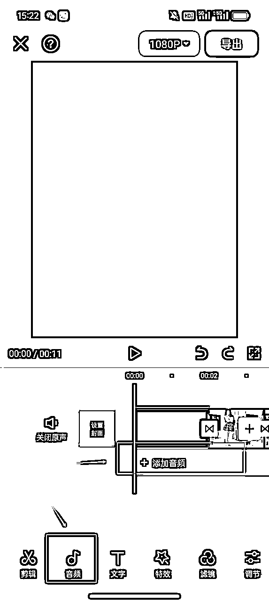

# 小红书商单保姆级教程，小白月入6-8k

> 来源：[https://zdmlu8bof3.feishu.cn/docx/TPaddcr5JoF2WRxse7scO1wInne](https://zdmlu8bof3.feishu.cn/docx/TPaddcr5JoF2WRxse7scO1wInne)

你好，我是棠溪，很高兴认识你。我做小红书商单4个多月的时间了，目前通过接商单变现了7k+。虽然我这个成绩不算太好，但是也算是有些经验。在这过程中踩过一些坑，所以想把自己的一些经验分享出来。

在写之前先感谢一下我的两位老师，一来老师和格子老师，一来老师目前专注于公众号写作项目，格子老师就是我小红书商单的老师，她目前专注于小红书商单和公众号写作这两个项目。我这几个月的成绩得益于他们两人的指导。

这个文档会从0到1讲解小红书商单项目应该如何操作，包括后期接广后的一些注意事项，希望对大家有所帮助。

# 一、项目介绍

小红书商单变现的底层逻辑就是快速涨粉到1000粉，然后开通蒲公英，接广告赚钱。一单广告费用是100-200元，单个账号一个月能赚1000-3000元，虽然单个账号变现不多，但是可以矩阵化运营，所以实现月入6-8k并不是很难。（格子老师的很多学员都达到了这个成绩，做的好的也有月入过万的，主要看自己的能力）

我们主要接的是图文直发的广告，这种广告不需要自己去写，品牌方直接编辑好，我们复制粘贴发布就好了，比较省心。唯一要做的就是做好作品，让账号的数据好看，能够满足品牌方的要求。

小红书商单能做的领域有很多，只要流量好，就可以接到广告。小红书分为视频类和图文类作品，小白建议从视频类作品入手，因为视频类作品流量相较于图文来说会更好，更容易拿到正反馈，我自己在做的也都是视频类作品。

图文类账号，大家可以参考这几个赛道：

1、罗文姬女士语录

2、公基常识

3、明星娱乐

4、章鱼哥语录

除了这些，能做的还有很多，这4类对新手来说还是比较友好的，涨粉效果也不错。

视频类账号，大家可以参考这几个赛道：

1、情感类写字博主

2、娱乐八卦

3、好物分享

4、热评分享

视频类内容会比图文的流量更好，对新手来说更容易拿到正反馈。

这个项目的整体操作流程就是：

选赛道-注册账号-养号-修改资料-制作作品-发布笔记-优化内容-涨到千粉开通蒲公英-接广变现-维护数据

接下来的话会以黑丝jk赛道为例，给大家分享一下全套的sop流程，其他赛道同理。这个赛道目前做的人较少，流量比较好，基本上7-15天可以千粉。

# 二、注册账号&养号

## 1、注册账号

注册的时候只设置性别，年龄，选择和要做的赛道相关的领域，其他信息不要动，不要去改头像改资料，发作品前一天去改。

有老号没有违规的可以直接用，作品少的删除，作品太多建议重新注册。

老号有违规现象的小红书卸载重装一下，清除数据，有条件的可以恢复出厂设置，或者换新手机登录账号。

## 2、养号

养号一般3-5天时间，养号指的是：把新注册的账号养几天，刷几天你想要做的内容，关注一些对标账号，然后再去发表作品，这是为了让系统识别你这个账号是真实的个人用户，而不是机器使用。

如果你的账号已经注册了一段时间，但是没怎么用过，你现在想发布作品，也可以先多去浏览点赞收藏评论，几天之后再去发布作品。

可以直接按照以下养号流程去操作。后期每天发作品的时候去浏览就可以了。

#### 第一天:

打开小红书，通过我给的对标进去，也可以搜关键词：jk穿搭、黑丝穿搭等

其实有了这几个对标账号，你们只要关注几个，然后点赞收藏几个，首页就会出来很多这种账号了

看到同行的作品，可以适当对他们的作品进行点赞，收藏，评论以及关注

#### 第二天：

继续做垂直标签，按照第一天的养号流程，标签做的越好，爆的几率越高

在小红书里手动搜索一些我们要做的类型的关键词

搜完，看到作品要对他们的作品适当的点赞，收藏，评论以及关注，看到好的作品也可以顺便转发到自己的微信，当做一个素材收集库。

我们刷同行作品，不单单只是为了完成这个动作，而是要观察同行的内容，文案，话题，自己多去分析。

#### 第三天：

看看推荐页(发现页面)里的视频里面有没有推荐给你符合你赛道的笔记，如果有，就可以对推荐的作品进行正常的点赞与关注等操作，如果没有，重复第一天的操作，从我给的对标进去，或者搜关键词

关于养号时间：

每天刷30-60分钟，不需要一个时间段养号完毕，有时间了拿出来看一看就可以。主要就是要账号活跃度以及标签精准度。

养号注意事项：

操作的时候不要太频繁，不要每一个视频都去点赞，关注，收藏

比如，看了五个作品之后，对第六个或者是第七个作品点赞，然后再重复这样的操作，太频繁了的话系统会检测出营销的作弊

可以适当的评论，大概五个点赞率评论一个，要做到5:1的比例，比如说，我点赞了5个视频后，可以对下一个视频做一个评论，评论的内容，基本上是找同行里面的热评，比较火，回复率很高，点赞比较高的评论，复制粘贴即可。

切记:你们刷到的只要是我们做的这种类型的视频，不管数据好坏都看完，千万不要觉得数据不好就不断去换视频，也不要吝啬舍不得点赞收藏，你们看到那种大几千赞的，也可以直接分享到自己微信，起号的时候也可以当做对标素材。

如果看到了不相关的领域，快速划过就好，千万不要去点不喜欢该作者，不感兴趣等等。

PS:养号本身比较玄学，不用特别在意，很多时候是心理作用，不用太纠结。

新注销的账号需要等大半个月或者一个月以上再重新注册

# 三、对标账号

# 四、修改资料

等养了三五天后，我们打算发作品了，那发作品几个小时之前，或者前一天就可以去修改四件套了，头像、名字个人简介以及背景图(其实背景图可以忽略)。

这些参考同行的就可以，影响不大。

头像一般选择好看的女生头像。

名字最好是起和你这个赛道相关的，能让人看出来你是做什么的，这样会大大提升转粉率。

个人简介参考同行，一般就是1-3句话，中间加点小表情。说清楚自己是做什么的就可以。但是不能有联系方式等的引导。（比如这个赛道，一般都写的身高体重，加介绍，那就模仿她们的写就好）

背景图随便找个好看的图就可以。

# 五、制作作品

### 1、寻找素材

这种图片在抖音、快手有很多，另外淘宝、拼多多等买家秀也有很多。找到直接保存即可。

但是注意，不要在小红书找图片素材，容易被原博主找到，最好是跨平台去找。

如果是找博主的话，一定找粉丝量少，且没有入驻小红书平台的。

另外就是抖音、快手图片需要去水印，去水印工具直接在微信搜索：去水印，会有很多小程序。把作品链接复制粘贴进去，就可以保存无水印图片。

尽量去找不露脸的素材，避免引起麻烦。露脸的好看的图片可以拿贴纸把脸遮住。

（注意，图片一定不要找太暴露的，容易涉及擦边、违规，找正常穿搭的）

### 2、美图秀秀编辑图片

图片找好之后最好去美图秀秀编辑一下，可以加滤镜或者调色，改变一下图片参数，类似于视频的去重。

调节好之后先点击右上角三个点，选择存为我的配方，下次可以直接使用。

后面的图片添加进来之后，直接选择美图配方-我的，然后保存就可以了。需要用到的图片都处理一下。

### 3、剪映剪辑

1、打开剪映-添加作品-在素材库中找到黑幕素材-添加

2、修改画面比例-建议3:4或9:16

3、添加文本-参考对标账号文字

4、文字可以添加动画，时长设置在2s左右即可

5、点击加号，把编辑好的照片全部添加进来

6、点击中间分割线，可以设置转场，选好转场后全局应用，我一般会选翻页转场

7、点击添加音频，添加适合的音乐，不会选择就用同行爆过作品的音乐

8、制作完毕之后导出，不放心的话可以再给视频加点去重手段，画中画、加滤镜、贴纸等

# 六、发布笔记

发布作品的时候，上传作品，然后把前面的文字设置成封面。

标题找对标的爆款标题直接拿来用就好，最好是以问句结尾，引发互动。

正文直接添加话题，8-10个左右。

参考话题：

#女大学生 #日常穿搭分享 #丝袜 #黑丝 #白丝 #职业装 #jk #纯欲 #jk穿搭 #jk制服 #jk穿搭 #白丝yyds #白丝搭配 #黑丝搭配

# 七、优化内容

发完作品记得观察数据，如果出现流量好的内容，可以模仿这个内容再出几条视频。

不管是风格、关键词、还是音乐，都可以去尝试，如果再通过某个关键词或音乐出现一个爆款，可以固定使用这个内容，基本还会出爆款。

发布作品之后一定要分析自己的账号，每个人账号情况不同，根据自己的账号去调整内容方向。

# 八、开通蒲公英&接广变现

小红书粉丝到了1000粉后，我们需要实名认证，升级专业号，然后开通博主合作和买手合作。

博主合作就是开通蒲公英，就是我们说的商单，即接广告，买手合作就是带货挣佣金。

开通这些功能是不需要任何费用的，开通带货也不需要押金，大家不用担心需要额外的费用。

矩阵化做号的，如果没有那么多实名认证，可以给你对接。30块钱就可以完成。你只需要在账号千粉之后，设置小红书密码，然后把账号密码给到我。对方完成实名认证后，你把密码改掉就可以。但是需要加入到MCN统一提现，因为个人的只能打到实名人的支付宝中。

## 开通路径

左边三条杠进去或者从设置里面进去

1、设置里面-账号与安全，升级专业号，个人资料选择情感博主时尚博主、音乐博主(看你自己做的什么领域)

2、合作中心进去，实名认证，开通博主合作、买手合作，蒲公英图文报价100-200之间，视频报价先不填。

报价不是固定的，主要还是看你账号整体流量，而非粉丝数量，很多人觉得我账号到了5000粉丝了到了1万粉丝了，是不是可以加价，但是你有没有去看看自己后台数据好不好呢?

## 蒲公英开通流程

1、我的页面-设置

2、账号与安全

3、完成实名认证和升级专业号

4、专业号选择个人、领域选择自己账号相关领域，可以参考同行认证领域

5、升级专业号成功

6、我的页面-左上角三条杠

7、合作中心

8、开通博主合作和买手合作

9、选择开通博主合作后，勾选同意，点击下一步

10、确认合作协议

11、设置笔记报价和联系方式（图文报价可以根据账号流量设置，一般设置100-200之间。视频报价先不填。联系方式设置自己常用的即可。）

12、博主合作开通完成

13、买手合作点击开通就可以完成（可开可不开，是带货使用的，想带货的话可以开通）

## 发布广告

开通后就等着后台品牌方下邀约，如果收到邀约主动加pr去聊档期就行啦，广告发布流程官方有详细的教学视频，

接广告之前多看几遍!

## 账号数据

怎么判断自己数据好不好，从蒲公英后台进去，官网https://pgy.xiaohongshu.com/

一般的品牌方要求是

1、自己的日常笔记中位数1000以上，日常过千

2、广告笔记阅读每一篇都在200以上

3、还要看深蓝条、浅蓝条、3s完读，这个每个品牌方不一样

前两点非常重要，尤其是第二点，很多pr在看一个账号的时候，他们会看你最近几天接的广告数据，没有的话，可能就被拒之门外了，相反，pr不会去看你到底多少粉丝，账号流量好才能接到更多的广告。

（我之前写过一篇详细的数据维护教程，感兴趣的可以移步主页查看）

# 九、补充

## 1、作品数量

千粉之前可以一天2-3条，千粉之后每天一条就可以，放在流量好的时间段发布。

刚开始发布时不用太关注发布时间，只要不是在半夜发布就行。小红书是有长尾流量的，可能发布几天后，甚至一个月以后，之前发布的笔记突然爆了。

最开始发布就优先选择小红书平台用户活跃时间就行。早上6点一9点 中午 11 点 30-13 点 下午 17 点-21 点左右

## 2、一机一卡一号

小红书很严，大家一定要一机一卡一号，不要双开，更不要在一个手机上去切换，否则你这些账号就面临着全部被限流的风险。如果有多个号，一个号用无线，其余的号都用流量，不要在同一网络下，不然容易限流。

如果你的账号反反复复注销又注册，那你这个手机号就别再注册小红书了，注册了也是限流，我们如果注销一个账号，想要做新号，一定要把手机恢复出厂设置，然后把手机卡换了，再去注册新号。而且那个被限流的手机号就不要再注册小红书了!我们用没的手机号注册就行了。

## 3、新号数据差怎么办？

刚注册的账号，小眼睛很少，甚至只有 100 左右，这都是正常的，持续多更新几篇笔记，只要内容好，小眼睛数据自然会涨上去。

比如刚开始发布第一篇笔记时，小眼睛数据只有几十，等你发布第二篇笔记时，第一篇小眼睛也会跟着慢慢上涨的。

不要以为刚发几篇数据不好就是限流了，那是你的心理作用，数据不好，通常都是内容原因，多去优化内容吧。

## 4、不要违规操作

我们依靠作品涨粉，不要想着去互关什么的，会打乱你的账号标签。作品做的好，有的时候一个作品就能涨到千粉。

不要引流、涉及站外平台，水印一定要去干净。

联系我、加我等常见限流词:点赞、收藏、关注、评论、私信，私我等(用谐音字可以适当的进行避免，但是发的多了，也是会被官方检测到)

## 5、接广注意事项

接广告的原则:不接私单(靠谱的除外)，不要涉及到功效、疗效，不涉及到医疗保健传销金融，美妆、护肤、日用的可以去淘宝搜一下看看有没有旗舰店，一般测评类的问题不大。大家要规避抗老、美白、0添加、减脂、减肥、体重管理、0糖0脂0卡、保持身材、瘦、补气、补血、补胶原等形容词的产品。另外牙齿广告最好也不要接，也容易违规。

我们是要长远发展的，不能因为一条广告毁了一个账号，你都到1000粉了，就更应该好好珍惜账号，只要账号流量好，广告源源不断，不要只看眼前的一条广告，一个账号一旦限流，可能永远救不活!

前期刚开始，可以接一天广告休息一天，比如我今天接了一条广告那我就明天休息不接，正常发视频，后天再接。

如果账号流量非常好，可以接两天休息一天，一旦发现账号流量不好了，立马停下来养号，一定别着急别贪心。

# 写在最后

这个项目虽然出来时间比较久了，确实没有最开始的时候好做了，但是依然有很多人是赚钱的。

而且还是比较适合新手小白的，因为能很快拿到正反馈，基本上7-15天就可以到千粉，就可以接广变现了。

刚开始可以先做一个账号，第一个账号稳定变现之后，可以多账号运营，扩大自己的收益。

最后，祝愿各位都能财源滚滚！