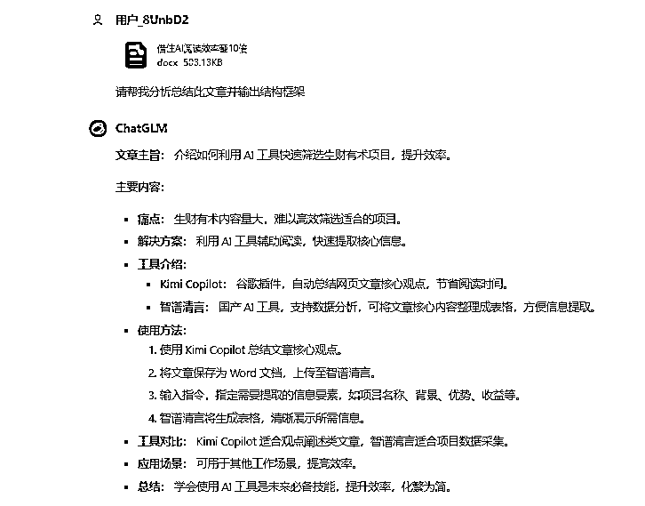

# 如何在生财的汪洋大海中快速筛选项目，效率提升10X

> 来源：[https://lpt8zt3scl.feishu.cn/docx/TbwJdEUbAodUj7xPZW1cbmNVnuc](https://lpt8zt3scl.feishu.cn/docx/TbwJdEUbAodUj7xPZW1cbmNVnuc)

大家好，我是进击的大郑，此篇特别适合正在寻找新项目的生财小伙伴，可以大大缩减寻找项目的时间。

# 一、痛点分析

来到生财快一年了，给到我最直观的印象就是牛人好多，生财的精华帖和风向标更是数不胜数，尽管每天都有浏览生财的内容，但是一天的时间毕竟有限，生财一天产生的内容通过正常阅读是很难消化掉的，或许有的生财小伙伴真的可以做到，但也将为此付出了大量时间成本。起因也是最近我有在生财寻找适合我自己的项目，但是面对巨量的信息，我有点犯难，所以我就在想在AI发展如此迅速的当下，有没有一款工具可以协助我更快的找到我想要的项目。

# 二、解决方案

这两年AI工具雨后春笋般不断的发展成长了起来，市面上有很多AI工具，是否可以找到直接拿过来用呢？但是AI工具那么多，具备什么样的功能才可以解决我当下的问题？它需要具备： 信息抓取——提取核心——匹配需求——得出结论。逻辑大概是以上四点，基于我过往对AI工具的使用了解，实现以上四点并不难，简单来说就是，“喂，小助理，在几秒钟内把这篇稿子的所有核心要点告诉我”，所以我就开始在网络上搜集各种AI工具，看了大量的网站信息和视频博主的讲解，总结下来好像不止一家可以实现这个功能，到底行不行试试就知道了，我挨个去注册测试，好在都是免费的，经过测试，比较符合设想的网站出现了。

# 三、工具介绍

第一款工具：Kimi Copilot，它是一款谷歌插件，大家需要链接外网，在谷歌浏览器商店搜索安装后就可以使用，这是一款网页总结助手，只需要打开你即将阅读的生财精华帖链接，接着打开这个插件，不需要你输入任何指令，它就会自动识别并总结这篇文章的核心观点，一篇几千，几万字的文章，几秒钟的时间，它可以帮助你把核心要素提炼出来，大概几百字的总结，极大的节省了阅读的时间。下图我以最新生财圈友的精华帖为案例给大家简单展示。

已经很快了对吧，但是使用几次你会发现，这个工具的缺陷也显而易见，很多文章的关键信息也都被精简掉了，对于找项目的我们，简单的总结是远远不够的，我们需要有价值的信息或者数据作为辅助来帮助我们识别是否适合自己。

所以我们需要升级版的AI工具，功夫不负有心人，经过测试和比较，终于还是找到它了。智谱清言，https://chatglm.cn/main/alltoolsdetail是一款强大的国产AI工具，他有一个特色功能：数据分析，刚好匹配了我的需求，如果你有一个带有数据冗杂的表格或者文章，支持多种文件格式，提交上传上去，输入你的提示语，就可以帮你进行数据总结，通过文字或者图表的方式更加清楚直观的表现出来。

到底要怎么用呢？我们在筛选项目的时候，往往都是多个要素一起参考的，对于我自己来说，阅读一篇精华帖需要收集到至少以下要素才能判断这个项目是否可以做：项目名称、项目背景、项目优势、项目收益，项目可持续时间、项目变现方式、适用对象、项目启用资金、启动所需材料、获客渠道、获客方式、产品定价、客户转化方式、转化率、注意事项、作者总结等等，大家可以根据自己的需求再完善要素，接下来我们需要把精华帖以word形式保存到桌面，点击上传，然后把自己的需求告诉智谱清言，输入以下指令：请从以下要点，分析总结这篇文章，做成一个表格的形式，让读者更清晰直观快速的了解文章的内容，（项目名称、项目背景、项目优势、项目收益，项目可持续时间、项目变现方式、适合对象、项目启用资金、启动所需材料、获客渠道、获客方式、产品定价、客户转化方式、转化率、注意事项、作者总结）表格形式（要点左侧分布，总结右侧分布）

接下来就是智谱清言大放异彩的时刻，只需要几秒钟，一个满足你所有要求价值信息的表格呈现在眼前，一篇千字长文，正常阅读需要花费十几分钟甚至几十分钟的时间，现在你只需要不到1分钟的时间就知道了里面所有的核心内容。下面是操作视频。

# 四、工具比较

比较来看，kimi Copilot更适合观点阐述类的文章，智谱清言更适合项目数据采集筛选归类，大家使用的时候可以结合自身情况使用，也可以两个共同进行，两者结合使用更完善。

既然可以帮我们快速筛选项目信息，那肯定也可以干些其他的事情，只要是你觉得手下的工作让你感觉到繁琐冗杂，想更快做出结论，都可以借住以上工具为你所用，大家可以发散思维一下，哪些地方还发挥它的效用呢？

# 五、AI此文

AI不会打败人类，但会打败那些不会使用AI的人，在信息大爆炸的时代，学会借住AI工具为自己所用，提高效能，化繁为简，未来将是每个人的必备技能，大家抓紧操练起来吧。阅读至此你应该花费了不少时间了吧，有没有想过用智谱清言再来一遍？以下是我用智谱清言和Kimi Copilot分别把此篇文章做了总结，大家可以再回忆巩固一下文章内容。此文的框架也是借助AI帮我整理出来的。

# 六、最后

非常感谢生财提供这个平台让我们在此遇见与共同成长，也希望生财能借力AI功能更加完善，圈友体验也越来越好，发展的越来越好（一点浅浅的建设性想法），分享是希望大家能更快的找到自己的项目或者在其他方面合理利用起来，不做违背咱们生财价值观的动作，分享的意义才会更加弥足珍贵 更加源远流长。感谢大家耐心阅读，最后感谢大家，祝大家早日暴富，一起生财有术！我是进击的大郑，下次分享再见！