# 小红书笔记/商品常见违规解决办法

> 来源：[https://hi428l7bh89.feishu.cn/docx/UMCFdTRpVofcENxXBcVcb5PrnEe](https://hi428l7bh89.feishu.cn/docx/UMCFdTRpVofcENxXBcVcb5PrnEe)

哈喽大家好，我是小刀~自我介绍一下

抖音半无人直播项目，截止现在个人+合作主播已经gmv突破3000万

去年5月份开始接触小红书电商，测出了多个百万爆品

今天想聊聊【小红书违规】这个事情。

从去年5月份跟着生财航海开启小红书电商的旅途，到现在已经一年多了，开了N家店铺、出了N个矩阵破百万的品。

小红书电商相对其他平台来说，还处于红利期，对小白入局比较友好，但是在实际操作过程中因为平台政策不断调整，很容易出现违规问题。

我们根据自己实际操作中常见的违规问题进行了整理，大家可以遇到问题后可以自查。

小红书开店难免会遇见违规情况，大家遇到违规的第一反应不要慌。

首先违规后一定要申诉，特别是原创度低等问题的申诉按照模版进行很容易通过；

其次单个笔记、商品违规都不会影响整体账号流量。

# 一、商品详情页常见违规

详情页常见违规主要有：标题及详情页图片内容违规、品牌错误、产品上架类目有误等几种违规，详情页违规问题比较轻微的，会提醒整改，严重的会强制下架，但对账号流量没有影响，按要求整改即可。

## 1、商品详情页/标题违规

一般为商品详情页或者标题含其他平台水印，有明星相关的内容，或敏感文字涉嫌虚假宣传、夸大宣传、需要资质等，出现此类错误，仔细检查图文及文字内容，可按系统提示修改或者删除违规的详情图。

## 2、类目挂错违规

类目挂错的违规，旁边一般会提示建议修改的类目，如果提示的类目正确，直接按照提示修改正确类目即可。如果上架的产品不知道是什么类目，也可再类目搜索框搜索产品名字，会出来对应的类目。

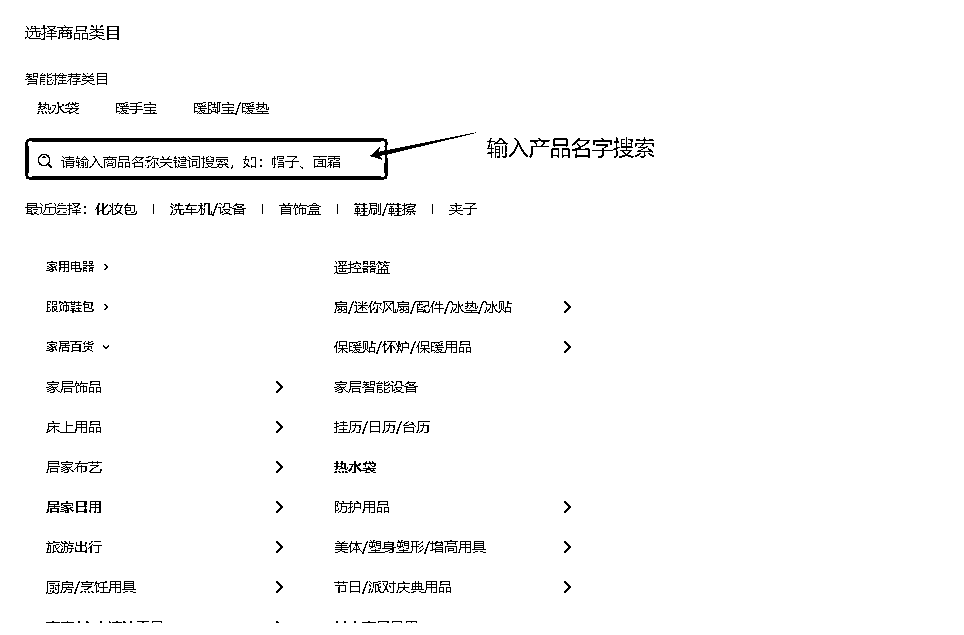

此外，有有一些特殊需要资质的但有个人店也在上架的产品，属于钻空子的品类，上架时尽量试一下百货或者美妆/个护等产品相关类目，并修改需要资质的标题及产品详情图信息，比如卷发棒可以上架为百货——造型版类目，滴眼液可上架为美妆个护——其他眼部护理类目。由于每个平台对违规敏感词的判断标准不同，此类产品上架，更建议直接搬运小红书个人店铺的商品链接上架，用小红书平台应用市场的妙手一件搬家即可。

## 3、滥用商品品牌违规

这种分两种情况，即品牌为必选项和非必选项，判断方法就看品牌选项名字后面是否有一个红色的*号，带*表示必须填写品牌。

当品牌为非必选时，填写了一些其他的品牌内容，如其他/3E等，删除品牌信息即可。当品牌为必选项时，如果能找到相应品牌，填写相应品牌即可，如果找不到，可以选择3E。

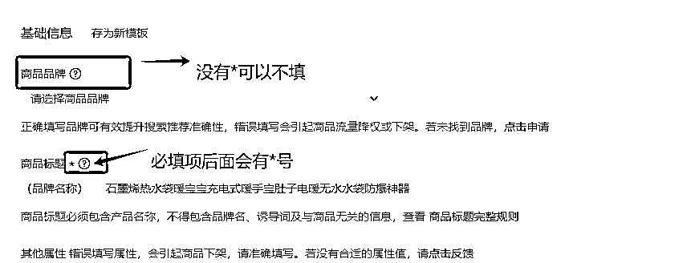

## 4、商品属性违规

含有特殊功效商品属性，如防晒、去红血丝等，按系统提示修改属性为普通属性，如水润等

商品类目违规处罚冻结商品并下架：同上可修改自可上架类目，上架审核通过以后无需申诉即可恢复正常，无违规记录。如确实无法上架，14天申诉有效期过了以后，违规记录会消失，并无其他影响

注意：电脑系统提示会在相应违规地方显示红框

# 二、笔记常见违规

笔记违规之后，先不要着急删除，看看违规的具体原因是什么，针对违规原因先进行修改及申诉，若申诉不过再删除。

## 💥违规点1：使用他人原创素材违规

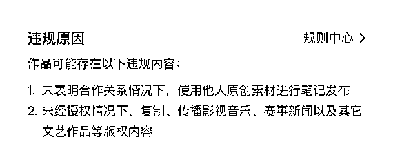

此类违规，一般是素材去重不到位被平台查出来了，如果是封面违规可以修改封面，视频内的素材违规则没办法修改，可以尝试申诉。

### 申诉方案1：

卖惨+态度好 ，然后在剪辑页面截取三张剪辑的过程图片，（不要出现去重的步骤）申诉。

申诉理由：尊敬的小红书客服团队，我是一个二胎宝妈，想申诉理由:在小红书这么优秀的平台做兼职带货，帮家里承担些生活费，给孩子生活质量更上一个台阶!这个作品是我自己拍摄并剪辑的，希望尊敬的小红书客服大大麻烦对我的账号进行重新审核。

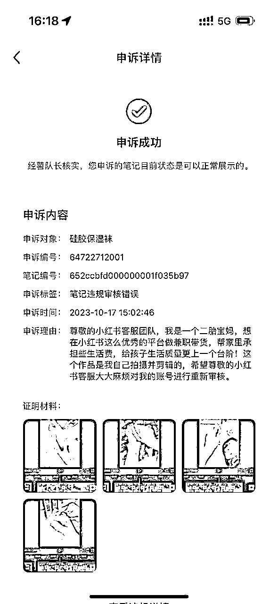

如果第一次申诉不过，重要笔记也可再申诉后24小时二次申诉，更换理由及截图。

### 申诉方案二：

从你的相册里面，截取时间早一些的相册截图，带相册时间的这种，然后从笔记的视频里面也截取两张图，替换到带时间的相册里面，去平台申诉。

申诉理由为：尊敬的审核员，你好！该内容为自己原创实拍内容，拍摄时间为2024年3月11日，为我本人原创，绝没有搬运！！因为该内容之前在其他平台发布过，不知是否被其他博主达人搬运过导致违规提示，希望审核员重新审核一下，感谢！

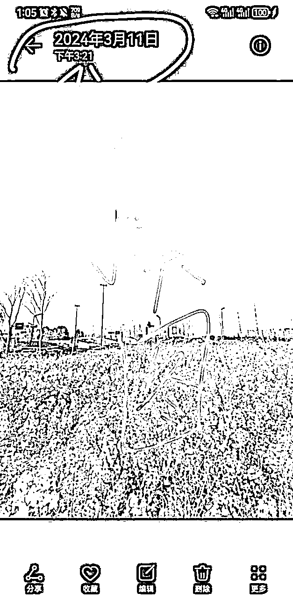

## 💥违规点2：笔记内容涉嫌抄袭编造人设故事等

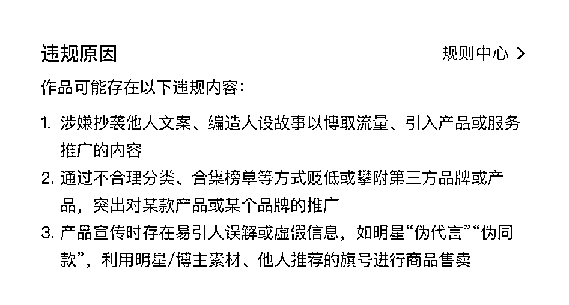

此类违规，根据违规原因提示，分4个方向检查自己的笔记。

1、检查自己笔记与对标笔记是否内容太一致，如果内容太过一致需要重新修改一下内容；

2、检查内容是否存在编造故事的问题，商品笔记内容不能带有具体的人设去编写故事（具体示例见下图）；

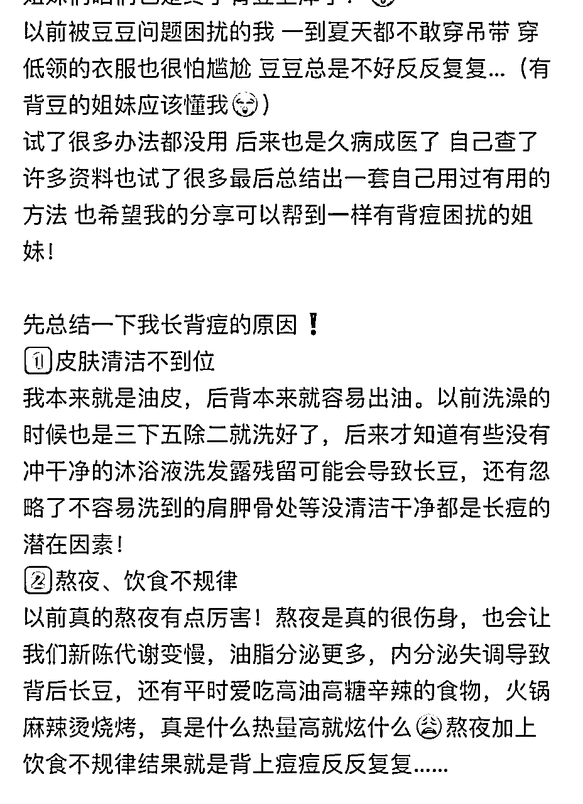

3、检查笔记是否有带其他品牌的内容，如果修需要修改；

4、检查是否有和明星相关的内容，包括图片、图片上面的文字、笔记内容、视频内容以及音频内容，都不能出现和明星相关的元素。

检查找到问题修改之后，可以去申诉笔记。

### 申诉理由：

已自查无相关违规内容，符合小红书平台社区规范，请重新审核。

需要注意的是，小红书修改笔记只能修改封面及笔记标题和内容，视频里面的内容违规是没有办法修改的，如果是视频内的内容违规只能删除该笔记，后期发布笔记注意规避违规内容。

## 💥违规点3：商品描述形式出现问题

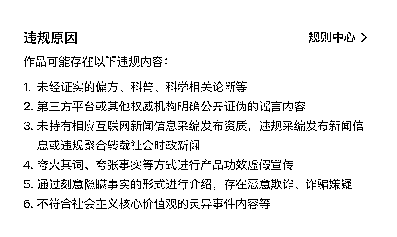

功效类产品，涉及使用前后效果对比的内容，使用时间效果、医疗用语等，都属于极易违规内容。

*   虚假宣传（虚假呈现或描述产品功效，如过度P图美化、展示使用产品前后明显差异对比图、使用绝对性承诺或保证产品效果、多产品对比突出表扬某一产品等，易混淆用户对产品功效的感知）

*   虚假体验（伪装真实消费者体验的视角分享、推荐自家产品/服务，易误导其他用户对产品效果、服务质量的判断）

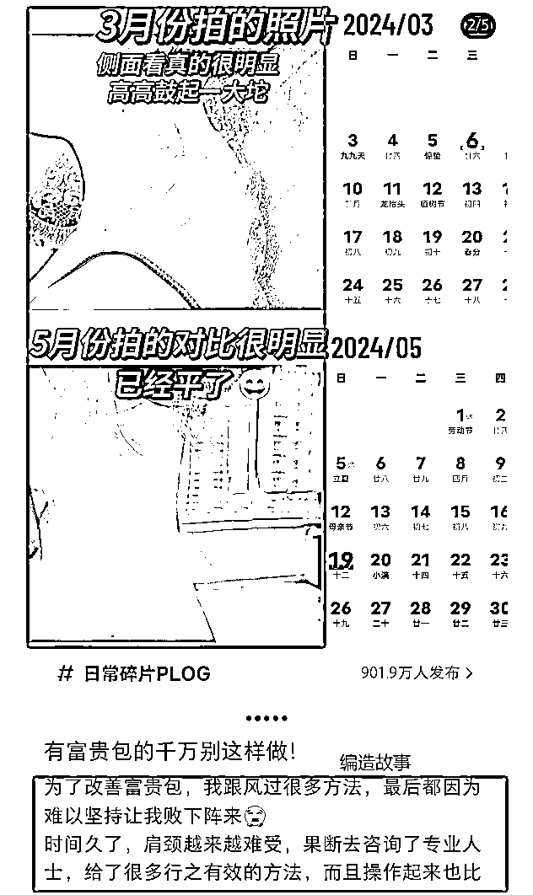

*   伪科学标题（过度宣传产品效果）等。

*   生硬插入营销广告信息：同一篇笔记前后内容完全不相关，在科普知识、八卦分享、影视片段、个人经历等非营销性质内容的笔记中，突然展示、推广相关度低的产品或服务

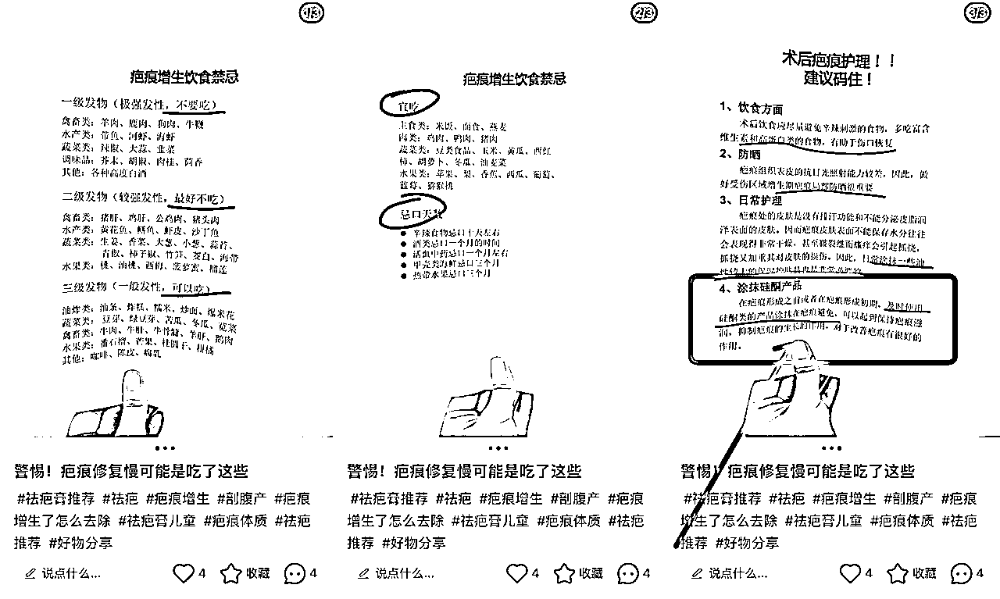

常见高频违规词汇：彻底/完全解决，抗菌，抑菌，除菌，灭菌，防菌，消炎、减肥，瘦身，瘦脸，瘦腿，燃烧脂肪，生发，育发、增发、有助毛发生长、密发，染发，脱毛、除毛、祛毛，美乳、丰乳、丰胸、使乳房丰满、预防乳房松弛下垂，健美、减肥、燃脂、除臭、除腋臭、消除腋下异味、去狐臭、抑制腋臭，祛斑、淡斑、减少色斑产生、减少皮肤色素沉着、破坏黑色素细胞、阻碍黑色素的形成、去黑(祛黑)、美白、增白、亮白、变白、焕白、嫩白，防晒、吸收紫外线、抵御紫外线、减轻因日晒引起的皮肤损伤、全方位，安全，无毒、医学护肤品，药妆、表皮生长因子，食品级/料理级，可食用，纯植物，防脱发、防掉发、减少脱发、减少掉发、减少落发，中药，中草药，中药精华，刷酸治疗，黄褐斑/肝斑/蝴蝶斑/妊娠斑，有效，去斑，素脸，刷酸，提高肌肤抵抗/免疫等

### 解决方案：

检查笔记是否有上诉提到的内容，如果有改变描述方式，可以用谐音、表情或者拼音等替代，修改相关内容后进行申诉.

申诉理由：已自查无相关违规内容，符合小红书平台社区规范，请重新审核。

## 💥违规点4：笔记内容画风出现问题

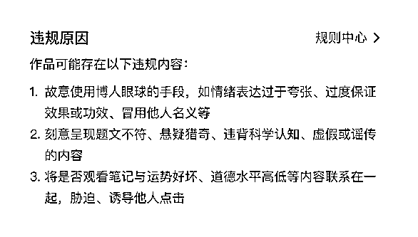

该内容一般是封面、标题等内容过于噱头夸张，内容低差、环境脏乱、人物形象不佳、擦边球🚫等造成，百货类产品容易有此类违规，或者封面标题有：申遗、谢谢沈月、中国速度等，也很容易违规。

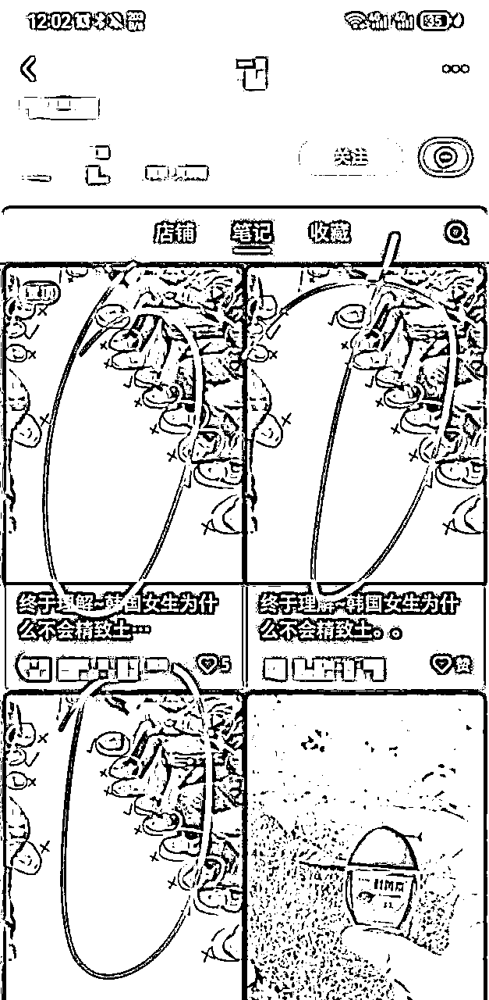

### 解决方案：

修改后进行申诉即可（封面修改为正常产品展示封面、标题去掉可能违规的词汇后申诉）

### 申诉理由：

尊敬的审核官您好！笔记内容已全部自检自查，无任何违规内容，符合社区规范，麻烦重新审核，非常感谢！

## 💥违规点5：不真诚的营销推广内容

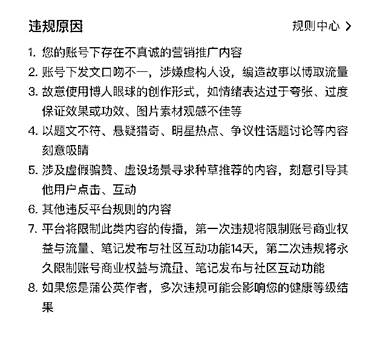

该违规可能涉及以下几点：

图片违规：封面图片内容太过猎奇、噱头或者不真实的对比图片，比如功效类产品，祛痘的前后对比图、富贵包前后对比图、健身瘦胳膊前后对比图等，或者封面标题有：申遗、谢谢沈月、中国速度等。

笔记内容虚构人设：查看正文内容是否存在编纂故事，带入具体的人物角色及产品使用效果体验等。

评论区惊喜盒子：评论区是否有店铺账号评论的惊喜盒子相关的内容，如果有先把内容删除。

### 解决方案：

检查笔记是否存在上诉内容，如有涉及先进行修改或者删除相关内容之后再进行申诉，申诉选择笔记审核错误。

### 申诉理由：

尊敬的审核官您好！笔记内容已全部自检自查，无任何违规内容，符合社区规范，麻烦重新审核，非常感谢！

## 💥违规点6：被举报

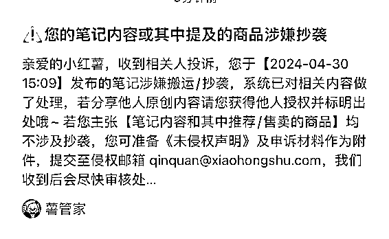

此类违规，一般比较难申诉，如果是直接搬运的内容，违规了建议直接删除该笔记；如果是按照对标模仿拍摄的，有证据可以举证，也可以尝试发邮件申诉。（流程较为漫长，不太重要的笔记若是被举报，也可以直接删除不必申诉）

### 解决方法:

拍摄图片相册详情截图，带有具体拍摄时间及拍摄设备信息截图发邮件申诉，邮件地址详见小红书站内申诉邮箱。

### 申诉模板参考：

尊敬的小红书审核官您好，收到平台消息提示，我的笔记被举报搬运抄袭，对此举报，本人表示十分意外，因为笔记所有图片内容均为本人实拍创作，拍摄时间为X年X月X日X时X分，有截图为证，经得起任何方式的验证。

在我拍摄图片之后，经过添加产品说明制作后上传至平台发布，不存在搬运抄袭的情况，若举报者为售卖同一商品的同行，应该知道产品功效、受用人群，其实是特定的，我方认为，对产品特点、功效、适用人群进行说明并不存在侵权抄袭行为，若这属于侵权抄袭行为，那么平台应该允许同一产品只由一个商家售卖，但此行为明显不利于小红书平台电商的健康发展本人非常感恩能在小红书平台上进行创业,也感恩该商品目前也取得了不错的销量，本人始终遵循平台的核心价值观，尊重原创，希望他人也能尊重我的原创成果，也希望自己通过原创给自己及平台创造更大的价值收益由此望审核员大大重新审核，驳回举报者的侵权投诉!感谢万分!同时，请求审核员大大恢复笔记正常展示!

最后，本人所有实拍图片均接受法律验证,，目前由于举报者的行为，目前已造成我方实际的经济损失，若由于举报者的行为，造成对本人的投诉成立，本人也会拿起法律的武器捍卫我方正当权益。

平台在不同阶段侦查的违规重点会不一样，一方面大家要时刻观察平台的动向；另一方面不能因为担心违规而不进行可能“违规”的操作。

风险和收益并存，账号是消耗品，只要能赚到钱，废了再换下一个。