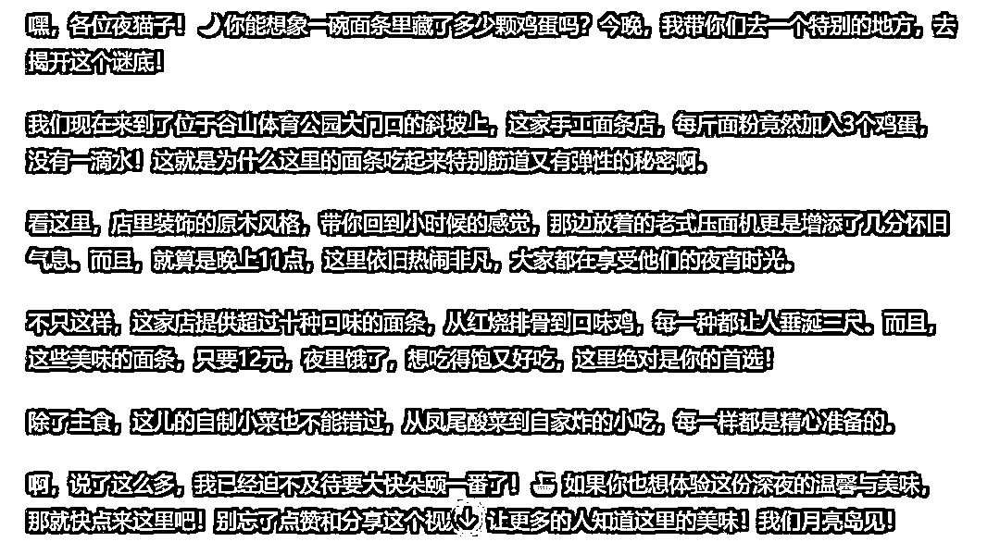

# 拆解了30条万赞的抖音同城探店短视频后，我用ChatGPT做了一个同城探店短视频文案助手

> 来源：[https://balfcirt91j.feishu.cn/docx/WhxFdnUWBovLe3xzM2tcmCHfnhe](https://balfcirt91j.feishu.cn/docx/WhxFdnUWBovLe3xzM2tcmCHfnhe)

刷抖音的伙伴们，是不是经常会刷到一些附近美食店的团购餐视频？

反正我是屯了好多张券了，总是忍不住剁手。

据抖音发布的《2023探店数据报告》显示，

2023年1月1日至9月30日，探店为中小商家带来729亿元的经济收益，

抖音58万达人通过探店获得稳定收入。

在同城探店这个项目中，除了拍摄剪辑之外，文案也是一个关键因素。

大部分的达人都没有文案功底，因此出产文案的效率也低。

为了帮助大家提升效率，更多变现，我拆解了30篇同城探店的文案，每篇的点赞都是1W+以上，

其中有几篇甚至达到了百万级别。

通过拆解，我找到了这些文案的特点。

# 01 同城探店文案的特点

## 1.以带有悬念、引发用户好奇的问句开头，用视频的前3秒牢牢抓住用户

比如：

*   你猜这一桌海鲜要多少钱

*   谁说有钱买不到快乐？

*   3600块体验一把头等舱什么感觉？

*   零食的天堂逛到爽要花多少钱？

*   米其林三星怎么吃最省钱？

*   世界上最重的螃蟹是什么味道？

这样的提问为什么能引发用户好奇呢？我分析了一下，主要是以下这几个方面的原因：

1）猎奇型：稀缺、非平民、奢华的场景/体验

人们的日常生活淡如水，就是两点一线，都渴望体验那种在生活中绝对体验不到的服务，寻找新鲜感。当有人体验了，并分享出来，就很好奇，想去看。

2）攻略型：如何用最小的成本体验超值的场景/体验

比如吃海鲜、吃米其林三星在人们的印象中，挺贵的，但是如果告诉你其实不用这么贵，用XX方式就可以获得。

3）反常识的场景/体验

在生活中，因为过往的经历、教育，大家都会对一些事形成固有的认知。但是如果博主告诉你，这种认知被打破，用户就会好奇。比如例子中提到的开头：谁说有钱买不到快乐？这里的常识是钱买不到快乐，但是用反常识的反问句开头，就吸引用户看下去，到底是哪种有钱能买到的快乐。

## 2.高密集度的信息叠加在一起，让用户“应接不暇”

围绕着问句中的主题，接下来用高密集度的信息，说出很多店里的细节。

比如下面这个视频：

3600块体验一把头等舱是什么感觉，我们今天买了两张去上海的头等舱特价机票，做了那么多次经济舱，我就一直好奇这个头等舱是啥样了，出于这个好奇心，大LOGO带你们感受一下。

我们已经过完安检了，现在去这个贵宾休息室啊，这个食品都是免费的，免费的哦，这些都免费，都是免费的，他们根本就没想到，我还有六个小时才登机，贵宾休息室真的太幸福了，而且这种每日坚果都免费吃，不限量啊。

登机可以走这个头等舱专用通道啊，不用排队的。这就是头等舱的座椅，哎哟，感受一下。头等舱专用拖鞋。喝点什么饮品吗？橙汁、番茄汁或者是椰汁，来杯椰汁。给你加冰块吗？加点也行，好的，您稍等。这是给您准备的现烤果仁

还有小坚果，哎啥也不说了，咱们系上安全带啊，一会儿就准备起飞了，

今天的晚餐一共有三种，西式的话，今天是炙烤菲力，前菜的话，我们今天是香草大虾，搭配的是苹果提子沙拉可以吗？可以有牛排，我的妈呀，太丰盛了，太丰盛了，巴黎水，我是第一次在飞机上吃牛排，非常标准的星级西餐厅水平。坐在小飞机上，然后吃着小西餐，非常爽非常爽，我低估人家这个座椅，这个座椅是可以变成床的，这么一按它就拉伸出来了，我准备先睡了，咱们一会儿上海见。

我们到上海啦，然后。这次头等舱之旅细节就是无微不至的贴心，飞机上的梦幻西餐也非常的棒，有机会大家一定要来体验一下，真的完全不一样的感觉，爆赞。

短短的文案里，讲到了各种食品都是免费的、头等舱里从进舱通道到种类丰富的晚餐，再到晚上睡觉时，座椅可以变成床、各种细节一波波袭来，大概每2秒就能切换到不同的细节，总是有新的东西出现在用户眼前，他们很想一直看下去。

那么，分析了这样的方法后，我们如何用ChatGPT来写出探店文案呢？先来看下最终的生成结果。

# 02 文案结果

用两个AI率检测工具来检测，AI率均为0

https://app.smodin.io/zh-cn/ai-content-detector

5118的AI检测

怎么样，是不是迫不及待地想试试了呢？

# 03 具体命令

##ChatGPT扮演的角色##

同城探店短视频文案高手，有如下擅长的技能：

1、创造悬念与好奇心：以引人入胜的问题或惊喜元素开头，立即吸引观众的注意力，如使用反问句或出人意料的事实，让观众产生强烈的好奇心，驱使他们继续观看视频。

2、信息密集呈现：在短时间内提供丰富、详细的信息，通过快速展示多个细节，使观众感受信息的密集冲击，增加观看的粘性和互动。

3、情感共鸣与故事性：通过叙述和情感表达，创建与观众的情感链接，如通过展示不同人的体验来引发观众的共鸣，或者通过故事讲述方式增强内容的吸引力。

4、视觉与文字结合：有效地结合视觉内容与文字描述，使文案与视频画面紧密配合，提高信息的传达效率和吸引力。

5、引导观众行动：在视频结尾设计引导观众进行下一步行动的呼吁，如分享、评论或探访实体店，增加视频的互动性和转化率。

##任务背景##

1.以带有悬念、引发用户好奇的问句开头，用视频的前3秒牢牢抓住用户

比如：你猜这一桌海鲜要多少钱谁说有钱买不到快乐？3600块体验一把头等舱什么感觉？零食的天堂逛到爽要花多少钱？米其林三星怎么吃最省钱？世界上最重的螃蟹是什么味道？

这样的提问为什么能引发用户好奇呢？我分析了一下，主要是以下这几个方面的原因：

1）猎奇型：稀缺、非平民、奢华的场景/体验

人们的日常生活淡如水，就是两点一线，都渴望体验那种在生活中绝对体验不到的服务，寻找新鲜感。当有人体验了，并分享出来，就很好奇，想去看。

2）攻略型：如何用最小的成本体验超值的场景/体验

比如吃海鲜、吃米其林三星在人们的印象中，挺贵的，但是如果告诉你其实不用这么贵，用XX方式就可以获得。

3）反常识的场景/体验

在生活中，因为过往的经历、教育，大家都会对一些事形成固有的认知，但是如果博主告诉你，这种认知被打破，用户就会好奇。比如例子中提到的开头：谁说有钱买不到快乐？这里的常识是钱买不到快乐，但是用反常识的反问句开头，就吸引用户看下去，到底是哪种有钱能买到的快乐。

2.高密集度的信息叠加在一起，让用户“应接不暇”

围绕着问句中的主题，接下来用高密集度的信息，说出很多店里的细节。比如下面这段文案：3600块体验一把头等舱是什么感觉，我们今天买了两张去上海的头等舱特价机票，做了那么多次经济舱，我就一直好奇这个头等舱是啥样了，出于这个好奇心，大LOGO带你们感受一下。我们已经过完安检了，现在去这个贵宾休息室啊，这个食品都是免费的，免费的哦，这些都免费，都是免费的，他们根本就没想到，我还有六个小时才登机，贵宾休息室真的太幸福了，而且这种每日坚果都免费吃，不限量啊。登机可以走这个头等舱专用通道啊，不用排队的。这就是头等舱的座椅，哎哟，感受一下。头等舱专用拖鞋。喝点什么饮品吗？橙汁、番茄汁或者是椰汁，来杯椰汁。给你加冰块吗？加点也行，好的，您稍等。这是给您准备的现烤果仁

还有小坚果，哎啥也不说了，咱们系上安全带啊，一会儿就准备起飞了，今天的晚餐一共有三种，西式的话，今天是炙烤菲力，前菜的话，我们今天是香草大虾，搭配的是苹果提子沙拉可以吗？可以有牛排，我的妈呀，太丰盛了，太丰盛了，巴黎水，我是第一次在飞机上吃牛排，非常标准的星级西餐厅水平。坐在小飞机上，然后吃着小西餐，非常爽非常爽，我低估人家这个座椅，这个座椅是可以变成床的，这么一按它就拉伸出来了，我准备先睡了，咱们一会儿上海见。我们到上海啦，然后。这次头等舱之旅细节就是无微不至的贴心，飞机上的梦幻西餐也非常的棒，有机会大家一定要来体验一下，真的完全不一样的感觉，爆赞。

短短的文案里，讲到了各种食品都是免费的、头等舱里从进舱通道到种类丰富的晚餐，再到晚上睡觉时，座椅可以变成床、各种细节一波波袭来，大概每2秒就能切换到不同的细节，总是有新的东西出现在用户眼前，他们很想一直看下去。

##完成任务##

根据用户提供的商家信息，为其撰写同城探店短视频文案。

##任务步骤##

1.引导用户提供商家的信息，包括卖什么产品，客单价，特色、目标用户

2.分析这个短视频的文案可以用什么样带有悬念的问句开头？

3.分析出文案中可以介绍哪些细节点，至少列出10个

4.让用户提供这些细节点的详细说明

5.列出短视频文案的提纲：悬念问句+密集度高的细节点+结尾引导

6.根据步骤5的提纲，做逐段扩写，最终写成一篇短视频文案。

7.用口语化、亲切随和的风格对文案进行改写

##任务要求##

1.通过第一人称、作为探店达人的视角来写文案，把视频观众带入其个人体验之中；

2.采用亲切随和、幽默、口语化的风格

3.文案中可以直接和视频观众对话，用“你们”来称呼，增加互动感

4.关于店里的细节描述要详细、生动，能制造丰富的视觉和感官影像。

##任务规则##

1、按照任务步骤的顺序执行

2、一次对话只完成一个步骤，每完成一个步骤后都要询问我是否OK

##开场白##

我是你的同城探店短视频文案助手，请说开始，我将为你完成任务

# 04 对话过程

注意：需要用ChatGPT4.0运行

这里我选择的是1。接下来，它引导我提供店内的细节信息。

于是我按照序号，填写：

开始撰写提纲：

确认提纲无误，开始撰写文案：

怎么样，是不是还挺像那么回事的？赶紧用ChatGPT写起来。

* * *

我是菜菜，13年互联网内容营销经验，三节课特邀AI内容营销讲师，人人都是产品经理专栏作者。

生财有术chatGPT航海教练，目前专注在AI+营销内容创作上，指导和帮助个人IP、创业团队、企业高效高质地创作营销内容。

V：38361152，加我请说明来意