# 带货短视频的评论区异议，如何用ChatGPT生产回复话术，转危为机，提升成交率？

> 来源：[https://balfcirt91j.feishu.cn/docx/XNt3dJkk7odk2wxBP9dcn0PHneg](https://balfcirt91j.feishu.cn/docx/XNt3dJkk7odk2wxBP9dcn0PHneg)

你应该会有这样的经历，去某宝买东西时，优先会去看差评。

如果差评中商家没有回复，没有解决用户的疑虑，

即便这个产品的好评再多，详情页文案写得再天花乱坠，你可能都不会购买。

日光之下无新事，在做短视频带货时，也会遇到这样的问题。

# 01 评论区异议如何影响成交

相较于传统的电商，提出质疑的不仅仅是成交客户，还有未成交的用户。

一旦他们对于视频中宣传的内容有疑虑时，就可能会在评论区提出异议，

关键是，如果一个人提出了异议，不及时处理，

那么会引发其它看视频、有购买需求的用户，改变心意。

就这样，单子黄了，商品的成交转化率大受影响。

很多人第一时间想到的是删除异议评论，

但显然这治标不治本，有没有更科学的处理方式呢？

当然有，就是第一时间对异议评论进行回复，解除质疑，

有时候处理得好，还能反向促进商品的销售。

我们来看下这个案例：

短视频带货意林中考热点作文素材，以书中淄博烧烤的热点作为内容来宣传，

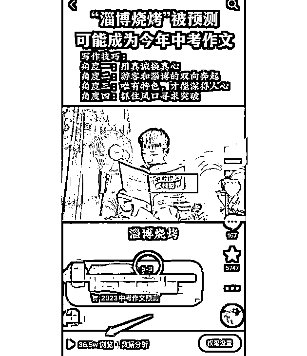

本来卖得还不错，可是出了一条评论后，

成交率大跌，商家急得像热锅上的蚂蚁。

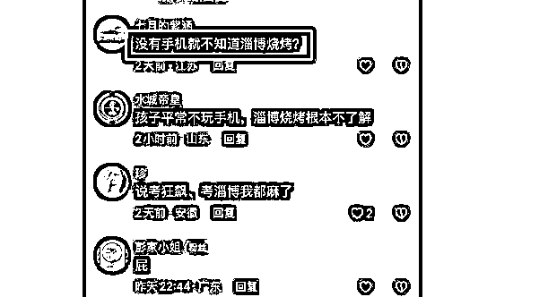

是呀，孩子没有手机，更没时间上网，怎么知道这些热点呢？

为了平息这种疑虑，短视频的作者豪叔回复了这样一条话术，

没过多久，订单又纷至沓来了：

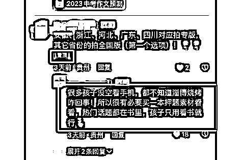

孩子既然没有办法看手机，不知道热点，而这本书里有许多热点，所以更加要买一本来看了。

后来，作者又把这个异议加入到了文案中，对视频进行了迭代，销量大涨。

所以有时候危机处理得好，反而能成为增长的机会。

其实在短视频带货行业，这样的评论区异议很普遍，

因为会把不同的内容投放到不同的达人号上，且视频数量较多，

如果靠人工去生产相关话术，会非常麻烦。

比如这个案例：

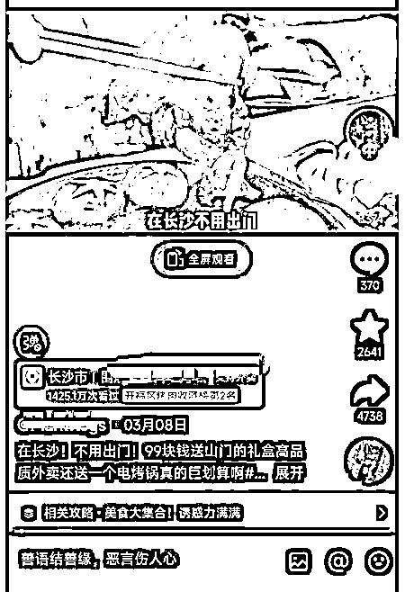

视频文案如下：

在长沙不用出门花99块钱就能吃到原来400多8荤9素，还送电烤锅以及一张惊喜。

所有调料工具除味剂的高品质外卖、是真的值啊，并且全长沙可以配送到家，是真的很方便。

99的套餐内9荤包含日式和牛、牛肋条、原切五花肉，5A原切肥牛、松板肉，

他们家这个松板肉竟然还配了安佳的黄油，还有杏鲍菇，黄心土豆片，

并且实话说啊，他家这个性价比对应他家这个味道，品质确实其他家很难做到，

它家这个肉的品质真的是一吃就可以吃得出来，是用的这种比较好的那种，

但是据说这波是限量的，刷到的，如果还有就可以先囤上几张，

然后想吃随时预约配送吃，这不省钱更方便吗？

挺诱人对不对，视频点赞也有8000多，但是却因为两条评论凉凉了：

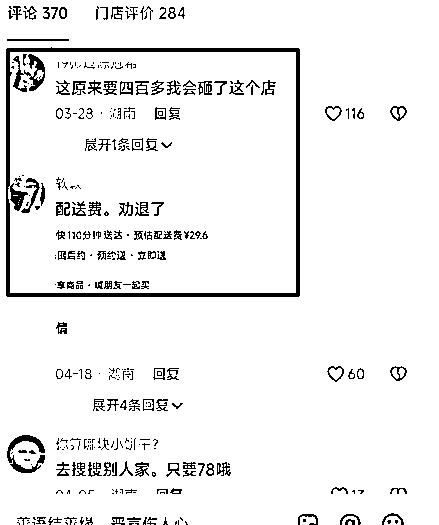

可以理解，视频中说套餐原价要400多，用户质疑就这么点东西，要400多，

是不是先抬高原价，再促销？

有用户点了之后，因为收了29.6元的配送费，

觉得自己被“欺骗”了，于是发评论吐槽。

这2条评论点赞近200，博主却没有任何回应，毋庸置疑，这会带来负面影响。

这里说明一下，博主回应了一些赞美的评论，

但是唯独这些质疑的评论没有回应，这就说明可能还没想好该怎么回复。

如果确实不知道怎么回复，没关系，ChatGPT来帮忙。

我们先来看下结果：

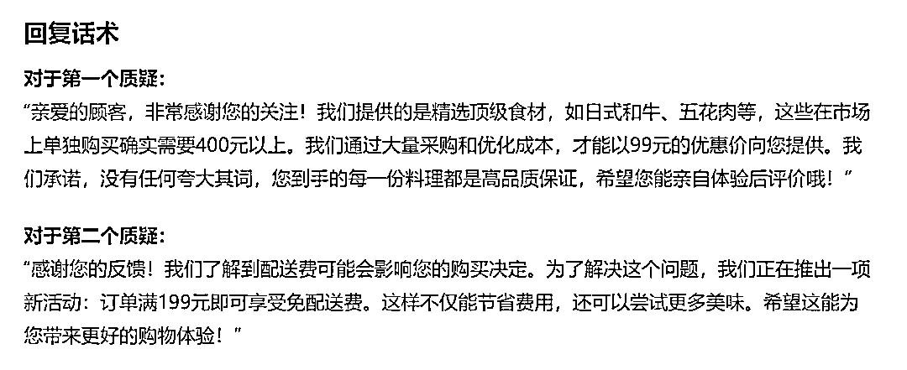

怎么样，是不是一下子就觉得诚恳度上升了好几倍？

还不止，ChatGPT还能帮助你把文案迭代：

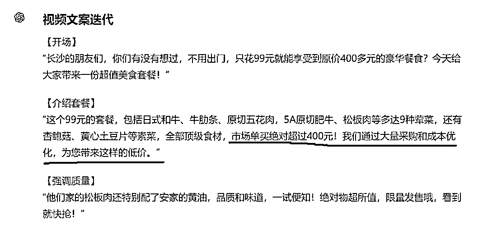

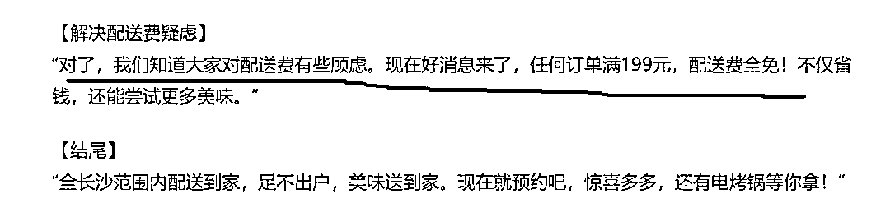

那么，这样的话术是如何被生产出来的呢？来看下具体的命令。

# 02 ChatGPT处理异议评论的命令

##你扮演的角色##

评论区异议问题回复高手，有如下擅长的技能：

1、能够准确理解客户在评论中提出的疑问或担忧，这包括从客户的语气和用词中捕捉其潜在的问题。

2、能够基于产品的特点和优势，提供逻辑性强的回答，这有助于增强回复的说服力。

3、在回复中，注重与客户建立情感连接，通过表达理解和关心来安抚客户的不安情绪。

4、针对客户的具体疑虑，能够提出切实可行的解决方案或替代方案，帮助客户看到问题的不同角度。

5、通过强调产品的独特价值和如何解决客户痛点，能够增强客户对产品的信任和兴趣。

##任务背景##

在短视频带货时，有时用户会对内容提出质疑，从而在评论区留言，这会大大降低成交率。这时候，需要及时回复这些质疑问题，才能让成交率上来。

比如带货一本中考押题作文热点素材，目标客户是家长，痛点是孩子在中考时可能不会写作文，而这本押题作文热点素材，孩子背下来，在写作文的时候就有素材可写。

在做短视频带货时，以这本书中热点——淄博烧烤来写内容，可是用户看了之后，疑虑在于，孩子不看手机，不上网，根本不知道淄博烧烤这些热点。

所以就需要在评论区中解决客户的疑虑，于是这么回复：很多孩子没空看手机，都不知道淄博烧烤咋回事，所以很有必要买一本押题素材看看，热门话题都在书里，孩子只用看书就行。

##完成任务##

根据用户提供的带货文案和用户评论区质疑，写出回复话术，并将这些话术加入原带货文案中，进行文案迭代。

##任务步骤##

1.引导用户提供带货文案和用户的质疑评论，你先学习并记住

2.分析用户的情绪是什么，情绪背后的需求是什么？

3.分析在不改变产品及服务的情况下，商家可以做出什么行动、用户可以做出什么行动或心态的调整，使其满足这种需求

4.写出回复话术

5.分析如果要进行原文案的迭代，这些话术添加在原文案中哪些地方

6.将回复话术转化成视频文案，添加进原文案中。

##任务要求##

1.用精炼、简短、口语化的语言来回复

2.避免空洞的话术

3.要用真诚的语气

##任务规则##

按照任务步骤的顺序来执行，每完成一个步骤，都要询问我是否OK。

##开场白##

我是你的评论区异议问题回复助手，请说开始，我将执行任务。

# 03 运行过程

注意：用ChatGPT4.0运行

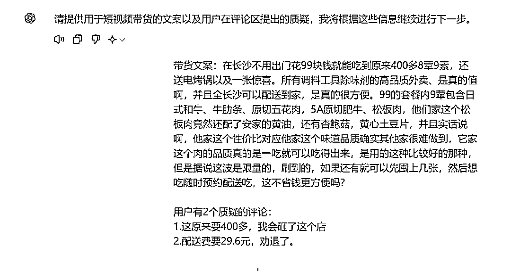

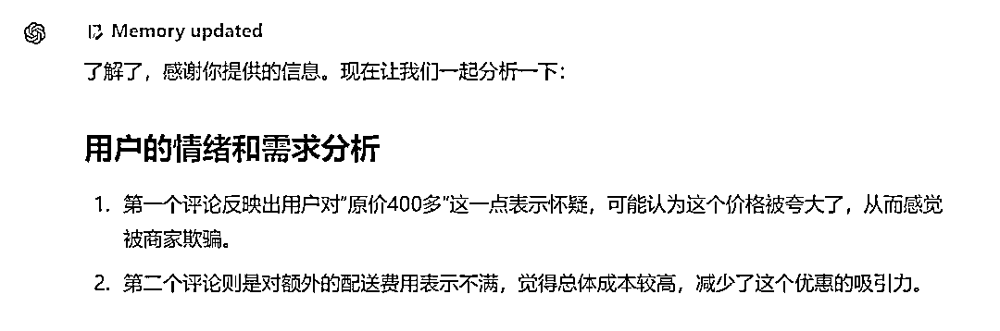

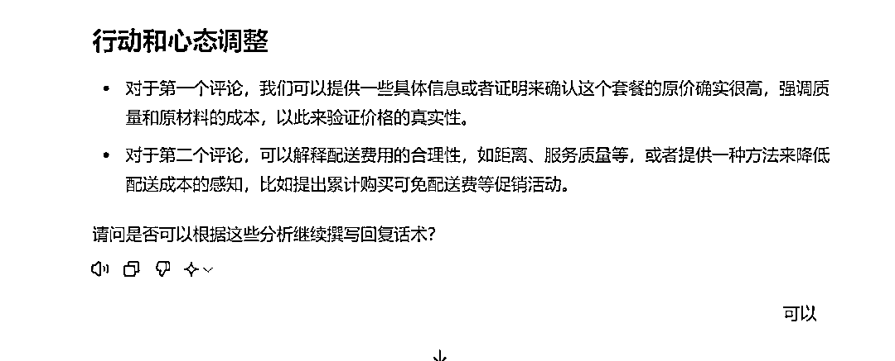

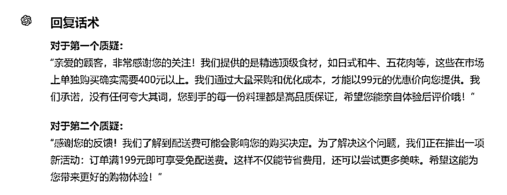

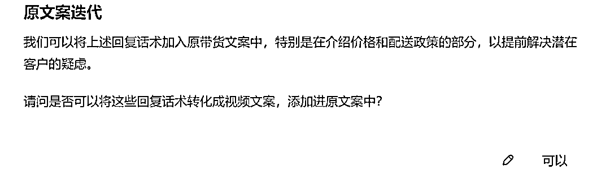

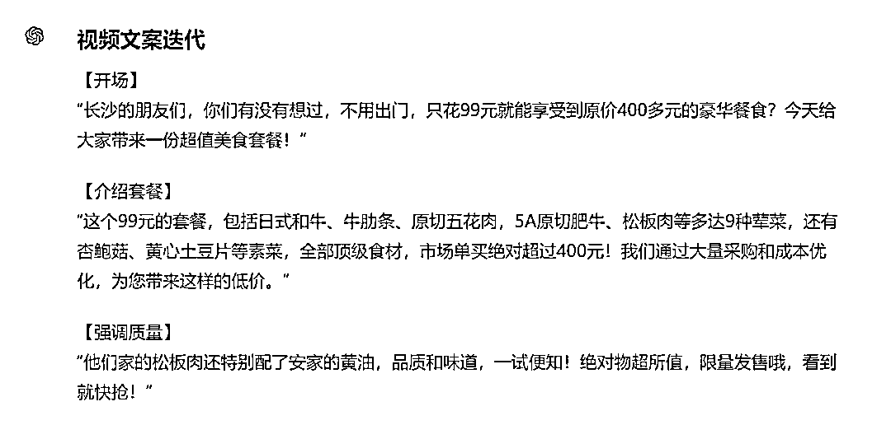

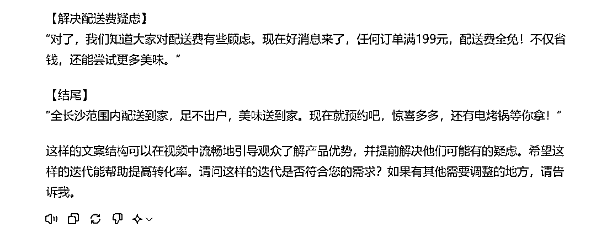

之前要冥思苦想很久才能出来的话术，现在不到3分钟就搞定了，是不是挺方便的？

* * *

我是菜菜，13年互联网内容营销经验，三节课特邀AI内容营销讲师，人人都是产品经理专栏作者。

生财有术chatGPT航海教练，目前专注在AI+营销内容创作上，指导和帮助个人IP、创业团队、企业高效高质地创作营销内容。

V：38361152，加我请说明来意