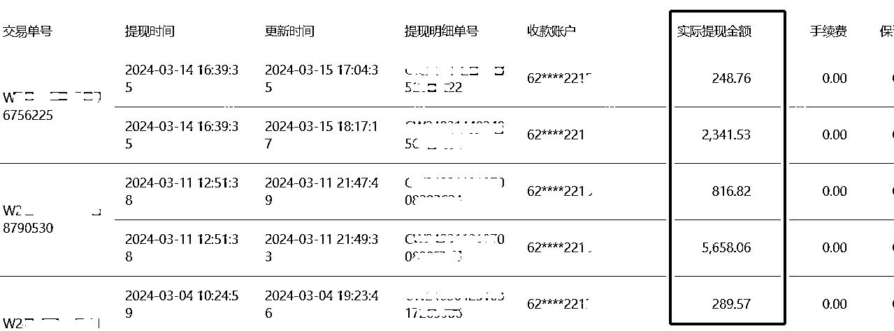

# 【0基础小白，通过跨境电商，一年时间做到1000w业绩的完整复盘及保姆式实操手册分享】

> 来源：[https://qadc4ffica.feishu.cn/docx/XW7ddvBisofp0kx7n8Ocu6Bunme](https://qadc4ffica.feishu.cn/docx/XW7ddvBisofp0kx7n8Ocu6Bunme)

各位圈友大家好，我是秋白，去年在义乌，我发现电商领域有很多的机会，所以就和我的合伙人南星一起研究跨境电商项目

我的合伙人南星，是shein选品变现操盘手，她深耕跨境领域三年，从0-1搭建团队，两年内实现业绩1000w+，专注shein（希音）开店运营指导变现。

以下我将用我合伙人的视角去和大家聊聊跨境电商这件事

21年毕业后我就直接进入了这个跨境电商行业，之后在这个领域里沉淀了三年，从底层一步步往上爬，负责跨境平台shein的整个项目流程，目前已完成shein店铺的入驻，运营，选品，采购，收发货，收款的闭环，真正实现了无货源开店流程全打通。

今天要分享的就是我从0开始做起并且创业后成功起店的这个项目——跨境平台shein（希音）。

# 一、我的经历

21年我来了义乌实习，在这个地方工作两个月后，更加确信了自己想做电商的想法。

毕业后我直接就往跨境行业里去了，一个是前两年没有疫情的时候，跨境行业就已经是风生水起了，再加上我本身学习的是电子商务这一块的专业，对市场行情相对来说更加了解，所以压根没有考虑过别的行业。

发现这个宝藏平台后，马上着手开始做店铺，当时还在尝试阶段，每天除了选品上品，还得从公司的角度去节省成本，包括产品成本和人工成本，所以我基本就是一边当运营一边到仓库发货。

当运营的过程需要和买手不断去沟通，确定自己的选品方向和策略。并且早期的运营选品是非常严格的，每一个品都需要层层把控审核，知道通过审核后才可以上架。

这点从shein前端的产品也能够看出来，上架早的产品基本都是1000+评论，图片标题等各方面也比较严格。

仓库发货的过程就比较辛苦了，因为这个项目本身就是一个新项目，而且前期也没有配备相应的人员来帮忙，单量猛涨的时候，基本都是自己找两个临工在操作。

这对我来说是一个很好的机会，虽然人做的比较辛苦，但是各个流程都要自己去经手，包括在发货过程中的每一个流程和细节。

除了产品本身需要注意，点发货的过程也有很多需要注意的点，为确保自己的订单能够顺利的发出，各个环节也需要去把控。

我印象最深的一次就是条码断帧，这个问题导致我们有十几箱货直接退回，虽然平台是不需要我们承担运费的，但是如果说是因为商家的原因导致无法入库，退回的货是需要自己去负责的。

在这笔订单上直接损失了几千块运费，而且订单也没发出去，当然这是我自己踩的比较大的坑，各种发货过程中的小坑我也踩过无数，知道把整个流程都打通了，才敢放心大胆的分享这个项目。

除了这些，我在职场中也吃了不少亏，一家家店铺刚起店就被转走，搭建好团队后被迫散伙，包括我们普通人在职场上遇到的各种各样的问题，我都经历过。

虽然过程残酷，但这也就意味着shein这个平台的成功经验是可以被复制的。

我会选择希音平台，一个是信息差，海外有将近90%的女性都在我们希音上进行购物，但这个平台在国内却很少的人知道，甚至是我们跨境圈子里的人，早两年的时候都不敢轻易进入这个平台。

这是因为前两年想要进入我们这个希音平台，要求是非常严格的，必须要有线下仓库，必须要有工厂或者货源等各种展现自己实力的要求。

但随着跨境电商行业的迅速发展，电商经济全球化已成必然。不但供应商之间在卷，平台与平台之间也有了竞争，其中最卷的就是temu（拼多多跨境）了，模式直接复制希音，很多条款也直接与各大电商平台开撕。

所以希音平台为了应对这个市场的冲突，入驻的要求直接降低了，目前来说，甚至不需要验厂，不需要你有货源，甚至不需要你有经验，只要有个体户就能入驻了，这无疑是我做希音平台这么几年来听到的最好的消息。

于是我在23年年底的时候，我迅速抓住了这个机会，创建了属于自己的希音店铺，再也不替别人干活了。

# 二、项目的发展前景

随着世界经济全球化的不断深入以及科学技术的不断发展，跨境电子商务已经在全球范围内迅速发展，电子商务全球化趋势已成必然。

电商平台作为全球电商的核心载体，已经在全球200多个国家和地区落地，并涌现出了许多新秀跨境电商平台，比如说：shein，temu，tiktok。

所以很多人都知道temu和tiktok，却不知道这两个平台都是模仿shein（希音）的全托管模式，希音作为最早一批在国内做全托管模式的平台，已经有非常完善的全托管合作模式。

并且平台发展10多年，是和商家共同成长起来的，针对任何规则，都会提前做好市场调研，提前公式，确保让各位商家都能够充分知晓后再进行，整个平台基本不会有突发性的动作，尤其是货款结算这一块，绝对清晰透明。

这也是我最喜欢的一个点，很多平台总是出台一些强制性的条约，打击的商家只能不断的内卷，最后又累又赚不到钱，而希音不会。

先来对比一下这三家平台：

## TIKTOK：

全托管模式，和国内的抖音大致相同，目前平台更倾向于达人带货，直播带货方向。所以我们作为商家，上架的款式成本相对来说要更高，单个产品的成本也要尽量选择高端的价格。

如果是低客单的产品，单价首先就达不到达人带货的标准，更别提直播带货能让达人们去抽取佣金了，就比较难获得流量，高客单则没有这种顾虑。

发货：产品的包装成本相对来说更高，该平台对产品的包装有着严格的要求，有些产品甚至需要里三层外三层去包装，不然就会被退回。

## TEMU：

拼多多跨境平台，全托管模式，走的路和国内拼多多一模一样，低价策略，对客户极度友好，平台甚至推出180天无理由换货。

但对商家极度不友好，售后扣款多，不平等条约比较多，还是强制性签署，如果流量足够好，那么这些售后的钱也能轻松赚回来。但新手没有流量的时候，心态很容易崩。

发货：产品本身的包装没有很高的要求，只要产品在运输过程中不碎就行，发货方式简单，但需要商家承担一半的运费。

但贴标的过程有点难受，一个产品最高会达到十几种标签，以百货杂货铺为例子，一个款有10个标，那么10个款就要贴100个标签，极大的增加了人工成本。

所以temu的商家我都建议做细分类目，只做一种产品，在贴标这方便就能省下一半以上的人工成本。

## SHEIN：

国内最早一批做全托管模式的平台，对商家很友好，平台发展了十几年，一直都是和商家共同成长的，任何条款规则，都会经过市场调研，确保让各位商家都能够充分知晓后再去发布。

尤其是在账单结算这快，精确到每一个订单。出现任何错误，都能及时发现并进行调整，光是这一条，都打败了很多平台。

即便是新手小白，按照正确的运营方式去上品操作一个月，出爆款的机率都很大，更别说有国内运营经验的各位电商人了。

发货：希音的发货方式很简单，平台本身是很多合作的物流，都是上门取件，且不需要商家承担发货运费，除非是各种原因导致的退供，就好比我上面讲的条码断帧导致无法正常入库的情况。

产品的包装也是，只要保证产品在发货的过程不碎就行，并且所有的产品可以集中发出，不需要单独分包裹。

从目前全球跨境电商的发展趋势来看，全球B2C跨境电商交易规模将持续保持高速增长，并且增长率维持在10%-20%之间。初步预计，到2025年时，全球B2C跨境电商交易规模将突破2万亿美元。

只要你对跨境电商感兴趣，那么希音无疑是你跨进这个领域的首选项。

我自己在今年24年新入驻的百货店铺，不到三个月就已经实现了盈利，尽管中间因为过年耽误了一些时间，但店铺流量并没有受影响，提现也是随时能提（我基本都是看见有钱就提出来），现在我只要把这份经验，无限复制就行了。

# 三、跨境项目的痛点分析

1、看不懂英语，不知道怎么回复其他国家的语言。

2、没有货源，不知道通过什么渠道，不知道怎么去拿货。

3、没有跨境电商经验，不知道怎么去操作运营我们这个希音店铺。

4、选品困难，没有具体的开发选品操作方法。

5、物流问题，不知道怎么去进行一个海外的发货。

以上每一个问题，都是我们新手做跨境时最常见的问题，但是咱们在这个行业摸爬滚打这么些年，再加上前人的各种经验，尤其是在希音这个平台上，这些问题都有相对应的方案。

# 四、各个问题的解决方案：

在这里我先分享一下什么是全托管模式：

全托管模式是一种商业的运营模式，指的就是我们作为商家，将产品的销售和运营完全委托给平台。

这种模式对于我们新手卖家是非常友好的，不需要自己去操作运营，不需要去跟海外的客户对接，只需要负责选品发货就可以了。

## 1、语言问题

①可以看下这张图片，我们的后台的全部操作都是以中文的形式展现的，根本不需要懂其他国家的语言。

②并且我们本身是个全托管平台，不需要和海外客户面对面沟通交流，所以在我们这个平台里是没有客服这项服务的。

根本不需要担心语言问题。

## 2、货源问题。

①我们国内很多自己有工厂的厂家和供应商，他们需要将自己的商品销售出去，而我们想要货源，就要去拿货，这就是一个合作共赢的事情，他们要卖货，我们要拿货。

那么我们只要在国内的供货平台，比如说1688等，直接去拿货就行了，根本不用操心货源问题。

②那么其他的拿货渠道我们也有，比如说，在我的这个团队里，越来越多的厂家加入进来的时候，我们就能形成一个圈子，这个叫做“南星的圈子”，那么我们做这类产品的供应商，是不是就能去卖这个只属于我们圈子内的货，这个就是线下货。

我们在这个运营的过程中，可以通过不断地寻找这种圈子，找到更多优质的商家，尽量是低价进，高价出，赚取中间的差价。

③那么有货源的厂家和供应商就更不用说了，你们的优势将会远远大于我们这种没有货源的中小卖家。

## 3、运营选品问题

那么进入了我们跨境圈子的朋友们，想更多的就是我们的这个运营问题了，我将我所有的运营经验分成了两大个板块，一个是初阶运营技巧，一个是进阶运营方法。

①初阶运营技巧

是针对所有小白新手，或者是有国内运营经验的朋友去看的，这个板块能够帮助你们在一周内迅速上手咱们这个希音平台，让你能够在最快时间内出单，学会打造爆品，迅速变现。

包括你在运营过程中会遇到的问题，可能会踩的坑，我都帮你做好了规划，直接通过学习提前规避掉就好了。

②进阶运营方法

当我们上品一段时间后出现了卡点，就可以来学习我们这个进阶内容了。

包括我自己也是，如果我总是在一个类目里进行选品，那么我就很容易陷进思想误区，这个时候就需要进阶方法来帮助自己实现单量的暴涨了。

很多人说自己不会运营店铺，做不了运营的活，退而求其次去了做别的事情，与运营工作擦肩而过。其实不会运营只是你不知道运营方法而已，掌握了正确的运营方法，选品爆单就是自然而然的事情了。

那么我们说的运营，选品等，其实都属于运营，我们在这个过程中只要能熟练掌握里面的技巧，自然能将一个店铺轻松运营起来。

就像我前两天在朋友圈分享的那样，即便我有将近一个月没上品，但是我在这天去上架的时候，依然能够准确把握住上品的逻辑，当天上架即通过，成功率达到80%，这个就是我们作为一个跨境电商运营最基本的东西。

## 4、物流问题

现在我们也知道这个平台走得都是全托管模式了，所以物流这块也就不用太过担心了。做希音平台，只需要我们选品，等产品出单以后，把我们的订单发往希音所在的仓库即可。

那么希音的仓库就在广东，也就是说，我们只需要发国内快递就可以了，把订单从你自己所在的地区发往广东的仓库，就可以了。

国内快递还不好发吗，就不说电商行业了，就算作为一个普通消费者，都知道国内怎么发了，对吧？

更别说希音平台还有合作的物流，订单点击发货以后直接由工作人员上门取件，除了大年30不上班，每天都能来取件，简直不要太贴心了。

这个就是做希音平台的好处，我们能想到的大部分问题，平台都帮我们解决了，我们即便作为一个无电商经验的小白，也能够轻松操作实现变现。

# 五、店铺运营的全流程

首先希音作为跨境电商的平台载体，我们肯定是要去平台上入驻一个属于自己的店铺的。独立运营整个店铺的流程可以总的概括为入驻—运营—采购—发货—收款。

## 1、入驻环节

在这个过程中，我将会手把手带你走一遍希音的入驻流程，提前准备好入驻时需要的资料，避免在入驻的过程中手忙脚乱。

以下是我们需要准备的资料：

①一本营业执照（公司户或者个体户都可以）

②一张可以正常收款的银行卡、一个手机卡

③一个不带数字的邮箱（网易或者阿里云邮箱都可以）

④一个款式资料附件表格，与自己类目相关的产品准备20个以上

⑤分别准备一张仓库，办公室，样板间，车间，公司全景/入口的照片

## 2、运营环节

运营是我们做跨境电商的重中之重，俗话说的好，七分靠选品，三分靠运营。运营本身并不需要很大的技巧，掌握好方法即可。

并且希音平台是不需要自己运营的，平台会有专门的买手负责将你的商品销往海外，我们只需要选品就可以了。

而选品，则是比较重点的东西了，一个店铺能不能起来，靠的就是你的选品方式。当我们处在不同阶段时，选品方式也各有不同。熟练掌握选品的底层逻辑和上新操作发布商品的全流程才是运营店铺的关键。

我自己本身是做百货类目的，那么我在进行选品的时候，就会往百货这方面走，包括我的选品思路和方向。

比如说新手能够使用的5种选品方法有：

①参加站内跟卖活动

②根据跟卖活动拓展，去平台上找爆款

③关键词选品

④1688平台选品法

⑤查找自身优势款选品法

有时候，能够带动流量的产品，往往就是你的一念之差。选品的过程哪怕只是一个小想法，都会有意想不到的收获。

更别说我还准备了多种进阶的选品方案，直接让你在选品的过程中把单量拉满，再也不用眼巴巴看着别人爆单了。

## 3、采购环节

无货源商家的重点，如果是自己有货源有工厂的话，那可以直接省去这个部分了，只要注意核对产品信息就可以，这就是有货源的商家起步比无货源商家高的原因。

但我们大部分人还是普通人，没有货源的，比如说我自己就是，所以我也是需要去1688采货的。

正常情况下，作为一个新手小白，或者是说即便是像我这样操作三年以上的运营，除非后期是自己确实想开工厂，不然也都不会去囤货的。

那么在希音平台上，我们有两种订单，一个是急采一个是备货。我们无货源商家只要为急采订单准备10-20个货即可，后面的都是订单出来再去买货，基本上是没有什么囤货压力。

## 4、发货环节

发货是我们每个人都必须要去操作的，我把这个环节称为磨练心性的过程，我们做电商的很多人，基本到了这步就不去操作了。

他们会理所当然的以为这是底层级的人干的，一些公司做的很大的领导人，他们常常认为仓库发货不需要动脑子，都是体力活，谁都能干，就会看不起仓库人员。

前期只要准备一两个货架就行

但实际上，一个认真负责的仓库人员，能够最大程度的避免掉货不对板，质量不过关等稽查问题。

要知道，希音仓库为了保证自己平台的口碑，在仓库这一快查的是非常严格的，我自己也是在发货的过程中才发现，原来我们很多稽查问题都是在发货前就可以避免的。

包括我们产品的体积重量，包装方式，质量检查等等。不然最低罚款300最高罚款10000，是每个新手买家都难以接受的。

## 5、收款环节

那么提现这个环节就是我们最喜欢的了，希音的提现模式很简单，只要你出单了，客户收到你的货，并且确认收货15天后，钱就会自动跳转到你的钱包。

如果对账单不清楚，可以单独挑出时间点，挑出订单来核对，每一笔订单的货款，每一次罚款，因为什么原因，为什么罚，都会清清楚楚。

这点是我最喜欢的，有问题都会及时告知，不会扣的不清不楚。

当然罚款我们还是尽量不要让他产生，提前把会罚款的因素都避免掉就可以了。只要在我的钱包里有钱，就可以随时提现，每天都有一次提现机会。

以上就是我们运营这个店铺的流程，如果你有国内电商经验的话不难看出，虽然我们是希音平台是个跨境平台，但整体的操作流程和国内的平台没什么区别。

而且我从0开始做的时候，也是个全透明的小白，甚至和大部分人一样，刚进入跨境圈子时，我都不了解希音这个平台，但后面实际做了才知道，这个跨境平台是真的香。

## 一个新手想要做跨境只需要先做两件事：

①入驻 ②选品

就是这么简单，根本不需要什么复杂的操作，因为你考虑到的那些问题，平台都解决了，你作为新手只需要入门，开始上品，那么其他的事情就是自然而然了。

想当初我是小白的时候，我连入驻的经验都没有，直接就上品，上品三个月就把一个百货店铺做到了业绩20w+，目前来说，这就是跨境圈里最适合我们小白去做的一个平台，而且是每一个人都能做。

# 六、跨境平台希音的优劣势

当然了，只要是个平台，就会优劣势的存在，希音平台也是一样。

## 希音的优势：

1、近期开启了入口，从之前的严格入驻要求降低到了现在几乎是无门槛，有个体户执照就能做，新手小白无经验也能做，只要你对跨境电商感兴趣。

2、账单稳定，平台整个平台基本不会有突发性的动作，尤其是货款结算这一块，双方合作最重要的就是账目清晰，我们与平台合作，平台反馈给我们清晰明了的账单，也会及时听取商家的意见和建议。

平台稳定，有着巨大的用户群体。结算周期快，小单快返，流量大，性价比高，为商家提供了广阔的市场，这个才是我们作为商家愿意与之合作的核心。

3、成本低，无需费用

希音前期的开店成本低，商家可以自主选择“全托管”或者“独立店”，不需要保证金，平台不扣点不抽成，我们只需要供货就能出海，相当于是给中小型卖家开辟了一个新的销售渠道。

4、投入精力少

希音是一个供货平台，货品上架以后，不需要自己经营，也不需要专门的运营团队，只需要负责对接货物即可。

5、优质的物流服务

希音为了鼓励更多的商家入驻，推出了“全托管模式”，平台将会帮助商家把货物运输到国外的客户的手中，而我们只需要将货发往希音的仓库即可。

## 希音的劣势：

1、入驻端口不定时开放，平台本身主打的就是与工厂合作，我们作为无货源供货商家，入驻入口能开放一段时间已经很幸运了，但不确定这股风能刮多久，之后市场稳定了，可能会关闭掉这个入口，所以趁着目前这个优势还在，可以优先入局。

2、平台不会大起大落，其他跨境平台如果说流量来了可能会猛的给你下一柜子订单，但希音不会，每一个产品都有起来和下滑的趋势，也就是说所有的订单都是有迹可循的，今天下15个，明天35，后天50这样，起是慢慢的起，掉也是慢慢的掉。

3、成本低不等于不需要成本。

如果你在第一个月铺50个品，那么第一单你需要备货10-20单，以每个货10个货为例子，那么你需要50*10*单个成本，这是你需要投入的资金。上的款式越多，你需要付出的成本也就越多，所有没法给出具体的投入成本。

4、平台不收取物流费不等于我们一点物流费都不用出。如果你的货出现了比如说条码断帧，错发订单，货不对板等任何问题，导致希音仓库无法将你的货入库，那么希音仓库就会把你的货退回，那么这个时候你是需要付你发去和shein仓库退回两程的运费的。

那么以上就是我对整个跨境平台shein（希音）的分享，如果你也想做跨境，欢迎找我交流~