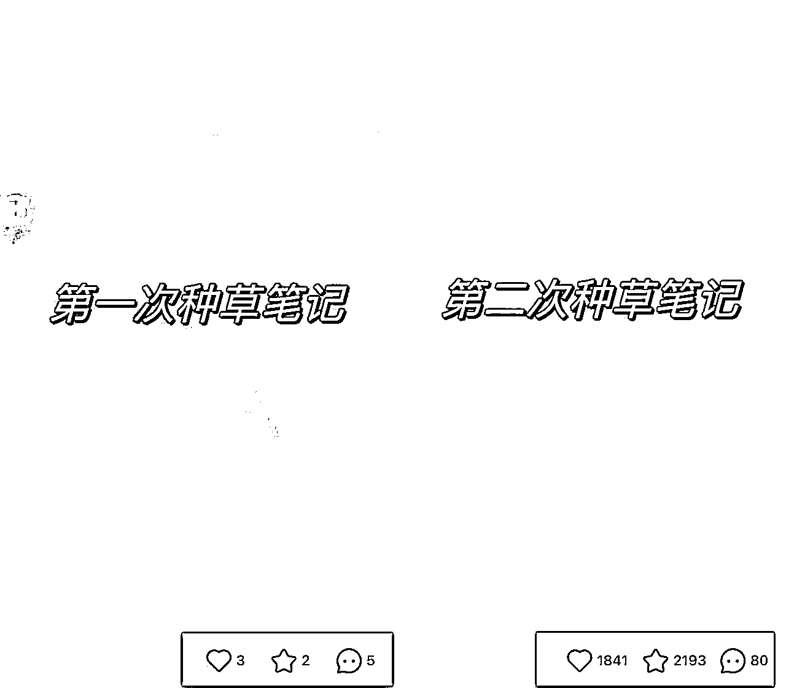
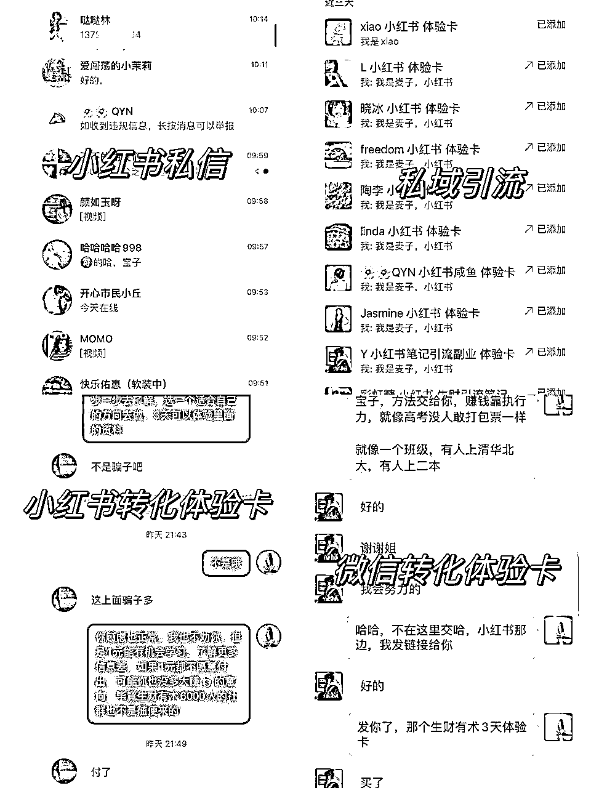

# 从3个赞到第二次1800+赞，我如何通过小红书做生财的种草笔记

> 来源：[https://vw71gytvcmf.feishu.cn/docx/YXpldYGV7ovC0ixcNsjcLBjPnyb](https://vw71gytvcmf.feishu.cn/docx/YXpldYGV7ovC0ixcNsjcLBjPnyb)

大家好，我是麦子，今天给大家分享我如何通过2条种草笔记，从第一次3个赞提升到第二次1800+赞

先上结果 ：3天1800+赞，36个私信，引流微信11个，购买体验卡2个；

虽然和大神不能比，但是也算有小心得，下面分享一下我这个小红书菜鸟的经历以及如何转变的；

自我介绍一下:我叫麦子，34岁大龄女青年，来自海南三亚，曾经做了7年的运营，33岁裸辞转自由职业；

24年1月30号加入生财

先分享一下我的小红书失败经历：

1、小红书IP号连续日更3个月没有过千粉；

2、3月第一次参加小红书航海做废了3个号（包含娱乐赛道，热评分享赛道，女性成长赛道）

3、第一期生财有术种草笔记只有3个赞；

记得第一期报名参加生财有术的种草笔记，当时为了追求量产一次写两条笔记，第一期笔记结果不出意料，发布后仅仅只有3个赞，说实话，我觉得自己太菜了，自己不是这块料！

后来小助理通知第二期活动的时候，我犹豫了，我那么菜，人家还收不收我？还要不要参加？

犹豫了好久我决定再试一试，报名后没想到小助理马上给我发了链接；

鉴于上次的笔记数据结果太差，我反复学习了比比老师的小红书课程，所以这一次我决定改变策略，种草笔记虽然说重点分享自己在生财的经历，但是前提是用户喜欢，能吸引到目标人群；

分享一下我的笔记改进方法：

第一步：找选题，先去找爆款选题，结合我自己的情况，我搜索的关键词是“副业”“搞钱”“不上班”“裸辞”，并且只看过万赞笔记，收集下来发现，“副业”的爆款选题比较符合我的情况，而且近期有2条过万的相似爆款笔记，我就以此为参考；

经过我的验证，爆款一定是万赞以上，而且至少有2条相似笔记，参考这样的笔记才能有机会提升我的爆款率；

第二步：模仿，列举了博主1年下来做过的副业，有一个小细节是，博主列举的全部都是拿到结果的，试错没结果的一个没提，我之前也发布过相类似的笔记，数据反馈平平，所以这次，我只写我成功的副业案例；

这里补充一下标题，我之前是模仿爆款的标题，但是教练给我的建议是不要夸大结果，标题建议少带月入x万这种，小红书会觉得在贩卖焦虑~，所以我找了一些比较真实的标题《救命！裸辞快1年的我真的做了好多事啊！》，模仿这个写了一条；

第三步：封面和标题，我把80%的精力都花在笔记的封面和图片上，封面决定用户是否点进来，后面的图片经历和人设决定用户是否相信你，所以我笔记的封面依旧模仿爆款为主，爆款封面是经过验证的，所以封面选择的是文字类，白底黑字，后面的图片几张图片，依旧是模仿爆款，放自己的实拍图片+我的照片，我尽量把我的收获和经历+干货放在真实的图片里，这样看起来真实些；

第四步：笔记内容，开头和标题呼应，写明自己的情况，最后给一些做副业的心得和体会干货；

就这样，由于白天太忙，所以晚上22点开始死磕写到凌晨，第二天继续肝封面图片，写了笔记在教练的建议修改标题后就发布了！

结果没想到数据反馈还挺好，虽然只是小小的结果，但是对我的激励是无限大的；最近，我也尝试成功做了2个文字号，12天起号和3天起号，接广变现；

复盘一下这次的笔记踩的坑：

1、生财有术的价值点没体现在笔记上，导致用户的关注点依旧在副业身上，对生财有术依旧了解甚少，增加沟通成本；

2、私域引流话术没准备好，本来以为评论区@生财有术体验卡就好了，后来小助理提醒我引流到私域做转化，比较好追踪；

3、引流的资料没准备好，副业类型太多，要各种资料的人很多，最后手忙脚乱；

如果你做小红书暂时没有出成绩，我的建议：

1.  认真做一篇笔记认真打磨，复盘，比追求量产更重要。

1.  不要自我设限，相信自己的潜力。

1.  用心学习和执行，结果自然会到来。

关于引流沟通环节方法分享：

小红书引流

一般用户会在笔记下写【求带】，我会引导至私信；

1）一般是先问他想做哪个项目（了解用户需求）

这里一般用户会回答：xx项目，或者让你推荐

2）我会相对应的介绍项目，以简单易上手为主，且最后都带上可以发资料的信号，让用户接着回复我的消息。

答：可以的，我这里有资料，这里发不了，你看看怎么发你？（引导用户主动留下微信，主动私信的用户意向都比较强，之前有试过我先发微信图片形式发微信号视频但是效果不好，用户看不懂，容易违规）

微信篇：

1）打招呼，询问用户想做哪个项目？

这时候一般用户的反馈：怎么做？或者是讲自己的经历和困惑或者期望；

2）我会相对应的介绍项目，以简单易上手为主，引起用户好奇，且每一句结尾都带反问，让用户接着回复我的消息（就推荐一些比较容易上手的，闲鱼，小红书，客服之类的）

问怎么做：就可以讲自己是如何做的， 然后我自己也在做的副业都是和生财有术学的，如果有相关的精华帖目录截图或者自己的副业业绩展示更好，发给用户！

讲自己的经历和困惑或者期望：先夸再戳痛点再引导到生财有术，比如我会说：你能这样想，已经超越了很多人，你有这些经验对于xx项目会很容易上手，这个项目我们新手一个月能拿到xxxx，再引导到我自己的经历和生财有术的关系

3）到这里一般用户都会问怎么做，或者怎么学

答：先塑造生财价值和用户跟着做项目未来预期收入，然后发生财的1元体验卡链接！

以上是我自己的私域引流分享

希望大家不要看不到结果就放弃，想要收获，人生就不要自我设限，拿结果是迟早的事！！！

以上就是我今天的分享~

如有不对的地方，也希望各位大佬能来指导更正；

最后感谢教练老师的账号指导，@梁靠谱文章指导@感谢生财小伙伴们给的学习机会！