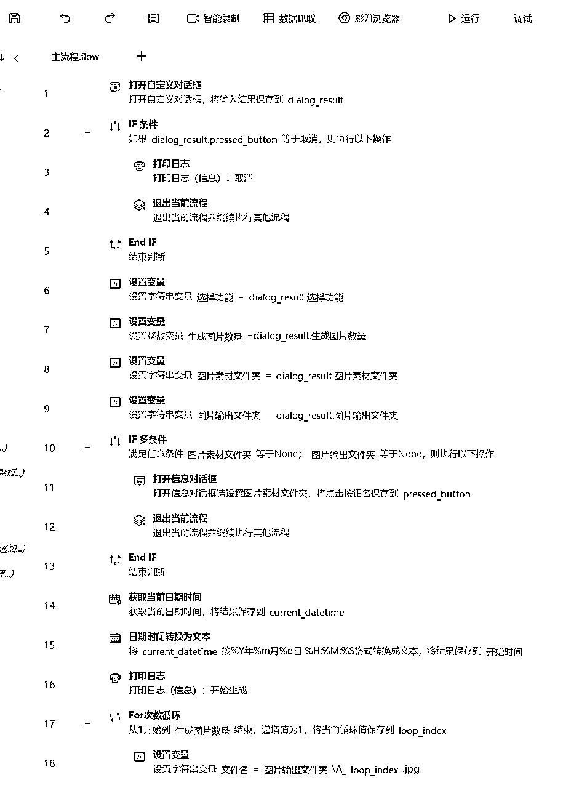

# 10分钟量产10000张图！4/9宫格图片合成神器，RPA机器人让效率提升120%

> 来源：[https://kwut14otear.feishu.cn/docx/A6BodL8NkoxMdAxgaHVcGHFcnhd](https://kwut14otear.feishu.cn/docx/A6BodL8NkoxMdAxgaHVcGHFcnhd)

一、机器人介绍

名称：免PS批量合成4或9宫格图片RPA机器人

作用：

1.快速从指定文件夹中随机提取图片素材

2.合成4宫格或9宫格图片，适用于自媒体矩阵内容制作

3.大幅提升图片编辑效率，节省人力成本

生成效果：


二、准备

软件：影刀RPA软件

官网：www.yingdao.com

三、流程

1.选择素材文件夹

2.设置合成宫格模式（4宫格或9宫格）

3.启动合成程序

4.机器人自动完成图片提取与合成

5.检查并导出最终图片

四、实现代码

主流程




生成合成图流程


4宫格图片合成python代码

```
# 使用提醒:
# 1\. xbot包提供软件自动化、数据表格、Excel、日志、AI等功能
# 2\. package包提供访问当前应用数据的功能，如获取元素、访问全局变量、获取资源文件等功能
# 3\. 当此模块作为流程独立运行时执行main函数
# 4\. 可视化流程中可以通过"调用模块"的指令使用此模块
# 如果有需要技术支持，可以联系 v pin9108

from PIL import Image

def main(im1, im2, im3, im4, save_file_name):
    # 打开四张图片
    im1 = Image.open(im1)
    im2 = Image.open(im2)
    im3 = Image.open(im3)
    im4 = Image.open(im4)

    # 获取图片的最小宽度和最小高度
    widths = [im1.width, im2.width, im3.width, im4.width]
    heights = [im1.height, im2.height, im3.height, im4.height]
    min_width = min(widths)
    min_height = min(heights)

    # 缩放和居中对齐图片
    im1 = resize_and_center(im1, min_width, min_height)
    im2 = resize_and_center(im2, min_width, min_height)
    im3 = resize_and_center(im3, min_width, min_height)
    im4 = resize_and_center(im4, min_width, min_height)

    # 创建一个新的图片，大小为四张图片的尺寸的两倍
    new_im = Image.new('RGB', (min_width * 2, min_height * 2))

    # 将四张图片按顺序粘贴在新的图片上
    new_im.paste(im1, (0, 0))
    new_im.paste(im2, (min_width, 0))
    new_im.paste(im3, (0, min_height))
    new_im.paste(im4, (min_width, min_height))

    # 保存新的图片
    new_im.save(save_file_name)

def resize_and_center(im, width, height):
    # 缩放图片以适应给定的宽度和高度
    im = im.resize((width, height))

    # 创建一个新的白色背景图片，大小为给定的宽度和高度
    bg_im = Image.new('RGB', (width, height), 'white')

    # 将原始图片居中对齐到新的白色背景图片上
    left = (width - im.width) // 2
    top = (height - im.height) // 2
    bg_im.paste(im, (left, top))

    return bg_im
```

9宫格图片合成python代码

```
# 使用提醒:
# 1\. xbot包提供软件自动化、数据表格、Excel、日志、AI等功能
# 2\. package包提供访问当前应用数据的功能，如获取元素、访问全局变量、获取资源文件等功能
# 3\. 当此模块作为流程独立运行时执行main函数
# 4\. 可视化流程中可以通过"调用模块"的指令使用此模块
# 如果有需要技术支持，可以联系 v pin9108
from PIL import Image

def main(im1, im2, im3, im4, im5, im6, im7, im8, im9, save_file_name):
    # 打开九张图片
    im1 = Image.open(im1)
    im2 = Image.open(im2)
    im3 = Image.open(im3)
    im4 = Image.open(im4)
    im5 = Image.open(im5)
    im6 = Image.open(im6)
    im7 = Image.open(im7)
    im8 = Image.open(im8)
    im9 = Image.open(im9)

    # 获取图片的最小宽度和最小高度
    widths = [im1.width, im2.width, im3.width, im4.width, im5.width, im6.width, im7.width, im8.width, im9.width]
    heights = [im1.height, im2.height, im3.height, im4.height, im5.height, im6.height, im7.height, im8.height, im9.height]
    min_width = min(widths)
    min_height = min(heights)

    # 缩放和居中对齐图片
    im1 = resize_and_center(im1, min_width, min_height)
    im2 = resize_and_center(im2, min_width, min_height)
    im3 = resize_and_center(im3, min_width, min_height)
    im4 = resize_and_center(im4, min_width, min_height)
    im5 = resize_and_center(im5, min_width, min_height)
    im6 = resize_and_center(im6, min_width, min_height)
    im7 = resize_and_center(im7, min_width, min_height)
    im8 = resize_and_center(im8, min_width, min_height)
    im9 = resize_and_center(im9, min_width, min_height)

    # 创建一个新的图片，大小为三倍的原图尺寸（3x3）
    new_im = Image.new('RGB', (min_width * 3, min_height * 3))

    # 将九张图片按顺序粘贴在新的图片上
    new_im.paste(im1, (0, 0))
    new_im.paste(im2, (min_width, 0))
    new_im.paste(im3, (min_width * 2, 0))
    new_im.paste(im4, (0, min_height))
    new_im.paste(im5, (min_width, min_height))
    new_im.paste(im6, (min_width * 2, min_height))
    new_im.paste(im7, (0, min_height * 2))
    new_im.paste(im8, (min_width, min_height * 2))
    new_im.paste(im9, (min_width * 2, min_height * 2))

    # 保存新的图片
    new_im.save(save_file_name)

def resize_and_center(im, width, height):
    # 缩放图片以适应给定的宽度和高度
    im = im.resize((width, height))

    # 创建一个新的白色背景图片，大小为给定的宽度和高度
    bg_im = Image.new('RGB', (width, height), 'white')

    # 将原始图片居中对齐到新的白色背景图片上
    left = (width - im.width) // 2
    top = (height - im.height) // 2
    bg_im.paste(im, (left, top))

    return bg_im
```