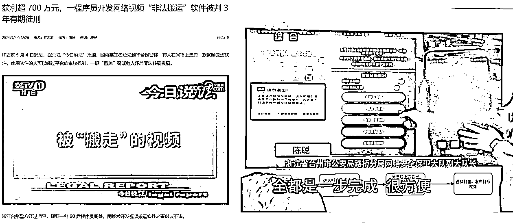
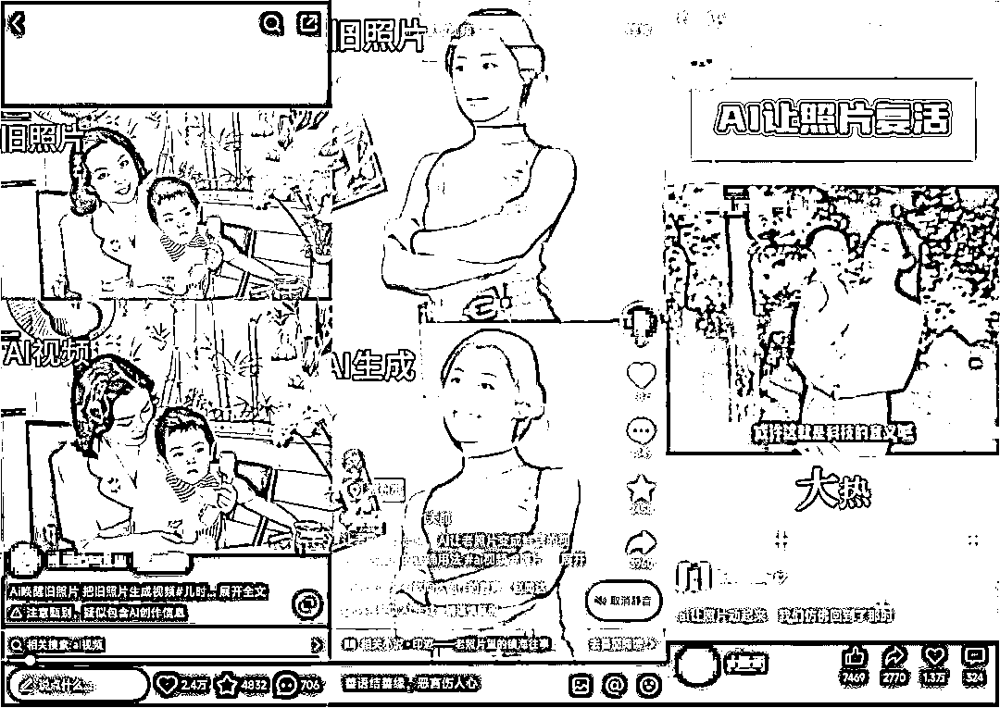
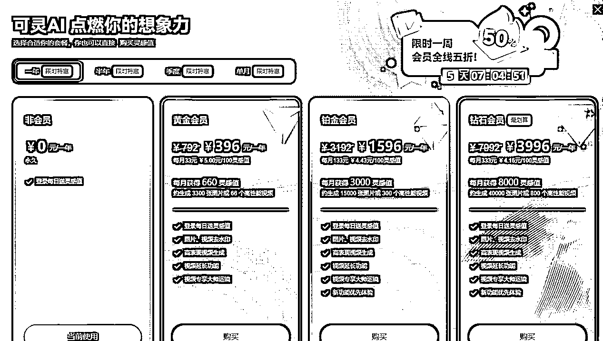
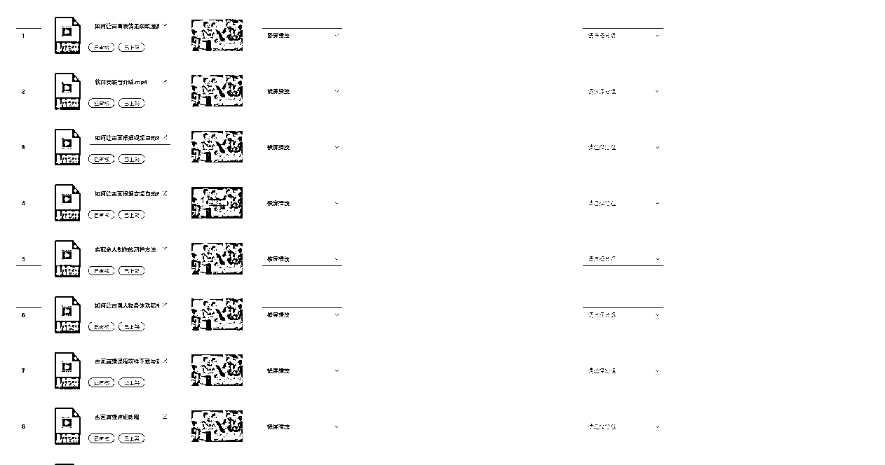
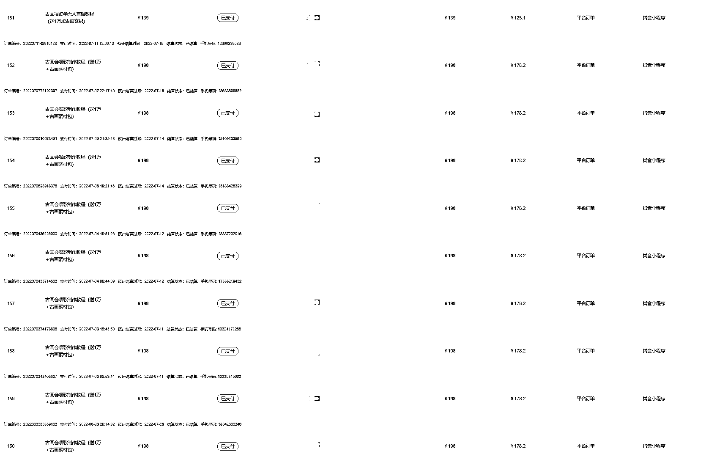
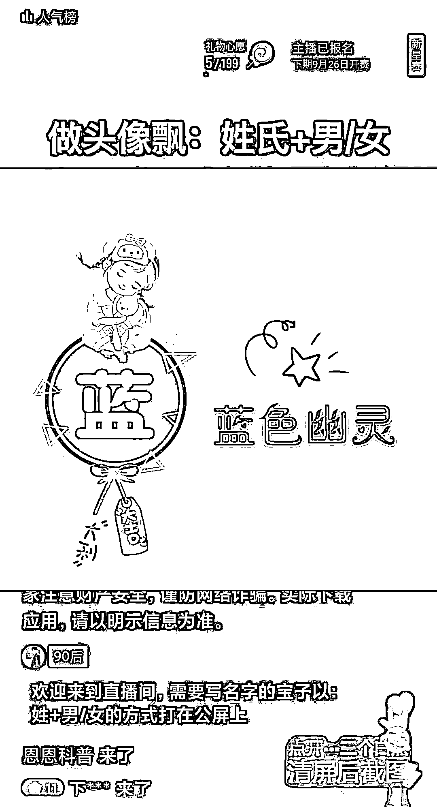
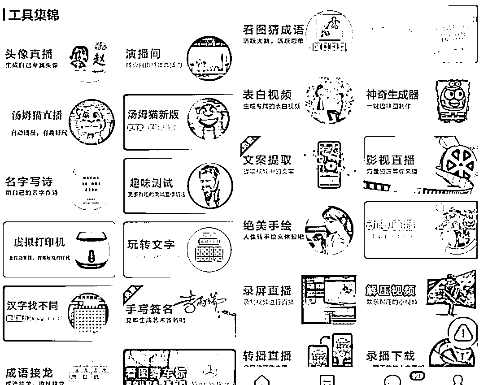
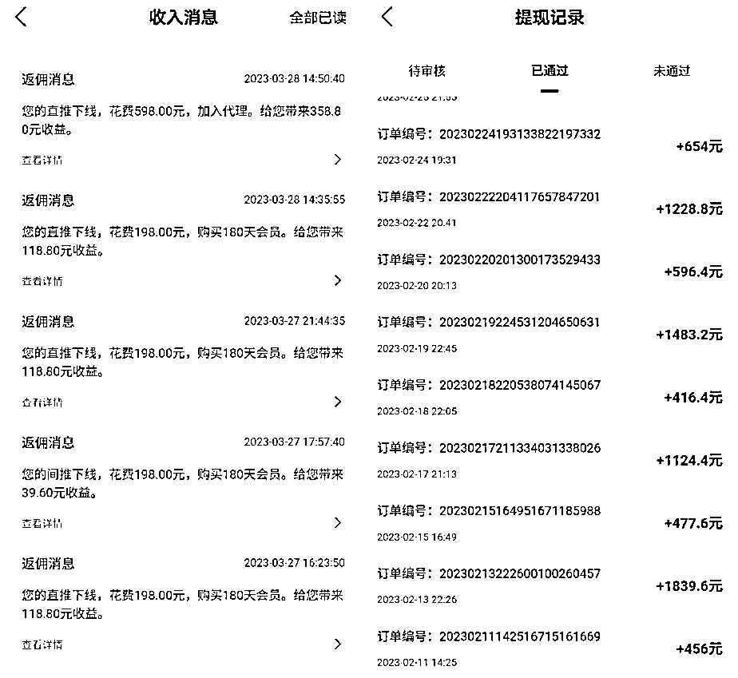

# 卖铲子一年搞了几百万，不是你不够努力，可能是方向没找对！

> 原文：[`www.yuque.com/for_lazy/zhoubao/blzilzaoa3vovda3`](https://www.yuque.com/for_lazy/zhoubao/blzilzaoa3vovda3)

## (49 赞)卖铲子一年搞了几百万，不是你不够努力，可能是方向没找对！

作者： 大鹏

日期：2024-07-25

大家好，我是大鹏，一个只讲真话的网创博主。

今天偶然刷到一个旧闻

是今年 5 月份发生的事情了，可能很多人都看到过：

一个 90 后程序员搞了一个一键混剪去重软件，然后拿到网上去卖

一年不到赚了近 800 万！然后就被抓了判了 3 年

这个人跟我一个合伙人住的特别近，之前家里条件很一般

搞了这个之后一年之内买房、换车走上人生巅峰

本来我们还商量着去拜访一下这个“大佬”的，但还没去就被按头了...

大部分人看到这个消息的第一反应都是“原来卖这个东西这么赚钱？”

是的！确实就这么赚钱

为啥这么赚钱？

因为有需求啊，前两年短视频爆火全网

大量网创小白涌入短视频赛达淘金，但是想赚钱又不想花太多时间和精力

不想自己拍视频、剪视频，总想着轻轻松松把钱赚了

于是这个小伙儿就发现了商机

你不想自己做视频？我教你搬运别人的；你怕平台查重？我帮你做好去重，平台查不到

你只需要把别人的视频下载好然后上传软件自动就给你混剪去重好了，直接发布就行，完美解决了大家的需求

关键是这么好用价格还不贵，一个月就几十块，你会不会买？我想大部分想做短视频赚钱的人都会毫不犹豫的冲个会员试试

于是，你几十我几十，积少成多，不到一年人家赚了七百多万！

至于用这个软件发视频的人赚没赚到钱不清楚（八成够呛）

但是卖软件的人却切切实实把钱赚了，而且还赚的不少

这就是我在很多篇文章里面都提到过的一个思维**“卖铲子思维”**

当一个行业处于风口时，如果它能赶上风口并享受一波红利，那自然是好事。但是当行业充满竞争时，你没有必要直接参与进来。你可以换个思路，提供其他服务，参与上游和下游的行业，这才是更容易赚钱的方式。

自己挖矿，你可能会得到极大收益，这不仅靠自身的努力，更靠运气，有一定的不确定性。

而卖铲子的人则不同，挖矿的人越多，卖铲子的人就越发成功。

放到互联网里面也是一个道理

我们普通人接触赚钱项目信息的渠道非常有限和滞后

当你了解到一个赚钱项目信息的时候，其实已经不算早了，早就有大批人比你早知道了，甚至还有人已经做了很久了

你直接参与进去就会面对众多的竞争对手，再加上互联网的不确定性，做出结果的可能性不会太大

但如果你换个思维，不直接参与项目

而是提供跟这个项目有关的上下游服务成功概率就会大大提高

比如前段时间用可灵做会动的 AI 老照片视频项目爆火，做这个项目发视频的人大部分赚不了多少，但是可灵 AI 官方这一波吃的足够饱(开始收费了）

做小说推文真正赚到钱的人是少数，但是用来做推文的“推文助手”这个软件官方一年可不止赚 800 万！

还有市面上各种杂七杂八的 AI 大模型软件、文案改写、文案生成、做视频的、做直播的软件等等，都是通过卖铲子赚的盆满钵满

这个小伙儿是懂卖铲子的，只不过做的东西不合法，不然还能赚的更多

看到这里可能会有老铁问“你说这些有啥用，我又搞不了平台”

先别急，我列举的这些案例只是为了让大家更清楚的了解“卖铲子”的这个逻辑

对于我们大部分普通人来说，我们没有能力去搞一个平台、一个软件

但是我们一样可以利用这种卖铲子思维，通过我们普通人的方式在互联网上赚到钱

**这个铲子不一定非得是某个软件、工具、平台**

**而是问题解决方案的一种统称**

还拿这个 AI 老照片视频项目举例

一个小白想要做出一个是需要完成一整个流程的：

收集图片（AI 作图）--工具账号申请--使用教程（提示词）--发布--变现

在每一个流程中都会遇到各种各样的问题

比如他想做老照片的视频，但是他不知道去哪里收集老照片，或者自己去收集嫌麻烦又或者老照片的质量不够清晰

有人帮他收集好大量的修复过的老照片是他的需求

这个时候你就如果可以通过各种方式收集到这样一个素材包，你感觉会不会有人买单？

**这个素材包就是铲子；**

如果他想自己用 AI 作图

**AI 作图工具和制作方法就是铲子；**

有了素材之后他需要找到制作视频的工具，而且还要通过内测申请

**这个时候制作工具和快速通过内测申请的方法就是铲子；**

后面就是要做视频，他自己可能因为不会写提示词等各种原因做出来的效果不佳

怎么做出效果非常好的视频也是他的需求

**这个时候一份做出高质量 AI 视频的教程就是铲子**

视频做出来之后他要变现啊，但是对互联网了解甚少，不知道有哪些变现方式

**这个时候一份整理好的变现途径和教程就是铲子。**

所以你发现了吗？铲子并不是单单指软件、工具这些

而是根据用户需求发生变化的

铲子就是针对用户会遇到的问题提供的最佳解决方案

可以是一个工具软件，也可以是一份教程一个方法，还可以是一些视频图片素材等等

能卖好铲子的关键是：**能够发现用户需求！**

问题又来了**“那怎么去发现用户需求呢？”**

细心点，多看，多问自己几个问题，找目前方案的不足

列举我自己的两个卖铲子的案例吧：

**案例 1：**

我在最开始的时候做古画会唱歌

什么是古画唱歌？其实就是让人物照片开口说话

变现方式就是通过取图小程序、卖软件和收徒

这种技术放到现在来说不算什么，很多 AI 工具都可以实现

但在 22 年 AI 技术没有这么发达，只有个别软件可以做到，所以这里面藏着一个巨大的信息差

于是我就开始研究这个软件，我发现市面上大部分博主做古画唱歌都是用的一个苹果手机软件“muglife”而且还必须得是苹果 X 以上的手机才可以用。

很显然还有很多粉丝没有苹果 X 手机，但他也想做这东西，这就是一个很大的需求，而且还没有人提出过解决方案

我就开始找有没有其他办法实现这个功能，找了好久，终于发现了一个博主也在做这个赛道，但是他用的是一个电脑软件“CTA”，效果也挺好，这正是粉丝想要的东西啊！

接下来我花了一周时间通过查阅各种资料把这个技术学会了，又花了两周时间录了一套视频教程，9 节课，总共 3 个小时，定价 198，试着发了几条抖音视频，卖了 500 多份，到手 10 万+；

**案例 2：**

在去年年初的时候有一些直播撸音浪的玩法非常火，老粉应该都知道

比如那种“头像直播（现在还有人在做）”、“表白视频直播”、“电影直播”等等

这些直播传统的开播方式都要用到电脑，没电脑就做不了

然后我就看到了一些人分享的视频评论区里面有很多人在问“手机能不能做？”“有没有手机版的？”这种问题

当时我就在想这是个很大的需求啊！在这个年代，电脑大家用的都不多而且很不方便，况且也不是人人都有的

如果能有个手机版的软件就可以直播做这种直播，那肯定需求很大

然后我就在各大平台开始了查找，找了好几天找到了一款软件，公司不大，宣传没做多少，所以很少有人知道

他们就是把市面上很多爆火的直播形式做到手机 APP 里面去了，一部手机就能开播，而且还能自动回复弹幕

软件是会员制（年费 298、代理 598、合伙人 1280），有推荐奖励

我直接开了合伙人，拿到了 60%的下级分成权益

然后就在抖音发了几条视频，直接爆了，各种求软件的，满足了他们的需求，大家也不墨迹

纷纷充会员，每充一个人，我就能拿到 60%的分成收益，赚钱简直不要太简单...

会员推出去 1000 多个，到手 10 万+

（上面两个案例的资料感兴趣的可以链接我发你）

后面还卖过很多铲子,都赚到了一些钱，这也算我做互联网的第一桶金吧

正反馈快，来钱也快

对于新手小白来说非常容易建立信心，怎么都比做项目强

现在还有很多人专门在做卖铲子的生意

你在朋友圈刷到的今天发这个，明天发那个，哪个项目火他就卖哪个项目的相关东西的人，都属于卖铲子

不基于信任，基于需求

你正好需要，我正好有，然后成交，就这么简单，就跟你在超市买东西一个道理

但是，也有缺点，就是这种卖铲子的生意能做多久取决于项目周期

项目凉了铲子肯定也就卖不出去了

所以要紧跟形势，追风口，经常变动

如果敏感度够的话确实相当赚钱，但是会比较累

对于我自己来说还是非常不喜欢这种感觉

所以，后来慢慢的我就转型做 IP 了，不再追求短期暴利，而是长期复利了

讲到这里你应该也能明白那个 90 后小伙儿为啥能赚 800 万了吧

这篇文章也不是为了告诉大家卖铲子很赚钱，大家都去卖铲子吧

而是想给你提供一个新的赚钱思路

不要一想到网赚就是做项目做项目，其实还有其他很多种方式赚钱

大部分认为的事情，恰恰是最难做成的，最难出结果的

选对了方向，才能事半功倍

所以，求你别再问到处问别人有什么好项目了...

* * *

评论区：

简单街 : 另辟蹊径
粤铭 : 在你发文下面就有一个 搞剪辑软赚了一百万的帖子
大鹏 : 卖铲子赚钱还是挺快的，只要找准需求
周末 : 为啥被抓 罪名是啥
大鹏 : 你在网上搜一下可以搜到的“提供侵入非法控制计算机信息系统程序工具罪”
周末 : 懂了，本质跟游戏外挂差不多
小双＆楚娟 : 发现需求，解决需求，赚钱就是顺其自然的事情。感谢分享，开拓了思路。[强][强]
希平 : 中介思维，在供需中间搭个桥

* * *