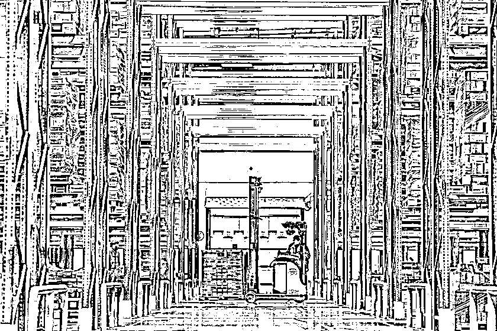

# 做 temu 跨境电商亏了 30 多万的经验分析以及跨境选品的 4 类推荐

> 原文：[`www.yuque.com/for_lazy/zhoubao/fww01474wvmhcvzc`](https://www.yuque.com/for_lazy/zhoubao/fww01474wvmhcvzc)

## (17 赞)做 temu 跨境电商亏了 30 多万的经验分析以及跨境选品的 4 类推荐

作者： 贾璐 无人直播电商

日期：2024-07-22

在做直播电商的同时，陆陆续续做了一年多的 temu 跨境电商，全托＋半托，亏了 30 多万，包含了冻结资金，罚款，唉，最近金盆洗手，不打算继续做了，唉，太难了。原因听我细细道来

首先说下有个大新闻：

佛山爱意家具，亚马逊美国床垫品类第二大卖家，molblly 品牌经营方，一年 gmv30 亿。

完全退出跨境电商业务！

为什么呢？

因为不合规被平台罚款 2000 万美元，大佬算了下账，觉得不值得，就关了。

是不是有点意外，年度 gmv30 亿人民币，罚款不过 1.5 亿人民币，占比 5%，按说应该玩的起才对？

2024，百业待兴，shein temu tiktok 天天开招商会，搞跨境，开法拉利，之前去听了几家平台的招商会，跟几位做不同领域的跨境电商的朋友深度交流了一下，都说跨境好，为什么大佬不玩了？到底能不能赚钱？

先报下数据：

2023 年，shein 在北美的 gmv 是 400 亿美元，temu 200 亿美元，tiktok 电商 200 亿美元，加一块 800 亿美元，大概 5500 亿人民币。

啥概念呢？拼多多 2023 年在中国的 gmv 是 3 万亿人民币，三家加一块，占拼多多 20%。

怎么说呢，还有较大的上升空间吧。

美国整体地广人稀，商业能量并不密集，购物和消费偏好在集中的商场或者超市一次性完成，这样使得很多小品类商品的需求不容易满足，这也是 ebay 电商的起点。早期，跨境服务的是小部分用户，可以直邮美国，售后成本低，除了物流没有额外成本，针对一些小众垂类做，流量稳定。

18 年后，随着 temu shen tk 的崛起，海外前置仓开始推动，前置仓只需要 3-5 天就能送到用户手里，比起中国直邮 20-30 天的物流效率显著提高，另外贸易战的原因，也在迫使平台在美国建立物流体系，更符合美国政府的要求；海外仓因为要考虑物流的效率和成本，在美国主要位于纽约和加州附近，土地成本并不低，仓库租金要高于中国；另外货物一旦发到海外仓，有任何包装、条码、标签方面的小问题，卖家都只能请海外仓帮忙，相关的人力成本激增。

因此，海外仓模式下，卖家的成本体系变得不一样了

直邮模式下，利润 = 销售收入 - 投流成本 - 采购成本，一件代发，不压货不占款，做多少赚多少，很适合小型个体创业者。

前置海外仓模式下，利润 = 销售收入 - 投流成本 - 采购成本 - 海外仓租金 - 海外仓基础服务费用 - 海外仓分解/打包/售后回收服务

这个结构，明确的不适合个体创业者，必须是公司化正规军才玩的转。

前置海外仓会带来多少额外成本呢

1.  租金，北美的前置仓，平均 0.7-1 美元每立方米每天
2.  入库服务，入库/装卸/商家/售后/移动，收费 0.6 美元每件
3.  库内商品处理，包括条码/密封/包装/打印等，0.5 美元每单
4.  出库费用，0.5 美元每单
5.  本地物流，从仓库发货到买家手里，8-12 美元每单

一个中型的跨境店铺，20 个 sku，每个 sku 250 件货，一共 5000 件货，每件货 1kg，一共 5 吨。设定这 5000 件货在 2 个月内销售了 90%，退货率 5%，总共需要大概 250 个立方的仓库。（这个速度已经很可观了，等于是每天每个 sku 能出 4 件，在亚马逊的头部店铺，大部分 sku 一个月做不到 100 件；当然也可以租个小一点的仓库每月发货省点钱，但是这样的话有很大风险出现一次活动导致没库存了，重新发货上架不及时导致流量没吃到）

以美甲器、卷发棒这类家用小型电器为例，美国电商销售单价 30 美元左右，中国采购成本 50 人民币左右，咋一算还不错：

销售收入：30 美元 X5000 X 85% = 12.8 万美元 = 90 万人民币

相关的物流和生产成本：

生产成本：500 X 10 X 50（采购单价+包装） = 25 万人民币

运往海外仓运费：8 人民币 X 5000 = 4 万人民币

海外仓租金每月：0.7 美元 X 250 X 30 = 5200 美元 = 4 万人民币，2 个月 8 万人民币

仓库入库及出库： 0.5 美元 X 4500 + 0.6 美元 X 250 + 0.6 美元 X 4500 = 5500 美元 = 4 万人民币

出库后发货到买家地址终端运费：8 美元 X 4500 单 = 3.6 万美元 = 28 万人民币

在最小的模式下，2 个月的周期里，生产和物流总成本达到了 70 万人民币左右，到手净利润能有多少？

销售收入：30 美元 X5000 X 85% = 12.8 万美元 = 90 万人民币

生产和物流成本：70 万人民币

平台抽成和广告：平均占 GMV 的 12%-18%，以 15%计算为 13 万

中国办公室和员工雇佣成本：雇 2 个人，租 40 平办公室， 每个月 1.8 万，2 个月 3.6 万

最终获利 3.4 万元，平均每个月 1.7 万，占 gmv 的 4%。

盈利非常脆弱，如果有任何税务、平台政策调整、大促、价格控制、保证金损失、商品规格/包装问题方面的状况，就会吞没利润，这也是为什么很多公司一旦遇到任何以上状况，就会赔本，只能清盘退出。

另外因为海外仓的固定租金成本，业务销售量需要稳定在一定规模，开工之后不能停，需要持续寻找热门商品，货物从中国工厂发出的后，一旦发生规格、包装、标签、图片不符合平台的规定的状况，要么直接丢弃商品，要么就只能付钱给海外仓，按件计价处理，上架、包装、分解成本会去到单件 1-2 美元，还会产生额外的设备和耗材成本，一般来说，尾货或者问题部分商品最多只能拿回生产成本，不会有任何利润。

通过这个计算，目的就是告诉大家，当一个中国卖家，把仓库开到美国，以美国的成本经营后，优势全无，处境艰难，完全是在给美国制造就业，而这正是贸易战的目的。

这也导致以前廉价小商品变得不可行，随着品类扩张和成本加大，只有能推动大 gmv，满足家庭生活场景的相对大件、大体量的的品类扩张，平台才能实现更大的 GMV，这也是招商会里，重点关注家具、汽车、装修、家电这类重投入的行业。

而这个场景下，跨境电商卖家将承受着北美的经营成本，与北美的百货公司和超市直接对抗，必须有过人的成本控制和营销能力才行。

再说下品类的机会：

北美地区不是没有工业能力，只是缺乏产业链，导致很多商品的生产成本过高；另外就是北美人工高，超市收银一个月都有 4 千美元收入，涉及到人工安装、生产、制造比例高的商品会特别贵，因此在人工含量高的品类下跨境电商优势会特别明显，结合需求和差价，以下的行业机会较大：

小家电-亲子家庭，母婴类

厨房类：料理机、辅食机、面包机、热水机

中国制造能把这个品类单品成本干到 50 块以内，而北美的零售价基本是直接换算成美元，利润可观，美国人的婚育率很稳定，每年有 150 万个新增家庭，市场规模确定，对母婴产品的需求稳定，业务长期看好

摩托车/汽车零配件

美国有 2.8 亿辆汽车，还有 1000 万辆摩托车，大部分是汽油车，车型多、零件多、非标，很多车型款式的零件在北美不生产，采购成本很高；另外北美修理工的工时费很高，想省钱就得自己鼓捣，零件只能走非官方渠道采购的，把中国汽配城的东西搬到电商网站上就能赚钱，利润可观退货率低。

数码产品

蓝牙耳机、随身音响、手机充电头，年轻人刚需，在美国，这些东西的指导价是苹果官方产品，一个耳机 150 美元，1 个充电头 50 美元，1 根数据线 20 美元，跨境产品优势巨大，安克一年在美国能卖 80 亿人民币，相关空间可想而知。

家具

主要也是针对年轻家庭的组合式家具产品，家具的机械化程度有效，人工成分高，这也导致在中国广东一张 1000 人民币的木质餐桌在美国能卖到 1000 美元，但是家具因为物流成本高，以往很少跨境卖家做，但家具更能承受前置仓的高成本，而且北美市场 diy 组装式家具很受欢迎，这种形式也能有效降低物流和仓储成本，保证一定的跨境优势，因此也成为了今年平台招商的重点方向

* * *

评论区：

悟参 : 说的都是美亚的玩法吧，shein temu tk 之类的仓储基本的都在珠三角地区
Max : 原因没有讲清楚啊

* * *