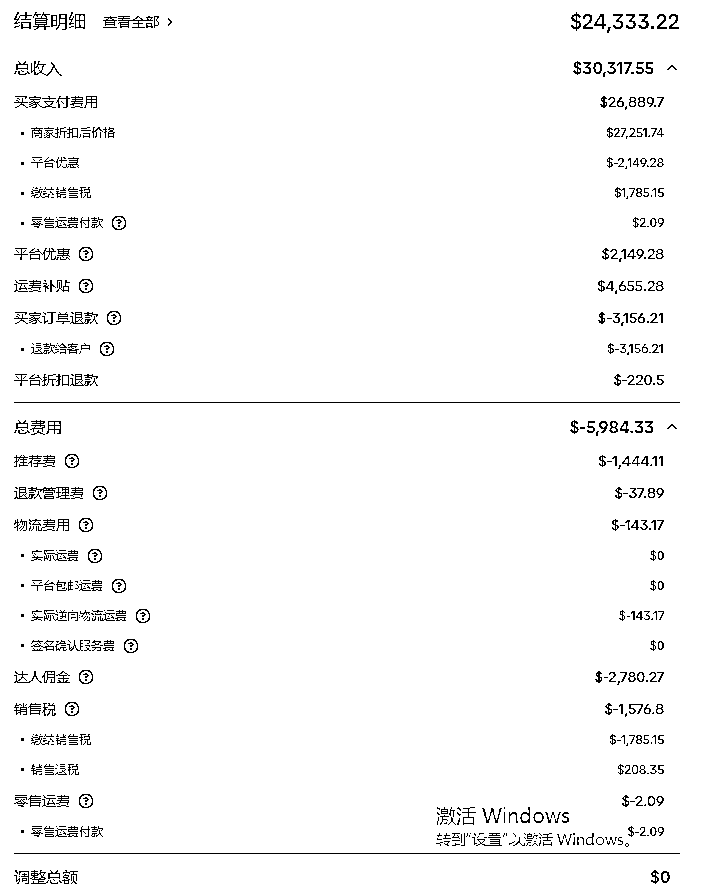

# 做美国 TIKTOK 本土店要缴多少税？亲测

> 原文：[`www.yuque.com/for_lazy/zhoubao/lmry7i417egu6hcv`](https://www.yuque.com/for_lazy/zhoubao/lmry7i417egu6hcv)

## (14 赞)做美国 TIKTOK 本土店要缴多少税？亲测

作者： 郑玉斌。

日期：2024-07-22

最近很多创业者从国内电商转 TIKTOK 美区本土店，所以很多朋友过来问美国公司如何纳税，以及在美国哪个州注册公司比较好，和大家分享下。（背景：我投的一家电商公司目前暂居美区 TK 某品类第一。TK 代理商说我司每天的投流费占全美 TK 投流总量的 200 分之一，此数据未经验证。）

正文:

现在 TK 分为本土店和跨境店，我主要讲下美国本土店，很多创业者会在美国找个朋友注册美国公司，然后用美国公司注册 TK，说是本土店会有流量倾斜，但是我们还没去验证，目前我们的店铺都是美国本土店，没有跨境店。

一：美国公司主要的三个税率和税点：

1.联邦所得税，21%，（之前是 35%，现在降低了），可以理解成国内的企业所得税，按照你公司的净利润去缴纳。

2.州和地方政府税：美国是联邦制，所以每个州还有自己的税收政策，并且每个州的税还不一样，也是按照企业净利润去缴纳。我们公司是注册在 Arizona，州税是 4.9%。（美国有六个州免征州税，分别为：内华达州、华盛顿州、 德克萨斯州、怀俄明州、俄亥俄州、南达科他州。）

3.销售税：公司销售产品或提供服务，需要缴纳销售税，可以理解成国内的增值税，销售税率每个州也是不一样，我们公司所在地 Arizona 的销售税是 8.38%。（5 个州免消费税：阿拉斯加州，特拉华州，新罕布夏州，蒙大拿州，俄勒冈州）

备注：现多数美国电商平台如亚马逊，TK 等，均已开通销售税代扣代缴功能，企业不必再自行申报销售税，这样会方便很多，不然销售税算起来很麻烦。。销售税还会肯定发货地，收货地不同，还会有差异。

4.除此之外，还有以下几个税，如果你不在美国雇佣员工，可以不用看。

雇主税：这些税款包括社会保险税和医疗保险税，雇主需要向联邦政府和州政府缴纳这些税款；

财产税：公司需要为拥有的房地产、设备等财物缴纳财产税；

资产税：由于美国各个州可以独立制定资产税的征收政策，所以各个州所征收的资产税也不相同；

其它税种：根据公司所在地的特定要求，可能还需要缴纳其它类型的税款，如职业税、许可证税等。

二：不要“买单出口”

很多商家为了简便，都是直接让物流公司帮忙出口，自己不去报关。

“买单出口”是一种为众多卖家所熟知的操作方式，它指的是当出口方没有出口权，或不想使用自己公司抬头名称的出口单证时，通过购买其他有出口权公司的出口单证（包括发票、装箱单、报关委托书、核销单和特殊证书等文件），以该公司的名义进行进出口贸易的报关操作。

简单来说，就是借用他人的公司名称和出口单证来完成报关手续。

但“买单出口”实际上并不合规，且有极大的概率会引发偷逃税、逃证、非法进行外汇交易等不法事件。

大多数商家出口的商品都是免税的，如果票据齐全还能享受退税，最近“买单出口”被抓补税的特别多，而且跨越周期很长。本来你不用交税，现在“买单出口”，通过万里汇等第三方软件回来的款就解释不清楚了，到时候还要补税~

三：什么时候申报美国公司税务？

今年报税起始日期:1 月 29 日;

纳税申报截止日期:4 月 15 日是所有联邦纳税申报单和缴清税款的重要截止日期;

延期截止日期:最晚可延期至 2024 年 10 月 15 日前申报，但需要在 4 月 15 日前递交延期申请;

* * *

我是郑玉斌，幸会。10 年财税创业者，擅长国内外电商公司税务合规和筹划，多家年收入 10 亿以上电商公司顾问，同时也投资了多家细分赛道第一的电商带货公司。

* * *

评论区：

郑玉斌。 : 有 TK 创业者欢迎交流~
林林 AIGC 写作 : 感谢生财裴勇俊的分享[强][强][强]
郑玉斌。 : 哈哈哈哈我还去百度了下

* * *