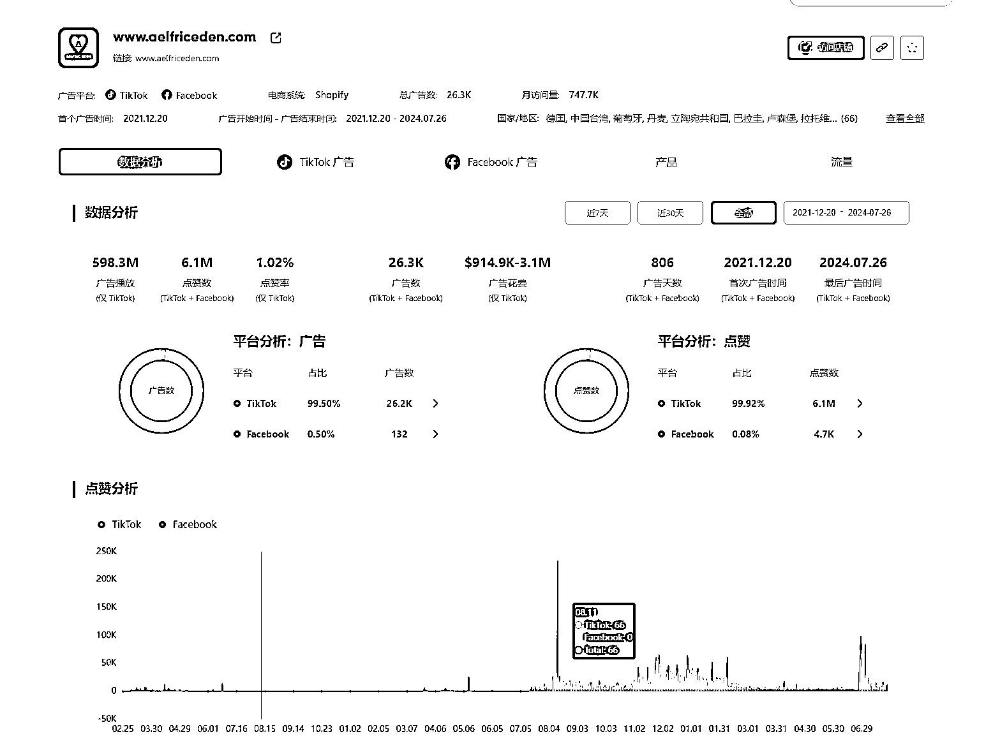
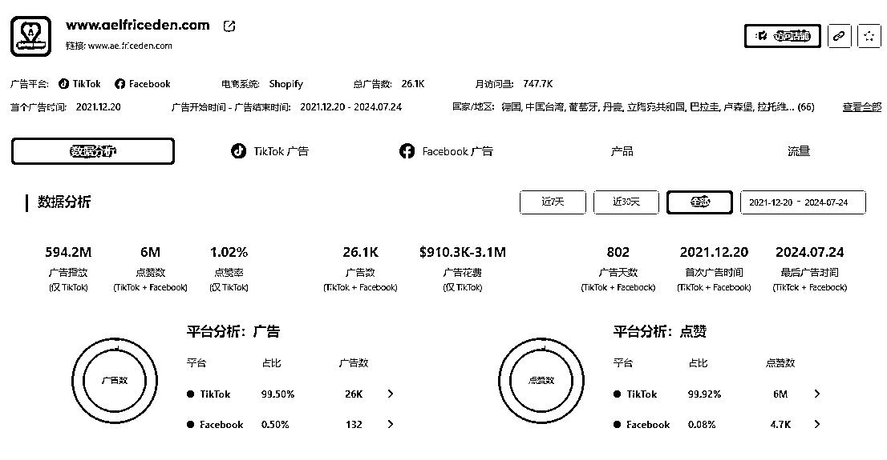
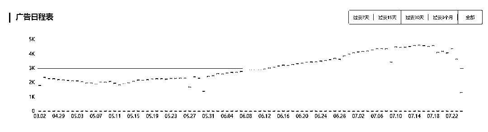
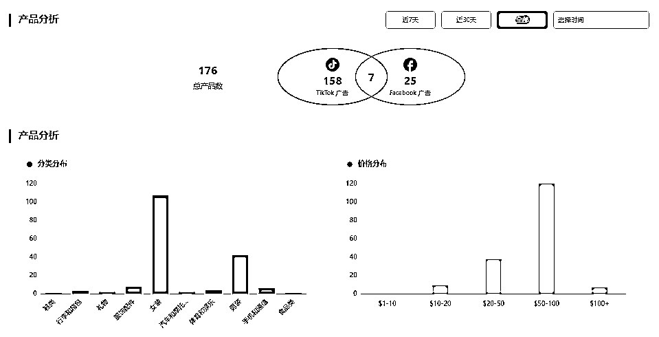

# 出海营销案例：TikTok 社媒九亿热度背后的成功：Aelfric Eden 如何用街头文化征服全球

> 原文：[`www.yuque.com/for_lazy/zhoubao/zo5gyff2te6zu8kg`](https://www.yuque.com/for_lazy/zhoubao/zo5gyff2te6zu8kg)

## (3 赞)出海营销案例：TikTok 社媒九亿热度背后的成功：Aelfric Eden 如何用街头文化征服全球

作者： 梁小伟

日期：2024-07-26

通过 pipiads 大数据检测到广告主**aelfriceden 多平台广告营销累计曝光近十亿，如此大的曝光时间竟然不到一年，**让我们一起来看看该品牌究竟是怎么做到的。

广告主链接：[`www.pipiads.com/zh/advertiser-analysis/62184b819a301ef93d2475db/`](https://www.pipiads.com/zh/advertiser-analysis/62184b819a301ef93d2475db)

街头时尚：全球潮流的新兴力量

街头时尚，作为一种源自城市街头的时尚文化，近年来正以其强烈的自发性、多样性和实用性，迅速崛起并影响着全球的时尚趋势。街头时尚文化日益受到欧美年轻人喜爱，相关产品和市场也在不断被开发。在这个产品迭代速率不断加快、品牌生命周期愈发短暂的赛道上，新兴品牌 Aelfric Eden，凭借 TikTok 上的多元营销手段，成功实现了逆势突围，成为 Z 世代新宠。

#### 品牌介绍

Aelfric Eden 品牌由一位亚裔美国人创立，融合了东西方文化的影响，致力于将亚洲街头时尚和西方风格结合在一起，形成独特的时尚表达方式。创始人希望通过这种文化融合，打破次文化与主流文化之间的界限，创造出具有包容性和多样性的时尚产品。

Aelfric Eden 的产品包括印花卫衣、图案 T 恤、夹克和各种配饰等，注重融合滑板、涂鸦、网球等多种街头元素，以设计新颖、时尚的产品吸引了大量年轻消费者。其品牌理念是将不同文化的小众街头元素发展为主流时尚，完美契合了 Z 世代的多样性和包容性价值观。设计风格大胆、色彩鲜艳，深受全球年轻人的喜爱

据 PIPIADS 数据显示 Aelfric Eden

广告开始时间:2023.08.17-2024.07.23

广告播放:**594.2M**

广告数：**26.1k**

广告天数：**802**

pipiads 上线了新功能可查看 tiktok 和 facebook 两个平台的投流情况更全面的分析广告数据

可以看出品牌推广主要侧重在 tiktok 平台

观察广告日程表 品牌推广力度较大

总产品数：176

查看 tiktok 广告素材 共计 24.8M 播放

视频在短时间内展示了多个场景或产品，能够在有限时间内提供丰富的信息。

场景的快速变化不仅增加了视频的趣味性，还能有效保持观众的注意力。

暂时无法在飞书文档外展示此内容

大家观看视频创意可移步到文档 [`z8qt74rchp.feishu.cn/wiki/FGWZwdO9IizJAYkQdSqczCNcnxi?from=from_copylink`](https://z8qt74rchp.feishu.cn/wiki/FGWZwdO9IizJAYkQdSqczCNcnxi?from=from_copylink)

* * *

评论区：

暂无评论

* * *