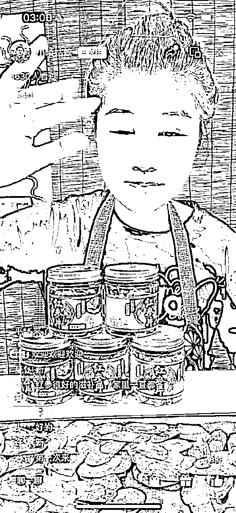
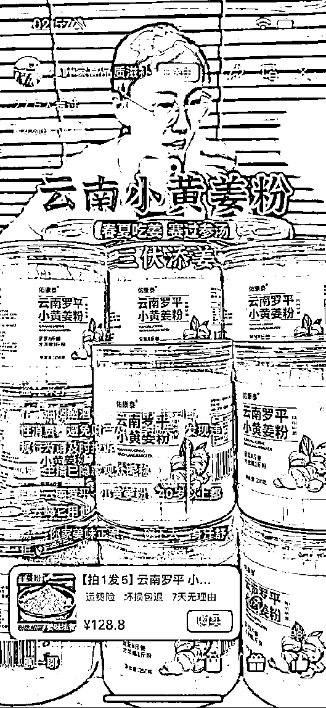
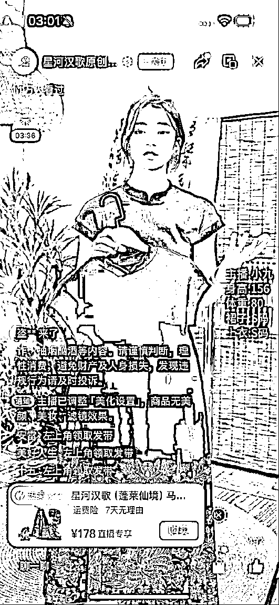
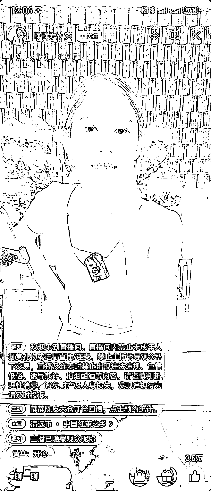
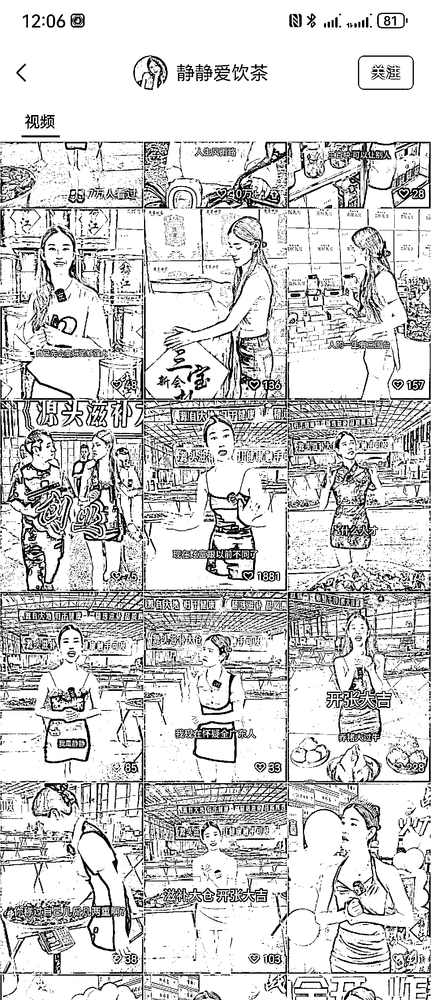
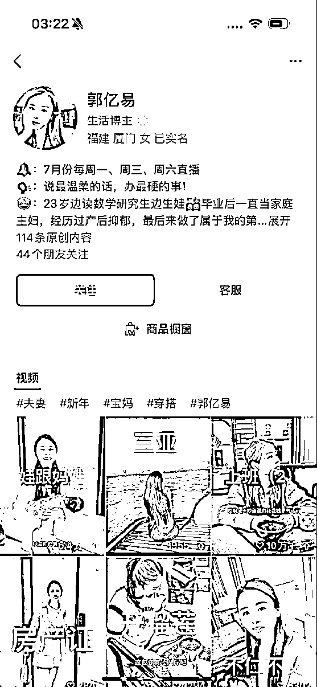
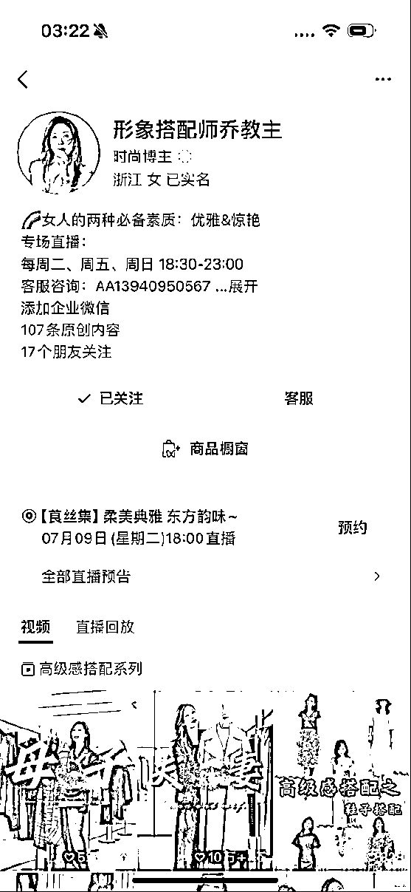
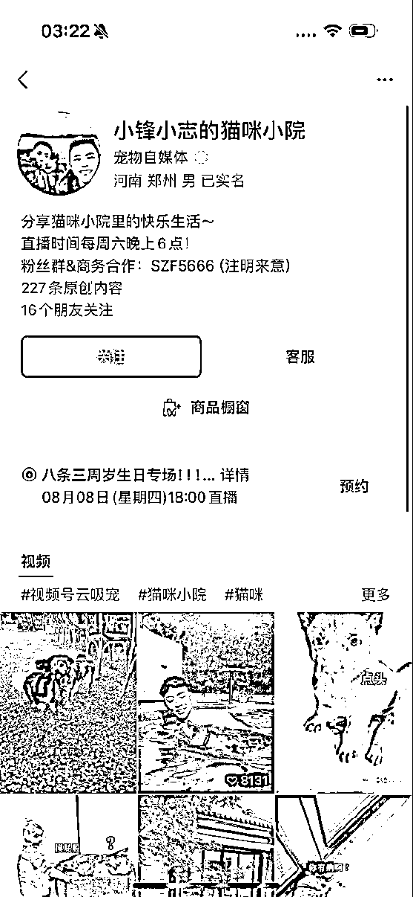

# 视频号现状与玩法解析：竞争小、天花板低、利润可观

> 原文：[`www.yuque.com/for_lazy/zhoubao/gqautdxfsgtz2ytg`](https://www.yuque.com/for_lazy/zhoubao/gqautdxfsgtz2ytg)

## (176 赞)视频号现状与玩法解析：竞争小、天花板低、利润可观

作者： 盗坤

日期：2024-07-25

#### 大家好，我是盗坤，一家电商 MCN 公司的老板。

#### 从 2022 年年初就开始进入视频号，经历过视频号的搬运混剪、无人直播、挂车投流、半无人直播、直播 IP、直播打品等等各种周期，所以对视频号有些许了解。

#### 那么时至今日，视频号究竟还能不能做？有哪些玩法？今天，我就班门弄斧，用一篇文章系统性给大家讲全、讲透、讲明白视频号的“今天”以及“明天”。

#### 整体而言，现在的视频号确实比抖音竞争要小很多，但是相应地天花板也要低很多。所以，当下的视频号很难做规模，却容易做出利润。

#### 而整个视频号的主流玩法其实也要落后抖音很多年，都是抖音历史的再现而已，而这些玩法的终局也将重复抖音的老路。

#### 接下来，我将对视频号目前主流的一些玩法给大家做一个总结。

### **一、短视频获取流量，视频爆了直播转化**

2022 年三月份，我最开始切入视频号的时候，就是用的这种模式。那时候用的是纯搬运模式，把抖音的短视频搬运到视频号，视频爆了再去用极其简陋的场景直播转化。

而且当时视频号电商刚刚兴起，做的人还不多。于是我很快提出：**不要搞什么混剪，直接搬运！！**该过还是能过，不能过，你混剪了还是不容易过。也是我在做的过程中旗帜鲜明地提出：**红海平台搞蓝海类目，蓝海平台搞红海类目！！**

所以当时我很多学员都是不混剪，直接搬运，也不做啥蓝海类目，冷门产品，直接往女装，鞋子这些红海类目里扎。当时我们真的可以算是最开始玩视频号的一批人，很多人也都赚到了钱。

而随着对手的增加，竞争加剧，这种搬运混剪短视频的模式起号变的越来越难，处罚也越来越严。但是通过短视频获取流量，直播间转化的模式，经过迭代，现在依然存在。

#### **1、混剪视频**

搬运混剪依然存在，只是需要去挑选一些蓝海冷门的产品和素材了，在创作上也需要更加精细化的剪辑，才能通过平台查重审核。

现在这种模式依然有人在做，也依然有人能赚到钱。但是主要是集中于一些小类目、小产品，天花板有限。而一些大类目的搬运混剪则是面临不断废号的状况（并不是账号被封号，而是被限流了，没有流量）。

#### **2、真人口播+混剪素材**

这是视频号当下比较火的一种模式，其实也都是走的抖音的老路。抖音之前也有一种短视频模式，不需要样品，不需要复杂的场景，拍摄剪辑也都很简单，一镜到底，只需要真人口播文案即可，或者在原创口播视频基础上搭配一些混剪的产品素材。

伴随着纯搬运混剪的稽查变严，那些并不具备优质原创短视频内容能力的商家，就开始注意到这种低成本低门槛的短视频创作模式了。而又因为视频号的内容确实并不丰富，所以和当年抖音一样，这类视频依然有一定的生存空间。

这类短视频的内容并不算优质，达人表现力也并不强，能够爆的核心一般都是那种夸张性文案，说难听点，有点智商税的味道。有些视频，甚至我都觉得算骗的地步了。也是因为如此，平台对这类账号处罚很快，账号一般也就活几天。

当然，也有符合平台规则的脚本，那就需要真正打磨内容质量，从达人本身、场景脚本各方面细节去优化了。这就需要一定专业的团队了。

#### **3、IP 切片**

#### 干的依然是混剪的活，不过是可以得到平台认可的混剪形式。

诸如小杨哥切片、郝劭文的切片。把一些爆款 IP 的直播素材或者短视频素材，进行二次创作，然后发布至视频号平台。如果视频爆了，系统会弹出人脸识别系统，要求视频里人物的资料审核，否则就会被判定违规，进而限流。但是如果有 IP 授权，拿到认证资料，就可以通过审核。

所以 IP 切片的核心第一是要 IP 本人的授权，第二就是剪辑要精细化，避免同质化。

这个模式是可以长期做的，但是要想能赚到钱，还是需要有一些优质的 IP 资源。太大的 IP，能够拿到授权，比如小杨哥的，但是剪辑的人很多很多，要想脱颖而出，对你的内容能力要求很高，或者是你的组织能力很强（能够组织很多人来剪辑），否则很难起号。而太小的 IP，本身就没啥量，内容不算特别优质，你怎么剪都没用。

#### **4、原创素材**

#### 真的靠选品、脚本、拍剪本身，做出优质的短视频素材，然后围绕这个爆款脚本，反复拍摄，把这个产品，这个素材的流量做到极致。

这个模式就不用太多介绍了，回到内容电商最基础的东西了，团队本身的运营能力。

### **二、短视频挂车投流**

### 这也是视频号非常古老的玩法了，短视频挂车直接成交，然后再通过微信豆投流的方式获取流量。

### 这其实也是 19 年抖音的豆荚玩法，短视频挂车，然后直接豆荚投放。因为竞争不大，管理不严，一时间很多违规产品、违规内容，在夸张的毛利率、转化率之下，还是有许多人赚到了钱。

而视频号也重现了这一情况，在 2022 年的时候，还是有一大批人利用短视频挂车投流的玩法赚到了一些钱。但是随着入局玩家变多，平台政策趋严，现在留给违规产品、违规内容的空间越来越小。所以那种完全依靠混剪，并且夸张的宣传方式账号，废号越来越严重。

但是正如搬运混剪一样，剿是剿不完，剿不干净的。虽然净利润率下滑，依然还是有一些人，在一些细分类目，细分产品，细分内容下，通过混剪短视频，然后挂车投微信豆的方式生存。

当然，如上一个玩法“短视频获取流量，直播间转化”一样，也有一些人自己做起了符合平台规则的原创内容，也是需要选品、脚本、达人一整套，这里我就不过多赘述。

这里我还要介绍下微信豆和 ADQ 的区别。微信豆和 adq 的区别，**微信豆是视频号部门的投放工具**，投放场景都是视频号站内，也都是视频号站内用户，用户画像相对清晰，**所以流量相对精准**。而**adq 是腾讯广告部门的投放工具**，投放场景除了视频号以外，还涉及朋友圈、公众号、小程序等渠道，**所以流量相对泛一些**。

视频号挂车投流最初的打法就是纯微信豆投放，但是微信豆投放很难放量，所以也有一些商家在微信豆基础上，还增加了 adq 投放。但是这也就意味着他们产品的毛利润要求更高，短视频素材要求更高，所以一般都是一些超级智商税产品。

这种打法需要的是一些有一定电商经验、团队壁垒、资金壁垒，一般小卖家不用尝试。

### **三、微信豆直播打品**

你会在视频号直播广场发现许多那种场景简陋、主播普通、话术简单、产品单一，整场直播就是主播在那坐播，一直循环产品话术的直播间。这类直播间就是靠微信豆付费打品的直播间。

这种直播间在抖音想要生存是很难的，但是在视频号还是有一席之地。它的核心就是产品，整个运营动作的核心就是用最低成本、最高效率测出爆款产品。

这种模式相较于搬运混剪短视频、口播短视频难度要大一些，但相较于传统直播间，难度依然算很小很小的了。就算是一个人也是可以做这种项目的。

租一个民房，搭一个直播间，自己选品、整理话术，然后请兼职主播来播。测出一个相对水平还算过关的主播以后，就开始围绕主播不断测品了。

不用拍短视频，就是直接微信豆付费投放，直投直播间，一旦 ROI 能持平或者略微盈利，那么就可以围绕这个产品对话术、主播做优化，然后微信豆通投拉满。这种模式只能用微信豆投放，ADQ 的人群太泛了，这种水平的直播间是根本无法转化泛人群的，所以很难盈利。

成功的核心就是产品，滋补护肤是这类打法的主要目标类目。不过这个模式成功的核心是靠产品，而产品是有周期的，所以这样的打品团队只能不断测品。

当然，如果是做了一定时间的打品团队，还有一定的管理经验。通过不断地筛选，他可以积累出来一批质量还不错的主播，优质的主播又可以去承接一些相对而言竞争更大，周期更长的的产品，也就算有一定的壁垒了。有了周期比较长的产品，还有了比较优质的主播，团队就可以考虑开始叠加短视频素材，以及导流私域。

### **四、自然流直播 IP**

类似我们的茶叶直播间，完全没有短视频，不依靠短视频流量，或者只有小部分短视频流量，直播间流量结构也是纯免费流或者微付费。

相较于上一类打品直播间，这类直播间一般卖的产品都就比较多元化了，而且直播间的打造也比较优质。场景是精心打造，主播的个人形象是经过设计的，主播个人的观众缘极强，表达能力极强，从而获得用户信任，成交用户。

这类直播间的核心就是主播本人，如果说上面一个打法的核心是测品，这个打法的核心就是筛选主播。其实场景、文案、排品都是可以模仿的，唯独主播本人的形象气质，表达能力是无法模仿的。所以这类打法，我们称之为 IP 打法。

这类打法的门槛就比较高了，主播是需要在培养中筛选的，这就需要有一定的团队和流程来承接主播，筛选主播也是有时间的，这就把试错成本给大大提高了。但是相应地，这种打法的门槛高了，那么壁垒也就更高了，同行很难模仿，直播间的生命周期也更长。

### **五、付费流直播 IP**

相较于刚刚的自然流直播 IP，还有一类直播间也很侧重主播的筛选，主播个人能力要求极强，但是这类直播间的主要流量结构则是依靠付费了，而且是微信豆+adq。

自然流的主播虽然流量成本低，但是天花板不高，即使叠加了微信豆，整个量还是不够大。这个时候，就有人开始叠加 adq 了。

但是我前面说了，adq 的人群很泛，要想转化这些泛流量，依靠泛流量就能赚钱。这时候直播间产品的毛利润要足够高，直播间的转化能力要求极强，这就要求我们主播的能力要很强，还需要搭配副播、场控等，并且还需要具备打造优质短视频素材的能力。如此，才能在 adq 放量的情况下，还可以保证盈利。

这类直播间的难度极大，试错成本极高，对团队要求极高。从资金实力，供应链能力，内容能力，到投放能力，这些都是需要时间，也需要交学费去成长的。

这类直播间，不适合小团队尝试，对于完全没有经验的团队来说，先准备 100 万的试错成本是非常正常的事情。

### **六、人设 IP**

这是最香的打法，也是门槛最高的打法，对达人要求极高，对内容能力要求极高，那就是人设 IP。

不管是垂类 IP，还是泛生活的剧情类 IP，核心的都是通过优质的短视频内容来打造一个鲜活的人设取得粉丝信任，然后再依靠直播间来做转化。

这类打法，靠钱是砸不出来的，需要一个真正懂内容，有内容基因的团队，在遇到一个有观众缘，表现力极强还具备卖货能力的达人。一旦孵化出来一个这种 IP，生命周期极长，利润率极高。

### **七、视频号小店**

在 2022 到 2023 年的时候，视频号小店还给了一些小商家，小团队生存空间，甚至仅仅只是依靠无货源都可以赚到钱。因为那个时候的视频号后端极其不丰富，没有那么多商家入驻。但是随着视频号的不断发展，入驻的商家越来越多，视频号小店后端的竞争进入白刃战阶段。

拼的就是谁的供应链更有优势，谁的成本更有优势。人家给达人的佣金比你更高，还可以赚钱，你如果去跟那就只能保本或者微亏。而除了基本的供应链优势以外，人家更是在商务团队，客服团队，服务团队的全方位秒杀。

一句话概括：市场红利已经褪去，真正有实力的厂家入局了

所以，那些还在苟延残喘的小卖家，尤其是那些无货源卖家，听我一句劝。佛系运营，直到完全没有利润的那天就解散，赶紧寻找第二增长曲线吧。卡搜索也好，卡排名也好，联系达人也好，在绝对的实力面前，都没有啥意义了。

### **八、总结**

视频号的发展就是抖音历史的重演，抖音的今天就是视频号的明天，做后端的最终还是要回归到供应链上去，做前端的还是要回归到内容上面去（不管是短视频还是直播间），留给我们普通人打游击的机会越来越少。

所以，对于没有资金，没有实力的小商家，小团队来说，仍然可以乘着红利还未完全褪去，可以去做一些搬运混剪、微信豆直播打品等模式。但是在打游击的同时，应时刻谨记广积粮，高筑墙，把赚来的利润花在团队升级、内容升级的刀刃上，做好迎接市场进入充分竞争那一天的到来。

否则，潮水褪去那一天，你还在裸奔，只有面临被市场淘汰的命运。然后往下一个平台去打游击，继续做低水平的重复建设。

* * *

评论区：

刘 Leo : 有用
慧犀 Christin* : 谢谢盗坤老师分享。言辞中肯。[玫瑰][玫瑰][玫瑰]
凯文 : 分享的很合理[强]
微风 : 手动点赞，值得反复观看 👍 π : 受益匪浅
刘飞 : [强][强][强]
南淮 : 感谢分享
Dreamland : 跟坤哥一起进步[偷笑]

* * *