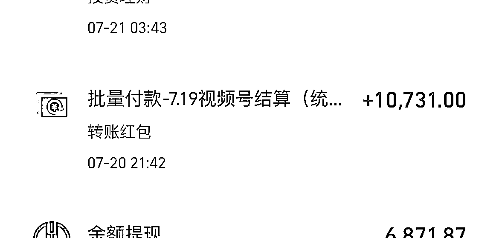
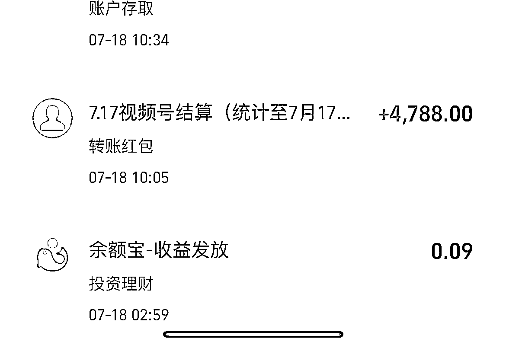
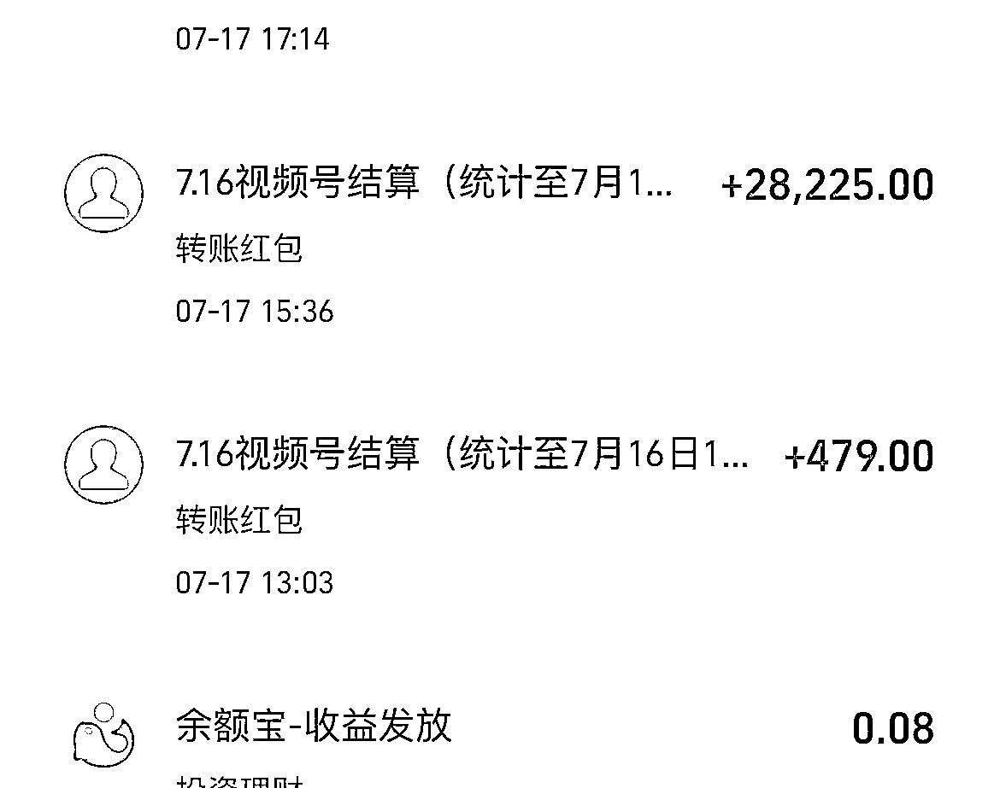
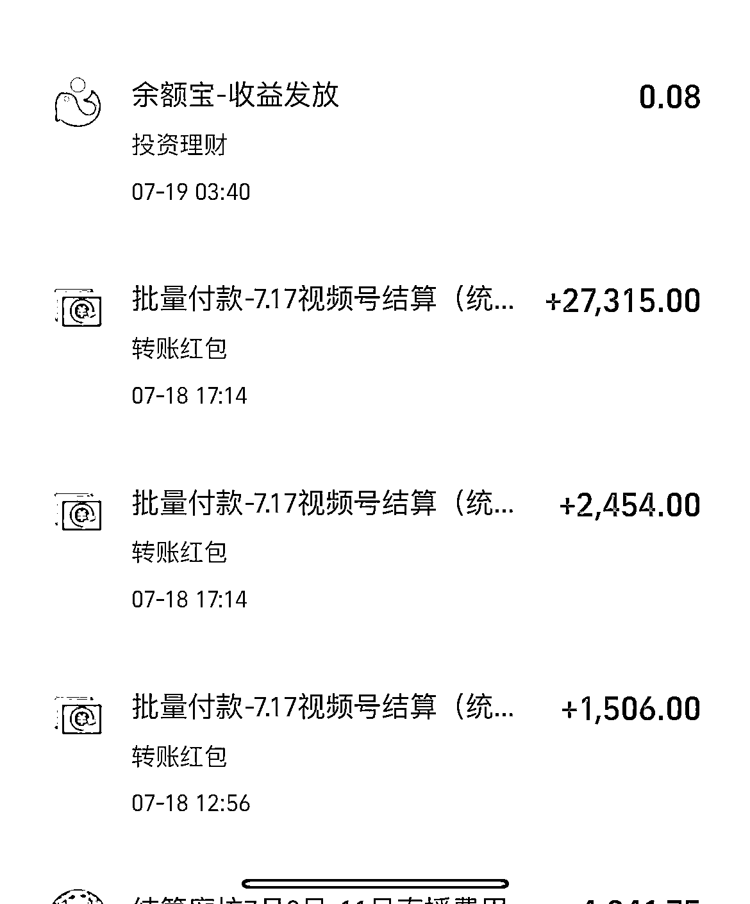
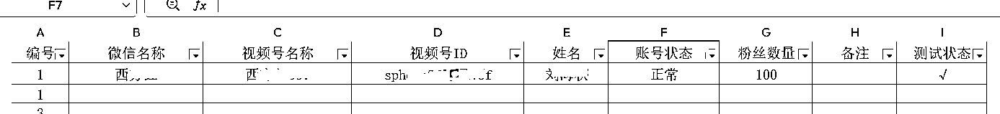
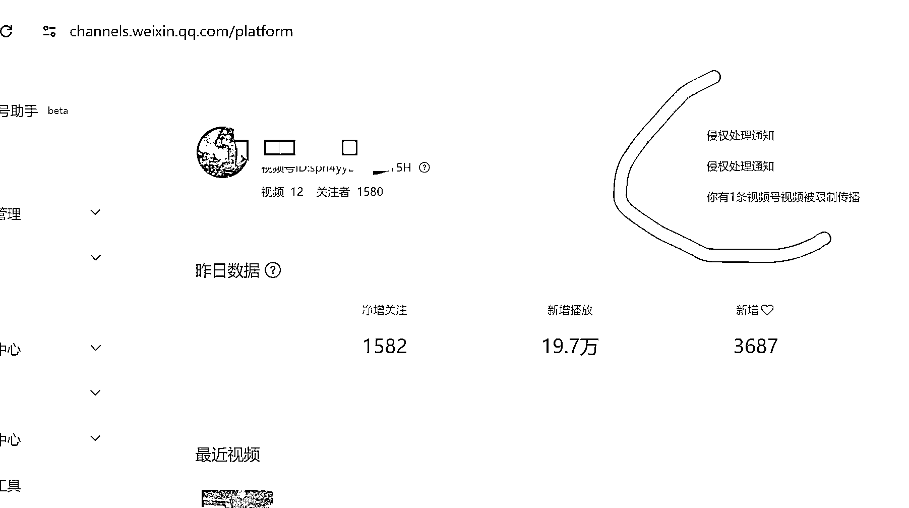
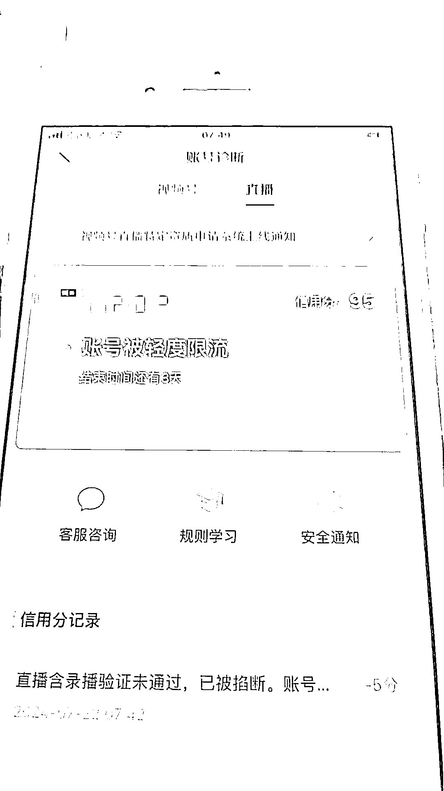
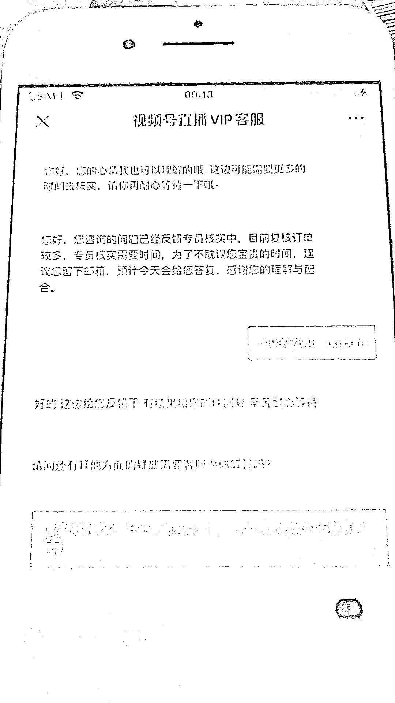

# 视频号口播日更 10 天，变现 20w 的复盘

> 原文：[`www.yuque.com/for_lazy/zhoubao/era3nsbx6y61w8fg`](https://www.yuque.com/for_lazy/zhoubao/era3nsbx6y61w8fg)

## (23 赞)视频号口播日更 10 天，变现 20w 的复盘

作者： 瀚水长流

日期：2024-07-25

大家好，我是瀚水长流，视频号这个赛道，我是从 6 月底开始正式自己实操的，经过几天的准备，从 7 月 11 日开始正式打品。废话不多说，下面是最近的到账数据：

我自己做的是百货赛道，百货赛道现在违规率比之前高了，但收益还是香的，所以我准备了 10 个号去打百货矩阵，目前看来效果还是不错的。

接下来我就跟大家分享，我从开始到现在都做什么了、怎么做的，以及遇到过什么坑、应该如何避免：

## 一、新手如何做账号管理

新开的账号最好是用表格记录下来，包括：微信号、视频号、视频号 ID 等，以后账号多起来不会手忙脚乱，也方便自己整理账号。

刚开始就要养成一个好习惯，不要觉得开始没必要。等一个账号做好，想要复制的时候，会有几个或者十几个账号一起跑，手机多了以后，整理账号会很方便，还有后面做垂直，一目了然。

## 二、口播抠像快速爆单经验

**先跟大家分享一下我 7 月 11 日开始打品的经历：**

一开始选了一个品（马桶清洁剂），但是心里又有点没底，于是我开始刷广场，看到这个品有 2 个爆的，我就比较坚定了，他们能爆，我为啥不行？

然后果断拿素材剪视频（我们是有一个大团队在一起打品，有专门录素材的作者，大家信息也会共享，视频就不太方便分享出来了）。

素材是晚上 6 点多发出去的，前 2 个小时很忐忑，一直在看视频的流量，9 点多有个号播放量过 5000 的时候，橱窗开始出单了，果断开直播转化。

第一天一共发了 5 个号，有 3 个号都爆了，但当时没有当回事（非常后悔），就只开播了 1 个号，销售 13000 多，后面流量跑的慢了，播到播不动就直接下播了。当时应该第二天继续补上视频，继续拉直播时长。

第二天没有停，换了个品继续打，播放量到 5000、点赞一分钟 10＋个就开播，从下午 3 点播到晚上 9 点多，直播间同时在线人数 600 多人，而且大部分都是通过短视频引流进来的精准流量，当时预测这个号最少打出来十几万，结果！！！犯了一个天大的错误：

用了别人的原创素材，忘了报备，结果被作者投诉侵权，当时的心情已经不能用人类的语言可以形容了，号也直接没了。是一个非常惨痛的教训，后续不可能再有这种低级错误了。

**结合以上经历，我总结了几个经验分享一下：**

**第一、素材数量一定要达标**

这个是最基础的，我 10 个账号，每个账号每天发 3 条作品。另外还要多准备一些视频，因为你开直播的时候，如果 5 分钟进人低于 20 人就需要补视频。

在我看来，短视频拍摄和剪辑没有太多技巧，要靠大量练习，一边拍一边总结。

**第二、执行力一定要拉满**

自己看好的品一定要及时的跟进，哪怕你觉得当时不太适合，不去打这个品，也一定要自己及时的关注广场里这个品有没有其他人再打。

如果广场里打这个品的人少或者刷了几个效果都一般，可以再考虑其他品，如果刷到好几个都在爆，这个时候就不要自己瞎考虑了，抓紧跟着冲一波再说。

另外，爆了的号，一定要及时开直播，不要像我一样，爆了 3 个号，只开播 1 个号。

**第三、低级错误千万避免**

发作品前先做这 3 件事：

1.  看账号状态是不是正常的，加热是不是正常
2.  测试发起直播，看是不是需要刷人脸，一般新号都会经历 3-4 次的刷脸开播认证
3.  如果用了别人的素材，一定要提前报备给人家
4.  开播之前先准备点随手拍的视频，万一账号被限流，可以及时的申诉回来

注意：如果你的账号比较少的话，不要发高危的文案。

**第四、不要内耗，对自己有信心**

既然决定进这个赛道了，自己纠结犹豫不决的时候，就别再瞎想犹豫不决了，你的前辈们比你经验多的是，他们都在冲，你就跟着冲就完事了，成不成的先放一边，做买卖啊，谁都不敢给你保证做了就肯定成。

## 三、项目怎么及时放大

我放大项目的玩法是这样的：

先用 3-5 个号测试一下素材，如果爆了，并且违规率不高，那就可以把素材搬到你的所有账号上，通过去重剪辑来发这个作品，爆了之后及时开播，人手不够可以找代播。

有了前车之鉴，现在我选好品以后，会以第一时间先去报备，直播转化也很迅速，这次素材一共上了 10 个号，10 个爆了 6 个，我跟朋友一人播一个，其余 4 个交给代播，连着 2 天打出了 7w＋GMV。

播到后面，有 2-3 个号的流量时不时地停，但没关系，只要一直在出单，够支撑代播的费用，就不要停，很有可能拉着时长还会继续爆。

还真就是这么个情况：

当时流量最好的号，到第三天的时候基本就不怎么跑了，反而是之前感觉一般的号，开始后发力了，当时是视频播放量 80 多万，当天销售是 18000 多，24 小时到了被强制下播，需要继续重开。

**但接下来又踩到了 2 个坑：**

1.  重开直播的时候，那会儿凌晨两点多，显示需要扫人脸，我用的是别人的账号，当时打电话打不通，距离 300 多公里赶过去也过了时间。只能等第二天刷脸，还好没太耽误事，正常开播。所以新号一定要试着开播，看看要不要刷脸！
2.  正当心情美丽，重开播了不到一小时的时候，直播间弹窗，系统给我误判成录播了，账号限流三天，申诉等审核等了 3 天。所以大家注意：大爆的直播间，尤其是早上 7 点-9 点会有审核，看见弹窗第一时间给回应，看不见就会跟我一样被限流 3 天。

## 四、总结

总的来说，视频号口播带货这个项目，我能分享的更多是踩坑经验吧，至于怎么拍视频，还是建议大家多研读航海手册，不断练习、拉片打磨，保证素材产出数量，不要偷懒。（因为我用的是别人的素材，容易违规被举报，所以不建议大家模仿了）

再者就是一定要多向大佬提问！我刚开始上手的时候，感觉哪里都是困难：素材不会找，账号不会整理，剪辑也不太精。担心那些大佬会对新手爱答不理，后面遇到问题没办法，只能硬着头皮问，就发现大佬们还是相当热情的在帮我解决问题。

希望接下来，能跟大家一起，多多交流！

* * *

评论区：

源（📷定金留档，靠谱* : 怎么给原作者报备 ne
希平 : 写的很好，感谢分享，特别是测品那里
华子树 : 坑就是宝贵的经验，感谢分享！

* * *