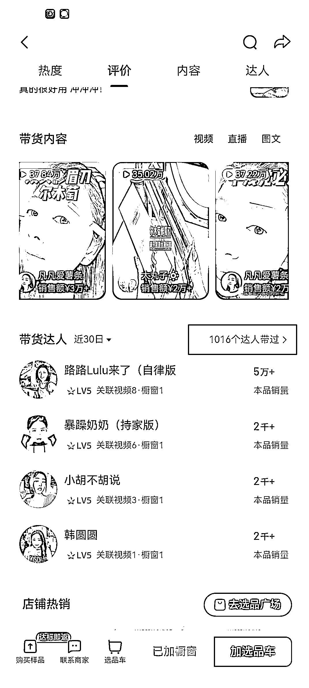

# 素人短视频带货项目复盘与策略分析

> 原文：[`www.yuque.com/for_lazy/zhoubao/xzp2wmq1pa1kxbow`](https://www.yuque.com/for_lazy/zhoubao/xzp2wmq1pa1kxbow)

## (精华帖)(180 赞)素人短视频带货项目复盘与策略分析

作者： 盗坤

日期：2024-07-25

许久没提视频号，结果有人问到，原想四两拨千斤的几句话就结束，没成想又是洋洋洒洒几千字：[`t.zsxq.com/gKdzU`](https://t.zsxq.com/gKdzU)

末了，意犹未尽。走过的许多弯路，犯过的许多错误，取得的一些结果，种种经历，总想着能再多说一些给你们。所以，乘着灵感还在，趁热打铁，笔耕不缀，接上篇的分享，再给大家复盘一下我们最近正在做的素人短视频带货项目。

通过上篇的分享《视频号七种主流赚钱打法总结》，大家应该不难看出，拉长周期看，还是符合平台规则，有内容壁垒的模式可以走得更远，天花板更高。尤其是最后说的那种人设型 IP,是一个投产比极高的项目。

有多高呢？以下面这个抖音账号扯靶子为例，这是我们公司之前的一个签约达人，从零开始孵化的，虽然去年年底和他的合约已经到期了，但是三年时间他还是给公司创造了极其丰厚的利润。

他在加入我们公司之前也是一个纯素人，职业是健身教练，从来没有做过自媒体相关的工作，我们也并不敢相信他可以有今天的成就。他现在的收入，具体数字就不说了。只给大家随便截屏一下他的一场直播 pk 数据，27 万音浪等同于 2.7 万人民币，平台扣除 50%以后，还有 1.35 万的收入。

而他流量好的时候，可以有五万在线人数。你们可以想象一下，他一天的收入是多少，一个月的收入是多少。可以这么说，他一个人创造的利润，轻松秒杀那种几十上百人公司的利润。

所以，自媒体与行业，有时候真的不要太早急于自我否定，自我设限。做小事和做大事的难度其实差不多的，扯靶子做搬运混剪和做个人 IP，对他来说要花费的时间和精力都是一样的，但结果却是完全不同的。

除了这种娱乐 IP 以外，我们也孵化过一些电商 IP，而且有些电商 IP 的变现能力并不比他差，这里我们就不一一赘述。但是正如前一篇分享所言，这种 IP 的孵化难度可以说是千里挑一，非常挑达人个人的观众缘和表现力。所以在等这种“巨星”出现的同时，我们也在开展一些素人也有机会孵化出来的业务，这就是素人短视频业务。也是今天要给大家分享的重点。

案例抖音账号，**路路 lulu 来了（自律版** 。达人身份，一个纯素人兼我的老婆。达人在做这个账号此之前，闲赋在家四年，期间没有上过班，也没有进行过任何副业项目。当然，挑她除来复盘的原因，并不是因为她是我老婆，同期我们孵化起来的素人还有好几个，仅仅只是因为她的情况我最熟悉。

账号数据：截止 2024 年 7 月 25 日为止，没有投过一分付费（部分商品商家有投流），账号自 3 月 5 日发布第一条带货视频开始，目前总共累计发布了 409 个作品，账号粉丝 6861（其中有 3000 多粉是买的，剩余 3000 多粉估计好一大半都是我公众号的粉丝过去的，当然粉丝量和带货数据本身无关，大家可以忽略不计），橱窗总销量 7.8 万单。

账号昨日销售数据，接近 4.4 万的 GMV，总佣金破万（虽然是我老婆，但还是按流程同公司签约，所以佣金的 50%要分给公司，达人佣金就是 5339 元）。而最近 30 天数据是 130 万的 GMV，退货 12 万，总佣金 32w+，如果按 10%退货率算，那么最终佣金也有接近 30 万，达人可以到手 15 万。

0

最后是账号投入：初期买粉八百多元（因为一天发五个挂车视频需要三千粉，直接买了三千千川粉），初期买样品花了几百元（有了一点销量以后，基本上都是商家免费寄样了），拍摄设备是我老婆自己的苹果手机，补光灯是从我公司拿的，自己买的话几十块的也足够了。没有投过一分付费，以上，就是全部投入。

介绍完故事背景以后，我们就来复盘一下她账号能成功的原因。

### **一、尊重常识，脚踏实地，专注坚持**

是的，你没看错，就是这么朴素而简单的关键词。

短视频带货，最终归根到底还是需要把内容做好，**内容好了 5s 完播率和转化率才能优于对手，系统也才会给视频推送更多的流量**。而内容质量的打磨是需要时间的，是真的需要反复不断的刻意练习的。这就需要达人脚踏实地，日拱一卒的持续练习。

星球无法插入视频，大家可以自行去看看我老婆最开始的视频和现在的视频对比，不说天壤之别，但是视频的质感提升是非常明显的。

除了视频质量的提升需要时间以外，账号等级的提升，权重的积累也是需要时间的。账号初期视频质量本身就不优秀，再加上标签不精准，等级不高推送的基础流量也就不大，更别说出单。你每天吭哧吭哧的拍视频，结果播放量只有几十，一百，还不出单，你能不能坚持下去？

我老婆第一个月面临的就是这种情况，你认真拍摄的视频，发出去只有几十播放量，整整一个月总共只卖了 23 单，最终到手佣金 100.76 元。

正反馈的周期太长，付出和回报极其不对称，不对称到让人窒息。大部分人在这个过程中都已经放弃了，所以，对素人而言，短视频带货最难的是什么？坚持最难。

**大家都需要确定性，只要付出就有回报，许多人都愿意坚持。但是真正能赚大钱的事情，一定是充满不确定性的。**

你要想有流量，你的内容质量就必须好，你的账号权重必须要高。但是素人在做短视频带货的时候，却总是不愿意尊重常识。一个没有权重的新号，一个质量并不好的内容，抖音凭什么要给你流量，用户凭什么要买单？

正是因为尊重这个常识，我老婆从来没想过自己第一个月能出单，只要视频质量能够越来越好，播放量能再高一点，于她而言就是进步。

**二、投流品拉权重，自然流做利润**

抖音账号是有账号权重的，账号权重就包括账号等级和账号标签。

**账号等级决定给你推荐的第一波流量，有多大的流量，等级越高，推送的基础流量就越高**。账号等级包括八个等级，每月 2 号更新，主要由上个月 GMV 决定的。

  

**账号标签决定给你推荐的第一波流量，是什么样的人群**。账号标签需要一些有着相似标签人群的用户同你内容产生交互，从而让系统知道这类标签的人群喜欢你的内容，从而给你推荐更多类似人群。我们做短视频带货的，主要就是要让目标年龄、性别的**电商粉、购物粉同我们内容产生交互**，进而让系统打上标签。

大家可以看我老婆的账号，很多视频点赞不高，但依然可以出单，就是因为她的账号标签极其精准，全是电商购物粉。如下图所示，一个两个点赞的视频也可以卖两千多块，正是因为这个原因。试想，你点赞是因为共鸣、共情，但是你要买东西的视频，你不会去点赞的，你只会直接下单购买。

  

所以，如果账号等级高，第一波推荐的流量就比较大，而且账号标签精准，推荐的第一波人群就是在抖音有长期的消费购物习惯的用户，而且性别年龄也同我们预期一致，对我们内容推荐的产品类目也感兴趣。那么，我们作品发出以后的第一波流量的 5s 完播、转化率优于对手的概率更大，在赛马中跑赢对手的概率更大，进而获得更多流量推荐。而且第一波流量，主要是哪些人群标签的用户同我们内容产生互动，还会继续推荐更多类似的人群，人群也就变得精准。

**所以，我们做账号的第一个环节就是要给账号打标，提高账号等级**。进而提高我们账号的基础播放量，流量精准度，从而让我们有更高的获胜概率。

那么如何快速打标呢？很简单，让购物粉在我们账号下单。

而对于一个新账号而言，有一个快速拉升权重的方法，那就是找商家愿意投流的品，用商家的钱，给我们账号拉权重。如下图所示，我老婆点赞最高的九个视频中，有四个视频都是商家投流品。这种商家投流品的佣金很低，一般就是 5%-10%，根本赚不了什么钱，但是却可以很快给我们账号打上标签，提高账号等级。从而让系统给我们推送更精准的流量，更多的基础流量。

  

当通过商家投流品给我们完成账号权重基础拉升以后，我们的短视频观众人群就精准了，而我们基础播放量也就起来了。如下图所示，我老婆账号现在基本上播放量都有几千，好一点的就可以上万播放，几万播放量。而只要发了视频，也基本上能出单。

有了基础播放量，推送的流量还比较精准，这个时候就需要真正考验我们的内容本身了，我们也可以筛选一些自然流的高佣产品来赚取利润了。如下图所示，我老婆这个视频自 6 月 15 日发布，到目前为止已经跑了 900 多万播放量，创造了 110 万的 GMV，获得了 30 多万佣金。

  

  

**三、以强打弱，蓝海选品战略**

整个抖音短视频带货的竞争，其实是一个多维度的竞争。当你选择一个产品以后，这个产品下面有多少对手，这些对手的账号权重，以及他们的视频质量，最后加权相加就得出你这个作品的最终得分。所以，选择产品也是账号运营非常重要的一个环节。

我们在选择产品的时候，会结合达人和账号的不同阶段，选择不同的产品。起号阶段会选择一些市场可能很小，但是能够出单，有助于我们提高账号权重的产品。而当账号权重有了一定积累，达人视频质量得到一定提升以后，我们就会结合她的具体情况，选择一些有机会打赢的大爆品。

以刚刚说的修眉刀为例，这个产品 30 天内有 531 个通过短视频带货出单的达人，总共出单视频有 1373 个，总销量是 8 万+。产品整体市场销量还是可以的，具备爆款潜质。

  

再细看一下，总共有 1016 个达人带出过这个产品，再带出这个产品的达人里，还有不少只有等级 2,和等级 3 的达人，彼时我老婆的账号也有 3 级了，也就是说在账号权重上，不分伯仲。

  

再看最近 30 天出单靠前的短视频，会发现这些短视频的质量也并不是遥不可及，这些账号的粉丝也才三千多也是属于新人账号。综上所述，我老婆以强打弱，最终取胜的概率还是有的。

  

  

当然，真实的情况有时候并不如我们分析的这样理想化，但是这并不重要。我们要做的是不断完善视频细节，提升内容质量，如果这个修眉刀没爆，我们还会继续找下一个产品，拍下一个产品。

好了，时间有限，马上就要开会，分享到这里就结束了。希望对在做短视频带货的朋友一点启发，谢谢！

* * *

评论区：

Dreamland : [得意]太厉害了坤哥，每一个成功女人的背后都有一个更加成功的男人
希声 : 收货多多！
回声 : [强][强][强]
老彭 : [得意]太厉害了坤哥，每一个成功女人的背后都有一个更加成功的男人
淋湿雨人的诗 : 这么好的文章竟然不是精华，今天搜关键词才找到
朱较瘦 : 厉害了我的哥
宇星 : 每次看您的文章都有收获，尊重常识 这个点真是给了我很多的思考。有时候焦虑真就是因为不尊重常识的结果。关于选品以及对标的数据分析也是给了我启发。感谢
叉叉敌 : 谢谢分享，脚踏实地+不停的调整+选一个蓝海，下一个就是自己

* * *