# 重新回归创业：选择小餐饮技术培训项目的心路历程

> 原文：[`www.yuque.com/for_lazy/zhoubao/bmfmy8hht90isxdc`](https://www.yuque.com/for_lazy/zhoubao/bmfmy8hht90isxdc)

## (31 赞)重新回归创业：选择小餐饮技术培训项目的心路历程

作者： 大海

日期：2024-07-24

大家好，我是大海，是生财的老圈友了，21 年的时候加入的社群，中间有一年上班，没有创业，所以没续费，今年 418 重新回归生财，哈哈。

最近几年，以抖音为代表的短视频创业如火如荼，看到很多年轻人拿到了不错的结果，所以鼓起勇气，重新创业，在选择做什么项目的时候可能也像很多圈友一样，摇摆不定，我解决的办法是多看项目，多了解，然后结合自己的情况去做选择，这期间看过很多项目，有家庭教育 有大健康 有国学身心灵疗愈等等，最终选择了门槛相对比较低，并且一个人就可以做，除了时间成本，不需要其它投入的项目。就是我现在在做的小餐饮技术培训项目，可能一些圈友不知道什么是小餐饮培训，解释下，就是帮助本身生意和口味不错的实体餐饮商家做抖音，不是给他们做同城流量卖东西，而是做全国流量然后招收学员，学员来了后，餐饮商家负责教学，然后学费一般 55 分成。说下我做这个项目的时间线和结果吧：

1\. 今年五一之后开始研究小餐饮技术培训流量玩法和项目调研

2\. 5 月 16 日谈了第一个夜市摆摊卖卷饼的老板，达成合作

3\. 5 月 31 日第一条作品发布（抖音和小红书，账号名称：朱姐爆汁卷饼摊）

4\. 6 月底一共引流到微信的意向学员 100 人出头，成交 5 人，学费 2180/人，

5\. 截止目前（7 月 19 日），一共加微信 224 人，成交 9 人，还有一些高意向学员在观望，成交周期会长一些，需要朋友圈去洗，基本行业转化率在 3%~6%。

虽然目前的结果不大，但整个过程对大家做项目也许有启发意义。项目具体过程和细节如下：

今年五一后确定好做小餐饮技术培训后，我就开始在抖音上研究，看看优秀的同行账号是怎么做的，账号怎么搭建，视频怎么拍，文案怎么写，然后私域如何转化，研究了不下于 30 个账号，我惊喜的看到有最近 3 个月刚做的账号，也就 3 万多粉丝，单月收学员能收到 100+（加私域，在对方朋友圈能统计出大概），客单价是 3980 一位学员，也就是单月是有 40 万+的收益的，餐饮技术培训，学费基本就等于纯利润。一个项目，最近几个月能有不止一个案例跑出大结果，说明这个行业能干，哪怕做不到 90 分，做到 60 分应该也能拿到结果，于是我就决定就做小餐饮技术培训。

确定了项目之后，下一步我要找个摆摊的商家合作，这里插一句，为什么找摆摊的，而不是找开店的，因为我调研行业后发现，摆摊招学员的容易程度大于开小店的，开小店招学员容易程度大于开大店的，这也能理解，因为能拿出十几万开店的人群肯定没有拿出几千摆摊创业的人群多。于是我就搜当地有哪些比较火的摆摊夜市，我在南京，夜市还是比较多的，最后挑选了 4 个夜市，然后一个个去逛，去看每个夜市都有人在卖什么小吃，然后哪家生意好，能形成排队，几个夜市逛下来，发现每个夜市都有那么几家生意是突出的，于是我一个个去找摊位老板谈，有谈成的，也有谈蹦的，大部分都能谈成，因为我是不收他任何费用的，帮他招到学员，拿学费一半的分成，招不到我不收一分钱，我负责流量，学员带过来后，餐饮老板负责教学，谈合作也有技巧，我后面总结出要注意以下几点：

1\. 上来要明确不收任何费用，打消老板顾虑，不然他都不一定愿意听你说

2\. 很多餐饮夫妻没有互联网概念，压根不知道招学员比做生意赚钱很多，所以要给他们洗脑，我是直接给他们展示案例，给他们看某个账号，说这个账号是我之前跟别人合伙做的，现在几万粉丝一个月能招上百个学员，现在我独立出来自己做，看你家生意还不错，所以想帮你做。（实际上那账号跟我没关系，创业嘛，为了达成第一步，有时还是得耍个滑头，哈哈，圈友们别学我哈）

3\. 明确双方要做得事，一般摆摊都是夫妻档，要老板或者老板娘出境配合我拍视频，然后账号由我这边注册，客户咨询也由我承接加微信，客户成交后，来摊位，餐饮老板负责教学就行，这样的话，餐饮老板会觉得省事，因为他们做餐饮的本身就比较忙，所以如果你占用他们太多时间，他就可能不愿意，所以私域都是由我承接和成交（以出境 IP 的身份去聊成交）。这里注意，账号和私域必须掌握在自己手里，不然万一做大了，比如单月做到几十万业绩，那时候老板估计天天想着怎么撇开你自己干了，毕竟人性都是贪婪的，一个月挣 3 万，你拿一半一万五，他没意见，一个月挣 30 万，你拿 15 万，老板就可能不爽了，所以不要考验人性。这里插一句，等合作一两个月有效果，互相都想长期合作，这时候最好跟老板签个合作协议，这样更加稳妥一些有保障一些。毕竟做 IP 不是一件简单的事，做出来后，不带你玩了，之前所有的付出全部归零，所以这方面要注意。

最后，谈的这些摊位里，有 3 个商户愿意合作，一个做肉饼的，一个做爆肚的，一个做卤肉卷饼的，后面我自己权衡了下，选择了一家合作，因为时间精力有限，前期做好一个品就行，选择的是卤肉卷饼，为什么会选择这家，也是有原因的：

1\. 抖音已经进入流量内卷时代，不像几年前，拍拍菜品以及排队都能招到学员，现在不行了，必须要有 IP 出境，并且要打造成值得信任的人设，所以长相很重要，卷饼这个老板娘虽然不怎么善于表达，但是长相看着就老实，人确实也实在

2\. 餐饮技术培训，选品也很重要，要么选择刚出来的网红新品，比如今年年初比较火的甘肃麻辣烫，一元一串钵钵鸡，有团队通过做这个培训赚了一波。要么选择经久不衰的品，比如卤味。新品的好处是做培训的人不多，没有大 IP，好招学员，缺点是周期短，可能只能赚半年的钱，大众产品的好处可以长期做，缺点是做培训的人多，想招学员，对账号运营能力要求高。卤肉这个平是大众化的产品，不会过时，想学习的受众广。

3\. 卷饼摊位夜市离我住的地方相对近一些，最后综合考虑，选择了做卷饼，后面发现卷饼有个缺点，直接影响收益，这个后面再说。

跟卷饼摊老板谈好后，就开始进行拍摄工作，第一个月基本一周去一次，每次从下午拍到晚上，从制作间做货拍到摊位售卖，其余时间我都是在家剪辑视频，写文案，看数据，回复客资。

视频类型我分为：人设型视频 营销型视频 转化型视频以及日常型视频，人设类视频就是让 IP 讲自己的故事讲人生经历创业经历以及摆摊技巧等，营销型视频就是拍摆摊日常记录，一般开头讲摆摊赚钱圈人群，中间放真实售卖过程，结尾留钩子。转化型视频就是拍学员来学员讲学员摆摊成功赚钱，刚开始没有学员，可以找人演下。日常型视频就是发布顾客排队以及 IP 日常干活以及生活的视频，加强人设丰富度。朋友圈也是通过这几个维度去发布。

深入研究你会发现，小餐饮技术培训的卖的不是项目，卖的也不是赚钱机会，这些只是表面，卖的是你的故事，你的经历，卖的是你对某个特定群体提供的情绪价值，只要你能让粉丝信任你认可你，就会有人追随你，为你买单。你看那些头部 IP，无一例外都是这样。所以人设的打造很重要。教卷饼的人很多，生意好的也很多，凭什么找你学。解决这个凭什么问题，你就成功一半了。所以我根据出境老板娘的特点，给她塑造的是实在本分真诚的卷饼手艺人形象。

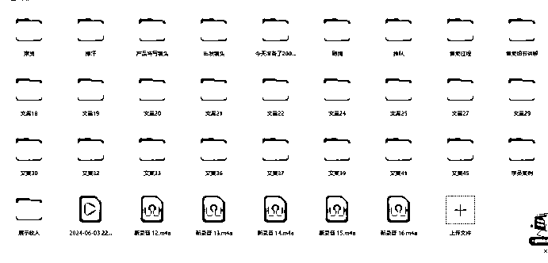

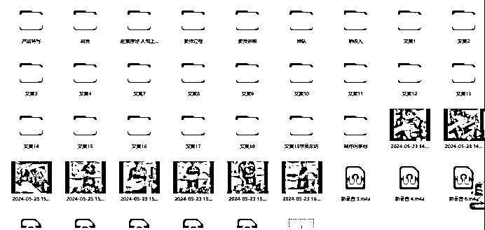

就这样第一个月，基本保证每天发布 1 条作品，发布第五条作品的时候就成交了一单。

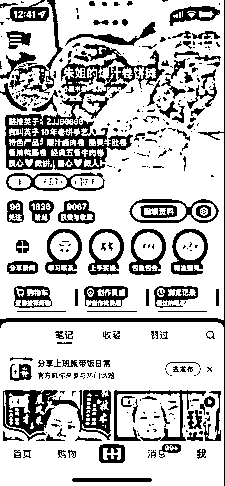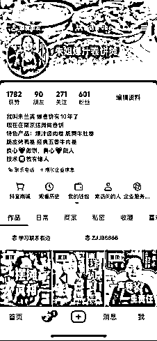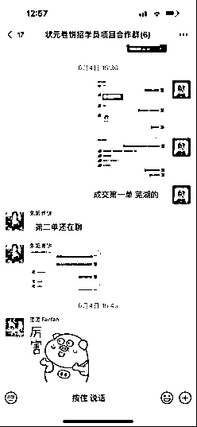

在第一个月里陆续成交了 5 单，客单价是 2180 一个人，按照之前跟老板谈的分成，一个学员他拿 1000 元，剩余的是给我这边，截止目前一个半月，成交了 9 单，每单分成是 1180，总计 10620 元（实际到手比这个少点，为了逼单，个别学员给了几百优惠），餐饮技术培训意向学员分为 3 种，第一种是强意向的，就是已经离职或者待业，准备开始摆摊做餐饮创业的，这类人加微后一周内成交，第二种是意向一般的，就是可能还在上班，考虑辞职创业做生意的，还在犹豫的，成交周期长一些，要 1~2 个月，第三类就是弱意向的，放在朋友圈慢慢养着，说不准哪天就突然交钱来学习。

每个加微咨询的，都是我聊的，所以比较清楚，为了提高效率，也做了标准话术，基本聊几句，我就能判断出意向强不强，按照 a b c 给分类好，a 类人群就会重点聊，解答她所有疑问和顾虑，尽量在 3 天内成交。b 类人群也会重点回复，但不急着逼单，c 类人群聊完先放着，然后通过朋友圈去营销。

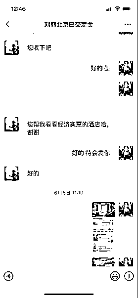

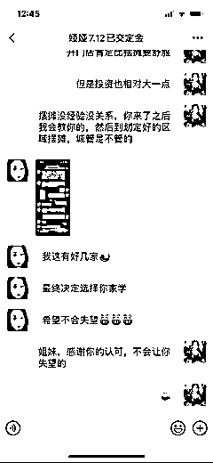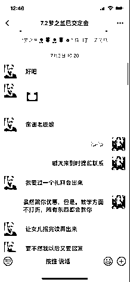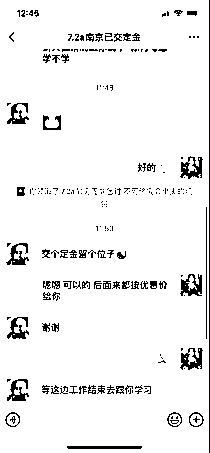

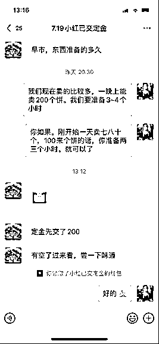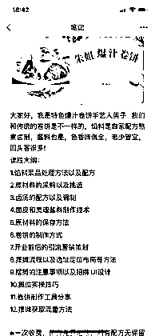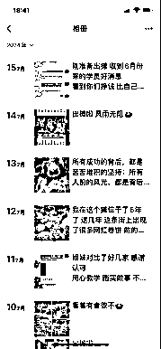

在文章开头我说过，卷饼这个品有个缺点，缺点就是学费收不高，抖音上有人收 1000 多，也有人收几百，而像金汤热卤、麻辣羊蹄、旋转烤鱼这些肉类的品，客单价能收到 3980~6980，所以说选品很重要，会直接影响最终收益，付出同样的精力，收益会差好几倍。所以 7 月份，我在复制第二个品的时候，选择了热卤，目前刚开始做，这里就不展开说了。

接下来的主要任务就是做大流量，只有触达到更多的人群，才能收到更多的学员，用目标倒退现在要做的事，接下来目标是卷饼项目单月收 30 个学员，按照 5%的行业转化率，一个月需要引流 600 人到微信，那一天就是要稳定 20 人左右，那就要围绕这个目标做流量，要么增加账号，要么开启直播获客。单月 30 个学员还是有信心的，因为我看到一些优秀的操盘团队，单月过百的学员也很多，只不过他们做的早，然后做的更细致，永远保持学习心态，向有结果的人学习。

同时在纵向复制项目，一边谈新项目，一边培养餐饮流量操盘手，带去项目现场教如何拍摄，然后如何写文案如何剪辑等等，为后面的项目培训操盘手，从个人单打独斗往团队化方向发展。

关于小餐饮技术培训行业的几点思考：

1\. 餐饮技术培训，在抖音上，从 18 年开始发展到现在，大体经历了 3 个阶段，第一阶段我称之为蛮荒阶段，那时餐饮老板不知道可以通过短视频可以招学员，也没有所谓的餐饮流量机构和操盘手，餐饮老板发自己家的菜品以及顾客排队，就会吸引很多人咨询学习，无意中猜中了风口。第二个阶段就是一些做流量的个人发现餐饮技术培训是个风口项目，下场去做，去招餐饮老板合作或者自己摆摊或开店去招学员和加盟。那时候只要懂些流量，就能拿到不错的结果，拍摄的内容也很简单。第三阶段就是到今年，平台流量进入内卷，需要更加专业的流量能力、更加有质量的内容才能拿到结果，不仅拼做内容能力也开始拼 IP 拼具体培训的产品，比如从去年火爆到今年的 6 元麻辣羊蹄培训项目，几个人的小团队，一年收了将近 1000 万培训费，就是一个团队操盘能力、产品（麻辣羊蹄很新颖）以及 IP（面相实在）都很好的情况下拿到的结果。

2\. 餐饮技术培训，除了赚培训费之外，还可以赚后端供应链的钱，做好学员交付，让更多学员回去后能干起来，这样就有源源不断的学员从这边拿料包，可以持续赚钱。有团队这块做的很好。

3\. 目前这个行业主流玩法有这 2 种，适合不同的情况，第一种就是像我这样的独立操盘手，适合找餐饮商家合作，我只负责专注做流量就行。一个人一部手机就可以开始干。第二种是全案操盘，适合有资金的团队，全案操盘是指自己选品选 IP，然后去摆摊或者开店，先把同城流量做起来，营业额做上去，然后再去招收学员，这种投入成本大一些，风险也大一些，如果你没有餐饮流量操盘经验，没有资金，没有大的把握，不建议这样去做，当然全案操盘的好处是所有环节可控，利益也能最大化。不管是第一种还是第二种，都有单月过百万的，而且不止一两个。

4\. 我能在短期内跑通 0 到 1，除了自己摸索之外，也在不断向优秀的餐饮流量操盘团队学习，不断总结试错，实践中提升做流量能力。而不是找找对标账号，看他怎么拍就怎么拍，就能做好。这是我边学习边实操总结的餐饮流量手册以及项目调研表。

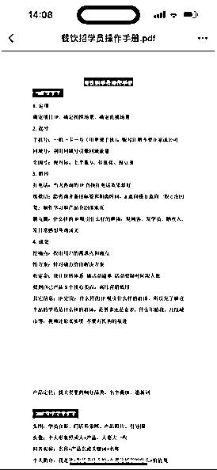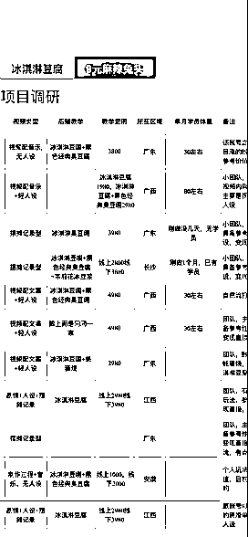

5.一些人在说平台流量越来越难做，越来越卷了，我觉得卷的不是流量，而是内容创作能力，抖音是个最公平的平台，谁的内容好就给谁流量，从这点看，只要你肚子里有货，什么时候去做都不晚。重要的是想好了就执行，3 分的开始好过只想不做。

好了，分享就到这里，分享的内容只是我个人做这个项目后对这个行业的了解和看法，也不一定完全对，欢迎大家互相交流。

感谢生财，在做流量过程中，遇到一些专业问题，我都会先在生财里找答案，比如小红书如何安全引流如何投聚光，抖音如何打造人设 IP，私域如何经营如何提升成交率等等，这些内容都有优秀圈友深度分享过，也只有在生财能看到深度的回答，这些内容，单拿出来，很多抖音上的商业博主都能卖大几千的线下课。加入生财帮我省了很多钱，哈哈，再次感谢！

* * *

评论区：

哄哄 : 海哥厉害[强][强][强]

* * *