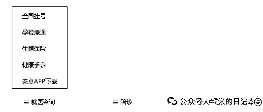

# 全自媒体平台，陪诊账号调研（1）

> 原文：[`www.yuque.com/for_lazy/zhoubao/ubg5eq73kzefq6zo`](https://www.yuque.com/for_lazy/zhoubao/ubg5eq73kzefq6zo)

## (10 赞)全自媒体平台，陪诊账号调研（1）

作者： 糯米

日期：2024-07-23

**糯米认为，作为陪诊行业的操盘手，一定要掌握最新的行业动向，其中就包含了陪诊自媒体获客，即**

陪诊行业，近期大家都是在怎么通过各种自媒体平台获客，获客做得怎么样，都在怎么玩耍？

这篇文章我连续写了好几天了，一直没写完，心想这也不是个事儿，因此昨晚我决定拆分发布

今天我们先来聊一下微信生态下的陪诊内容获客

微信生态包含了哪些平台呢？

1.公众号

2.视频号

3.问一问

4.小程序

（其实还有一些细分，后面我来讲）

首先是**公众号**，糯米先给结论

大部分陪诊公众号流量缺缺，有一股脑发些低分，难以传播的专家信息的；有不停发一些高端医疗专业话题的；有发一些自己的陪诊服务广告的，基本上这些类型的流量都不好，最多不过 200 阅读量，而且大部分是断更了的

但不是所有账号流量都不好的，有一部分陪诊账号流量不错的，但原因大多是因为他们注册了一两年甚至更久，有过积累，而且做内容能力不差，懂得坚持，内容都是有传播性的泛健康内容

在公众号范围内，以“陪诊”词条搜索出来的内容是这样的

我从搜索到的公众号一个个往下去看，逐步分析，有几个点是我重点要看的

1.公众号注册时间

2.发了多少篇文章

3.文章阅读量如何，点赞转发如何（有些内容的阅读量是靠大量刻意转发堆出来的）

4.看阅读量好的选题是什么

5.看阅读量高的账号整体阅读量如何

6.分析优质账号的主体，调性，定位

比如最开始这个全济，我记得很早就看到他们在铺抖音矩阵的，但是做得不太好，账号是多，但都没发什么内容，现在好像都销声匿迹了

看公众号，断更在了去年的 8 月，参考意义不大，而且原来能用的小程序都没了（显示在维护）

**注册时间 2022 年 12 月 30 日（蓝 v），也就发了 10 多篇内容，流量平均在几百阅读量，有一个 6000 多阅读量的内容，选题是靠谱的陪诊接单平台，整个账号调性是以企业身份，做行业科普**

然后是第二个，壹心陪诊师

也不知道怎么个号称 500+城市专业陪诊，大概率也是吹的，就算有那么多，估计也不会质量多高（如果陪诊师质量高，我在医药行业的圈子不可能一点点都不知道的）

**注册时间 2024 年 1 月 6 日，也是公司主体，但是没有认证，没有蓝 v，只发了几篇内容，停更在了 4 月，平均流量在 100 左右，最好的内容流量 188，选题是关于陪诊是什么，有什么好处，账号调性一样是陪诊行业科普**

这个是他们的小程序，看了一下，浓浓的营销广告气息（上面还有虚假的谁谁刚才下单了），做得很假

比较有意思的是，陪诊师入驻平台需要填写一些基础资料，而且入驻费用 129（我感觉这个小程序主要是薅这 129，顺带薅陪诊人力资源的，顺带接点单子）

他们的客服微信我也加了，聊下来觉得不很专业，服务态度也一般，定价是半天 300，按照 4 小时算，价格是偏高一点的，超时每小时加 80（以最近杭州的情况来看，这样的定价很难出单）

这里讲一个运营细节，**加时是大部分客户比较在意的**

因为这个东西相当于是一个导致最终费用不可控的因素，客户是没有安全感的，我们可以把加时收费标准定高一些，让客人紧迫起来，客人担心超时，就能在一线陪诊的时候更高效配合我们，以便我们能尽快完成服务

因为之前也有由于客户买断的是 4 小时服务，但 2 小时服务完成，客户不让走的，也有过程中客人不紧不慢的，结果最后超时了客人不干的

OK，我们继续

这个账号我有印象，也是多平台注册了的，其他平台好像没怎么更新，但在公众号平台，是相对来说更新得比较持续的，普遍流量比较朴素

**注册时间 2023 年 4 月注册，蓝 v，群发了 50 多次，每次 3-5 篇内容，持续在更新中，最近一次是在 7 月中，平均流量在 200 左右，最好的内容流量 2 千多，选题是关于想做陪诊的人进来看，账号调性会丰富一点，有行业科普，有自家广告，成绩背书，泛健康内容，政策新闻等等**

比较有趣的是，他们家的公众号菜单设置，比较全面，包含高价专病服务，医药资源，商城，to c 服务，to b 培训考证，甚至加盟，这些设计是可以在未来借鉴的

OK，最后我们再看一个账号

这个账号就很不错了，注册时间很早，流量也非常好，是会做内容，且会做泛健康内容的那种，坚持在更新（肯定有专门做这个内容的团队了）

这个账号确实也是有时间的护城河了，沉淀多年的粉丝积累，行业积累，而且他的主页菜单也设计得非常全，从中也能看出一些业务范围

这个平台跟医院的关系还是千丝万缕的，包含了大量的医院范围的服务，而且有自己的线上药房

**注册时间看不到，但是能看到这个公司的成立时间，很早了，2008 年，蓝 v，内容已经有 1566 篇原创了，起码是更新好几年了，而且持续在更新中，最近一次更新就是昨天，流量还非常好，10w+的第一栏内容，第二第三栏甚至都是上万的，账号调性会丰富一点，陪诊比较少，但是有丰富的养生，两性，健康等内容，做到这个程度，基本上只要在自己的领域范围内随便迎合大众需求即可了**

以上的这些账号，都是单独出现在对话框中的，并不在订阅号折叠内，属于的是企业号，一个月能群发 4 次，不知道是否企业号能流量加持，这个还需要调研

最后列举几个特别的例子吧

这边是杭州的几个同行，内容就如我最开始讲的，持续性非常好，但内容始终是凑数内容，很难打开流量，起码还没有开始刻意模仿大 v 的内容创作

由于篇幅有限，时间有限，今天糯米暂时分享这么多，明天我们继续分享视频号领域的陪诊内容/账号调研

* * *

评论区：

暂无评论

* * *