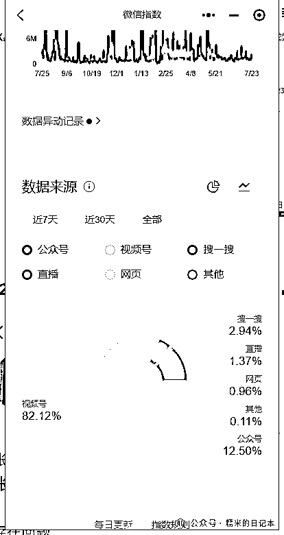

# 全自媒体平台，陪诊账号调研（2）

> 原文：[`www.yuque.com/for_lazy/zhoubao/gvu9crs4rzizdd8p`](https://www.yuque.com/for_lazy/zhoubao/gvu9crs4rzizdd8p)

## (9 赞)全自媒体平台，陪诊账号调研（2）

作者： 糯米

日期：2024-07-24

**糯米认为，作为陪诊行业的操盘手，一定要掌握最新的行业动向，其中就包含了陪诊自媒体获客，即**

陪诊行业，近期大家都是在怎么通过各种自媒体平台获客，获客做得怎么样，都在怎么玩耍？

今天我们来聊一下微信生态下的**视频号**陪诊内容获客，糯米先给结论

在视频号上做陪诊视频，目前，2024 年，是难以出头了，平台政策非常不友好。据我推测是有大量的内容和账号被平台机制隐藏，根本检索不出来（我自己的作品就是这样的），从显性数据看的话，陪诊领域的内容在视频号上几乎没有什么人更新了，近期一个月内更新的也就十多条，而且数据还都很差，有点数据的也都是行外人做的内容，比如保险从业者突然来的个别陪诊视频，或者行业揭秘博主探秘陪诊职业，整个平台能检索到的账号也就一百多个。

OK，现在我们细讲

根据微信指数来讲，陪诊这个词条在微信生态的关注度还是很大的，昨天的检索量，不论是否重复，达到了 200w，较 7/22 日增长了 58%，相当于 7/22 的检索量有 100w，这个检索量还是不少的

可能有人疑惑，我凭什么说这个数据直接等于检索次数？确实，微信指数的官方可没这么说，我是在百度上查询的结论（不一定靠得住）

那我们还能进一步佐证一下

这一组关键词的热度是差不多的，我们进一步看一下分布

如果将医药代表和陪诊两个词条放一起考虑，确实，两者均是小众词条，除了行内人，几乎很少有人会查询

整个微信生态的陪诊热度，和一些基础词条量相比，简直是拍马不及，具体的陪诊关注度容量可以类比医药代表这个关键词考虑，更深入的数据分析，糯米就不会了，我们继续

以上内容得出结论，视频号算是微信生态里，陪诊流量最大的端口，但是没什么内容，没什么垂直账号发力，大量的有不错数据的陪诊内容，还停留在 2023 年，究其原因还是因为平台的规章制度

对于这回事儿，平台是有明文规定的，陪诊内容不允许出现在账号，名字，简介，视频

陪诊内容也属于药品，医疗器械，医疗服务等这个范畴内

后面我给大家放了两个视频号的违规管理条例，大家有需要的可以自行查看，糯米反正看完平台的规则，深刻感觉视频号这边太变态了，完全参照标准执行，基本上没有纯绿色原创玩家之外的人什么事儿了

（ps.之前糯米去做游戏博主就是因为游戏领域的内容没啥管控）

[视频号健康医疗对外公约 (qq.com)](https://support.weixin.qq.com/cgi-bin/mmsupportacctnodeweb-bin/pages/CjOPllXfPz5wqzFQ)

[视频号常见违规内容概览 (qq.com)](https://weixin.qq.com/cgi-bin/readtemplate?lang=zh_CN&t=weixin_agreement&s=video_guide#1)

咱最后补充一下，经过糯米的不死心，慎重二次查访，目前能猥琐做出正常流量的是这种账号

完全不讲陪诊，但是蛛丝马迹暗示自己是在做陪诊的，讲的可能都是生活不易，画面都是衣食住行，极其隐晦的在视频内塞一点陪诊的画面，这样的个人生活类视频来搞流量

最后略举两个账号，大家参考

由于篇幅有限，时间有限，今天糯米暂时分享这么多，明天我们继续分享下一个领域的陪诊内容/账号调研

* * *

评论区：

暂无评论

* * *